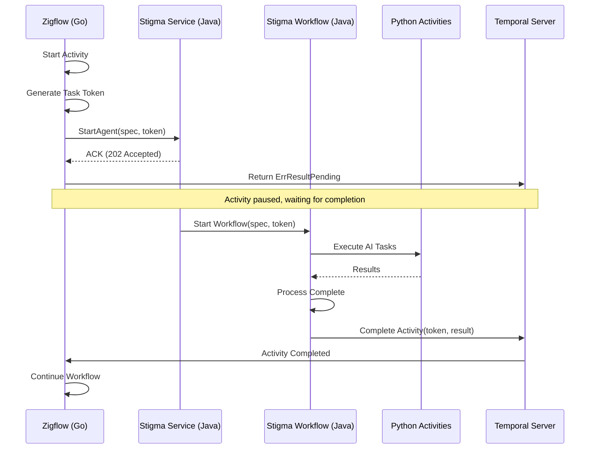

# Temporal Token Handshake - Async Agent Execution

**Created**: 2026-01-22  
**Status**: 🚧 Planning  
**Timeline**: 1 sprint/1 month (flexible for state-of-the-art solution)

## Overview

Integration of Stigma Agents (long-running operations) into Zigflow (serverless workflow engine) using Temporal's async activity completion pattern with token handshake mechanism.

## Problem Statement

Zigflow executes tasks synchronously. When we call the Stigma gRPC endpoint, the call returns "Success" immediately (ACK), causing Zigflow to move to the next state before the Agent actually finishes its work.

**Current Pain Points**:
- Zigflow moves to next state before Stigma Agent completes
- No way to wait for actual agent completion without blocking worker threads
- Worker thread resources wasted during long-running operations
- Poor resilience if services restart during agent execution
- Must support both direct gRPC calls and Zigflow workflow triggers

**The Challenge**: How do we make Zigflow wait for the actual completion of a Stigma Agent (which may run for minutes or hours) without blocking the worker thread?

## Goal

Implement the **Async Activity Completion Pattern** (Token Handshake) where Zigflow's Go Activity passes a Temporal Task Token to the Stigma Java Service and enters a "Pending" state. The Stigma Java Workflow will take responsibility for "calling back" (completing) that Go activity upon conclusion.

**Success Criteria** (7-Phase Implementation):
1. ✅ **Proto Definition**: Add `callback_token` field, regenerate code
2. ✅ **Zigflow (Go)**: Extract task token, pass to gRPC, return `ErrResultPending`
3. ✅ **Stigma Service (Java)**: Accept token, pass to workflow, return ACK
4. ✅ **Stigma Workflow (Java)**: Handle completion logic for both success and failure
5. ✅ **System Activity (Java)**: Implement completion using `ActivityCompletionClient`
6. ✅ **Testing**: Unit, integration, failure scenarios, performance tests
7. ✅ **Observability**: Metrics, alerts, logs, troubleshooting documentation

## Technology Stack

- **Go**: Zigflow (workflow engine)
- **Java**: Stigma Orchestrator (workflow definitions)
- **Python**: Stigma Workers (AI task execution)
- **Temporal**: Workflow orchestration platform
- **Protobuf/gRPC**: Inter-service communication

## Architecture

## Components Affected

- `apis/*/proto/` - Proto definitions (add `callback_token` field)
- Zigflow activities (Go) - Token extraction and passing
- Stigma gRPC service (Java) - Token acceptance and workflow start
- Stigma workflows (Java) - Completion logic
- System activities (Java) - `ActivityCompletionClient` implementation
- Tests (Go, Java, Python) - Comprehensive test coverage
- Monitoring/Observability - Metrics, alerts, dashboards

## Dependencies

- Temporal SDK (Go) - `activity.GetInfo(ctx).TaskToken`, `activity.ErrResultPending`
- Temporal SDK (Java) - `ActivityCompletionClient`
- Protobuf compiler - Proto regeneration
- Existing Zigflow service - Go codebase
- Existing Stigma services - Java orchestrator, Python workers

## Risks & Mitigation

| Risk | Impact | Probability | Mitigation |
|------|--------|-------------|------------|
| Token lost/corrupted | Activity hangs forever | Low | Set `StartToCloseTimeout`, monitoring alerts |
| Java service crashes before completion | Activity times out | Medium | Temporal retries workflow, completion in `finally` block |
| Token passed to wrong service | Wrong activity completed | Low | Validate token format, add namespace prefix |
| Performance overhead | Slight latency increase | High (acceptable) | Measure and document (< 100ms overhead) |
| Debugging "pending" activities | Increased troubleshooting time | Medium | Comprehensive logging, Temporal UI visibility |

## Benefits

✅ **Correctness**: Zigflow correctly waits for actual agent completion, not just gRPC ACK
✅ **Resilience**: If Stigma Service restarts, Zigflow workflow remains safely paused. Token is durable.
✅ **Decoupling**: Zigflow (Go) doesn't need to know about Python queues or internal logic
✅ **Scalability**: Go activity worker thread is not blocked during long-running execution
✅ **Backward Compatibility**: Direct gRPC calls (without token) continue to work
✅ **Observability**: Both Zigflow and Stigma workflows appear in Temporal UI

## Implementation Phases

### Phase 1: Proto Definition (Days 1-2)
- Add `callback_token` field to `StartAgentRequest`
- Regenerate Go and Java proto files
- Update proto documentation
- Set appropriate timeouts

### Phase 2: Zigflow (Go) (Days 3-4)
- Update `ExecuteAgent` activity to extract task token
- Pass token in gRPC request
- Return `activity.ErrResultPending`
- Add logging for token (Base64 encoded)
- Set `StartToCloseTimeout` (24 hours)

### Phase 3: Stigma Service (Java) (Days 5-6)
- Update `startAgent` RPC handler to accept token
- Pass token to workflow as argument
- Return immediate ACK
- Add error handling

### Phase 4: Stigma Workflow (Java) (Days 7-9)
- Add `byte[] callbackToken` parameter to workflow signature
- Add completion logic at end of workflow
- Handle both success and failure paths
- Add logging for token operations
- Ensure determinism

### Phase 5: System Activity (Java) (Days 10-11)
- Create `SystemActivities` interface with completion methods
- Implement using `ActivityCompletionClient`
- Add error handling and logging
- Register activity worker
- Test token completion

### Phase 6: Testing (Days 12-15)
- Unit test: Zigflow activity with mock token
- Unit test: Java workflow with mock completion client
- Integration test: Full flow with real Temporal
- Failure test: Timeout scenario
- Failure test: Token corruption
- Performance test: Multiple concurrent agents
- Load testing

### Phase 7: Observability (Days 16-18)
- Add metrics for pending activities
- Add alerts for stuck activities (> 24 hours)
- Add logs at each handoff point
- Document troubleshooting procedures
- Create monitoring dashboard
- Write runbook for operations

### Phase 8: Documentation & Handoff (Days 19-21)
- Update architecture documentation
- Write developer guide
- Create operator runbook
- Record demo video
- Knowledge transfer session

## Reference

- **ADR**: `/Users/suresh/scm/github.com/stigmer/stigmer/docs/adr/20260122-async-agent-execution-temporal-token-handshake.md`
- **Temporal Async Completion**: https://docs.temporal.io/activities#asynchronous-activity-completion
- **Temporal Activity Tokens**: https://docs.temporal.io/activities#activity-tokens
- **Temporal Java SDK**: https://www.javadoc.io/doc/io.temporal/temporal-sdk/latest/io/temporal/client/ActivityCompletionClient.html
- **Temporal Go SDK**: https://pkg.go.dev/go.temporal.io/sdk/activity#ErrResultPending

## Progress Tracking

See `tasks/` directory for detailed task breakdown and progress.

Current task: See `next-task.md`

## Alternatives Considered (Rejected)

1. **Polling**: Wastes resources, adds latency, no built-in timeout
2. **Message Queue Callback**: Adds operational complexity, Temporal already provides this
3. **Synchronous RPC**: Blocks worker thread, poor resource utilization, no resilience

**Why Async Token Handshake Wins**: Purpose-built for this use case, battle-tested, proper timeout handling, survives restarts, doesn't waste resources.
