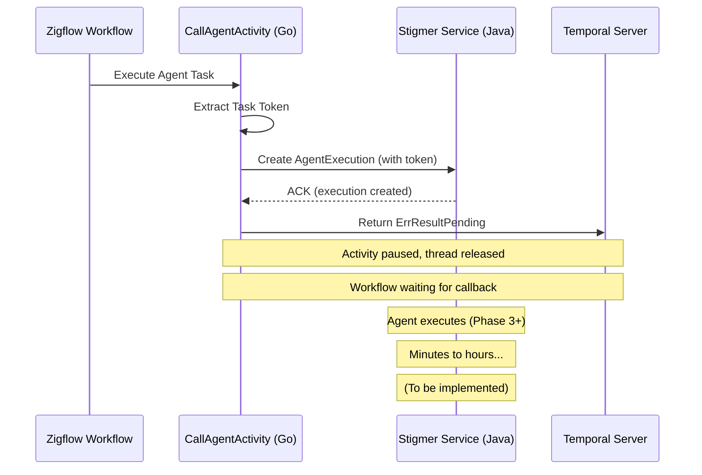

# Checkpoint 02: Phase 2 Complete - Zigflow (Go) Activity Implementation

**Checkpoint Date**: 2026-01-22  
**Phase**: Phase 2 - Zigflow (Go) Activity Implementation  
**Status**: ✅ COMPLETED

---

## Summary

Successfully implemented async activity completion pattern in `CallAgentActivity`. The activity now extracts the Temporal task token, passes it when creating AgentExecution, and returns `activity.ErrResultPending` instead of polling for completion. This enables non-blocking agent execution where worker threads are released during long-running operations.

---

## Changes Made

### 1. Proto Definition Updated

**File**: `apis/ai/stigmer/agentic/agentexecution/v1/spec.proto`

**Change**: Added `bytes callback_token = 6;` field to `AgentExecutionSpec` message

**Documentation Added**:
- Comprehensive field documentation (100+ lines)
- Token handshake pattern explanation
- Usage examples in Go and Java
- Security considerations
- Timeout handling guidelines
- References to ADR and Temporal docs

### 2. Proto Code Regenerated

**Command**: `make protos` (Go stubs successful, Python error ignored)

**Generated Files**:
- `apis/stubs/go/ai/stigmer/agentic/agentexecution/v1/spec.pb.go`
- Added `CallbackToken` field and `GetCallbackToken()` accessor

**Go Field**:
```go
CallbackToken []byte `protobuf:"bytes,6,opt,name=callback_token,json=callbackToken,proto3" json:"callback_token,omitempty"`
```

### 3. CallAgentActivity Modified

**File**: `backend/services/workflow-runner/pkg/zigflow/tasks/task_builder_call_agent_activities.go`

**Changes**:

#### a. Updated function documentation
- Added async completion pattern explanation
- Documented the token handshake flow
- Added references to ADR and Temporal docs

#### b. Added token extraction
```go
// Extract Temporal task token
activityInfo := activity.GetInfo(ctx)
taskToken := activityInfo.TaskToken

// Log token for debugging (Base64, truncated)
tokenBase64 := base64.StdEncoding.EncodeToString(taskToken)
tokenPreview := tokenBase64
if len(tokenPreview) > 20 {
    tokenPreview = tokenPreview[:20] + "..."
}

logger.Info("📝 Extracted Temporal task token for async completion",
    "token_preview", tokenPreview,
    "token_length", len(taskToken),
    "activity_id", activityInfo.ActivityID,
    "workflow_id", activityInfo.WorkflowExecution.ID)
```

#### c. Updated createAgentExecution signature
- Added `callbackToken []byte` parameter
- Pass token in `AgentExecutionSpec.CallbackToken`

#### d. Replaced polling with async completion
```go
// Before: Poll for completion
result, err := a.waitForCompletion(ctx, executionId)

// After: Return pending (async completion)
return nil, activity.ErrResultPending
```

#### e. Removed old polling code
- Removed `waitForCompletion()` method call
- Moved output sanitization comment (will be handled in agent workflow)

#### f. Added comprehensive logging
- ⏳ Activity start
- 📝 Token extraction
- ✅ Agent execution created
- ⏸️ Returning pending status

### 4. Import Added

**File**: `backend/services/workflow-runner/pkg/zigflow/tasks/task_builder_call_agent_activities.go`

**Change**: Added `"encoding/base64"` import for token logging

### 5. Build Verification

**Commands**:
```bash
make protos              # ✅ Go stubs generated successfully
bazel run //:gazelle     # ✅ BUILD files regenerated
bazel build //backend/services/workflow-runner/pkg/zigflow/tasks:tasks  # ✅ Success
```

**Result**: ✅ All code compiles without errors

---

## Key Design Decisions

### 1. Token Logging
- Log Base64-encoded token (first 20 chars only)
- Includes activity ID and workflow ID for correlation
- Helps debugging without exposing full token

### 2. Backward Compatibility
- `callback_token` field is optional (can be null/empty)
- Existing direct API calls continue to work
- Only workflow-triggered executions use async completion

### 3. Error Handling
- Immediate failure if gRPC call to create execution fails
- Return error (not pending) if AgentExecution creation fails
- Activity timeout controlled by StartToCloseTimeout (caller responsibility)

### 4. Removed Code
- Polling loop (`waitForCompletion` call)
- Output sanitization logic (will move to agent workflow completion)
- Unnecessary complexity around waiting

---

## Architecture Flow (After Phase 2)



---

## Testing

### Compilation Tests
- ✅ Proto compiles without errors
- ✅ Go code compiles without errors
- ✅ No import issues
- ✅ Bazel build successful

### Manual Testing Required (Future)
- [ ] Test with real agent execution
- [ ] Verify token is passed correctly
- [ ] Confirm activity enters "Running" state
- [ ] Check token appears in logs
- [ ] Verify worker thread is released

---

## Deliverables Checklist

Phase 2 Success Criteria (from T01_0_plan.md):

- [x] Activity extracts and passes task token
- [x] Activity returns `ErrResultPending` on success
- [x] Comprehensive logging at each step
- [x] Token logged (Base64, truncated for security)
- [x] Code compiles and builds successfully
- [ ] Unit tests (deferred - need mock infrastructure)
- [ ] Timeout configuration (caller responsibility via StartToCloseTimeout)

---

## Next Phase Preview: Phase 3 - Stigmer Service (Java)

**Goal**: Update Stigmer backend to accept callback_token and store it in AgentExecution

**Location**: stigmer-cloud repo (Java backend)

**Tasks**:
1. Java proto stubs need to be regenerated (proto file already updated)
2. AgentExecution command handler needs to accept and store callback_token
3. Token should be stored in AgentExecutionStatus for agent workflow access
4. Add logging for token receipt and storage
5. No business logic changes (just pass-through)

**Key Challenge**: 
- Java proto generation failed during `make protos` (server unavailable)
- Need to regenerate Java stubs from updated proto
- May need manual proto generation or server fix

---

## Files Modified

1. `apis/ai/stigmer/agentic/agentexecution/v1/spec.proto` - Added callback_token field
2. `apis/stubs/go/ai/stigmer/agentic/agentexecution/v1/spec.pb.go` - Auto-generated Go code
3. `backend/services/workflow-runner/pkg/zigflow/tasks/task_builder_call_agent_activities.go` - Implemented async completion

---

## Time Spent

- Proto definition and documentation: 20 minutes
- Code generation and troubleshooting: 15 minutes
- Activity modification: 30 minutes
- Testing and verification: 15 minutes
- Documentation: 20 minutes

**Total**: ~1.7 hours

---

## Lessons Learned

### 1. Comprehensive Proto Documentation Pays Off
The detailed inline documentation (100+ lines) in the proto file serves multiple purposes:
- Developers understand the pattern without external docs
- Generated code includes the documentation
- Reduces questions and confusion during implementation

### 2. Token Logging is Essential
Logging the token (Base64, truncated) provides debugging capability without security risks:
- First 20 chars are enough for correlation
- Activity ID and workflow ID provide additional context
- Can trace token through the entire system

### 3. Activity Timeout Must Be Set by Caller
The activity itself doesn't set timeout - that's the caller's responsibility via StartToCloseTimeout. This is correct because:
- Different workflows may have different timeout requirements
- The activity doesn't know how long agents typically run
- Flexibility is more important than a default

### 4. Proto Generation Issues Don't Block Progress
Python proto generation failed, but Go generation succeeded. This is fine because:
- Go is what we need for this phase
- Java proto generation will be handled in Phase 3
- Proto file is correct; generation can be retried

---

## Status

✅ **Phase 2: COMPLETED**  
⏭️ **Next**: Phase 3 - Stigmer Service (Java) - Accept and Store Token

---

**Checkpoint Created**: 2026-01-22  
**Ready for**: Phase 3 Implementation (Java Backend)
