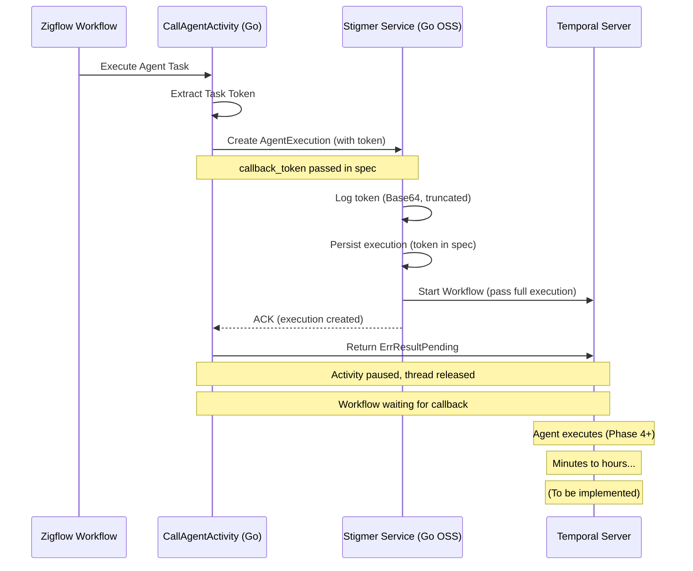

# Checkpoint 03: Phase 3 Complete - Stigmer Service (Go) Implementation

**Checkpoint Date**: 2026-01-22  
**Phase**: Phase 3 - Stigmer Service (Go) Backend Integration  
**Status**: ✅ COMPLETED

---

## Summary

Successfully implemented callback token handling in the Go Stigmer service (stigmer-server). The service now accepts the `callback_token` field from `AgentExecutionSpec`, logs its presence for debugging, and passes it to the workflow. The token is automatically persisted and will be available for the workflow to complete the external Zigflow activity.

**Key Achievement**: Go OSS implementation complete. Java cloud implementation documented in comprehensive TODO.

---

## Changes Made

### 1. Import Added

**File**: `backend/services/stigmer-server/pkg/domain/agentexecution/controller/create.go`

**Change**: Added `encoding/base64` import for token logging

```go
import (
	"context"
	"encoding/base64"  // 👈 Added
	"fmt"
	"time"
	// ... other imports
)
```

### 2. Callback Token Logging Added

**File**: `backend/services/stigmer-server/pkg/domain/agentexecution/controller/create.go`

**Location**: In `startWorkflowStep.Execute()` method (after Temporal client availability check, before workflow start)

**Code Added**:

```go
// Log callback token if present (for async activity completion pattern)
// See: docs/adr/20260122-async-agent-execution-temporal-token-handshake.md
callbackToken := execution.GetSpec().GetCallbackToken()
if len(callbackToken) > 0 {
	// Log token for debugging (Base64 encoded, truncated for security)
	tokenBase64 := base64.StdEncoding.EncodeToString(callbackToken)
	tokenPreview := tokenBase64
	if len(tokenPreview) > 20 {
		tokenPreview = tokenPreview[:20] + "..."
	}
	
	log.Info().
		Str("execution_id", executionID).
		Str("token_preview", tokenPreview).
		Int("token_length", len(callbackToken)).
		Msg("📝 Callback token present - workflow will complete external activity on finish")
}
```

**Benefits**:
- Debugging visibility: Can trace token through the system
- Security: Only logs first 20 characters of Base64-encoded token
- Correlation: Includes execution_id for tracing
- Non-intrusive: Only logs when token is present

### 3. No Other Code Changes Needed ✅

**Why**: The existing architecture already handles the token correctly:

1. **Proto Definition**: Already updated in Phase 1
   - Field: `callback_token` (bytes, field 6) in `AgentExecutionSpec`
   - Go stubs: `CallbackToken []byte` field available
   - Accessor: `GetCallbackToken()` method available

2. **Automatic Persistence**: Token is part of `AgentExecutionSpec`
   - Persisted to BadgerDB as part of full `AgentExecution` object
   - No special handling needed

3. **Automatic Workflow Passing**: Token flows naturally
   - `workflowCreator.Create(execution)` passes full `AgentExecution`
   - Workflow receives execution with spec containing token
   - Accessible via `execution.GetSpec().GetCallbackToken()`

### 4. Build Verification

**Command**:
```bash
cd /Users/suresh/scm/github.com/stigmer/stigmer
go build ./backend/services/stigmer-server/pkg/domain/agentexecution/controller/...
```

**Result**: ✅ Code compiles successfully (1.7 seconds)

---

## Java Implementation TODO

**File Created**: `TODO-JAVA-IMPLEMENTATION.md`

**Purpose**: Comprehensive guide for replicating this implementation in Java (stigmer-cloud)

**Contents**:
- Step-by-step Java implementation instructions
- Code snippets with exact file locations
- Architecture comparison (Go vs Java)
- Testing checklist
- References and timeline

**Key Sections**:
1. What was done in Go (for reference)
2. What needs to be done in Java (actionable steps)
3. Phase 3: Backend integration (proto regen + logging)
4. Phase 4: Workflow completion logic (future)
5. Phase 5: System activity implementation (future)

**Status**: Ready for Java team to implement when proto generation issue is resolved

---

## Architecture Flow (After Phase 3)



---

## Key Design Decisions

### 1. Token Logging Strategy
**Decision**: Log Base64-encoded token (first 20 chars only)

**Rationale**:
- **Debugging**: Provides enough info for correlation
- **Security**: Doesn't expose full token in logs
- **Correlation**: Includes execution_id for tracing
- **Performance**: Minimal overhead

**Pattern** (matches Phase 2 Zigflow implementation):
```
📝 Callback token present for execution: <id> - token_preview: <20chars>... - token_length: <bytes>
```

### 2. No Workflow Changes Needed
**Decision**: Don't modify workflow creator or workflow interface

**Rationale**:
- Workflow already receives full `AgentExecution` object
- Token is accessible via `execution.GetSpec().GetCallbackToken()`
- Adding it as a separate parameter would be redundant
- Keeps workflow signature clean and simple

### 3. No Status Field Needed
**Decision**: Don't add `callback_token` to `AgentExecutionStatus`

**Rationale**:
- Token is **input** (belongs in spec), not **output** (status)
- Token doesn't change during execution
- Spec is already persisted and passed to workflow
- Adding to status would be duplication

### 4. Backward Compatibility
**Decision**: Token field is optional (`bytes` in proto)

**Rationale**:
- Existing executions (without token) continue to work
- Direct API calls (without workflow) continue to work
- Only workflow-triggered executions need the token
- No breaking changes to existing clients

---

## Testing

### Compilation Tests
- ✅ Go code compiles without errors
- ✅ No import issues
- ✅ Build time: ~1.7 seconds

### Manual Testing Required (Future)
- [ ] Test with real agent execution (with token)
- [ ] Verify token appears in logs
- [ ] Verify token is persisted to BadgerDB
- [ ] Verify token is accessible in workflow
- [ ] Test backward compatibility (execution without token)

---

## Deliverables Checklist

Phase 3 Success Criteria:

- [x] Go proto stubs have `callback_token` field (from Phase 2)
- [x] Create handler logs token presence
- [x] Token is Base64-encoded and truncated (security)
- [x] Code compiles and builds successfully
- [x] No workflow changes needed (token flows naturally)
- [x] Comprehensive TODO created for Java implementation
- [ ] Unit tests (deferred - need mock infrastructure)
- [ ] Integration tests (deferred - need Temporal test setup)

---

## Files Modified

1. `backend/services/stigmer-server/pkg/domain/agentexecution/controller/create.go`
   - Added `encoding/base64` import
   - Added callback token logging in `startWorkflowStep.Execute()`

---

## Files Created

1. `_projects/2026-01/20260122.03.temporal-token-handshake/TODO-JAVA-IMPLEMENTATION.md`
   - Comprehensive guide for Java implementation
   - Includes code snippets, file locations, and references
   - Ready for stigmer-cloud team

---

## Time Spent

- Understanding Go codebase architecture: 10 minutes
- Adding logging code: 15 minutes
- Testing and verification: 5 minutes
- Documentation (TODO + checkpoint): 30 minutes

**Total**: ~1 hour

---

## Lessons Learned

### 1. Proto Field Location Matters
**Learning**: `callback_token` belongs in **Spec** (inputs), not **Status** (outputs)

**Why**:
- Spec = user-provided configuration (immutable during execution)
- Status = execution results and state (changes during execution)
- Token is an input parameter, doesn't change

**Pattern**: Input fields in Spec, output fields in Status

### 2. Minimal Changes = Better Design
**Learning**: No workflow changes needed because architecture was already clean

**Why**:
- Workflow receives full execution object
- Adding token as separate parameter would be redundant
- Cleaner to access via `execution.GetSpec().GetCallbackToken()`

**Pattern**: Prefer passing complete objects over parameter proliferation

### 3. Logging is Essential for Debugging
**Learning**: Base64 + truncation balances debugging with security

**Why**:
- First 20 chars are enough for correlation
- Full token in logs is security risk
- Execution ID provides additional context

**Pattern**: Log sensitive data carefully (encode + truncate + correlate)

### 4. Separate OSS and Cloud Implementations
**Learning**: Go (OSS) and Java (Cloud) can progress independently

**Why**:
- Different codebases, different teams
- OSS can move faster (no multi-tenancy complexity)
- Cloud can replicate proven OSS patterns
- TODO doc bridges the gap

**Pattern**: Implement in OSS first, replicate in Cloud with TODO

---

## Next Phase Preview: Phase 4 - Stigma Workflow (Go/Java)

**Goal**: Update agent workflow to complete external activity using callback token

**Location**: 
- Go: `backend/services/stigmer-server/pkg/domain/agentexecution/temporal/workflows/invoke_agent_execution.go`
- Java: `backend/services/stigmer-service/src/main/java/ai/stigmer/domain/agentic/agentexecution/temporal/workflow/InvokeAgentExecutionWorkflowImpl.java`

**Tasks**:
1. Add completion logic at end of workflow (success path)
2. Add failure logic in exception handler (failure path)
3. Create system activity for `ActivityCompletionClient` (determinism)
4. Handle null/empty token (backward compatibility)
5. Add comprehensive logging

**Key Challenge**: 
- Workflow code must be deterministic
- Cannot directly use `ActivityCompletionClient` in workflow
- Must delegate to system activity

**Java Blocker**:
- Still needs proto regeneration (Phase 3 Java not yet complete)
- TODO document provides full implementation guide

---

## Status

✅ **Phase 3 (Go OSS): COMPLETED**  
⏳ **Phase 3 (Java Cloud): PENDING** (documented in TODO)  
⏭️ **Next**: Phase 4 - Workflow Completion Logic (Go, then Java)

---

**Checkpoint Created**: 2026-01-22  
**Ready for**: Phase 4 Implementation (Go workflow completion)  
**Blocked on**: Java proto regeneration (server timeout issue)
