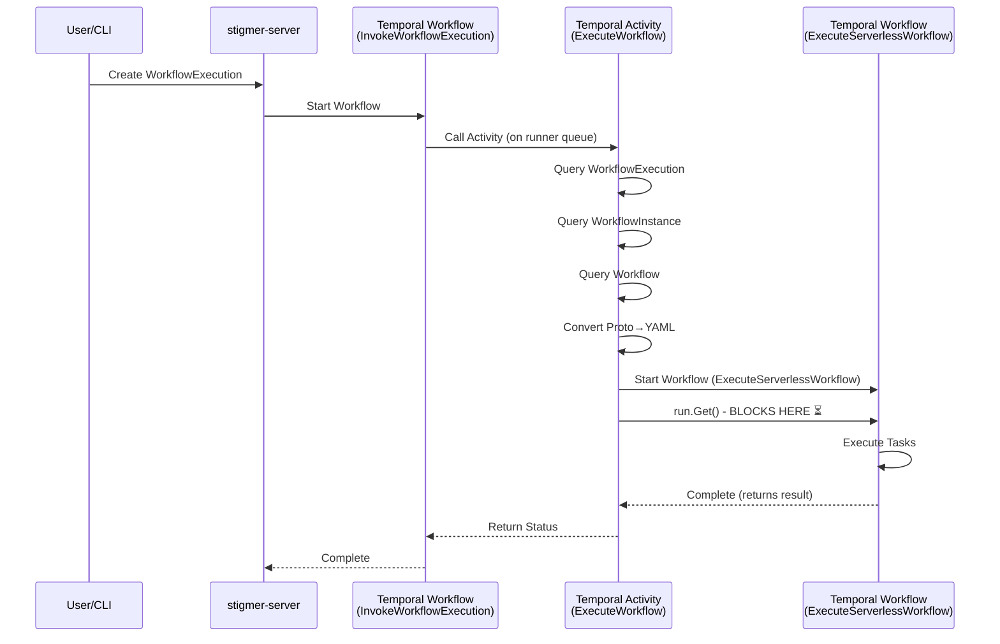
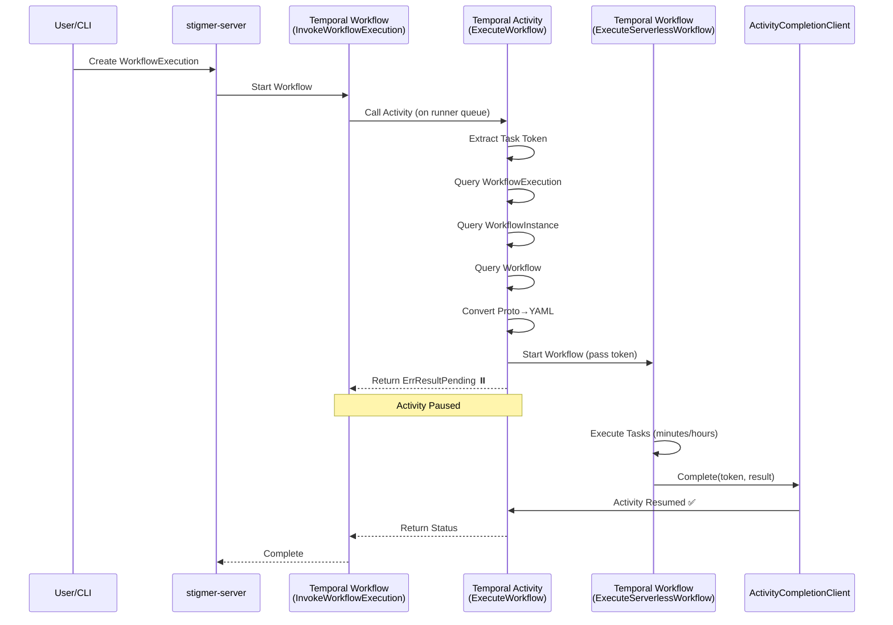

# Architecture Discovery: Temporal Token Handshake Implementation

**Date**: 2026-01-22  
**Status**: Discovery Complete

---

## Executive Summary

After deep code analysis, I've discovered the complete architecture flow and identified where the Temporal token handshake pattern needs to be implemented.

**Key Finding**: The token handshake needs to be implemented **within** the workflow-runner's `ExecuteWorkflowActivity`, where it currently waits for `ExecuteServerlessWorkflow` to complete.

---

## Architecture Overview

### Current Flow (Synchronous)



### Target Flow (Async with Token Handshake)



---

## Component Locations

### 1. stigmer-server (Orchestration)

**Location**: `backend/services/stigmer-server/pkg/domain/workflowexecution/temporal/`

**Workflow**: `InvokeWorkflowExecutionWorkflowImpl`
- **File**: `workflows/invoke_workflow_impl.go`
- **Queue**: `workflow_execution_stigmer`
- **Purpose**: Orchestrates workflow execution
- **Calls**: `ExecuteWorkflowActivity` on runner queue

**Activity Interface**: `ExecuteWorkflowActivity`
- **File**: `activities/execute_workflow.go`
- **Timeout**: 30 minutes
- **Interface**: Defines contract between workflow and activity

### 2. workflow-runner (Execution Engine)

**Location**: `backend/services/workflow-runner/`

**Activity Implementation**: `ExecuteWorkflowActivityImpl`
- **File**: `worker/activities/execute_workflow_activity.go`
- **Queue**: `workflow_execution_runner`
- **Purpose**: Executes Zigflow workflows
- **Current Issue**: Uses `run.Get()` which BLOCKS

**Zigflow Workflow**: `ExecuteServerlessWorkflow`
- **Queue**: `zigflow_execution`
- **Purpose**: Actual workflow task execution
- **Location**: TBD (need to find this workflow implementation)

---

## Problem Statement

### Current Implementation

The `ExecuteWorkflowActivity` currently:

```go
// Line 319-332: Start workflow
run, err := a.temporalClient.ExecuteWorkflow(ctx, workflowOptions, "ExecuteServerlessWorkflow", workflowInput)

// Line 339-356: BLOCKS waiting for completion ⏳
var workflowOutput types.TemporalWorkflowOutput
err = run.Get(ctx, &workflowOutput)  // ← BLOCKING CALL
```

**Problem**: The `run.Get()` call blocks the activity worker thread for the duration of the Zigflow workflow execution (which can be minutes to hours).

### Required Change

Replace the blocking wait with the async completion pattern:

```go
// Extract activity task token
activityInfo := activity.GetInfo(ctx)
taskToken := activityInfo.TaskToken

// Start workflow and pass token
workflowInput := &types.TemporalWorkflowInput{
    WorkflowExecutionID: executionID,
    WorkflowYaml:        workflowYAML,
    InitialData:         map[string]interface{}{},
    EnvVars:             runtimeEnv,
    OrgId:               execution.Metadata.Org,
    CallbackToken:       taskToken,  // ← NEW: Pass token
}

run, err := a.temporalClient.ExecuteWorkflow(ctx, workflowOptions, "ExecuteServerlessWorkflow", workflowInput)

// Return pending instead of waiting
return nil, activity.ErrResultPending  // ← NEW: Don't wait
```

---

## Implementation Plan for Phase 2

### Step 1: Update TemporalWorkflowInput

**File**: `backend/services/workflow-runner/pkg/types/types.go` (or wherever `TemporalWorkflowInput` is defined)

**Change**: Add `CallbackToken` field

```go
type TemporalWorkflowInput struct {
    WorkflowExecutionID string                 `json:"workflow_execution_id"`
    WorkflowYaml        string                 `json:"workflow_yaml"`
    InitialData         map[string]interface{} `json:"initial_data"`
    EnvVars             map[string]any         `json:"env_vars"`
    OrgId               string                 `json:"org_id"`
    CallbackToken       []byte                 `json:"callback_token,omitempty"`  // NEW
}
```

### Step 2: Modify ExecuteWorkflowActivity

**File**: `backend/services/workflow-runner/worker/activities/execute_workflow_activity.go`

**Changes**:
1. Extract task token at activity start (line ~105)
2. Pass token in workflowInput (line ~310-316)
3. Return `activity.ErrResultPending` instead of waiting (line ~341)
4. Add logging for token (Base64, truncated)

### Step 3: Update ExecuteServerlessWorkflow

**Need to find**: The workflow implementation that needs to complete the external activity

**Changes**:
1. Accept `CallbackToken` in input
2. On success: Complete external activity with result
3. On failure: Fail external activity with error
4. Use System Activity for completion (determinism)

### Step 4: Create SystemActivities

**File**: Create `backend/services/workflow-runner/worker/activities/system_activities.go`

**Purpose**: Implement activity completion using `ActivityCompletionClient`

**Methods**:
- `CompleteExternalActivity(token []byte, result interface{}) error`
- `FailExternalActivity(token []byte, err error) error`

---

## Architecture Insights

### Polyglot Pattern

The current architecture uses a "polyglot" pattern where:
- stigmer-server registers workflows (orchestration)
- workflow-runner registers activities (execution)
- Task queues route work to correct workers

This is already a sophisticated async pattern, but the **inner** workflow execution (`ExecuteServerlessWorkflow`) is still synchronous.

### Nested Workflows

The architecture has two levels of Temporal workflows:
1. **Outer**: `InvokeWorkflowExecutionWorkflow` (stigmer-server)
2. **Inner**: `ExecuteServerlessWorkflow` (workflow-runner)

The token handshake happens at the boundary between the activity and the inner workflow.

### Why This Design

The activity (`ExecuteWorkflow`) acts as a bridge between:
- The stigmer-server world (WorkflowExecution proto, persistence, API)
- The Zigflow world (YAML workflows, task execution)

By implementing the token handshake here, we avoid blocking activity workers during long-running Zigflow executions.

---

## Questions to Resolve

### Q1: Where is ExecuteServerlessWorkflow implemented?

**Need to find**: The workflow definition for `ExecuteServerlessWorkflow`

**Search strategy**: Look for workflow registration with name "ExecuteServerlessWorkflow" or workflow.RegisterOptions

### Q2: Should we add feature flag?

**Consideration**: Should we make the async pattern optional with a feature flag?

**Recommendation**: Yes, add `ENABLE_ASYNC_ACTIVITY_COMPLETION` env var
- Default: `true` (new behavior)
- Fallback: `false` (old blocking behavior for compatibility)

### Q3: Timeout configuration?

**Current**: Activity timeout is 30 minutes (line 55 in execute_workflow.go)

**Question**: Should this change for async pattern?

**Recommendation**: Increase to 24 hours for async mode

---

## Next Steps

1. ✅ Document architecture discovery
2. ⏭️ Find `ExecuteServerlessWorkflow` implementation
3. ⏭️ Update `TemporalWorkflowInput` type
4. ⏭️ Modify `ExecuteWorkflowActivity` to extract token
5. ⏭️ Implement token passing to inner workflow
6. ⏭️ Return `activity.ErrResultPending`
7. ⏭️ Create `SystemActivities` for completion
8. ⏭️ Update `ExecuteServerlessWorkflow` to complete external activity
9. ⏭️ Add comprehensive logging
10. ⏭️ Write unit tests

---

## References

- **ADR**: `docs/adr/20260122-async-agent-execution-temporal-token-handshake.md`
- **Proto Definition**: `apis/ai/stigmer/agentic/workflowrunner/v1/io.proto`
- **Activity Implementation**: `backend/services/workflow-runner/worker/activities/execute_workflow_activity.go`
- **Workflow**: `backend/services/stigmer-server/pkg/domain/workflowexecution/temporal/workflows/invoke_workflow_impl.go`

---

**Status**: Architecture understood, ready to implement Phase 2
