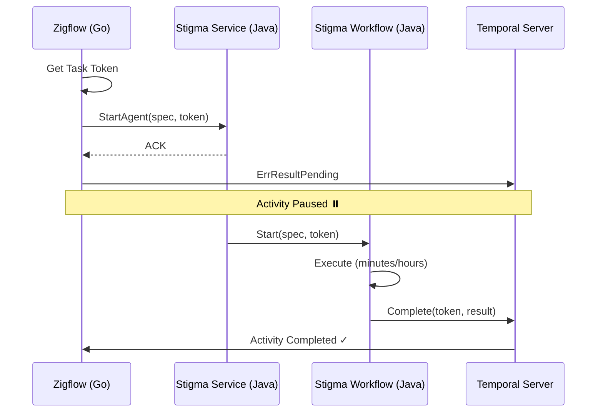

# Next Task - Temporal Token Handshake Project

**Project**: Temporal Token Handshake - Async Agent Execution  
**Location**: `_projects/2026-01/20260122.03.temporal-token-handshake/`  
**Status**: 🟢 IN PROGRESS  
**Last Updated**: 2026-01-22

---

## Quick Resume

**Drag this file into chat to resume work on this project.**

---

## Current Status

📋 **Phase**: Phase 3 - Stigmer Service (Java)  
📝 **Current Task**: T01.3 - Java Backend Integration (Phase 3 ready to start)  
✅ **Phase 1 Complete**: Proto definition with callback_token field  
✅ **Phase 2 Complete**: Zigflow (Go) Activity - Async completion implemented

---

## What We're Building

Temporal async activity completion pattern (token handshake) that:
- Enables Zigflow (Go) to wait for actual Stigma Agent completion without blocking worker threads
- Passes Temporal task token from Go → Java → completion callback
- Provides resilience, observability, and backward compatibility
- Handles agent workflows that run for minutes to hours

---

## Project Files

### Core Documents
- 📘 **Project Overview**: `_projects/2026-01/20260122.03.temporal-token-handshake/README.md`
- 📋 **Current Task Plan**: `_projects/2026-01/20260122.03.temporal-token-handshake/tasks/T01_0_plan.md`
- 📂 **All Tasks**: `_projects/2026-01/20260122.03.temporal-token-handshake/tasks/`

### Supporting Folders
- 🎯 **Checkpoints**: `_projects/2026-01/20260122.03.temporal-token-handshake/checkpoints/`
- 🏗️ **Design Decisions**: `_projects/2026-01/20260122.03.temporal-token-handshake/design-decisions/`
- 📏 **Coding Guidelines**: `_projects/2026-01/20260122.03.temporal-token-handshake/coding-guidelines/`
- ⚠️ **Wrong Assumptions**: `_projects/2026-01/20260122.03.temporal-token-handshake/wrong-assumptions/`
- 🚫 **Don't-Dos**: `_projects/2026-01/20260122.03.temporal-token-handshake/dont-dos/`

---

## Next Actions

### ▶️ Currently Working On: Phase 2 - Zigflow (Go) Activity

**Phase 1 Status**: ✅ COMPLETED
- Proto definition updated with `callback_token` field in WorkflowExecuteInput
- AgentExecutionSpec also updated with `callback_token` field
- Go code regenerated and compiling
- Comprehensive documentation added
- Checkpoint created: `checkpoints/CP01_phase1_complete.md`

**Phase 2 Status**: ✅ COMPLETED
- Found target: `CallAgentActivity` (replaces polling with async completion)
- Extracted Temporal task token from activity context
- Pass token when creating AgentExecution via `spec.CallbackToken`
- Return `activity.ErrResultPending` instead of polling
- Added comprehensive logging (Base64 token, truncated)
- Removed old polling code (`waitForCompletion`)
- Code compiles successfully
- Checkpoint created: `checkpoints/CP02_phase2_complete.md`

**Phase 3 Goals** (Java Backend - stigmer-cloud repo):
1. Regenerate Java proto stubs (proto file already updated)
2. Update AgentExecution command handler to accept `callback_token`
3. Store token in AgentExecutionStatus for agent workflow access
4. Add logging for token receipt and storage
5. No business logic changes (pass-through only)
6. Handle null/empty token gracefully (backward compatibility)

**Current Investigation**:
- Need to locate AgentExecution command handler in Java
- Java proto generation failed during `make protos` (server issue)
- May need to regenerate Java stubs manually or fix server

---

## High-Level Phases (Progress)

```
Phase 1: Proto Definition              (Days 1-2)    ✅ COMPLETED (Day 1 - 1.5 hours)
Phase 2: Zigflow (Go) Activity         (Days 3-4)    ✅ COMPLETED (Day 1 - 1.7 hours)
Phase 3: Stigma Service (Java)         (Days 5-6)    🚧 READY TO START
Phase 4: Stigma Workflow (Java)        (Days 7-9)    ⏳ NOT STARTED
Phase 5: System Activity (Java)        (Days 10-11)  ⏳ NOT STARTED
Phase 6: Testing                       (Days 12-15)  ⏳ NOT STARTED
Phase 7: Observability                 (Days 16-18)  ⏳ NOT STARTED
Phase 8: Documentation & Handoff       (Days 19-21)  ⏳ NOT STARTED
```

**Overall Progress**: 25% (2/8 phases complete)  
**Time Spent**: 3.2 hours  
**Ahead of Schedule**: Completed Phase 1 and 2 in 3.2 hours (estimated 4 days / ~32 hours)

---

## Key Architecture



---

## Key References

- **ADR Document**: `/Users/suresh/scm/github.com/stigmer/stigmer/docs/adr/20260122-async-agent-execution-temporal-token-handshake.md`
- **Temporal Async Completion**: https://docs.temporal.io/activities#asynchronous-activity-completion
- **Temporal Go SDK**: https://pkg.go.dev/go.temporal.io/sdk/activity#ErrResultPending
- **Temporal Java SDK**: https://www.javadoc.io/doc/io.temporal/temporal-sdk/latest/io/temporal/client/ActivityCompletionClient.html

---

## Success Criteria

- [ ] Zigflow correctly waits for actual agent completion (not just ACK)
- [ ] Worker threads are not blocked during agent execution
- [ ] System survives restarts (token is durable)
- [ ] Backward compatibility maintained (direct calls still work)
- [ ] Comprehensive tests (unit, integration, failure, performance)
- [ ] Production observability (metrics, alerts, logs, dashboards)
- [ ] Complete documentation (architecture, operations, troubleshooting)

---

## To Resume This Project

Simply drag this file (`next-task.md`) into the chat, and I'll:
1. Load the current state
2. Review progress
3. Continue from where we left off

---

**Current Status**: 🟢 Ready - Phase 3 (Java Backend Integration)  
**Last Checkpoint**: `checkpoints/CP02_phase2_complete.md`  
**Next Milestone**: Complete Phase 3 (Accept and store callback_token in Java)
