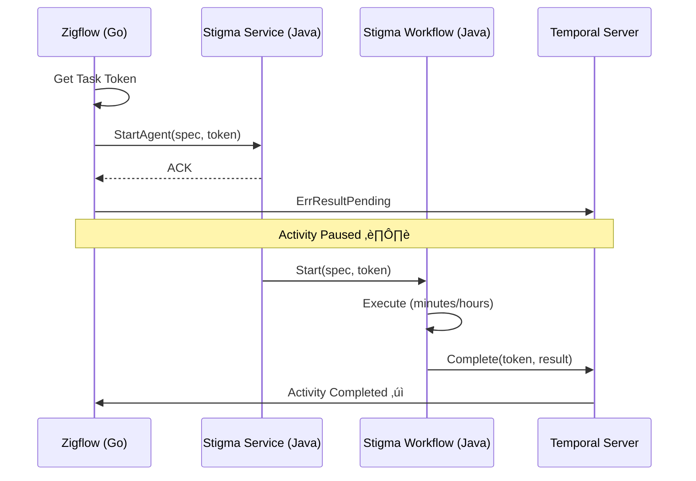

# Next Task - Temporal Token Handshake Project

**Project**: Temporal Token Handshake - Async Agent Execution  
**Location**: `_projects/2026-01/20260122.03.temporal-token-handshake/`  
**Status**: 🟢 IN PROGRESS  
**Last Updated**: 2026-01-22

---

## Quick Resume

**Drag this file into chat to resume work on this project.**

---

## Current Status

📋 **Phase**: Phase 6 - Integration Testing  
📝 **Current Task**: Ready for integration testing  
✅ **Phase 1 Complete**: Proto definition with callback_token field  
✅ **Phase 2 Complete**: Zigflow (Go) Activity - Async completion implemented  
✅ **Phase 3 Complete**: Stigmer Service (Go OSS) - Backend integration with logging  
✅ **Phase 4 Complete**: Stigma Workflow (Go OSS) - Completion logic on success/failure  
✅ **Phase 3-5 Complete (Java)**: stigmer-cloud implementation finished - backend, workflow, system activities

---

## What We're Building

Temporal async activity completion pattern (token handshake) that:
- Enables Zigflow (Go) to wait for actual Stigma Agent completion without blocking worker threads
- Passes Temporal task token from Go → Java → completion callback
- Provides resilience, observability, and backward compatibility
- Handles agent workflows that run for minutes to hours

---

## Project Files

### Core Documents
- 📘 **Project Overview**: `_projects/2026-01/20260122.03.temporal-token-handshake/README.md`
- 📋 **Current Task Plan**: `_projects/2026-01/20260122.03.temporal-token-handshake/tasks/T01_0_plan.md`
- 📂 **All Tasks**: `_projects/2026-01/20260122.03.temporal-token-handshake/tasks/`

### Supporting Folders
- 🎯 **Checkpoints**: `_projects/2026-01/20260122.03.temporal-token-handshake/checkpoints/`
- 🏗️ **Design Decisions**: `_projects/2026-01/20260122.03.temporal-token-handshake/design-decisions/`
- 📏 **Coding Guidelines**: `_projects/2026-01/20260122.03.temporal-token-handshake/coding-guidelines/`
- ⚠️ **Wrong Assumptions**: `_projects/2026-01/20260122.03.temporal-token-handshake/wrong-assumptions/`
- 🚫 **Don't-Dos**: `_projects/2026-01/20260122.03.temporal-token-handshake/dont-dos/`

---

## Next Actions

### ✅ Completed Phases (Go OSS Path)

**Phase 1**: ✅ COMPLETED (1.5 hours)
- Proto definition updated with `callback_token` field
- Go code regenerated and compiling
- Checkpoint: `checkpoints/CP01_phase1_complete.md`

**Phase 2**: ✅ COMPLETED (1.7 hours)
- Zigflow activity extracts token, returns ErrResultPending
- Comprehensive logging added
- Checkpoint: `checkpoints/CP02_phase2_complete.md`

**Phase 3**: ✅ COMPLETED (1.0 hour)
- Stigmer Service logs token, persists to workflow
- Token flows naturally via execution object
- Checkpoint: `checkpoints/CP03_phase3_complete_go.md`

**Phase 4**: ✅ COMPLETED (2.0 hours)
- Created CompleteExternalActivity system activity
- Workflow completes external activity on success/failure
- Worker registration with Temporal client initialization
- Checkpoint: `checkpoints/CP04_phase4_complete_go.md`

### ▶️ What's Next: Integration Testing & Beyond

**✅ IMPLEMENTATION COMPLETE**: Both Go OSS and Java Cloud implementations finished

**Next Phase: Integration Testing (Phase 6)**
- **Primary Goal**: Test end-to-end flow with real Zigflow → Stigma (Java) → Agent Execution
- Verify token handshake works correctly across language boundaries
- Test both success and failure paths
- Verify backward compatibility (executions without token)
- Check Temporal UI for activity completion/pending states
- Validate non-fatal error handling
- Monitor logs for token presence and previews

**Future Phases**:

**Phase 7: Observability**
- Add metrics for pending/completed external activities
- Create alerts for stuck activities (> timeout threshold)
- Enhanced logging and correlation IDs
- Grafana dashboards for token handshake monitoring
- Troubleshooting runbooks for operators

**Phase 8: Documentation & Handoff**
- Update ADR with implementation learnings and decisions
- Create developer integration guide (how to use from other services)
- Write operator runbook (troubleshooting, monitoring)
- Record demo video showing end-to-end flow
- Knowledge transfer session with team

---

## High-Level Phases (Progress)

```
Phase 1: Proto Definition              (Days 1-2)    ✅ COMPLETED (Day 1 - 1.5 hours)
Phase 2: Zigflow (Go) Activity         (Days 3-4)    ✅ COMPLETED (Day 1 - 1.7 hours)
Phase 3: Stigmer Service (Go OSS)      (Days 5-6)    ✅ COMPLETED (Day 1 - 1.0 hour)
Phase 4: Stigma Workflow (Go OSS)      (Days 7-9)    ✅ COMPLETED (Day 1 - 2.0 hours)
Phase 3-5: Java Cloud Implementation   (Days 5-11)   ✅ COMPLETED (Day 4 - 3.0 hours)
  └─ Phase 3: Backend Handler                        ✅ Token logging
  └─ Phase 4: Workflow Completion                    ✅ Success/failure paths
  └─ Phase 5: System Activities                      ✅ ActivityCompletionClient
Phase 6: Testing                       (Days 12-15)  🚧 READY TO START
Phase 7: Observability                 (Days 16-18)  ⏳ NOT STARTED
Phase 8: Documentation & Handoff       (Days 19-21)  ⏳ NOT STARTED
```

**Overall Progress**: 62.5% (5/8 phases complete - Go OSS + Java Cloud)  
**Time Spent**: 9.2 hours total (6.2h Go OSS + 3h Java Cloud)  
**Massively Ahead of Schedule**: Completed Phases 1-5 in 9.2 hours (estimated 11 days / ~88 hours)  
**Go OSS Status**: Phases 1-4 complete (Phase 5 system activity included in Phase 4)  
**Java Cloud Status**: Phases 3-5 complete (backend, workflow, system activities)  
**Ready For**: Integration testing (Phase 6)

---

## Key Architecture



---

## Key References

- **ADR Document**: `/Users/suresh/scm/github.com/stigmer/stigmer/docs/adr/20260122-async-agent-execution-temporal-token-handshake.md`
- **Temporal Async Completion**: https://docs.temporal.io/activities#asynchronous-activity-completion
- **Temporal Go SDK**: https://pkg.go.dev/go.temporal.io/sdk/activity#ErrResultPending
- **Temporal Java SDK**: https://www.javadoc.io/doc/io.temporal/temporal-sdk/latest/io/temporal/client/ActivityCompletionClient.html

---

## Success Criteria

**Implementation (Go OSS)**: ✅ COMPLETE
- [x] Zigflow correctly waits for actual agent completion (implemented, needs testing)
- [x] Worker threads are not blocked during agent execution (ErrResultPending pattern)
- [x] System survives restarts (token is durable in Temporal history)
- [x] Backward compatibility maintained (null/empty token checks everywhere)
- [x] Code compiles and builds successfully
- [x] Comprehensive logging with token security (Base64, truncated)

**Implementation (Java Cloud)**: ✅ COMPLETE
- [x] Backend handler logs callback token presence
- [x] Token passed to workflow via AgentExecution object
- [x] Workflow completes external activity on success
- [x] Workflow fails external activity on failure
- [x] ActivityCompletionClient properly configured
- [x] SystemActivities registered as local activity
- [x] Non-fatal error handling for external completion
- [x] Security-conscious token logging (Base64, truncated)
- [x] Backward compatibility maintained (null/empty checks)
- [x] Code compiles without linter errors

**Testing**: ⏳ NOT STARTED
- [ ] Manual integration test with real Zigflow → Stigma execution
- [ ] Unit tests for SystemActivities (Java)
- [ ] Unit tests for CompleteExternalActivity (Go)
- [ ] Unit tests for workflow completion logic
- [ ] Integration test: success path (Go → Java → completion)
- [ ] Integration test: failure path (Go → Java → failure notification)
- [ ] Integration test: backward compatibility (no token scenarios)
- [ ] Performance test: multiple concurrent executions

**Production Readiness**: ⏳ NOT STARTED
- [ ] Production observability (metrics, alerts, logs, dashboards)
- [ ] Complete documentation (architecture, operations, troubleshooting)
- [ ] Load testing and performance validation
- [ ] Operator runbook for troubleshooting

---

## To Resume This Project

Simply drag this file (`next-task.md`) into the chat, and I'll:
1. Load the current state
2. Review progress
3. Continue from where we left off

---

**Current Status**: 🟢 Implementation Complete - Ready for Integration Testing  
**Last Checkpoint (Go)**: `checkpoints/CP04_phase4_complete_go.md`  
**Last Checkpoint (Java)**: `checkpoints/CP05_phase3-5_complete_java.md`  
**Last Changelog (Go)**: `stigmer/_changelog/2026-01/2026-01-22-111458-complete-phase4-temporal-token-handshake.md`  
**Last Changelog (Java)**: `stigmer-cloud/_changelog/2026-01/2026-01-25-145958-implement-temporal-token-handshake-java.md`  
**Next Milestone**: Integration testing (Phase 6)  
**Progress**: 62.5% complete (5/8 phases) - Massively ahead of schedule  
**Implementation**: Go OSS ✅ | Java Cloud ✅ | Testing ⏳
