# Next Task - Temporal Token Handshake Project

**Project**: Temporal Token Handshake - Async Agent Execution  
**Location**: `_projects/2026-01/20260122.03.temporal-token-handshake/`  
**Status**: 🟢 IN PROGRESS  
**Last Updated**: 2026-01-22

---

## Quick Resume

**Drag this file into chat to resume work on this project.**

---

## Current Status

📋 **Phase**: Phase 5 - System Activity (or Testing)  
📝 **Current Task**: Ready for integration testing or Phase 5  
✅ **Phase 1 Complete**: Proto definition with callback_token field  
✅ **Phase 2 Complete**: Zigflow (Go) Activity - Async completion implemented  
✅ **Phase 3 Complete**: Stigmer Service (Go OSS) - Backend integration with logging  
✅ **Phase 4 Complete**: Stigma Workflow (Go OSS) - Completion logic on success/failure  
⏳ **Phase 3-4 Java**: TODO created for stigmer-cloud replication

---

## What We're Building

Temporal async activity completion pattern (token handshake) that:
- Enables Zigflow (Go) to wait for actual Stigma Agent completion without blocking worker threads
- Passes Temporal task token from Go → Java → completion callback
- Provides resilience, observability, and backward compatibility
- Handles agent workflows that run for minutes to hours

---

## Project Files

### Core Documents
- 📘 **Project Overview**: `_projects/2026-01/20260122.03.temporal-token-handshake/README.md`
- 📋 **Current Task Plan**: `_projects/2026-01/20260122.03.temporal-token-handshake/tasks/T01_0_plan.md`
- 📂 **All Tasks**: `_projects/2026-01/20260122.03.temporal-token-handshake/tasks/`

### Supporting Folders
- 🎯 **Checkpoints**: `_projects/2026-01/20260122.03.temporal-token-handshake/checkpoints/`
- 🏗️ **Design Decisions**: `_projects/2026-01/20260122.03.temporal-token-handshake/design-decisions/`
- 📏 **Coding Guidelines**: `_projects/2026-01/20260122.03.temporal-token-handshake/coding-guidelines/`
- ⚠️ **Wrong Assumptions**: `_projects/2026-01/20260122.03.temporal-token-handshake/wrong-assumptions/`
- 🚫 **Don't-Dos**: `_projects/2026-01/20260122.03.temporal-token-handshake/dont-dos/`

---

## Next Actions

### ✅ Completed Phases (Go OSS Path)

**Phase 1**: ✅ COMPLETED (1.5 hours)
- Proto definition updated with `callback_token` field
- Go code regenerated and compiling
- Checkpoint: `checkpoints/CP01_phase1_complete.md`

**Phase 2**: ✅ COMPLETED (1.7 hours)
- Zigflow activity extracts token, returns ErrResultPending
- Comprehensive logging added
- Checkpoint: `checkpoints/CP02_phase2_complete.md`

**Phase 3**: ✅ COMPLETED (1.0 hour)
- Stigmer Service logs token, persists to workflow
- Token flows naturally via execution object
- Checkpoint: `checkpoints/CP03_phase3_complete_go.md`

**Phase 4**: ✅ COMPLETED (2.0 hours)
- Created CompleteExternalActivity system activity
- Workflow completes external activity on success/failure
- Worker registration with Temporal client initialization
- Checkpoint: `checkpoints/CP04_phase4_complete_go.md`

### ▶️ What's Next: Multiple Options

**Option A: Integration Testing (Recommended)**
- Test end-to-end flow with real Zigflow → Stigma → Python
- Verify token handshake works correctly
- Test both success and failure paths
- Verify backward compatibility (no token)
- Check Temporal UI for activity completion

**Option B: Java Implementation (Blocked)**
- Replicate Phases 3-4 in Java (stigmer-cloud)
- Currently blocked on proto regeneration issue
- See `TODO-JAVA-IMPLEMENTATION.md` for full guide
- Can proceed once proto generation is fixed

**Option C: Observability (Phase 7)**
- Add metrics for pending activities
- Create alerts for stuck activities
- Enhanced logging and correlation
- Grafana dashboards
- Troubleshooting runbooks

**Option D: Documentation (Phase 8)**
- Update ADR with implementation learnings
- Create developer guide
- Write operator runbook
- Record demo video

---

## High-Level Phases (Progress)

```
Phase 1: Proto Definition              (Days 1-2)    ✅ COMPLETED (Day 1 - 1.5 hours)
Phase 2: Zigflow (Go) Activity         (Days 3-4)    ✅ COMPLETED (Day 1 - 1.7 hours)
Phase 3: Stigmer Service (Go OSS)      (Days 5-6)    ✅ COMPLETED (Day 1 - 1.0 hour)
Phase 4: Stigma Workflow (Go OSS)      (Days 7-9)    ✅ COMPLETED (Day 1 - 2.0 hours)
Phase 3-4: Java Cloud Implementation   (Days 5-9)    ⏳ TODO DOCUMENTED
Phase 5: System Activity (Java only)   (Days 10-11)  ⏳ NOT STARTED (Go included in Phase 4)
Phase 6: Testing                       (Days 12-15)  🚧 READY TO START
Phase 7: Observability                 (Days 16-18)  ⏳ NOT STARTED
Phase 8: Documentation & Handoff       (Days 19-21)  ⏳ NOT STARTED
```

**Overall Progress**: 50% (4/8 phases complete for Go OSS)  
**Time Spent**: 6.2 hours (Go OSS path - Phases 1-4)  
**Massively Ahead of Schedule**: Completed Phase 1-4 (Go) in 6.2 hours (estimated 9 days / ~72 hours)  
**Java Status**: Phase 3-4 documented in TODO (pending proto regeneration)  
**Note**: Phase 5 (System Activity) was completed as part of Phase 4 for Go

---

## Key Architecture

```mermaid
sequenceDiagram
    participant Zigflow as Zigflow (Go)
    participant StigmaAPI as Stigma Service (Java)
    participant StigmaWF as Stigma Workflow (Java)
    participant Temporal as Temporal Server

    Zigflow->>Zigflow: Get Task Token
    Zigflow->>StigmaAPI: StartAgent(spec, token)
    StigmaAPI-->>Zigflow: ACK
    Zigflow->>Temporal: ErrResultPending
    Note over Zigflow,Temporal: Activity Paused ⏸️
    
    StigmaAPI->>StigmaWF: Start(spec, token)
    StigmaWF->>StigmaWF: Execute (minutes/hours)
    StigmaWF->>Temporal: Complete(token, result)
    Temporal->>Zigflow: Activity Completed ✓
```



---

## Key References

- **ADR Document**: `/Users/suresh/scm/github.com/stigmer/stigmer/docs/adr/20260122-async-agent-execution-temporal-token-handshake.md`
- **Temporal Async Completion**: https://docs.temporal.io/activities#asynchronous-activity-completion
- **Temporal Go SDK**: https://pkg.go.dev/go.temporal.io/sdk/activity#ErrResultPending
- **Temporal Java SDK**: https://www.javadoc.io/doc/io.temporal/temporal-sdk/latest/io/temporal/client/ActivityCompletionClient.html

---

## Success Criteria

**Implementation** (Go OSS):
- [x] Zigflow correctly waits for actual agent completion (implemented, needs testing)
- [x] Worker threads are not blocked during agent execution (ErrResultPending pattern)
- [x] System survives restarts (token is durable in Temporal history)
- [x] Backward compatibility maintained (null/empty token checks everywhere)
- [x] Code compiles and builds successfully
- [x] Comprehensive logging with token security (Base64, truncated)

**Testing** (Not Started):
- [ ] Manual integration test with real Zigflow execution
- [ ] Unit tests for CompleteExternalActivity
- [ ] Unit tests for workflow completion logic
- [ ] Integration test: success path
- [ ] Integration test: failure path
- [ ] Integration test: backward compatibility (no token)
- [ ] Performance test: multiple concurrent executions

**Production Readiness** (Not Started):
- [ ] Production observability (metrics, alerts, logs, dashboards)
- [ ] Complete documentation (architecture, operations, troubleshooting)
- [ ] Java implementation (stigmer-cloud)
- [ ] Load testing and performance validation

---

## To Resume This Project

Simply drag this file (`next-task.md`) into the chat, and I'll:
1. Load the current state
2. Review progress
3. Continue from where we left off

---

**Current Status**: 🟢 Ready for Testing - Phase 4 Complete (Go OSS)  
**Last Checkpoint**: `checkpoints/CP04_phase4_complete_go.md`  
**Last Changelog**: `_changelog/2026-01/2026-01-22-111458-complete-phase4-temporal-token-handshake.md`  
**Next Milestone**: Integration testing or Java implementation  
**Progress**: 50% complete (4/8 phases) - Massively ahead of schedule  
**Java TODO**: See `TODO-JAVA-IMPLEMENTATION.md` for replication guide
