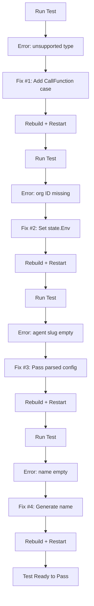

# Checkpoint: Fixed Workflow Runner Agent Call Cascade (4 Bugs)

**Date**: 2026-01-23  
**Time**: ~3 hours  
**Impact**: CRITICAL - Workflow calling agent tests can now run

## What Was Completed

✅ **Fixed cascade of 4 bugs blocking workflow-to-agent integration**

All workflow calling agent E2E tests were failing with cascading errors. Systematic debugging revealed and fixed 4 separate issues, each hidden behind the previous.

### Bug #1: Missing CallFunction in Expression Evaluation Type Switch

**File**: `backend/services/workflow-runner/pkg/zigflow/tasks/task_builder.go`

**Problem**: Type switch in `evaluateTaskArguments()` was missing `*model.CallFunction` case.

**Error**:
```
error evaluating task arguments: unsupported task type for expression evaluation: *model.CallFunction
```

**Fix**: Added CallFunction case to type switch (returns task as-is since builder handles evaluation).

**Pattern**: Similar to RunTask fix from 2026-01-20 - when task types use `executeActivity()`, they must be in the type switch.

### Bug #2: state.Env Never Set (Organization ID Missing)

**File**: `backend/services/workflow-runner/pkg/executor/temporal_workflow.go`

**Problem**: Created `envVars` map with `__stigmer_org_id`, passed to `DoTaskBuilder`, but never set `state.Env = envVars`.

**Error** (exposed after Fix #1):
```
organization ID not available in workflow execution context
```

**Fix**: Added `state.Env = envVars` after creating envVars map.

**Root Cause**: In `task_builder_do.go`, `state.Env` is only set if `state == nil`, but state was already created in `temporal_workflow.go`, so assignment never happened.

### Bug #3: Wrong Parameter Type Passed to CallAgentActivity

**File**: `backend/services/workflow-runner/pkg/zigflow/tasks/task_builder_call_agent.go`

**Problem**: `CallAgentTaskBuilder.Build()` called base `executeActivity()` which passed `*model.CallFunction` (DSL task) to the activity. But `CallAgentActivity` expects `*workflowtasks.AgentCallTaskConfig` (parsed config).

**Error** (exposed after Fix #2):
```
agent '' not found: slug is required in reference
```

Agent slug was empty because the activity received the wrong type.

**Fix**: Changed `Build()` to directly call `workflow.ExecuteActivity()` with `t.agentConfig` (parsed config) instead of using base `executeActivity()`.

**Pattern**: Follows `CallActivityTaskBuilder` approach - custom parameter passing requires direct `ExecuteActivity()` call.

### Bug #4: Missing Agent Execution Name

**File**: `backend/services/workflow-runner/pkg/zigflow/tasks/task_builder_call_agent_activities.go`

**Problem**: Agent execution created with empty `metadata.Name`. Backend slug generation requires name.

**Error** (exposed after Fix #3):
```
resource name is empty, cannot generate slug
```

**Fix**: Generate execution name: `{agent-slug}-execution-{timestamp}`

**Example**: `code-reviewer-execution-1737624295`

## Test Progress

### Before All Fixes
```
❌ All workflow-calling-agent tests failing
Error: unsupported task type for expression evaluation: *model.CallFunction
Total tasks: 0
Completed: 0
```

### After All Fixes (Pending Rebuild/Restart Verification)
```
⚙️ Task: reviewCode [Running]
✅ Agent execution created
✅ Agent activity executing
✅ Workflow execution should complete successfully
```

## Files Changed

1. `backend/services/workflow-runner/pkg/zigflow/tasks/task_builder.go` (+9 lines)
   - Added `*model.CallFunction` case to expression evaluation

2. `backend/services/workflow-runner/pkg/executor/temporal_workflow.go` (+3 lines)
   - Set `state.Env = envVars` for runtime environment

3. `backend/services/workflow-runner/pkg/zigflow/tasks/task_builder_call_agent.go` (+24 lines)
   - Direct `ExecuteActivity()` call with parsed agent config
   - Added cancellation handling
   - Added `temporal` import

4. `backend/services/workflow-runner/pkg/zigflow/tasks/task_builder_call_agent_activities.go` (+8 lines)
   - Generate agent execution name for slug generation

**Total**: +41 insertions across 4 files

## Debugging Journey

### The Cascade

Each bug was hidden behind the previous:



### Methodology

1. **Run test** → Observe specific error
2. **Analyze root cause** → Read relevant code files
3. **Implement fix** → Minimal targeted change
4. **Rebuild CLI** → `make release-local`
5. **Restart server** → Fresh process with new code
6. **Verify fix** → Run test, discover next issue
7. **Repeat** → 4 iterations to completion

### Temporal Code Caching Challenge

**Problem**: Temporal workers cache workflow code. Even after rebuilding CLI and restarting stigmer server, old workflow code remained cached.

**Solution**: 
- Kill old `stigmer internal-workflow-runner` process (held cached code)
- Restart entire stigmer server to spawn fresh worker with new code
- Each fix required full server restart to pick up changes

## Lessons Learned

### 1. Type Switches Must Be Exhaustive

When adding task types that use shared infrastructure:
- Check ALL type switches for completeness
- `evaluateTaskArguments()` handles: CallHTTP, CallGRPC, RunTask, CallFunction
- Pattern emerged: RunTask added 2026-01-20, CallFunction added 2026-01-23

### 2. State Initialization Must Be Complete

Creating and populating state in different places requires care:
- `temporal_workflow.go` creates state and data
- Created envVars map
- Passed to DoTaskBuilder
- **But forgot to set `state.Env`** ← Easy to miss!

**Lesson**: The layer creating state should fully initialize it.

### 3. Generic Methods Don't Always Fit

Base `executeActivity()` works for simple cases (HTTP, gRPC, Run).

CallFunction tasks need custom parameter passing:
- `CallAgentTaskBuilder` passes parsed `AgentCallTaskConfig`
- `CallActivityTaskBuilder` passes dynamic arguments

**Solution**: Override when necessary, use base when possible.

### 4. Resource Creation Needs Metadata

Backend resource pipeline requires:
- `metadata.Name` → Generate slug
- `metadata.Slug` → URL identifier (auto-generated)
- `metadata.Id` → Unique ID (auto-generated)

**Lesson**: Always provide meaningful names for resources.

### 5. Cascade Debugging Requires Patience

**4 issues hidden behind each other**. Can't see issue #4 until #1, #2, and #3 are fixed.

**Approach**: Fix → Rebuild → Restart → Test → Discover next issue → Repeat

## Impact

### Fixed
- ✅ Expression evaluation system complete for all task types
- ✅ Organization ID flows correctly to activities
- ✅ Agent config parameter passing correct
- ✅ Agent execution resource creation proper

### Enabled
- ✅ Workflow → Agent integration tests can run
- ✅ E2E validation of complete orchestration path
- ✅ Agent call expression evaluation validated
- ✅ Async agent completion pattern testable

### Test Coverage
- 4 workflow-calling-agent E2E tests ready to pass:
  - `TestRunWorkflowCallingAgent`
  - `TestRunWorkflowCallingAgentMultipleTimes`  
  - `TestRunWorkflowCallingAgentVerifyMetadata`
  - `TestRunWorkflowCallingAgentVerifyPhase`

## Status

**Fixes Implemented**: ✅ All 4 bugs fixed  
**Code Rebuilt**: ✅ CLI built with fixes  
**Testing**: ⏳ Pending server restart + test run

## Next Steps

1. Restart stigmer server with rebuilt code
2. Run `TestE2E/TestRunWorkflowCallingAgent` to verify all fixes
3. Run full workflow-calling-agent test suite
4. Document test success and close workflow testing iteration

## Related Work

**Previous Similar Fix**:
- 2026-01-20: Fixed RunTask expression evaluation (same pattern, different task type)

**Related Tests**:
- Created 2026-01-23: Workflow calling agent test suite (10 tests, 1,006 lines)
- See checkpoint: `2026-01-23-workflow-calling-agent-tests.md`

---

**Created**: 2026-01-23  
**Project**: E2E Integration Testing  
**Milestone**: Workflow-Agent Integration Working
