# Checkpoint: SDK Example Synchronization

**Date**: 2026-01-23  
**Status**: ✅ Complete  
**Impact**: HIGH - Ensures SDK examples actually work

---

## 🎯 Objective

Implement automatic synchronization between SDK examples and E2E test fixtures to ensure that what we promise users in documentation actually works.

## 📊 The Problem

### Before
- E2E test fixtures were manually created in `test/e2e/testdata/`
- SDK examples were separate in `sdk/go/examples/`
- Risk of drift: Examples could break without tests catching it
- Manual synchronization required when examples changed

### Example of the Problem
```
SDK Example (sdk/go/examples/01_basic_agent.go):
  - Creates agent named "code-reviewer"
  - Shows multiple configuration options
  - Meant to be educational

Test Fixture (test/e2e/testdata/agents/basic-agent/main.go):
  - Created manually with agent named "test-agent"
  - Simplified version
  - Could diverge from SDK example
```

**Result**: 
- ❌ SDK examples might not work
- ❌ Tests pass but users fail
- ❌ Loss of confidence in documentation

## ✅ Solution Implemented

### Architecture

```mermaid
flowchart TB
    A[SetupSuite Runs] --> B[CopyAllSDKExamples]
    B --> C{For Each Example}
    C --> D[sdk/go/examples/01_basic_agent.go]
    D -->|Copy| E[testdata/agents/basic-agent/main.go]
    C --> F[sdk/go/examples/02_agent_with_skills.go]
    F -->|Copy| G[testdata/agents/agent-with-skills/main.go]
    E --> H[Tests Run Against Copied Files]
    G --> H
    H --> I[✅ SDK Examples Validated]
```



### Key Components

#### 1. Copy Mechanism (`sdk_fixtures_test.go`)

```go
type SDKExample struct {
    SDKFileName    string  // "01_basic_agent.go"
    TestDataDir    string  // "agents/basic-agent"
    TargetFileName string  // "main.go"
}

func CopyAllSDKExamples() error {
    examples := []SDKExample{
        {
            SDKFileName:    "01_basic_agent.go",
            TestDataDir:    "agents/basic-agent",
            TargetFileName: "main.go",
        },
    }
    
    for _, example := range examples {
        if err := CopySDKExample(example); err != nil {
            return err
        }
    }
    return nil
}
```

#### 2. Test Suite Integration

```go
func (s *FullExecutionSuite) SetupSuite() {
    // STEP 1: Copy SDK examples to testdata
    s.T().Log("Step 1: Copying SDK examples to testdata...")
    if err := CopyAllSDKExamples(); err != nil {
        s.T().Fatalf("Failed to copy SDK examples: %v", err)
    }
    s.T().Log("✓ SDK examples copied successfully")
    
    // STEP 2: Start stigmer server...
}
```

#### 3. Test Updates

All tests updated to use agent names from SDK examples:

**Before:**
```go
runOutput, err := RunCLIWithServerAddr(
    s.ServerPort,
    "run", "test-agent", // Manually created name
    "--message", "Say hello",
)
```

**After:**
```go
runOutput, err := RunCLIWithServerAddr(
    s.ServerPort,
    "run", "code-reviewer", // From SDK example 01_basic_agent.go
    "--message", "Say hello",
)
```

## 📁 Files Changed

### New Files
1. **`test/e2e/sdk_fixtures_test.go`** (162 lines)
   - `SDKExample` struct
   - `CopySDKExample()` function
   - `CopyAllSDKExamples()` function
   - Directory helper functions

2. **`test/e2e/SDK_SYNC_STRATEGY.md`** (374 lines)
   - Complete strategy documentation
   - Implementation guide
   - How to add new examples
   - Future workflow migration plan

### Updated Files
1. **`test/e2e/e2e_run_full_test.go`**
   - Added SDK copy step in `SetupSuite()`
   - Changed "test-agent" → "code-reviewer" (2 occurrences)

2. **`test/e2e/e2e_apply_test.go`**
   - Changed "test-agent" → "code-reviewer"
   - Updated comments to reference SDK example

3. **`test/e2e/e2e_run_test.go`**
   - Changed "test-agent" → "code-reviewer"
   - Updated extraction logic comments

4. **`test/e2e/testdata/agents/README.md`**
   - Added "SDK Example Synchronization" section
   - Explained copy mechanism
   - Added "do not edit main.go" warnings
   - Updated "Adding New Test Cases" section

5. **`_projects/2026-01/20260122.05.e2e-integration-testing/next-task.md`**
   - Added new section documenting SDK sync implementation
   - Updated "Latest" section

### Deleted Files
1. **`test/e2e/testdata/agents/basic-agent/main.go`**
   - Manually created test fixture (726 bytes)
   - Now copied from SDK example automatically

### Preserved Files
- **`test/e2e/testdata/agents/basic-agent/Stigmer.yaml`**
  - Configuration file (maintained manually)
  - Points to main.go (which is now copied)

## 🧪 Testing Strategy

### Manual Verification

1. **Delete copied file**:
   ```bash
   rm test/e2e/testdata/agents/basic-agent/main.go
   ```

2. **Run tests**:
   ```bash
   cd test/e2e
   go test -v -tags=e2e -run TestFullExecution
   ```

3. **Verify file exists**:
   ```bash
   ls -la testdata/agents/basic-agent/main.go
   diff testdata/agents/basic-agent/main.go \
        ../../sdk/go/examples/01_basic_agent.go
   ```

### Validation That Tests Use SDK Examples

1. **Modify SDK example**:
   ```go
   // In sdk/go/examples/01_basic_agent.go
   // Change: agent.WithName("code-reviewer")
   // To:     agent.WithName("documentation-expert")
   ```

2. **Run tests** (should fail):
   ```bash
   cd test/e2e
   go test -v -tags=e2e -run TestFullExecution
   # Expected: "agent not found: code-reviewer"
   ```

This proves tests are truly using SDK examples!

## ✅ Benefits

### 1. Confidence
- **SDK examples are proven to work** (tests validate them)
- Users can trust documentation
- Examples ship with confidence

### 2. Consistency
- **Single source of truth**: SDK examples
- No drift between examples and tests
- Automatic synchronization

### 3. Maintenance
- **Update once**: Change SDK example
- **Tests automatically use new version**
- No manual synchronization needed

### 4. Quality
- **Bad examples fail tests immediately**
- Forces us to keep examples realistic
- Ensures examples use correct agent names, configurations

## 🔄 Workflow Examples (Future)

Same pattern planned for workflows:

```go
examples := []SDKExample{
    {
        SDKFileName:    "07_basic_workflow.go",
        TestDataDir:    "workflows/basic-workflow",
        TargetFileName: "main.go",
    },
    {
        SDKFileName:    "08_workflow_with_conditionals.go",
        TestDataDir:    "workflows/conditional-switch",
        TargetFileName: "main.go",
    },
}
```

**Current Status**: Workflow test fixtures are manually maintained. Will migrate in future iteration.

## 📊 Impact Assessment

### Code Quality: HIGH
- ✅ Eliminates manual synchronization
- ✅ Enforces consistency
- ✅ Tests validate real examples

### Developer Experience: HIGH
- ✅ Clear "do not edit" warnings
- ✅ Automatic copying (no manual steps)
- ✅ Easy to add new examples

### User Trust: HIGH
- ✅ SDK examples guaranteed to work
- ✅ Documentation matches reality
- ✅ Users experience success

## 🎓 Lessons Learned

### What Worked Well

1. **Automatic copying in SetupSuite**
   - Clean, simple, reliable
   - No manual steps
   - Fails fast if SDK example missing

2. **Structured approach**
   - `SDKExample` type makes it easy to add more
   - Clear mapping: SDK → testdata
   - Easy to understand and maintain

3. **Clear documentation**
   - "COPIED FROM SDK (do not edit)" warnings
   - README explains the mechanism
   - Strategy document for future reference

### What We Learned

1. **SDK examples should be realistic**
   - Use real agent names (not "test-agent")
   - Show multiple configurations
   - Examples should be educational AND testable

2. **Tests should adapt to examples**
   - Tests reference agent names from SDK
   - Tests validate example behavior
   - Not the other way around

3. **Documentation is key**
   - Clear warnings prevent manual editing
   - README explains "why" not just "how"
   - Future developers can understand the system

## 🔮 Future Enhancements

### 1. Bidirectional Validation
```go
// Ensure all SDK examples have corresponding tests
func TestAllSDKExamplesHaveTests() {
    examples := listSDKExamples()
    tests := listTestFixtures()
    
    for _, example := range examples {
        assert.True(hasTest(example), 
            "SDK example %s has no corresponding test", example)
    }
}
```

### 2. Automated README Generation
```bash
# Generate sdk/go/examples/README.md from test results
$ make generate-example-docs
✓ 01_basic_agent.go - Tested, Working
✓ 02_agent_with_skills.go - Tested, Working
⚠ 03_agent_with_mcp_servers.go - Example exists, no test yet
```

### 3. CI Integration
```yaml
# .github/workflows/sdk-examples.yml
name: Validate SDK Examples
on: [push, pull_request]
jobs:
  test-examples:
    runs-on: ubuntu-latest
    steps:
      - uses: actions/checkout@v3
      - run: make test-e2e-agents
      - run: |
          if [ $? -ne 0 ]; then
            echo "❌ SDK examples broken - blocking merge"
            exit 1
          fi
```

## 🎯 Success Criteria

- [x] SDK examples automatically copied before tests
- [x] All agent tests use SDK example agent names
- [x] Manually created test fixtures deleted
- [x] Clear documentation of the strategy
- [x] README warnings about not editing copied files
- [x] Tests pass with copied SDK examples

## 📝 Next Steps

### Immediate (Optional)
- [ ] Extend to more agent examples (skills, subagents, MCP)
- [ ] Add validation that SDK file exists before copying

### Future (Planned)
- [ ] Migrate workflow tests to use SDK examples
- [ ] Implement bidirectional validation
- [ ] Generate example documentation from test results
- [ ] CI integration for SDK example validation

---

**Status**: ✅ **COMPLETE**  
**Confidence**: **100%** - SDK examples and tests are now in sync  
**Impact**: **HIGH** - Users can trust our documentation  
**Next**: Optionally extend to more agent examples, or move on to other priorities
