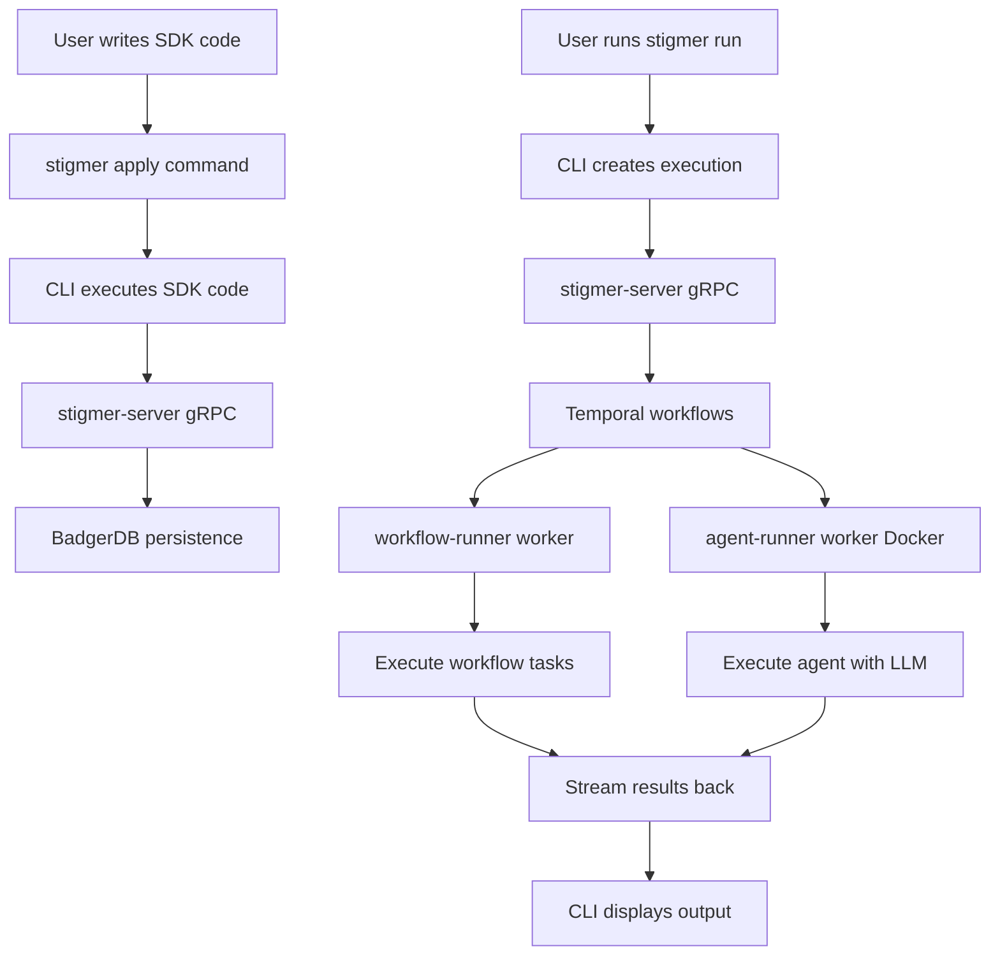

# Stigmer E2E Integration Testing - Context Document for Gemini

**Purpose**: Research and recommend the best testing frameworks, patterns, and approaches for building end-to-end integration tests for the Stigmer agentic workflow platform.

---

## Executive Summary

Stigmer is an agentic workflow platform written primarily in Go (CLI/SDK/servers) and Python (agent runner). We need to build end-to-end integration tests that validate the entire user journey:

1. User writes agent/workflow code using Stigmer SDK (Go)
2. User runs `stigmer apply` → saves resources to local database
3. User runs `stigmer run <agent-name>` → executes agent/workflow
4. Backend services orchestrate execution (stigmer-server, workflow-runner via Temporal, agent-runner in Docker)
5. Results stream back to CLI in real-time
6. User sees correct output

**Current state**: We have SDK unit tests but NO integration tests covering the full stack.

**Goal**: Build a test suite that can automatically start services, execute SDK examples through CLI commands, and verify correct behavior end-to-end.

---

## System Architecture

### Component Overview



### Services

| Service | Language | Purpose | Port |
|---------|----------|---------|------|
| **stigmer CLI** | Go | User interface, command execution | - |
| **stigmer-server** | Go | gRPC API, persistence, orchestration | 9090 |
| **workflow-runner** | Go | Temporal worker for workflows | - |
| **agent-runner** | Python | Temporal worker for agents (Docker) | - |
| **temporal** | Go (external) | Workflow orchestration engine | 7233 |
| **local daemon** | Go | Process manager for local services | - |

### Data Flow: `stigmer apply`

```
1. User code (main.go):
   agent.New(ctx, agent.Config{
     Name: "my-agent",
     Model: "gpt-4",
   })

2. stigmer apply executes main.go
   → SDK code runs
   → Generates proto messages (Agent, Skill, Workflow)
   → Returns synthesis result

3. CLI sends proto messages via gRPC to stigmer-server
   → stigmer-server validates
   → stigmer-server saves to BadgerDB
   → Returns success/error

4. CLI displays deployment summary
```

### Data Flow: `stigmer run`

```
1. User runs: stigmer run my-agent --message "hello"

2. CLI looks up agent by name via gRPC
   → stigmer-server queries BadgerDB
   → Returns agent proto

3. CLI creates AgentExecution via gRPC
   → stigmer-server creates execution record
   → stigmer-server triggers Temporal workflow
   → Returns execution ID

4. Temporal workflow starts
   → Schedules agent execution activity
   → agent-runner worker picks up activity
   → Executes agent code with LLM
   → Returns results

5. Results stream back via gRPC Subscribe
   → stigmer-server streams status updates
   → CLI displays messages in real-time
   → Execution completes

6. CLI shows final summary (duration, message count, etc.)
```

### Process Architecture

```mermaid
graph LR
    A[stigmer daemon] --> B[stigmer-server process]
    A --> C[temporal dev-server process]
    A --> D[workflow-runner process]
    A --> E[agent-runner Docker container]
    
    B -.gRPC.-> F[BadgerDB files]
    C -.-.-> G[SQLite DB]
    D -.Temporal client.-> C
    E -.Temporal client.-> C
```

### File System Layout

```
~/.stigmer/                           # Local daemon data directory
├── data/                             # BadgerDB database
│   ├── agents/                       # Agent resources
│   ├── workflows/                    # Workflow resources
│   └── executions/                   # Execution records
├── logs/                             # Service logs
│   ├── stigmer-server.log
│   ├── temporal.log
│   ├── workflow-runner.log
│   └── agent-runner.log
├── pids/                             # Process ID files
│   ├── stigmer-server.pid
│   ├── temporal.pid
│   ├── workflow-runner.pid
│   └── agent-runner.pid
└── temporal/                         # Temporal database
    └── temporal.db
```

---

## Current Testing Landscape

### What We Have

#### 1. SDK Unit Tests

Location: `/Users/suresh/scm/github.com/stigmer/stigmer/sdk/go/agent/*_test.go`

These test that SDK code correctly generates proto messages:

```go
// Example test in sdk/go/agent/agent_test.go
func TestBasicAgent(t *testing.T) {
    ctx := stigmer.NewContext()
    
    agent.New(ctx, agent.Config{
        Name: "test-agent",
        Model: "gpt-4",
    })
    
    result := stigmer.Synthesize(ctx)
    
    // Verify proto message was generated correctly
    assert.Equal(t, 1, len(result.Agents))
    assert.Equal(t, "test-agent", result.Agents[0].Metadata.Name)
}
```

**Scope**: SDK → Proto conversion only  
**What's NOT tested**: CLI commands, backend services, database, execution

#### 2. SDK Examples (Not Tests)

Location: `/Users/suresh/scm/github.com/stigmer/stigmer/sdk/go/examples/`

Real-world examples of SDK usage:
- `01_basic_agent.go` - Simple agent
- `02_agent_with_skills.go` - Agent with skills
- `07_basic_workflow.go` - Simple workflow
- `15_workflow_calling_simple_agent.go` - Workflow orchestrating agent
- etc.

These are runnable examples but NOT automated tests.

### What We DON'T Have

❌ Integration tests for `stigmer apply`  
❌ Integration tests for `stigmer run`  
❌ Tests that verify database persistence  
❌ Tests that verify workflow execution  
❌ Tests that verify streaming output  
❌ Tests that run against full local stack  

---

## What We Need to Test

### Test Categories

#### 1. CLI Command Tests

**Scenario: stigmer apply**

```go
// Pseudocode
func TestApplyBasicAgent(t *testing.T) {
    // Given: Local services running
    // Given: A project with SDK code
    
    // When: Execute stigmer apply
    output := runCLI("stigmer", "apply")
    
    // Then: Should succeed
    assert.Contains(t, output, "Deployment successful")
    
    // Then: Should save to database
    agent := queryDB("SELECT * FROM agents WHERE name = 'test-agent'")
    assert.NotNil(t, agent)
    
    // Then: Should show correct summary
    assert.Contains(t, output, "Deployed: 1 agent(s)")
}
```

**Scenario: stigmer run**

```go
// Pseudocode
func TestRunBasicAgent(t *testing.T) {
    // Given: Agent deployed via stigmer apply
    // Given: All services running
    
    // When: Execute stigmer run
    output := runCLI("stigmer", "run", "test-agent", "--message", "hello")
    
    // Then: Should show execution started
    assert.Contains(t, output, "Agent execution started")
    
    // Then: Should stream messages
    assert.Contains(t, output, "🤖 Agent:")
    
    // Then: Should complete successfully
    assert.Contains(t, output, "✅ Execution completed")
    
    // Then: Should show summary
    assert.Contains(t, output, "Duration:")
    assert.Contains(t, output, "Total messages:")
}
```

#### 2. Database Persistence Tests

```go
// Test that stigmer apply actually persists data
func TestApplyPersistenceAgent(t *testing.T) {
    // Apply agent
    runCLI("stigmer", "apply", "--config", "testdata/basic-agent")
    
    // Verify in database
    db := openBadgerDB("~/.stigmer/data")
    agent, err := db.GetAgent("test-agent")
    
    assert.NoError(t, err)
    assert.Equal(t, "test-agent", agent.Metadata.Name)
    assert.Equal(t, "gpt-4", agent.Spec.Model)
}
```

#### 3. Workflow Execution Tests

```go
// Test that stigmer run actually triggers workflow
func TestRunExecutesWorkflow(t *testing.T) {
    // Deploy workflow
    runCLI("stigmer", "apply", "--config", "testdata/basic-workflow")
    
    // Run workflow
    runCLI("stigmer", "run", "test-workflow", "--no-follow")
    
    // Verify workflow execution in Temporal
    temporalClient := connectToTemporal()
    execution, err := temporalClient.DescribeWorkflowExecution(ctx, workflowID)
    
    assert.NoError(t, err)
    assert.Equal(t, "COMPLETED", execution.Status)
}
```

#### 4. Streaming Output Tests

```go
// Test that execution output streams correctly
func TestRunStreamsOutput(t *testing.T) {
    // Deploy agent
    runCLI("stigmer", "apply", "--config", "testdata/basic-agent")
    
    // Capture streaming output
    outputChan := make(chan string)
    go func() {
        output := runCLI("stigmer", "run", "test-agent", "--message", "hello")
        outputChan <- output
    }()
    
    // Verify streaming messages arrive
    timeout := time.After(10 * time.Second)
    var messages []string
    
    for {
        select {
        case line := <-outputChan:
            messages = append(messages, line)
            if strings.Contains(line, "Execution completed") {
                goto Done
            }
        case <-timeout:
            t.Fatal("Streaming timed out")
        }
    }
    
Done:
    // Verify we got streaming messages (not just final output)
    assert.GreaterOrEqual(t, len(messages), 3)
    assert.Contains(t, messages, "🤖 Agent:")
}
```

#### 5. Error Handling Tests

```go
// Test that validation errors are caught
func TestApplyWithInvalidSpec(t *testing.T) {
    // Try to apply invalid agent spec
    output := runCLI("stigmer", "apply", "--config", "testdata/invalid-agent")
    
    // Should fail with validation error
    assert.Contains(t, output, "validation error")
    assert.Contains(t, output, "model is required")
}

// Test that execution errors are handled
func TestRunWithNonexistentAgent(t *testing.T) {
    output := runCLI("stigmer", "run", "nonexistent-agent")
    
    assert.Contains(t, output, "Agent not found")
}
```

---

## Technical Challenges

### 1. Test Environment Setup

**Challenge**: Integration tests need all services running.

**Options**:
- Start services in test setup (slow but isolated)
- Assume services are already running (fast but fragile)
- Use Docker Compose for test environment (portable but complex)

**Questions**:
- Best practice for managing service dependencies in integration tests?
- How to ensure clean state between tests?
- How to handle service startup failures?

### 2. Process Management

**Challenge**: Tests need to start/stop multiple processes.

**Current approach**: Use daemon manager (already built)

**Questions**:
- Should tests use existing daemon manager?
- Or spin up dedicated test instances with test-specific ports?
- How to capture logs from all services for debugging?

### 3. Timing and Synchronization

**Challenge**: Async execution, streaming, service startup delays.

**Problems**:
- Workflow execution is async (Temporal)
- Streaming output arrives over time
- Services take time to start up
- Tests can be flaky if timing assumptions are wrong

**Questions**:
- Best patterns for waiting on async operations?
- How to avoid flaky tests due to timing?
- Should we use polling? Retries? Explicit waits?

### 4. Database State Management

**Challenge**: Tests need clean database state.

**Options**:
- Reset database before each test (slow but isolated)
- Use unique namespaces/prefixes per test (fast but complex)
- Use in-memory database for tests (fast but different from prod)

**Questions**:
- Best practice for database isolation in integration tests?
- How to clean up test data without affecting other tests?

### 5. Resource Cleanup

**Challenge**: Tests create resources that need cleanup.

**Resources to clean**:
- Database records (agents, workflows, executions)
- Temporal workflow executions
- Processes (if started by test)
- Log files
- Temporary files

**Questions**:
- Best pattern for cleanup (defer? t.Cleanup()? TestMain?)
- How to ensure cleanup happens even if test fails?
- Should we use test fixtures?

---

## Framework Options to Research

### Go Testing Frameworks

1. **Standard Go testing package**
   - Pros: Built-in, no dependencies, familiar
   - Cons: Basic features, verbose assertions
   
2. **testify/suite**
   - Pros: Test lifecycle hooks (SetupTest, TearDownTest), better assertions
   - Cons: Adds dependency
   - URL: https://github.com/stretchr/testify

3. **ginkgo + gomega**
   - Pros: BDD-style, rich matchers, parallel execution
   - Cons: Different syntax, learning curve
   - URL: https://github.com/onsi/ginkgo

### Integration Test Patterns

1. **Table-driven tests**
   ```go
   tests := []struct{
       name string
       example string
       wantAgents int
       wantWorkflows int
   }{
       {"basic agent", "01_basic_agent.go", 1, 0},
       {"basic workflow", "07_basic_workflow.go", 0, 1},
   }
   ```

2. **Test fixtures**
   - Pre-built test data (agents, workflows)
   - Reusable across tests
   - Version controlled

3. **Golden files**
   - Expected output stored in files
   - Compare actual output to golden file
   - Update golden files when behavior changes

### Process Management

1. **os/exec package**
   - Start CLI commands as subprocesses
   - Capture stdout/stderr
   - Wait for completion

2. **Docker Compose**
   - Define all services in docker-compose.yml
   - Start/stop entire stack
   - Portable across machines

3. **Testcontainers**
   - Go library for Docker containers in tests
   - Automatic cleanup
   - URL: https://golang.testcontainers.org/

### Existing Examples in Open Source

Projects with similar integration test needs:

1. **Temporal Go SDK**
   - Tests workflows end-to-end
   - URL: https://github.com/temporalio/sdk-go/tree/master/test

2. **Pulumi**
   - Tests IaC deployments end-to-end
   - URL: https://github.com/pulumi/pulumi/tree/master/tests

3. **Kubernetes E2E tests**
   - Complex multi-service testing
   - URL: https://github.com/kubernetes/kubernetes/tree/master/test/e2e

---

## Questions for Gemini

### Framework Selection

1. **Which Go testing framework is best for our use case?**
   - Standard library vs testify vs ginkgo?
   - What are the trade-offs?
   - Industry best practices for integration tests?

2. **What patterns should we use for managing test lifecycle?**
   - SetupTest/TearDownTest hooks?
   - TestMain for global setup?
   - t.Cleanup() for cleanup?

### Test Environment

3. **How should we manage the test environment?**
   - Start services per test? (isolated but slow)
   - Start once per test suite? (fast but shared state)
   - Use Docker Compose? (portable but complex)
   - Use existing daemon manager? (reuses code but might conflict)

4. **How to handle service startup and health checks?**
   - Poll until services are ready?
   - Wait for specific log messages?
   - Use health check endpoints?

### Database Testing

5. **What's the best approach for database isolation?**
   - Clean database before/after each test?
   - Use unique organization IDs per test?
   - Use in-memory database for tests?
   - How do other projects handle this?

6. **How to verify database state in tests?**
   - Direct BadgerDB access?
   - Query via gRPC API?
   - Use test helper functions?

### Async and Streaming

7. **How to test async workflow execution?**
   - Polling with timeout?
   - Callback/channel-based?
   - Temporal test helpers?

8. **How to test streaming gRPC responses?**
   - Capture stream until completion?
   - Verify messages arrive in order?
   - How to avoid flaky timing tests?

### Process Management

9. **Best way to run CLI commands in tests?**
   - os/exec with captured output?
   - Build CLI as library and call directly?
   - Mock CLI for faster tests?

10. **How to capture and assert on CLI output?**
    - Parse text output? (fragile)
    - Use structured output (JSON)? (need to add)
    - Just check exit codes?

### Error Scenarios

11. **How to test error handling?**
    - Invalid specs
    - Service failures
    - Network errors
    - Timeout scenarios

### CI/CD Integration

12. **How to make tests CI-friendly?**
    - Parallel execution safe?
    - Configurable timeouts?
    - Skip tests if services unavailable?
    - Generate test reports?

### Examples from Industry

13. **What can we learn from similar projects?**
    - Temporal's test approach?
    - Pulumi's test approach?
    - Kubernetes e2e tests?
    - Best practices and patterns?

---

## Desired Outcomes from Research

1. **Recommended testing framework** (standard lib vs testify vs ginkgo)
2. **Test architecture pattern** (process management, environment setup)
3. **Database isolation strategy** (clean state between tests)
4. **Async testing patterns** (workflows, streaming)
5. **Example test structure** (file organization, naming conventions)
6. **CI/CD integration approach** (parallelization, reporting)
7. **Code examples** (skeleton test implementation)

---

## Additional Context

### Codebase Structure

```
stigmer/
├── client-apps/cli/          # CLI implementation (Go)
│   ├── cmd/stigmer/root/
│   │   ├── apply.go          # stigmer apply command
│   │   └── run.go            # stigmer run command
│   ├── internal/cli/
│   │   ├── daemon/           # Local daemon manager
│   │   └── config/           # Configuration
│   └── embedded/             # Binary distribution
├── sdk/go/                   # Go SDK
│   ├── agent/                # Agent SDK
│   ├── workflow/             # Workflow SDK
│   ├── stigmer/              # Core SDK
│   └── examples/             # SDK examples (potential test cases)
├── backend/services/
│   ├── stigmer-server/       # gRPC API server (Go)
│   ├── agent-runner/         # Agent executor (Python, Docker)
│   └── workflow-runner/      # Workflow executor (Go, Temporal)
└── apis/                     # Protobuf definitions
    └── stubs/go/             # Generated Go stubs
```

### Technologies in Use

- **Go**: CLI, SDK, stigmer-server, workflow-runner
- **Python**: agent-runner
- **gRPC**: Service communication
- **Protocol Buffers**: Data serialization
- **BadgerDB**: Local key-value store
- **Temporal**: Workflow engine
- **Docker**: Agent-runner containerization

### Existing Test Files

SDK tests exist as examples:
- `/Users/suresh/scm/github.com/stigmer/stigmer/sdk/go/agent/agent_test.go`
- `/Users/suresh/scm/github.com/stigmer/stigmer/sdk/go/agent/edge_cases_test.go`
- `/Users/suresh/scm/github.com/stigmer/stigmer/sdk/go/workflow/workflow_test.go`

These can serve as reference for test patterns.

---

## Timeline and Scope

**Phase 1**: Research and design (1-2 days)
- Framework selection
- Test architecture design
- POC with one test

**Phase 2**: Core implementation (3-5 days)
- Test environment setup
- Core test utilities
- Basic apply/run tests

**Phase 3**: Comprehensive coverage (3-5 days)
- All SDK examples as tests
- Error scenarios
- Streaming tests

**Phase 4**: CI integration (1-2 days)
- GitHub Actions integration
- Test reporting
- Documentation

---

## Success Metrics

1. ✅ Can start all local services in test environment
2. ✅ Can run `stigmer apply` via test and verify DB state
3. ✅ Can run `stigmer run` via test and verify execution
4. ✅ Can capture and verify streaming output
5. ✅ Tests are reliable (not flaky)
6. ✅ Tests run in reasonable time (< 5 minutes for full suite)
7. ✅ Tests can run in CI/CD pipeline
8. ✅ Easy to add new tests for new SDK examples

---

## Request for Gemini

Please research and provide:

1. **Comprehensive framework recommendation** with rationale
2. **Test architecture design** with diagrams/pseudocode
3. **Database isolation strategy** with examples
4. **Process management approach** with code snippets
5. **Async/streaming test patterns** with examples
6. **Example test implementation** (full working example)
7. **CI/CD integration guidance**
8. **References to similar projects** for inspiration

Focus on **Go best practices** and **real-world production patterns** used by high-quality open source projects.

Thank you!
