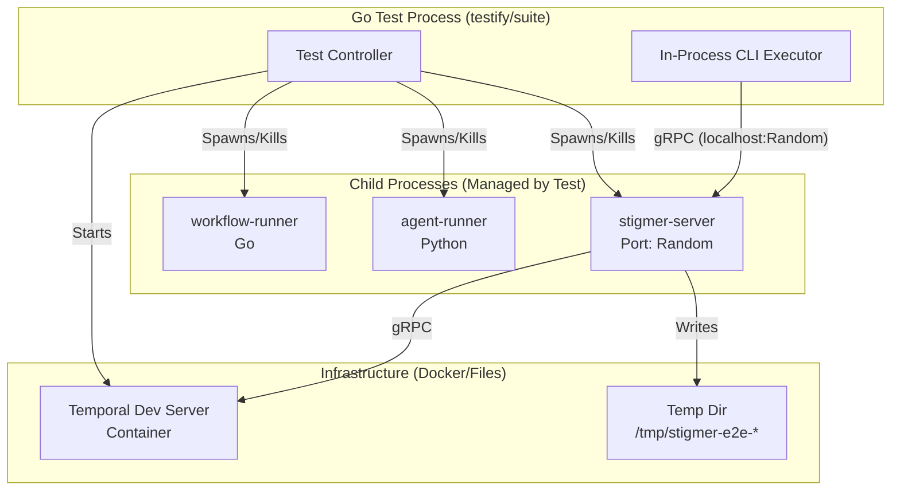

# Research Summary: E2E Integration Testing Framework

**Date**: 2026-01-22  
**Status**: ✅ Research Complete  
**Source**: Gemini Deep Research

---

## Executive Decision

### **Recommended Stack**: `testify/suite` + `testcontainers-go`

After comprehensive analysis, the recommended approach is:

1. **Testing Framework**: `testify/suite` with lifecycle hooks
2. **Architecture Pattern**: "Ephemeral Harness" - tests spawn services as child processes
3. **Database Isolation**: Directory-based isolation using temp directories
4. **CLI Testing**: Grey-box pattern - invoke CLI commands in-process

---

## Framework Comparison

### `testify/suite` ✅ RECOMMENDED

**Pros:**
- Industry standard for Go testing
- Provides essential lifecycle hooks: `SetupSuite`, `TearDownSuite`, `SetupTest`, `TearDownTest`
- Perfect for database and process isolation requirements
- Used by Temporal SDK itself
- Low learning curve
- Clean, readable test code

**Cons:**
- Less powerful than Ginkgo for complex scenarios
- Requires explicit structure setup

### `ginkgo` ❌ Not Recommended

**Pros:**
- Powerful BDD DSL
- Excellent parallel execution
- Rich feature set

**Cons:**
- Steep learning curve with custom DSL
- Can obfuscate simple failure modes
- Overkill for our integration test needs
- Less familiar to most Go developers

### Standard `testing` ❌ Not Recommended

**Pros:**
- No dependencies
- Simple and straightforward

**Cons:**
- Lacks structured setup/teardown hooks
- Makes complex lifecycle management difficult
- Would require custom harness code that testify provides

---

## Architecture: "The Ephemeral Harness"

### Core Concept

Instead of relying on pre-running services, **tests own their infrastructure**:

1. Each test suite starts its own `stigmer-server` as a child process
2. Process uses a random free port
3. Fresh temporary directory for BadgerDB per test
4. Tests can directly verify database state
5. Clean shutdown after each test

### Component Flow



### Why This Works

1. **Full Isolation**: Each test gets a pristine environment
2. **Fast Reset**: Just delete temp dir and restart process
3. **Debuggable**: Test failures contain full process output
4. **Realistic**: Tests actual production code paths
5. **No External Dependencies**: Don't rely on pre-running daemon

---

## Database Isolation Strategy

### Recommendation: Directory-Based Isolation

**Implementation:**
```go
func (s *E2ESuite) SetupTest() {
    // Create fresh temp directory for each test
    s.TempDir, err = os.MkdirTemp("", "stigmer-e2e-*")
    s.Require().NoError(err)
    
    // Start server pointing to this directory
    s.Harness = StartHarness(s.T(), s.TempDir)
}

func (s *E2ESuite) TearDownTest() {
    s.Harness.Stop()
    os.RemoveAll(s.TempDir)
}
```

**Why It Works:**
- BadgerDB is embedded - no need for transaction rollbacks
- Physical directory separation = 100% isolation
- Fast (temp directories are cheap)
- Simple and reliable
- Easy to inspect DB state for debugging

**Alternative Considered (Rejected):**
- **Shared DB with cleanup**: Complex, error-prone, shared state issues
- **In-memory**: BadgerDB doesn't support true in-memory mode
- **Namespacing**: Adds complexity, doesn't solve all isolation issues

---

## CLI Testing: Grey-Box Pattern

### Recommendation: In-Process CLI Execution

**Instead of:**
```go
// ❌ Slow, hard to debug
cmd := exec.Command("stigmer", "apply", "--config", "test.go")
output, err := cmd.CombinedOutput()
```

**Use:**
```go
// ✅ Fast, debuggable, with code coverage
output, err := RunCLI("apply", "--config", "test.go", "--server", serverAddr)
```

**Implementation:**
```go
func RunCLI(args ...string) (string, error) {
    // Redirect stdout/stderr to buffers
    var stdout, stderr bytes.Buffer
    rootCmd.SetOut(&stdout)
    rootCmd.SetErr(&stderr)
    rootCmd.SetArgs(args)
    
    err := rootCmd.Execute()
    return stdout.String(), err
}
```

**Benefits:**
- 100x faster (no process startup overhead)
- Code coverage for CLI layer
- Easy to mock inputs
- Shared memory allows deeper inspection
- Simpler debugging

**Trade-offs:**
- Not testing actual binary execution (acceptable for integration tests)
- Need to ensure no global state in CLI code
- Can add one "smoke test" that calls actual binary if needed

---

## Process Management

### Starting Child Processes

**Pattern:**
```go
type TestHarness struct {
    ServerCmd   *exec.Cmd
    RunnerCmd   *exec.Cmd
    WorkerCmd   *exec.Cmd
    ServerPort  int
    TempDir     string
}

func StartHarness(t *testing.T, tempDir string) *TestHarness {
    // 1. Get free port
    port := GetFreePort()
    
    // 2. Start stigmer-server
    serverCmd := exec.Command("go", "run", 
        "../backend/services/stigmer-server/main.go")
    serverCmd.Env = append(os.Environ(),
        fmt.Sprintf("STIGMER_HOME=%s", tempDir),
        fmt.Sprintf("STIGMER_PORT=%d", port),
    )
    serverCmd.Start()
    
    // 3. Wait for healthy
    WaitForPort(port, 5*time.Second)
    
    // 4. Start runners (Python and Go)
    // ...
    
    return &TestHarness{...}
}
```

### Python Process Management

For `agent-runner` (Python):
```go
runnerCmd := exec.Command("poetry", "run", "python", "agent_runner.py")
runnerCmd.Dir = "../backend/services/agent-runner"
runnerCmd.Env = append(os.Environ(),
    fmt.Sprintf("STIGMER_SERVER=%s", serverAddr),
)
runnerCmd.Start()
```

**CI/CD Consideration:**
- Ensure `poetry install` runs before `go test`
- Could also use virtualenv python directly

---

## Async/Streaming Testing

### Pattern: Polling with Timeouts

**For Database Checks:**
```go
// Use testify's Eventually helper
s.Eventually(func() bool {
    status := GetExecutionStatusFromDB(s.TempDir, executionID)
    return status == "COMPLETED"
}, 10*time.Second, 500*time.Millisecond)
```

**For Streaming Output:**
```go
func (s *E2ESuite) TestRunAndStream() {
    // Start execution in background
    outputChan := make(chan string)
    
    go func() {
        out, _ := RunCLI("run", "test-agent", 
            "--message", "hello", 
            "--server", serverAddr)
        outputChan <- out
    }()
    
    // Wait with timeout
    select {
    case output := <-outputChan:
        s.Contains(output, "🤖 Agent:")
        s.Contains(output, "✅ Execution completed")
    case <-time.After(10 * time.Second):
        s.Fail("Execution timed out")
    }
}
```

**Anti-Pattern to Avoid:**
```go
// ❌ Don't use fixed sleeps
time.Sleep(5 * time.Second)
// What if it finishes in 1s? What if it needs 6s?
```

---

## Recommended Folder Structure

```text
stigmer/
├── test/
│   └── e2e/
│       ├── main_test.go          # TestMain (global setup)
│       ├── suite_test.go         # Testify Suite definition
│       ├── harness_test.go       # Process manager & helpers
│       ├── cli_runner_test.go    # In-process CLI executor
│       │
│       ├── e2e_apply_test.go     # Test: stigmer apply
│       ├── e2e_run_test.go       # Test: stigmer run
│       ├── e2e_destroy_test.go   # Test: stigmer destroy
│       │
│       ├── testdata/
│       │   ├── basic_agent.go
│       │   ├── workflow_example.go
│       │   └── expected_outputs/
│       │
│       └── README.md             # Test documentation
```

---

## CI/CD Integration

### GitHub Actions Workflow

```yaml
name: E2E Integration Tests
on: [push, pull_request]

jobs:
  e2e:
    runs-on: ubuntu-latest
    services:
      temporal:
        image: temporalio/admin-tools:latest
        ports: ["7233:7233"]
    
    steps:
      - uses: actions/checkout@v3
      
      - name: Setup Go
        uses: actions/setup-go@v4
        with:
          go-version: '1.21'
        
      - name: Setup Python
        uses: actions/setup-python@v4
        with:
          python-version: '3.10'
          
      - name: Install Python Dependencies
        run: |
          pip install poetry
          cd backend/services/agent-runner
          poetry install

      - name: Run E2E Tests
        run: go test -v ./test/e2e/... -p 1 -timeout 15m
```

**Key Considerations:**
- `-p 1`: Run tests serially to avoid port conflicts
- `-timeout 15m`: Generous timeout for slow CI environments
- Temporal as GitHub Actions service
- Python setup before Go tests

---

## Implementation Phases

### Phase 1: Harness Infrastructure ✅ NEXT

1. Create `test/e2e/` directory
2. Implement `harness_test.go`:
   - Port allocation (`GetFreePort()`)
   - Health check (`WaitForPort()`)
   - Process spawning
3. Implement `suite_test.go`:
   - Basic testify suite with setup/teardown
4. Test that you can start/stop stigmer-server

**Goal**: Prove we can manage process lifecycle

### Phase 2: CLI Integration

1. Implement `cli_runner_test.go`
2. Add helper to run CLI commands in-process
3. Write one simple test: `TestCLIVersion()`

**Goal**: Prove grey-box CLI testing works

### Phase 3: First Real Test

1. Write `e2e_apply_test.go`
2. Test full flow: Apply → Verify DB
3. Add database inspection helpers

**Goal**: One complete end-to-end test passing

### Phase 4: Expand Coverage

1. Add `e2e_run_test.go` (async/streaming)
2. Add `e2e_destroy_test.go`
3. Add error case tests
4. Document patterns for other developers

**Goal**: Comprehensive test suite

---

## Key Utilities to Implement

### 1. Port Allocation

```go
func GetFreePort() int {
    addr, _ := net.ResolveTCPAddr("tcp", "localhost:0")
    l, _ := net.ListenTCP("tcp", addr)
    defer l.Close()
    return l.Addr().(*net.TCPAddr).Port
}
```

### 2. Health Check

```go
func WaitForPort(port int, timeout time.Duration) bool {
    deadline := time.Now().Add(timeout)
    for time.Now().Before(deadline) {
        conn, err := net.DialTimeout("tcp", 
            fmt.Sprintf("localhost:%d", port), 100*time.Millisecond)
        if err == nil {
            conn.Close()
            return true
        }
        time.Sleep(100 * time.Millisecond)
    }
    return false
}
```

### 3. Database Inspector

```go
func GetFromDB(tempDir string, key string) ([]byte, error) {
    opts := badger.DefaultOptions(filepath.Join(tempDir, "data"))
    opts.Logger = nil // Silence logs
    db, err := badger.Open(opts)
    if err != nil {
        return nil, err
    }
    defer db.Close()
    
    var value []byte
    err = db.View(func(txn *badger.Txn) error {
        item, err := txn.Get([]byte(key))
        if err != nil {
            return err
        }
        value, err = item.ValueCopy(nil)
        return err
    })
    return value, err
}
```

---

## Success Metrics

After implementation, we should be able to:

- ✅ Start fresh test environment in < 2 seconds
- ✅ Run one test in < 5 seconds (including setup/teardown)
- ✅ Tests are 100% isolated (no interference)
- ✅ Tests are deterministic (no flakiness)
- ✅ Test failures are easy to debug
- ✅ Adding new tests is straightforward
- ✅ Tests run successfully in CI/CD

---

## Comparison to Alternatives

### Why Not Docker Compose?

**Pros:**
- Easy to define services
- Industry standard

**Cons:**
- Slower startup time
- Harder to inspect internal state
- More complex to manage from Go tests
- Requires Docker installed (testcontainers handles this better)

**Verdict**: Testcontainers gives us Docker when we need it (Temporal), without forcing everything into containers.

### Why Not Pre-Running Daemon?

**Pros:**
- Fast test execution (no startup)

**Cons:**
- Shared state between tests
- Can't test fresh deployments
- Hidden dependencies on environment
- Harder to debug failures
- Not realistic for CI/CD

**Verdict**: Ephemeral harness gives better isolation at acceptable speed cost.

---

## Risks and Mitigations

### Risk 1: Tests Too Slow

**Concern**: Process startup might slow tests significantly

**Mitigation:**
- Use `SetupSuite` for one-time setup (Temporal)
- Use `SetupTest` for per-test setup (only BadgerDB dir)
- Profile actual startup time
- If needed, can add "fast mode" with shared server

### Risk 2: Flaky Tests

**Concern**: Async operations might cause intermittent failures

**Mitigation:**
- Use polling with generous timeouts
- Use `testify.Eventually` for async checks
- Log all important state for debugging
- Make timeouts configurable

### Risk 3: Complex CI Setup

**Concern**: CI environment might be hard to configure

**Mitigation:**
- Document dependencies clearly
- Use GitHub Actions services for Temporal
- Keep setup script simple
- Test locally with Docker to mirror CI

---

## References and Prior Art

Gemini's research drew from:

1. **Temporal Go SDK Tests**
   - Uses testify suite pattern
   - Lifecycle hooks for service management
   - Good model for async testing

2. **Kubernetes E2E Tests**
   - Process management patterns
   - Test environment isolation
   - Scale testing strategies

3. **Pulumi Tests**
   - Integration test structure
   - Temp directory patterns
   - CLI testing approaches

4. **Industry Best Practices**
   - Go testing conventions
   - Integration test patterns
   - CI/CD integration

---

## Next Steps

1. **Create design document** incorporating these recommendations
2. **Set up test directory structure** (`test/e2e/`)
3. **Implement Phase 1**: Harness infrastructure
4. **Write first POC test**: Apply basic agent
5. **Iterate and expand** test coverage

---

## Questions for Team Review

Before proceeding with implementation:

1. **Does this architecture align with team preferences?**
   - Ephemeral harness vs alternatives?
   - testify vs other frameworks?

2. **Are there specific test scenarios we should prioritize?**
   - Error cases?
   - Performance tests?
   - Specific edge cases?

3. **CI/CD constraints we should consider?**
   - GitHub Actions vs other CI?
   - Available resources?
   - Time budget for test runs?

4. **Should we add observability/tracing to tests?**
   - Detailed logging?
   - Performance metrics?
   - Test result dashboards?

---

**Research Status**: ✅ COMPLETE  
**Ready for**: Design Document + POC Implementation  
**Confidence Level**: HIGH - Research is thorough, recommendations are well-justified
