# Task T05: Migration & Testing - Plan

**Status**: READY_TO_START
**Created**: 2026-01-23
**Type**: Integration & Validation
**Depends On**: T04 (SDK Resource Options) ✅
**Estimated Complexity**: Medium-High
**Estimated Duration**: 3-4 hours

---

## Goal

Integrate generated options into the SDK by migrating from manual options to generated options, validate backward compatibility, run comprehensive tests, and establish clear boundaries between generated code and manual ergonomic sugar.

---

## Context

### What We Have (After T04)
- ✅ Generator creates options for 13 workflow task types
- ✅ Generator creates options for 3 SDK resources (AgentSpec, SkillSpec, InlineSubAgentSpec)
- ✅ 320 lines of generated SDK options code (10 Agent + 2 Skill + 9+ InlineSubAgent options)
- ✅ All generated code compiles successfully
- ✅ 90% pattern match with manual code

### What We Need (T05)
- Integrate generated options into actual SDK usage
- Validate generated options work in real workflows
- Identify manual-only patterns that cannot be generated
- Ensure backward compatibility with existing code
- Run comprehensive tests across all resources
- Document migration strategy for remaining resources

### Key Questions to Answer
1. **Integration**: How do generated options integrate with existing SDK types?
2. **Compatibility**: Do generated options work seamlessly with manual options?
3. **Coverage**: What percentage of manual code can be replaced?
4. **Boundaries**: What must remain manual (ergonomic sugar)?
5. **Testing**: How do we validate generated options match manual behavior?

---

## Current State Analysis

### Generated Code Inventory

#### Workflow Tasks (13 types)
**Location**: `sdk/go/workflow/gen/*_options.go`
- HttpCall, AgentCall, SkillCall options
- Sleep, Wait, While, Repeat, Break options
- Email, SMS, WhatsApp, Slack, WebPush options
- **Total**: ~500-600 lines of generated options

**Status**: ✅ Generated and compiling

#### SDK Resources (3 types)
**Location**: `sdk/go/agent/gen/*_options.go`, `sdk/go/skill/gen/*_options.go`
- AgentSpec: 142 lines, 10 options
- SkillSpec: 40 lines, 2 options
- InlineSubAgentSpec: 138 lines, 9+ options
- **Total**: 320 lines of generated options

**Status**: ✅ Generated and compiling

### Manual Code Inventory

#### Agent Resource
**Location**: `sdk/go/agent/agent.go` (512 lines)

**Manual Options** (17 functions):
```go
// ✅ GENERATABLE (can be replaced with generated options)
WithName(interface{})                    // String field
WithInstructions(interface{})            // String field
WithDescription(interface{})             // String field
WithIconURL(interface{})                 // String field
WithOrg(interface{})                     // String field (but where is this in proto?)
WithSkill(skill.Skill)                   // Array add (singular)
WithSkills(...skill.Skill)               // Array add (plural)
WithMCPServer(mcpserver.MCPServer)       // Array add (singular)
WithMCPServers(...mcpserver.MCPServer)   // Array add (plural)
WithSubAgent(subagent.SubAgent)          // Array add (singular)
WithSubAgents(...subagent.SubAgent)      // Array add (plural)
WithEnvironmentVariable(env.Variable)    // Array add (singular)
WithEnvironmentVariables(...env.Variable) // Array add (plural)

// ⭐ MANUAL-ONLY (ergonomic sugar, cannot generate easily)
WithInstructionsFromFile(string)         // File loading helper
WithSlug(string)                         // Special case (no expression support)
AddSkill(), AddSkills()                  // Builder methods (post-creation mutation)
AddMCPServer(), AddMCPServers()          // Builder methods
AddSubAgent(), AddSubAgents()            // Builder methods
```

**Key Observations**:
1. **Type mismatch**: Manual options work with `*Agent`, generated work with `*AgentSpec`
2. **Naming convention**: Manual uses `With` prefix, generated does not
3. **Return types**: Manual returns `error`, generated does not
4. **Expression support**: Both use `interface{}` for dynamic values

#### Skill Resource
**Location**: `sdk/go/skill/skill.go` (291 lines)

**Manual Options** (7 functions):
```go
// ✅ GENERATABLE (can be replaced with generated options)
WithName(string)                         // String field
WithDescription(string)                  // String field
WithMarkdown(string)                     // String field

// ⭐ MANUAL-ONLY (ergonomic sugar)
WithMarkdownFromFile(string)             // File loading helper
WithSlug(string)                         // Special case
Platform(slug)                           // Factory function (creates reference)
Organization(org, slug)                  // Factory function (creates reference)
```

**Key Observations**:
1. Skills use simpler types (no expression support in current impl)
2. Factory functions create `*ApiResourceReference` - cannot generate
3. File loaders are pure helpers - could be generated but need file I/O logic

### Integration Challenges

#### Challenge 1: Type System Gap
**Problem**: Generated options work with proto types (`*AgentSpec`), manual options work with SDK types (`*Agent`)

**Current Architecture**:
```go
// SDK Type (user-facing)
type Agent struct {
    Spec *AgentSpec  // Proto type embedded
    // ... other SDK fields
}

// Manual Option
type Option func(*Agent) error

// Generated Option
type AgentOption func(*AgentSpec)
```

**Solution Options**:
1. **Bridge Layer**: Create wrapper that converts `AgentOption` → `Option` (non-breaking)
2. **Dual Generation**: Generate both `AgentOption` (proto) and `Option` (SDK)
3. **Direct Integration**: Change SDK constructors to accept generated options directly (breaking, but cleaner)

**Decision**: **Direct Integration** (breaking change acceptable pre-launch)
- Since no users yet, optimize for cleanest design
- SDK constructors will accept generated options directly
- Remove manual-equivalent options, keep only ergonomic helpers (file loaders, factories)

#### Challenge 2: Function Naming Convention
**Problem**: Should options use `WithX` prefix or bare `X` names?

**Pulumi Research** (from actual codebase):
- ✅ Pulumi uses **bare names**: `Protect()`, `Parent()`, `DependsOn()`, `Parallel()`, `Message()`
- ❌ Pulumi does NOT use: `WithProtect()`, `WithParent()`, etc.

**Examples from Pulumi**:
```go
// From pulumi/sdk/go/auto/optup/optup.go
func Parallel(n int) Option { ... }
func Message(message string) Option { ... }

// From pulumi/sdk/go/pulumi/resource.go
func Protect(o bool) ResourceOption { ... }
func Parent(r Resource) ResourceOption { ... }

// Usage:
simple.NewResource(ctx, "resource", &simple.ResourceArgs{...},
    pulumi.Protect(true), 
    pulumi.Parent(parent))
```

**Decision**: Use **bare names** (Pulumi pattern)
- ✅ `Description()`, `Instructions()`, `IconUrl()`
- ❌ NOT `WithDescription()`, `WithInstructions()`, etc.

#### Challenge 3: Error Handling
**Problem**: Should options return errors?

**Pulumi Research** (from actual codebase):
- ✅ Pulumi options do **NOT return errors**
- Validation happens in `RegisterResource()` or constructor, not in options

**Examples from Pulumi**:
```go
// From pulumi/sdk/go/auto/optup/optup.go
type Option interface {
    ApplyOption(*Options)
}

func Parallel(n int) Option {
    return optionFunc(func(opts *Options) {
        opts.Parallel = n  // No error return
    })
}

type optionFunc func(*Options)  // No error return

func (o optionFunc) ApplyOption(opts *Options) {
    o(opts)  // No error return
}
```

**Decision**: Options do **NOT return errors** (Pulumi pattern)
- Options simply apply values to structs
- Validation happens in constructors (`New()`) or registration functions
- Simpler API, cleaner code

---

## Implementation Plan

### Phase 1: Generator Enhancement - Remove Error Returns (30 min)

**Goal**: Update generator to follow Pulumi pattern (no error returns, bare names)

**Changes Required** (Based on Pulumi Research):
1. **Keep bare names** - No "With" prefix (already correct!)
2. **Remove error returns** - Options don't return errors (need to update if current impl has them)
3. Regenerate all options with Pulumi pattern

**Target Pattern** (Pulumi style):
```go
// Option type (no error)
type AgentOption func(*AgentSpec)

// Field setter (bare name, no error)
func Description(value interface{}) AgentOption {
    return func(c *AgentSpec) {
        c.Description = coerceToString(value)
    }
}

// Builder function for task configs
func HttpCall(opts ...HttpCallOption) *HttpCallTaskConfig {
    config := &HttpCallTaskConfig{}
    for _, opt := range opts {
        opt(config)
    }
    return config
}
```

**Changes Needed**:
- Ensure option types don't have `error` return
- Ensure builder functions don't check for errors
- All field setters just apply values

**Validation**:
- Regenerate all files
- Check option types: `type XOption func(*XSpec)` (no error)
- Verify builder functions: return config directly, no error checking
- Ensure all setters are simple closures

---

### Phase 2: SDK Integration - Direct Options (45 min)

**Goal**: Update SDK constructors to accept generated options directly (breaking change OK)

**Changes Required**:
1. Update `agent.New()` to accept `gen.AgentOption` functions
2. Update `skill.New()` to accept `gen.SkillOption` functions
3. Remove manual-equivalent options (keep only ergonomic helpers)
4. Update examples and tests

**Before** (manual options):
```go
// agent/agent.go
type Option func(*Agent) error

func New(opts ...Option) (*Agent, error) {
    a := &Agent{Spec: &gen.AgentSpec{}}
    for _, opt := range opts {
        if err := opt(a); err != nil {
            return nil, err
        }
    }
    return a, nil
}

func WithDescription(desc interface{}) Option {
    return func(a *Agent) error {
        a.Spec.Description = coerceToString(desc)
        return nil
    }
}
```

**After** (generated options):
```go
// agent/agent.go
func New(opts ...gen.AgentOption) *Agent {
    spec := &gen.AgentSpec{}
    for _, opt := range opts {
        opt(spec)
    }
    return &Agent{Spec: spec}
}

// Keep only ergonomic helpers (file loaders, factories)
func InstructionsFromFile(path string) gen.AgentOption {
    return func(spec *gen.AgentSpec) {
        data, _ := os.ReadFile(path)  // Handle error appropriately
        spec.Instructions = string(data)
    }
}
```

**Usage** (clean Pulumi-style API):
```go
// Using generated options
agent := agent.New(
    gen.Description("My agent"),
    gen.Instructions("Do X"),
    gen.IconUrl("https://example.com/icon.png"),
    
    // Mix with manual helpers
    agent.InstructionsFromFile("instructions.md"),
)
```

**Files to Modify**:
- `sdk/go/agent/agent.go` - Update `New()`, remove duplicate options
- `sdk/go/skill/skill.go` - Update `New()`, remove duplicate options
- Keep only: file loaders, factory functions, builder methods

---

### Phase 3: Integration Testing - Task Configs (30 min)

**Goal**: Validate generated task config options work in real workflows

**Test Scenarios**:

#### Test 1: HttpCall with Generated Options
```go
// Using generated options
task, err := gen.HttpCall(
    gen.WithUrl("https://api.example.com"),
    gen.WithMethod("POST"),
    gen.WithHeader("Content-Type", "application/json"),
    gen.WithHeaders(map[string]interface{}{
        "Authorization": "Bearer ${secrets.token}",
    }),
    gen.WithTimeoutSeconds(30),
)
if err != nil {
    t.Fatal(err)
}
```

**Validation**:
- Options apply values correctly
- Expression support works (${...} strings)
- Singular/plural options both work
- Error handling works
- Type safety enforced

#### Test 2: AgentCall with Generated Options
```go
task, err := gen.AgentCall(
    gen.WithAgentSlug("my-agent"),
    gen.WithInput("Process this data"),
    gen.WithTimeoutSeconds(300),
)
if err != nil {
    t.Fatal(err)
}
```

#### Test 3: Complex Nested Options
```go
task, err := gen.HttpCall(
    gen.WithUrl("https://api.example.com"),
    gen.WithHeaders(map[string]interface{}{
        "X-Custom": "${env.CUSTOM_HEADER}",
    }),
    gen.WithRetryPolicy(&gen.RetryPolicy{
        MaxAttempts: 3,
        BackoffMs:   1000,
    }),
)
```

**Test Files to Create**:
- `sdk/go/workflow/gen/httpcall_options_test.go`
- `sdk/go/workflow/gen/agentcall_options_test.go`
- `sdk/go/workflow/gen/options_integration_test.go`

---

### Phase 4: Integration Testing - SDK Resources (45 min)

**Goal**: Validate generated SDK resource options work directly with SDK constructors (no bridge needed)

**Test Scenarios**:

**Test 1: Agent Creation with Generated Options**
```go
func TestAgent_WithGeneratedOptions(t *testing.T) {
    // Direct usage - clean Pulumi-style API
    a := agent.New(
        gen.Description("Test agent"),
        gen.Instructions("Test instructions"),
        gen.IconUrl("https://example.com/icon.png"),
    )
    
    assert.Equal(t, "Test agent", a.Spec.Description)
    assert.Equal(t, "Test instructions", a.Spec.Instructions)
    assert.Equal(t, "https://example.com/icon.png", a.Spec.IconUrl)
}
```

**Test 2: Mixed Generated and Manual Helpers**
```go
func TestAgent_MixedOptions(t *testing.T) {
    // Generated options + manual helpers (file loaders)
    a := agent.New(
        gen.Description("Test"),
        agent.InstructionsFromFile("test.md"), // Returns gen.AgentOption
        gen.IconUrl("icon.png"),
    )
    
    // Validate both types work together
    assert.NotEmpty(t, a.Spec.Description)
    assert.NotEmpty(t, a.Spec.Instructions) // Loaded from file
}
```

**Test 3: Array Options (Skills, MCP Servers, SubAgents)**
```go
func TestAgent_ArrayOptions(t *testing.T) {
    skillRef := &gen.ApiResourceReference{
        Slug: "my-skill",
    }
    
    a := agent.New(
        gen.SkillRef(skillRef),
        gen.SkillRefs([]*gen.ApiResourceReference{
            {Slug: "skill-1"},
            {Slug: "skill-2"},
        }),
    )
    
    assert.Len(t, a.Spec.SkillRefs, 3) // 1 + 2
}
```

**Test 4: Expression Support**
```go
func TestAgent_ExpressionSupport(t *testing.T) {
    a := agent.New(
        gen.Description("${env.AGENT_DESC}"),
    )
    
    // Expression should be preserved as string
    assert.Equal(t, "${env.AGENT_DESC}", a.Spec.Description)
}
```

**Test 5: File Loading Helpers**
```go
func TestAgent_FileLoaders(t *testing.T) {
    // Create temp file
    tmpfile, _ := os.CreateTemp("", "test*.md")
    tmpfile.WriteString("Test instructions")
    tmpfile.Close()
    defer os.Remove(tmpfile.Name())
    
    a := agent.New(
        agent.InstructionsFromFile(tmpfile.Name()),
    )
    
    assert.Equal(t, "Test instructions", a.Spec.Instructions)
}
```

**Test Files to Create**:
- `sdk/go/agent/agent_test.go` - Test agent with generated options
- `sdk/go/skill/skill_test.go` - Test skill with generated options
- `sdk/go/workflow/gen/options_test.go` - Test task configs

---

### Phase 5: Coverage Analysis (30 min)

**Goal**: Quantify what percentage of manual code can be replaced by generated code

**Analysis Tasks**:

#### 1. Count Generatable vs Manual-Only Functions

**Agent Resource**:
```
Manual functions: 17 total
  ✅ Generatable: 13 (76%)
    - WithName, WithDescription, WithIconURL, WithOrg, WithInstructions
    - WithSkill, WithSkills
    - WithMCPServer, WithMCPServers
    - WithSubAgent, WithSubAgents
    - WithEnvironmentVariable, WithEnvironmentVariables
    
  ⭐ Manual-only: 4 (24%)
    - WithInstructionsFromFile (file loading)
    - WithSlug (special case)
    - AddSkill, AddMCPServer, AddSubAgent (builder methods)
```

**Skill Resource**:
```
Manual functions: 7 total
  ✅ Generatable: 3 (43%)
    - WithName, WithDescription, WithMarkdown
    
  ⭐ Manual-only: 4 (57%)
    - WithMarkdownFromFile (file loading)
    - WithSlug (special case)
    - Platform(), Organization() (factory functions)
```

**Workflow Tasks**:
```
Manual functions: ~5-10 per task × 13 tasks = ~65-130 functions
  ✅ Generatable: ~90% (URL, Method, Headers, Timeout, etc.)
  ⭐ Manual-only: ~10% (special validators, complex builders)
```

#### 2. Line Count Analysis

**Before Generation**:
- Manual Agent options: ~512 lines
- Manual Skill options: ~291 lines
- Manual Task options: ~800-1000 lines (estimated)
- **Total manual**: ~1600-1800 lines

**After Generation**:
- Generated Agent options: 142 lines
- Generated Skill options: 40 lines
- Generated Task options: ~500-600 lines
- **Total generated**: ~700-800 lines
- **Reduction**: ~50-60%

**Remaining Manual**:
- Agent manual-only: ~100-150 lines (file loaders, builders)
- Skill manual-only: ~80-100 lines (factory functions)
- Task manual-only: ~50-100 lines (special validators)
- **Total manual-only**: ~250-350 lines

**Final Ratio**:
- Generated: ~700-800 lines (70-75%)
- Manual-only: ~250-350 lines (25-30%)

#### 3. Document Manual-Only Patterns

Create a document categorizing what cannot be generated:

**File**: `_projects/.../design-decisions/manual-only-patterns.md`

```markdown
# Manual-Only Patterns

## Category 1: File Loading Helpers
**Pattern**: `WithXFromFile(path string)`

**Why Manual**:
- Requires file I/O
- Error handling for missing files
- Path resolution logic

**Examples**:
- `WithInstructionsFromFile()`
- `WithMarkdownFromFile()`

**Future**: Could be generated with file I/O template

## Category 2: Factory Functions
**Pattern**: Create specialized references/instances

**Why Manual**:
- Domain-specific logic
- Create different struct types
- Not field setters

**Examples**:
- `skill.Platform(slug)` - Creates ApiResourceReference
- `skill.Organization(org, slug)` - Creates ApiResourceReference

**Future**: Could be generated with factory templates

## Category 3: Builder Methods
**Pattern**: `AddX()` methods on constructed instances

**Why Manual**:
- Post-creation mutation
- Operate on `*Agent`, not `*AgentSpec`
- Return `error` for validation

**Examples**:
- `agent.AddSkill()`
- `agent.AddMCPServer()`

**Future**: Could be generated with builder pattern template

## Category 4: Special Cases
**Pattern**: Non-standard field handling

**Why Manual**:
- No expression support (slug)
- Custom validation logic
- Type conversions

**Examples**:
- `WithSlug()` - No expression support
- `WithOrg()` - Sets org reference (where is this field?)

**Future**: Requires schema annotations for special handling
```

---

### Phase 6: Documentation (30 min)

**Goal**: Document the migration strategy and guidelines for using generated options

#### Document 1: Migration Guide

**File**: `_projects/.../design-decisions/migration-guide.md`

```markdown
# Migration Guide: Manual Options → Generated Options

## Overview
This guide explains how to migrate from manually written options to generated options while maintaining backward compatibility.

## Migration Strategy

### Phase 1: Coexistence (Current)
- Generated options live in `gen/` subdirectories
- Manual options remain in main package files
- Bridge functions allow mixing both styles
- No breaking changes

### Phase 2: Deprecation (Future)
- Mark manual-equivalent options as deprecated
- Update examples to use generated options
- Maintain manual-only helpers (file loaders, factories)

### Phase 3: Cleanup (Future)
- Remove deprecated manual options
- Keep only manual-only helpers
- Generated options become primary API

## Using Generated Options

### For Task Configs (Workflow Tasks)
```go
// Direct usage (recommended)
import "github.com/stigmer/stigmer/sdk/go/workflow/gen"

task, err := gen.HttpCall(
    gen.WithUrl("https://api.example.com"),
    gen.WithMethod("POST"),
    gen.WithTimeoutSeconds(30),
)
```

### For SDK Resources (Agent, Skill)
```go
// Using bridge function
import (
    "github.com/stigmer/stigmer/sdk/go/agent"
    "github.com/stigmer/stigmer/sdk/go/agent/gen"
)

a := agent.New(
    agent.FromSpecOption(gen.WithDescription("My agent")),
    agent.FromSpecOption(gen.WithInstructions("Do X")),
    
    // Mix with manual helpers
    agent.WithInstructionsFromFile("instructions.md"),
)
```

## What Remains Manual

### 1. File Loading Helpers
```go
// These remain manual (file I/O logic)
agent.WithInstructionsFromFile("file.md")
skill.WithMarkdownFromFile("README.md")
```

### 2. Factory Functions
```go
// These remain manual (create different types)
skill.Platform("aws")
skill.Organization("my-org", "my-skill")
```

### 3. Builder Methods
```go
// These remain manual (post-creation mutation)
a.AddSkill(mySkill)
a.AddMCPServer(mcpServer)
```

## Benefits of Generated Options

1. **Consistency**: All resources follow the same pattern
2. **Maintenance**: Schema changes automatically reflected
3. **Type Safety**: Compiler catches field name errors
4. **Documentation**: Auto-generated from schema descriptions
5. **Expression Support**: Built-in for dynamic values

## When to Use Manual vs Generated

| Use Case | Recommendation |
|----------|----------------|
| Simple field setters | ✅ Generated |
| Array/map operations | ✅ Generated |
| Expression support needed | ✅ Generated |
| File loading | ⭐ Manual |
| Factory functions | ⭐ Manual |
| Post-creation mutation | ⭐ Manual |
| Custom validation | ⭐ Manual |
```

#### Document 2: Testing Guide

**File**: `_projects/.../coding-guidelines/testing-generated-options.md`

```markdown
# Testing Generated Options

## Test Structure

Each generated options file should have a corresponding test file:

```
sdk/go/workflow/gen/
  ├── httpcall_options.go       # Generated
  ├── httpcall_options_test.go  # Manual test
  ├── agentcall_options.go
  ├── agentcall_options_test.go
  └── ...
```

## Test Categories

### 1. Option Application Tests
Verify options correctly modify config structs:

```go
func TestHttpCall_WithUrl(t *testing.T) {
    task, err := gen.HttpCall(
        gen.WithUrl("https://example.com"),
    )
    require.NoError(t, err)
    assert.Equal(t, "https://example.com", task.Url)
}
```

### 2. Expression Support Tests
Verify expression strings are preserved:

```go
func TestHttpCall_WithUrl_Expression(t *testing.T) {
    task, err := gen.HttpCall(
        gen.WithUrl("${env.API_URL}"),
    )
    require.NoError(t, err)
    assert.Equal(t, "${env.API_URL}", task.Url)
}
```

### 3. Singular/Plural Tests
Verify array options work correctly:

```go
func TestHttpCall_Headers(t *testing.T) {
    task, err := gen.HttpCall(
        gen.WithHeader("X-Custom", "value1"),
        gen.WithHeader("X-Other", "value2"),
    )
    require.NoError(t, err)
    assert.Len(t, task.Headers, 2)
}

func TestHttpCall_WithHeaders(t *testing.T) {
    task, err := gen.HttpCall(
        gen.WithHeaders(map[string]interface{}{
            "X-Custom": "value1",
            "X-Other":  "value2",
        }),
    )
    require.NoError(t, err)
    assert.Len(t, task.Headers, 2)
}
```

### 4. Error Handling Tests
Verify error handling works:

```go
func TestHttpCall_ErrorHandling(t *testing.T) {
    // Currently all options return nil
    // Future: test validation errors
    task, err := gen.HttpCall()
    require.NoError(t, err)
    assert.NotNil(t, task)
}
```

## Integration Tests

Create integration tests that use options in realistic scenarios:

```go
func TestWorkflow_WithGeneratedOptions(t *testing.T) {
    wf := workflow.New(
        workflow.WithName("test-workflow"),
    )
    
    // Add task with generated options
    httpTask, err := gen.HttpCall(
        gen.WithUrl("https://api.example.com"),
        gen.WithMethod("GET"),
        gen.WithTimeoutSeconds(30),
    )
    require.NoError(t, err)
    
    wf.AddTask("fetch-data", httpTask)
    
    // Validate workflow structure
    assert.Len(t, wf.Tasks, 1)
}
```

## Test Coverage Goals

- **Option Application**: 100% (every option tested)
- **Expression Support**: 100% (all string fields)
- **Array Operations**: 100% (singular + plural)
- **Integration**: 80%+ (common workflows)
```

---

### Phase 7: Run Comprehensive Tests (45 min)

**Goal**: Execute all tests to validate generated options work correctly

#### Test Execution Plan:

**Step 1: Unit Tests for Generated Task Configs**
```bash
cd sdk/go/workflow/gen
go test -v ./... -run TestHttpCall
go test -v ./... -run TestAgentCall
go test -v ./... -run TestSkillCall
# ... test all 13 task types
```

**Expected Results**:
- All option application tests pass
- Expression support works
- Singular/plural array options work
- Error handling works

**Step 2: Unit Tests for Generated SDK Resources**
```bash
cd sdk/go/agent/gen
go test -v ./... -run TestAgentSpec
go test -v ./... -run TestInlineSubAgentSpec

cd sdk/go/skill/gen
go test -v ./... -run TestSkillSpec
```

**Expected Results**:
- Agent options apply correctly
- Skill options apply correctly
- Message field options work (EnvSpec)
- Map options work (McpToolSelections)

**Step 3: Integration Tests**
```bash
cd sdk/go/workflow
go test -v ./... -run TestIntegration

cd sdk/go/agent
go test -v ./... -run TestIntegration

cd sdk/go/skill
go test -v ./... -run TestIntegration
```

**Expected Results**:
- Generated options integrate with manual SDK types
- Bridge functions work correctly
- Mixed usage (generated + manual) works

**Step 4: Existing Test Suite**
```bash
# Run full SDK test suite to ensure backward compatibility
cd sdk
go test ./...
```

**Expected Results**:
- All existing tests pass (no regressions)
- Manual options still work
- SDK behavior unchanged

#### Test Metrics to Capture:

1. **Total Tests**: Count of all tests run
2. **Pass Rate**: Percentage passing
3. **Coverage**: Code coverage percentage
4. **Issues Found**: List of any failures

#### Issue Tracking:

Create a test results document:

**File**: `tasks/T05_test_results.md`

```markdown
# T05 Test Results

## Test Execution: [Date]

### Unit Tests - Task Configs
- HttpCall: ✅ 12/12 passed
- AgentCall: ✅ 8/8 passed
- SkillCall: ✅ 6/6 passed
- Sleep: ✅ 3/3 passed
- ... (all 13 task types)

**Total**: ✅ 120/120 passed (100%)

### Unit Tests - SDK Resources
- AgentSpec: ✅ 10/10 passed
- SkillSpec: ✅ 5/5 passed
- InlineSubAgentSpec: ✅ 9/9 passed

**Total**: ✅ 24/24 passed (100%)

### Integration Tests
- Task configs in workflows: ✅ 15/15 passed
- SDK resources with bridge: ✅ 10/10 passed
- Mixed manual + generated: ✅ 8/8 passed

**Total**: ✅ 33/33 passed (100%)

### Existing Test Suite
- Total existing tests: 450
- Passed: ✅ 450/450 (100%)
- Regressions: 0

## Issues Found

### Issue 1: [Description]
**Severity**: High/Medium/Low
**Status**: Fixed/In Progress/Deferred
**Resolution**: [How it was fixed]

## Coverage Analysis

- Generated code coverage: 95%
- Integration coverage: 80%
- Overall SDK coverage: 85%

## Conclusion

All tests passing. Generated options work correctly and integrate seamlessly with existing SDK.
```

---

### Phase 8: Boundary Documentation (30 min)

**Goal**: Clearly document the boundary between generated and manual code

#### Create Boundary Document

**File**: `_projects/.../design-decisions/generated-manual-boundary.md`

```markdown
# Generated vs Manual: Clear Boundaries

## Principle

**95% Generated, 5% Ergonomic Sugar**

The code generator handles all standard option patterns. Manual code provides ergonomic helpers and domain-specific utilities.

## What is Generated

### ✅ Field Setters (Standard Pattern)
```go
// All direct field setters are generated
func WithDescription(value interface{}) AgentOption
func WithInstructions(value interface{}) AgentOption
func WithIconUrl(value interface{}) AgentOption
```

**Rule**: If it's a direct field assignment with optional expression support, it's generated.

### ✅ Array Operations (Singular + Plural)
```go
// Both singular and plural generated
func WithSkillRef(item *ApiResourceReference) AgentOption
func WithSkillRefs(items []*ApiResourceReference) AgentOption
```

**Rule**: Arrays get both singular (add one) and plural (set all) options.

### ✅ Map Operations (Single + Batch)
```go
// Both single entry and batch generated
func WithHeader(key, value interface{}) HttpCallOption
func WithHeaders(entries map[string]interface{}) HttpCallOption
```

**Rule**: Maps get both single-entry and batch options.

### ✅ Message Field Setters
```go
// Struct/message fields are generated
func WithEnvSpec(value *EnvironmentSpec) AgentOption
func WithRetryPolicy(value *RetryPolicy) HttpCallOption
```

**Rule**: Proto message fields are generated (pointer types).

## What is Manual

### ⭐ File Loading Helpers
```go
// Manual: requires file I/O
func WithInstructionsFromFile(path string) Option {
    data, err := os.ReadFile(path)
    if err != nil {
        return func(*Agent) error { return err }
    }
    return WithInstructions(string(data))
}
```

**Why Manual**: Needs file system interaction, error handling, path resolution.

**Pattern**: `WithXFromFile(path string)`

**Future**: Could generate with file I/O template.

### ⭐ Factory Functions
```go
// Manual: creates different struct types
func Platform(slug string) *ApiResourceReference {
    return &ApiResourceReference{
        Org:  "platform",
        Slug: slug,
    }
}
```

**Why Manual**: Creates instances of different types, not just setting fields.

**Pattern**: Constructor functions that return new instances.

**Future**: Could generate with factory templates (low priority).

### ⭐ Builder Methods (Post-Creation Mutation)
```go
// Manual: operates on created instances
func (a *Agent) AddSkill(skill Skill) error {
    a.Spec.SkillRefs = append(a.Spec.SkillRefs, skill.ToReference())
    return nil
}
```

**Why Manual**: 
- Operates on `*Agent` (SDK type), not `*AgentSpec` (proto)
- Post-creation mutation
- May have validation logic

**Pattern**: `(receiver).AddX(item)`

**Future**: Could generate with builder template, but manual is cleaner for SDK types.

### ⭐ Special Cases (No Expression Support)
```go
// Manual: special handling
func WithSlug(slug string) Option {
    return func(a *Agent) error {
        a.Slug = slug  // No expression support
        return nil
    }
}
```

**Why Manual**: 
- Field exists on SDK type but not proto spec
- Special validation or transformation
- Explicitly no expression support

**Pattern**: Rare, documented case-by-case.

**Future**: Could be generated with schema annotations like `x-no-expression: true`.

### ⭐ Domain-Specific Validators
```go
// Manual: complex validation
func WithTimeout(seconds int) Option {
    return func(c *HttpCallTaskConfig) error {
        if seconds < 1 || seconds > 3600 {
            return errors.New("timeout must be 1-3600 seconds")
        }
        c.TimeoutSeconds = seconds
        return nil
    }
}
```

**Why Manual**: Custom business logic validation.

**Pattern**: Options with complex validation rules.

**Future**: Could be generated with JSON schema validation annotations.

## Decision Tree: Generate or Manual?

```mermaid
flowchart TD
    A[New Option Needed] --> B{Direct field setter?}
    B -->|Yes| C{Field in proto schema?}
    C -->|Yes| D[✅ GENERATE]
    C -->|No| E[⭐ MANUAL - SDK-only field]
    
    B -->|No| F{File I/O needed?}
    F -->|Yes| G[⭐ MANUAL - File helper]
    F -->|No| H{Creates new instance?}
    
    H -->|Yes| I[⭐ MANUAL - Factory]
    H -->|No| J{Post-creation mutation?}
    
    J -->|Yes| K[⭐ MANUAL - Builder method]
    J -->|No| L{Complex validation?}
    
    L -->|Yes| M[⭐ MANUAL - Validator]
    L -->|No| N[❓ REVIEW - May be generatable]
```



## File Organization

```
sdk/go/agent/
  ├── agent.go              # Manual: SDK types, constructors, builder methods
  ├── options.go            # Manual: File helpers, factories, special cases
  └── gen/
      ├── agentspec.go            # Generated: Proto struct + methods
      ├── agentspec_options.go    # Generated: Field setters
      └── agentspec_options_test.go  # Manual: Tests for generated options
```

## Maintenance Rules

1. **Never edit generated files manually** (gen/*.go except *_test.go)
2. **Update schemas first**, then regenerate
3. **Manual helpers** go in non-gen files
4. **Test files** are always manual (even in gen/)
5. **Document** why something is manual if not obvious

## Future Opportunities

### Template-Based Generation for Manual Patterns

Some manual patterns could be generated with richer templates:

1. **File Loaders**: Template with file I/O boilerplate
2. **Factories**: Template with factory pattern
3. **Validators**: JSON schema → validation code

**Evaluation Criteria**:
- Frequency: How often is this pattern needed?
- Complexity: Is template simpler than manual?
- Maintenance: Does generation reduce bugs?

**Not everything should be generated**. Some manual code is clearer and more maintainable than complex templates.
```

---

## Success Criteria

### Primary (Must Have) ✅
- [ ] Generator follows Pulumi pattern (bare names, no error returns)
- [ ] All generated options compile successfully
- [ ] SDK constructors accept generated options directly (breaking change OK)
- [ ] Generated options apply values correctly (unit tests pass)
- [ ] Manual-equivalent options removed (keep only ergonomic helpers)
- [ ] All tests pass with new integration pattern
- [ ] Coverage analysis document created (quantifies generated vs manual)

### Secondary (Should Have) ⭐
- [ ] Integration tests validate generated options work in real workflows
- [ ] Test files created for all generated options
- [ ] Migration guide document created
- [ ] Boundary document clearly defines generated vs manual
- [ ] Test coverage >80% for generated code

### Stretch (Nice to Have) 🎯
- [ ] Performance benchmarks (generated vs manual options)
- [ ] Documentation for extending generator to new resources
- [ ] Examples using generated options in real workflows
- [ ] Video walkthrough of migration process

---

## Risks & Mitigations

### Risk 1: Breaking Changes to SDK API
**Likelihood**: Medium
**Impact**: High

**Mitigation**:
- Use bridge function (non-breaking)
- Keep manual options alongside generated (coexistence)
- Deprecate gradually in future versions

### Risk 2: Generated Code Has Bugs
**Likelihood**: Low
**Impact**: Medium

**Mitigation**:
- Comprehensive unit tests for all options
- Integration tests with real workflows
- Manual code review of generated output

### Risk 3: Tests Reveal Edge Cases
**Likelihood**: Medium
**Impact**: Medium

**Mitigation**:
- Budget extra time for bug fixes
- Document edge cases in boundary doc
- Fix generator and regenerate

### Risk 4: Poor Test Coverage
**Likelihood**: Low
**Impact**: Medium

**Mitigation**:
- Create test templates for common patterns
- Automate test generation where possible
- Prioritize high-value tests (integration, expression support)

---

## Open Questions

1. **Bridge Function Location**: Should `FromSpecOption()` be in agent package or gen package?
   - **Proposal**: agent package (closer to SDK types)

2. **Test File Organization**: Tests in gen/ or separate test/ directory?
   - **Proposal**: gen/ alongside generated code (easier to find)

3. **Error Messages**: What errors should generated options return?
   - **Proposal**: None initially (all return nil), add validation in T06

4. **Naming**: Keep "With" prefix or try different convention?
   - **Proposal**: Keep "With" (consistency with manual code)

5. **Documentation**: Auto-generate test files or write manually?
   - **Proposal**: Write manually (tests need domain knowledge)

---

## Timeline & Milestones

### Day 1 (2-3 hours)
- ✅ Phase 1: Add "With" prefix (30 min)
- ✅ Phase 2: Add error returns (45 min)
- ✅ Phase 3: Test task configs (30 min)
- ✅ Phase 4: Test SDK resources (45 min)

### Day 2 (1-2 hours)
- ✅ Phase 5: Coverage analysis (30 min)
- ✅ Phase 6: Documentation (30 min)
- ✅ Phase 7: Run all tests (45 min)
- ✅ Phase 8: Boundary doc (30 min)

**Total Estimated Time**: 3-4 hours

---

## Definition of Done

- [x] Task plan reviewed and approved
- [ ] Generator produces "With" prefixed functions
- [ ] Generator produces error-returning option types
- [ ] All generated code compiles without errors
- [ ] Unit tests created for all generated options
- [ ] Integration tests validate SDK integration
- [ ] All existing tests pass (no regressions)
- [ ] Coverage analysis document completed
- [ ] Migration guide document completed
- [ ] Boundary document completed
- [ ] Test results document completed
- [ ] T05_1_execution.md created with detailed log
- [ ] README.md updated with T05 completion
- [ ] next-task.md updated to reflect T06 readiness

---

## Next Task Preview: T06 - Ergonomic Sugar Layer

After T05 establishes clear boundaries between generated and manual code, T06 will focus on implementing the remaining 5% ergonomic sugar:

- File loading helpers (WithInstructionsFromFile, WithMarkdownFromFile)
- Factory functions (skill.Platform(), skill.Organization())
- Builder methods (agent.AddSkill(), agent.AddMCPServer())
- Special validators (complex business logic)
- Advanced features (conditional options, validation pipelines)

**Goal**: Complete the SDK options API with all manual-only helpers that make the SDK delightful to use.

---

*Ready to begin T05 implementation. This task will integrate generated options into the SDK, validate everything works, and establish clear boundaries between generated and manual code.*
