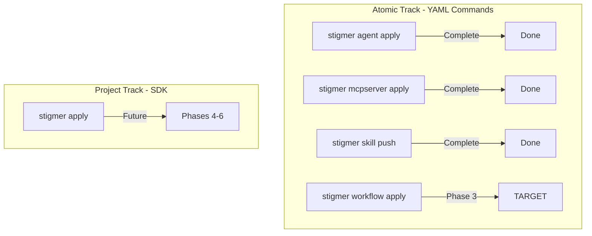

# Phase 3: Workflow YAML-First Implementation

## Architecture Context

The Dual-Track Interface (ADR-005) requires consistent UX across all resources. Currently, Agent, MCP Server, and Skill have YAML support, but Workflow does not. This phase completes the Atomic Track by adding `stigmer workflow apply workflow.yaml`.




## Key Files to Reference

- **Agent loader pattern**: [client-apps/cli/internal/cli/agent/loader.go](client-apps/cli/internal/cli/agent/loader.go)
- **Agent validator pattern**: [client-apps/cli/internal/cli/agent/validator.go](client-apps/cli/internal/cli/agent/validator.go)
- **Agent applier pattern**: [client-apps/cli/internal/cli/agent/applier.go](client-apps/cli/internal/cli/agent/applier.go)
- **Workflow proto**: [apis/ai/stigmer/agentic/workflow/v1/api.proto](apis/ai/stigmer/agentic/workflow/v1/api.proto)
- **Workflow spec**: [apis/ai/stigmer/agentic/workflow/v1/spec.proto](apis/ai/stigmer/agentic/workflow/v1/spec.proto)
- **Existing workflow package**: [client-apps/cli/internal/cli/workflow/](client-apps/cli/internal/cli/workflow/)

## Backend Status

The backend already supports YAML-derived workflows via the existing Apply RPC:

```protobuf
// From command.proto - ALREADY EXISTS
service WorkflowCommandController {
  rpc apply(Workflow) returns (Workflow);
}
```

No backend changes required.

---

## Sub-task Breakdown

### T03.1: Workflow YAML Loader (60-75 min)

**Goal**: Create `internal/cli/workflow/loader.go` that loads workflow YAML files and validates them using protovalidate.

**Deliverables**:

- `loader.go` (~180 lines) - Core loading logic
- `loader_test.go` (~350 lines) - Comprehensive test suite

**Implementation**:

- Mirror agent `loader.go` pattern exactly
- Constants: `DefaultFileName = "workflow.yaml"`, `AlternateFileName = "WORKFLOW.yaml"`
- Package-level `protovalidate.Validator` initialized in `init()`
- Functions: `Load()`, `resolveFilePath()`, `parseContent()`, `yamlMapToJSON()`, `convertYAMLValue()`
- Strict parsing: `DiscardUnknown: false`
- Auto-detection of default filenames in current directory

**Proto validation already covers**:

- `api_version = 'agentic.stigmer.ai/v1'`
- `kind = 'Workflow'`
- `metadata` required
- `spec.document` required (dsl, namespace, name, version)
- `spec.tasks` min 1 item
- Task `name`, `kind`, `task_config` required

**Test cases**:

- Valid workflow YAML loading
- Valid workflow JSON loading
- Auto-detection (workflow.yaml, WORKFLOW.yaml)
- Missing file error
- Invalid YAML syntax
- protovalidate errors (wrong apiVersion, kind, missing fields)
- Unknown field rejection (strict parsing)

---

### T03.2: Workflow Cross-Field Validator (60-75 min)

**Goal**: Create `internal/cli/workflow/validator.go` for business logic validation that cannot be expressed in proto rules.

**Deliverables**:

- `validator.go` (~150 lines) - Cross-field validation
- `validator_test.go` (~300 lines) - Comprehensive test suite

**Cross-field validations**:

1. **Task name uniqueness**: No duplicate `task.name` values within workflow
2. **Flow control references**: `flow.then` must reference an existing task name or "end"
3. **DAG validation**: No circular dependencies in flow control (A → B → A is invalid)
4. **Export validation**: `export.as` must be non-empty if present (already in proto, but verify)

**Implementation pattern** (following agent validator):

```go
func Validate(workflow *workflowv1.Workflow) error {
    if workflow == nil || workflow.Spec == nil {
        return nil // Schema validation handles required fields
    }
    
    if err := validateUniqueTaskNames(workflow.Spec); err != nil {
        return err
    }
    
    if err := validateFlowControlReferences(workflow.Spec); err != nil {
        return err
    }
    
    if err := validateNoCycles(workflow.Spec); err != nil {
        return err
    }
    
    return nil
}
```

**Error message quality**:

- Include field path (e.g., `tasks[2].flow.then`)
- Actionable guidance (e.g., "Available task names: taskA, taskB, taskC")
- Clear description of what went wrong

---

### T03.3: Workflow Applier (45-60 min)

**Goal**: Create `internal/cli/workflow/applier.go` for apply operations.

**Deliverables**:

- `applier.go` (~95 lines) - Apply logic
- Update `display.go` (+40 lines) - Add `DisplayApplyResult()`
- Update `BUILD.bazel` - Add protovalidate dependency

**Implementation** (mirror agent applier exactly):

```go
type ApplyOptions struct {
    Workflow *workflowv1.Workflow
    OrgID    string
    Conn     *grpc.ClientConn
    Quiet    bool
    DryRun   bool
}

type ApplyResult struct {
    Workflow *workflowv1.Workflow
    Created  bool
}

func Apply(opts *ApplyOptions) (*ApplyResult, error)
```

**Display functions**:

- `DisplayApplyResult(result *ApplyResult)` - Shows created/updated status
- `displayWorkflowSummary(workflow)` - Summary for dry-run mode

---

### T03.4: Workflow Apply Command (45-60 min)

**Goal**: Create `cmd/stigmer/root/workflow_apply.go` command.

**Deliverables**:

- `workflow_apply.go` (~150 lines) - Apply command
- Update `workflow.go` - Register command, update help text
- Update `BUILD.bazel` - Add source file

**Command structure**:

```
stigmer workflow apply [file] [flags]

Flags:
  --org         Organization override
  --dry-run     Validate without applying
```

**8-step orchestration** (mirror agent apply):

1. Load workflow YAML (auto-detect or explicit path)
2. Validate cross-field logic
3. Dry-run exit path (if enabled)
4. Load backend configuration
5. Resolve organization
6. Ensure daemon (local mode)
7. Connect to backend
8. Apply and display result

**Examples in help**:

```
# Apply workflow from file
stigmer workflow apply workflow.yaml

# Apply from current directory (auto-detect)
stigmer workflow apply

# Validate only (no backend)
stigmer workflow apply --dry-run

# Apply to specific organization
stigmer workflow apply workflow.yaml --org my-org
```

---

### T03.5: Workflow Validate Command (30-45 min)

**Goal**: Create `cmd/stigmer/root/workflow_validate.go` for CI-friendly validation.

**Deliverables**:

- `workflow_validate.go` (~80 lines) - Validate command
- Update `workflow.go` - Register command
- Update `BUILD.bazel` - Add source file

**Command structure**:

```
stigmer workflow validate [file] [flags]
```

**Behavior**:

- Load + validate without backend connection
- Exit code 0 = valid, 1 = invalid
- Useful for CI/CD pipelines
- Prints validation success message or detailed errors

---

### T03.6: Integration Testing and Documentation (30-45 min)

**Goal**: Final polish, integration tests, and documentation.

**Deliverables**:

- Sample workflow YAML for manual testing
- Update `workflow.go` long description (explain YAML-first support)
- Changelog entry
- Verify all coding guidelines met

**Sample workflow YAML** (for testing):

```yaml
apiVersion: agentic.stigmer.ai/v1
kind: Workflow
metadata:
  name: example-workflow
spec:
  document:
    dsl: "1.0.0"
    namespace: examples
    name: hello-world
    version: "1.0.0"
  tasks:
    - name: set-greeting
      kind: set_vars
      task_config:
        variables:
          greeting: "Hello, World!"
      export:
        as: "${.}"
```

---

## Coding Guidelines Compliance

All code must meet these standards:

- Files under 250 lines (target 150-180)
- Functions under 50 lines
- Every error wrapped with specific context
- Single responsibility per file
- No business logic in command handlers
- Descriptive file and function names

## Dependencies to Add

```bazel
# For loader.go and validator.go
"@build_buf_go_protovalidate//:protovalidate"

# For workflow proto stubs (already present)
"//apis/stubs/go/ai/stigmer/agentic/workflow/v1:workflow"
```

---

## Recommended Order

1. **T03.1** (Loader) - Foundation, no dependencies
2. **T03.2** (Validator) - Builds on loader
3. **T03.3** (Applier) - Builds on loader + validator
4. **T03.4** (Apply Command) - Orchestrates all internal components
5. **T03.5** (Validate Command) - Simpler version of apply
6. **T03.6** (Polish) - Documentation and final testing

Each sub-task is self-contained and can be committed independently.