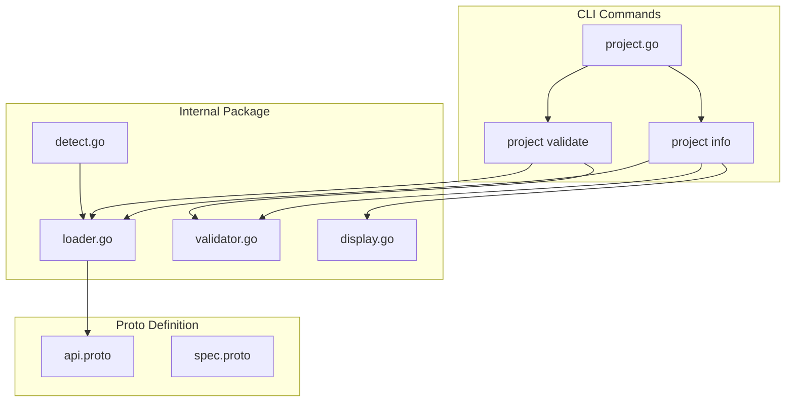

# Phase 4: Project Entity and stigmer.yaml Foundation

## Context

ADR-005 introduces a **Dual-Track Interface**:

- **Atomic Track** (complete): Individual YAML resources via `stigmer <resource> apply`
- **Project Track** (this phase): Aggregate management via `stigmer apply` with reconciliation

The **Project** is the aggregate root - the unit of reconciliation that owns a collection of resources.

---

## Current State Analysis

**Existing `Stigmer.yaml` ([config/stigmer.go](client-apps/cli/internal/cli/config/stigmer.go))**:

- Plain Go struct with yaml tags (no `apiVersion`/`kind`)
- Fields: `name`, `runtime`, `version`, `main`, `organization`
- Used for synthesis entry point discovery, NOT as an API resource

**ADR-005 Target**:

```yaml
apiVersion: stigmer.ai/v1
kind: Project
metadata:
  name: my-super-app
  org: my-org
spec:
  runtime: go
  entryPoint: main.go
```

**Decision**: Create Project as a **proper API resource** following Agent/Workflow patterns, with backward compatibility for legacy format.

---

## Proto Structure (following [agent/v1/api.proto](apis/ai/stigmer/agentic/agent/v1/api.proto))

New directory: `apis/ai/stigmer/agentic/project/v1/`

```
project/v1/
  api.proto      # Project message (apiVersion, kind, metadata, spec)
  spec.proto     # ProjectSpec (runtime, entryPoint, resources)
  io.proto       # I/O types (LoadProjectRequest, etc.)
```

---

## Sub-Tasks (7 focused tasks, 45-90 min each)

### T04.1: Project Proto Schema Design (~75 min)

**Goal**: Define the Project proto schema with validation rules.

**Files to Create**:

- `apis/ai/stigmer/agentic/project/v1/api.proto` - Project message
- `apis/ai/stigmer/agentic/project/v1/spec.proto` - ProjectSpec
- `apis/ai/stigmer/agentic/project/v1/io.proto` - I/O types

**Key Design Decisions**:

- `apiVersion: stigmer.ai/v1` (project is cross-cutting, not just agentic)
- `kind: Project`
- `metadata`: Uses shared `ApiResourceMetadata` (name, org)
- `spec.runtime`: Enum (GO, PYTHON, NODE) with validation
- `spec.entry_point`: String with file extension validation
- `spec.resources`: Repeated glob patterns for explicit resource includes

**Validation Rules** (protovalidate):

- `api_version`: `const = 'stigmer.ai/v1'`
- `kind`: `const = 'Project'`
- `metadata.name`: Required, pattern `^[a-z][a-z0-9-]*$`
- `spec.runtime`: Required, must be valid enum value
- `spec.entry_point`: Pattern for valid file paths

**Deliverable**: Proto stubs generated, ready for CLI integration.

**Testing**: Proto compiles, validation rules work via protovalidate.

---

### T04.2: Project Loader Foundation (~75 min)

**Goal**: Create project loader following established patterns exactly.

**Files to Create**:

- `client-apps/cli/internal/cli/project/loader.go` (~160 lines)
- `client-apps/cli/internal/cli/project/loader_test.go` (~400 lines)
- `client-apps/cli/internal/cli/project/BUILD.bazel`

**Pattern to Follow** (from [agent/loader.go](client-apps/cli/internal/cli/agent/loader.go)):

```go
// Package-level protovalidate validator
var validator protovalidate.Validator

func init() {
    validator, _ = protovalidate.New()
}

type LoadOptions struct {
    FilePath string  // Required explicit path
}

type LoadResult struct {
    Project    *projectv1.Project
    SourcePath string
}

func Load(opts *LoadOptions) (*LoadResult, error) {
    // 1. resolveFilePath() - validate file exists
    // 2. os.ReadFile() - read content
    // 3. parseContent() - YAML/JSON to proto
    // 4. validator.Validate() - protovalidate
}
```

**Critical Requirements**:

- `DiscardUnknown: false` (strict parsing)
- protovalidate as single source of truth
- Clear error messages with file paths

**Test Coverage** (12+ test cases):

- Valid YAML parsing
- Valid JSON parsing
- Missing required fields (name, runtime)
- Invalid runtime value
- Unknown fields rejected
- Malformed YAML
- File not found
- Empty file
- Invalid apiVersion
- Invalid kind

**Deliverable**: Loader passes all tests, builds with Bazel.

---

### T04.3: Project Validator (Cross-Field) (~60 min)

**Goal**: Business logic validation that protovalidate cannot express.

**Files to Create**:

- `client-apps/cli/internal/cli/project/validator.go` (~120 lines)
- `client-apps/cli/internal/cli/project/validator_test.go` (~300 lines)

**Cross-Field Validations**:

1. **Runtime-EntryPoint Consistency**:
  - GO runtime requires `.go` extension
  - PYTHON runtime requires `.py` extension
  - NODE runtime requires `.js` or `.ts` extension
2. **Resource Glob Syntax**:
  - Validate glob patterns are syntactically valid
  - Warn on patterns that match nothing (at apply time)
3. **Reserved Names**:
  - Project name cannot be `default`, `system`, etc.

**Pattern** (from [workflow/validator.go](client-apps/cli/internal/cli/workflow/validator.go)):

```go
func Validate(project *projectv1.Project) error {
    if err := validateRuntimeEntryPoint(project); err != nil {
        return err
    }
    if err := validateResourceGlobs(project); err != nil {
        return err
    }
    return nil
}
```

**Test Coverage** (10+ test cases):

- GO with main.go (valid)
- GO with main.py (invalid - wrong extension)
- PYTHON with main.py (valid)
- Invalid glob syntax
- Reserved project name
- Empty entry point defaults correctly

**Deliverable**: Validator catches cross-field errors with actionable messages.

---

### T04.4: Project Display (~45 min)

**Goal**: Consistent output formatting for project info.

**Files to Create**:

- `client-apps/cli/internal/cli/project/display.go` (~100 lines)

**Functions** (following [agent/display.go](client-apps/cli/internal/cli/agent/display.go)):

```go
func DisplayProjectInfo(project *projectv1.Project, format string) error
func displayProjectTable(project *projectv1.Project) error
func displayProjectYAML(project *projectv1.Project) error
func displayProjectJSON(project *projectv1.Project) error
```

**Table Output**:

```
PROJECT INFORMATION
Name:        my-super-app
Organization: acme-corp
Runtime:     go
Entry Point: main.go
Resources:   ./agents/*.yaml, ./workflows/*.yaml
```

**Deliverable**: Clean, consistent display matching other resource types.

---

### T04.5: Track Detection Logic (~60 min)

**Goal**: Determine which track (Atomic/Project/Legacy) based on context.

**Files to Create**:

- `client-apps/cli/internal/cli/project/detect.go` (~120 lines)
- `client-apps/cli/internal/cli/project/detect_test.go` (~250 lines)

**Detection Logic**:

```go
type Track string

const (
    TrackAtomic  Track = "atomic"   // No stigmer.yaml, resource file provided
    TrackProject Track = "project"  // New stigmer.yaml with apiVersion/kind
    TrackLegacy  Track = "legacy"   // Old stigmer.yaml without apiVersion/kind
)

type DetectionResult struct {
    Track       Track
    ProjectPath string  // Path to stigmer.yaml (if found)
    ProjectRoot string  // Directory containing stigmer.yaml
}

func DetectTrack(resourceFile string) (*DetectionResult, error)
```

**Walk-Up Algorithm**:

1. Check current directory for `stigmer.yaml` or `Stigmer.yaml`
2. If not found, walk up parent directories (max 10 levels)
3. Determine format by checking for `apiVersion` field

**Test Coverage**:

- stigmer.yaml in current dir (new format)
- stigmer.yaml in parent dir (new format)
- Stigmer.yaml in current dir (legacy format)
- No stigmer.yaml (atomic track)
- Both formats present (prefer new)

**Deliverable**: Reliable track detection for CLI routing.

---

### T04.6: Project Command Group (~75 min)

**Goal**: CLI commands for project management.

**Files to Create**:

- `client-apps/cli/cmd/stigmer/root/project.go` (~200 lines)
- Update `root.go` to register project command

**Command Structure**:

```
stigmer project (alias: proj)
  info       Display project configuration
  validate   Validate stigmer.yaml without deploying
```

**Implementation** (following [workflow.go](client-apps/cli/cmd/stigmer/root/workflow.go)):

```go
func NewProjectCommand() *cobra.Command {
    cmd := &cobra.Command{
        Use:     "project",
        Aliases: []string{"proj"},
        Short:   "Manage Stigmer projects",
    }
    cmd.AddCommand(newProjectInfoCommand())
    cmd.AddCommand(newProjectValidateCommand())
    return cmd
}

func newProjectInfoCommand() *cobra.Command
func newProjectValidateCommand() *cobra.Command
```

**project info**:

- Detect stigmer.yaml (walk up tree)
- Load and validate
- Display with --output flag (table/yaml/json)

**project validate**:

- Load stigmer.yaml
- Run schema + cross-field validation
- CI-friendly exit codes (0=valid, 1=invalid)

**Deliverable**: Working CLI commands, integrated with root.

---

### T04.7: Integration and Documentation (~60 min)

**Goal**: End-to-end validation and documentation.

**Tasks**:

1. **Example stigmer.yaml**:
  - Create `examples/project/stigmer.yaml` with new format
  - Include sample main.go entry point
2. **Test End-to-End**:
  - `stigmer project info` in example directory
  - `stigmer project validate examples/project/stigmer.yaml`
  - Verify error messages for invalid configs
3. **Migration Guide**:
  - Document old format vs new format
  - Provide conversion instructions
  - Error messages guide users to migrate
4. **Update next-task.md**:
  - Mark Phase 4 sub-tasks complete
  - Update context for Phase 5

**Deliverable**: Phase 4 complete, ready for Phase 5 (SDK Unification).

---

## Engineering Standards Compliance

Per [coding-guidelines.mdc](client-apps/cli/.cursor/rules/coding-guidelines.mdc):

- **File sizes**: All files under 250 lines
- **Function sizes**: All functions under 50 lines
- **Error handling**: All errors wrapped with `errors.Wrap()`
- **Package organization**: 
  - `internal/cli/project/` for business logic
  - `cmd/stigmer/root/project.go` for thin command layer
- **No business logic in commands**: Commands only orchestrate

---

## Architecture Diagram




