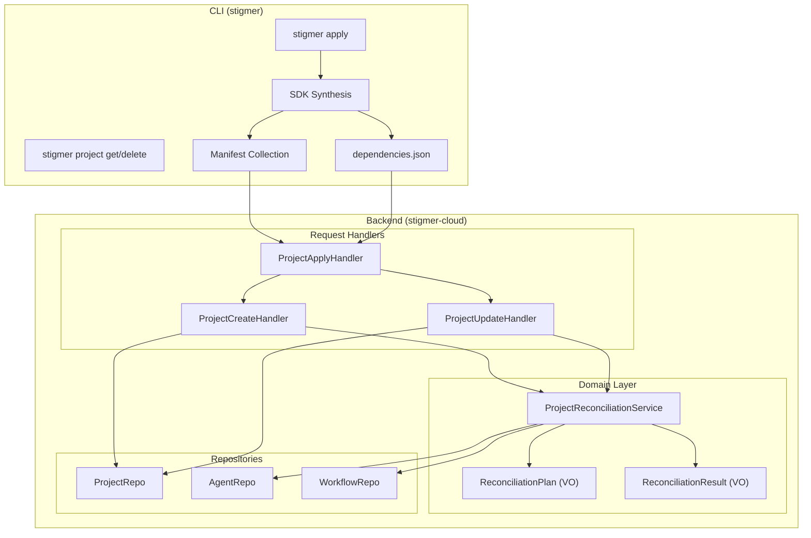

# Phase 5: Backend + Full CLI Integration

## Architecture Overview



## Domain Model (DDD)

**Aggregate Root**: `Project` - Contains agents, workflows, mcp_servers, skills

**Domain Service**: `ProjectReconciliationService` - Orchestrates reconciliation across aggregates

**Value Objects**:
- `ReconciliationPlan` - Immutable: dependency graph + diff (creates/updates/deletes)
- `ReconciliationResult` - Immutable: what was created/updated/deleted with slugs
- `DependencyGraph` - Immutable: edges map (internal domain concept, NOT a proto)
- `ResourceReference` - Immutable: extracted from ApiResourceReference proto fields

**Domain Components**:
- `DependencyDiscoverer` - Reflection-based scanner for ApiResourceReference fields
- `DependencyGraphBuilder` - Builds graph from discovered references

**Dependency Graph** (DERIVED by backend, not passed from CLI):
The backend scans all resources for `ApiResourceReference` fields using proto reflection.
This is dynamic - adding new reference fields works automatically without code changes.

```
Agent.spec.skill_refs[]           → agent depends on skills
Agent.spec.mcp_server_usages[]    → agent depends on mcp_servers
Workflow.spec.tasks[].agent_ref   → workflow depends on agents
```

## Dependency Order

Sub-tasks must be completed in order within each group.

```
Group A (Proto Foundation) ───────────────────────────────────────────┐
  T05.0 (Reconciliation Proto Types)                                  │
                                                                       │
Group B (CLI Foundation) ─────────────────────────────────────────────┤
  T05.1 → T05.2 → T05.3 → T05.4                                       │
                                                                       │
Group C (Backend Handlers) ───────────────────────────────────────────┼── Group E (CLI Apply)
  T05.5 → T05.6 → T05.7 → T05.8 → T05.9 → T05.10 → T05.11             │   T05.19 → T05.20 → T05.21 → T05.22
                                                                       │
Group D (Reconciliation Domain) ──────────────────────────────────────┤
  T05.12 → T05.13 → T05.14 → T05.15 → T05.16 → T05.17 → T05.18        │
                                                                       │
                                                                       ├── Group F (Testing)
                                                                       │   T05.23 → T05.24 → T05.25 → T05.26
```

---

## Group A: Proto Foundation

### T05.0: Reconciliation Proto Types (45-60 min)

**Goal**: Add ReconciliationSummary proto type for Apply response. Dependency graph is NOT a proto type - it's derived by backend.

**Files**:
- `apis/ai/stigmer/agentic/project/v1/reconciliation.proto` (new)
- `apis/ai/stigmer/agentic/project/v1/api.proto` (update - add last_reconciliation field)

**Architectural Decision: Dependency Graph is DERIVED, not passed**

The dependency graph is computed by the backend from resources, not passed from CLI:
- **Single Source of Truth**: Resources contain their references (ApiResourceReference fields)
- **No Sync Risk**: Graph derived from resources can't be stale
- **Open/Closed**: Adding new reference fields works automatically via reflection
- **SDK's dependencies.json**: Used for local CLI validation only, not sent to backend

**Proto Design**:

```protobuf
// reconciliation.proto
syntax = "proto3";
package ai.stigmer.agentic.project.v1;

import "ai/stigmer/commons/apiresource/api_resource_kind.proto";

// ReconciliationSummary contains the results of project reconciliation.
// Populated only in Apply response - not persisted to database.
message ReconciliationSummary {
  // Resources that were created during this apply.
  repeated ResourceChangeRecord created = 1;
  
  // Resources that were updated during this apply.
  repeated ResourceChangeRecord updated = 2;
  
  // Resources that were deleted (orphan pruning) during this apply.
  repeated ResourceChangeRecord deleted = 3;
}

// ResourceChangeRecord identifies a resource that was changed.
message ResourceChangeRecord {
  // The kind of resource (agent, workflow, mcp_server, skill).
  ai.stigmer.commons.apiresource.ApiResourceKind kind = 1;
  
  // The resource slug (human-readable identifier).
  string slug = 2;
  
  // The resource ID (system-assigned, e.g., agt_xxx, wfl_xxx).
  string resource_id = 3;
}

// NOTE: No DependencyGraph proto - it's an internal domain concept
// derived by backend via reflection on ApiResourceReference fields.
```

**Update api.proto**:

```protobuf
message Project {
  // ... existing fields ...
  
  // Populated only in Apply response. Not persisted.
  // Shows what changes were made during reconciliation.
  ReconciliationSummary last_reconciliation = 6;
  
  // NOTE: No dependency_graph field - backend derives it from resources
  // by scanning for ApiResourceReference fields using proto reflection.
}
```

**Tests**: Proto compilation, Go/Python/Java stub generation

**Success Criteria**:
- Proto compiles with buf lint passing
- Stubs generated for all languages
- No DependencyGraph proto (it's internal domain logic)

---

## Group B: CLI Project Package Completion

Foundation work completing the project internal package with backend integration.

### T05.1: Project Applier Foundation (45-60 min)

**Goal**: Create `applier.go` for gRPC apply orchestration.

**File**: `client-apps/cli/internal/cli/project/applier.go`

**Pattern Reference**: [agent/applier.go](client-apps/cli/internal/cli/agent/applier.go)

**Implementation**:

- `ApplyOptions` struct: Project, OrgID, Conn, Quiet, DryRun
- `ApplyResult` struct: Project, Created (bool)
- `Apply(opts *ApplyOptions) (*ApplyResult, error)` - orchestration
- Set `metadata.org` before apply
- Create gRPC client: `projectv1.NewProjectCommandControllerClient(conn)`
- Call `client.Apply(ctx, project)` RPC

**Tests** (in `applier_test.go`):

- Options validation (nil project, missing org)
- DryRun mode (validate only, no RPC)
- Metadata population (org set correctly)

**Success Criteria**:

- All tests passing
- Pattern matches agent/applier.go exactly
- Build verified with Bazel

---

### T05.2: Project Get Foundation (45-60 min)

**Goal**: Create `get.go` for gRPC get/getByReference orchestration.

**File**: `client-apps/cli/internal/cli/project/get.go`

**Pattern Reference**: [agent/get.go](client-apps/cli/internal/cli/agent/get.go)

**Implementation**:

- `GetOptions` struct: Reference, OrgID, Conn
- `Get(opts *GetOptions) (*projectv1.Project, error)` - high-level
- `GetFromBackend(conn, orgID, ref)` - low-level gRPC
- Reference parsing via `pkg/reference.Parse()`
- Route to `Get()` for IDs, `GetByReference()` for slugs

**Tests** (in `get_test.go`):

- Reference type detection (ID vs slug vs org/slug)
- Options validation
- Error wrapping

**Success Criteria**:

- All tests passing
- Pattern matches agent/get.go exactly
- Uses enum-based ID detection (no hardcoded prefixes)

---

### T05.3: Project Delete Foundation (45-60 min)

**Goal**: Create `delete.go` for gRPC delete orchestration.

**File**: `client-apps/cli/internal/cli/project/delete.go`

**Pattern Reference**: [agent/delete.go](client-apps/cli/internal/cli/agent/delete.go)

**Implementation**:

- `DeleteOptions` struct: ProjectID, Conn
- `DeleteResult` struct: Project (deleted)
- `Delete(opts *DeleteOptions) (*DeleteResult, error)` - high-level
- `DeleteFromBackend(conn, projectID)` - low-level gRPC
- Create gRPC client: `projectv1.NewProjectCommandControllerClient(conn)`
- Call `client.Delete(ctx, &ProjectId{Value: id})`

**Tests** (in `delete_test.go`):

- Options validation (nil conn, empty ID)
- Result structure
- Error wrapping

**Success Criteria**:

- All tests passing
- Pattern matches agent/delete.go exactly
- Returns deleted project for confirmation

---

### T05.4: Project CLI Commands (get, delete) (60-75 min)

**Goal**: Add `get` and `delete` subcommands to `stigmer project`.

**Files**:

- `cmd/stigmer/root/project_get.go` (new)
- `cmd/stigmer/root/project_delete.go` (new)
- `cmd/stigmer/root/project.go` (update - register commands)

**Pattern Reference**: [agent_get.go](cmd/stigmer/root/agent_get.go), [agent_delete.go](cmd/stigmer/root/agent_delete.go)

**Implementation**:

`project_get.go`:

- `newProjectGetCommand()` with --output, --org flags
- `executeProjectGet()` - 5-step orchestration
- Reference resolution (slug, org/slug, ID)
- Output formats: table/yaml/json

`project_delete.go`:

- `newProjectDeleteCommand()` with --force, --org flags
- `executeProjectDelete()` - 8-step orchestration
- Interactive confirmation via survey
- Force flag for scripting

**Tests**: Manual verification (command integration)

**Success Criteria**:

- Commands match agent pattern exactly
- Build verified with Bazel
- Manual test: `stigmer project get --help` works

---

## Group B: Backend Handlers

Java backend implementation following pipeline-based handler patterns.

### T05.5: ProjectRepo Foundation (45-60 min)

**Goal**: Create MongoDB repository for Project resources.

**File**: `backend/services/stigmer-service/src/main/java/ai/stigmer/domain/agentic/project/repo/ProjectRepo.java`

**Pattern Reference**: `AgentRepo.java`, `McpServerRepo.java`

**Implementation**:

```java
@Component
@ApiResourceRepo(kind = ApiResourceKind.project)
public class ProjectRepo extends AbstractMongoApiResourceRepository<Project> {
    public ProjectRepo(MongoTemplate mongoTemplate) {
        super(mongoTemplate, "project");
    }
    
    @Override
    protected Message.Builder getMessageBuilder() {
        return Project.newBuilder();
    }
    
    public Optional<Project> findByOrgAndSlug(String orgId, String slug);
    public List<Project> findByIds(List<String> ids);
}
```

**Tests**: Repository unit tests with embedded MongoDB

**Success Criteria**:

- Repository compiles
- Basic CRUD operations work
- Pattern matches existing repos

---

### T05.6: Project Create Handler (45-60 min)

**Goal**: Implement ProjectCommandController.create() handler.

**File**: `backend/services/stigmer-service/src/main/java/ai/stigmer/domain/agentic/project/request/handler/ProjectCreateHandler.java`

**Pattern Reference**: `AgentCreateHandler.java`

**Implementation**:

```java
@RequestRoute(controller = ProjectCommandControllerGrpc.class,
        method = ProjectCommandController.Method.create)
public class ProjectCreateHandler extends CreateOperationHandlerV2<Project> {
    @Override
    protected RequestPipelineV2<CreateContextV2<Project>> pipeline() {
        return RequestPipelineV2.<CreateContextV2<Project>>builder(...)
            .addStep(commonSteps.validateFieldConstraints)
            .addStep(createSteps.authorize)
            .addStep(commonSteps.resolveSlug)
            .addStep(createSteps.checkDuplicate)
            .addStep(createSteps.buildNewState)
            .addStep(createSteps.persist)
            .addStep(createSteps.createAuthorizationTuples)
            .addStep(commonSteps.publish)
            .addStep(commonSteps.transformResponse)
            .addStep(commonSteps.sendResponse)
            .build();
    }
}
```

**Tests**: Handler unit tests with mocked dependencies

**Success Criteria**:

- Handler compiles and registers
- Pipeline executes correctly
- FGA tuples created on success

---

### T05.7: Project Update Handler (45-60 min)

**Goal**: Implement ProjectCommandController.update() handler.

**File**: `backend/services/stigmer-service/src/main/java/ai/stigmer/domain/agentic/project/request/handler/ProjectUpdateHandler.java`

**Pattern Reference**: `McpServerUpdateHandler.java`

**Implementation**:

- Pipeline: Validate -> Load Existing -> Authorize -> Build New State -> Persist -> Publish
- Handles spec updates (runtime, entry_point, resources)
- Preserves immutable fields (id, created_at)

**Tests**: Handler unit tests

**Success Criteria**:

- Handler compiles and registers
- Existing resource loaded and updated
- Updated_at timestamp refreshed

---

### T05.8: Project Delete Handler (45-60 min)

**Goal**: Implement ProjectCommandController.delete() handler.

**File**: `backend/services/stigmer-service/src/main/java/ai/stigmer/domain/agentic/project/request/handler/ProjectDeleteHandler.java`

**Pattern Reference**: `McpServerDeleteHandler.java`

**Implementation**:

- Pipeline: Validate -> Authorize -> Load Existing -> Delete -> Cleanup IAM -> Send Response
- Delete project from MongoDB
- Clean up FGA authorization tuples
- Return deleted project for confirmation

**Tests**: Handler unit tests

**Success Criteria**:

- Handler compiles and registers
- Project deleted from database
- FGA tuples cleaned up

---

### T05.9: Project Apply Handler (60-75 min)

**Goal**: Implement ProjectCommandController.apply() handler (upsert).

**File**: `backend/services/stigmer-service/src/main/java/ai/stigmer/domain/agentic/project/request/handler/ProjectApplyHandler.java`

**Pattern Reference**: `McpServerApplyHandler.java`

**Implementation**:

- Minimal 4-step pipeline
- Check if project exists (by org + name)
- Delegate to Create or Update handler
- Return created/updated project

**Tests**: Handler unit tests (create path + update path)

**Success Criteria**:

- Handler compiles and registers
- Create path works for new projects
- Update path works for existing projects

---

### T05.10: Project Get Handler (45-60 min)

**Goal**: Implement ProjectQueryController.get() handler.

**File**: `backend/services/stigmer-service/src/main/java/ai/stigmer/domain/agentic/project/request/handler/ProjectGetHandler.java`

**Pattern Reference**: `McpServerGetHandler.java`

**Implementation**:

- Pipeline: Validate -> Extract ID -> Authorize -> Load -> Transform -> Send
- Load project by ID from MongoDB
- FGA authorization check

**Tests**: Handler unit tests

**Success Criteria**:

- Handler compiles and registers
- Project loaded by ID
- Authorization enforced

---

### T05.11: Project GetByReference Handler (45-60 min)

**Goal**: Implement ProjectQueryController.getByReference() handler.

**File**: `backend/services/stigmer-service/src/main/java/ai/stigmer/domain/agentic/project/request/handler/ProjectGetByReferenceHandler.java`

**Pattern Reference**: `AgentGetByReferenceHandler.java`

**Implementation**:

- Custom pipeline with post-load authorization
- Parse org + slug from ApiResourceReference
- Load project by org + slug
- Authorize after loading (ID not known upfront)

**Tests**: Handler unit tests

**Success Criteria**:

- Handler compiles and registers
- Project loaded by org/slug reference
- Post-load authorization works

---

## Group D: Reconciliation Domain Layer

The core reconciliation logic as a Domain Service following DDD principles.

### T05.12: Domain Value Objects (60-75 min)

**Goal**: Create immutable Value Objects for reconciliation domain, including DependencyGraph as internal domain concept.

**Files**:
- `backend/services/stigmer-service/src/main/java/ai/stigmer/domain/agentic/project/reconcile/DependencyGraph.java`
- `backend/services/stigmer-service/src/main/java/ai/stigmer/domain/agentic/project/reconcile/ResourceReference.java`
- `backend/services/stigmer-service/src/main/java/ai/stigmer/domain/agentic/project/reconcile/ReconciliationPlan.java`
- `backend/services/stigmer-service/src/main/java/ai/stigmer/domain/agentic/project/reconcile/ReconciliationResult.java`
- `backend/services/stigmer-service/src/main/java/ai/stigmer/domain/agentic/project/reconcile/ResourceChange.java`
- `backend/services/stigmer-service/src/main/java/ai/stigmer/domain/agentic/project/reconcile/DesiredState.java`
- `backend/services/stigmer-service/src/main/java/ai/stigmer/domain/agentic/project/reconcile/ActualState.java`

**Design (Immutable Records)**:

```java
// DependencyGraph - INTERNAL domain concept (NOT a proto)
// Derived by backend via reflection, not passed from CLI
public record DependencyGraph(
    Map<String, Set<String>> edges    // resourceKey -> Set<dependencyKeys>
) {
    public DependencyGraph {
        // Defensive copy for immutability
        edges = Map.copyOf(edges.entrySet().stream()
            .collect(toMap(Map.Entry::getKey, e -> Set.copyOf(e.getValue()))));
    }
    
    // Topological sort for execution order
    public List<String> topologicalSort();
    
    // Reverse sort for deletion order
    public List<String> reverseTopologicalSort();
    
    // Detect cycles (invalid state)
    public Optional<List<String>> detectCycle();
}

// ResourceReference - Extracted from ApiResourceReference proto fields
public record ResourceReference(
    ApiResourceKind kind,
    String org,
    String slug
) {
    public ResourceReference {
        Objects.requireNonNull(slug, "slug cannot be null");
        if (slug.isBlank()) {
            throw new IllegalArgumentException("slug cannot be blank");
        }
    }
    
    // Returns "kind:slug" format
    public String toKey() {
        return kind.name().toLowerCase() + ":" + slug;
    }
}

// ReconciliationPlan - What changes need to be made (Pure, no side effects)
public record ReconciliationPlan(
    DependencyGraph dependencyGraph,       // DERIVED from resources
    List<ResourceChange> creates,          // Resources to create
    List<ResourceChange> updates,          // Resources to update
    List<ResourceChange> deletes,          // Orphans to prune
    List<String> executionOrder            // Topologically sorted resource keys
) {
    // Factory method: builds plan from desired vs actual diff
    public static ReconciliationPlan fromDiff(
        DesiredState desired,
        ActualState actual,
        DependencyGraph graph
    );
    
    public boolean isEmpty() { return creates.isEmpty() && updates.isEmpty() && deletes.isEmpty(); }
    public int totalChanges() { return creates.size() + updates.size() + deletes.size(); }
}

// ReconciliationResult - What changes were made (Immutable outcome)
public record ReconciliationResult(
    List<ResourceChangeRecord> created,
    List<ResourceChangeRecord> updated,
    List<ResourceChangeRecord> deleted,
    List<ReconciliationError> errors,
    boolean success
) {
    // Convert to proto for Apply response
    public ReconciliationSummary toProto();
}

// ResourceChange - A planned change (before execution)
public record ResourceChange(
    ApiResourceKind kind,
    String slug,
    String resourceKey,                    // "{kind}:{slug}"
    ChangeType changeType,                 // CREATE, UPDATE, DELETE
    Message desiredState,
    Message actualState
) {}

// DesiredState - Parsed from project.spec
public record DesiredState(
    Map<String, Agent> agents,
    Map<String, Workflow> workflows,
    Map<String, McpServer> mcpServers,
    Map<String, Skill> skills
) {}

// ActualState - Fetched from repositories
public record ActualState(
    Map<String, Agent> agents,
    Map<String, Workflow> workflows,
    Map<String, McpServer> mcpServers,
    Map<String, Skill> skills
) {}
```

**Tests**: Unit tests for all value object methods, especially DependencyGraph.topologicalSort()

**Success Criteria**:
- All records are immutable (defensive copies)
- DependencyGraph is internal domain concept (no proto)
- Topological sort handles cycles correctly

---

### T05.13: DependencyDiscoverer - Reflection-Based Scanner (60-75 min)

**Goal**: Create reflection-based scanner that finds ALL ApiResourceReference fields dynamically.

**File**: `backend/services/stigmer-service/src/main/java/ai/stigmer/domain/agentic/project/reconcile/DependencyDiscoverer.java`

**Design (Open/Closed Principle - works automatically when proto evolves)**:

```java
/**
 * Discovers all ApiResourceReference fields in a proto message tree using reflection.
 * 
 * This is schema-driven: the proto definition IS the source of truth.
 * No hardcoding of field paths - works automatically when proto evolves.
 */
public class DependencyDiscoverer {
    
    private static final String API_RESOURCE_REFERENCE_TYPE = 
        "ai.stigmer.commons.apiresource.ApiResourceReference";
    
    /**
     * Finds all ApiResourceReference messages anywhere in the proto tree.
     * 
     * @param resource The resource to scan (Agent, Workflow, etc.)
     * @return Set of discovered references
     */
    public Set<ResourceReference> discoverDependencies(Message resource) {
        Set<ResourceReference> references = new HashSet<>();
        walkMessage(resource, references);
        return references;
    }
    
    private void walkMessage(Message message, Set<ResourceReference> references) {
        for (var entry : message.getAllFields().entrySet()) {
            FieldDescriptor field = entry.getKey();
            Object value = entry.getValue();
            
            if (field.isRepeated()) {
                for (Object item : (List<?>) value) {
                    processValue(field, item, references);
                }
            } else {
                processValue(field, value, references);
            }
        }
    }
    
    private void processValue(FieldDescriptor field, Object value, 
                              Set<ResourceReference> references) {
        if (!(value instanceof Message msg)) {
            return; // Skip primitives
        }
        
        String typeName = msg.getDescriptorForType().getFullName();
        
        if (API_RESOURCE_REFERENCE_TYPE.equals(typeName)) {
            // Found an ApiResourceReference - extract it
            references.add(extractReference(msg));
        } else {
            // Recurse into nested messages
            walkMessage(msg, references);
        }
    }
    
    private ResourceReference extractReference(Message refMessage) {
        var descriptor = refMessage.getDescriptorForType();
        
        String slug = (String) refMessage.getField(descriptor.findFieldByName("slug"));
        String org = (String) refMessage.getField(descriptor.findFieldByName("org"));
        
        // Kind from ApiResourceReference.kind field
        var kindField = descriptor.findFieldByName("kind");
        ApiResourceKind kind = kindField != null 
            ? ApiResourceKind.forNumber(((EnumValueDescriptor) refMessage.getField(kindField)).getNumber())
            : ApiResourceKind.UNSPECIFIED;
            
        return new ResourceReference(kind, org, slug);
    }
}
```

**Tests**: Unit tests with various resource types (Agent, Workflow, etc.)

**Success Criteria**:
- Discovers references in nested messages
- Handles repeated fields correctly
- Works with any resource type (no hardcoding)

---

### T05.14: DependencyGraphBuilder (45-60 min)

**Goal**: Build dependency graph from resources using DependencyDiscoverer.

**File**: `backend/services/stigmer-service/src/main/java/ai/stigmer/domain/agentic/project/reconcile/DependencyGraphBuilder.java`

**Design**:

```java
/**
 * Builds dependency graph by scanning ALL resources for ApiResourceReference fields.
 * 
 * Uses DependencyDiscoverer for reflection-based discovery.
 * No hardcoded knowledge of which fields contain references.
 */
public class DependencyGraphBuilder {
    
    private final DependencyDiscoverer discoverer = new DependencyDiscoverer();
    
    public DependencyGraph buildFromDesiredState(DesiredState desired) {
        Map<String, Set<String>> edges = new HashMap<>();
        
        // Scan each resource type dynamically
        scanResources(ApiResourceKind.agent, desired.agents(), edges);
        scanResources(ApiResourceKind.workflow, desired.workflows(), edges);
        scanResources(ApiResourceKind.mcp_server, desired.mcpServers(), edges);
        scanResources(ApiResourceKind.skill, desired.skills(), edges);
        
        return new DependencyGraph(edges);
    }
    
    private <T extends Message> void scanResources(
            ApiResourceKind kind,
            Map<String, T> resources,
            Map<String, Set<String>> edges) {
        
        for (var entry : resources.entrySet()) {
            String slug = entry.getKey();
            T resource = entry.getValue();
            String resourceKey = kind.name().toLowerCase() + ":" + slug;
            
            // Discover ALL ApiResourceReference fields dynamically
            Set<ResourceReference> dependencies = discoverer.discoverDependencies(resource);
            
            for (ResourceReference dep : dependencies) {
                edges.computeIfAbsent(resourceKey, k -> new HashSet<>())
                     .add(dep.toKey());
            }
        }
    }
}
```

**Tests**: Unit tests for graph building

**Success Criteria**:
- Uses DependencyDiscoverer (no hardcoded field paths)
- Handles empty resources
- Graph edges are correct

---

### T05.15: ProjectReconciliationService Foundation (60-75 min)

**Goal**: Create the Domain Service skeleton with dependency injection.

**File**: `backend/services/stigmer-service/src/main/java/ai/stigmer/domain/agentic/project/reconcile/ProjectReconciliationService.java`

**Design (Domain Service)**:

```java
@Service
public class ProjectReconciliationService {

    private final AgentRepo agentRepo;
    private final WorkflowRepo workflowRepo;
    private final McpServerRepo mcpServerRepo;
    private final SkillRepo skillRepo;
    private final DependencyGraphBuilder graphBuilder;
    
    // Main entry point - called by Create/Update handlers AFTER project is persisted
    public ReconciliationResult reconcile(
        Project project,
        ReconciliationOptions options
    ) {
        // 1. Parse desired state from project.spec
        DesiredState desired = parseDesiredState(project);
        
        // 2. Fetch actual state from repositories
        ActualState actual = fetchActualState(project.getMetadata().getId());
        
        // 3. DERIVE dependency graph from resources (not passed from CLI)
        DependencyGraph graph = graphBuilder.buildFromDesiredState(desired);
        
        // 4. Build reconciliation plan (diff + dependency ordering)
        ReconciliationPlan plan = ReconciliationPlan.fromDiff(desired, actual, graph);
        
        // 5. Execute plan in dependency order
        return executePlan(plan, options);
    }
    
    DesiredState parseDesiredState(Project project);
    ActualState fetchActualState(String projectId);
    ReconciliationResult executePlan(ReconciliationPlan plan, ReconciliationOptions options);
}

public record ReconciliationOptions(
    boolean pruneEnabled,      // Default: true
    boolean dryRun             // Default: false
) {}
```

**Implementation**:
- Constructor injection for all repositories + DependencyGraphBuilder
- Logging with structured context (project ID, org)
- Transaction boundary considerations

**Tests**: Unit tests with mocked repositories

**Success Criteria**:
- Service compiles and Spring injects dependencies
- Graph is DERIVED, not received from CLI
- Method signatures match domain model

---

### T05.16: Desired State Parsing (45-60 min)

**Goal**: Parse desired state from Project spec.

**Method**: `ProjectReconciliationService.parseDesiredState(Project project)`

**Implementation**:

```java
DesiredState parseDesiredState(Project project) {
    ProjectSpec spec = project.getSpec();
    
    // Extract all resources, keyed by slug for O(1) lookup
    Map<String, Agent> agents = spec.getAgentsList().stream()
        .collect(toMap(a -> a.getMetadata().getName(), identity()));
    
    Map<String, Workflow> workflows = spec.getWorkflowsList().stream()
        .collect(toMap(w -> w.getMetadata().getName(), identity()));
    
    Map<String, McpServer> mcpServers = spec.getMcpServersList().stream()
        .collect(toMap(m -> m.getMetadata().getName(), identity()));
    
    Map<String, Skill> skills = spec.getSkillsList().stream()
        .collect(toMap(s -> s.getMetadata().getName(), identity()));
    
    return new DesiredState(agents, workflows, mcpServers, skills);
}
```

**Key Points**:
- Resources keyed by `metadata.name` (slug) for identity matching
- NO dependency graph field - it's derived by DependencyGraphBuilder
- Validates uniqueness within each resource type

**Tests**: Unit tests for parsing various project specs

**Success Criteria**:
- All resource types extracted correctly
- Duplicate slugs detected and rejected
- Empty specs produce empty DesiredState

---

### T05.17: Actual State Fetching (45-60 min)

**Goal**: Fetch actual state from repositories by project ownership.

**Method**: `ProjectReconciliationService.fetchActualState(String projectId)`

**Implementation**:

```java
ActualState fetchActualState(String projectId) {
    // Query each repo for resources owned by this project
    // Ownership determined by annotation: stigmer.ai/sdk.project = {projectId}
    
    List<Agent> agents = agentRepo.findByProjectId(projectId);
    List<Workflow> workflows = workflowRepo.findByProjectId(projectId);
    List<McpServer> mcpServers = mcpServerRepo.findByProjectId(projectId);
    List<Skill> skills = skillRepo.findByProjectId(projectId);
    
    // Convert to maps keyed by slug
    return new ActualState(
        agents.stream().collect(toMap(a -> a.getMetadata().getName(), identity())),
        workflows.stream().collect(toMap(w -> w.getMetadata().getName(), identity())),
        mcpServers.stream().collect(toMap(m -> m.getMetadata().getName(), identity())),
        skills.stream().collect(toMap(s -> s.getMetadata().getName(), identity()))
    );
}
```

**Repository Method to Add**:
```java
// In each repo (AgentRepo, WorkflowRepo, etc.)
List<T> findByProjectId(String projectId) {
    // Query: metadata.annotations["stigmer.ai/sdk.project"] == projectId
}
```

**Tests**: Unit tests with mocked repositories

**Success Criteria**:
- Project ownership filter works correctly
- Empty state handled (new project)
- Performance: batch queries, not N+1

---

### T05.18: Diff Algorithm (60-75 min)

**Goal**: Compare desired vs actual to produce ReconciliationPlan.

**Method**: `ReconciliationPlan.fromDiff(DesiredState desired, ActualState actual, DependencyGraph graph)`

**Implementation**:

```java
public static ReconciliationPlan fromDiff(
    DesiredState desired,
    ActualState actual,
    DependencyGraph graph
) {
    List<ResourceChange> creates = new ArrayList<>();
    List<ResourceChange> updates = new ArrayList<>();
    List<ResourceChange> deletes = new ArrayList<>();
    
    // Process each resource type
    diffResourceType(ApiResourceKind.mcp_server, 
        desired.mcpServers(), actual.mcpServers(), creates, updates, deletes);
    diffResourceType(ApiResourceKind.skill,
        desired.skills(), actual.skills(), creates, updates, deletes);
    diffResourceType(ApiResourceKind.agent,
        desired.agents(), actual.agents(), creates, updates, deletes);
    diffResourceType(ApiResourceKind.workflow,
        desired.workflows(), actual.workflows(), creates, updates, deletes);
    
    // Compute execution order from dependency graph
    List<String> executionOrder = topologicalSort(graph, creates, updates);
    
    return new ReconciliationPlan(graph, creates, updates, deletes, executionOrder);
}

private static <T extends Message> void diffResourceType(
    ApiResourceKind kind,
    Map<String, T> desired,
    Map<String, T> actual,
    List<ResourceChange> creates,
    List<ResourceChange> updates,
    List<ResourceChange> deletes
) {
    // Creates: in desired, not in actual
    for (var entry : desired.entrySet()) {
        String slug = entry.getKey();
        if (!actual.containsKey(slug)) {
            creates.add(new ResourceChange(kind, slug, 
                kind.name() + ":" + slug, ChangeType.CREATE, entry.getValue(), null));
        }
    }
    
    // Updates: in both, but different
    for (var entry : desired.entrySet()) {
        String slug = entry.getKey();
        if (actual.containsKey(slug)) {
            T desiredResource = entry.getValue();
            T actualResource = actual.get(slug);
            if (!protoEquals(desiredResource, actualResource)) {
                updates.add(new ResourceChange(kind, slug,
                    kind.name() + ":" + slug, ChangeType.UPDATE, desiredResource, actualResource));
            }
        }
    }
    
    // Deletes (orphans): in actual, not in desired
    for (var entry : actual.entrySet()) {
        String slug = entry.getKey();
        if (!desired.containsKey(slug)) {
            deletes.add(new ResourceChange(kind, slug,
                kind.name() + ":" + slug, ChangeType.DELETE, null, entry.getValue()));
        }
    }
}
```

**Key Logic**:
- Identity matching by `kind + slug` (not resource ID)
- Proto equality using `Message.equals()` or custom comparison
- Orphan detection: resources in actual but not in desired

**Tests**: Comprehensive unit tests (create-only, update-only, delete-only, mixed, no-op)

**Success Criteria**:
- All change types correctly identified
- Proto comparison works for all resource types
- Edge cases: empty desired, empty actual, identical states

---

### T05.19: Dependency-Ordered Apply (60-75 min)

**Goal**: Execute plan in topological order from DERIVED dependency graph.

**Method**: `ProjectReconciliationService.executePlan(ReconciliationPlan plan, ReconciliationOptions options)`

**Implementation**:

```java
ReconciliationResult executePlan(ReconciliationPlan plan, ReconciliationOptions options) {
    if (options.dryRun()) {
        // Return plan as result without executing
        return ReconciliationResult.dryRun(plan);
    }
    
    List<ResourceChangeRecord> created = new ArrayList<>();
    List<ResourceChangeRecord> updated = new ArrayList<>();
    List<ResourceChangeRecord> deleted = new ArrayList<>();
    List<ReconciliationError> errors = new ArrayList<>();
    
    // Execute creates/updates in dependency order (from DERIVED graph)
    for (String resourceKey : plan.executionOrder()) {
        ResourceChange change = findChange(plan, resourceKey);
        if (change == null) continue; // No-op resource
        
        try {
            ResourceChangeRecord result = executeChange(change);
            if (change.changeType() == ChangeType.CREATE) {
                created.add(result);
            } else {
                updated.add(result);
            }
        } catch (Exception e) {
            errors.add(new ReconciliationError(resourceKey, e.getMessage()));
            // Continue or abort based on policy
        }
    }
    
    // Execute deletes in reverse dependency order (if pruning enabled)
    if (options.pruneEnabled()) {
        deleted = pruneOrphans(plan.deletes(), errors);
    }
    
    return new ReconciliationResult(created, updated, deleted, errors, errors.isEmpty());
}

private ResourceChangeRecord executeChange(ResourceChange change) {
    return switch (change.kind()) {
        case agent -> executeAgentChange(change);
        case workflow -> executeWorkflowChange(change);
        case mcp_server -> executeMcpServerChange(change);
        case skill -> executeSkillChange(change);
        default -> throw new IllegalArgumentException("Unsupported kind: " + change.kind());
    };
}
```

**Topological Sort** (uses DERIVED dependency graph, not SDK-provided):

```java
// In DependencyGraph value object
public List<String> topologicalSort() {
    // Kahn's algorithm
    // Resources with no dependencies come first
    // Order: MCP Servers -> Skills -> Agents -> Workflows
}
```

**Tests**: Unit tests for ordering, partial failure handling

**Success Criteria**:
- Dependencies respected (never create agent before its MCP server)
- Circular dependencies detected and rejected
- Partial failures tracked with context

---

### T05.20: Orphan Pruning (45-60 min)

**Goal**: Delete orphaned resources with safety controls.

**Method**: Part of `executePlan()`, extracted for clarity

**Implementation**:

```java
List<ResourceChangeRecord> pruneOrphans(
    List<ResourceChange> orphans,
    List<ReconciliationError> errors
) {
    List<ResourceChangeRecord> deleted = new ArrayList<>();
    
    // Sort orphans in reverse dependency order
    // Workflows first, then Agents, then MCP Servers, then Skills
    List<ResourceChange> sortedOrphans = reverseTopologicalSort(orphans);
    
    for (ResourceChange orphan : sortedOrphans) {
        log.warn("Pruning orphaned resource: {} ({})", 
            orphan.slug(), orphan.kind());
        
        try {
            deleteResource(orphan);
            deleted.add(new ResourceChangeRecord(
                orphan.kind(), orphan.slug(), getResourceId(orphan.actualState())
            ));
        } catch (Exception e) {
            errors.add(new ReconciliationError(orphan.resourceKey(), 
                "Failed to delete orphan: " + e.getMessage()));
        }
    }
    
    return deleted;
}
```

**Safety Controls**:
- `--prune=false` flag disables deletion entirely
- Prominent log warnings before each deletion
- Audit trail: deleted resources returned in result
- Reverse dependency order prevents foreign key violations

**Tests**: Unit tests for pruning behavior, prune disabled

**Success Criteria**:
- Orphans deleted when pruning enabled
- Orphans preserved when pruning disabled
- Correct reverse ordering (dependents before dependencies)

---

## Group E: CLI stigmer apply Command

The root-level apply command for SDK synthesis workflow.

**Key Architectural Decision**: CLI does NOT pass dependency graph to backend. The backend derives it from resources using reflection. SDK's `dependencies.json` is used for LOCAL validation only (dry-run preview, cycle detection).

### T05.21: SDK Synthesis Runner (60-75 min)

**Goal**: Execute SDK entry point and capture synthesis output.

**File**: `client-apps/cli/internal/cli/apply/synthesize.go`

**Implementation**:

```go
type SynthesizeOptions struct {
    ProjectDir string
    Runtime    ProjectRuntime
    EntryPoint string
}

type SynthesizeResult struct {
    OutputDir  string                    // Temp dir with synthesis output
    Agents     []*agentv1.Agent
    Workflows  []*workflowv1.Workflow
    McpServers []*mcpserverv1.McpServer
    Skills     []*skillv1.Skill
    // Dependencies is for LOCAL validation only - NOT sent to backend
    Dependencies map[string][]string
}

func Synthesize(opts *SynthesizeOptions) (*SynthesizeResult, error)
```

- Create temp output directory
- Set `STIGMER_OUT_DIR` environment variable
- Execute entry point based on runtime
- Parse synthesis output (`.pb` files + `dependencies.json`)
- `dependencies.json` used for local dry-run preview only

**Tests**: Unit tests with mock execution

**Success Criteria**:
- All runtimes supported (go, python, node)
- Synthesis errors captured with context
- Output directory cleaned up on failure

---

### T05.22: Manifest Collection (45-60 min)

**Goal**: Collect and parse synthesized manifests. `dependencies.json` for LOCAL validation only.

**File**: `client-apps/cli/internal/cli/apply/manifest.go`

**Implementation**:

```go
type ManifestSet struct {
    Agents       []*agentv1.Agent
    Workflows    []*workflowv1.Workflow
    McpServers   []*mcpserverv1.McpServer
    Skills       []*skillv1.Skill
    // For local validation (dry-run preview) ONLY - NOT sent to backend
    LocalDependencies map[string][]string
}

func CollectManifests(outputDir string) (*ManifestSet, error)
```

- Glob for `*.pb` files in output directory
- Parse each file by type prefix
- Parse `dependencies.json` for LOCAL dry-run preview
- NO DependencyGraph proto - backend derives it

**Tests**: Unit tests with sample manifests

**Success Criteria**:
- All resource types detected and parsed
- dependencies.json parsed for local validation
- Invalid manifests rejected with guidance

---

### T05.23: Apply Command Integration (75-90 min)

**Goal**: Create `stigmer apply` root command.

**File**: `cmd/stigmer/root/apply.go`

**Implementation**:

```go
func executeApply(cmd *cobra.Command, args []string) error {
    // 1. Detect track
    result, _ := project.DetectTrack(&project.DetectOptions{})
    if result.Track == project.TrackAtomic {
        return errors.New("No stigmer.yaml found. Use 'stigmer <resource> apply <file>'")
    }
    
    // 2. Load and validate project
    proj := result.Project
    project.Validate(proj)
    
    // 3. Run SDK synthesis
    synthResult, _ := apply.Synthesize(&apply.SynthesizeOptions{...})
    
    // 4. Local dry-run preview (uses SDK's dependencies.json)
    if applyOpts.DryRun {
        displayLocalPreview(synthResult)
        return nil
    }
    
    // 5. Build Project proto with embedded resources
    // NOTE: NO dependency_graph field - backend derives it
    proj.Spec.Agents = synthResult.Agents
    proj.Spec.Workflows = synthResult.Workflows
    proj.Spec.McpServers = synthResult.McpServers
    proj.Spec.Skills = synthResult.Skills
    
    // 6. Connect and apply
    conn, _ := backend.Connect()
    applyResult, _ := project.Apply(&project.ApplyOptions{...})
    
    // 7. Display reconciliation summary (from backend response)
    displayReconciliationSummary(applyResult.Project.LastReconciliation)
    
    return nil
}
```

- Flags: `--org`, `--dry-run`, `--prune`
- NO dependency graph passed to backend

**Tests**: Manual verification

**Success Criteria**:
- Full SDK -> Deploy workflow works
- Dry-run uses LOCAL dependencies.json for preview
- Backend derives graph via reflection

---

### T05.24: Skill Pre-Push Flow (60-75 min)

**Goal**: Integrate skill push into apply workflow.

**Updates to**: `cmd/stigmer/root/apply.go`

**Design Decision**: Skills should be pushed separately before apply:
1. `stigmer skill push ./my-skill` - Push skill code
2. SDK references skill by name - `skill.ByName("my-skill")`
3. `stigmer apply` - Deploy project with skill references

This separation keeps apply fast and makes skill versioning explicit.

**Tests**: Integration tests with skill workflow

**Success Criteria**:
- Clear guidance when skills not pushed
- Error messages explain the workflow

---

## Group F: Testing and Documentation

### T05.25: Backend Unit Tests (60-75 min)

**Goal**: Comprehensive backend test coverage.

**Files**:
- Handler tests for all 7 handlers
- ProjectReconciliationService tests
- DependencyDiscoverer tests (reflection-based discovery)
- DependencyGraphBuilder tests
- Repository tests (ProjectRepo)
- Domain value object tests

**Coverage Targets**:
- All handler pipelines tested
- All reconciliation scenarios tested
- Reflection-based dependency discovery verified
- Topological sort handles cycles correctly
- Edge cases covered

---

### T05.26: CLI Unit Tests (60-75 min)

**Goal**: Comprehensive CLI test coverage.

**Files**:
- `applier_test.go`, `get_test.go`, `delete_test.go`
- `synthesize_test.go`, `manifest_test.go`

**Coverage Targets**:
- All internal package functions tested
- Error scenarios covered
- Options validation tested
- Local dependencies.json parsing tested (for dry-run)

---

### T05.27: Integration Tests (90 min)

**Goal**: End-to-end testing of SDK -> Deploy workflow.

**Test Scenarios**:
1. Fresh project deployment (all creates)
2. Project update (creates + updates)
3. Resource removal (orphan pruning)
4. Dry-run mode (uses local dependencies.json)
5. Backend derives dependency graph correctly
6. Circular dependency detection
7. Error handling (invalid SDK, backend errors)

---

### T05.28: Phase 5 Documentation (60-75 min)

**Goal**: Comprehensive documentation and changelog.

**Files**:
- Phase 5 completion changelog
- Updated `docs/guides/stigmer-projects.md` with reconciliation details
- Updated `examples/project/` with deployment examples
- Architecture diagram showing reflection-based dependency discovery

---

## Summary

| Group | Sub-tasks | Total Time | Dependencies |
|-------|-----------|------------|--------------|
| A: Proto Foundation | T05.0 | 45-60 min | None |
| B: CLI Foundation | T05.1-T05.4 | 3-4 hours | A |
| C: Backend Handlers | T05.5-T05.11 | 5-6 hours | A |
| D: Reconciliation Domain | T05.12-T05.20 | 7-8 hours | C |
| E: CLI Apply | T05.21-T05.24 | 4-5 hours | B, D |
| F: Testing/Docs | T05.25-T05.28 | 4-5 hours | All |

**Total Estimate**: 24-30 hours (across 29 sub-tasks)

**Recommended Execution Order**:
1. **T05.0** (Proto Foundation) - Must be first, defines wire types
2. **Group B** (CLI Foundation) - Can start after T05.0
3. **Group C** (Backend Handlers) - Can start in parallel with B after T05.0
4. **Group D** (Reconciliation Domain) - Depends on C
5. **Group E** (CLI Apply) - Integrates B and D
6. **Group F** (Testing/Docs) - Final validation

Each sub-task is 45-90 minutes with proper testing. Complete one, verify, commit, then proceed to next.

---

## Key Architectural Decisions

1. **DependencyGraph is DERIVED, not passed** - Backend computes it via reflection on ApiResourceReference fields
2. **DependencyDiscoverer uses proto reflection** - No hardcoded field paths, works when proto evolves (Open/Closed)
3. **SDK's dependencies.json is for LOCAL use only** - Dry-run preview, cycle detection - NOT sent to backend
4. **ProjectReconciliationService is a Domain Service** - Called by handlers after Project persisted
5. **Immutable Value Objects** - DependencyGraph, ReconciliationPlan, ReconciliationResult are records
6. **Apply returns ReconciliationSummary** - Shows created/updated/deleted with slugs
7. **Handlers are routers** - Business logic in domain service, not handlers
8. **Single Source of Truth** - Resources contain their references, graph is derived from them