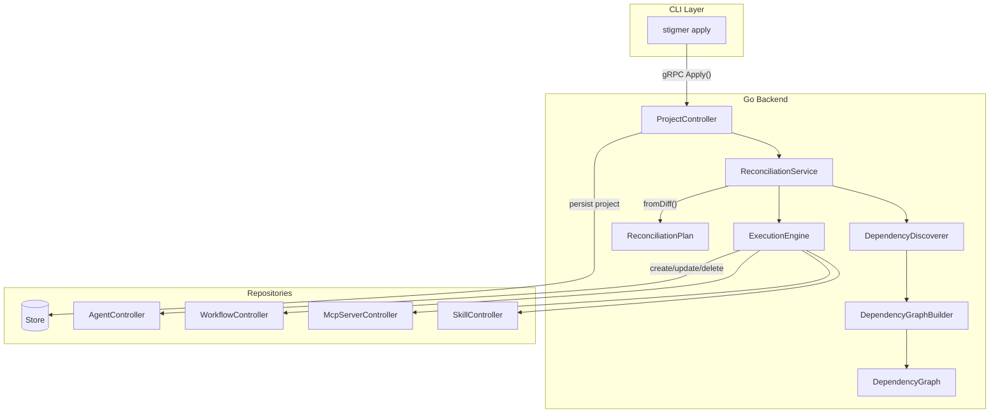

# Project Entity Backend Port to Go

## Architecture Overview

The Project entity is the aggregate root for SDK-based deployments. It contains embedded resources (agents, workflows, mcp_servers, skills) in its spec and uses a reconciliation engine to align actual state with desired state.




## Key Patterns to Follow

**Controller Pattern** (from [agent_controller.go](backend/services/stigmer-server/pkg/domain/agent/controller/agent_controller.go)):

- Embed `UnimplementedXxxCommandControllerServer` and `UnimplementedXxxQueryControllerServer`
- Use `store.Store` for persistence
- Pipeline-based handlers with standard steps

**Value Object Pattern** (from Java implementation):

- Immutable structs with factory functions
- No setters, all fields set at construction
- Builder pattern for complex construction

## File Structure

```
backend/services/stigmer-server/pkg/domain/project/
├── controller/
│   ├── project_controller.go    # Controller struct, constructor
│   ├── create.go                # Create handler
│   ├── update.go                # Update handler
│   ├── delete.go                # Delete handler
│   ├── get.go                   # Get by ID
│   ├── get_by_reference.go      # Get by slug
│   ├── apply.go                 # Apply with reconciliation
│   ├── BUILD.bazel
│   └── *_test.go files
└── reconcile/
    ├── resource_key.go          # Type-safe "{kind}:{slug}" keys
    ├── desired_state.go         # Parsed from Project.Spec
    ├── actual_state.go          # Fetched from repositories
    ├── change_type.go           # Enum: Create, Update, Delete
    ├── resource_change.go       # Single change record
    ├── reconciliation_plan.go   # Computed plan
    ├── reconciliation_result.go # Execution outcome
    ├── reconciliation_options.go# Configuration
    ├── dependency_graph.go      # Graph with topo sort
    ├── dependency_discoverer.go # Proto reflection scanner
    ├── graph_builder.go         # Build graph from state
    ├── diff.go                  # Diff algorithm
    ├── execution_order.go       # Order changes safely
    ├── reconciliation_service.go# Main orchestrator
    ├── execution_engine.go      # Execute plan
    ├── BUILD.bazel
    └── *_test.go files
```

## Implementation Phases

### Phase A: Foundation and Value Objects

**A1: Project Controller Foundation** (60 min)

- Create controller struct with embedded unimplemented servers
- Constructor accepting `store.Store` and downstream controller references
- Register in [server.go](backend/services/stigmer-server/pkg/server/server.go)
- Files: `project_controller.go`, `BUILD.bazel`, `README.md`

**A2: Reconciliation Value Objects - State** (75 min)

- `ResourceKey` - Type-safe composite key with Parse/String methods
- `DesiredState` - Immutable struct with slug-keyed maps
- `ActualState` - Same structure for current state
- ~25 tests covering key parsing, map operations

**A3: Reconciliation Value Objects - Plan** (75 min)

- `ChangeType` enum (Create, Update, Delete)
- `ResourceChange` with factory methods (NewCreate, NewUpdate, NewDelete)
- `ReconciliationPlan` with creates/updates/deletes lists
- `ReconciliationResult` with success tracking and error collection
- `ReconciliationOptions` with dryRun and pruneEnabled flags
- ~30 tests

### Phase B: Dependency Graph

**B1: Dependency Graph Value Object** (60 min)

- Immutable graph structure: `map[ResourceKey][]ResourceKey`
- `TopologicalSort()` using Kahn's algorithm
- `ReverseTopologicalSort()` for deletion order
- `DetectCycle()` using DFS with recursion stack
- ~35 tests (chains, diamonds, cycles, empty graphs)

**B2: Dependency Discoverer** (75 min)

- Use `protoreflect` to walk proto message tree
- Recursively find `ApiResourceReference` fields
- Handle repeated fields and nested messages
- Match by descriptor full name: `ai.stigmer.commons.apiresource.ApiResourceReference`
- ~25 tests with real proto fixtures

**B3: Dependency Graph Builder** (45 min)

- Iterate all resources in DesiredState
- Use DependencyDiscoverer to find references
- Build edges and construct immutable graph
- ~20 tests with real-world scenarios

### Phase C: Diff Algorithm

**C1: Diff Algorithm Core** (60 min)

- `ComputeDiff(desired, actual, graph) ReconciliationPlan`
- For each resource type: detect creates, updates, deletes
- `specEquals(a, b proto.Message)` - Compare spec only, ignore metadata
- ~30 tests covering all operation types

**C2: Execution Order** (45 min)

- `GetChangesInExecutionOrder()` - Topological order for creates/updates
- `GetDeletesInReverseDependencyOrder()` - Reverse order with kind fallback
- Kind hierarchy: Workflows -> Agents -> MCP Servers -> Skills
- ~20 tests

### Phase D: CRUD Handlers

**D1: Create and Update Handlers** (75 min)

- Standard pipeline: ValidateProto -> ResolveSlug -> CheckDuplicate -> BuildNewState -> Persist
- Update pipeline: ValidateProto -> ResolveSlug -> LoadExisting -> BuildUpdateState -> Persist
- ~25 tests

**D2: Get and GetByReference Handlers** (45 min)

- Get: ValidateProto -> LoadTarget
- GetByReference: ValidateProto -> LoadByReference
- ~15 tests

**D3: Delete Handler** (45 min)

- Pipeline: ValidateProto -> ExtractResourceId -> LoadExistingForDelete -> DeleteResource
- Consider cascade behavior (document decision)
- ~12 tests

**D4: Apply Handler** (90 min)

- Idempotent create-or-update with reconciliation
- Call ReconciliationService.Reconcile()
- Set `status.last_reconciliation` from result
- Return project with ReconciliationSummary
- ~25 tests

### Phase E: Reconciliation Service

**E1: Reconciliation Service Core** (90 min)

- `Reconcile(project, options) (ReconciliationResult, error)`
- `parseDesiredState(project)` - Extract from Project.Spec
- `fetchActualState(projectId)` - Query by ownership annotation
- Orchestrate: parse -> fetch -> build graph -> diff -> execute
- ~30 tests

**E2: Execution Engine** (90 min)

- `executePlan(plan, options, projectId) ReconciliationResult`
- Execute creates/updates in topological order
- Execute deletes in reverse order
- Set project ownership annotation: `stigmer.ai/sdk.project`
- Handle partial failures (continue, collect errors)
- ~30 tests

## Critical Implementation Details

**Resource Key Format**: `{kind}:{slug}` (e.g., `agent:my-agent`, `mcp_server:github-api`)

**Project Ownership Annotation**: Resources created by reconciliation get:

```go
metadata.annotations["stigmer.ai/sdk.project"] = projectId
```

**Spec-Only Comparison**: When detecting updates, compare only `spec` fields:

```go
func specEquals(a, b proto.Message) bool {
    // Compare spec fields only, ignore metadata (timestamps, IDs)
}
```

**Topological Sort** (Kahn's Algorithm):

1. Compute in-degree for all nodes
2. Start with nodes having in-degree 0
3. Remove edges, add newly zero in-degree nodes
4. Detect cycle if nodes remain with non-zero in-degree

**Error Handling**: Partial failures don't halt execution:

```go
for _, change := range plan.GetChangesInExecutionOrder() {
    if err := execute(change); err != nil {
        result.AddError(change, err)
        continue // Don't fail fast
    }
    result.AddSuccess(change)
}
```

## Quality Requirements

- All functions under 50 lines
- All files under 300 lines (split if needed)
- Table-driven tests with descriptive names
- Immutable value objects (no setters)
- Comprehensive error messages
- Pass `go vet`, `gofmt`, Bazel build
- > 80% test coverage per file

