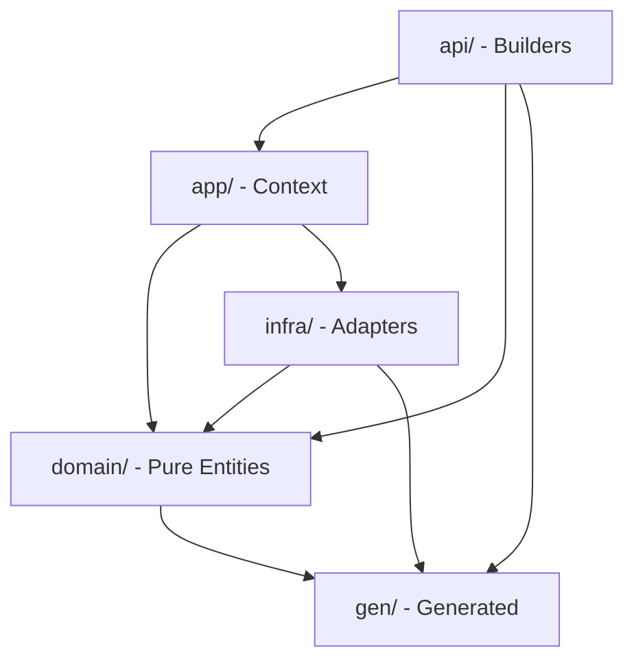

# SDK DDD Layer Reorganization Plan

## Target Architecture

```
sdk/go/
├── domain/           # Pure business logic (zero external deps)
│   ├── agent/
│   ├── workflow/
│   ├── mcpserver/
│   ├── skill/
│   ├── refs/         # Value Objects (skillref, mcpserverref, subagent)
│   └── environment/
├── app/              # Application layer (orchestration)
│   ├── context.go
│   ├── refs.go
│   ├── run.go
│   └── synthesis.go
├── infra/            # Infrastructure (adapters)
│   ├── proto/        # Domain → Proto conversion
│   ├── validation/
│   └── synth/
├── api/              # Public API (builders, ergonomic constructors)
│   ├── agent/
│   ├── workflow/
│   ├── mcpserver/
│   └── skill/
├── gen/              # Generated code (Args structs, types)
│   ├── args/
│   └── types/
└── naming/           # Shared utilities
```

## Dependency Flow




---

## Phase 1: Foundation - Generated Code Cleanup

### Task 1.1: Consolidate gen/ structure (45 min)

**Goal**: Unify all generated code under `gen/` with clean organization

**Changes**:

- Move `workflow/gen/*.go` → `gen/workflow/` (already exists, merge)
- Reorganize into `gen/args/` and `gen/types/`
- Update codegen tool if needed

**Files**:

- [gen/](sdk/go/gen/) - reorganize structure
- [workflow/gen/](sdk/go/workflow/gen/) - contents to move

**Test**: `go build ./gen/...` passes

---

## Phase 2: Domain Layer - Value Objects

### Task 2.1: Create domain/refs/ package (60 min)

**Goal**: Consolidate all reference Value Objects into single package

**Changes**:

- Create `domain/refs/skillref.go` from [skillref/skillref.go](sdk/go/skillref/skillref.go)
- Create `domain/refs/mcpserverref.go` from [mcpserverref/mcpserverref.go](sdk/go/mcpserverref/mcpserverref.go)
- Create `domain/refs/subagent.go` from [subagent/subagent.go](sdk/go/subagent/subagent.go)
- Pure domain logic only, no proto conversion

**Test**: Unit tests for all Value Object invariants

### Task 2.2: Create domain/environment/ package (45 min)

**Goal**: Pure environment Variable value object

**Changes**:

- Create `domain/environment/variable.go` from [environment/environment.go](sdk/go/environment/environment.go)
- Remove proto conversion (move to infra later)

**Test**: Unit tests for Variable creation and validation

---

## Phase 3: Domain Layer - Core Entities

### Task 3.1: Create domain/agent/ entity (60 min)

**Goal**: Pure Agent entity with invariants, no builders

**Changes**:

- Create `domain/agent/agent.go` - core struct with Name, Slug, Args
- Create `domain/agent/errors.go` - domain-specific errors
- Entity protects its invariants (no public setters for critical fields)
- NO builder methods, NO proto conversion

**Key struct**:

```go
type Agent struct {
    Name     string
    Slug     string
    Org      string
    Args     *gen.AgentArgs
    // Internal state
}
func (a *Agent) Validate() error  // Enforces invariants
```

**Test**: Entity validation, invariant protection

### Task 3.2: Create domain/mcpserver/ entity (45 min)

**Goal**: Pure MCPServer entity

**Changes**:

- Create `domain/mcpserver/mcpserver.go` from [mcpserver/server.go](sdk/go/mcpserver/server.go)
- Remove builder methods and proto conversion

**Test**: Entity validation tests

### Task 3.3: Create domain/skill/ entity (45 min)

**Goal**: Pure Skill entity

**Changes**:

- Create `domain/skill/skill.go` from [skill/synth.go](sdk/go/skill/synth.go)
- Domain logic only

**Test**: Entity validation tests

### Task 3.4: Create domain/workflow/ entity (90 min)

**Goal**: Pure Workflow entity with Task hierarchy

**Changes**:

- Create `domain/workflow/workflow.go`
- Create `domain/workflow/task.go` - Task value object hierarchy
- This is the largest domain entity

**Test**: Workflow structure and task validation

---

## Phase 4: Infrastructure Layer

### Task 4.1: Create infra/validation/ (45 min)

**Goal**: Move validation utilities

**Changes**:

- Move [internal/validation/](sdk/go/internal/validation/) → `infra/validation/`
- Keep protovalidate integration

**Test**: Existing validation tests pass

### Task 4.2: Create infra/synth/ (45 min)

**Goal**: Move synthesis utilities

**Changes**:

- Move [internal/synth/](sdk/go/internal/synth/) → `infra/synth/`

**Test**: Interpolator tests pass

### Task 4.3: Create infra/proto/ adapters (90 min)

**Goal**: All proto conversion in one place

**Changes**:

- Create `infra/proto/agent.go` from [agent/proto.go](sdk/go/agent/proto.go)
- Create `infra/proto/mcpserver.go` from [mcpserver/proto.go](sdk/go/mcpserver/proto.go)
- Create `infra/proto/skill.go`
- Create `infra/proto/workflow.go` from [workflow/proto.go](sdk/go/workflow/proto.go)

**Test**: Proto conversion tests, round-trip verification

---

## Phase 5: Application Layer

### Task 5.1: Create app/context.go (60 min)

**Goal**: Core Context struct for resource registration

**Changes**:

- Create `app/context.go` from [stigmer/context.go](sdk/go/stigmer/context.go)
- Resource registration methods
- Variable management

**Test**: Context creation and registration tests

### Task 5.2: Create app/synthesis.go (60 min)

**Goal**: Synthesis orchestration

**Changes**:

- Extract synthesis logic from context.go
- Output generation to `.stigmer/` directory

**Test**: Synthesis output verification

### Task 5.3: Create app/run.go (30 min)

**Goal**: Run() entry point

**Changes**:

- Create clean Run() and RunWithContext() functions

**Test**: Integration test with Run()

---

## Phase 6: API Layer (Builders)

### Task 6.1: Create api/agent/ builder (60 min)

**Goal**: Ergonomic Agent construction API

**Changes**:

- Create `api/agent/builder.go` with `New()` function
- Create `api/agent/options.go` - functional options
- Move [agent/parsing.go](sdk/go/agent/parsing.go) smart parsing here

**Public API**:

```go
import "github.com/stigmer/stigmer/sdk/go/api/agent"

agent.New(ctx, "code-reviewer", &agent.Args{
    Instructions: "Review code...",
})
```

**Test**: Builder tests, smart parsing tests

### Task 6.2: Create api/mcpserver/ builder (45 min)

**Goal**: MCPServer construction API

**Changes**:

- Create `api/mcpserver/builder.go` with `Stdio()`, `HTTP()` constructors

**Test**: Builder tests

### Task 6.3: Create api/skill/ builder (45 min)

**Goal**: Skill construction API

**Changes**:

- Create `api/skill/builder.go` with `FromDir()`, `FromGit()` constructors

**Test**: Builder tests

### Task 6.4: Create api/workflow/ builder (90 min)

**Goal**: Workflow and Task construction API

**Changes**:

- Create `api/workflow/builder.go`
- Create task helpers (AgentCall, HTTPCall, etc.)

**Test**: Workflow builder tests

---

## Phase 7: Cleanup and Migration

### Task 7.1: Create naming/ utility package (30 min)

**Goal**: Move shared naming utilities

**Changes**:

- Move [stigmer/naming/](sdk/go/stigmer/naming/) → `naming/`

**Test**: Slug generation tests

### Task 7.2: Delete old packages (45 min)

**Goal**: Remove legacy structure

**Changes**:

- Delete: `agent/`, `workflow/`, `mcpserver/`, `skill/`, `skillref/`, `mcpserverref/`, `subagent/`, `environment/`, `stigmer/`, `internal/`, `templates/`
- Keep: `domain/`, `app/`, `infra/`, `api/`, `gen/`, `naming/`, `docs/`, `examples/`

**Test**: Full `go build ./...` and `go test ./...`

### Task 7.3: Update external references (60 min)

**Goal**: Fix imports in CLI and other consumers

**Changes**:

- Update [client-apps/cli/](client-apps/cli/) imports
- Update any other SDK consumers

**Test**: Full CLI build passes

### Task 7.4: Update documentation and examples (45 min)

**Goal**: Refresh docs for new structure

**Changes**:

- Update [README.md](sdk/go/README.md)
- Update [docs/](sdk/go/docs/) content
- Update [examples/](sdk/go/examples/)

**Test**: Examples compile and run

---

## Recommended Execution Order

Start with **Task 1.1** (gen/ consolidation) as it has no dependencies and establishes the foundation.

After each task, run:

```bash
cd sdk/go && go build ./... && go test ./...
```

Total estimated time: ~15-17 hours across 18 tasks