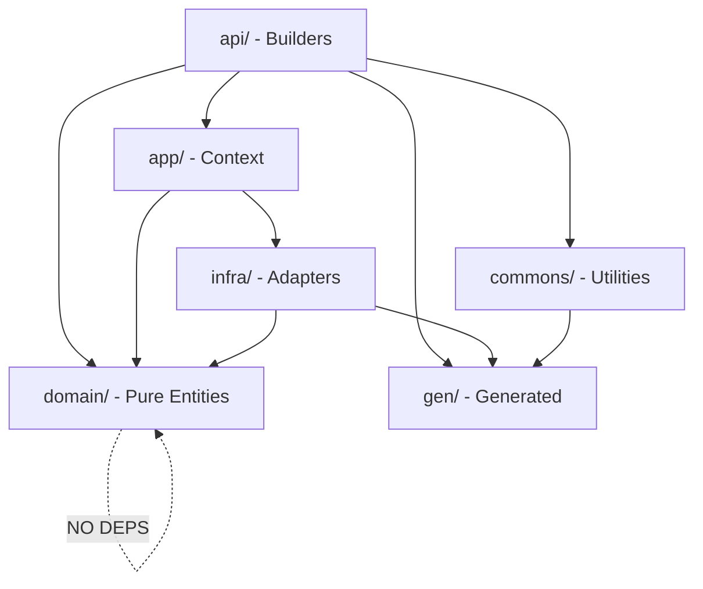

# SDK DDD Layer Reorganization Plan

## Architectural Principles

This restructure follows strict DDD principles:

1. **Domain Purity**: `domain/` has zero external dependencies (no proto stubs, no frameworks)
2. **Bounded Contexts**: Each aggregate root owns its value objects (SubAgent belongs to Agent, NOT in a separate refs/ package)
3. **Commons for Infrastructure**: `commons/ref/` mirrors proto `commons/apiresource/` for reference factories - these are NOT domain objects
4. **Single Source of Truth**: Generated Args structs in `gen/` drive all configuration

## Target Architecture

```
sdk/go/
├── domain/                    # Pure business logic (ZERO external deps)
│   ├── agent/
│   │   ├── agent.go          # Agent aggregate root
│   │   └── subagent.go       # SubAgent value object (WITHIN Agent bounded context)
│   ├── workflow/
│   ├── mcpserver/
│   ├── skill/
│   └── environment/
│
├── commons/                   # Shared utilities (mirrors proto commons/)
│   └── ref/                   # ApiResourceReference factories
│       ├── skill.go          # ref.Skill(org, slug), ref.ParseSkill(...)
│       ├── mcpserver.go      # ref.McpServer(org, slug), ref.ParseMcpServer(...)
│       └── errors.go         # Shared parse errors
│
├── app/                       # Application layer (orchestration)
│   ├── context.go            # Resource registration
│   ├── synthesis.go          # Output generation
│   └── run.go                # Entry points
│
├── infra/                     # Infrastructure adapters
│   ├── proto/                # Domain → Proto conversion
│   ├── validation/           # Protovalidate integration
│   └── synth/                # Synthesis utilities
│
├── api/                       # Public API (ergonomic builders)
│   ├── agent/
│   ├── workflow/
│   ├── mcpserver/
│   └── skill/
│
├── gen/                       # Generated code (Args structs, types)
│   ├── types/
│   └── <resource>/
│
└── naming/                    # Shared naming utilities
```

## Key Architectural Decision: Why NOT domain/refs/

The original plan had `domain/refs/` containing SkillRef, McpServerRef, and SubAgent. This was **architecturally wrong**:


| Concept      | What It Is                                          | Correct Location                        |
| ------------ | --------------------------------------------------- | --------------------------------------- |
| SkillRef     | Factory for `ApiResourceReference{Kind=skill}`      | `commons/ref/` - infrastructure utility |
| McpServerRef | Factory for `ApiResourceReference{Kind=mcp_server}` | `commons/ref/` - infrastructure utility |
| SubAgent     | Value object within Agent aggregate                 | `domain/agent/` - domain logic          |


**SkillRef/McpServerRef** are NOT domain objects - they construct proto messages. They belong in `commons/` mirroring the proto `commons/apiresource/` structure.

**SubAgent** is a domain value object that only exists within an Agent. It has business behavior (MCP access grants, skill refs). It belongs in the Agent bounded context.

## Dependency Flow




**Critical Rule**: `domain/` imports NOTHING except standard library and other `domain/` packages.

---

## Phase 1: Foundation - Generated Code Verification

### Task 1.1: Verify and Clean gen/ Structure

**Goal**: Ensure `gen/` is the canonical location for all generated Args structs.

**Current State**: `gen/` already contains per-resource Args and `gen/types/` for shared types.

**Actions**:

- Verify all `*Args` structs are in `gen/<resource>/`
- Verify shared types are in `gen/types/`
- Remove any duplicate generated code from `workflow/gen/` (if still exists after previous migration)
- Update codegen tool imports if needed

**Files**:

- [gen/](sdk/go/gen/) - verify structure
- [workflow/gen/](sdk/go/workflow/gen/) - delete if exists (was migrated)

**Validation**: `go build ./gen/...` passes

---

## Phase 2: Commons Layer - API Reference Factories

### Task 2.1: Create commons/ref/ Package

**Goal**: Consolidate API reference factory functions, mirroring proto `commons/apiresource/`.

**Rationale**: `skillref` and `mcpserverref` are infrastructure utilities that construct `ApiResourceReference` proto messages. They are NOT domain objects - they have no business logic, just construct proto messages with the correct `Kind` field.

**Create** `sdk/go/commons/ref/`:

```go
// commons/ref/skill.go
package ref

// Skill creates a skill reference with org and slug.
// Equivalent to proto commons/apiresource/ApiResourceReference with Kind=skill.
func Skill(org, slug string, opts ...SkillOption) *apiresource.ApiResourceReference

// ParseSkill parses "org/slug" or "org/slug@version" format.
func ParseSkill(s string) (*apiresource.ApiResourceReference, error)

// MustParseSkill panics on invalid input (for static initialization).
func MustParseSkill(s string) *apiresource.ApiResourceReference
```

```go
// commons/ref/mcpserver.go
package ref

// McpServer creates an MCP server reference with org and slug.
func McpServer(org, slug string) *apiresource.ApiResourceReference

// ParseMcpServer parses "org/slug" format.
func ParseMcpServer(s string) (*apiresource.ApiResourceReference, error)
```

```go
// commons/ref/errors.go
package ref

// ParseError wraps parsing errors with context.
type ParseError struct {
    Input   string
    Message string
    Err     error
}

// Sentinel errors
var (
    ErrInvalidFormat = errors.New("invalid reference format")
    ErrEmptyOrg      = errors.New("organization is empty")
    ErrEmptySlug     = errors.New("slug is empty")
)
```

**Migration Path**:

- Move code from [skillref/skillref.go](sdk/go/skillref/skillref.go) → `commons/ref/skill.go`
- Move code from [mcpserverref/mcpserverref.go](sdk/go/mcpserverref/mcpserverref.go) → `commons/ref/mcpserver.go`
- Consolidate errors into `commons/ref/errors.go`
- Keep old packages as deprecated re-exports during migration period

**Tests**: Comprehensive unit tests for all parsing edge cases, version extraction, error messages.

### Task 2.2: Create domain/environment/ Package

**Goal**: Pure environment Variable value object.

**Changes**:

- Create `domain/environment/variable.go` from [environment/environment.go](sdk/go/environment/environment.go)
- Pure domain logic only - validation, invariant protection
- Remove any proto-specific code (move to infra/proto/ later)

**Key struct**:

```go
// domain/environment/variable.go
package environment

type Variable struct {
    name         string  // private - protected invariant
    isSecret     bool
    description  string
    defaultValue string
    required     bool
}

// NewVariable creates a Variable with validated invariants.
func NewVariable(name string, opts ...Option) (*Variable, error)

// Name returns the variable name (e.g., "GITHUB_TOKEN").
func (v *Variable) Name() string { return v.name }
```

**Test**: Unit tests for Variable creation and validation (name format, etc.)

---

## Phase 3: Domain Layer - Core Entities

### Task 3.1: Create domain/agent/ with SubAgent

**Goal**: Pure Agent aggregate root with SubAgent as internal value object.

**Critical Architectural Decision**: SubAgent is NOT a standalone type. It exists only within the Agent bounded context. This task moves `subagent/` into `domain/agent/`.

**Create** `sdk/go/domain/agent/`:

```go
// domain/agent/agent.go
package agent

// Agent is the aggregate root for agent definitions.
// Protects its invariants and owns SubAgent value objects.
type Agent struct {
    name      string  // private - protected invariant
    slug      string
    org       string
    subAgents []SubAgent
    envVars   []EnvVar  // domain representation
    // NO proto Args here - that's for infra/api layer
}

// NewAgent creates an Agent with validated invariants.
func NewAgent(name string, opts ...Option) (*Agent, error)

// AddSubAgent adds a sub-agent to this agent.
// Validates that sub-agent MCP access only references servers the parent has.
func (a *Agent) AddSubAgent(sub SubAgent) error

// Validate enforces all Agent invariants.
func (a *Agent) Validate() error

// Name returns the agent name (getter, not setter).
func (a *Agent) Name() string { return a.name }
```

```go
// domain/agent/subagent.go
package agent

// SubAgent is a value object within the Agent aggregate.
// It cannot exist independently - always belongs to a parent Agent.
type SubAgent struct {
    name         string
    instructions string
    description  string
    mcpAccess    []McpAccess
    skillRefs    []SkillRef  // Domain representation, NOT proto
}

// NewSubAgent creates a SubAgent with validated invariants.
func NewSubAgent(name string, instructions string, opts ...SubAgentOption) (*SubAgent, error)

// McpAccess represents restricted access to parent's MCP servers.
type McpAccess struct {
    ServerSlug   string
    EnabledTools []string
}

// SkillRef is a domain representation of a skill reference.
// NOT the proto ApiResourceReference - domain stays pure.
type SkillRef struct {
    Org     string
    Slug    string
    Version string
}

// GrantMcpAccess grants this sub-agent access to an MCP server.
func (s *SubAgent) GrantMcpAccess(serverSlug string, tools ...string)

// AddSkillRef adds a skill reference.
func (s *SubAgent) AddSkillRef(ref SkillRef)
```

```go
// domain/agent/errors.go
package agent

var (
    ErrNameRequired         = errors.New("agent name is required")
    ErrInstructionsRequired = errors.New("agent instructions required (min 10 chars)")
    ErrInvalidSlugFormat    = errors.New("invalid slug format")
)
```

**Key Design Decisions**:

1. **No proto imports in domain**: Use domain-native types (`SkillRef` struct, not `*apiresource.ApiResourceReference`)
2. **Invariant protection**: Constructor validates, private fields, public getters only
3. **SubAgent is internal**: Part of Agent aggregate, cannot exist independently

**Migration**:

- Extract pure domain logic from [agent/agent.go](sdk/go/agent/agent.go)
- Move SubAgent from [subagent/subagent.go](sdk/go/subagent/subagent.go) into `domain/agent/subagent.go`
- Leave proto conversion for `infra/proto/`
- Leave builder ergonomics for `api/agent/`

**Tests**: Invariant validation, SubAgent MCP access validation, edge cases.

### Task 3.2: Create domain/mcpserver/

**Goal**: Pure MCPServer entity.

**Create** `sdk/go/domain/mcpserver/`:

```go
// domain/mcpserver/mcpserver.go
package mcpserver

type MCPServer struct {
    name       string
    slug       string
    serverType ServerType
    // Type-specific config as domain structs (not proto)
    stdioConfig *StdioConfig
    httpConfig  *HTTPConfig
}

type ServerType int
const (
    ServerTypeStdio ServerType = iota
    ServerTypeHTTP
)

type StdioConfig struct {
    Command string
    Args    []string
    Env     map[string]string
}

type HTTPConfig struct {
    URL     string
    Headers map[string]string
}

func NewStdio(name, command string, args ...string) (*MCPServer, error)
func NewHTTP(name, url string) (*MCPServer, error)
```

**Migration**: Extract from [mcpserver/server.go](sdk/go/mcpserver/server.go), remove proto/builder code.

**Test**: Entity validation tests, type-specific config validation.

### Task 3.3: Create domain/skill/

**Goal**: Pure Skill entity.

**Create** `sdk/go/domain/skill/`:

```go
// domain/skill/skill.go
package skill

type Skill struct {
    name       string
    slug       string
    tag        string
    sourceType SourceType
    dirConfig  *DirConfig
    gitConfig  *GitConfig
}

type SourceType int
const (
    SourceTypeDir SourceType = iota
    SourceTypeGit
)

type DirConfig struct {
    Path string
}

type GitConfig struct {
    URL    string
    Ref    string
    Subdir string
}

func NewFromDir(name, path string, opts ...Option) (*Skill, error)
func NewFromGit(name, url string, opts ...Option) (*Skill, error)
```

**Migration**: Extract from [skill/synth.go](sdk/go/skill/synth.go).

**Test**: Entity validation tests.

### Task 3.4: Create domain/workflow/

**Goal**: Pure Workflow entity with Task hierarchy.

This is the most complex domain entity. Tasks form a tree structure with many task types.

**Create** `sdk/go/domain/workflow/`:

```go
// domain/workflow/workflow.go
package workflow

type Workflow struct {
    name  string
    slug  string
    tasks []Task
}

func NewWorkflow(name string, opts ...Option) (*Workflow, error)
func (w *Workflow) AddTask(task Task) error

// Task is the base interface for all workflow tasks.
type Task interface {
    TaskName() string
    Validate() error
}

// Concrete task types
type AgentCallTask struct { ... }
type HTTPCallTask struct { ... }
type SetTask struct { ... }
type ForTask struct { ... }
type ForkTask struct { ... }
type SwitchTask struct { ... }
type TryTask struct { ... }
// etc.
```

**Note**: This is the largest domain entity. Consider breaking into sub-tasks if needed.

**Test**: Workflow structure and task validation.

---

## Phase 4: Infrastructure Layer

### Task 4.1: Create infra/validation/

**Goal**: Centralize validation utilities with protovalidate integration.

**Changes**:

- Move [internal/validation/](sdk/go/internal/validation/) → `infra/validation/`
- Keep protovalidate integration for proto message validation
- Ensure domain validation remains in domain/ (no cross-dependency)

**Test**: Existing validation tests pass.

### Task 4.2: Create infra/synth/

**Goal**: Synthesis utilities (interpolation, file writing).

**Changes**:

- Move [internal/synth/](sdk/go/internal/synth/) → `infra/synth/`

**Test**: Interpolator tests pass.

### Task 4.3: Create infra/proto/ Adapters

**Goal**: All proto conversion in one place. Domain stays pure.

**Create** `sdk/go/infra/proto/`:

```go
// infra/proto/agent.go
package proto

import (
    domainAgent "stigmer/sdk/go/domain/agent"
    agentv1 "stigmer/apis/stubs/go/.../agent/v1"
)

// AgentToProto converts domain Agent to proto AgentSpec.
func AgentToProto(a *domainAgent.Agent) (*agentv1.AgentSpec, error)

// SubAgentToProto converts domain SubAgent to proto SubAgent.
func SubAgentToProto(s domainAgent.SubAgent) *agentv1.SubAgent

// SkillRefToProto converts domain SkillRef to proto ApiResourceReference.
func SkillRefToProto(ref domainAgent.SkillRef) *apiresource.ApiResourceReference
```

```go
// infra/proto/mcpserver.go
package proto

func MCPServerToProto(s *domainMcp.MCPServer) (*mcpserverv1.McpServerSpec, error)
```

```go
// infra/proto/skill.go
package proto

func SkillToProto(s *domainSkill.Skill) (*skillv1.SkillSynth, error)
```

```go
// infra/proto/workflow.go
package proto

func WorkflowToProto(w *domainWorkflow.Workflow) (*workflowv1.WorkflowSpec, error)
func TaskToProto(t domainWorkflow.Task) (*workflowv1.Task, error)
```

**Key Principle**: These adapters are the ONLY place where domain types meet proto types. Domain remains pure.

**Migration**:

- Move from [agent/proto.go](sdk/go/agent/proto.go)
- Move from [mcpserver/proto.go](sdk/go/mcpserver/proto.go)
- Move from [workflow/proto.go](sdk/go/workflow/proto.go)

**Test**: Proto conversion tests, round-trip verification (domain → proto → validate).

---

## Phase 5: Application Layer

### Task 5.1: Create app/context.go

**Goal**: Core Context struct for resource registration.

**Create** `sdk/go/app/`:

```go
// app/context.go
package app

import (
    "stigmer/sdk/go/domain/agent"
    "stigmer/sdk/go/domain/workflow"
    "stigmer/sdk/go/domain/mcpserver"
    "stigmer/sdk/go/domain/skill"
)

type Context struct {
    projectName string
    agents      []*agent.Agent
    workflows   []*workflow.Workflow
    mcpServers  []*mcpserver.MCPServer
    skills      []*skill.Skill
}

func NewContext(projectName string) *Context

func (c *Context) RegisterAgent(a *agent.Agent)
func (c *Context) RegisterWorkflow(w *workflow.Workflow)
func (c *Context) RegisterMCPServer(s *mcpserver.MCPServer)
func (c *Context) RegisterSkill(s *skill.Skill)

func (c *Context) Agents() []*agent.Agent
func (c *Context) Workflows() []*workflow.Workflow
// etc.
```

**Migration**: Extract from [stigmer/context.go](sdk/go/stigmer/context.go).

**Test**: Context creation and registration tests.

### Task 5.2: Create app/synthesis.go

**Goal**: Synthesis orchestration - converts domain objects to proto and writes to `.stigmer/`.

```go
// app/synthesis.go
package app

func (c *Context) Synthesize() error {
    // 1. Convert all domain objects to proto using infra/proto/
    // 2. Validate protos using infra/validation/
    // 3. Write to .stigmer/ directory
}

func (c *Context) synthesizeAgents() error
func (c *Context) synthesizeWorkflows() error
func (c *Context) synthesizeMCPServers() error
func (c *Context) synthesizeSkills() error
```

**Test**: Synthesis output verification - correct proto files written.

### Task 5.3: Create app/run.go

**Goal**: Clean entry points for SDK programs.

```go
// app/run.go
package app

import "context"

// Run is the main entry point for Stigmer SDK programs.
func Run(fn func(*Context) error) error {
    ctx := NewContext(detectProjectName())
    if err := fn(ctx); err != nil {
        return err
    }
    return ctx.Synthesize()
}

// RunWithContext allows passing a Go context for cancellation.
func RunWithContext(ctx context.Context, fn func(*Context) error) error
```

**Test**: Integration test with Run().

---

## Phase 6: API Layer (Builders)

The API layer provides ergonomic construction APIs that users interact with. It wraps domain entities with convenient builders and smart parsing.

### Task 6.1: Create api/agent/ Builder

**Goal**: Ergonomic Agent construction with smart parsing and context registration.

**Create** `sdk/go/api/agent/`:

```go
// api/agent/builder.go
package agent

import (
    "stigmer/sdk/go/app"
    domainAgent "stigmer/sdk/go/domain/agent"
)

// Args is the public configuration struct (Pulumi pattern).
type Args struct {
    Instructions string
    Description  string
    IconUrl      string
}

// New creates an Agent with struct args and registers it with context.
func New(ctx *app.Context, name string, args *Args) (*Agent, error) {
    // 1. Create domain agent
    // 2. Register with context
    // 3. Return wrapped agent with builder methods
}

// Agent wraps domain.Agent with builder methods.
type Agent struct {
    domain *domainAgent.Agent
    ctx    *app.Context
}

// AddSkill adds a skill using smart org/slug parsing.
func (a *Agent) AddSkill(ref string, opts ...SkillOption) *Agent

// UseMCP adds an MCP server using smart org/slug parsing.
func (a *Agent) UseMCP(ref string, enabledTools ...string) *Agent

// AddSubAgent adds a sub-agent.
func (a *Agent) AddSubAgent(sub *SubAgent) *Agent
```

```go
// api/agent/subagent.go
package agent

// SubAgent builder for creating sub-agents ergonomically.
type SubAgent struct {
    domain *domainAgent.SubAgent
}

func NewSubAgent(name string, args *SubAgentArgs) (*SubAgent, error)

func (s *SubAgent) GrantMcpAccess(serverSlug string, tools ...string) *SubAgent
func (s *SubAgent) AddSkill(ref string) *SubAgent
```

```go
// api/agent/parsing.go
package agent

// Smart parsing for "org/slug" and "org/slug@version" formats.
// Moved from [agent/parsing.go](sdk/go/agent/parsing.go)
```

**Public API** (what users write):

```go
import "github.com/stigmer/stigmer/sdk/go/api/agent"

stigmer.Run(func(ctx *stigmer.Context) error {
    ag, err := agent.New(ctx, "code-reviewer", &agent.Args{
        Instructions: "Review code and suggest improvements",
    })
    if err != nil {
        return err
    }
    
    ag.AddSkill("stigmer/coding-best-practices").
       UseMCP("github", "create_pr", "search_code")
    
    return nil
})
```

**Test**: Builder tests, smart parsing tests, context registration tests.

### Task 6.2: Create api/mcpserver/ Builder

**Goal**: MCPServer construction API.

```go
// api/mcpserver/builder.go
package mcpserver

// Stdio creates an MCP server using stdio transport.
func Stdio(ctx *app.Context, name, command string, args ...string) (*MCPServer, error)

// HTTP creates an MCP server using HTTP transport.
func HTTP(ctx *app.Context, name, url string) (*MCPServer, error)
```

**Test**: Builder tests, context registration.

### Task 6.3: Create api/skill/ Builder

**Goal**: Skill construction API.

```go
// api/skill/builder.go
package skill

// FromDir creates a skill from a local directory.
func FromDir(ctx *app.Context, path string, opts ...Option) (*Skill, error)

// FromGit creates a skill from a git repository.
func FromGit(ctx *app.Context, url string, opts ...Option) (*Skill, error)

// Options
func WithTag(tag string) Option
func WithRef(ref string) Option
func WithSubdir(subdir string) Option
```

**Test**: Builder tests.

### Task 6.4: Create api/workflow/ Builder

**Goal**: Workflow and Task construction API.

```go
// api/workflow/builder.go
package workflow

func New(ctx *app.Context, name string, opts ...Option) (*Workflow, error)

// Task builders
func AgentCall(name string, opts ...AgentCallOption) Task
func HTTPCall(name string, opts ...HTTPCallOption) Task
func Set(name string, key, value string) Task
func For(name string, opts ...ForOption) Task
func Fork(name string, branches ...ForkBranch) Task
func Switch(name string, cases ...SwitchCase) Task
func Try(name string, opts ...TryOption) Task
```

**Test**: Workflow builder tests, task composition tests.

---

## Phase 7: Cleanup and Migration

### Task 7.1: Create naming/ Utility Package

**Goal**: Move shared naming utilities to top-level.

**Changes**:

- Move [stigmer/naming/](sdk/go/stigmer/naming/) → `naming/`

**Test**: Slug generation tests.

### Task 7.2: Delete Legacy Packages

**Goal**: Remove old structure after migration complete.

**Delete** (after all migrations verified):

- `agent/` → moved to `domain/agent/` + `api/agent/`
- `workflow/` → moved to `domain/workflow/` + `api/workflow/`
- `mcpserver/` → moved to `domain/mcpserver/` + `api/mcpserver/`
- `skill/` → moved to `domain/skill/` + `api/skill/`
- `skillref/` → moved to `commons/ref/`
- `mcpserverref/` → moved to `commons/ref/`
- `subagent/` → moved into `domain/agent/`
- `environment/` → moved to `domain/environment/`
- `stigmer/` → moved to `app/`
- `internal/` → moved to `infra/`
- `templates/` → evaluate if still needed

**Keep**:

- `domain/`, `commons/`, `app/`, `infra/`, `api/`, `gen/`, `naming/`, `docs/`, `examples/`

**Validation**: `go build ./...` and `go test ./...` pass with no old package references.

### Task 7.3: Update CLI and External Imports

**Goal**: Fix imports in CLI and other SDK consumers.

**Changes**:

- Update [client-apps/cli/](client-apps/cli/) imports to new package paths
- Update any other SDK consumers
- Search for old import paths and replace

**Test**: Full CLI build passes.

### Task 7.4: Update Documentation and Examples

**Goal**: Refresh docs for new structure.

**Changes**:

- Update [README.md](sdk/go/README.md) with new package structure
- Update [docs/architecture/](sdk/go/docs/architecture/) with DDD explanation
- Update [examples/](sdk/go/examples/) to use new import paths

**Test**: All examples compile and run.

---

## Quality Gates (Every Task)

After each task, verify:

```bash
cd sdk/go && go build ./... && go test ./...
```

**Code Quality Standards**:

1. **No public setters for identity fields** - Use constructors and getters
2. **Constructors validate invariants** - Invalid objects cannot be created
3. **Domain has zero proto imports** - Pure business logic only
4. **80%+ test coverage on domain logic** - Critical business rules tested
5. **Clear error messages with context** - Errors include field name, value, constraint
6. **Thread-safe where concurrent access expected** - Document thread safety

---

## Migration Strategy

To minimize breaking changes during transition:

1. **Phase 1-5**: Create new structure alongside old
2. **Deprecation Period**: Old packages re-export from new locations with deprecation notices
  ```go
   // OLD: sdk/go/skillref/skillref.go
   package skillref

   import "stigmer/sdk/go/commons/ref"

   // Deprecated: Use ref.Skill instead.
   func New(org, slug string, opts ...Option) *apiresource.ApiResourceReference {
       return ref.Skill(org, slug, opts...)
   }
  ```
3. **Phase 6**: Update external consumers to new imports
4. **Phase 7**: Delete old packages after verification

This allows gradual adoption without breaking existing code.

---

## Execution Order

**Recommended sequence** (respects dependencies):

1. **Task 1.1** - gen/ verification (foundation)
2. **Task 2.1** - commons/ref/ (infrastructure utilities needed by api/)
3. **Task 2.2** - domain/environment/ (simple value object, practice DDD)
4. **Task 3.1** - domain/agent/ with SubAgent (core aggregate, sets pattern)
5. **Task 3.2** - domain/mcpserver/
6. **Task 3.3** - domain/skill/
7. **Task 3.4** - domain/workflow/ (most complex)
8. **Task 4.1-4.2** - infra/validation/, infra/synth/ (move existing)
9. **Task 4.3** - infra/proto/ (connects domain to proto)
10. **Task 5.1-5.3** - app/ layer (orchestration)
11. **Task 6.1-6.4** - api/ layer (user-facing builders)
12. **Task 7.1-7.4** - Cleanup

**After each task**:

```bash
cd sdk/go && go build ./... && go test ./...
```

---

## Summary of Architectural Corrections


| Original Plan                                        | Corrected Plan                | Rationale                                                    |
| ---------------------------------------------------- | ----------------------------- | ------------------------------------------------------------ |
| `domain/refs/` with SkillRef, McpServerRef, SubAgent | Removed                       | Conflated infrastructure utilities with domain value objects |
| SkillRef, McpServerRef in domain                     | `commons/ref/`                | These construct proto messages, not domain logic             |
| SubAgent as standalone package                       | `domain/agent/subagent.go`    | SubAgent is value object within Agent aggregate              |
| Domain imports gen/                                  | Domain has zero external deps | Pure domain, proto conversion in infra/                      |


This structure ensures clean DDD boundaries and accurate business modeling.