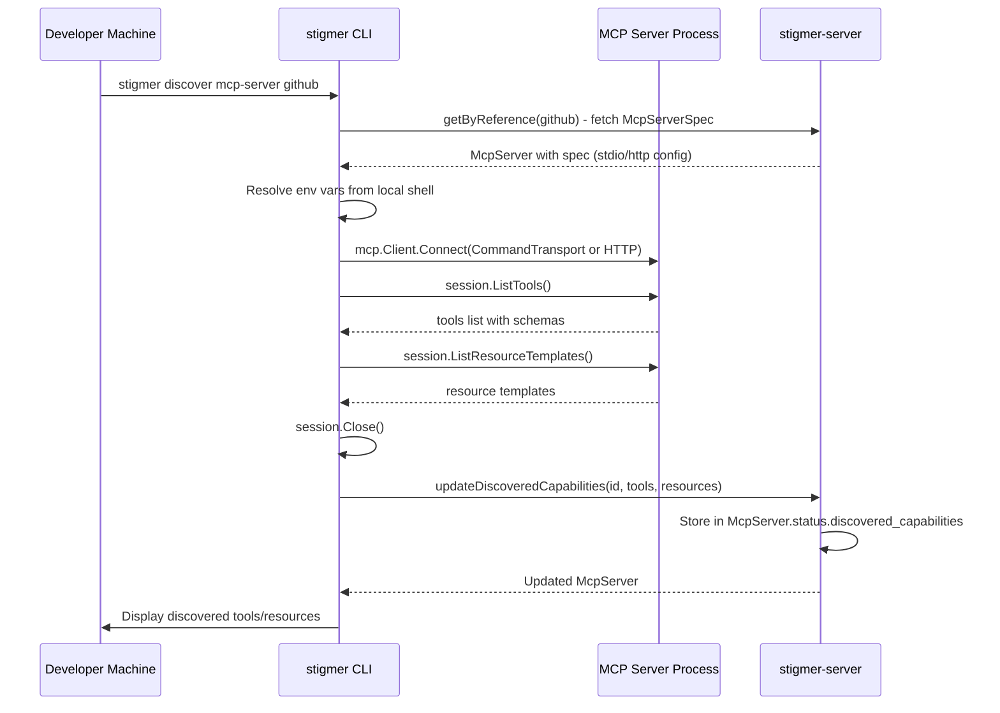

# Task T01: MCP Server Tool Discovery - Implementation Plan

**Created**: 2026-02-25
**Status**: PENDING REVIEW
**Type**: Feature Development

## Architecture

CLI-driven discovery using the official Go MCP SDK. Secrets stay on the developer's machine. The server only receives discovered tool/resource metadata.



**Why client-side discovery:**

- No Temporal workflow overhead
- No secrets leave the developer's machine
- No Python agent-runner involvement
- Go MCP SDK already a dependency (`github.com/modelcontextprotocol/go-sdk v1.3.0` in cli/go.mod)
- Works for both stdio (subprocess) and HTTP MCP servers

---

## Phase 1: Proto Changes + Codegen

### 1.1 Extend status.proto

File: `apis/ai/stigmer/agentic/mcpserver/v1/status.proto`

Add `DiscoveredCapabilities`, `DiscoveredTool`, `DiscoveredResource` messages to `McpServerStatus`:

```protobuf
message McpServerStatus {
  ValidationState validation_state = 1;
  string validation_message = 2;

  // Discovered tools and resources from the MCP server.
  // Populated by:
  // 1. Static seedpack bootstrap (for built-in servers like stigmer-mcp-server)
  // 2. CLI discovery: `stigmer discover mcp-server <name>` connects locally
  //    and pushes results via updateDiscoveredCapabilities RPC
  DiscoveredCapabilities discovered_capabilities = 3;

  ai.stigmer.commons.apiresource.ApiResourceAudit audit = 99;
}

message DiscoveredCapabilities {
  repeated DiscoveredTool tools = 1;
  repeated DiscoveredResource resources = 2;
  google.protobuf.Timestamp last_discovered_at = 3;
  // Source: "seedpack", "cli", "agent-runner"
  string discovered_by = 4;
}

message DiscoveredTool {
  string name = 1;
  string description = 2;
  string input_schema_json = 3;  // JSON Schema from MCP tools/list
}

message DiscoveredResource {
  string uri_template = 1;
  string name = 2;
  string description = 3;
  string mime_type = 4;
}
```

### 1.2 Add I/O message

File: `apis/ai/stigmer/agentic/mcpserver/v1/io.proto`

```protobuf
message UpdateDiscoveredCapabilitiesInput {
  string mcp_server_id = 1;
  DiscoveredCapabilities discovered_capabilities = 2;
}
```

No `env_vars` -- credentials stay on the client.

### 1.3 Add RPC

File: `apis/ai/stigmer/agentic/mcpserver/v1/command.proto`

```protobuf
rpc updateDiscoveredCapabilities(UpdateDiscoveredCapabilitiesInput) returns (McpServer);
```

### 1.4 Codegen

- `buf generate` in `apis/` for Go stubs
- Codegen for `mcp-server/` Go module if it imports status protos
- Codegen for `stigmer-cloud` Java stubs

---

## Phase 2: Static Seedpack for Built-in Server

### 2.1 Extend seedpack YAML

File: `backend/services/stigmer-server/pkg/seedpack/mcp-servers/stigmer-mcp-server.yaml`

Add `status.discovered_capabilities` with the 12 tools and 5 resource templates from `mcp-server/internal/server/server.go`.

### 2.2 Update seedpack loader

File: `backend/services/stigmer-server/pkg/seedpack/seedpack.go`

Ensure YAML loader parses and preserves `status.discovered_capabilities`.

---

## Phase 3: Server-Side RPC Handler

File: `backend/services/stigmer-server/pkg/domain/mcpserver/controller/update_discovered_capabilities.go` (new)

Simple handler:
1. Validate input (mcp_server_id + discovered_capabilities required)
2. Fetch McpServer by ID
3. Set `status.discovered_capabilities` from input
4. Set `last_discovered_at` to now if not already set
5. Save to store
6. Return updated McpServer

---

## Phase 4: CLI Discovery Command

### 4.1 Parent command

File: `client-apps/cli/cmd/stigmer/root/discover.go` (new)

```
stigmer discover mcp-server <org/name>
```

### 4.2 Discovery command + handler

Files:
- `client-apps/cli/cmd/stigmer/root/discover_mcp_server.go` (new)
- `client-apps/cli/cmd/stigmer/root/discover_mcp_server_handler.go` (new)

Flow:
1. Fetch McpServer spec from stigmer-server via `getByReference`
2. Build env vars from local shell + `--env KEY=VALUE` overrides
3. Connect using Go MCP SDK (`mcp.CommandTransport` for stdio, HTTP transport for remote)
4. Call `session.ListTools()` and `session.ListResourceTemplates()`
5. Build `DiscoveredCapabilities` proto
6. Push to stigmer-server via `updateDiscoveredCapabilities`
7. Display results to user

Flags: `--env KEY=VALUE` (repeatable), `--verbose`

---

## Execution Order

1. **Proto + codegen** (unblocks everything)
2. **Static seedpack** (immediate value for stigmer-mcp-server)
3. **Server RPC handler** (simple CRUD)
4. **CLI discover command** (main user-facing feature)

## Repos Affected

| Repo | Changes |
|------|---------|
| `stigmer/stigmer` (apis/) | Proto changes, buf generate |
| `stigmer/stigmer` (stigmer-server) | RPC handler, seedpack updates |
| `stigmer/stigmer` (client-apps/cli) | New `discover mcp-server` command |
| `stigmer/stigmer` (mcp-server) | Codegen if consuming status.proto |
| `stigmer/stigmer-cloud` | Java stub codegen (proto only) |

## Future Extensions (Out of Scope)

- Runtime cache from agent-runner (uses same `updateDiscoveredCapabilities` RPC)
- Auto-discovery on `stigmer apply mcp-server`
- `stigmer discover mcp-server --all` for bulk refresh
