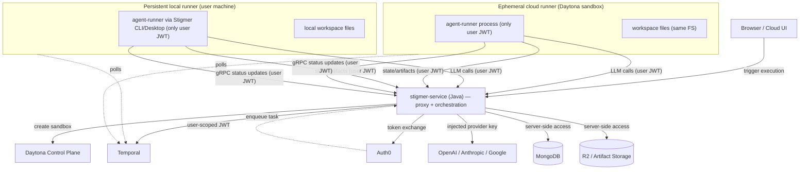

# Task T01: Architecture and Phased Design

**Created**: 2026-04-20
**Revised**: 2026-04-20 (decisions finalized after review)
**Status**: DECISIONS FINALIZED — PENDING APPROVAL TO BEGIN PHASE 0
**Type**: Feature Development (architectural redesign)

## Objective

Lock in the architectural shape and phased delivery for promoting `AgentRunner` to a first-class API resource backed by a credential-free runtime, with a Stigmer Side-Channel Proxy injecting all platform secrets server-side. Replace the existing `can_impersonate` machine-account model with per-user JWTs, unify per-execution sandbox+runner into a single Daytona container, and enable browser-launched local runners via `stigmer://`.

## Background

### Current state (the three coupled problems)

1. **Impersonation superpower**: `backend/services/agent-runner/main.py` reads `MACHINE_ACCOUNT_CLIENT_ID/SECRET`; `grpc_client/auth/on_behalf_of_interceptor.py` and `ImpersonatedChannelFactory` let one runner act as any user. The `secrets-vault-migration` README documents this as a binary superpower no FGA refinement removes.
2. **Provider secrets in runner pods**: `DAYTONA_API_KEY`, LLM provider keys, Mongo URI, R2 creds — all live in agent-runner env. One pod compromise leaks all of them.
3. **Two filesystems per execution**: agent-runner pod orchestrates from one filesystem; Daytona sandbox runs tools in a different one. `worker/workspace/daytona.py` exists solely to bridge them. This violates the customer's mental model and is bug-prone.

### The combined fix (one architectural shift)

The runner becomes a credential-free worker that:
- Authenticates as the triggering user (no machine account, no impersonation).
- Routes every infrastructure call through stigmer-service (which acts as the Side-Channel Proxy).
- Runs alongside the workspace in a single sandbox (one filesystem).
- Is itself a queryable API resource (`AgentRunner`) with explicit lifecycle, scope, and placement.

**The runner knows only three things:**
1. The user's Stigmer JWT.
2. The stigmer-service endpoint (which is also the proxy).
3. The Temporal address.

Everything else — LLM provider keys, Daytona credentials, MongoDB, R2, Redis — is resolved server-side by stigmer-service. The runner never sees any of it.

## Architecture (the picture in one diagram)



## Finalized Decisions

All architectural decisions have been reviewed and confirmed:

| # | Decision | Answer | Rationale |
|---|---|---|---|
| 1 | **Proxy placement** | Inside `stigmer-service` | No new deployment; reuses existing auth, FGA, vault clients. Extract to its own service later if traffic warrants it. |
| 2 | **Proxy scope V1** | **Everything** — LLM providers + state/checkpointer + artifact storage + Redis replacement | The runner must be truly credential-free. Only carrying the user JWT and knowing only the stigmer-service endpoint + Temporal address. Anything less leaves secrets in the runner. |
| 3 | **Cloud runner default** | Daytona sandbox (gated on operational validation) | Runner runs inside the sandbox — one process, one filesystem. `KubernetesPodRunnerLauncher` exists as fallback if Daytona operational gates fail. |
| 4 | **Token exchange refresh** | Push from stigmer-service over gRPC stream | stigmer-service pushes a refreshed JWT to the runner over the existing gRPC status stream every ~50min. Runner replaces in-process JWT atomically. Details finalized during Phase 1 implementation. |
| 5 | **Scope values V1** | `Execution` + `User` only | `Org` and `Agent` scopes deferred; adding later is non-breaking (additive enum values). |
| 6 | **Dependency on `secrets-vault-migration`** | **None — parallel work** | From the runner's perspective, it calls stigmer-service RPCs with user JWT. Whether stigmer-service reads provider keys from env vars, MongoDB, or Vault is an internal implementation detail. The proxy works with whatever key storage exists today. The vault migration improves security of key storage but does not gate the proxy. |
| 7 | **Self-hosted enterprise proxy** | Same flow — proxy is in stigmer-service, runner gets endpoint from env | Self-hosted Stigmer includes the proxy automatically because it is part of stigmer-service. Runner's only infra env var is `STIGMER_BACKEND_ENDPOINT` (already exists today). Same code path everywhere: cloud, self-hosted, local. |

## What the runner calls today vs. after this project

| Dependency today | Credential in runner env | After this project |
|---|---|---|
| LLM providers (OpenAI, Anthropic, Google) | Provider API keys | **Proxied through stigmer-service** — runner calls stigmer-service LLM endpoints with user JWT; stigmer-service injects provider key and forwards |
| Daytona (create/manage sandbox) | `DAYTONA_API_KEY` | **Gone from runner** — stigmer-service creates the sandbox; runner is *inside* it |
| MongoDB (LangGraph checkpointer state) | `STIGMER_CHECKPOINTER_MONGODB_URI` | **Proxied through stigmer-service** — new checkpointer API endpoint; runner drops `pymongo`/`motor` dependency |
| R2 storage (skill artifacts, published artifacts) | R2 credentials via `worker/storage/r2.py` | **Proxied through stigmer-service** — presigned URLs or full proxy; runner drops R2 SDK dependency |
| Redis (cloud-mode caching/state) | `REDIS_HOST/PORT/PASSWORD` | **Moved to stigmer-service** — whatever the runner uses Redis for moves server-side |
| stigmer-service gRPC (status updates, get secrets) | User JWT (after Phase 1) | **No change** — already direct, already uses user JWT |
| Temporal (poll tasks) | Internal cluster address | **No change** — just an address, no secret |

**Result**: the runner's pod manifest shrinks from ~10+ secret env vars to **zero**. It carries only:
- `STIGMER_USER_JWT` — the user-scoped token (injected at launch)
- `STIGMER_BACKEND_ENDPOINT` — stigmer-service address (config, not secret)
- `STIGMER_TASK_QUEUE` — the Temporal task queue name (config, not secret)
- `TEMPORAL_SERVICE_ADDRESS` — Temporal frontend address (config, not secret)

## Phased Plan

### Phase 0 — Side-Channel Proxy (the keystone)

**Goal**: make the runner credential-free. Every external call the runner makes today (LLM, state, artifacts, Redis) is replaced by a call to stigmer-service endpoints carrying only the user JWT. stigmer-service resolves credentials server-side.

**Scope**:

#### 0.1 LLM proxy endpoints
- New module under `stigmer-service`: proxy controllers for LLM passthrough.
- Endpoint families: `/v1/proxy/llm/openai/**`, `/v1/proxy/llm/anthropic/**`, `/v1/proxy/llm/google/**`, `/v1/proxy/llm/ollama/**`.
- Auth: standard Auth0 JWT validator (existing).
- FGA check: `can_invoke_llm_provider` per user/org (new permission, additive).
- Key resolution: look up provider API key for org from current storage (env vars, MongoDB, or vault — wherever it lives today). Per-org first, fall back to platform-pool.
- Streaming relay: relay SSE/chunked responses from provider to runner verbatim.
- Audit event: structured log `{user_id, org_id, provider, model, tokens_in, tokens_out, latency_ms, status_code}`.

#### 0.2 State/checkpointer proxy endpoint
- New gRPC or REST service in stigmer-service: checkpointer CRUD.
- Runner calls `stigmer-service/v1/state/checkpoints/{thread_id}` with user JWT.
- stigmer-service reads/writes checkpoints to MongoDB server-side.
- Runner removes `pymongo`/`motor` dependency and `STIGMER_CHECKPOINTER_MONGODB_URI` env var.

#### 0.3 Artifact storage proxy endpoint
- New endpoint in stigmer-service for artifact download/upload.
- Option A: stigmer-service returns presigned R2 URLs; runner uses plain HTTPS to upload/download (preferred — avoids proxying large binary blobs).
- Option B: full proxy if presigned URLs don't work for streaming uploads.
- Runner removes R2 SDK dependency and R2 credential env vars.

#### 0.4 Redis migration
- Audit what the runner uses Redis for (likely deduplication, ephemeral caching, or session state).
- Move that logic server-side into stigmer-service.
- Runner removes `REDIS_HOST/PORT/PASSWORD` env vars and `redis` Python dependency.

#### 0.5 Runner-side changes
- Update LangChain provider initialization: pass `base_url` pointing at stigmer-service proxy endpoints; pass user JWT as `Authorization: Bearer` header via custom HTTP transport or callback.
- Replace checkpointer factory: switch from direct MongoDB client to stigmer-service checkpointer API client.
- Replace R2 storage client: switch to presigned-URL flow via stigmer-service.
- Remove all provider-key, Mongo, R2, Redis env var requirements from runner config.
- Tests: contract tests for each proxy endpoint; integration test in local Docker compose.

**Deliverables**:
- Production-deployed proxy endpoints in stigmer-service.
- Agent-runner pointed at proxy — zero provider/infra secrets in runner manifest.
- Runner carries only: `STIGMER_USER_JWT`, `STIGMER_BACKEND_ENDPOINT`, `STIGMER_TASK_QUEUE`, `TEMPORAL_SERVICE_ADDRESS`.

**Effort**: 3-4 weeks (expanded from 2 weeks because scope now covers everything, not just LLM).

**No dependency on `secrets-vault-migration`**: proxy reads provider keys from wherever they are today.

---

### Phase 1 — `AgentRunner` resource + dispatch + token exchange

**Goal**: AgentRunner is a domain resource. Runners authenticate as the user, not as a machine account. `can_impersonate` is gone from the agent execution path.

**Scope**:

#### 1.1 Proto and domain model
- New proto package: `apis/ai/stigmer/agentic/agent_runner/v1/`
  - `agent_runner.proto`: the `AgentRunner` message with `apiVersion`, `kind`, `metadata`, `spec` (lifecycle, scope, placement, runtime), `status` (phase, taskQueue, capacity, heartbeat).
  - `agent_runner_service.proto`: gRPC service with Create, Get, List, Delete, Watch.
  - Enums: `AgentRunnerLifecycle` (`Ephemeral`, `Persistent`), `AgentRunnerScopeType` (`Execution`, `User`), `AgentRunnerPlacementType` (`Cloud`, `Local`), `AgentRunnerRuntime` (`daytona-sandbox`, `k8s-pod`, `cli-daemon`, `docker`), `AgentRunnerPhase` (`Pending`, `Ready`, `Busy`, `Idle`, `Stopped`, `Failed`).
- Domain entity in `stigmer-service`: `AgentRunner` aggregate root with invariants.
- Repository interface in domain layer + MongoDB implementation in infrastructure.

#### 1.2 RunnerLauncher abstraction
- Java interface `RunnerLauncher` in `stigmer-service`:
  ```java
  public interface RunnerLauncher {
      AgentRunner ensureRunnerForExecution(AgentExecution execution, String userJwt, Duration idleTtl);
  }
  ```
- Phase 1 implementations:
  - `DaytonaSandboxRunnerLauncher` — creates Daytona sandbox with agent-runner image, injects user JWT + task queue + stigmer-service endpoint as env. This is the cloud default (gated on Phase 2 operational validation; until gates pass, use `KubernetesPodRunnerLauncher` as interim default).
  - `KubernetesPodRunnerLauncher` — creates a K8s `Job` per execution (fallback if Daytona gates fail). Idempotent on stable name; self-terminates on idle.
  - `NoopRunnerLauncher` — used when a Persistent runner already exists for the scope (local or otherwise). stigmer-service just enqueues to the runner's task queue.

#### 1.3 Token exchange
- New `TokenExchangeService` in `stigmer-service` that calls Auth0 `/oauth/token` with `grant_type=urn:ietf:params:oauth:grant-type:token-exchange` (RFC 8693) to mint a short-lived (1-hour) user-scoped JWT.
- Refresh flow: stigmer-service pushes refreshed JWT over the existing gRPC stream the runner uses for status updates, every ~50min. Runner replaces in-process JWT atomically.
- Audit: every token exchange logged with execution ID and user ID.

#### 1.4 Per-user task queue routing
- Extend the workflow-start path in `stigmer-service`'s `InvokeAgentExecutionWorkflow` to:
  1. Resolve `taskQueue` based on dispatch decision (Persistent runner queue or per-execution Ephemeral queue).
  2. Pass `taskQueue` as a workflow option.
- Update `agent-runner` Python `AgentRunner.register_activities` to read `STIGMER_TASK_QUEUE` from env at start (today: hardcoded from config).

#### 1.5 Dispatch logic
- New `AgentExecutionDispatchService` in `stigmer-service`:
  ```
  candidates = agentRunnerRepo.findReadyRunners(scope=execution.scope)
  if candidates: return pickByLeastLoad(candidates).taskQueue
  spawned = runnerLauncher.ensureRunnerForExecution(execution, userJwt, idleTtl=5min)
  return spawned.taskQueue
  ```
- Routing lives in the `AgentExecution` workflow. AgentRunner doesn't know about executions; executions know how to find a runner.

#### 1.6 Runner code changes
- `worker/main.py`: read `STIGMER_USER_JWT` instead of `MACHINE_ACCOUNT_*`; refresh from gRPC stream on push.
- `grpc_client/auth/on_behalf_of_interceptor.py`: delete. No impersonation in any mode.
- `worker/worker.py`: remove machine-account configuration block (`MACHINE_ACCOUNT_CLIENT_ID/SECRET`), remove Redis initialization (moved server-side in Phase 0), remove MongoDB connectivity check (moved server-side in Phase 0).
- All gRPC clients (`grpc_client/agent_client.py`, `grpc_client/agent_execution_client.py`, etc.): use user JWT from a global token holder.

#### 1.7 Idle self-termination
- Python: `worker/worker.py` runs an idle watchdog. After `STIGMER_IDLE_TIMEOUT_SECONDS` (default 300) of no task activity, `sys.exit(0)`. In Daytona: sandbox stops on process exit. In K8s: Job marks Completed; `ttlSecondsAfterFinished: 60` reaps the Pod.

**Deliverables**: AgentRunner CRUD via gRPC, dispatch routes to Ephemeral runners per execution, no machine account in cloud manifests, every backend call from runner authenticated as user.

**Out of scope (deferred)**: Persistent runners, UI, browser launch — Phase 3.

**Effort**: 2-3 weeks.

---

### Phase 2 — Unified Daytona runtime (operational validation + switchover)

**Goal**: confirm that Daytona sandboxes reliably host the agent-runner process and make `daytona-sandbox` the production default for Ephemeral cloud runners.

**Pre-phase operational gate** (block switchover if any fail):
- Daytona sandbox can sustain outbound TLS to Temporal frontend, stigmer-service, and proxy for 60+ minutes.
- Daytona idle timeout is configurable to ≥ 60 minutes.
- Daytona supports multiple concurrent processes inside one sandbox (Python interpreter + tool subprocesses).
- Daytona image-pull cold start is < 30s for a ~500MB Python image.

**Scope** (assuming gates pass):
- Build a Daytona-runnable agent-runner image: same Dockerfile as today, baked as a Daytona snapshot (extend the existing `snapshot_resolver` pattern).
- `DaytonaSandboxRunnerLauncher` (built in Phase 1) is already functional. Phase 2 validates it against production traffic.
- Agent-runner code changes:
  - Delete `worker/workspace/daytona.py` and the file-sync logic that uses it.
  - `worker/workspace/local.py` becomes the sole workspace implementation for both cloud-Daytona and OSS-local — same code path.
  - Skill artifact extraction goes to local FS inside the sandbox (no Daytona API calls from runner).
  - MCP server discovery uses local subprocess inside the sandbox.
- Daytona sandbox creation is entirely stigmer-service's responsibility (server-side, using its own Daytona credentials). The runner never calls Daytona.
- Update `placement.runtime` default to `daytona-sandbox` for cloud orgs.
- Migration: dual-launcher mode for one release — orgs can opt into `daytona-sandbox` placement; default flips after bake-in period.

**Deliverables**: per-execution Daytona sandbox is the cloud default; `worker/workspace/daytona.py` deleted; agent-runner Python codebase significantly smaller and simpler.

**Effort**: 2 weeks (assuming gates pass; +1-2 weeks if a gate fails and we keep `k8s-pod` as default with Daytona as opt-in).

**Risk**: HIGH (Daytona compatibility is the gate). `KubernetesPodRunnerLauncher` stays as production fallback.

---

### Phase 3 — User-managed Persistent runners + browser launch

**Goal**: users can create Persistent AgentRunners (cloud, local, or BYO Docker) and have their executions routed to them automatically. Browser **Launch local runner** button works end-to-end.

**Scope**:

#### 3.1 AgentRunner CRUD UI
- New page in cloud frontend: `Settings → Runners`.
- List active and idle runners; show phase, scope, placement, runtime, last task, capacity.
- Buttons: Create Persistent Cloud Runner, Launch Local Runner, Stop, Delete.
- Ephemeral runners hidden by default (visible via "Show system runners" toggle).

#### 3.2 `stigmer://` URL scheme
- Stigmer Desktop (Tauri) and CLI register `stigmer://` URL scheme on install.
- Tauri: `tauri.conf.json` `bundle.protocols`; macOS auto-registers via Info.plist.
- CLI on Linux: install `.desktop` file with `MimeType=x-scheme-handler/stigmer`.
- CLI on macOS: install LaunchServices entry via `lsregister`.
- CLI on Windows: registry write to `HKCU\Software\Classes\stigmer`.
- All handled by the existing CLI `init` or Desktop installer.

#### 3.3 One-time launch token endpoint
- New `stigmer-service` REST endpoint: `POST /v1/agent-runners/launch-tokens` returns `{oneTimeToken, runnerName, runtime}`.
- TTL 60s, single-use, JWT signed with stigmer-service key, scoped to the requesting user.

#### 3.4 Local runner registration
- Stigmer Desktop/CLI receives `stigmer://launch-runner?token=...&runtime=cli-daemon`.
- Calls `POST /v1/auth/exchange-launch-token` with the one-time token.
- Receives a long-lived runner JWT.
- Calls `POST /v1/agent-runners` to create the AgentRunner resource (`placement: Local`, `runtime: cli-daemon`).
- Spawns the agent-runner subprocess (today's `agent_runner_native.go` flow, repointed at cloud Temporal frontend with TLS).
- Begins heartbeating; AgentRunner.status flips to `Ready`.

#### 3.5 Docker placement variant
- Same flow but with `runtime: docker`. Local helper executes `docker run stigmer/agent-runner:<version> ...` instead of native subprocess.
- Useful for users who want isolation but don't want the runner reading their host filesystem.

#### 3.6 Dispatch picks Persistent first
- `AgentExecutionDispatchService` already does this from Phase 1 (1.5). Verify and add UI signal in cloud ("This execution will run on your laptop runner").

**Deliverables**: Settings → Runners UI, browser launch flow working end-to-end on macOS/Linux/Windows for both Stigmer Desktop and CLI, dispatch routes to Persistent local runners.

**Effort**: 2-3 weeks.

---

## Cross-cutting concerns

### OSS impact
- OSS already runs the agent-runner natively on the user's machine via `client-apps/cli/internal/cli/daemon/agent_runner_native.go`. That's effectively a `Local + cli-daemon` placement.
- Phase 0/1 changes (proxy endpoints, per-user JWT, no machine account) are aligned with OSS behavior — OSS simplifies, doesn't break.
- Phase 3's `stigmer://` scheme works in OSS too; cloud users point at cloud, OSS users point at local.

### Coordination with `secrets-vault-migration`
- **No hard dependency.** These projects proceed in parallel.
- The proxy reads provider keys from wherever they are today. When the vault migration ships, the proxy switches its key resolution from env/MongoDB to vault — an internal change invisible to the runner.
- The two projects compose naturally: when both are done, audit logs honestly say "user X read user X's secret" (no machine account, no impersonation, vault-native audit).

### Self-hosted enterprise
- Same code path as cloud. The proxy is part of stigmer-service, so self-hosted Stigmer includes it automatically.
- Runner's only infra env var is `STIGMER_BACKEND_ENDPOINT` (already exists today).
- Enterprise customers running their own Stigmer get the same security property (no `can_impersonate`, no provider keys in runner) without any special configuration.

### Backward compatibility
- Phase 0: proxy is additive; old direct-to-provider path still works during rollout.
- Phase 1: per-user task queue routing is additive; legacy shared-queue runners can stay alive in parallel until cutover. Feature flag per org.
- Phase 2: `placement.runtime` is a field; default flip is a config change, not a breaking schema change.
- Phase 3: net-new feature; no compatibility concerns.

## Success Criteria for T01 (this design task)

- [x] All architectural decisions answered and finalized (see table above).
- [x] Phase boundaries confirmed.
- [ ] Operational gates for Phase 2 confirmed as testable (someone owns running them).
- [x] No dependency on `secrets-vault-migration` — projects proceed in parallel.
- [ ] Explicit approval to proceed to Phase 0.

## Next Steps

1. **You approve this plan** — "proceed to Phase 0" or any final adjustments.
2. I create `T01_1_review.md` capturing your review decisions (already incorporated above).
3. Phase 0 execution begins in a new conversation with its own task tracking.

## Notes

- This task is design-only. No code changes happen in T01.
- Knowledge folders (`design-decisions/`, `coding-guidelines/`, `wrong-assumptions/`, `dont-dos/`) should NOT be populated until you explicitly approve specific entries — likely after Phase 0 surfaces real lessons.
