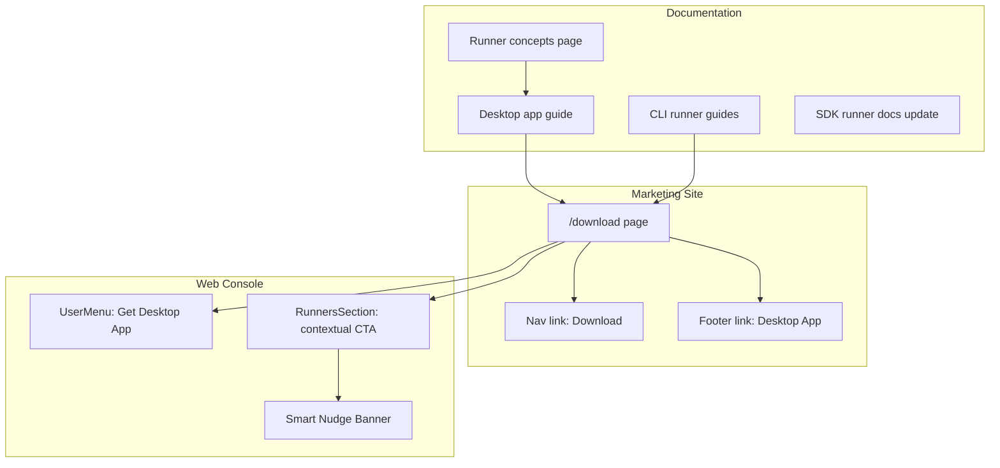

# T01: Design & Task Plan — Desktop App Documentation + Promotion

## Problem Statement

Six projects delivered a massive runner/desktop/CLI surface area over the past week:

| Project | What it delivered |
|---------|-------------------|
| **20260420.01** agent-runner-as-resource | `AgentRunner` as first-class resource, side-channel proxy, heartbeat, dispatch, runner lifecycle |
| **20260422.01** runner-ux-cli-restructure | `stigmer up`/`down`, multi-runner management, `RunnerListPanel`, `RunnerPicker`, Settings > Runners |
| **20260422.02** runner-command-stream | Bidi gRPC `connect` stream, `sendCommand`, stream-based stop |
| **20260423.01** web-sdk-architecture-standards | SDK-first architecture, 8 DDs, 5 dont-dos, ESLint rules, domain layout |
| **20260423.02** phase3-persistent-runners-browser-launch | `stigmer://` launch tokens, Docker placement, `useLaunchLocalRunner`/`useStopRunner`/`useDeleteRunner`, full CRUD |
| **20260423.03** stigmer-desktop-app | Tauri app with tray, sidecar CLI, deep links, auto-updater, native features |

The code is done. The documentation and distribution have not kept pace.

**Documentation gaps:**
- No runner concept page in `docs/concepts/` (agents, skills, tools, sessions, workflows all have one — runners don't).
- No desktop app documentation at all — only incidental mentions in `runner.mdx` and `workspace.mdx`.
- No guides for running agents locally, Docker placement, or managing runners.
- React hooks `useLaunchLocalRunner`, `useStopRunner`, `useDeleteRunner` are not in the auto-generated SDK docs.

**Distribution gaps:**
- No download page on `stigmer.ai`.
- No promotion touchpoints in the web console beyond the "Launch Local Runner" button.
- Desktop app distributed only via GitHub Releases — invisible to non-technical visitors.

## Industry Analysis

### How the best desktop apps promote installation

**Slack** (most aggressive):
- Persistent bottom banner: "Stop juggling tabs, download the Slack app" — recurs after dismissal (users actively seek workarounds).
- Workspace menu: "Open the Slack app" always available.
- Auth flow redirects to desktop app via `slack://` deep link.

**Discord** (moderate, context-driven):
- Localhost WebSocket on port 6463 to detect if app is running.
- Invite links check detection, redirect to app or show "Open Discord" + "Continue in browser."

**Figma** (subtle, preference-driven):
- "Open in desktop app" per-file action. Preference toggle. FigmaAgent localhost connection.
- No persistent banner. Browser-first tool where desktop is optional.

**Linear / Notion** (everboarding pattern):
- Introduce features contextually when usage patterns suggest readiness.
- Nudges at moments of relevance, not on login.

### Lessons for Stigmer

| Pattern | Adopt? | Rationale |
|---------|--------|-----------|
| Persistent recurring banner (Slack) | **No** | Developers resist nagging. Recurring banners erode trust. |
| Localhost detection (Discord) | **No** | Requires desktop app to expose a local server. Attack surface + maintenance burden. |
| Protocol detection via blur events | **No** | Browser-specific hacks. Unreliable. Not world-class. |
| Always-available menu link (Slack, Figma) | **Yes** | Non-intrusive, discoverable, zero annoyance. |
| Contextual promotion at point of need (Discord, Figma) | **Yes** | Show value when it matters (runners, local workspace). |
| One-time dismissible nudge (Linear everboarding) | **Yes** | Introduces after value established. Never recurs. |
| Dedicated download page (all major apps) | **Yes** | Every serious desktop app has one. |

### Why NOT at first login

1. **Cognitive overload at onboarding** — OrgGate flow (Welcome → Create Org) is the first interaction. Adding "install this app" violates Hick's Law and Miller's Law.
2. **Value-first principle** — Figma, Linear, Notion: deliver value first, ask for commitments after. Installing an app IS a commitment.
3. **Not everyone needs it** — Cloud-only users never run local agents. First-login promotion assumes universal benefit.
4. **Developer resistance** — Developers are skeptical of "install our app" before evaluating the product.
5. **Fragile onboarding funnel** — Every added step between signup and first-value increases drop-off.

**When instead**: After the user has completed at least one session (they've experienced the core product). This is the Linear "everboarding" pattern.

## SDK Placement Analysis (DD-004 Compliance)

> "Would a platform builder embedding Stigmer into their product need desktop app promotion?"

**No.** All promotion UI lives in `client-apps/web` (Console). `RunnerListPanel` in `sdk/react` keeps its generic empty state. No SDK boundary violations.

## Detection Strategy

Infer desktop app status from observable behavior — no protocol detection, no localhost probing:

| Signal | Meaning | Source |
|--------|---------|--------|
| User has active local runners | Has the desktop app (or CLI) | `useRunnerList` (existing) |
| User dismissed the nudge banner | Acknowledged the desktop app | `localStorage` |
| User clicked "Launch Local Runner" successfully | Has the app | Browser navigated to `stigmer://` |

## Architecture Overview

## Task Breakdown

### Phase A: Documentation (close out the six projects)

| Task | Title | Diataxis Type | Location | Dependencies |
|------|-------|--------------|----------|--------------|
| T02 | Runner concepts page | Explanation | `docs/concepts/runners.mdx` | None |
| T03 | Desktop app guide | How-to | `docs/guides/desktop/` | T02 |
| T04 | CLI runner guides | How-to | `docs/guides/runners/` | T02 |
| T05 | SDK React runner docs update | Reference | `docs/sdk/react/runner.mdx` | None |

### Phase B: Distribution and Promotion

| Task | Title | Location | Dependencies |
|------|-------|----------|--------------|
| T06 | Marketing site download page | `site/src/app/download/` | T03 (links to desktop guide) |
| T07 | Marketing site nav/footer wiring | `site/src/lib/constants.ts` | T06 |
| T08 | Console: "Get Desktop App" in user menu | `client-apps/web/.../UserMenu.tsx` | T06 (needs URL) |
| T09 | Console: contextual runner promotion | `client-apps/web/.../RunnersSection.tsx` | T06 (needs URL) |
| T10 | Console: smart nudge banner | `client-apps/web/.../layout/` | T06, T09 |
| T11 | Verification & polish | Cross-cutting | All |

---

## Phase A: Documentation Tasks

### T02: Runner Concepts Page

**What**: A concept/explanation page that defines what runners are and how they fit into Stigmer's architecture.

**Where**: `docs/concepts/runners.mdx` + add `runners` to `docs/concepts/meta.json`.

**Diataxis type**: Explanation — "Here is why this matters."

**Content outline**:
- What is a runner (the machine/process that executes your agents).
- Local runners vs cloud-provisioned runners.
- Runner lifecycle and phases: PENDING → READY → BUSY → STOPPED / FAILED.
- How dispatch routing works: session auto-bind, runner picker, fallback.
- Docker vs native runtime (CLI-level concern, not server-visible).
- The command stream: how the server communicates with connected runners.
- Links to: CLI runner guides, desktop guide, SDK runner reference.

**Why it's needed**: Every core Stigmer concept (Agents, Skills, Tools, Sessions, Workflows, Environments, Organizations) has a concept page. Runners don't. This is a vocabulary gap — users encounter runners in the CLI, web console, and desktop app with no foundational explanation.

### T03: Desktop App Guide

**What**: A how-to guide section for the Stigmer Desktop app — install, setup, and use.

**Where**: `docs/guides/desktop/` (new section) with 3 pages:
- `overview.mdx` — What the desktop app is, what it adds over the web console.
- `install.mdx` — Platform-specific installation (macOS, Windows, Linux), first launch, auth flow.
- `launch-runner.mdx` — How the browser-to-desktop `stigmer://` flow works, launching from Settings > Runners, managing runners from the tray.

Add `desktop` section to `docs/guides/meta.json`.

**Diataxis type**: How-to — "Here is how to do X."

**Content sources**: Desktop app project `20260423.03` (next-task.md, design decisions), Phase 3 project `20260423.02` (launch token flow, `stigmer://` protocol).

### T04: CLI Runner Guides

**What**: How-to guides for managing runners via the CLI.

**Where**: `docs/guides/runners/` (new section) with 3 pages:
- `local-runner.mdx` — `stigmer up runner`, multi-runner management, naming (slug), state files under `~/.stigmer/runners/`.
- `docker-runner.mdx` — `stigmer up runner --runtime docker`, custom images (`--image`), container naming (`stigmer-runner-<slug>`), container lifecycle.
- `stop-and-cleanup.mdx` — `stigmer down`, `stigmer down runner`, runner stop from web/desktop, server-initiated stop via command stream.

Add `runners` section to `docs/guides/meta.json`.

**Diataxis type**: How-to — "Here is how to do X."

**Content sources**: CLI restructure project `20260422.01` (start/stop/multi-runner), Phase 3 `20260423.02` (Docker placement T05, stop RPC T06).

### T05: SDK React Runner Docs Update

**What**: Add the three new React hooks to the SDK runner reference page.

**Where**: `docs/sdk/react/runner.mdx` (existing auto-generated file).

**What's missing** (added in Phase 3 T07 but not picked up by codegen):
- `useLaunchLocalRunner` — behavior hook, `stigmer://` URL construction, configurable `openUrl`.
- `useStopRunner` — mutation hook, wraps `runner.stop(input)`.
- `useDeleteRunner` — mutation hook, wraps `runner.delete(id)`.
- Associated types: `UseLaunchLocalRunnerOptions`, `UseLaunchLocalRunnerReturn`, `LaunchLocalRunnerResult`, `StopRunnerInput`, `UseStopRunnerReturn`, `UseDeleteRunnerReturn`.

**Approach**: Check if the codegen generator (`tools/codegen/generator/sdk_docs.go`) can pick these up with the right source annotations. If the hooks have JSDoc/TSDoc that the generator reads, regenerating may be sufficient. If not, add manual documentation following the existing pattern in the file.

---

## Phase B: Distribution and Promotion Tasks

### T06: Marketing Site Download Page

**What**: Create `/download` route on `stigmer.ai` with platform-detected download buttons, value proposition, and system requirements.

**Where**: `site/src/app/download/page.tsx` + `site/src/components/pages/DownloadPage.tsx` (following Pricing/UseCases page pattern).

**Details**:
- Platform detection via `navigator.userAgentData?.platform` (modern) with `navigator.platform` fallback. Resolves to macOS / Windows / Linux.
- Primary CTA: "Download for [detected platform]" — links to the latest GitHub Release.
- Secondary: "Other platforms" section with all three platform downloads.
- Value proposition section: why install the desktop app (local runners, tray, native file picker, `stigmer://` deep links, auto-updates).
- System requirements section.
- "Getting started" link to `docs/guides/desktop/install` (written in T03).
- SEO: proper `metadata` export with title, description, OpenGraph.
- Page follows existing conventions: `Header`, `Footer`, `FadeInUp` motion, `SkipLink`, dark theme, Tailwind v4.

**Download URL strategy**: Link to `https://github.com/stigmer/stigmer/releases/latest` (the releases page) as the primary target. The releases page shows all platform assets and is always up to date. Avoids the instability of version-specific direct URLs. The page can also show the CLI install command (`brew install stigmer/tap/stigmer`) as an alternative path.

### T07: Marketing Site Nav/Footer Wiring

**What**: Add "Download" link to the site header navigation and footer.

**Where**: `site/src/lib/constants.ts` — `NAV_LINKS` and `FOOTER_LINKS`.

**Details**:
- Add `{ label: "Download", href: "/download" }` to `NAV_LINKS` after Pricing, before GitHub.
- Add "Desktop App" entry under `product` section in `FOOTER_LINKS`.
- Header and MobileMenu auto-pick up the new nav link. Footer auto-picks up new footer link. No component changes needed.

### T08: Console "Get Desktop App" in User Menu

**What**: Add a "Get Desktop App" link to the `UserMenu` dropdown.

**Where**: `client-apps/web/src/domain/_shared/layout/UserMenu.tsx`.

**Details**:
- New `DropdownMenuItem` with `Monitor` icon (Lucide) and label "Get Desktop App".
- Opens the marketing site download page in a new tab (`target="_blank"`, `rel="noopener noreferrer"`).
- Placed between "Appearance" and "Sign out" (separates navigation/settings from account actions).
- Only shown in OIDC mode (cloud Console). Not shown in local/OSS mode.

### T09: Console Contextual Runner Promotion

**What**: Add desktop app promotion to runner-related areas.

**Where**: `client-apps/web/src/domain/settings/RunnersSection.tsx` (Console-only, not SDK).

**Details**:

**9a. Enhanced runner empty state**: When `RunnerListPanel` renders empty, add a secondary promotional block below:
- "Run agents on your machine" heading.
- Brief value proposition.
- "Get Stigmer Desktop" button linking to the download page.
- Only shown when zero runners AND user hasn't dismissed it (localStorage).

**9b. Launch failure context**: When `useLaunchLocalRunner` reports an error, surface:
- "Stigmer Desktop not found" with a link to download it.
- Natural touchpoint — user tried to launch and it didn't work.

**Note**: `RunnerListPanel` in `sdk/react` is NOT modified. All promotion is in the Console's `RunnersSection` wrapper (DD-004).

### T10: Console Smart Nudge Banner

**What**: One-time, dismissible banner introducing the desktop app after value is established.

**Where**: New component in `client-apps/web/src/domain/_shared/layout/` (Console-only).

**Trigger conditions** (all must be true):
1. User is authenticated (OIDC mode, not local/OSS).
2. User has NOT dismissed the banner (`localStorage` key `stigmer:desktop-banner-dismissed`).
3. User has at least one session (experienced the core product).
4. User has zero local runners (if they have runners, they already have the app/CLI).

**Content**: Slim top banner. Icon + "Run agents locally with Stigmer Desktop" + "Learn more" link + dismiss (X) button.

**Dismissal**: Click X or "Learn more" → `localStorage` → banner never shows again.

**Placement**: Top of main content area in AppShell, session zone only (not settings, not public routes).

**Anti-patterns avoided**: No recurring banner. No modal. No attention-grabbing animation.

### T11: Verification & Polish

**Checklist**:
- [ ] Runner concepts page renders correctly in docs sidebar under Concepts.
- [ ] Desktop guide renders correctly in docs sidebar under Guides.
- [ ] CLI runner guides render correctly in docs sidebar under Guides.
- [ ] SDK runner page includes the three new hooks.
- [ ] Marketing site `/download` page renders with correct platform detection.
- [ ] Nav and footer links work on marketing site.
- [ ] Console UserMenu "Get Desktop App" opens download page in new tab.
- [ ] RunnersSection empty state shows desktop promotion.
- [ ] Launch failure shows download CTA.
- [ ] Smart nudge banner appears for qualifying users.
- [ ] Smart nudge banner does NOT appear after dismissal.
- [ ] Smart nudge banner does NOT appear for users with local runners.
- [ ] Smart nudge banner does NOT appear in local/OSS mode.
- [ ] Zero linter errors across all modified files.
- [ ] No SDK boundary violations (no Console imports in SDK).
- [ ] Theme token compliance (no hardcoded colors).
- [ ] Accessibility: all new elements keyboard-navigable, proper ARIA labels.
- [ ] Documentation follows Diataxis types (no mixing).
- [ ] Documentation follows plain language standards.

## Design Decisions

- **DD-01: Docs before promotion** — Documentation creates link targets. Promotion without docs leads to dead ends.
- **DD-02: All promotion UI in Console, not SDK** — DD-004 compliance. Platform builders don't want Stigmer Desktop CTAs in their embedded components.
- **DD-03: No protocol detection** — No `custom-protocol-check` or localhost probing. Infer from behavior.
- **DD-04: No persistent recurring banners** — One-time dismissible nudge only. Slack's recurring banner is an anti-pattern for developer tools.
- **DD-05: Not at first login** — Post-value nudge after first session. Linear/Figma everboarding pattern.
- **DD-06: Runner concept page fills a vocabulary gap** — Every core concept has a page. Runners don't.

## Risks

1. **GitHub Release asset URLs are not stable across versions** — Mitigated by linking to releases page, not direct asset URLs.
2. **Marketing site is statically exported** — Platform detection must be client-side only (`"use client"`).
3. **SDK docs codegen may not pick up new hooks** — May need manual additions or generator fixes.
4. **Pre-existing `SessionUpdateSandboxIdHandler.java` compilation error** — Not relevant (no backend changes), but noted for context.
