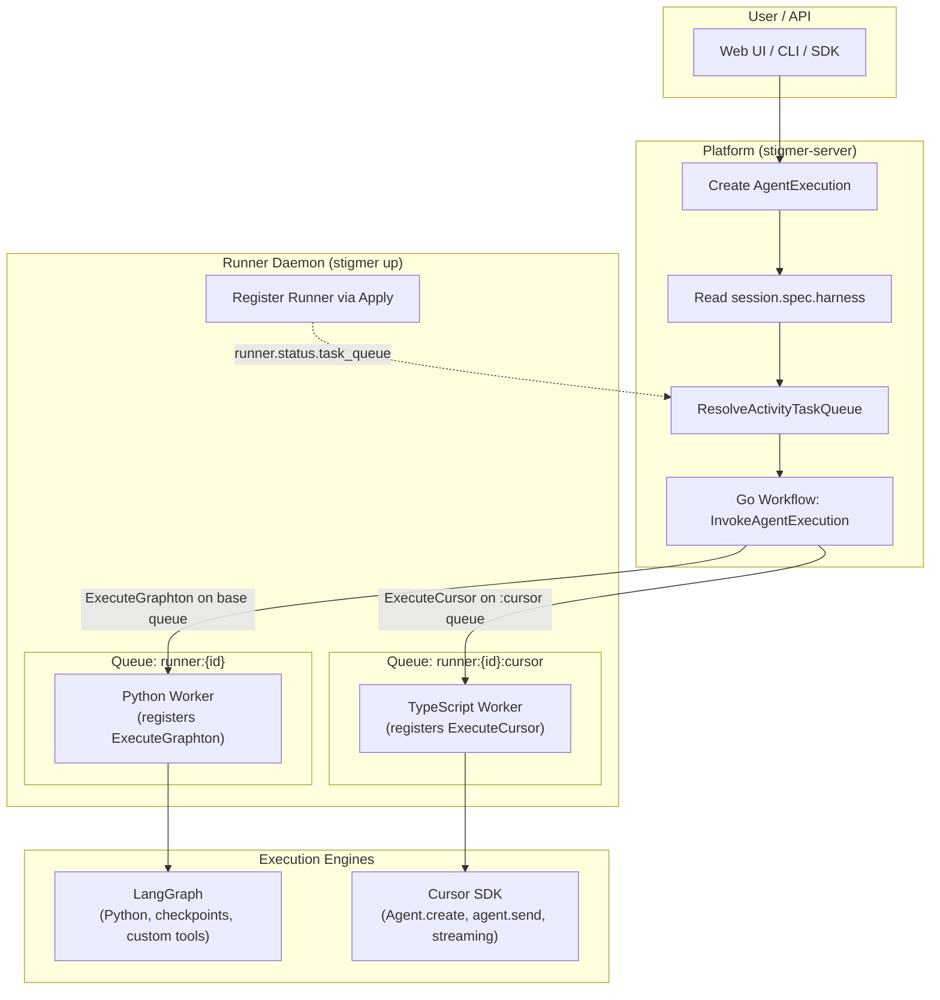

# Cursor Harness -- Architecture Analysis & Brainstorming Reference

> This document captures the full analysis and brainstorming session that led to the cursor-harness project. It serves as the architectural reference for all implementation decisions. Created 2026-04-30.
>
> **Note**: This predates the "harness" naming decision. References to "execution_backend" in proto snippets should be read as "harness" -- the task plan (T01_0_plan.md) has the final naming.

## Executive Summary

Add Cursor as a second execution engine inside the existing runner daemon. `stigmer up` starts ONE daemon that launches BOTH the Python/LangGraph worker and the TypeScript/Cursor worker. Each worker polls a **separate derived task queue** — Python on `runner:{id}` (base queue), TypeScript on `runner:{id}:cursor`. The workflow dispatches activities to the correct queue based on the session's harness field. The backend choice lives on `SessionSpec` -- when a user creates a session, they pick LangGraph (standard) or Cursor (premium). The Runner resource stays unchanged.

> **Correction (2026-05-01):** The original design assumed "Temporal routes activities by
> activity type name." This is incorrect — Temporal dispatches activity tasks to any worker
> polling a queue without regard to registered activity types. Sharing one queue between
> Python and TypeScript workers caused non-deterministic routing where the Python worker
> could receive `ExecuteCursor` tasks and permanently fail them. The fix uses a derived
> queue (`{baseQueue}:cursor`) for the cursor runner, with the workflow dispatching
> `ExecuteCursor` to that specific queue.

---

## Decisions (Resolved)

| Question | Decision |
|---|---|
| Where does backend selection live? | **SessionSpec** -- new `execution_backend` field |
| Runner proto changes? | **None** -- Runner is infrastructure, backend-agnostic. No `RunnerBackend` enum. |
| Runner connection info changes? | **None** -- we don't capture LangGraph SDK version, so don't capture Cursor SDK version either |
| Task queue model? | **Derived queues** -- Python polls `runner:{id}` (base), TypeScript polls `runner:{id}:cursor`. Workflow dispatches to the correct queue per harness. |
| Cursor API key ownership? | **Stigmer service account** -- customer never sees Cursor. Stigmer absorbs cost and adds platform fee. |
| Cost UX? | **Unified** -- same billing experience as LangGraph. Stigmer captures Cursor's cost data and presents it in its own cost model. |
| Scope? | **Both Local and Cloud** -- target both Cursor runtimes. |
| HITL? | **Required** -- cannot disable. Need further research on how Cursor SDK handles it. MCP bridge is the fallback approach. |
| Thinking messages? | **Yes** -- add `MESSAGE_THINKING = 5` to `MessageType` enum. |
| CLI bundling? | **Embedded** -- same pattern as the Python agentrunner. Node.js cursor-runner embedded in CLI binary. |
| Tool inventory? | **Cursor owns tools** -- Cursor gets its own built-in tools. MCP server usages from SessionSpec are passed to Cursor via `mcpServers`. No mixing with LangGraph tools. |
| Conversation state? | **Cursor owns state** -- Cursor is a sophisticated system that handles checkpoints, context, summarization internally. That's part of the premium value. |

---

## 1. Architecture -- Revised



### How it works

1. **`stigmer up`** registers ONE Runner resource, starts the daemon.
2. The daemon bootstraps TWO Temporal activity workers on **separate derived queues**:
   - Python worker polls `runner:{runner-id}` (base queue) — registers `ExecuteGraphton`
   - TypeScript worker polls `runner:{runner-id}:cursor` — registers `ExecuteCursor`
3. User creates a Session with `harness = CURSOR` (or `NATIVE`, the default).
4. When an AgentExecution is created, the Go/Java workflow reads `session.spec.harness` and dispatches the corresponding activity type to the correct queue.
5. Deterministic routing: each queue has exactly one worker, so the activity always reaches the right handler.

The `:cursor` suffix is a convention applied by both the workflow (when setting `ActivityOptions.TaskQueue`) and the cursor runner (when creating its `Worker`). No proto or runner registration changes are required — the daemon passes the same base queue env var to both processes.

---

## 2. Proto Changes Required

### 2a. SessionSpec -- new `execution_backend` field

File: [`apis/ai/stigmer/agentic/session/v1/spec.proto`](apis/ai/stigmer/agentic/session/v1/spec.proto)

```protobuf
message SessionSpec {
  // ... existing fields ...
  
  // Execution engine for this session's executions.
  //
  // Determines which Temporal activity type is dispatched when an
  // AgentExecution is created in this session:
  // - LANGGRAPH (default): ExecuteGraphton activity -> Python/LangGraph
  // - CURSOR: ExecuteCursor activity -> TypeScript/Cursor SDK
  //
  // Immutable after first execution -- changing the backend mid-session
  // would break conversation continuity since each engine owns its own
  // conversation state.
  ExecutionBackend execution_backend = 11;
}
```

### 2b. ExecutionBackend enum

New file: [`apis/ai/stigmer/agentic/session/v1/enum.proto`](apis/ai/stigmer/agentic/session/v1/enum.proto) (or add to existing)

```protobuf
// ExecutionBackend identifies which execution engine processes
// activities for a session.
//
// Each backend is a different Temporal activity registered by a
// different worker process within the runner daemon. The backend
// determines:
// - Which tools the agent has access to
// - How conversation state is managed
// - Which LLM models are available
// - Billing tier and cost structure
enum ExecutionBackend {
  EXECUTION_BACKEND_UNSPECIFIED = 0;  // defaults to LANGGRAPH
  
  // Python/LangGraph execution engine (standard tier).
  // Stigmer-owned checkpoints, custom tools, sandbox isolation.
  EXECUTION_BACKEND_LANGGRAPH = 1;
  
  // Cursor SDK execution engine (premium tier).
  // Cursor-managed state, Cursor built-in tools + MCP, both local
  // and cloud runtimes.
  EXECUTION_BACKEND_CURSOR = 2;
}
```

### 2c. MessageType -- add MESSAGE_THINKING

File: [`apis/ai/stigmer/agentic/agentexecution/v1/enum.proto`](apis/ai/stigmer/agentic/agentexecution/v1/enum.proto)

```protobuf
enum MessageType {
  MESSAGE_TYPE_UNSPECIFIED = 0;
  MESSAGE_HUMAN = 1;
  MESSAGE_AI = 2;
  MESSAGE_TOOL = 3;
  MESSAGE_SYSTEM = 4;
  
  // Reasoning/thinking content from the model.
  // Emitted by models with extended thinking (e.g., Claude with
  // thinking enabled, Cursor's thinking events). Rendered distinctly
  // from assistant text in the UI.
  MESSAGE_THINKING = 5;
}
```

### 2d. Runner proto -- NO changes

`RunnerSpec`, `RunnerStatus`, `RunnerConnectionInfo` stay exactly as they are. The Runner is infrastructure -- it does not know or care which execution engines run on it. The daemon manages that internally.

### 2e. ExecutionConfig.model_name -- reuse as-is

The existing `model_name` field works for both backends:
- LangGraph: `"claude-sonnet-4-20250514"` (LLM provider model ID)
- Cursor: `"composer-2"` (Cursor model ID)

The execution adapter translates based on the session's `execution_backend`. No new proto field needed.

---

## 3. Concept Mapping -- Stigmer vs Cursor SDK

| Stigmer | Cursor SDK | Alignment |
|---|---|---|
| Session | Agent (durable, multi-turn) | Strong |
| AgentExecution | Run (single prompt) | Strong |
| AgentMessage | SDKMessage | Adaptable -- needs translator |
| ExecutionPhase | RunStatus | Strong lifecycle match |
| ToolCall | SDKToolUseMessage | Partial -- approval model differs |
| SubAgentExecution | Task tool / agents config | Moderate |
| ExecutionConfig.model_name | ModelSelection.id | Strong |
| McpServerUsage | mcpServers on Agent.create() | Strong |
| Skill | System prompt / .cursor/rules | Weak -- different mechanism |
| ExecutionArtifact | SDKArtifact | Strong |

---

## 4. Daemon Architecture

### Current daemon (`stigmer up`)

```
stigmer up
  +-> Register Runner (Apply RPC)
  +-> Bootstrap Python runtime (venv + embedded agentrunner)
  +-> Start Python process (main.py)
       +-> Temporal Worker polls runner:{id} queue
       +-> Registered activity: ExecuteGraphton
  +-> Start bidi connect stream (heartbeat + commands)
  +-> Wait for exit/signal
```

### Revised daemon (`stigmer up`)

```
stigmer up
  +-> Register Runner (Apply RPC) [unchanged]
  +-> Bootstrap Python runtime [unchanged]
  +-> Bootstrap Node.js runtime (embedded cursor-runner)  [NEW]
  +-> Start Python process (main.py)  [unchanged]
       +-> Temporal Worker polls runner:{id} queue (base)
       +-> Registered activity: ExecuteGraphton
  +-> Start Node.js process (cursor-runner/main.ts)  [NEW]
       +-> Temporal Worker polls runner:{id}:cursor queue (derived)
       +-> Registered activity: ExecuteCursor
  +-> Start bidi connect stream [unchanged]
  +-> Wait for exit/signal (both child processes)
```

Both processes receive the same `STIGMER_TASK_QUEUE` env var (the base queue name). The cursor runner appends `:cursor` internally when creating its Temporal Worker. This keeps the daemon simple — it doesn't need to know about queue derivation.

The daemon supervises both child processes. If either crashes, the daemon can restart it. On `stigmer down` or SIGTERM, both are shut down gracefully.

---

## 5. ExecuteCursor Activity -- What It Does

```
ExecuteCursor(input: AgentExecutionSpec) -> void
  |
  1. Read AgentExecution from server (hydrate spec + session)
  2. Resolve MCP servers from session.spec.mcp_server_usages
  3. Build Cursor McpServerConfig from Stigmer McpServer resources
  4. Create Cursor Agent:
       Agent.create({
         apiKey: STIGMER_CURSOR_API_KEY,  // platform service account
         model: { id: spec.execution_config.model_name },
         local: { cwd: workspace_path },  // OR cloud: { repos: [...] }
         mcpServers: resolvedMcpServers,
       })
  5. Send prompt:
       agent.send(spec.message)
  6. Stream and translate:
       for await (event of run.stream()) {
         agentMessages = translateCursorEvent(event)
         reportStatusUpdate(executionId, agentMessages)
       }
  7. Collect result:
       result = await run.wait()
       reportFinalStatus(executionId, result)
  8. Dispose agent
```

### Cursor Session Lifecycle (mapping to Stigmer Session)

- First execution in a Cursor session: `Agent.create()` -> store `agent.agentId` in session metadata
- Subsequent executions: `Agent.resume(agentId)` -> `agent.send(newMessage)`
- Session delete: `Agent.delete(agentId)` or `Agent.archive(agentId)`

The Cursor `agentId` is stored in `SessionSpec.metadata` (the existing `map<string, string>` field) as a key like `cursor_agent_id`. This avoids any proto changes to Session.

---

## 6. HITL Approval -- Research Needed

### What we know

Cursor IDE has approve/reject/skip for tool calls. The user was directly inspired by this for Stigmer's approval model. However, the current Cursor TypeScript SDK documentation shows:
- `SDKRequestMessage` with `request_id` -- signals the agent is awaiting input
- No structured `approve(toolCallId)` / `reject(toolCallId)` / `skip(toolCallId)` in the SDK API

### What needs investigation

1. Does the Cursor SDK expose a way to respond to `SDKRequestMessage`? The `run.conversation()` method returns structured turns, and `agent.send()` could potentially be used to respond.
2. Does Cursor's `SDKRequestMessage` correspond to tool approval prompts?
3. Can we configure Cursor to require approval for all tool calls (so Stigmer becomes the gatekeeper)?

### Fallback: MCP-based approval bridge

If the SDK does not expose structured approval:
- The Cursor runner registers a custom MCP server with the Cursor Agent
- This MCP server exposes a `request_approval` tool
- When Cursor calls this tool, the runner:
  1. Sets `ExecutionPhase = WAITING_FOR_APPROVAL`
  2. Populates `pending_approvals` on the execution status
  3. Waits for the user's decision via Stigmer's `SubmitApproval` RPC
  4. Returns the decision as the MCP tool result
  5. Cursor continues based on the result

### Stigmer as approval middleware

Regardless of mechanism, the flow is:
1. Cursor asks for approval on every tool call (configurable or via MCP)
2. Stigmer checks the user's approval policies
3. If policy says auto-approve: Stigmer auto-approves without user interaction
4. If policy says requires_approval: Stigmer pauses and shows approval UI
5. User decides (approve/skip/reject) via existing SubmitApproval RPC

**Status: Needs dedicated research spike. Noted for separate investigation.**

---

## 7. Cost Model

### Architecture

- Stigmer holds a **platform-level Cursor service account API key**
- All Cursor SDK calls use this key (customer never sees Cursor)
- Cursor bills Stigmer based on usage
- Stigmer adds a platform fee on top and presents unified billing

### Unified billing UX

The existing cost tracking for LangGraph uses:
- `UsageMetrics` on AgentExecution (input/output tokens, estimated cost)
- Team usage dashboard

For Cursor, the adapter captures:
- `TurnEndedUpdate.usage` (inputTokens, outputTokens, cacheReadTokens, cacheWriteTokens)
- `result.durationMs`
- Model used

These are translated to Stigmer's `UsageMetrics` format so the billing dashboard shows the same structure regardless of backend. The user sees "this execution cost $X" without knowing whether it was LangGraph or Cursor underneath (though the session's `execution_backend` is visible for transparency).

---

## 8. Go Workflow Changes

### Updated dispatch in `InvokeAgentExecutionWorkflowImpl`

The Go workflow currently dispatches `ExecuteGraphton` unconditionally. It needs to:

1. Read the session's `execution_backend`
2. Dispatch the appropriate activity:

```go
switch session.Spec.ExecutionBackend {
case sessionv1.ExecutionBackend_EXECUTION_BACKEND_CURSOR:
    // Dispatch to TypeScript worker
    err = workflow.ExecuteActivity(ctx, "ExecuteCursor", input).Get(ctx, nil)
default:
    // Dispatch to Python worker (existing behavior)
    err = workflow.ExecuteActivity(ctx, "ExecuteGraphton", input).Get(ctx, nil)
}
```

Both activities run on the same task queue (`runner:{id}`), so `ActivityOptions.TaskQueue` stays the same.

---

## 9. Feature Parity Matrix (Revised)

| Feature | LangGraph | Cursor | Notes |
|---|---|---|---|
| Multi-turn conversation | Yes | Yes | Both retain context across executions |
| Tool execution | Stigmer custom tools | Cursor built-in tools | Different tool sets; this is the value prop |
| MCP server integration | Yes | Yes | Session MCP usages passed to Cursor |
| Skills (injected context) | Yes (system prompt) | Partial (system prompt) | Skills content injected as prompt prefix |
| Sandbox isolation | Docker | Cursor Cloud VM | Different mechanisms |
| Pause/Resume | Yes (LangGraph checkpoint) | No (Cursor owns state) | Acceptable trade-off for premium tier |
| HITL Approval | Full flow | Needs research | Required -- MCP bridge as fallback |
| Artifacts | Yes | Yes | Strong alignment |
| Streaming | Yes | Yes | Adapter translates SDKMessage to AgentMessage |
| Subagents | Yes | Yes (Cursor built-in) | Cursor has sophisticated subagent support |
| Context management | Stigmer summarization | Cursor handles internally | Premium tier benefit |
| Cost tracking | Stigmer UsageMetrics | Cursor usage -> Stigmer UsageMetrics | Unified billing |
| Local execution | Native Python process | Cursor Local (Node.js, cwd) | Both supported |
| Cloud execution | Docker / ephemeral runner | Cursor Cloud (VM) | Both supported |
| Git write-back | Stigmer workspace write-back | Cursor autoCreatePR | Map to same UX |

---

## 10. Embedded Cursor Runner

The TypeScript cursor-runner must be embedded in the CLI binary, same pattern as the Python agentrunner:

- Source: `client-apps/cli/embedded/cursorrunner/` (mirroring `embedded/agentrunner/`)
- Build tag: `embed_cursorrunner`
- Runtime: Bundle a standalone Node.js binary (similar to how python-build-standalone is used for Python)
- Extract + run: Same extract-to-data-dir pattern

Alternatively, the cursor-runner could be compiled to a single executable using `bun build --compile` or `pkg`, avoiding the need to bundle a full Node.js runtime.

---

## 11. Open Items

1. **HITL research spike** -- Dedicated investigation into Cursor SDK's approval/request handling. Check if newer SDK versions or undocumented APIs expose structured approval. Design the MCP bridge if needed.
2. **Node.js embedding strategy** -- Evaluate `bun build --compile` vs bundled Node.js vs Deno compile for producing a single binary.
3. **Cursor Agent lifecycle management** -- Define how `cursor_agent_id` is stored, resumed, and cleaned up across session lifecycle events.
4. **Error handling** -- Map Cursor's `CursorAgentError` subtypes to Stigmer's execution failure model.
5. **Cursor model catalog** -- Sync available Cursor models via `Cursor.models.list()` and expose them in Stigmer's model picker when `execution_backend = CURSOR`.
