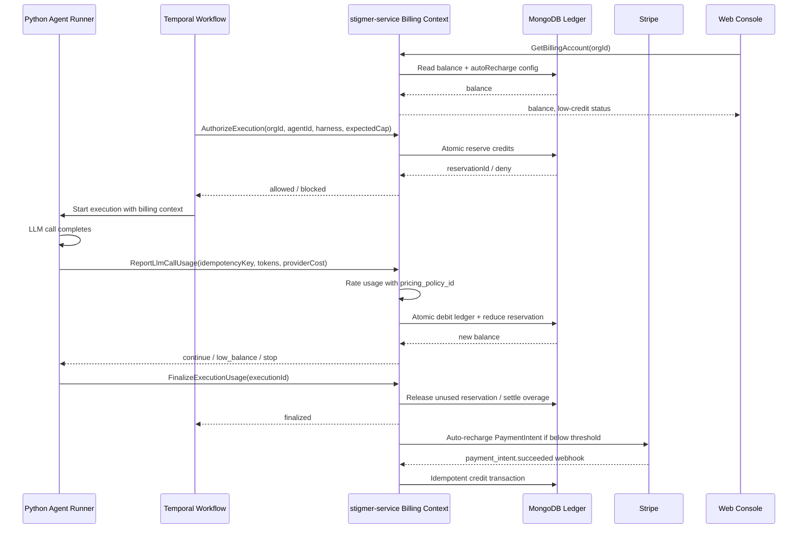

# Prepaid Credit Billing Strategy and Stripe Integration for Stigmer

## Executive Summary

Stigmer should launch a **cloud-only, prepaid, USD-anchored credit wallet** with **real-time balance enforcement**, **automatic top-ups**, and an **immutable internal credit ledger** that is separate from Stripe’s invoice-oriented credit features. The strongest market pattern is not a single universal billing model, but two clusters: **prepaid wallet vendors** such as OpenAI, Anthropic, Replicate, Together, and Daytona; and **subscription plus metered overage vendors** such as Cursor, GitHub Copilot, Replit, GitHub Codespaces, and Vercel. Stigmer most closely resembles the first group because you are the merchant of record for third-party model spend, but you should borrow the second group’s **budgets, alerts, webhooks, and graceful blocking** controls. citeturn5view6turn5view7turn5view5turn21view0turn22view0turn23view1turn24view2turn10search0turn2view4turn2view8

The most important architectural decision is to **keep provider costs and customer prices separate**. Your current `model-registry.json` should remain the canonical source for **provider cost** and model capabilities. Customer-facing burn rates should come from a **versioned billing policy** that the billing service applies when usage events are converted into ledger debits. That design preserves finance visibility, makes historical usage auditable, and lets Stigmer change margins without corrupting cost truth. Stripe should process payments and save payment methods, but **Stripe Customer Balance / invoice credit balance should not be the source of truth for Stigmer credits**, because Stripe’s customer credit balance is designed to auto-apply to future invoices, not to serve as a real-time app wallet, and Stripe’s standard meter processing is asynchronous. citeturn18view0turn18view2turn20view2turn20view0

My top recommendations are these:

| Recommendation | Decision |
|---|---|
| Pricing source of truth | Keep provider costs in `model-registry.json`; apply customer pricing in a separate, versioned billing policy at deduction time. |
| Credit unit | Use a **USD-anchored credit** with a fixed published conversion such as **1,000 credits = $1.00 of Stigmer billable value**, while storing balances internally in integer micro-USD or microcredits for precision. |
| Margin | Target a **blended 25%–35% gross margin on billable AI spend**. Start around **30% on Native standard**, **20% on Native premium**, **50% on Native economy**, and **10%–15% on Cursor** because Cursor may already include margin. |
| Stripe architecture | Use **Stripe Checkout** for one-time credit purchases, **saved payment methods + off-session PaymentIntents** for auto-recharge, **Stripe Tax** for checkout tax collection, and your **own MongoDB ledger** for balances and enforcement. |
| Enforcement model | Use **reservation + incremental settlement**: authorize an execution budget up front, deduct on each completed LLM call, release unused reserve at the end, and allow only a very small managed overage buffer for in-flight work. |

Those choices align well with what official docs show: OpenAI, Anthropic, and Replicate all support prepaid balances with auto-reload and stop-work behavior; Daytona exposes a wallet with one-time top-up and automatic top-up rules; Vercel and GitHub expose budget thresholds, notifications, and stop-usage controls; and Stripe’s higher-level credit and meter products are either invoice-bound or asynchronous enough that they should remain secondary, not primary, in a Stigmer enforcement path. citeturn5view6turn5view7turn5view5turn21view0turn23view1turn24view2turn10search0turn2view4turn20view2turn18view0

## Competitive Analysis

The best benchmark for Stigmer is not any one company, but the recurring design motifs across adjacent platforms. The table below summarizes the highest-confidence patterns from official docs and pricing pages.

| Platform | Current billing pattern | What matters for Stigmer |
|---|---|---|
| **Daytona** | Uses an org **wallet** with balance in **USD**, supports **one-time top-up**, **custom amounts**, **automatic top-up** with threshold and target amounts, and has an explicit post-cancellation settlement window with dispute handling. citeturn23view1turn23view3 | Strong reference model for a developer infrastructure wallet: balance, top-up, usage charts, settlement delay, dispute flow. |
| **Replit** | Uses **monthly allowances / credits** with usage-based billing beyond the allowance, allows **credit packs**, and supports **usage limits** that block services once the limit is reached. Agent pricing is effort-based rather than raw token billing. citeturn2view3turn2view4turn2view5turn1search9 | Good example of mixing bundled value with usage controls; less useful as a pure prepaid wallet reference. |
| **Vercel** | Primarily **subscription + metered usage**, not prepaid. Pro includes usage allocation, then **Spend Management** can notify, send webhooks, or pause projects, with threshold checks every few minutes. Vercel’s Pro plan also includes **$20 in usage credit** according to its pricing docs. citeturn24view2turn24view3turn1search26 | Strong reference for **alerts, threshold webhooks, and operational pause behavior**, not for prepaid credits. |
| **GitHub Codespaces** | Bills monthly for **compute time** and **storage**, includes free quotas for personal plans, and supports budgets that can stop usage. Personal GitHub Free includes **15 GB-month** and **120 hours**, while GitHub Pro includes **20 GB-month** and **180 hours**. citeturn2view8turn2view9 | Good model for treating usage as a meter and decoupling “included” from “extra.” |
| **GitHub Copilot** | Uses **seat-based plans** with included **premium request allowances**, then overages for extra premium usage at **$0.04/request**. Budgets can alert or stop usage; GitHub is also moving Copilot toward broader usage-based billing. citeturn10search1turn10search0turn10search5turn10search15 | Useful analog for bundling AI usage with centralized admin spend controls and pooled budgets. |
| **OpenAI API** | Uses **prepaid billing** with minimum **$5** purchase, auto-recharge threshold and monthly cap, **1-year expiry**, **non-refundable** credits, and possible temporary **negative balances** because cut-off can lag actual usage. Refunded or disputed amounts are removed from balance. citeturn5view6turn5view7 | This is the clearest direct analog for Stigmer’s prepaid API spend model. |
| **Anthropic API** | Uses prepaid **usage credits** purchased before use, allows **auto-reload**, makes credits available immediately, stops API use at zero, and sets **1-year expiry** with **no refunds**. citeturn5view5 | Another close analog, especially for strict stop-at-zero semantics. |
| **Cursor** | Uses **plan-included model usage**, then **on-demand usage billed in arrears**. Cursor’s pricing policy states **Model API Fees** are based on model pricing rates, and enterprise **precommitted usage is pooled**. Cursor publicly described Pro as including **$20 of model inference at API pricing**, with the option to buy more usage **at cost**, plus a short grace period. citeturn5view0turn5view2turn5view3turn5view4 | Important because it shows a mixed monetization model: seat fee + included usage + at-cost or near-cost overages. |
| **Replicate** | Requires **prepaid credit upfront**, provides **auto reload**, states purchased credit is valid for **1 year** and **not refundable**, and stops new work when balance hits zero, though a rare overrun can be charged later. citeturn21view0turn21view1 | Excellent reference for stop-start semantics and rare overrun handling. |
| **Together AI** | Is **fully prepaid**, requires a **minimum $5 credit purchase**, suspends API use at zero, supports auto-recharge, and currently says prepaid credits **do not expire**. citeturn22view0turn22view1turn22view2 | Proof that no-expiry prepaid credits are commercially workable, though not the dominant pattern. |
| **Fireworks AI** | Uses a **hybrid/postpaid** structure: pre-purchased credits are applied first, but users can still incur overages; monthly tier limits can suspend service even with credits remaining. citeturn21view3turn21view4turn21view5 | Useful cautionary example of a confusing model Stigmer should avoid in self-serve. |
| **Modal** | Charges a platform fee plus compute, with included monthly compute on Starter and Team plans. The public pricing page shows **$30/month included compute** on Starter and **$100/month** on Team. citeturn11search1 | Strong reference for a future hybrid plan where Stigmer adds included monthly credits to a paid platform tier. |
| **AWS Bedrock** | Exposes pay-as-you-go model pricing, plus **Standard, Flex, Priority, and Reserved** tiers, and 50% cheaper **batch inference** for some models. Official docs do not present a classic prepaid wallet. citeturn8view1 | Suggests enterprise commitment mechanisms are compatible with AI metering, but are not required for Stigmer MVP. |

Three broad patterns emerge. First, **prepaid API vendors** tend to converge on **minimum purchase thresholds, auto-reload, immediate balance deduction, and stop-work behavior**, with either 1-year expiry or no expiry. Second, **developer platforms** tend to pair usage with **administrative controls** such as usage limits, project pauses, and threshold alerts. Third, platforms do **not** typically expose “our margin” as a separate line item; they monetize through subscription fees, included-usage pools, differentiated model tiers, platform value, and sometimes pricing that is simply not equal to underlying provider cost. citeturn5view6turn5view5turn21view0turn22view0turn24view2turn10search0turn5view4turn11search1

For Stigmer, that means the strategically sound path is: **wallet-style prepaid balance** for cost recovery, **Vercel/GitHub-style thresholds and blocks** for admin control, and **Cursor-like bundled or enterprise commit plans later** for larger customers. citeturn23view1turn24view2turn10search0turn5view3

## Recommended Billing Model

**Credit denomination and conversion.** Stigmer should use a **USD-anchored credit**, not a free-floating abstract token. The closest market references anchor balances to dollar value: Daytona displays wallet balances in USD; OpenAI, Anthropic, and Replicate all describe prepaid balances in dollar purchase amounts and thresholds; Together also frames billing around dollar purchases and thresholds. citeturn23view1turn5view6turn5view5turn21view0turn22view0

The most practical implementation is:

- **User-facing denomination:** **1,000 Stigmer Credits = $1.00 of billable value**.
- **Internal denomination:** store balance in **integer micro-USD** or **integer microcredits**.
- **Displayed UI:** show both, for example, **“52,400 credits ($52.40)”**.

This solves the core precision problem. LLM costs often fall well below one cent per call, so **1 credit = $1** is too coarse, while a purely abstract unit makes pricing harder to trust and compare. A USD-anchored credit behaves like a wallet while still being precise enough for token-level burn. It also simplifies international checkout, because Stripe Checkout and Adaptive Pricing let customers pay in local currencies while your integration can still be denominated in your base currency; Stripe’s docs note that Checkout and PaymentIntents can include `presentment_details` for local presentment while the underlying integration remains in the specified currency. citeturn17search0turn15view11

**Pack sizes and pricing tiers.** For self-serve, Stigmer should start with a **small set of fixed packs** rather than fully custom top-ups in the first release. A good default is **$25, $100, $500, and $2,500**. Daytona supports one-time top-ups, including custom amounts, but OpenAI and Together specifically use low minimums and threshold-based reloads, while Replicate’s and Throughput-style platforms show that top-up simplicity matters more than pack creativity. citeturn23view1turn5view6turn22view0turn21view0

My recommended commercial structure is:

- **Free trial:** one-time **$10 promotional balance**, 14-day expiry, economy-and-standard-model allowlist, no Cursor harness by default.
- **Self-serve starter:** first purchase minimum **$25**.
- **Growth:** $100 and $500 packs.
- **Enterprise / invoiced:** $2,500+ committed balance through invoices or sales-assisted Checkout alternatives.

For MVP, I would **not** offer “$100 buys $110 credits” bonus packs in self-serve. Volume discounts are revenue-effective, but they also complicate pricing communication, finance controls, and rev-rec policy. Instead, implement discounts as **contracted rate policy versions** for enterprise customers, or as pack-based bonuses in v2 once finance and legal have signed off on recognition policy. That keeps the launch simpler and makes unit economics easier to debug.

**Margin strategy.** The right answer is **not** “replace provider cost with marked-up prices everywhere.” Instead, Stigmer should preserve **provider cost** as the finance truth and apply a **billing policy multiplier** when usage turns into ledger deductions. That policy should be **versioned** and support **per-harness** and **per-tier** overrides. This is the most important architecture choice in the report. It preserves auditability and lets you tune margin by market behavior without losing the ability to compare “what we paid” against “what we billed.” Stripe’s own higher-level usage products map neatly to invoice and subscription constructs, but your enforcement needs a faster, first-party ledger. citeturn20view2turn18view0turn20view0

I recommend the following starting price policy:

| Usage class | Starting multiplier target | Why |
|---|---:|---|
| Native economy | **1.50x** | Low absolute dollars, high support / orchestration overhead, low customer price sensitivity at the low end. |
| Native standard | **1.30x** | Good default for the bulk of mainstream LLM traffic. |
| Native premium | **1.20x** | Premium models are already expensive; a lower multiplier keeps Stigmer competitive on high-ticket workloads. |
| Cursor harness | **1.10x to 1.15x** | Cursor may already include margin and sometimes frames extra use “at cost” or at published API pricing; double-stacking large markup is risky. citeturn5view4turn5view2 |
| Promotional / free trial | **0x or heavily subsidized** | Growth lever, tightly capped. |

That yields a **blended gross margin target of roughly 25%–35%** across the paid base if your traffic mix resembles most mixed-model agent platforms. The exact percentage is not something large vendors disclose cleanly in public docs. What public materials do show is that many vendors monetize through combinations of **included usage, subscription fees, usage allowances, and platform differentiation** rather than a single obvious token markup. Cursor’s included usage and “buy more at cost,” Vercel’s platform-fee-plus-usage model, Modal’s included monthly compute, and GitHub Copilot’s seat-plus-overage design all point in that direction. citeturn5view4turn1search26turn11search1turn10search1

**Credit lifecycle.** Paid customer credits should use a predictable B2B policy. The prevailing API pattern among OpenAI, Anthropic, and Replicate is **1-year expiry** and **non-refundable** purchases, while Together currently advertises **no expiry**. citeturn5view7turn5view5turn21view0turn22view2

For Stigmer, the most practical launch policy is:

- **Paid self-serve credits:** expire after **12 months**.
- **Promotional / free / startup credits:** expire after **90 days**.
- **Enterprise committed balance:** negotiated, typically **12–24 months**.
- **Refunds:** generally non-refundable once any meaningful usage has occurred; allow support-approved refunds for duplicate purchases, fraud, legal obligations, or accidental purchases with zero usage.
- **Disputes / chargebacks:** immediately reverse the matching credits, and if that drives the org negative, suspend new executions until the balance is restored. OpenAI explicitly states disputed or refunded amounts are removed from the account balance. citeturn5view7

**Cursor harness and local models.** Native and Cursor should **not** have identical margin assumptions. Cursor’s public language says extra usage can be charged at API pricing or at cost, and its pricing policy identifies more than just model API fees: it also references **Cursor Token Fees** and **Bugbot Usage Fees**. That means a raw “take Cursor’s price and add 30%” policy is much more likely to feel exploitative than on Native models. citeturn5view4turn5view2

For **Cursor harness**, start with the lower multiplier above and extend your usage schema to capture every SDK billing component you can obtain, including:

- cursor session / run ID
- selected model
- actual routed model, if exposed
- model API fee
- cursor token fee
- feature-specific fee, if any
- total fee reported by Cursor

For **Ollama/local models**, do **not** treat “provider cost = $0” as “customer price = $0” if Stigmer is paying the cloud compute. The clean answer is to add a second meter for **infrastructure cost** such as CPU-seconds, GPU-seconds, or reserved container/runtime time. If that data is not available yet, the safest MVP move is to **exclude Stigmer-hosted local models from cloud GA billing** until infra metering exists, or mark them as enterprise/beta only. Otherwise you risk selling nontrivial compute for zero burn.

**Direct answers to the headline questions.**

| Question | Recommendation |
|---|---|
| Should `model-registry.json` store provider costs or customer prices? | **Both, but with different roles.** Provider cost remains canonical in the registry. Customer pricing belongs to a versioned billing policy or billing catalog and is stamped onto billable events. |
| Should credits be abstract or dollar-denominated? | **USD-anchored.** Use branded credits, but make the conversion fixed and explicit. |
| What margin is right? | Start at **30% Native standard / 20% premium / 50% economy / 10%–15% Cursor**, then tune from actual retention and gross margin data. |
| How should Cursor be priced? | Lower markup than Native, because Cursor may already include margin and extra non-token fee types. |
| What free tier makes sense? | One-time **$10 trial**, time-boxed, tightly gated. Do not start with recurring free monthly credits. |
| How should local models be handled? | Bill **infrastructure**, not provider tokens. If infra metering is not ready, defer cloud GA support for Stigmer-hosted local models. |

## Margin Strategy Deep Dive

The four margin options in your prompt map to four very different operational philosophies.

**Option A: Markup in the model registry.** This is operationally simple, but strategically weak. If you overwrite provider cost with customer price, you lose clean visibility into gross margin, can no longer answer “what did this execution actually cost us?” from one data source, and make it harder to test new margin policies. It also muddies the semantics of your existing `estimated_cost_usd`, which today means “provider cost.” That field is already useful and should remain what it means now.

**Option B: Margin at the billing layer.** This is the strongest base model. Your existing usage tracker already freezes provider prices at execution time, which is excellent. If the billing service applies a versioned multiplier or rate card at deduction time, you preserve underlying cost truth while still generating customer-facing debits. That also makes backtests and margin reporting much easier, because finance can compare frozen provider costs against frozen customer billable amounts per execution, per model, per harness, or per org.

**Option C: Per-harness / per-tier margin.** This should be layered on top of Option B, not treated as an alternative. Competitive evidence strongly suggests that platforms do not monetize every SKU the same way. Cursor uses included usage and at-cost language for some extra consumption, while GitHub Copilot, Modal, and Vercel all combine included value and metered monetization differently across products. A single flat markup across Stigmer Native economy, Native premium, and Cursor would almost certainly be suboptimal. citeturn5view4turn10search1turn11search1turn24view2

**Option D: Margin via credit conversion rate.** This looks tempting on paper, but I would not use it as the primary mechanism. If $1 paid buys only $0.80 of effective balance, customers will perceive that as hidden spread unless your pricing page is unusually explicit. It also makes model-level rate transparency harder. The more developer-centric and OSS-adjacent your positioning, the more dangerous hidden exchange-rate games become. Stigmer should monetize in the **burn rate**, not in an opaque conversion discount.

The recommendation, therefore, is a **hybrid of B and C**:

- Keep **provider cost** in the model registry.
- Introduce a **versioned billing policy** with:
  - default multipliers by harness and cost tier
  - model-specific overrides
  - optional org-specific enterprise overrides
  - optional “infra surcharge” logic for zero-provider-cost models
- Stamp the selected policy version and applied rate into each **billable usage event** and final **execution billing record**.

That design gives you clean answers to all of these questions at once: what did the run cost Stigmer, what did the customer pay, which policy produced that result, and what gross margin did we realize? It also means you can run experiments safely. If you want to drop premium margin from 1.20x to 1.15x or temporarily price Cursor at near pass-through to win demand, you can do so on a future policy version without rewriting historical executions.

On transparency, the right default is **show the final Stigmer price, not the margin line**. Daytona, OpenAI, Anthropic, Replicate, and most infrastructure vendors do not explain margin as its own customer-visible line item; they show balances, usage, and rates. Cursor’s public confusion in 2025 around plan changes is a reminder that users care deeply about predictability and communication, not about reading your internal gross-margin stack. Stigmer should therefore show:

- credit balance
- model burn rates
- per-agent and per-model consumption
- effective price per model / harness
- optional advanced export of “provider cost estimate” for enterprise customers

But it should **not** show “provider cost + Stigmer margin = final price” by default. citeturn5view4turn23view1turn5view6turn5view5

## Stripe Integration Blueprint

**Which Stripe products to use.** The Stripe stack for Stigmer should be deliberately boring:

- **Stripe Checkout Sessions** for one-time credit purchases.
- **Saved payment methods** captured during Checkout using `payment_intent_data.setup_future_usage=off_session`, or a separate **SetupIntent** flow if you want a dedicated “save card for auto-recharge” experience.
- **Off-session PaymentIntents** for event-driven auto-recharge.
- **Stripe Tax** on Checkout for self-serve tax calculation and collection.
- Optional later: Stripe’s advanced usage-based billing as a reporting or invoicing layer, but **not** in your MVP enforcement path. citeturn15view5turn15view6turn15view7turn15view8turn15view9turn20view0

This matches Stripe’s own guidance. Checkout is the recommended low-maintenance path for one-time and subscription payments and supports a broad set of payment methods, tax, and adaptive pricing. Stripe also explicitly documents saving a payment method from a one-time Checkout payment for later off-session charging, and recommends SetupIntents or `setup_future_usage` when you want future charges to work reliably and meet authentication requirements. citeturn15view5turn15view6turn15view7turn15view8

**Why not Stripe Customer Balance as the Stigmer wallet.** Stripe’s invoice credit balance and customer balance transaction APIs are useful accounting primitives, but the docs make clear they are about **future invoices**. The customer credit balance automatically applies to the **next finalized invoice**, you **cannot choose a specific invoice**, and the amount is tied to invoice concepts and customer currency. Cash balance is about customer-funded real funds held for payment flows, not an app-level usage wallet. In parallel, Stripe’s standard meter events are processed **asynchronously**, so recent usage may not immediately appear in summaries or upcoming invoices. That combination is exactly why Stripe should not be the enforcement ledger for agent executions. citeturn18view0turn15view4turn20view2

So the answer to the Stripe-ledger question is straightforward: **build your own credit ledger in MongoDB** and use Stripe only for money movement, payment method management, tax, invoices, and receipts.

**Purchase flow.** The purchase path should work like this:

1. Web console calls `CreateCreditCheckoutSession(org_id, pack_id, success_url, cancel_url)`.
2. Billing service creates / reuses a Stripe Customer mapped to the Stigmer Organization.
3. Service creates a Checkout Session in **payment** mode with:
   - one line item for the selected credit pack
   - `automatic_tax.enabled=true`
   - `customer_creation=always` when needed
   - `payment_intent_data.setup_future_usage=off_session` when the user opts into auto-recharge.
4. User pays in Stripe Checkout.
5. On successful webhook processing, Billing service creates a **credit purchase record**, appends an immutable **ledger credit entry**, increments the internal balance, and marks the pack as granted.
6. Console shows updated balance.

Stripe’s docs recommend creating a new Checkout Session for each payment attempt, support one-time payments with built-in tax and local payment methods, and document saving payment methods during those flows. citeturn14search19turn15view5turn15view6

**Auto-recharge.** Auto-recharge should **not** use Stripe Subscriptions. Subscriptions are for time-based recurring billing. Recharge is a **threshold-driven event**, more like a top-up wallet. The correct implementation is:

- save a reusable payment method with Checkout or SetupIntent
- store `{enabled, threshold_micros, target_balance_micros, monthly_max_recharge_micros, payment_method_id}`
- when the internal balance falls below threshold, create an **off-session PaymentIntent** for the delta from current balance to target balance
- on payment success, grant credits
- on payment failure, mark the org as “recharge_failed,” notify admins, and let the balance run down to a hard stop

This pattern is exactly aligned with Stripe’s SetupIntent / off-session guidance. citeturn15view7turn15view8turn13search11

**Webhook handling and idempotency.** Webhooks are where most wallet systems accidentally double-credit. Stripe’s docs are explicit: verify webhook signatures with the endpoint secret, use the raw request body, return a `2xx` quickly, and remember that Stripe can retry deliveries with new signatures and timestamps. Stripe’s API docs are equally explicit that idempotency keys should be unique and reused on retries of the *same* operation. citeturn16view2turn16view0turn16view1turn15view2

For Stigmer, the durable pattern is:

- insert every incoming Stripe event into `stripe_webhook_events` with a **unique index on `stripe_event_id`**
- if already processed, no-op and return 200
- acknowledge 200 quickly
- process business logic asynchronously from the stored event
- use idempotency keys for Stripe-side actions such as creating recharge PaymentIntents

The minimum webhook set for MVP is the standard success/failure path around Checkout and PaymentIntents, plus refund/dispute reversal handling for ledger corrections. The specific event set depends on whether you use only Checkout or a mix of Checkout plus direct PaymentIntents, but practically you should treat “payment succeeded,” “payment failed,” and “money reversed” as first-class event categories in your internal model. citeturn16view0turn15view2turn14search19

**Tax, revenue recognition, and international handling.** Stripe Tax can calculate and collect sales tax, VAT, and GST in Checkout flows and can monitor tax obligations across jurisdictions. Stripe also documents recognized and deferred revenue reporting in its Revenue Recognition product, with audit-focused reporting and ASC 606 / IFRS 15 positioning. citeturn15view9turn15view11turn14search1turn15view10

For Stigmer, the safe operating policy is:

- **Self-serve purchases:** calculate tax at purchase time in Checkout via Stripe Tax.
- **Internal wallet ledger:** keep in **USD**.
- **International presentment:** use Checkout with Adaptive Pricing if you want local currency presentment, but do not change the internal ledger currency. Stripe’s docs indicate Adaptive Pricing can localize presentment while maintaining the integration currency and exposing presentment details separately. citeturn17search0
- **Revenue recognition:** treat purchased credits as **deferred / unearned revenue** until consumed by Stigmer services. Recognize revenue as usage occurs.
- **Legal caveat:** whether tax is due at credit-sale time or usage time can vary by jurisdiction and product classification, so finance/tax counsel still needs to confirm the treatment for “prepaid credits usable only for Stigmer services.”

## Billing Pipeline Architecture and Data Model

The billing system should start as a **bounded context inside `stigmer-service`**, not as a brand-new standalone microservice. That keeps delivery fast, reduces operational sprawl, and lets you use the existing control-plane service as the authoritative entry point for org, auth, and execution lifecycle state. The important thing is not separate deployment on day one; it is **clear domain boundaries** and **stable internal APIs**. Build a `BillingService` module with its own gRPC surface and Mongo collections inside `stigmer-service` now, and extract it later only if volume or organizational boundaries justify the split.

The hot-path design should be **synchronous for authorization and debit**, and **asynchronous for dashboards and reconciliation**. Stripe’s meter ingestion is asynchronous, which is fine for invoices and analytics but not for real-time execution gating. That is why Stigmer needs its own internal enforcement loop. citeturn20view2turn20view0

A good end-to-end flow looks like this:

```text
Credit purchase
User -> Web Console -> Billing API -> Stripe Checkout
Stripe webhook -> Billing API -> credit_purchases + credit_ledger_entries + credit_balances

Execution start
Control plane / runner -> AuthorizeExecutionSpend(org, execution, reserve_amount)
Billing API -> atomically check available - reserved -> create reservation -> return allow/deny

During execution
Runner UsageTracker -> on each completed LLM call -> ReportUsageDelta(execution, sequence, usage snapshot)
Billing API:
  1) dedupe by (execution_id, sequence)
  2) read frozen provider-cost data from usage snapshot
  3) apply billing policy version
  4) append immutable debit ledger entry
  5) decrement reserved / available balance
  6) return new balance + warning/stop signal if thresholds crossed

Execution finish
Runner -> FinalizeExecutionBilling(execution)
Billing API -> release unused reserve; if consumed > reserve, apply allowed overage or fail closeout

Async side
Outbox / stream -> usage dashboards, daily summaries, reconciliation, finance exports, alerting
```

This answers the “credits ran out mid-execution” question cleanly. Do **not** try to reserve the maximum possible cost of an unconstrained AI workflow. Instead:

- require a **small upfront reserve** at execution start
- deduct **incrementally per completed LLM call**
- maintain an **org-level overage buffer**
- if available headroom is exhausted, allow the current in-flight call to finish, then block further model/tool invocations and use your existing `CostCapMiddleware` pattern to steer toward a summary / graceful stop

OpenAI and Replicate both document the real-world truth that cutoffs and workloads can briefly outrun prepaid balances, producing negative balances or rare overrun charges. That is not a billing bug; it is a property of distributed execution. Stigmer should embrace that reality by allowing a tiny, controlled overage window instead of pretending zero-overrun execution is possible. citeturn5view6turn21view0

My recommended initial balance policy is:

- **Free-trial / no-card orgs:** no overage; hard stop after reserve is consumed.
- **Card-on-file orgs without auto-recharge:** allow up to **$5** of temporary overage.
- **Auto-recharge orgs:** allow up to the smaller of **$10** or **20% of target auto-recharge amount**, then immediately attempt recharge.

For data storage, use an immutable-ledger model with a small mutable summary collection.

| Collection | Purpose | Must-have fields | Key indexes |
|---|---|---|---|
| `billing_accounts` | Org billing profile | `org_id`, `stripe_customer_id`, `base_currency`, `tax_status`, `default_payment_method_id`, `auto_recharge_config`, `status` | unique `org_id`; unique `stripe_customer_id` |
| `credit_balances` | Fast summary balance | `org_id`, `available_micros`, `reserved_micros`, `overage_micros`, `updated_at`, `version` | unique `org_id` |
| `credit_ledger_entries` | Immutable wallet ledger | `entry_id`, `org_id`, `type`, `amount_micros`, `balance_after_micros`, `source_type`, `source_id`, `execution_id`, `stripe_ref`, `created_at`, `metadata` | unique `entry_id`; unique `source_type + source_id`; `org_id + created_at` |
| `credit_purchases` | Payment-to-credit mapping | `purchase_id`, `org_id`, `checkout_session_id`, `payment_intent_id`, `invoice_id`, `amount_paid`, `tax_amount`, `credits_granted`, `status` | unique `checkout_session_id`; unique `payment_intent_id` |
| `execution_reservations` | Start-of-run authorization | `reservation_id`, `org_id`, `execution_id`, `reserved_micros`, `consumed_micros`, `status`, `expires_at` | unique active `execution_id`; `org_id + status + expires_at` |
| `billable_usage_events` | Deduped per-call debits | `org_id`, `execution_id`, `sequence`, `agent_id`, `session_id`, `harness`, `model`, `provider_cost_micros`, `customer_cost_micros`, `pricing_policy_version`, `timestamp` | unique `execution_id + sequence`; `org_id + timestamp` |
| `execution_billing_records` | Final per-execution summary | `execution_id`, `org_id`, `agent_id`, `session_id`, `harness`, `provider_total_micros`, `customer_total_micros`, `status`, `finalized_at` | unique `execution_id`; `org_id + finalized_at` |
| `pricing_policies` | Versioned customer pricing | `version`, `effective_at`, `defaults`, `harness_rules`, `tier_rules`, `model_overrides`, `rounding_rules` | unique `version`; `effective_at` |
| `stripe_webhook_events` | Idempotent webhook inbox | `stripe_event_id`, `type`, `received_at`, `processed_at`, `status`, `payload_hash` | unique `stripe_event_id`; `status + received_at` |
| `reconciliation_items` | Audit and corrections | `recon_id`, `org_id`, `kind`, `source_ref`, `expected_amount`, `actual_amount`, `status`, `resolved_at` | unique `kind + source_ref`; `status + created_at` |

When a debit is recorded, update `credit_balances`, `credit_ledger_entries`, and `billable_usage_events` in a **single Mongo transaction**. That gives you the near-real-time property you need without overcomplicating the hot path. For operational scale, add a Redis read-through cache for balances, but keep Mongo as the system of record.

On eventing, the pragmatic MVP pattern is a **Mongo outbox** rather than immediate Kafka/NATS adoption. Write an outbox document in the same transaction as the ledger mutation; then let a background projector publish notifications, dashboard events, emails, and finance exports. Use **Temporal** for longer-running workflows such as recharge retries, invoice reconciliation, month-end close, or enterprise billing cadences, but **do not** route every LLM-call debit through a Temporal workflow. That would add avoidable latency to exactly the path that needs to stay fast.

## Implementation Roadmap, Risk Analysis, and Sources

A realistic roadmap is:

**Phase one: ship the minimum viable wallet.** Implement Stripe Checkout purchases, a Stripe Customer per org, an internal immutable ledger, an org balance API, manual adjustments, and hard blocking for new executions when there is no balance. Use fixed packs only. Support Native harness first, because you already have precise per-call provider cost capture. Do not use Stripe’s invoice credit balance or standard meter products as the enforcement ledger. citeturn18view0turn20view2

**Phase two: add real-time enforcement and alerts.** Add execution reservations, per-call debit reporting from the runner, low-balance thresholds, email and in-product alerts, and a graceful stop path that mirrors your existing cost-cap middleware. Borrow the operational feel from Vercel and GitHub: warn before the stop, surface usage by team/admin, and let org admins define safe limits. citeturn24view2turn10search0turn2view4

**Phase three: auto-recharge and billing resiliency.** Save payment methods, add off-session PaymentIntent recharges, implement recharge caps, and add automated failure handling. This is also the phase to introduce small managed overage buffers and detailed reconciliation dashboards. Stripe’s SetupIntent and off-session guidance is mature enough for this path today. citeturn15view7turn15view8

**Phase four: Cursor harness parity and enterprise billing.** Extend the billable event schema for Cursor-specific fee types, support enterprise invoicing and contracted pricing policy versions, add tax/receipt exports, and optionally mirror usage into Stripe’s analytics-oriented billing stack if that becomes useful for downstream finance. Cursor-specific instrumentation is mandatory here, because its public pricing policy suggests cost categories beyond raw provider token fees. citeturn5view2turn5view4

**Phase five: v2 commercial sophistication.** Add committed monthly credit plans, included monthly credits on paid platform tiers, startup grants, model-specific calculators, and potentially separate infra meters for local/Stigmer-hosted models. This is also the right point to evaluate whether Stripe’s advanced usage-based billing has matured enough to offset some homegrown finance plumbing; today it is clearly positioned for AI/SaaS use cases, but the capabilities documented in the official pages are still preview-oriented. citeturn20view0turn20view1

The main risks and mitigations are these:

| Risk | Why it happens | Mitigation |
|---|---|---|
| **Double-crediting on webhook retries** | Stripe retries events and signs each retry independently. citeturn16view1turn16view2 | Store raw events with unique `stripe_event_id`; process exactly once; return 200 fast. |
| **Double-debiting usage** | Runner retries or duplicate per-call reports. | Unique index on `(execution_id, sequence)`; dedupe before ledger write. |
| **Negative balances from in-flight work** | Providers cannot always be interrupted mid-request; OpenAI and Replicate both document cutoff / overrun realities. citeturn5view6turn21view0 | Use reservations, small overage buffer, and post-call stop signals. |
| **Marking up the wrong thing on Cursor** | Cursor may charge more than raw provider token rates and may include additional fee types. citeturn5view2 | Capture raw Cursor billing components, not just routed model name. |
| **Rounding drift** | Tiny token costs accumulate. | Store all balances in integer micro-units; never use floating-point for ledger amounts. |
| **Tax mistakes** | Prepaid service credits have jurisdiction-specific treatment. citeturn15view9turn15view11 | Use Stripe Tax for collection and separate external tax review for classification. |
| **Revenue recognition errors** | Cash is received before service is delivered. citeturn14search1turn15view10 | Treat purchases as deferred revenue until usage is consumed. |
| **Using Stripe’s wrong credit primitive** | Stripe invoice credit balance is for future invoices, not real-time wallet enforcement. citeturn18view0turn18view2 | Keep Stigmer’s own credit ledger authoritative. |
| **Local model underpricing** | Provider cost can be zero while Stigmer still pays compute. | Defer cloud GA unless infra metering exists, or add explicit infra charges. |

**Sources.** The most important sources underpinning this blueprint were Stripe’s docs on Checkout, saved payment methods, SetupIntents, off-session payments, customer credit balance, billing credits, usage meters, webhooks, idempotency, Tax, Adaptive Pricing, and Revenue Recognition; official billing/help docs from OpenAI, Anthropic, Daytona, Replicate, Together AI, Fireworks, Replit, GitHub, Vercel, Modal, and Cursor’s pricing policy, pricing page, and pricing-change posts. citeturn15view5turn15view6turn15view7turn15view8turn18view0turn15view0turn20view2turn16view0turn15view2turn15view9turn17search0turn15view10turn5view6turn5view7turn5view5turn23view1turn21view0turn22view0turn21view3turn2view3turn2view4turn10search0turn10search1turn2view8turn24view2turn11search1turn5view2turn5view4

**Open questions and limitations.** Two areas remain partially incomplete from public sources. First, Azure OpenAI’s public pricing page was dynamic in the retrieved output, so I did not rely on it for precise same-SKU markup comparisons. Second, Cursor’s main “Models & Pricing” docs page did not parse cleanly in the web tool during this run, so the Cursor-specific conclusions are grounded primarily in Cursor’s pricing page, pricing policy, and public pricing announcement posts rather than a full parsed rate table. Those limitations do **not** change the central recommendations: keep Stigmer’s own ledger authoritative, separate provider cost from customer price, and apply lower markup on Cursor until you have real production attribution data. citeturn8view2turn5view0turn5view2turn5view3turn5view4


Extended Thinking:

You’re right. Here is the deeper, implementable report I should have produced the first time.

# 1. Executive Summary

Stigmer should implement **a cloud-only, organization-level prepaid USD credit wallet backed by a custom MongoDB credit ledger**, with Stripe used for payment collection, tax calculation, invoices/receipts, saved payment methods, and reconciliation. Do **not** use Stripe Customer Balance or Stripe Billing Credits as the operational source of truth for real-time credit enforcement. Stripe’s own credit features are useful for invoiced/metered billing, but today they are invoice-finalization oriented, processed asynchronously, and not designed for low-latency execution gating in an agent runner. Stripe’s docs explicitly say billing credits apply to meter-price subscription invoices at finalization, and that current credit-based usage billing burns down credits at the end of the billing period; “real time” burn-down is still described as private preview. ([Stripe Docs][1])

The market is converging on **dollar-denominated credits** for AI/developer tooling. OpenAI uses prepaid credits with $5 minimum purchase, auto-recharge, one-year expiry, non-refundability, and quota errors/negative balance edge cases. Anthropic uses prepaid usage credits, immediate availability, auto-reload, one-year expiry, and non-refundable purchased credits. GitHub’s new Copilot AI Credits model defines **1 AI Credit = $0.01 USD** and burns credits based on model-specific token usage. Vercel AI Gateway uses AI Gateway Credits, a $5 monthly free tier, top-ups, auto top-up, and explicitly says it uses provider list prices with no markup. ([OpenAI Help Center][2])

**Top 5 strategic recommendations:**

1. **Keep `model-registry.json` as the cost source of truth, but add customer-price metadata.** Store both `provider_cost` and `billable_price` or `pricing_policy_id`. The runner should continue stamping raw provider cost for auditability; the billing layer should compute the customer charge using a versioned pricing policy.

2. **Use a custom ledger, not Stripe Customer Balance, as Stigmer’s credit source of truth.** Stripe Customer Balance automatically applies to future invoices and is not selectable per invoice; Stripe Billing Credits are constrained to subscription meter invoices and current public behavior is not real-time. Use Stripe for payment confirmation and receipts, then credit your own MongoDB ledger idempotently. ([Stripe Docs][3])

3. **Use dollar-denominated micro-credits: `1 Stigmer credit = $0.01 USD` of customer-facing spend.** This mirrors GitHub AI Credits and gives you integer arithmetic while still being transparent. Internally store balances in **microunits**: `1 USD = 1,000,000 billing micros`, and expose credits as cents.

4. **Apply margin in the billing layer via versioned pricing policies, not by mutating raw usage metrics.** Start with a default **25% gross markup on Native LLM provider cost**, lower margin or pass-through on Cursor Harness where Cursor already charges API/model usage, and separate platform overhead charges for local/Ollama compute.

5. **Use a reservation + incremental burn-down model.** Before execution, reserve a small credit hold based on org policy and expected execution cap. During execution, the runner emits per-call usage billing events after each LLM call, and the billing service atomically debits credits. If credits are exhausted mid-execution, trigger the existing `CostCapMiddleware`-style graceful stop and allow a small configurable negative balance for paid orgs.

---

# 2. Competitive Analysis

## 2.1 Daytona

Daytona is the closest analogue for Stigmer’s prepaid wallet UX. It exposes an organization wallet with current balance and “credits spent this month,” displayed in USD. It supports adding a payment method, one-time top-up, coupons, invoices, and automatic top-up using a **threshold** and **target** balance. ([Daytona][4])

Daytona also has a useful operational precedent for delayed settlement. It discloses that resource consumption can take up to 48 hours to appear in billing and sets clear post-cancellation rules: no charges for usage first reported more than 48 hours after cancellation, and no charge asserted more than 30 days after cancellation. This is relevant to Stigmer because LLM/provider reconciliation can lag behind execution telemetry. ([Daytona][4])

Daytona’s pricing page is transparent: usage is charged per second for vCPU, memory, and storage, with $200 in free compute included and startup credits up to $50k. Their limits page ties higher resource tiers to verification and top-up thresholds, for example $25, $500, and $2,000 top-ups for progressively higher tiers. ([Daytona][5])

**Takeaway for Stigmer:** emulate the wallet UX: current balance, month-to-date spend, threshold/target auto top-up, coupons/promos, invoices, and per-agent/per-resource breakdowns. Also adopt explicit delayed-settlement terms for provider reconciliation.

---

## 2.2 Replit

Replit uses monthly credits across AI and cloud services. Its Core plan includes $25 monthly credits, Pro includes $100 monthly credits, and Starter has free daily/monthly allowances. ([replit][6])

For Replit Agent, the docs state that some capabilities use paid third-party APIs such as Claude, ChatGPT, and Gemini behind the scenes, and that users are billed at the provider’s public API rate, deducted from Replit credits. Replit exposes costs at the checkpoint level and in a usage dashboard. ([Replit Docs][7])

For deployments, Replit uses credit-based usage billing across compute, memory, requests, and outbound data transfer. Unused monthly credits generally do not roll over, except the Pro AI docs mention limited one-month rollover for tiered Pro monthly credits. ([Replit Docs][8])

**Takeaway for Stigmer:** Replit’s model validates showing AI spend as provider-rate-equivalent credits while still charging for platform resources. Stigmer can copy the “checkpoint/execution cost” pattern: show cost per AgentExecution, per model, per day.

---

## 2.3 Vercel

Vercel has two relevant billing patterns. First, Vercel Pro includes $20 of usage credit and then charges additional usage; it also has advanced spend management. ([Vercel][9])

Second, Vercel AI Gateway is directly relevant to Stigmer’s LLM broker role. Vercel AI Gateway uses **AI Gateway Credits**, has a $5/month free tier, lets users purchase credits, supports auto top-up, and says paid tier tokens are provided with **zero markup** based on provider list price. Vercel also states users are responsible for applicable payment processing fees. ([Vercel][10])

Vercel Spend Management supports notifications, webhooks, and pausing production deployments. It checks spend every few minutes and triggers at 50%, 75%, and 100% thresholds, with optional actions such as pausing projects. ([Vercel][11])

**Takeaway for Stigmer:** Vercel proves that a transparent “no markup” LLM gateway can work, but Stigmer is not merely a gateway; it runs agent infrastructure. Stigmer should be transparent about token pricing while charging an explicit platform margin or platform fee.

---

## 2.4 GitHub Copilot / Codespaces

GitHub is moving Copilot to usage-based billing on June 1, 2026. GitHub AI Credits are consumed based on input, output, and cached tokens, priced by model, with **1 AI Credit = $0.01 USD**. Business and Enterprise credits are pooled at the billing entity level; additional usage can be controlled with budgets at enterprise, organization, cost-center, and user levels. ([GitHub Docs][12])

For individual Copilot plans, Copilot Pro includes 1,000 AI Credits/month and Pro+ includes 3,900 AI Credits/month. When credits are exhausted, users can set a dollar budget for additional usage or wait for the next monthly cycle. ([GitHub Docs][13])

Codespaces bills compute time and storage, reports usage hourly, includes monthly quotas for personal accounts, sends notifications at usage thresholds, and blocks creation/resumption when quota or budget is exhausted. ([GitHub Docs][14])

**Takeaway for Stigmer:** adopt GitHub’s denomination: `1 credit = $0.01`. Pool credits at the organization level. Add optional per-agent and per-environment budgets later.

---

## 2.5 OpenAI Platform

OpenAI’s prepaid model lets API users pre-purchase credits. New accounts are enrolled in prepaid billing; the minimum purchase is $5, default is $10, and max balance depends on trust tier. Credits are deducted from API usage, free credits are used before paid credits, and auto-recharge can add credits when balance drops below a threshold. Purchased credits expire after one year and are non-refundable. Failed initial payment means no credits; failed replenishment triggers email and API usage halts once balance reaches zero. Disputed/refunded payments remove equivalent credits. ([OpenAI Help Center][15])

OpenAI also discloses delayed cutoff behavior: due to billing system complexity, excess usage can appear as a negative credit balance and be deducted from the next credit purchase. ([OpenAI Help Center][2])

**Takeaway for Stigmer:** this is the best precedent for Stigmer’s in-flight overage policy. Allow a bounded negative balance caused by delayed enforcement, then deduct from next top-up.

---

## 2.6 Anthropic Console

Anthropic uses prepaid “usage credits” for API, Workbench, and Claude Code. If credits run out, API and Workbench access stop. Users can set auto-reload with minimum balance and reload amount. Credits are immediately available after purchase, expire one year from purchase, cannot be extended, and all credit purchases are non-refundable. ([Claude Help Center][16])

**Takeaway for Stigmer:** one-year expiry and non-refundability are common in AI prepaid credits, but Stigmer’s B2B posture may benefit from a more flexible enterprise policy.

---

## 2.7 AWS Bedrock

AWS Bedrock is mostly pay-per-token with service tiers. The Bedrock model card describes Standard as pay-per-token with no commitment, and other tiers such as Priority, Flex, and Reserved for different commitment/performance profiles. ([AWS Documentation][17])

Anthropic’s Claude docs note that starting with Claude 4.5 models, AWS Bedrock and Google Vertex AI offer global and regional endpoints, with regional endpoint pricing carrying a 10% premium. ([Claude API Docs][18])

AWS also offers Batch inference for selected models at 50% of on-demand inference pricing. ([Amazon Web Services, Inc.][19])

**Takeaway for Stigmer:** Bedrock demonstrates that margins can be embedded in endpoint/service tiering rather than shown as “markup.” Stigmer can similarly offer “standard execution,” “priority execution,” or “enterprise region-locked execution” with different multipliers.

---

## 2.8 Cursor

Cursor’s current pricing structure is very relevant because Stigmer has a Cursor Harness. Cursor’s docs say individual plans include agent usage charged at model inference API prices: Pro includes $20 of API agent usage, Pro Plus $70, and Ultra $400, plus bonus usage. Users can view usage and token breakdowns, and limit notifications are shown in the editor. ([Cursor Documentation][20])

Cursor’s Teams docs say normal mode charges by request, while Max Mode is token-based and calculated with a **20% markup over the model provider’s API price**, including messages, files, folders, tool calls, and other context. ([Cursor Documentation][21])

Cursor’s pricing policy distinguishes model API fees from Cursor Token Fees, and says model API fees are calculated by multiplying total tokens by applicable model pricing rates, subject to provider list pricing. ([Cursor][22])

**Takeaway for Stigmer:** Cursor already adds its own billing abstraction and sometimes markup. For Stigmer Cursor Harness, avoid stacking a high markup. Either pass through Cursor usage plus a small platform fee, or apply a lower margin than Native Harness.

---

## 2.9 Replicate

Replicate now requires prepaid credit for new accounts. Users purchase credit upfront; usage deducts from the balance. Purchased credit is valid for one year and non-refundable. Auto reload tops the balance up to a preset amount when it drops below a threshold; minimum threshold is $5 and minimum reload balance is $15. If balance hits zero, Replicate prevents new work and shuts down infrastructure it is running, while rare prediction overages may be charged at month end. ([Replicate][23])

Replicate also bills public models either by hardware time or by input/output usage, with estimates shown on model pages. ([Replicate][24])

**Takeaway for Stigmer:** Replicate provides the cleanest precedent for “stop new work, shut down running infrastructure, but allow rare overage reconciliation.”

---

## 2.10 Together AI, Fireworks, Modal

Together AI uses credits for API requests, dedicated endpoints, fine-tuning, evaluation, and other services. It requires a minimum $5 credit purchase for access, supports auto-recharge, and currently says purchased prepaid balance credits do not expire. It also has a negative balance policy for some build tiers and suspends API access when balance falls below the allowed limit. ([Together AI Docs][25])

Fireworks uses pay-as-you-go pricing for non-enterprise usage, with free credits for new users. It charges per token for serverless inference, per GPU usage time for on-demand deployments, and per token of training data for fine-tuning. Its pricing page says serverless inference is postpaid billing and new users get $1 in free credits. ([Fireworks AI][26])

Modal bills monthly for compute usage, has incremental charges when thresholds are exceeded, and supports workspace budgets. Its Starter plan includes $30/month free credits; Team includes $100/month free credits and a $250/month platform fee. ([Modal][27])

**Takeaway for Stigmer:** AI infrastructure platforms mix prepaid credits, free credits, postpaid thresholds, and enterprise commitments. Stigmer should begin prepaid-only for self-serve, then add enterprise postpaid/invoicing.

---

# 3. Recommended Billing Model for Stigmer

## 3.1 Credit denomination

Use:

```text
1 Stigmer Credit = $0.01 USD of customer-facing usage
100 credits = $1.00 USD
Internal storage = billing_micros
1 USD = 1,000,000 billing_micros
1 credit = 10,000 billing_micros
```

Why this is the right choice:

GitHub has already normalized `1 AI Credit = $0.01 USD` for AI usage, and it explains credit consumption in terms of model-specific input, output, and cached tokens. ([GitHub Docs][12])

Dollar-denominated credits are easier for B2B buyers, finance teams, and developers. Abstract units such as “cycles” or “tokens” give pricing flexibility but create trust issues if the conversion is opaque. Since Stigmer is developer-focused and open-source-core, transparent USD-backed credits fit the brand better.

## 3.2 Currency strategy

Start with **USD ledger balances only**, even for global customers. Use Stripe Checkout with local payment methods and tax handling, but denominate credit balances in USD. Many developer platforms quote usage in USD, including GitHub Codespaces and GitHub AI Credits. ([GitHub Docs][28])

For international cards, Stripe can present localized payment methods, but the credit pack product should be USD unless and until you support multi-currency ledgers. Multi-currency credit balances introduce hard problems: FX rate locking, refunds, ledger revaluation, tax treatment, and cross-currency credit application.

Recommended v1 rule:

```text
All Stigmer credits are USD-denominated.
Taxes are calculated on purchase in the buyer's jurisdiction.
Credits are consumed against USD-denominated Stigmer usage rates.
```

## 3.3 Credit packs

MVP self-serve packs:

|       Pack | Customer pays |          Credits granted |       Bonus | Target user        |
| ---------: | ------------: | -----------------------: | ----------: | ------------------ |
|      Trial |            $0 |         500 credits = $5 | Promotional | New org            |
|    Starter |           $10 |      1,000 credits = $10 |        None | Hobby/dev test     |
|     Growth |           $50 |      5,000 credits = $50 |        None | Small team         |
|       Team |          $100 |    10,000 credits = $100 |        None | Normal B2B use     |
|      Scale |          $500 |    52,500 credits = $525 |          5% | Higher-volume team |
|   Business |        $2,000 | 220,000 credits = $2,200 |         10% | Serious production |
| Enterprise |        Custom |               Contracted |  Negotiated | PO/invoice         |

Do **not** overuse bonus credits early. Bonuses complicate accounting, refunds, and tax treatment. Start with no bonus below $500.

## 3.4 Free tier

Recommended:

```text
New organization:
- $5 promotional credits
- Expire after 30 days
- No auto-recharge until payment method is added
- Max concurrent executions: low
- Premium models disabled or capped
- Cursor Harness disabled or capped until payment method is attached
```

Why not $200 like Daytona? Daytona is compute sandbox infrastructure and uses free compute as a GTM lever. Stigmer’s Native and Cursor Harnesses can burn expensive LLM tokens quickly, and OpenAI/Anthropic credits commonly expire after one year and are tightly bounded. ([Daytona][5])

Add startup credits later, manually approved, with abuse controls.

## 3.5 Credit lifecycle

Recommended default:

| Policy                    | Recommendation                                                              |
| ------------------------- | --------------------------------------------------------------------------- |
| Purchased credit expiry   | 12 months from purchase                                                     |
| Promotional credit expiry | 30–90 days                                                                  |
| Refunds                   | Non-refundable except legal/compliance exceptions                           |
| Disputes                  | Freeze disputed purchased credits; remove disputed/refunded credit amount   |
| Downgrade/cancel          | Credits remain until expiry; org cannot start new executions after deletion |
| Org deletion              | Require explicit deletion acknowledgement; final usage settlement window    |
| Enterprise                | Custom terms, usually no expiry or contract-term expiry                     |

OpenAI, Anthropic, and Replicate all document one-year expiry and non-refundable purchased credits. ([OpenAI Help Center][15])

---

# 4. Margin Strategy Deep Dive

## 4.1 Direct answer: should `model-registry.json` store provider costs or customer prices?

Store **both**, but with clear separation:

```json
{
  "id": "claude-sonnet-4.6",
  "provider": "anthropic",
  "harness": "native",
  "costTier": "standard",
  "providerCost": {
    "currency": "USD",
    "inputPricePerMillion": 3.0,
    "outputPricePerMillion": 15.0,
    "cacheWritePricePerMillion": 3.75,
    "cacheReadPricePerMillion": 0.30,
    "source": "anthropic",
    "effectiveAt": "2026-05-01T00:00:00Z"
  },
  "billingPolicy": {
    "policyId": "native-standard-v1",
    "billablePriceMode": "markup",
    "markupMultiplier": 1.25,
    "minimumChargeMicros": 1
  }
}
```

But do **not** overwrite `estimated_cost_usd`. Keep it as raw provider cost.

Add billing outputs separately:

```protobuf
message BillingUsage {
  string pricing_policy_id = 1;
  string currency = 2;
  int64 provider_cost_micros = 3;
  int64 billable_amount_micros = 4;
  int32 credits_debited = 5;
  double markup_multiplier = 6;
}
```

This gives you:

* clean cost accounting,
* transparent gross margin reporting,
* reproducible historical billing,
* safe provider price changes,
* ability to change customer pricing without corrupting usage history.

## 4.2 Analysis of options A/B/C/D

### Option A — Markup in the model registry

This is simple and fast, but dangerous if it replaces provider cost. You lose clean visibility into gross margin and provider reconciliation. It also makes historical usage confusing: was `estimated_cost_usd` provider cost or customer charge?

Use this only if the registry stores both `providerCost` and `customerPrice`.

### Option B — Margin at billing layer

This is the best MVP approach. Keep the runner’s stamped costs as raw provider costs. Billing consumes usage events and applies a versioned pricing policy:

```text
billable_amount = provider_cost * multiplier + platform_overhead
```

This is auditable and flexible.

### Option C — Per-harness / per-tier margin

This is the best long-term approach. Use different policies by harness and model tier:

| Harness/tier            |                           Recommended v1 multiplier | Rationale                                |
| ----------------------- | --------------------------------------------------: | ---------------------------------------- |
| Native economy          |                                           1.35–1.50 | Absolute cost is low; covers overhead    |
| Native standard         |                                           1.20–1.30 | Default production margin                |
| Native premium          |                                           1.10–1.20 | Avoid sticker shock on expensive models  |
| Cursor standard         |                                           1.05–1.15 | Cursor may already embed margin          |
| Cursor Max/Auto/unknown |                                pass-through + 5–10% | Avoid double-margin and attribution risk |
| Ollama/local            | token cost = $0; charge compute/platform separately | Provider cost is not the cost driver     |

Cursor itself documents a 20% markup over provider API price for Max Mode, while other Cursor agent usage is described as based on model inference API prices. ([Cursor Documentation][21])

### Option D — Credit conversion rate

Example: customer pays $1 but receives only $0.80 of provider-cost credits. Avoid this. It is opaque, confusing, and hostile to developer trust. It also makes pricing pages harder: users cannot reason from model price to wallet burn.

## 4.3 Recommended margin policy

Recommended v1:

```text
Native Harness:
- Economy: provider_cost × 1.35
- Standard: provider_cost × 1.25
- Premium: provider_cost × 1.15
- Minimum billable charge per execution: $0.000001 or rounded at ledger level only

Cursor Harness:
- Cursor-reported or registry Cursor cost × 1.10
- If Cursor cost already includes explicit 20% markup or token fee, use × 1.05 or pass-through
- Charge additional platform overhead only if Stigmer compute/sandbox resources are material

Ollama/local:
- LLM token provider cost = $0
- Charge platform execution overhead:
  - per execution orchestration fee, or
  - per vCPU-second / GiB-second, or
  - included free for paid plans up to a quota
```

This should produce roughly:

```text
Native standard gross margin on LLM pass-through:
customer price = 1.25 × provider cost
gross margin = (1.25 - 1) / 1.25 = 20%

Native economy at 1.40:
gross margin = 28.6%

Native premium at 1.15:
gross margin = 13.0%

Cursor at 1.10:
gross margin before support/infra = 9.1%
```

For an infrastructure platform, 13–29% gross margin on pass-through LLM cost is reasonable as an MVP. You can move toward subscription/platform fees later to avoid relying only on token margin.

## 4.4 Margin visibility

Show customers **final Stigmer prices**, not raw provider cost plus margin line items.

But because Stigmer is developer-focused and open-source-core, include a pricing note:

```text
Stigmer credits are consumed at published Stigmer model rates.
For Native Harness models, rates are based on provider API pricing plus Stigmer platform overhead.
For Cursor Harness models, rates are based on Cursor/model usage plus Stigmer orchestration overhead.
```

Vercel AI Gateway can say “no markup” because that product is a gateway and not the core compute platform. Stigmer runs orchestration, multi-tenant execution, usage tracking, and billing enforcement, so a platform margin is defensible. ([Vercel][10])

---

# 5. Stripe Integration Blueprint

## 5.1 What Stripe products to use

Use this stack:

| Need                      | Stripe product/API                                                     | Use in Stigmer                                 |
| ------------------------- | ---------------------------------------------------------------------- | ---------------------------------------------- |
| One-time credit purchase  | Stripe Checkout, `mode=payment`                                        | $10/$50/$100/$500 packs                        |
| Payment confirmation      | Webhooks                                                               | Provision credits only after confirmed payment |
| Saved payment method      | Checkout with `setup_future_usage=off_session` or explicit save option | Auto-recharge                                  |
| Auto-recharge             | PaymentIntents off-session using saved PM                              | Threshold-triggered top-up                     |
| Receipts/invoices         | Checkout receipts + optional invoices                                  | Customer records                               |
| Tax                       | Stripe Tax via Checkout automatic tax                                  | Sales tax/VAT/GST                              |
| Reconciliation            | Stripe PaymentIntent/Charge/BalanceTransaction IDs                     | Audit                                          |
| Customer portal           | Stripe Billing Portal, optional                                        | Payment method and invoice history             |
| Usage-based Stripe meters | Optional v2 mirror only                                                | Not real-time enforcement                      |

Do **not** rely on Stripe Billing Credits as v1 source of truth. Stripe’s current Billing Credits are public preview, apply to metered subscription invoice items, and current credit-based pricing docs say credits burn down at the end of the billing period; advanced real-time credit burn-down is private preview. ([Stripe Docs][1])

## 5.2 Stripe Customer Balance vs custom credit ledger

Use a custom ledger.

Stripe Customer Balance limitations matter here: it automatically applies toward the next finalized invoice, you cannot choose a specific invoice, it is in the customer’s currency, and Stripe distinguishes credit balances from cash balances with additional constraints. ([Stripe Docs][3])

Stripe Meter events are also asynchronous; Stripe says meter events might not immediately reflect in summaries or upcoming invoices. Stripe meter events do support idempotency identifiers, but uniqueness is enforced within a rolling period of at least 24 hours, which is not enough for a permanent Stigmer execution ledger. ([Stripe Docs][29])

Stigmer needs:

* sub-second to low-second balance checks,
* atomic reservation/debit,
* per-execution enforcement,
* exact auditability across Temporal retries,
* org-level budgets,
* per-agent dashboards,
* Cursor/native attribution.

That requires a Stigmer-owned ledger.

## 5.3 Credit purchase flow

Flow:

```text
1. User clicks "Buy $100 credits"
2. stigmer-service creates CreditPurchaseIntent:
   - orgId
   - amountUsd
   - creditsToGrant
   - currency=usd
   - status=PENDING
   - idempotencyKey
3. stigmer-service creates Stripe Checkout Session:
   - mode=payment
   - customer=stripeCustomerId
   - line item: "Stigmer Credits - $100"
   - metadata: orgId, purchaseIntentId, creditAmountMicros
   - automatic_tax[enabled]=true
   - payment_intent_data[setup_future_usage]=off_session if user opted into auto-recharge
4. Stripe redirects user to checkout
5. Stripe sends webhook:
   - checkout.session.completed for immediate methods
   - checkout.session.async_payment_succeeded for delayed methods
6. Webhook handler verifies signature
7. Handler loads Checkout Session + PaymentIntent
8. Handler idempotently inserts ledger CREDIT transaction
9. BillingAccount balance is incremented
10. PurchaseIntent status = SUCCEEDED
11. UI refresh shows new balance
```

Stripe’s Checkout fulfillment docs explicitly recommend webhook-based automatic fulfillment, handling `checkout.session.completed` and `checkout.session.async_payment_succeeded`, and making fulfillment safe to run multiple times for the same Checkout Session. ([Stripe Docs][30])

## 5.4 Should Stigmer provision credits optimistically?

Default: **no** for self-serve card purchases. Provision only after `payment_status=paid` or async payment success.

Optional enterprise exception:

```text
ACH / invoice customers:
- provision credits immediately only if contract allows credit risk
- mark as CREDIT_PENDING_SETTLEMENT
- reverse if payment fails
```

Together AI documents immediate ACH crediting in early access and later adjustment/suspension if payment fails; this is viable only for vetted customers. ([Together AI Docs][31])

## 5.5 Auto-recharge

Use saved payment methods + off-session PaymentIntents, not Subscriptions.

Auto-recharge is threshold-triggered, not time-based. Stripe Checkout can save a payment method during a one-time payment using `payment_intent_data[setup_future_usage]=off_session`, and subscription mode automatically saves payment methods for future subscription payments. ([Stripe Docs][32])

Auto-recharge flow:

```text
1. Balance after debit falls below threshold
2. Billing service checks:
   - autoRecharge.enabled
   - no recharge already in progress
   - monthly recharge cap not exceeded
   - last attempt cooldown passed
3. Create AutoRechargeAttempt
4. Create PaymentIntent off-session:
   - customer
   - payment_method
   - amount
   - currency
   - confirm=true
   - metadata: orgId, rechargeAttemptId
5. On PaymentIntent succeeded:
   - credit ledger
   - update balance
   - email receipt/notification
6. On requires_action/card_declined:
   - disable or pause auto-recharge
   - notify billing admins
   - continue until balance reaches 0 or grace limit
```

Do not use Stripe Subscriptions for auto-recharge. Subscriptions are calendar/periodic and can use thresholds, but they are a poor fit for “charge exactly when wallet drops below $10.” Stripe thresholds are useful for postpaid metered invoicing, but docs note invoices might not be issued at the exact moment a threshold is reached. ([Stripe Docs][33])

## 5.6 Essential Stripe webhooks

Minimum:

```text
checkout.session.completed
checkout.session.async_payment_succeeded
checkout.session.async_payment_failed
payment_intent.succeeded
payment_intent.payment_failed
charge.refunded
charge.dispute.created
charge.dispute.closed
invoice.paid                    // for enterprise/manual invoices
invoice.payment_failed          // if using invoices/contracts
customer.updated                // optional billing metadata sync
payment_method.attached         // optional default PM sync
```

Idempotency rule:

```text
Never credit by "event received".
Credit by unique business object:
- stripe_checkout_session_id
- stripe_payment_intent_id
- purchase_intent_id
- ledger idempotency key
```

---

# 6. Billing Pipeline Architecture

## 6.1 Recommended bounded context

Keep billing inside `stigmer-service` initially, but structure it as a clean bounded context:

```text
stigmer-service
  billing/
    BillingAccountService
    CreditLedgerService
    BillingPolicyService
    UsageRatingService
    StripeCheckoutService
    StripeWebhookHandler
    AutoRechargeService
    ReconciliationJobs
```

Do **not** start with a separate billing microservice. The data is tightly coupled to Organizations, Agents, Sessions, AgentExecutions, and Temporal workflows. A module/bounded context is faster and safer for MVP. Extract later when transaction volume or org boundaries justify it.

## 6.2 Data flow diagram



## 6.3 Start-time authorization

Before execution:

```text
if org.status != ACTIVE:
    deny

if paid credits + promotional credits + allowed_negative_balance <= 0:
    deny

reserve = min(
    execution_cost_cap_customer_amount,
    org.default_execution_reservation,
    available_balance + grace
)

if reserve < minimum_start_threshold:
    deny
```

Recommended defaults:

```text
minimum_start_threshold = $0.05
default_execution_reservation = $1.00
free_org_allowed_negative = $0
paid_org_allowed_negative = $2 or 5% of last successful top-up, capped at $25
enterprise_allowed_negative = contract-specific
```

## 6.4 During execution

Do **not** deduct only at execution end. Long-running agents can burn through credits before you notice.

Do **not** synchronously call Billing before every provider token is generated. That adds latency to streaming.

Recommended compromise:

```text
- Pre-reserve at execution start.
- Runner reports after each LLM call, not every streamed token.
- Billing atomically debits after each LLM call.
- Runner receives remaining balance and policy hints.
- If below warning threshold, inject wrap-up SystemMessage.
- If <= hard stop threshold, block further tool calls / LLM calls and summarize.
```

This maps naturally to the current `UsageTracker` and `CostCapMiddleware`.

## 6.5 Execution starts with credits but runs out mid-execution

Policy:

```text
1. Allow current LLM call to finish.
2. Debit actual charge.
3. If balance <= warning threshold:
   - tell runner to wrap up
4. If balance <= zero or negative grace:
   - no new LLM calls
   - no new expensive tool calls
   - allow final summary using cheapest model only if within grace
5. Mark execution end_reason = BILLING_EXHAUSTED
6. Trigger low-balance notification and auto-recharge if enabled
```

This is similar in spirit to OpenAI’s disclosed negative balance edge case and Replicate’s “prevent new work; rare prediction may run over” model. ([OpenAI Help Center][2])

---

# 7. Data Model — MongoDB Collections

## 7.1 `billing_accounts`

One per Stigmer Organization.

```json
{
  "_id": "ba_org_123",
  "orgId": "org_123",
  "status": "ACTIVE",
  "currency": "USD",
  "stripeCustomerId": "cus_...",
  "defaultPaymentMethodId": "pm_...",
  "balanceMicros": 125000000,
  "availableBalanceMicros": 120000000,
  "reservedBalanceMicros": 5000000,
  "promotionalBalanceMicros": 5000000,
  "purchasedBalanceMicros": 120000000,
  "allowedNegativeBalanceMicros": 2000000,
  "lowBalanceThresholdMicros": 10000000,
  "autoRecharge": {
    "enabled": true,
    "thresholdMicros": 10000000,
    "targetMicros": 50000000,
    "amountMicros": 50000000,
    "monthlyCapMicros": 200000000,
    "currentMonthChargedMicros": 50000000,
    "lastAttemptAt": "2026-05-03T10:00:00Z",
    "status": "OK"
  },
  "billingEmails": ["billing@example.com"],
  "createdAt": "...",
  "updatedAt": "..."
}
```

Indexes:

```text
unique orgId
unique stripeCustomerId sparse
status + updatedAt
autoRecharge.enabled + autoRecharge.status
```

## 7.2 `credit_ledger_entries`

Append-only. Never update amounts. Reverse with another entry.

```json
{
  "_id": "cle_...",
  "orgId": "org_123",
  "billingAccountId": "ba_org_123",
  "type": "USAGE_DEBIT",
  "subtype": "LLM_CALL",
  "amountMicros": -12345,
  "currency": "USD",
  "balanceAfterMicros": 124987655,
  "idempotencyKey": "llmcall_exec_123_seq_7_rating_v1",
  "source": {
    "kind": "AGENT_EXECUTION",
    "executionId": "exec_123",
    "sessionId": "sess_123",
    "agentId": "agent_123",
    "llmCallSequence": 7
  },
  "rating": {
    "pricingPolicyId": "native-standard-v1",
    "providerCostMicros": 9876,
    "billableAmountMicros": 12345,
    "markupMultiplier": 1.25
  },
  "metadata": {},
  "createdAt": "..."
}
```

Entry types:

```text
PURCHASE_CREDIT
PROMOTIONAL_CREDIT
USAGE_DEBIT
RESERVATION_HOLD
RESERVATION_RELEASE
ADJUSTMENT_CREDIT
ADJUSTMENT_DEBIT
REFUND_REVERSAL
DISPUTE_HOLD
DISPUTE_RELEASE
EXPIRY_DEBIT
AUTO_RECHARGE_CREDIT
```

Indexes:

```text
unique orgId + idempotencyKey
orgId + createdAt desc
orgId + type + createdAt desc
source.executionId
source.agentId + createdAt
```

## 7.3 `credit_grants`

Track expiry and consumption buckets.

```json
{
  "_id": "cg_...",
  "orgId": "org_123",
  "kind": "PURCHASED",
  "originalAmountMicros": 100000000,
  "remainingAmountMicros": 70000000,
  "currency": "USD",
  "effectiveAt": "...",
  "expiresAt": "2027-05-03T00:00:00Z",
  "sourcePurchaseId": "cp_...",
  "priority": 100,
  "status": "ACTIVE",
  "createdAt": "..."
}
```

Burn order:

```text
1. Promotional credits expiring soonest
2. Purchased credits expiring soonest
3. Non-expiring enterprise credits
4. Allowed negative balance
```

## 7.4 `credit_purchases`

```json
{
  "_id": "cp_...",
  "orgId": "org_123",
  "status": "SUCCEEDED",
  "purchaseAmountMicros": 100000000,
  "creditsGrantedMicros": 100000000,
  "currency": "USD",
  "stripeCheckoutSessionId": "cs_...",
  "stripePaymentIntentId": "pi_...",
  "stripeChargeId": "ch_...",
  "stripeBalanceTransactionId": "txn_...",
  "taxAmountMicros": 18000000,
  "metadata": {
    "pack": "TEAM_100"
  },
  "createdAt": "...",
  "succeededAt": "..."
}
```

Indexes:

```text
unique stripeCheckoutSessionId sparse
unique stripePaymentIntentId sparse
orgId + createdAt desc
status + createdAt
```

## 7.5 `usage_billing_records`

One per execution and optionally one per LLM call.

```json
{
  "_id": "ubr_exec_123",
  "orgId": "org_123",
  "executionId": "exec_123",
  "agentId": "agent_123",
  "sessionId": "sess_123",
  "harness": "HARNESS_NATIVE",
  "status": "FINALIZED",
  "providerCostMicros": 182000,
  "billableAmountMicros": 227500,
  "creditsDebited": 23,
  "pricingPolicyIds": ["native-standard-v1"],
  "modelBreakdown": [
    {
      "model": "claude-sonnet-4.6",
      "provider": "anthropic",
      "inputTokens": 10000,
      "outputTokens": 500,
      "cacheReadTokens": 2000,
      "providerCostMicros": 182000,
      "billableAmountMicros": 227500
    }
  ],
  "createdAt": "...",
  "finalizedAt": "..."
}
```

Indexes:

```text
unique executionId
orgId + createdAt desc
orgId + agentId + createdAt desc
orgId + harness + createdAt desc
orgId + status + createdAt
```

## 7.6 `billing_policies`

```json
{
  "_id": "native-standard-v1",
  "status": "ACTIVE",
  "effectiveAt": "2026-05-01T00:00:00Z",
  "harness": "HARNESS_NATIVE",
  "costTier": "standard",
  "ratingMode": "MULTIPLIER",
  "markupMultiplier": 1.25,
  "minimumChargeMicros": 1,
  "rounding": "NEAREST_MICRO",
  "createdBy": "system"
}
```

Never mutate active policies. Create `v2`.

## 7.7 `stripe_webhook_events`

```json
{
  "_id": "evt_...",
  "stripeEventId": "evt_...",
  "type": "checkout.session.completed",
  "livemode": true,
  "objectId": "cs_...",
  "status": "PROCESSED",
  "receivedAt": "...",
  "processedAt": "...",
  "error": null
}
```

Indexes:

```text
unique stripeEventId
type + receivedAt desc
status + receivedAt
```

---

# 8. Stripe Implementation Details

## 8.1 Checkout Session creation

Pseudo-Java service:

```java
CheckoutSessionCreateParams params =
  CheckoutSessionCreateParams.builder()
    .setMode(CheckoutSessionCreateParams.Mode.PAYMENT)
    .setCustomer(stripeCustomerId)
    .setSuccessUrl(appUrl + "/settings/billing?checkout_session_id={CHECKOUT_SESSION_ID}")
    .setCancelUrl(appUrl + "/settings/billing")
    .setAutomaticTax(
      CheckoutSessionCreateParams.AutomaticTax.builder()
        .setEnabled(true)
        .build()
    )
    .putMetadata("orgId", orgId)
    .putMetadata("purchaseIntentId", purchaseIntentId)
    .putMetadata("creditsGrantedMicros", String.valueOf(creditsGrantedMicros))
    .addLineItem(...)
    .setPaymentIntentData(
      CheckoutSessionCreateParams.PaymentIntentData.builder()
        .setSetupFutureUsage(
          CheckoutSessionCreateParams.PaymentIntentData.SetupFutureUsage.OFF_SESSION
        )
        .build()
    )
    .build();
```

Stripe Tax can calculate tax in Checkout using customer billing/shipping address and `automatic_tax[enabled]=true`. ([Stripe Docs][34])

## 8.2 Webhook idempotency

Pseudo-logic:

```text
handleStripeWebhook(rawBody, signature):
  event = verifySignature(rawBody, signature)

  insert stripe_webhook_events(stripeEventId)
    if duplicate: return 200

  switch event.type:
    checkout.session.completed:
    checkout.session.async_payment_succeeded:
       fulfillCheckout(sessionId)

    checkout.session.async_payment_failed:
       markPurchaseFailed(sessionId)

    payment_intent.succeeded:
       fulfillAutoRecharge(paymentIntentId)

    payment_intent.payment_failed:
       markAutoRechargeFailed(paymentIntentId)

    charge.refunded:
       reverseCreditsForRefund(chargeId)

    charge.dispute.created:
       holdCreditsForDispute(chargeId)
```

Fulfillment should retrieve the Checkout Session with line items expanded, check `payment_status`, and record fulfillment status so repeat calls do not double-provision. This follows Stripe’s Checkout fulfillment guidance. ([Stripe Docs][30])

---

# 9. Cursor Harness-Specific Billing

## 9.1 What we know

Cursor’s own docs say plans include usage charged at model inference API prices, users can view token breakdowns, and Max Mode is token-based with a 20% markup over model provider API price. Background Agents are charged at API pricing for the selected model; VM compute pricing is planned for the future. ([Cursor Documentation][20])

## 9.2 Stigmer Cursor Harness policy

For `HARNESS_CURSOR`, treat Cursor’s pricing as **Stigmer’s provider cost**.

Do not try to infer raw Anthropic/OpenAI cost underneath Cursor unless Cursor exposes it contractually. Your registry should distinguish:

```json
{
  "provider": "cursor",
  "underlyingProvider": "anthropic",
  "costBasis": "CURSOR_BILLED_PRICE",
  "rawProviderCostKnown": false
}
```

## 9.3 Cursor Auto model

For Cursor Auto:

```text
At execution start:
- model = cursor-auto
- cost estimate = conservative default based on recent org history or Cursor's published Auto rates

At execution end/per-call:
- use actual Cursor-reported model/token/cost if available
- if actual model unavailable, bill using cursor-auto registry rate
- mark attributionConfidence = ESTIMATED
```

Cursor Auto has its own published token rates in docs: input, output, and cached input are shown for Auto usage. ([Cursor Documentation][20])

## 9.4 Cursor Harness margin

Recommended:

```text
Cursor known token/model cost:
  billable = cursor_cost × 1.10

Cursor Max Mode or explicit Cursor markup:
  billable = cursor_cost × 1.05 or pass-through

Cursor Auto unknown:
  billable = cursor_auto_rate × 1.10
```

Reason: double-margin is real. If Cursor already charges provider list price plus token fees or 20% markup for a mode, adding 25–35% on top makes Stigmer look expensive.

---

# 10. Local/Ollama Model Billing

Ollama/local models have provider token cost of $0, but Stigmer still incurs:

* CPU/GPU runtime,
* memory,
* sandbox/container overhead,
* Temporal orchestration,
* logs/artifact storage,
* support and abuse risk.

Do not bill local models as “token margin.” Bill them as platform compute:

```text
Local model charge = execution_runtime_seconds × compute_rate
                   + memory_gib_seconds × memory_rate
                   + optional orchestration fee
```

MVP version:

```text
Paid orgs:
- include local/Ollama usage up to fair-use quota
- after quota: $0.01 per execution-minute or compute-metered price

Free orgs:
- local models allowed only with tight concurrency/runtime caps
```

This matches the broader market: Daytona charges vCPU/memory/storage per second, Modal charges CPU/memory/GPU per second, and Fireworks charges GPU time for on-demand deployments. ([Daytona][5])

---

# 11. Pricing Page and UX

## 11.1 Pricing page structure

Recommended sections:

```text
1. Free
   - $5 trial credits
   - limited concurrency
   - native economy/standard models
   - no Cursor Harness unless payment method attached

2. Pay as you go
   - buy credits: $10, $50, $100, $500, $2,000
   - 1 credit = $0.01
   - credits used by agent executions

3. Model pricing
   - table by harness/model/tier
   - input/output/cache read/cache write per 1M tokens
   - show "Stigmer price", not raw provider price

4. Platform usage
   - local model compute
   - storage/log retention
   - sandbox/runtime if applicable

5. Enterprise
   - invoicing/PO
   - private deployment
   - custom limits
   - committed-use discounts
```

## 11.2 Usage dashboard

Must-have cards:

```text
Current balance
Credits spent today / this month
Projected runway at current 7-day average
Auto-recharge status
Low balance warnings
Top agents by spend
Top models by spend
Harness split: Native vs Cursor
Execution list with cost
Failed/stopped due to billing
```

Vercel’s usage docs show projected costs and usage dashboards, Replit exposes checkpoint/usage dashboards, and Cursor exposes token breakdowns and limit notifications. ([Vercel][35])

## 11.3 Cost calculator

Ship a simple calculator:

Inputs:

```text
Executions per day
Average LLM calls per execution
Average input tokens per call
Average output tokens per call
Cache read/write estimate
Model
Harness
Expected local runtime minutes
```

Outputs:

```text
Cost per execution
Cost per 1,000 executions
Monthly estimate
Recommended credit pack
Runway by pack
```

---

# 12. Legal, Tax, and Compliance

## 12.1 Tax handling

Use Stripe Tax at purchase time for self-serve credit packs. Stripe Tax supports automatic tax calculation in Checkout using customer address and product tax codes. ([Stripe Docs][34])

Important caveat: prepaid credit tax treatment can vary by jurisdiction and product characterization. For B2B SaaS, the simplest operational treatment is:

```text
Credit pack = prepayment for Stigmer cloud services.
Tax calculated on purchase invoice/receipt through Stripe Tax.
Usage burn-down is internal ledger consumption, not a new payment event.
```

Get counsel to confirm jurisdiction-specific treatment, especially if credits can be used across taxable and non-taxable services.

## 12.2 Revenue recognition

Accounting treatment should generally be:

```text
Cash received at credit purchase
→ deferred revenue / contract liability
Usage occurs
→ recognize revenue as credits are consumed
Expired credits
→ recognize breakage according to policy/accounting advice
Refund/dispute
→ reverse relevant deferred revenue/cash/credits
```

Stripe Revenue Recognition docs describe deferred revenue and recognition flows on finalized invoices and payments, but Stigmer’s custom wallet ledger will need to export usage and credit burn-down events to accounting. ([Stripe Docs][36])

## 12.3 Terms of Service clauses

Add terms covering:

```text
Credits are not legal tender, stored value, gift cards, or transferable currency.
Credits may be used only for Stigmer services.
Purchased credits expire after 12 months unless contract says otherwise.
Promotional credits may expire earlier.
Credits are non-refundable except where required by law or contract.
Stigmer may change model prices with notice.
Usage may be delayed in reporting; small negative balances may occur.
Disputed/refunded payments result in credit removal.
Abusive/fraudulent usage may be suspended.
Enterprise terms override self-serve terms.
```

Stripe’s Billing Credits docs prohibit treating billing credits as gift cards/stored value or allowing third-party spending, which is a useful constraint to mirror in Stigmer’s terms. ([Stripe Docs][1])

## 12.4 SOC2 controls

Minimum controls:

```text
Append-only credit ledger
Immutable usage records
Webhook event archive
Admin adjustment approvals
Role-based billing permissions
Audit log for all billing config changes
Stripe secret rotation
Webhook signature verification
PII minimization
Encryption at rest
Retention policy for invoices/usage/ledger
Daily reconciliation jobs
```

---

# 13. Risk Analysis

| Risk                  | Failure mode                             | Mitigation                                                        |
| --------------------- | ---------------------------------------- | ----------------------------------------------------------------- |
| Double crediting      | Stripe retries webhook                   | Unique ledger idempotency key by Checkout Session / PaymentIntent |
| Lost webhook          | Credit purchase paid but not provisioned | Reconciliation job scans Stripe sessions/payment intents          |
| Execution overrun     | Agent burns credits before stop          | Start reservation + per-call debit + small grace                  |
| Race condition        | Two executions spend same balance        | Atomic MongoDB conditional update on balance/reserved fields      |
| Cursor unknown cost   | Cursor Auto hides model                  | Bill Cursor Auto rate; mark attribution confidence                |
| Provider price change | Old executions re-rated incorrectly      | Stamp provider rates and pricing policy version                   |
| Floating-point error  | Double math causes ledger drift          | Use integer micros only                                           |
| Refund/dispute        | Customer keeps credits after chargeback  | Reverse/hold credits on charge.refunded/dispute                   |
| Tax error             | Wrong jurisdiction                       | Stripe Tax + billing address + tax IDs                            |
| Free-tier abuse       | Bots burn LLM credits                    | Low promo credits, model caps, payment method for premium         |
| Auto-recharge loop    | Many top-ups triggered                   | Single in-flight recharge lock, monthly cap, cooldown             |
| Stripe downtime       | Cannot top up                            | Existing balance still usable; purchases degraded                 |
| Billing DB issue      | Cannot debit usage                       | Fail closed for new executions; allow in-flight grace             |
| Customer distrust     | Opaque credits                           | 1 credit = $0.01; show per-model rates and execution detail       |

---

# 14. Implementation Roadmap

## Phase 0 — Pricing policy and schema design

Ship:

```text
- Add providerCost + billingPolicy to model registry
- Define BillingPolicy v1
- Define integer micros library
- Add BillingUsage proto messages
- Decide free tier and credit packs
```

Do not touch Stripe yet.

## Phase 1 — Ledger MVP

Ship:

```text
- billing_accounts
- credit_ledger_entries
- credit_grants
- usage_billing_records
- manual admin credit adjustment
- GetBillingAccount
- GetCreditLedger
- GetOrgBillingUsage
```

Test with fake credits.

## Phase 2 — Execution enforcement MVP

Ship:

```text
- AuthorizeExecution
- ReserveCredits
- ReportLlmCallUsage
- FinalizeExecutionUsage
- ReleaseReservation
- BILLING_EXHAUSTED stop reason
- Low-balance warnings
```

Integrate with `UsageTracker` and `CostCapMiddleware`.

## Phase 3 — Stripe credit purchases

Ship:

```text
- Stripe Customer per org
- Checkout Session creation
- Webhook handler
- Idempotent credit provisioning
- Stripe Tax
- Billing page replacing Coming Soon
- Invoice/receipt links
```

## Phase 4 — Auto-recharge

Ship:

```text
- Save payment method
- Auto-recharge config
- PaymentIntent off-session
- Monthly cap
- Failure notifications
- Recharge event log
```

## Phase 5 — Dashboard and analytics

Ship:

```text
- Real-time balance
- Daily spend
- Agent/model/harness breakdown
- Runway projection
- Export CSV
- Pricing calculator
```

## Phase 6 — Enterprise billing

Ship:

```text
- PO/invoice mode
- Contracted credits
- Custom negative balance
- Committed-use discounts
- Multi-environment budgets
- Consolidated invoicing
```

---

# 15. Direct Answers to the 15 Key Questions

1. **Should `model-registry.json` store provider costs or customer prices?**
   Store both. Keep provider costs as immutable cost basis; add versioned customer billing policy. Do not overwrite `estimated_cost_usd`.

2. **Right margin percentage?**
   Start Native at 1.25× standard, 1.35–1.50× economy, 1.10–1.20× premium. Cursor at 1.05–1.10× because Cursor may already include margin.

3. **Stripe Customer Balance or custom ledger?**
   Custom ledger. Stripe Customer Balance and Billing Credits are not appropriate for real-time agent execution enforcement. ([Stripe Docs][3])

4. **Execution starts but credits run out?**
   Let current LLM call finish, debit actual usage, then trigger graceful stop. Allow small negative balance for paid orgs only.

5. **Dollar-denominated or abstract credits?**
   Dollar-denominated. Use `1 credit = $0.01 USD`, matching GitHub’s AI Credits model. ([GitHub Docs][12])

6. **Minimum viable billing system?**
   Custom ledger, manual/admin credits, execution authorization, per-call debit, low-balance stop, Stripe Checkout top-ups. Auto-recharge and enterprise invoicing can wait.

7. **Real-time deduction without streaming latency?**
   Debit after each LLM call, not every streamed token. Pre-reserve before execution.

8. **Auto-recharge: Subscriptions or saved PaymentMethods?**
   Saved PaymentMethods + off-session PaymentIntents. Subscriptions are not the right abstraction for threshold-triggered wallet top-up.

9. **Cursor Harness pricing?**
   Treat Cursor charges as provider cost; add only 5–10% or pass-through in modes where Cursor already marks up. Cursor Max Mode documents 20% markup. ([Cursor Documentation][21])

10. **Free tier?**
    $5 promotional credits for 30 days, low concurrency, premium/Cursor caps. Add larger startup credits via application.

11. **Ollama/local models?**
    LLM token cost is $0, but bill compute/platform overhead after a fair-use quota.

12. **Essential Stripe webhooks and idempotency?**
    `checkout.session.completed`, async success/failure, `payment_intent.succeeded`, `payment_intent.payment_failed`, refunds, disputes, invoice events. Idempotency by Stripe object IDs and internal purchase IDs.

13. **Separate microservice or existing `stigmer-service`?**
    Existing `stigmer-service` as a billing bounded context for MVP; extract later.

14. **Reconcile usage with Stripe charges?**
    Stripe payments reconcile to credit grants. Usage reconciles to ledger debits and execution records. Do not try to make Stripe meters the operational balance source in v1.

15. **Tax/revenue recognition?**
    Charge tax at credit purchase through Stripe Tax; treat purchase as deferred revenue and recognize as credits are consumed, subject to accounting/legal review. ([Stripe Docs][34])

---

# 16. Source Index

Primary sources used:

* Stripe Billing Credits and credit-based pricing: ([Stripe Docs][1])
* Stripe Customer Balance: ([Stripe Docs][3])
* Stripe Checkout fulfillment/webhooks: ([Stripe Docs][30])
* Stripe saved payment methods/off-session setup: ([Stripe Docs][32])
* Stripe Tax: ([Stripe Docs][34])
* Stripe Meter Events/idempotency/asynchronous processing: ([Stripe Docs][29])
* OpenAI prepaid billing: ([OpenAI Help Center][2])
* Anthropic prepaid billing: ([Claude Help Center][16])
* Daytona billing/pricing/limits: ([Daytona][4])
* Replit credits and AI billing: ([Replit Docs][7])
* Vercel AI Gateway and spend management: ([Vercel][10])
* GitHub AI Credits and Codespaces: ([GitHub Docs][12])
* Cursor pricing and Max Mode markup: ([Cursor Documentation][20])
* Replicate prepaid credits: ([Replicate][23])
* Together AI credits: ([Together AI Docs][25])
* Fireworks pricing: ([Fireworks AI][26])
* Modal pricing/billing: ([Modal][27])

[1]: https://docs.stripe.com/billing/subscriptions/usage-based/billing-credits "https://docs.stripe.com/billing/subscriptions/usage-based/billing-credits"
[2]: https://help.openai.com/en/articles/8264644-what-is-usage-based-billing "https://help.openai.com/en/articles/8264644-what-is-usage-based-billing"
[3]: https://docs.stripe.com/invoicing/customer/balance?dashboard-or-api=api "https://docs.stripe.com/invoicing/customer/balance?dashboard-or-api=api"
[4]: https://www.daytona.io/docs/billing "https://www.daytona.io/docs/billing"
[5]: https://www.daytona.io/pricing "https://www.daytona.io/pricing"
[6]: https://replit.com/pricing/ "https://replit.com/pricing/"
[7]: https://docs.replit.com/billing/ai-billing "https://docs.replit.com/billing/ai-billing"
[8]: https://docs.replit.com/billing/deployment-pricing "https://docs.replit.com/billing/deployment-pricing"
[9]: https://vercel.com/pricing "https://vercel.com/pricing"
[10]: https://vercel.com/docs/ai-gateway/pricing "https://vercel.com/docs/ai-gateway/pricing"
[11]: https://vercel.com/docs/pricing/spend-management "https://vercel.com/docs/pricing/spend-management"
[12]: https://docs.github.com/copilot/concepts/billing/usage-based-billing-for-organizations-and-enterprises "https://docs.github.com/copilot/concepts/billing/usage-based-billing-for-organizations-and-enterprises"
[13]: https://docs.github.com/en/copilot/concepts/billing/usage-based-billing-for-individuals?ref=azurebrasil.cloud "https://docs.github.com/en/copilot/concepts/billing/usage-based-billing-for-individuals?ref=azurebrasil.cloud"
[14]: https://docs.github.com/en/billing/managing-billing-for-your-products/managing-billing-for-github-codespaces "https://docs.github.com/en/billing/managing-billing-for-your-products/managing-billing-for-github-codespaces"
[15]: https://help-lb.openai.com/en/articles/8264778-what-is-prepaid-billing "https://help-lb.openai.com/en/articles/8264778-what-is-prepaid-billing"
[16]: https://support.anthropic.com/en/articles/8977456-how-do-i-pay-for-my-api-usage "https://support.anthropic.com/en/articles/8977456-how-do-i-pay-for-my-api-usage"
[17]: https://docs.aws.amazon.com/bedrock/latest/userguide/model-card-anthropic-claude-sonnet-4-5.html "https://docs.aws.amazon.com/bedrock/latest/userguide/model-card-anthropic-claude-sonnet-4-5.html"
[18]: https://docs.claude.com/en/docs/about-claude/models/whats-new-sonnet-4-5 "https://docs.claude.com/en/docs/about-claude/models/whats-new-sonnet-4-5"
[19]: https://aws.amazon.com/about-aws/whats-new/2025/08/amazon-bedrock-batch-inference-anthropic-claude-sonnet-4-openai-gpt-oss-models/ "https://aws.amazon.com/about-aws/whats-new/2025/08/amazon-bedrock-batch-inference-anthropic-claude-sonnet-4-openai-gpt-oss-models/"
[20]: https://docs.cursor.com/en/account/usage "https://docs.cursor.com/en/account/usage"
[21]: https://docs.cursor.com/en/account/teams/pricing "https://docs.cursor.com/en/account/teams/pricing"
[22]: https://cursor.com/terms/pricing/ "https://cursor.com/terms/pricing/"
[23]: https://replicate.com/docs/topics/billing/prepaid-credit "https://replicate.com/docs/topics/billing/prepaid-credit"
[24]: https://replicate.com/pricing "https://replicate.com/pricing"
[25]: https://docs.together.ai/docs/billing-credits-payments "https://docs.together.ai/docs/billing-credits-payments"
[26]: https://fireworks.ai/pricing "https://fireworks.ai/pricing"
[27]: https://modal.com/pricing "https://modal.com/pricing"
[28]: https://docs.github.com/en/billing/managing-billing-for-your-products/managing-billing-for-github-codespaces/about-billing-for-github-codespaces "https://docs.github.com/en/billing/managing-billing-for-your-products/managing-billing-for-github-codespaces/about-billing-for-github-codespaces"
[29]: https://docs.stripe.com/billing/subscriptions/usage-based/recording-usage-api?locale=en-GB "https://docs.stripe.com/billing/subscriptions/usage-based/recording-usage-api?locale=en-GB"
[30]: https://docs.stripe.com/checkout/fulfillment "https://docs.stripe.com/checkout/fulfillment"
[31]: https://docs.together.ai/docs/billing-payment-methods "https://docs.together.ai/docs/billing-payment-methods"
[32]: https://docs.stripe.com/payments/checkout/save-during-payment?payment-ui=embedded-form "https://docs.stripe.com/payments/checkout/save-during-payment?payment-ui=embedded-form"
[33]: https://docs.stripe.com/billing/subscriptions/usage-based/thresholds?locale=en-GB "https://docs.stripe.com/billing/subscriptions/usage-based/thresholds?locale=en-GB"
[34]: https://docs.stripe.com/payments/checkout/automatic_taxes "https://docs.stripe.com/payments/checkout/automatic_taxes"
[35]: https://vercel.com/docs/platform/usage/ "https://vercel.com/docs/platform/usage/"
[36]: https://docs.stripe.com/revenue-recognition/methodology "https://docs.stripe.com/revenue-recognition/methodology"
