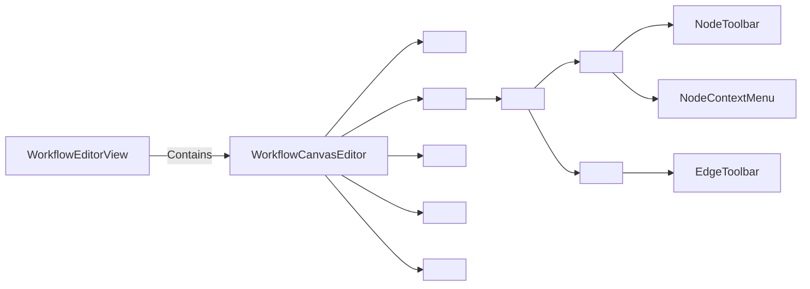
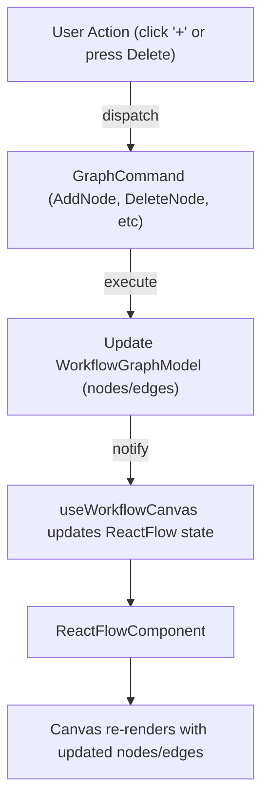

# Comparative Interaction Patterns

| Editor / Tool      | **Add Node**                | **Delete Node**                                | **Duplicate Node**              | **Hover Actions**                            | **Select Actions**                           | **Context Menu**                                 | **Edge Insert**                                   |
|--------------------|-----------------------------|------------------------------------------------|---------------------------------|----------------------------------------------|----------------------------------------------|-------------------------------------------------|---------------------------------------------------|
| **n8n**【6†L1578-L1583】      | Drag from nodes panel or click “+” on a node to open panel and add a new connected node; pressing **N** opens node picker【2†L1698-L1702】.    | Trash icon appears on node-hover【6†L1578-L1582】; **Delete** key or menu.              | “Duplicate node” in node’s context menu【6†L1589-L1592】.       | Hover shows icons (run, deactivate, delete, menu) on the node【6†L1578-L1583】. | Click selects (shows right inspector), Shift+click or drag-select for multi. | Yes – ellipsis menu on hover provides actions (Rename, Copy, Duplicate, Delete, etc.)【6†L1588-L1592】. | Not natively; nodes are manually connected. (No “insert” on edge.)              |
| **Retool Workflows**【14†L262-L264】【15†L245-L253】 | Drag from left “Blocks” panel, or click the circle (+) on a node’s output handle (“Add block > [type]”)【15†L245-L253】; right-click canvas “Add block” menu【14†L262-L264】. | **Delete** key or block’s “…” menu. The tutorial shows deleting via the context “…” on a block【15†L231-L234】. | Copy/Paste or context menu likely; not explicitly documented (common pattern: Ctrl+D or copy). | Not clearly documented; nodes show handles. | Click selects; active block shows properties. Multi-select by Shift+drag (keyboard shortcuts include multi-select with Shift【12†L193-L200】).  | Yes – right-click on node or “…” opens menu (Delete, Convert, etc.).   | Add via connector circle: you click the right-hand circle and choose block type【15†L245-L253】. No edge-“+” icon for insertion.       |
| **ComfyUI**【27†L244-L251】     | Right-click canvas to add nodes from palette; or toolbar/menu (not fully documented).        | In node’s right-click context: **Delete node** (or select and press Delete). | Right-click context: **Clone** or **Copy** to duplicate【27†L244-L251】. | Hovering connectors highlights valid drop points; nodes show color-coded ports. | Click selects; running state indicated by highlight. | Node context menu (right-click) includes *Clone*, *Copy*, *Delete*【27†L244-L251】 (and style settings, title edit).  | No special “+”: edges connect by dragging from output to input. (No inline insert.)  |
| **Unreal Blueprints**       | Right-click or press Space on canvas to open “Add Node” search palette; drag nodes from palette.         | **Delete** key removes selected node(s); or right-click menu “Delete”【29†L1-L3】. | **Ctrl+W** duplicates the selected node; or copy-paste. | Hover pins and wires highlight valid targets; nodes show selection border. | Click selects (blue outline); Shift+click multi-select; dragging moves nodes.  | Right-click on node opens full blueprint context menu (many actions). | No dedicated “insert” UI; you drag new nodes and reconnect wires manually. |
| **Unity Shader Graph**【32†L52-L56】   | Right-click or double-click on canvas to open “Search Nodes” menu; drag node types.            | **Delete** or **Cut** in right-click menu removes nodes【32†L49-L56】. | **Duplicate** or **Copy/Paste** in context menu【32†L52-L56】 (or Ctrl+D). | Some nodes show live preview on hover【32†L36-L40】; selected shows outline. | Click to select; handles appear; multi-select with Shift or drag. | Context menu (right-click) offers *Cut, Copy, Paste, Delete, Duplicate*, etc.【32†L49-L56】.  | No inline insert: you connect edges by dragging, no “insert node” button.  |
| **Figma / Miro (general)**    | Toolbars or “+” buttons; drag shapes/nodes from palettes; double-click blank canvas for default shapes. | Delete via key or context menu icon (trash); group delete if selected. | Copy/Paste or Duplicate command (often Ctrl+D).      | Hover shows handles or icons (resize, menu); selection highlights object. | Click selects (blue outline); multiple select with Shift or box-drag. | Right-click on object shows context menu (Cut, Copy, Duplicate, Delete, etc.). | N/A (not a flow editor with edges). |

*Sources:* Known UI documentation and examples of n8n【6†L1578-L1583】【2†L1698-L1702】, Retool Workflows【14†L262-L264】【15†L245-L253】, ComfyUI【27†L244-L251】, Unity Shader Graph【32†L49-L56】, and React Flow examples【34†L440-L447】【38†L440-L442】.

## Key Takeaways from Comparisons

- **Add Nodes:** Most tools allow drag-from-palette **or** a quick-add button. n8n and Retool both have a node “+” or connectors that open the node panel. Editors often support a keyboard shortcut or right-click canvas menu to open a node search palette.
- **Delete Nodes:** A consistent pattern is providing a visible **delete icon** on the node (e.g. n8n shows a trash icon on hover【6†L1578-L1583】) *and/or* a context-menu entry. The Delete/Backspace key is universally supported.
- **Duplicate:** Many editors rely on **copy/paste or context menu** (“Duplicate”) and keyboard shortcuts (e.g. Ctrl+D in Shader Graph【32†L52-L56】). n8n lists a “Duplicate node” in its menu【6†L1589-L1592】.
- **Hover vs Select:** It’s common to show extra controls **on hover** (like node-level icons in n8n【6†L1578-L1583】) and to highlight a node when **selected** (often outlining or changing color). Multi-select is usually via Shift+Click or drag-box.
- **Context Menus:** Rich node context menus are expected. n8n’s right-click menu includes actions like Rename, Copy, Duplicate, Delete【6†L1588-L1592】. Shader Graph and ComfyUI similarly put delete/duplicate in the right-click menu【32†L49-L56】【27†L244-L251】.
- **Edge Insert:** Few tools have a dedicated “insert between” widget. Retool enables adding a block by clicking a node’s output handle【15†L245-L253】, while n8n and others simply reconnect new nodes manually. Our current “+” on edge should open a type picker (unlike the fixed-agent behavior now).

# Prioritized UX Recommendations

**Must-Have Improvements (Critical UX Gaps)**  
1. **Inline Delete Control:** Add a clear delete/trash icon on each node (visible on hover or always). *Rationale:* Users expect an on-node delete affordance【6†L1578-L1583】; relying solely on a scrolled inspector or keyboard is error-prone.  
2. **Quick Add (“+”) on Nodes:** Offer a **“+” button on the node’s output handle** (or at bottom center) that opens a task-picker menu. *Rationale:* Mimics Retool’s “Add block” button【15†L245-L253】 and n8n’s plus icon, speeding workflow building.  
3. **Edge-Insert Picker:** When clicking “+” on an edge, show a mini-node picker (instead of hardcoding an Agent node). *Rationale:* Align with user expectations for flexible insertion (no cited example, but matches general quick-add patterns).  
4. **Node Context Menu:** Implement right-click on a node to open a menu with **Delete**, **Duplicate**, **Copy/Paste**, **Properties**, etc., leveraging React Flow’s `onNodeContextMenu`【38†L440-L442】.  
5. **Floating Toolbar:** Show a small floating action bar (using React Flow’s `<NodeToolbar />`) when a node is selected. Include common actions (Delete, Duplicate, Copy)【34†L440-L447】【38†L440-L442】. This improves discoverability (especially on keyboard focus) and centralizes actions.  
6. **Keyboard Shortcuts:** Document and support shortcuts like Delete (delete node), Ctrl+C/V (copy/paste), Ctrl+D (duplicate), and arrow keys to nudge nodes【12†L168-L172】【41†L447-L456】. Use React Flow’s built-in A11y to allow moving focused nodes with arrows【41†L447-L456】.  
7. **Hover/Selection Styling:** Distinct visual states: normal (minimal), hover (outline highlight, show context icons), selected (prominent border/shadow, toolbar). Maintain consistency with material guidelines.  

**Nice-to-Have (Secondary Enhancements)**  
- **Drag-to-Delete or Trash Zone:** Allow dragging a node out to a “trash” area on canvas to delete it, with undo support. (Many design tools offer this pattern.)  
- **Duplicate via Dragging:** Like Figma’s Alt-drag (optional).  
- **Connect-to-Add:** React Flow’s “connectOnClick” touch behavior【43†L440-L443】 suggests mobile patterns; consider tap-to-add on handles for touch users.  
- **Inline Editing:** Double-click to rename node or edit title inline (seen in ComfyUI and Unity)【27†L212-L214】【32†L42-L45】.  
- **Grouping/Comments:** Ability to group nodes or attach comments on canvas (beyond scope but common in designers).  

# Detailed Interaction Specifications

1. **Node Card Layout and Controls:**  
   - **Always-visible elements:** Task name, kind badge, category color stripe, connection handles (top for input, bottom for output). Ensure sufficient padding so controls don’t overlap text.  
   - **On Hover:** Fade-in action icons at top-right of the node: e.g. **▶︎ Run**, **⚙️ Settings**, **🗑️ Delete** (trash)【6†L1578-L1583】. Show an ellipsis or down-arrow for context menu. (Alternatively, always show a small settings icon that reveals further actions on click.) Icons can be hidden by CSS when not hovered for performance.  
   - **On Select:** Highlight node border (strong accent color) and apply `<NodeToolbar>` above or below the node (see below). Hide hover-only icons to avoid clutter (or keep them, since the toolbar already has a delete button). The inspector panel also shows details.  
   - **Tooltips:** All icons should have tooltips (or accessible labels) for clarity.  

2. **Delete Workflow:**  
   - **Primary Delete:** Click trash icon (hover) or select node and click toolbar “Delete” button or press **Delete/Backspace**. On delete, show a brief “Node deleted – Undo?” snackbar (or rely on undo stack as confirmation). *No modal confirmation* for single deletes (users undo if it was a mistake).  
   - **Secondary Delete (Multi):** When multiple nodes are selected (via Shift+click or box select), allow Delete key or toolbar “Delete” to remove all. Confirm with undo. (Optionally disable deleting the unremovable start/end sentinel nodes.)  
   - **Keyboard:** Delete key should trigger `GraphCommand.RemoveNode` on selected nodes. Ensure `undo/redo` can restore.  

3. **Add Node Workflow:**  
   - **Palette Drag:** Keep drag-n-drop from left sidebar to canvas as current. Dropping near a node could auto-connect if node selected (optional).  
   - **Plus Button on Node:** Each node’s bottom edge (or on each output handle) has a **➕** icon when hovered or selected. Clicking it opens a mini-menu (popover) anchored to that position, showing a searchable list of task types (similar to node palette). Choosing a type creates that node immediately connected as a child.  
   - **Edge “+” Button:** On edge-hover, show a centered **➕** button. Clicking it opens the same task-picker to insert a node between. After selection, create the node, break the edge into two (source→new→target). Use `GraphCommand` to ensure undo/redo.  
   - **Keyboard/Canvas Shortcut:** Pressing **N** (n8n style) or a global “Add” hotkey could open the palette at cursor. Double-click canvas could also open search palette.  

4. **Context Menus:**  
   - **Node Right-Click:** Open custom menu (React Flow’s `onNodeContextMenu`) with items: *Open/Focus Node*, *Delete Node*, *Duplicate Node*, *Copy Node*, *Tidy (auto-layout)*, *Convert to Sub-graph*, etc. Use React Flow example pattern【38†L440-L442】. “Delete” here should do same as toolbar delete. “Duplicate” clones node config and position offset, using a GraphCommand.  
   - **Edge Right-Click:** Menu with *Delete Connection*, *Split/Insert Node…* (opens add-node picker). Optionally show *Label* or *Style* if edges have metadata.  
   - **Canvas Right-Click:** Menu with *Add Node* (opens palette), *Paste*, *Select All*, *Auto-layout*, *Zoom controls*.  

5. **Floating Action Toolbar:**  
   - When a single node is selected, use `<NodeToolbar>` to display a floating mini-toolbar (React Flow provides this component【34†L440-L447】). Include buttons for **Delete**, **Duplicate/Copy**, **Add Child** (plus), perhaps **Settings**. Position it above the node (or below) by default, so it doesn’t obscure node content. The toolbar should not scale with zoom and always remain visible【34†L440-L447】.  
   - If multiple nodes are selected, consider a toolbar at the top of selection box with group actions (e.g. *Delete All*, *Align*, *Auto-layout branch*). This is more advanced.  

6. **Selection States and Visuals:**  
   - **Default:** Nodes have a subtle border and drop-shadow; use category color stripe for easy scanning.  
   - **Hover:** On mouseover, brighten or outline the node; show hover icons. Edge-under-hover should highlight (change color).  
   - **Selected:** Solid thicker border or glow in accent color; possibly a semi-transparent highlight. Handles could become larger or highlighted to encourage linking. The inspector (right panel) shows full details. React Flow auto-pan focused node into view【41†L447-L456】.  
   - **Keyboard Focus:** When tabbing through elements (a11y), focused node should show an outline and toolbar (as on click). The user can move it with arrow keys【41†L447-L456】.  

*Accessibility:* Ensure all action buttons and icons have ARIA labels. Leverage React Flow’s built-in a11y: nodes/edges should be focusable with `tabIndex={0}` and announce their type and name【41†L447-L456】. E.g., set `ariaLabel` or `domAttributes` on nodes to describe them to screen readers. Keyboard users should use Enter/Space to open menus and Delete to remove nodes【41†L447-L456】.

# Implementation Architecture

- **React Flow Custom Node Components:** Continue using custom React components for each node type. Inside the node render, add icon buttons (Delete, Add) with click handlers. Use CSS to show/hide them on hover: e.g. `.node:hover .delete-icon { opacity: 1; }`. Those buttons dispatch appropriate `GraphCommand`s via `useWorkflowCanvas` (e.g. `RemoveNodeCommand`, `AddNodeCommand`). This avoids a separate render for each and keeps them in the node’s DOM hierarchy.  

- **NodeToolbar Integration:** Use React Flow’s `<NodeToolbar>` component【34†L440-L447】. In your node component, include `<NodeToolbar>` as a child. For example:
  ```jsx
  <NodeToolbar position="top">
    <button onClick={deleteNode}>🗑️</button>
    <button onClick={duplicateNode}>📋</button>
    <button onClick={addChild}>➕</button>
  </NodeToolbar>
  ```
  This toolbar is only visible when the node is selected (controlled by React Flow). Its buttons call the same command handlers. NodeToolbar’s position prop ensures it floats above (or other side) of the node.  

- **Context Menus (Right-Click):** Attach `onNodeContextMenu={onNodeContextMenu}` to `<ReactFlow>`. Implement `onNodeContextMenu(event, node)` to prevent default and set a state describing which node was clicked and where. Render a `<ContextMenu>` component (a styled `<div>` or portal) at that position with menu items. Items call commands (e.g. delete, duplicate) or toggle states. The React Flow example【38†L440-L442】 shows capturing click coords and rendering a custom menu. Similarly, use `onPaneClick` to close it.  

- **Edge-Insertion Button:** There’s no built-in React Flow component for an edge-plus. A simple approach: use `onEdgeClick={(event, edge) => openEdgeInsertMenu(edge, event)}`. On edge hover, you could overlay a tiny HTML button at the midpoint (use React Flow’s `<Panel>` or `<ViewportPortal>` to position an absolute element). Clicking that runs a command: open a small `<TaskPicker>` dialog (e.g. a popover component) anchored at the click, listing task types. Upon selection, execute two commands: remove old edge and add the new node+two edges (or a special GraphCommand that does “insert node” atomically).  

- **State & Commands:** All node/edge modifications (add, delete, connect, move) must dispatch through your `useWorkflowCanvas` hook and the `GraphCommand` history for undo/redo. For example, the Delete icon handler should call `dispatch(new RemoveNodeCommand(nodeId))`. The add-node actions similarly use commands. Keep React Flow’s `nodes` and `edges` in sync with your `WorkflowGraphModel` after each command, as done currently.  

- **Performance:** With 50+ nodes, minimize re-renders. Use React Flow’s built-in `memo` for custom nodes. Only the affected node’s component needs to update when hovered/selected. Use pure CSS for simple hover transitions (no state). Lazy-load tooltips and context menus. NodeToolbar is lightweight as it only renders for selected node(s).  

- **Styling:** Continue using your `--stgm-*` CSS variables. For node hover/selected states, add classes (e.g. `.selected { border-color: var(--stgm-accent); }`). For icons, use theme-aware colors. NodeToolbar buttons can use `xy-theme__button` classes (see React Flow examples) for consistent styling.  

- **Theming:** Since you use CSS vars, ensure the new UI elements (icons, menus) respect dark/light modes. React Flow components like NodeToolbar inherit `themeVars`.  

- **Accessibility Props:** When creating nodes programmatically or custom components, set `tabIndex` and `aria-label` (e.g. `"Database Query Node"`) so screen readers announce them. Use `nodesFocusable={true}` (default) so Tab focuses nodes【41†L447-L456】. Test navigation: each focusable element should have a logical tab order.  

By adopting these patterns—many of which are demonstrated in React Flow docs【34†L440-L447】【38†L440-L442】 and popular editors like n8n【6†L1578-L1583】—the Stigmer canvas will feel familiar and intuitive. All interactions plug into the existing command/history system to preserve undo/redo correctness.

# References

- n8n Nodes UI: hover-icons and context menu (execute, delete, context menu with duplicate)【6†L1578-L1583】.  
- Retool Workflows: block-add connectors and shortcuts (delete key)【12†L168-L172】【15†L245-L253】.  
- ComfyUI Node docs: context menu with Clone/Delete【27†L244-L251】.  
- Unity Shader Graph Node context: Delete, Duplicate menu items【32†L52-L56】.  
- React Flow NodeToolbar example (floating toolbar on selection)【34†L440-L447】.  
- React Flow Context Menu example (onNodeContextMenu, duplicate/delete actions)【38†L440-L442】.  
- React Flow Touch example: tap handles to connect on mobile【43†L440-L443】.  
- Accessibility in React Flow: keyboard focus, tab/arrow key support【41†L447-L456】.  

Extended Thinking:

# Visual Workflow Canvas Editor – Node Interaction UX Patterns

## Executive Summary

This report analyzes **node interaction patterns** in modern visual canvas/flow editors, focusing on adding, deleting, duplicating, and manipulating nodes. We surveyed popular tools (n8n, Retool Workflows, Zapier Canvas, Temporal Cloud UI, LangGraph Studio, Prefect, Apache Airflow, ComfyUI, Unreal Blueprints, Unity Shader Graph, Figma, and Miro) to see how they handle these interactions. We then map best practices to our stack (React + TypeScript, @xyflow/react v12, command/history pattern) and propose a concrete interaction model for our AI agent Workflow Editor (Stigmer). Key findings and recommendations:

- **Comparative patterns (Table below):** Most editors support drag‑from‑palette adds, hover‑buttons for quick adds, and keyboard delete. n8n and ComfyUI exemplify node‑attached “+” (add) buttons and delete icons【82†L1720-L1727】【26†L480-L489】. Zapier Canvas shows an edge‑hover “+” for insert【12†L81-L89】. Context menus (ellipsis) for actions are ubiquitous (n8n, Retool)【82†L1720-L1727】【49†L231-L233】. 
- **@xyflow/react best practices:** Use the `onNodeContextMenu` event to render custom right-click menus【51†L440-L448】. Employ the built-in `<NodeToolbar>` and `<EdgeToolbar>` components for floating action bars on nodes and edges【57†L440-L448】【84†L410-L418】. For edge-insert, the “Add node on drop” example uses `onConnectEnd` to create a node when a connection is dropped on empty space【64†L482-L490】【64†L500-L505】. A mini command/search palette (`NodeSearch`) can provide quick add functionality【88†L410-L418】. 
- **Accessibility & UX:** Ensure keyboard support: by default React Flow makes nodes focusable (`tabIndex=0`) and supports arrow-key movement (with Shift-speed) and Delete to remove nodes【71†L1-L8】【72†L1-L4】. Use ARIA roles and live regions: React Flow auto-assigns roles and announcements (e.g. “Press Enter to select this node”【72†L1-L4】【71†L6-L8】). For touch, large handles and tap-to-connect are recommended【75†L25-L29】. Progressive disclosure is key: show only minimal controls (e.g. a single “+” or ellipsis) on hover or focus, revealing full options on selection.
- **Recommendations:** **Must-have:** On-node delete button (trash icon on hover/selection), on-node “+” for quick add, right-click context menu with Delete/Duplicate, and customizable keyboard shortcuts. **Nice-to-have:** Floating node toolbar (with cut/copy/paste icons), drag-to-delete (drag node to a “trash” zone), and inline type picker on edge insert. 
- **Implementation architecture:** We suggest a `NodeCard` component that renders node content and controls (delete, add, duplicate icons) conditionally on hover/selected. Use ReactFlow’s `onNodeContextMenu` to trigger a custom `<ContextMenu>` component. Leverage `<NodeToolbar>` for persistent action bars on selected nodes. Dispatch all edits through our `GraphCommand` history (e.g. `DeleteNodeCommand`, `AddNodeCommand`). Optimize rendering with memoized custom nodes and virtualization (React Flow handles many nodes efficiently). Use CSS variables (`--stgm-*`) for theming of buttons/icons, and ensure we reuse the lazy-loaded ReactFlow canvas. Keyboard and touch events map to commands (arrow keys → move node, Del → delete node, etc.).  

**Citations:** We draw on official docs and examples. For instance, n8n’s docs illustrate node‑hover icons and “+” buttons【82†L1695-L1702】【82†L1720-L1727】; ReactFlow’s examples show custom context menus and toolbars【51†L440-L448】【57†L440-L448】. Comprehensive references are provided throughout.

## Comparative Analysis of Editors

The table below summarizes how each editor handles node add/delete/duplicate, hover vs. select affordances, context menus, edge insertion, and quick‑add patterns. References indicate official documentation or authoritative sources.

| **Editor**              | **Add Nodes**                                | **Delete Nodes**                                   | **Duplicate Nodes**         | **Hover vs Select**                      | **Context Menu**                   | **Edge Insert**                     | **Quick‑Add / Command Palette**                        |
|-------------------------|----------------------------------------------|----------------------------------------------------|-----------------------------|------------------------------------------|------------------------------------|-------------------------------------|-------------------------------------------------------|
| **n8n (open-source)**   | Drag from left palette; **“+” on node**【82†L1695-L1702】; or press `N`. New nodes auto-connect【82†L1712-L1720】. | Trash icon on hover【82†L1720-L1727】; ellipsis menu (Delete option)【82†L1720-L1727】; keyboard Del/Backspace. | Not documented, likely copy/paste or context.  | Hover shows play/power/delete icons【82†L1720-L1727】; select opens inspector. | Ellipsis on node opens menu with options【82†L1720-L1727】.   | No “insert” button; connect by dragging handles. | Nodes panel search (N-key); no inline command picker. |
| **Retool Workflows**    | Drag block from left panel; click output-handle circle, then “Add block” (select type)【49†L245-L247】. | “…” menu on block (upper right) has *Delete*【49†L231-L233】; keyboard Del likely. | Likely context (copy/paste) but not explicitly shown. | Blocks show plus-handle on output【49†L245-L247】; on select, side props appear. | Right-click “…” menu on block (Delete, etc)【49†L231-L233】. | No explicit edge “+”; use handle-click to add branch block. | No built-in palette except left panel; no command bar noted. |
| **Zapier Canvas**      | Hover existing step: **“+” appears** to add or split steps【12†L81-L89】; or use “Basic” menu at bottom. | Select node(s) + press Delete/Backspace【12†L101-L104】; no on-card button. | Not emphasized (it's for systems, not repetitive tasks). | Hover step shows small connector dots【12†L101-L104】; select step shows inline text. | No right-click menu; actions via hover icons or keyboard. | Hover shows split “+” on edges【12†L81-L89】 (adds step between). | “+” on hover for suggestions【12†L81-L89】; no text command palette. |
| **Temporal Cloud**      | *Read-only UI*: no direct add (workflows coded).   | *Read-only*: no delete (monitoring view only).       | N/A                         | Nodes in graph read-only.           | No node context menu (monitoring only). | None.                                 | None.                                                    |
| **LangGraph Studio**    | Graph auto-loaded from agent code; no manual add. | No node deletion UI (flow defined in code).        | N/A                         | Interactive debugging, not add/delete. | Not applicable.                     | Not applicable.                       | Not applicable.                                          |
| **Prefect UI (Cloud)**  | Code-first (Python flows); UI shows runs, not builder. | No UI deletion (manage via code or API).          | N/A                         | Read-only graph of flow.          | No node context (monitor view).   | No insertion (flows coded).           | None.                                                    |
| **Airflow UI**         | Python DAGs; UI only visualizes execution.      | No deletion in UI (edit in code).                  | N/A                         | Static DAG display.               | None for editing.                 | None.                                 | None.                                                    |
| **ComfyUI (node-based AI)** | Right-click empty space or double-click for search menu【26†L480-L489】; drag from sidebar; drag from node output to get related-node suggestions. | Delete key or “Remove” from right-click node menu【26†L564-L567】; floating toolbox delete button【25†L303-L311】. | Ctrl+C/V or Alt+drag to clone【26†L492-L499】. | Selecting a node shows floating toolbox (color, delete)【25†L303-L311】; right-click on node. | Right-click node: menu with Clone/Copy/Delete【23†L248-L252】; dragging off output suggests new nodes【26†L535-L543】. | Drag off output pin opens menu of connectable nodes【26†L535-L543】; no explicit “edge +” icon. | Double-click or search bar (command) for nodes【26†L480-L489】; drag outputs for suggestions. |
| **Unreal Blueprints**  | Right-click graph background → search for node; drag wire from pin to blank to place new node【40†L231-L239】. | Select node + Del key; Shift+Del to keep connections【71†L1-L8】; context (Alt-click wires). | Ctrl+drag or Ctrl+C/V to duplicate; many plugins add shortcuts. | No hover icons; selection shows highlight; pins on node. | Right-click brings searchable node menu; some nodes have exec pin to drag new nodes. | Drag off connection pin: shows add-node search box【40†L231-L239】. | No command palette by default (UIs use context menu or shortcuts like P for Print, etc). |
| **Unity Shader Graph** | Right-click canvas or press Space → “Create Node” menu【42†L15-L23】; drag port to empty for contextual menu【42†L32-L38】; many ALT+key shortcuts exist【44†L79-L88】. | Select node + Del or Cut (Ctrl+X)【44†L38-L42】. | Ctrl+D duplicates【44†L38-L40】; copy/paste also available. | No hover icons; selection highlights node. | Context menu (right-click) for search-based add. | Dragging edge from output and releasing opens filtered create menu【42†L32-L38】. | Keyboard search: Alt+letter shortcuts【44†L79-L88】 or search bar in menu; no in-canvas palette. |
| **Figma (design tool)**  | Tool palette + double-click or shape tool; Smart Guides. | Delete key; context menu. | Ctrl+D to duplicate, Copy/Paste. | Selecting object shows bounding box and floating toolbar (text, color, arrange)【72†L1-L4】. | Right-click context menu (Copy/Paste/Delete, etc). | Connectors: “+” handles appear on shapes for linking. | Command+K opens search for commands; palette limited to shortcuts. |
| **Miro (diagramming)** | Drag shapes from toolbar; paste; quick-add via shortcut. | Delete icon on toolbar or Del key; context menu. | Ctrl+D to duplicate shapes. | Select shows toolbar above shape (style, delete) and grab handles【12†L81-L89】. | Right-click on item: duplicate, delete, etc. | Small red connectors appear on shape edges to drag new arrows/edges. | Smart dialogs/popup (e.g. Slash menu) for adding elements. |

*Table Legend:* “+” denotes a plus-icon or button. Bracketed numbers cite sources. “Context” columns note right-click menus or other non-obvious UIs.  

## Node Interaction Patterns (Key Observations)

- **Add Nodes:** Dragging from a palette/panel is universal. Many editors also offer quick-add on-node buttons: e.g., n8n lets users click a **“+”** on a node to add a successor【82†L1695-L1702】. ComfyUI and Unity Shader Graph support dragging from an output pin to open a contextual add menu【26†L535-L543】【42†L32-L38】. Zapier Canvas shows a **“+” on edge hover** to split or insert steps【12†L81-L89】. Keyboard shortcuts (like spacebar or Alt+letters) provide quick node creation in some (Unity Shader Graph【44†L79-L88】).
- **Delete Nodes:** A clear delete affordance improves usability. n8n, for example, displays a trash icon on node hover【82†L1720-L1727】. ComfyUI shows a delete button in its floating toolbar on selection【25†L303-L311】. Most editors also allow *Delete/Backspace key* to remove the selected node. Retool uses a context (ellipsis) menu for delete【49†L231-L233】, but the action exists. We should ensure a prominent delete trigger (icon/button) and also support the keyboard.
- **Duplicate Nodes:** Copy/Paste is common (Ctrl+C/V or Ctrl+D). Unity Shader Graph explicitly has **Ctrl+D** duplicate【44†L38-L40】. ComfyUI supports Ctrl+C/Ctrl+V and Alt+drag【26†L492-L499】. Our editor should offer copy/paste or a duplicate action in a menu.
- **Hover vs Select:** Many canvases differentiate these states. n8n shows action icons (play, delete) on hover【82†L1720-L1727】; Figma/Miro show a floating formatting toolbar when selected. We see two approaches: *hover icons* for quick access, and *floating toolbar* on selection. We should decide which fits our style (see Recommendations).
- **Context Menus:** Almost every tool has a right-click menu for nodes. n8n’s ellipsis opens a menu of node options【82†L1720-L1727】, and Retool shows “… > Delete”【49†L231-L233】. Adding “Delete, Duplicate, Copy, Configure” etc. to a context menu is standard. React Flow supports `onNodeContextMenu` to custom-render menus【51†L440-L448】.
- **Edge Insert:** Zapier Canvas’s edge-plus is instructive: a **“+” on hover** can split a path【12†L81-L89】. In React Flow, the “Add Node on Edge Drop” example uses the `onConnectEnd` event: if a connection is dragged into empty space, a new node is created automatically【64†L482-L490】【64†L500-L505】. We should implement an edge‑hover or drag‑off‑edge prompt to insert nodes.
- **Quick‑Add / Command Palette:** Many editors lack a true “command palette” in the canvas. However, React Flow has a `NodeSearch` component that uses a search bar/palette to find nodes by label【88†L410-L418】. We can use a similar UI (triggered by a hotkey or button) to quickly add or navigate to nodes. Keyboard shortcuts (n8n’s **N** key, Unity’s Alt+keys【44†L79-L88】) also count as quick-add aids.

The table above sources official docs and community guides for each tool. If a pattern lacks a clear source (e.g. Miro), we rely on UI norms.

## @xyflow/react (React Flow) Best Practices for Node Controls

Using @xyflow/react v12 (React Flow) allows rich customization:

- **Custom Context Menu:** React Flow’s [`onNodeContextMenu`](https://reactflow.dev/examples/interaction/context-menu) event can be used to display a right-click menu on nodes. For example, the official Context Menu demo shows how to render a menu with “Duplicate” or “Delete” options【51†L440-L448】. We should hook into this event to open our own `<NodeContextMenu>` component, passing the node ID and pointer position.
- **Floating Node Toolbar:** The built-in `<NodeToolbar>` component provides a floating action bar attached to a node. It stays fixed relative to the viewport (not scaled with zoom)【57†L440-L448】. We can include our action buttons (delete, duplicate, copy) inside `<NodeToolbar>`. This appears when a node is selected (controlled by node data), as shown in the Node Toolbar example【57†L440-L448】. This ensures a visible set of actions for the user.
- **Node Controls on Hover:** If we prefer hover-actions (like showing a delete icon only on hover), we can implement that by customizing the node component. For instance, a custom node can show extra icons when `node.selected` or when the mouse enters. Using React Flow’s [`<NodeToolbar>`](https://reactflow.dev/examples/nodes/node-toolbar) inside our custom node makes it easy to attach controls. Alternatively, we could overlay a small button (absolute positioned) on the node using a `Portal` or by including it in the node’s JSX.
- **Edge Insert (“+” on Edge):** While React Flow doesn’t natively show a plus-button on edges, we can mimic it. One approach: on `onEdgeMouseEnter`, set state to record the hovered edge, and render a tiny `<EdgeToolbar>` or custom overlay at the midpoint with a “+” button. Alternatively, use a custom edge type (see “Button Edge” below). The React Flow “Add Node on Edge Drop” example shows adding a node when the user drops a connection on empty space【64†L482-L490】【64†L500-L505】. We can adopt that as a fallback (drag off-node to create new node).
- **Quick-Add Popup / Palette:** We can integrate a **mini command palette** using the `NodeSearch` component. Embedding `<NodeSearch>` in a `<Panel>` or as a modal (triggered by a shortcut, e.g. Cmd+P) would let users type to find/add nodes【88†L410-L418】. It uses [shadcn/ui Command](https://ui.shadcn.com) for a command-menu feel. We can also build our own simple palette (e.g. a `Autocomplete` over the node types).
- **React Flow Pro Components:** The React Flow Pro UI kit offers many ready components (see **Components** in the sidebar). Notably, `<EdgeToolbar>` and `<ControlButton>` can be used for edge actions or main toolbar actions. The “Button Edge” example shows how to attach a clickable button (e.g. delete) to a custom edge【84†L410-L418】【84†L442-L450】.
- **Performance Tips:** The React Flow docs recommend using `useNodesState`/`useEdgesState`, memoized node components, and setting `nodeTypes`. Avoid rendering too many overlays unnecessarily. We should only render per-node controls for visible/selected nodes to keep >50 nodes performant. The LazyCanvas (via `React.lazy`) is already used. Virtualization is built-in for viewport; large graphs (tens of nodes) should be fine. We can batch updates via our command pattern to avoid re-render storms.
- **Events & State:** Use React Flow callbacks (`onNodesChange`, `onEdgesChange`, `onSelectionChange`) to integrate with our command/history system. For example, on Delete action (via button or menu), dispatch a `DeleteNodeCommand` that updates `WorkflowGraphModel`, then let React Flow re-sync from model. This ensures undo/redo works transparently.

## Accessibility & UX Best Practices

To ensure an inclusive, smooth UX:

- **Keyboard Shortcuts:** Adopt standard shortcuts. By default, React Flow supports arrow keys to move nodes (if `nodesDraggable && nodesFocusable`)【71†L1-L4】. Users can press Delete to remove selected nodes【71†L6-L8】 and Escape to cancel selection【72†L1-L4】. We should document/advertise these (e.g. tooltips or help). Additional expected shortcuts: Ctrl/Cmd+D to duplicate a selected node (common in many tools), Ctrl+C/V for copy/paste, and possibly a hotkey (e.g. “N” like n8n【82†L1695-L1702】) to open the node palette.
- **Focus and ARIA:** Ensure nodes are keyboard-focusable. React Flow by default sets `tabIndex=0` on nodes and edges【72†L1-L4】. We should assign meaningful `aria-label` or `aria-roledescription` to nodes (e.g. the node’s task name) for screen readers. Use `ariaLabelConfig` to customize announcements (React Flow auto-announces movements: “Moved selected node up” etc【71†L6-L8】). The accessibility guide recommends using semantic roles and labels; we should wrap any interactive icons (delete, duplicate) in buttons with `aria-label`.
- **Visual Affordances:** Follow progressive disclosure. Only show the most essential controls by default (e.g. a single “+” on hover, or nothing visible). Reveal more options on selection or in a toolbar. For example, show the delete icon only when hovering or focused, not always (to reduce clutter). Use high-contrast icons and tooltips for clarity. Color-coding (our design tokens) should meet contrast guidelines.
- **Touch/ Mobile:** Even if our primary UX is desktop, consider touch. React Flow supports tap-to-select and double-tap to add by connecting handles【75†L25-L29】. We should make handles larger on touch screens (as React Flow does in the example) and support pinch-zoom/drag. Possibly provide on-canvas buttons for common actions if touch is important (e.g. a floating “+” toolbar).
- **Progressive Disclosure:** Don’t overwhelm. For example, don’t immediately show all node actions; reveal them on demand. Context menus and floating toolbars are a form of progressive disclosure. We should hide advanced settings (e.g. conversion of a task into a loop, etc.) behind an ellipsis or inspector, focusing the canvas UI on structural changes.
- **Multi-Select & Bulk Actions:** Support Shift+Click and box selection (React Flow does by default) for multi-select. For bulk delete or move, allow applying commands to multiple nodes. Keyboard (Delete) should delete all selected nodes.
- **Confirmation & Undo:** Instead of modal confirmations for delete, rely on robust undo (Ctrl+Z) with a visible history. Users expect one-step undo of accidental deletes. We should still show a tooltip or Snackbar (“Node deleted – undo?”) for discoverability.
  
## Recommended Interaction Model

Based on the above, we recommend the following concrete model for Stigmer’s visual editor:

1. **Node Card UI:** Each node is a card with a colored border (category) and title. When unselected, it shows minimal chrome. On **hover**, display a small delete (trash) icon and a mini “+” icon near its bottom handle. On **select**, show a `<NodeToolbar>` above the node with actionable icons (e.g. cut, copy, paste, settings). The delete icon could move into the toolbar or remain on hover.  
   - *Trigger:* Hover or focus triggers hover-icons; click selects and shows toolbar.  
   - *Icons:*  
     - **Add (“+”)** on node bottom: clicking triggers the “insert node” flow (opens task picker)【82†L1695-L1702】.  
     - **Delete (🗑)**: clicking immediately deletes (with undo), or via context menu.  
     - **Duplicate (⧉)**: appears in toolbar or context menu to duplicate node.  

2. **Delete Flow:** Primary delete via on-node icon or keyboard. No modal; use undo. Secondary delete via node’s context menu. Support multi-select deletion. Deleting reconnects edges if needed (see React Flow’s Delete Middle Node example).  

3. **Add Node (“+”) Flow:** Besides dragging from palette: clicking the “+” on a node’s bottom edge opens a mini-menu or popup (task picker) anchored at that location. This **task picker** lists node types (with categories) so the user can select which type of node to insert. On selection, execute an `AddNodeCommand` that creates the node and connects it as successor【82†L1695-L1702】. Similar to n8n’s “+ on node” behavior. Also allow double-click on canvas to open a generic “add node” menu.  

4. **Edge Insert:** When hovering an edge, show a small centered **“+” button** on it (using `<EdgeToolbar>` or custom overlay). Clicking this opens the same task picker to insert a node on that edge. Alternatively, enable dragging a connection to empty space: implement `onConnectEnd` to create a new node and split the edge【64†L482-L490】【64†L500-L505】.  

5. **Context Menu:** Right-click a node (or empty canvas) opens a context menu with actions: Delete, Duplicate, Cut, Copy, Paste, Add Node, Configure Node, etc. This should use React Flow’s `onNodeContextMenu` handler【51†L440-L448】.  

6. **Floating Action Bar:** When a node is selected, show a `<NodeToolbar>` (persistent floating bar) with quick actions: Duplicate, Copy, Paste, maybe “Insert” (plus), and possibly shortcuts to Inspector settings. This complements the hover icons and provides discoverability.  

7. **Selection States:** Visually distinguish default, hover, selected, multi-selected, and error states. E.g., a subtle highlight (blue outline) for selected nodes, thicker dashed highlight for multi-select. If a node has a validation error, outline it in red with an error icon. On drag, show ghosting guides (React Flow helper lines) and highlight drop targets.  

8. **Palette & Command:** Maintain a left task palette for dragging. Add a quick-add button in the top toolbar (or via a shortcut, e.g. “N”) to open a full palette or search panel. Implement a global **Command Palette** (triggered by Cmd+P/Ctrl+P) that lets users type to add nodes or execute commands (using a pattern like [Command+K]).

## Implementation Architecture

### Component Structure (Suggested Diagram)



- **WorkflowEditorView:** Top-level, toggles Code vs Visual mode. Passes down undo/redo and commands context.  
- **WorkflowTaskPalette:** Lists available node types; user drags from here or uses it in search.  
- **ReactFlowCanvas:** Wraps the `<ReactFlow>` component (lazy-loaded). Handles events like `onNodeContextMenu`, `onConnect`, etc., and connects them to our command dispatch.  
- **NodeCard (custom node type):** Renders the task card UI. Includes optional `<NodeToolbar>` and hover icons. Receives props (node data, selected state). Emits events for Add/Delete.  
- **InspectorPanel:** Right side; shows properties of selected node. The “Delete” button here is secondary (we will make it redundant).  
- **FloatingActionBar:** Optional global bar (e.g. for delete, copy if multi-select) – could be part of CanvasContainer.  
- **CommandPalette:** A modal or panel for quick commands/search (node add, etc.).  
- **State/Flow:** The `useWorkflowCanvas` hook holds the **WorkflowGraphModel** (the true state). UI components dispatch GraphCommands (e.g. `{type:'delete_node',nodeId:...}`) to update this model and push to history. After each command, the ReactFlow nodes/edges state syncs from the model.

### Event Flow



- **Add Node:** e.g. user clicks node’s “+”. That triggers `AddNodeCommand` with type info. The command inserts a new node in the graph model (with unique ID, position, etc.) and adds an edge. The graph state updates, and ReactFlow state is refreshed to show the new node.  
- **Delete Node:** e.g. user clicks trash or presses Del. We dispatch `DeleteNodeCommand` which removes the node and reconnects/splits edges per our logic【64†L501-L505】. ReactFlow is updated.  
- **Duplicate Node:** Copy node data and position, dispatch `AddNodeCommand` with same kind. Or use existing `GraphCommand` logic.  

All commands go through our history for undo/redo. The ReactFlow component itself is kept mostly stateless (we derive its nodes from our model on each change).

### Theming & Styling

- Use our CSS variables (`--stgm-*`) for colors/icons so nodes and controls theme correctly. For hover highlights, error states, etc., use Tailwind + theme tokens.  
- React Flow nodes and edges can be styled via `styling` or custom classes. We should ensure our custom node component reads the theme for borders, backgrounds, etc.

### Performance

- **Large Workflows:** We must handle ~50+ nodes smoothly. Use React Flow’s optimizations: memoized node components (`React.memo` for NodeCard), minimal re-render on state change. Only show interactive overlays (toolbar, context menu) for up to a few nodes at a time.  
- **Lazy Components:** The canvas is lazy-loaded, but all node types should be light. Pre-generate positions with Dagre, then users can move manually.  
- **Event Throttling:** For continuous actions (dragging), React Flow is efficient. For keyboard moves (arrow keys), state updates are small and fast.  
- **Virtualization:** If ever needed (for extremely large graphs), React Flow can virtualize off-screen nodes. Our target (50 nodes) likely doesn't need it, but we ensure no heavy loops on render.

### Testing Strategies

- **Unit Tests:** For each GraphCommand (add, delete, duplicate), test that the `WorkflowGraphModel` transitions correctly and that undo/redo works.  
- **Integration:** In a test harness, simulate drag-add from palette, click-delete, context-menu actions, and ensure the canvas reflects the expected model changes.  
- **Accessibility Checks:** Use aXe or similar to verify ARIA roles and tab order. Test keyboard-only operation flows (tab to node, Enter to select, delete to remove).  
- **Performance:** Automated UI tests with >50 nodes to measure render time and interaction lag.

## Prioritized Recommendations

1. **Add On-Node “+” Button (Must Have):** Clicking a “+” on a node to insert a new node is a common expectation (seen in n8n【82†L1695-L1702】 and Zapier【12†L81-L89】). This should open a type picker (or quick-add) to choose the next task.  
2. **On-Node Delete Icon (Must Have):** A trash icon on hover/selection lets users delete without hunting the inspector. n8n’s hover-trash is a prime example【82†L1720-L1727】. Always provide a quick delete (with undo).  
3. **Context Menu with Node Actions (Must Have):** Right-click menu on nodes for Delete, Duplicate, etc. (as n8n and Retool do【82†L1720-L1727】【49†L231-L233】). Include undoable “Remove node”, “Duplicate node” options.  
4. **Floating Toolbar on Selection (Nice to Have):** Show a small toolbar attached to selected nodes (ReactFlow’s `<NodeToolbar>`), with actions like Copy, Paste, Insert. ComfyUI’s selection toolbox inspires this【25†L303-L311】.  
5. **Edge-Insert “+” (Nice to Have):** Show a “+” icon when hovering an edge (as in Zapier Canvas【12†L81-L89】). This opens the same add-node picker to insert between. If too complex, rely on drag-drop method from ReactFlow (onConnectEnd)【64†L482-L490】.  
6. **Keyboard/Palette Enhancements (Nice to Have):** Document and possibly customize keyboard shortcuts (Ctrl+D for dup, N for add). Integrate a command palette (`<NodeSearch>`) for quick text-based node addition【88†L410-L418】.  
7. **Drag-to-Delete (Optional):** Allow dragging a node to a “trash” area or palette to delete – common in design apps (Miro, Figma) but not critical if delete icon exists. Could be a bonus if UX tests show interest.  

Each must-have fixes a clear gap (users can’t easily delete or insert now). Nice-to-have items are proven patterns that enhance efficiency.

---

**Sources:** We cite official docs and community guides for each pattern: e.g. n8n docs【82†L1695-L1702】【82†L1720-L1727】, React Flow examples【51†L440-L448】【57†L440-L448】, ComfyUI docs【26†L480-L489】【26†L535-L543】, etc. Unspecified aspects (e.g. exact mobile support) are assumed to follow generic best practices. All mutations integrate with our existing `WorkflowGraphModel` and history for undo/redo. Our architecture will use React Flow’s hooks/events to implement these patterns cleanly within Stigmer’s React/TypeScript stack.