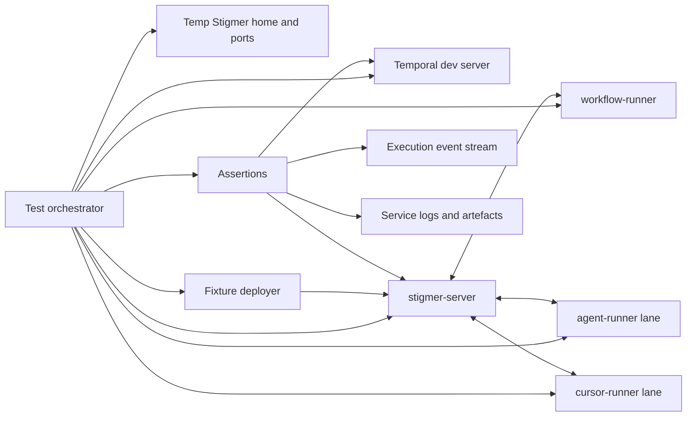
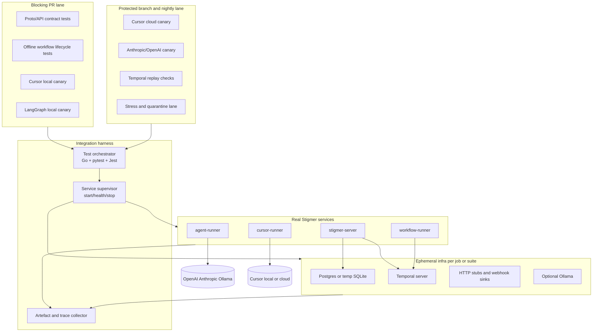
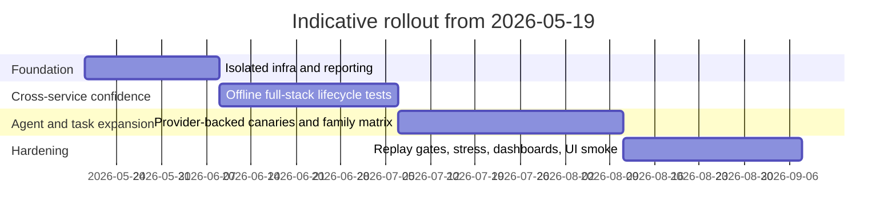

# End-to-End Integration Testing Strategy for Stigmer

## Executive recommendation

The strongest pattern for Stigmer is a **layered test pyramid with a very small provider-backed apex**: keep most confidence in deterministic integration tests that run your real control plane, real Temporal worker, and one harness at a time inside an isolated environment, then add a tiny number of expensive canaries for Cursor, Anthropic, OpenAI, and Ollama. That recommendation matches what the closest workflow platforms do in practice: Temporal explicitly recommends that most tests be integration tests; Prefect ships an ephemeral test harness around a temporary database and subprocess server; Airflow runs integration tests in a containerised CI environment and separates them from unit and system tests; n8n exposes dedicated integration and Testcontainers-backed database lanes; Dagster steers most tests to in-process execution and uses persistent instances only where out-of-process semantics matter. citeturn26view2turn8view0turn27view1turn21view0turn23view0

For Stigmer specifically, the immediate design change should be to **stop coupling tests to `~/.stigmer/stigmer.db` and the developer’s home directory**. Instead, each suite should start with a temporary Stigmer home, explicit ports, explicit Temporal namespace, and process-scoped logs. Prefect’s public guidance is especially relevant here: it defaults to a session-scoped harness against a temporary database for speed, then switches to function-scoped isolation only for tests that truly require a clean store. That is the right trade-off for your current maturity level as well. citeturn25view2turn25view1

The most valuable near-term addition is **not** “cover all task kinds”. It is a narrow set of end-to-end execution tests that prove the pipeline actually works: `stigmer-server` accepting definitions, `workflow-runner` progressing execution, a harness completing work, events streaming back, and the final execution state being correct. Temporal’s own documentation strongly supports this focus by recommending integration-heavy testing and by recommending event-history replay in CI to catch workflow compatibility problems before deploy. citeturn26view2turn7view3

## What comparable platforms actually do

| Platform | Test framework | Isolation strategy | Mocking approach | CI infrastructure | Execution model | Flakiness handling |
|---|---|---|---|---|---|---|
| **Temporal** | Go SDK `testsuite`, commonly with `testify/suite`. | New `TestWorkflowEnvironment` per test; dev server helper can start a fresh Temporal CLI dev server, bind a free port, and use a distinct SQLite DB file. | Mock or override Activities and Nexus operations for workflow-level tests; use real Worker + Client for end-to-end or higher-fidelity integration tests. | SDK includes a helper to download/start a dev server; docs also recommend replaying representative workflow histories in CI. | Clear split between unit, integration, end-to-end, and replay-based determinism checks. | Time-skipping test server reduces timer/retry flake; Temporal recommends separate test-server instances or serial execution when time behaviour differs. citeturn26view0turn26view2turn7view2turn7view3 |
| **Airflow** | `pytest` throughout. | Integration tests run inside the Breeze environment with extra Docker images; DB-heavy test types get exclusive DB/container access and are run sequentially within type. | Unit tests mock external comms; integration tests use real sidecar services and explicitly avoid calling external internet APIs. | Breeze plus Docker Compose; Airflow also runs Docker Compose quick-start tests in CI. | Separate lanes for unit, integration, system, docker-compose, Kubernetes, task-SDK integration, and `airflowctl` integration. | Public docs include a quarantined test lane and guidance to mock sleep/time aggressively in unit tests. citeturn5view1turn27view0turn27view1turn4view4turn6view1 |
| **Prefect** | `pytest` with `prefect_test_harness`. | Temporary SQLite DB, random-port subprocess API server, session-scoped harness by default, function-scoped harness for tests that need a fully clean DB, and one harness per xdist worker. | Fast unit tests can call `.fn()` to bypass the engine; integration tests run through the real engine path. | Public repo exposes an `integration-tests` directory and workflow; local guidance centres on ephemeral API+DB harnesses. | Harness runs the same production code paths for state transitions, persistence, and API interaction. | Docs explicitly address stale state, slow CI startup, random-port conflicts, worker-local harnesses, and cleanup of event/log workers. citeturn8view0turn8view2turn25view0turn25view1turn19search1 |
| **n8n** | Jest. | Separate SQLite and Postgres integration modes; Postgres Testcontainers service starts a disposable database with explicit credentials and host aliases; scripts also use schema/table-prefix isolation. | Publicly surfaced sources show backend test utilities and DB-focused integration modes; external API mocking is less prominently documented in the surfaced primary sources. | Package scripts expose `test:integration`, `test:postgres`, and Testcontainers-backed `test:postgres:tc` lanes. | Dedicated integration tests under `packages/cli/test/integration`, plus migration lanes across DB backends. | Public primary sources do not surface a formal quarantine policy in the same way as Airflow; environment flake is nevertheless reduced through disposable DB containers and isolated schema/table prefixes. This last point is an inference from the published test layout. citeturn21view0turn21view1turn21view2turn22view2turn20view2 |
| **Dagster** | `pytest`, plus Dagster execution APIs. | `execute_in_process()` uses an ephemeral instance by default; `instance_for_test()` creates a temporary persistent instance and overrides `DAGSTER_HOME`; `execute_job()` requires a persistent instance. | Most tests should use direct invocation or in-process execution; out-of-process execution is reserved for the small set of behaviours that need it. | Repo exposes substantial execution tests; docs focus on `execute_in_process`, `execute_job`, `ReexecutionOptions`, and `instance_for_test`. | Strong split between in-process job tests and persistent-instance reexecution/out-of-process tests. | Public docs reduce flake surface by recommending in-process tests for most cases and reserving persistent/out-of-process execution for where semantics require it. citeturn23view0turn6view3turn10search2 |
| **LangGraph** | `pytest`. | Fresh graph construction and fresh checkpointer per test. | Test full graph invocation, individual nodes, edges, and partial execution. | Straightforward Python test setup; repo also includes extensive library tests. | State-machine/graph execution compiled anew per test. | Docs explicitly recommend a fresh checkpointer and fresh graph compilation per test to avoid leaking state across cases. citeturn28view0turn28view1 |

The pattern that emerges is consistent. Mature orchestrators do **not** try to make every test a full internet-connected, provider-backed system test. They isolate state aggressively, keep the bulk of the suite deterministic, and reserve real external calls for a narrow lane. Airflow and n8n show the containerised-service side of this; Prefect shows the “ephemeral local backend” side; Temporal and Dagster show the “run most logic in embedded or dev-server test environments” side. citeturn5view1turn8view0turn26view0turn23view0turn22view2

Referenceable public examples you can borrow from directly include Temporal’s `testsuite` package and workflow test suite sources, Airflow’s integration test docs and E2E `conftest.py`, Prefect’s `prefect_test_harness` utilities and `integration-tests/` tree, n8n’s `packages/cli/test/integration` and Testcontainers Postgres service, Dagster’s `dagster_tests/execution_tests`, and LangGraph’s test guidance and test modules. citeturn26view0turn19search4turn5view1turn6view1turn6view0turn19search1turn20view2turn22view2turn6view3turn28view0turn28view1

## Recommended test architecture for Stigmer

The right architecture is a **hybrid of process-managed services and programmatic infra**:



This closely follows the patterns in Temporal, Prefect, Airflow, and n8n: use a purpose-built isolated environment under test control, not a manually pre-started developer stack. Temporal’s SDK can start a dev server programmatically; Prefect spins a temporary DB and subprocess API server; n8n uses Testcontainers for real service dependencies; Airflow uses a dedicated containerised test environment rather than the developer’s ordinary process tree. citeturn26view0turn25view1turn22view2turn5view1

### Recommended test layers

I would organise the suite into four layers.

**Deterministic component tests** should sit closest to code. Use Temporal `TestWorkflowEnvironment` for workflow-runner internals, LangGraph node/graph tests with a fresh checkpointer for `agent-runner`, and pure TypeScript unit tests for `cursor-runner` protocol adaptation. This is where you use mocks heavily and where time-skipping belongs. Temporal and LangGraph both explicitly support this style. citeturn26view2turn28view0

**Service contract tests** should validate your gRPC and Connect boundaries. Start `stigmer-server` alone and hit real API surfaces from Go, TypeScript, and Python clients; assert schema, status codes, pagination, and streaming semantics. These tests should not require Temporal or a harness unless the contract itself depends on them. This is the layer where SDK compatibility gets protected cheaply. Airflow’s split between API/core/integration lanes and Dagster’s split between in-process and execution APIs are good analogues. citeturn27view0turn23view0

**Slice integration tests** should be the main body of new work. Each slice starts a temporary Stigmer home, a Temporal dev server, `stigmer-server`, `workflow-runner`, and exactly **one** runner under test. This gives you high confidence in cross-service communication while keeping diagnosis simple. Prefer this layer for almost all task-kind coverage. Temporal explicitly recommends making the majority of tests integration tests, and Prefect’s session-scoped harness guidance is a good model for keeping this layer fast enough for CI. citeturn26view2turn25view2

**Provider-backed canaries** should be tiny and expensive. Run a handful of real-provider cases against Cursor, Anthropic, OpenAI, and optionally Ollama. Keep them out of the blocking PR path unless the PR is trusted and cost-approved. This is the apex of the pyramid, not the base. Cursor’s SDK documentation is explicit that the SDK uses real pricing and that usage appears in the team usage dashboard under the SDK tag, which is exactly why this tier must stay small. citeturn16view0

### Isolation model

Use **suite-scoped isolation by default**, not per-test environment creation. Prefect’s docs are blunt that a clean DB per test creates significant overhead, and they recommend session scope unless tests truly interfere with one another. Stigmer should do the same: give each suite a fresh temp root, then use project IDs, workflow IDs, and execution IDs prefixed with the test name inside that suite. Only a small subset of tests should ask for a function-scoped environment. citeturn25view2turn25view1

Concretely, each suite should create:

- a temporary Stigmer home directory;
- a dedicated SQLite file path or explicit DB path override;
- a dedicated Temporal namespace or, if that is operationally awkward, distinct workflow ID prefixes per suite;
- dedicated log files per service; and
- explicit free ports so parallel workers do not collide.

Temporal’s docs also note that time-skipping behaviour is global to a `TestWorkflowEnvironment` instance and recommend separate instances or serial execution when time semantics differ, which is a good reason to keep “time-skipping lower-level tests” separate from “real full-stack execution tests”. citeturn26view2

### Programmatic infra versus Docker Compose

For CI, prefer **programmatic infra** over a monolithic Compose file:

- use **Temporal’s dev server helper** for Temporal;
- use **Testcontainers-Go** for optional infra such as Postgres, Redis, webhook receivers, or notification sinks;
- start Stigmer services as child processes under the test harness so you can capture logs and lifecycles precisely.

Use Docker Compose only for local developer smoke tests and documentation parity. Airflow is a good precedent here: it separately tests its Docker Compose quick-start, rather than making Compose the foundation of every integration test. n8n is a good precedent for Testcontainers-backed real-service dependencies. Testcontainers’ own guidance is that it exists to run tests against real services without pre-provisioned infrastructure, with definition and cleanup controlled by the test code itself. citeturn4view4turn22view2turn38search1turn38search0

### Task-kind coverage strategy

Do not create nineteen unrelated end-to-end tests first. Instead, test task kinds as **families**:

| Family | Stigmer task kinds | Preferred assertion style |
|---|---|---|
| Data and control flow | `set`, `transform`, `extract`, `validate`, `switch_case`, `for_each`, `fork`, `sleep`, `emit_event` | Assert event sequence, final context schema, branch choice, and deterministic outputs. |
| External I/O | `http_call`, `notification`, `listen`, `llm_call` | Use local stub servers or fabricated event inputs in deterministic suites; reserve real internet calls for canaries. |
| Agent orchestration | `agent_call`, multi-agent chains, workflow-calls-agent compositions | Assert lifecycle phases, child execution records, and returned structured payloads, not narrator text. |
| Recovery semantics | `try_catch`, `raise_error`, retry, timeout, cancellation | Assert retry counts, failure classification, compensation path, and final terminal phase. |
| Human and budget gates | `human_input`, `budget_guard` | Assert pause/resume behaviour, approval audit trail, and blocked-over-budget semantics. |

That family model borrows from Temporal’s workflow/activity split, Dagster’s explicit reexecution testing, and LangGraph’s node/partial-execution model: test the orchestration semantics first, then a small number of composition workflows that prove the pieces work together. citeturn7view2turn23view0turn28view0

### Execution lifecycle and HITL

For asynchronous lifecycle tests, prefer **event-driven assertions** over blind polling. Subscribe to the workflow execution event stream and assert the expected sequence of durable states; keep polling as a failure-safe fallback with generous `eventually` windows. Temporal’s testing guidance is important here: avoid waiting real time when you can time-skip in lower layers, and use real workflow histories plus replay in CI for compatibility checks. citeturn26view2turn7view3

For `human_input`, automate the “human” through the same API surface your product uses, not through UI automation. Temporal’s HITL examples use signals to inject approvals into a waiting workflow, and LangGraph’s interrupt model pauses execution until an external resume action occurs. Stigmer should mirror that pattern: a test should create a workflow, assert it reached the waiting state, submit a synthetic approval payload through the workflow-execution API, and then assert correct resumption and completion. citeturn39search0turn39search1turn39search17

A final recommendation that is especially valuable for Stigmer’s Temporal layer is to add a **workflow replay CI job**. Temporal explicitly recommends collecting representative event histories from recent executions and replaying them in CI to fail fast on non-deterministic workflow-definition changes. For workflow-runner changes, this will catch a whole class of regressions that ordinary integration tests may miss. citeturn7view3

## Using Cursor as the integration test executor

Cursor is a good fit for the **topmost, sparse canary layer**, not for the full breadth of the suite. The Cursor SDK is now the official programmatic interface for running Cursor agents; it supports local and cloud runtimes behind the same API, requires a `CURSOR_API_KEY`, streams normalised SDK events, and exposes agent/run concepts directly. It also states that SDK spend appears in the Cursor usage dashboard under the SDK tag, which makes it practical to govern a tiny number of real runs in CI. citeturn16view0turn15view3

### How to use it profitably

Use **one-shot, side-effect-focused tasks**. A Cursor-backed integration test should not ask the agent to “figure something out”. It should ask for a deterministic side effect that proves the full stack worked. Good examples are:

- create a file with an exact payload;
- write a JSON document that matches a fixed schema;
- invoke a purpose-built test MCP tool or shell command and persist its result;
- modify a known workspace file in a pre-agreed way.

These are not glamorous prompts, but they are testable prompts. Cursor’s SDK exposes run streaming, including assistant output, thinking/status events, and tool-call events, and cloud agents can list and download artefacts. That allows you to verify both **behaviour** and **observable evidence** without relying on free-form prose matching. citeturn16view0

### Recommended assertion pattern

For every Cursor-backed test, assert three things in order:

1. **Stigmer orchestration behaviour**: execution created, moved through expected phases, and reached the correct terminal state.
2. **Agent side effect**: expected file, JSON, artefact, or command output exists and is exact.
3. **Usage telemetry**: your `cursor-runner` should record non-zero usage and attach the Cursor run identifier so you can reconcile cost later. Cursor’s usage dashboard provides the independent control-plane view under the SDK tag. citeturn16view0

The critical discipline is this: **never assert on the natural-language answer unless the test is explicitly about natural-language formatting**. Assert on files, schemas, state transitions, and audit trails.

### Local versus cloud runtime

For Stigmer, use the Cursor **local runtime first** in CI smoke tests because it runs against the checked-out working tree and is easier to verify through filesystem side effects. Use **cloud runtime** only when you specifically need isolated VMs, remote repo cloning, or more parallel agent capacity. Cursor’s runtime table makes that trade-off explicit, and it also notes that cloud agents support short-lived session environment variables encrypted at rest and deleted with the agent. citeturn16view0

### Cost and reliability controls

Cost discipline should be built into the test design:

- keep the Cursor lane to **one to three canaries** in the blocking path;
- give each test **one prompt** and one clear stop condition;
- run the provider-backed suite behind a GitHub Actions **concurrency group** so only one expensive lane runs per branch at a time;
- cancel runs aggressively on timeout;
- schedule the broader provider-backed lane on `main` and nightly rather than on every PR.

GitHub Actions supports workflow/job concurrency groups, and Cursor’s SDK spend is visible in the usage dashboard, so you have both a scheduling control and an accounting control available. citeturn35view6turn16view0

### A practical pattern for minimal Cursor canaries

Use exactly three canaries:

| Canary | Purpose | Pass condition |
|---|---|---|
| **File write** | Prove server → Temporal → workflow-runner → cursor-runner → Cursor agent → result callback works. | File or artefact exists with exact expected content. |
| **Structured JSON** | Prove the agent can complete a non-trivial but deterministic transform. | JSON validates against a fixed schema and is returned to Stigmer. |
| **Failure path** | Prove timeout/cancellation/error propagation works. | Workflow terminates in the correct failure phase with preserved audit detail. |

That is enough to validate the Cursor harness end to end without turning CI into an agent benchmark.

## CI infrastructure and Planton-managed secrets

GitHub Actions gives you the primitives you need: repository, organisation, and environment secrets; service containers; self-hosted runners; larger runners; OIDC-based short-lived auth; job outputs; and job summaries. The central design question is therefore not “can GitHub Actions do this?” but “what should be long-lived, and what should be fetched just in time?”. GitHub’s own docs recommend environment protections for workflows using environments or OIDC, and they emphasise that secrets are only readable when explicitly included in a workflow. citeturn35view0turn35view1turn35view3

### Recommended secret model

Use a **two-tier model**.

For the deterministic suite, use **no external provider secrets at all**.

For the provider-backed suite, use a protected GitHub Actions **environment**, for example `provider-integration`, containing either:

- a **single bootstrap credential** that lets the workflow authenticate to Planton and fetch the needed secrets at runtime; or, preferably,
- an **OIDC trust relationship** from GitHub Actions to the backend that Planton or its underlying secret store uses, so the workflow exchanges a GitHub OIDC token for a short-lived access token and then fetches the required secrets.

GitHub’s OIDC documentation explicitly describes this short-lived exchange pattern and the required `id-token: write` permission. citeturn35view1

Because you already fetch secrets via the Planton CLI, the practical short-term implementation is straightforward: do **not** copy every provider key into GitHub Secrets. Keep one bootstrap path into Planton, then fetch only the exact entries required for the selected test lane, just before execution. That keeps rotation centralised in Planton and reduces GitHub-side secret sprawl. This recommendation is based on the Planton usage pattern you described and on GitHub’s environment/secret model. citeturn35view0turn35view2turn35view3

### Recommended workflow split

You should split CI into three jobs:

- **offline integration** on every internal PR and every push;
- **provider-backed canaries** on trusted PRs, protected branches, and `main`;
- **nightly extended canaries** for the full real-provider matrix.

Use GitHub service containers for local dependencies such as Postgres, Redis, stub HTTP sinks, or webhook receivers. Use self-hosted or larger runners only when you truly need more RAM/CPU/disk or special capabilities such as GPU-backed Ollama. GitHub’s docs cover all three of these options explicitly. citeturn35view4turn35view5turn34search3

A representative pattern looks like this:

```yaml
jobs:
  integration-offline:
    runs-on: ubuntu-latest
    steps:
      - uses: actions/checkout@v4
      - uses: actions/setup-go@v5
      - uses: actions/setup-node@v4
      - uses: actions/setup-python@v5
      - run: make test-integration-offline

  integration-online:
    if: github.event_name != 'pull_request' || github.event.pull_request.head.repo.fork == false
    environment: provider-integration
    permissions:
      contents: read
      id-token: write
    concurrency:
      group: provider-integration-${{ github.ref }}
      cancel-in-progress: false
    runs-on: ubuntu-latest
    steps:
      - uses: actions/checkout@v4
      - name: Authenticate to secret backend
        run: ./ci/auth-to-planton.sh
      - name: Fetch only required secrets
        run: |
          echo "CURSOR_API_KEY=$(planton secret get --org stigmer --name cursor --entry prod.api-key)" >> "$GITHUB_ENV"
          echo "ANTHROPIC_API_KEY=$(planton secret get --org stigmer --name anthropic --entry prod.api-key)" >> "$GITHUB_ENV"
      - run: make test-integration-online
```

The last important point is governance: keep the online suite tied to **GitHub environments**, because environments are where review/branch protections live, and GitHub explicitly recommends using protection rules when environments are involved. citeturn35view1turn35view3

## Reporting, traces, cost accounting, and flake management

Your reporting stack should have **three outputs**, each serving a different audience.

The first output is **machine-readable test results**. JUnit XML remains the easiest cross-language interchange format in CI. For Go, `gotestsum` writes a `--junitfile`; for pytest, JUnit XML is a first-class output and `record_property` lets you attach custom properties; for Jest, `jest-junit` is the standard bridge. citeturn37search0turn37search1turn37search2

The second output is a **human-readable run summary** in GitHub. GitHub’s `GITHUB_STEP_SUMMARY` is designed exactly for this, and GitHub’s docs explicitly call out test result summaries as a primary use case. Upload all raw artefacts with `upload-artifact`, and keep the summary page concise: counts, failed test names, execution IDs, run duration, and links to deeper artefacts. citeturn36view0turn36view1turn35view8

The third output is a **trace/debug bundle**. For a failed integration test, you want one downloadable bundle containing:

- service logs;
- the Stigmer execution event stream;
- Temporal event history;
- Cursor stream transcript or artefact listing;
- the workflow/agent definition used;
- final persisted execution state; and
- a single correlation ID spanning all of the above.

Temporal’s replay guidance is especially important here: save representative event histories and replay them in CI as a separate determinism gate. citeturn7view3

### Observability design

Instrument the suite with OpenTelemetry. OpenTelemetry’s semantic conventions exist specifically to standardise traces, metrics, logs, and resources; gRPC has dedicated RPC/gRPC semantic conventions; and exceptions should be recorded as exception events on spans when they drive an error outcome. citeturn40search13turn40search0turn40search2

For Stigmer, a sensible span tree is:

- root span: `integration.test/<test-name>`;
- child span: `stigmer.apply` or `stigmer.run`;
- gRPC client/server spans for `stigmer-server` and each runner;
- Temporal workflow span keyed by workflow type and run ID;
- external HTTP/LLM/provider spans;
- exception events on any failed span.

This is also where OpenAI’s Agents SDK tracing model is instructive: its built-in tracing captures LLM generations, tool calls, handoffs, guardrails, and custom events in one record. You do not need their product to copy the idea; you do need the same completeness in your own test trace model. citeturn35view10turn40search13

### Cost reporting

Publish cost in two places:

- **per-test** in JUnit properties and the GitHub summary;
- **per-run** in a roll-up JSON artefact.

For Cursor-backed tests, reconcile your runner-captured usage with Cursor’s usage dashboard, which explicitly tags SDK spend. For LangGraph/OpenAI/Anthropic-backed tests, put token and estimated-cost fields into the same property model so the report is provider-agnostic. citeturn16view0turn37search1

A minimum property schema per test case should include:

- `provider`;
- `execution_id`;
- `workflow_id`;
- `temporal_run_id`;
- `tokens_in`;
- `tokens_out`;
- `estimated_usd`;
- `trace_id`;
- `artifact_bundle`.

### Flake management

Do not use retries as a substitute for engineering discipline. Airflow publicly keeps a quarantined lane for flaky tests, and pytest’s own flake guidance treats flaky tests as a real problem, not a harmless nuisance. If you need reruns, use them only on explicitly tagged tests and report the retry count visibly; `pytest-rerunfailures` supports this model. citeturn27view0turn33search4turn33search9

The operating model I recommend is:

- **mainline lane**: deterministic tests only, no retries, blocks merge;
- **quarantine lane**: known flaky tests, non-blocking, still runs on every `main` push;
- **nightly stress lane**: rerun a small critical set multiple times to detect emergent flake.

Allure is a reasonable optional overlay here because its GitHub Action can summarise flaky and retried tests and expose quality gates in PRs. citeturn35view9

## Phased rollout plan

| Phase | What to build | Estimated effort | Confidence gain |
|---|---|---:|---|
| **Foundation** | Isolated test harness: temp Stigmer home, explicit ports, Temporal dev server bootstrap, per-service logs, JUnit output, GitHub artefact upload, and migration of the existing 15 E2E tests away from `~/.stigmer/stigmer.db`. | 1–2 engineer-weeks | **High** for safety and repeatability. |
| **Execution canaries** | First real end-to-end execution tests: one simple workflow, one `agent_call` through LangGraph, one minimal Cursor-backed canary, one failure/cancellation case, one event-stream assertion case. | 2–3 engineer-weeks | **Very high** for “does the stack actually execute?”. |
| **Control-flow depth** | Family-based task-kind matrix: control flow, error/retry/cancel, `human_input`, `budget_guard`, workflow compositions, and replay checks against captured Temporal histories. | 3–4 engineer-weeks | **Very high** for workflow-runner change confidence. |
| **Production confidence** | Protected online lane with Planton-fed secrets, SDK matrix smoke tests for Go/TS/Python clients, provider dashboards, flake quarantine lane, cost summaries, and optional CLI/web smoke tests. | 4–6 engineer-weeks | **Highest** for release readiness and operational discipline. |

### Foundation

The first phase should not add many new test cases. It should make the existing suite safe and reproducible. That means isolating state, standardising artefacts, wiring CI, and proving that the suite can start and stop the stack itself. Prefect’s session-scoped temporary backend model and Temporal’s dev-server helper are the closest public precedents for this phase. citeturn25view2turn26view0

### Execution canaries

This phase should add the **minimum viable full-stack tests**:

- workflow lifecycle succeeds end to end;
- `agent_call` succeeds through LangGraph;
- `agent_call` succeeds through Cursor with a deterministic side effect;
- cancellation or timeout propagates correctly;
- execution event stream contains the expected transitions.

This phase gives more confidence than broad task-kind expansion because it proves your most important cross-service seams. Temporal’s integration-first guidance strongly supports prioritising this before deeper matrix work. citeturn26view2

### Control-flow depth

Only after the first canaries are stable should you deepen task-kind coverage. Prioritise control-flow semantics and failure semantics over breadth for breadth’s sake. Add `fork`/join, `for_each`, `switch_case`, `try_catch`, `raise_error`, retry, timeout, and `human_input`. Add replay-based CI checks at the same time, because that protects you from a distinct class of Temporal regressions ordinary tests do not catch. citeturn7view3turn39search0turn39search12

### Production confidence

The last phase is where you add controlled real-provider usage, cost governance, flake dashboards, and SDK/client coverage. This is also the right time to add a tiny web/desktop smoke surface if you need confidence in the user-facing execution viewer. It is the wrong time to start there; the engine must be trustworthy first. Airflow’s wide test taxonomy is instructive here: UI/system/deployment tests exist, but they sit beside a much larger body of core and integration testing, not in place of it. citeturn27view1

## Open questions and limitations

A few areas were less complete in public sources than the main orchestration testing patterns.

The first is **Planton internals**. I did not find authoritative public documentation for Planton’s own secret-backend auth model, so the CI secret recommendations above assume the runtime-fetch pattern you described in the prompt and map it onto GitHub’s documented secrets, environments, and OIDC capabilities. If Planton already supports OIDC directly, that should be your preferred implementation. citeturn35view0turn35view1turn35view3

The second is **n8n’s public flake-management policy**. The public repo surfaces strong evidence of integration/testcontainers/database isolation, but not a prominently documented quarantine or retry policy comparable to Airflow’s. The n8n flakiness notes above are therefore intentionally conservative and partly inferential. citeturn21view0turn22view2

The third is **secondary AI framework comparisons** such as Vercel AI SDK and OpenAI Agents SDK. Public materials there were more useful for instrumentation and agent tracing ideas than for workflow-orchestrator CI architecture, so the recommendations above lean much more heavily on Temporal, Airflow, Prefect, n8n, Dagster, LangGraph, and Cursor’s official SDK docs. OpenAI’s tracing documentation is still useful as a concrete example of the level of per-run observability an agent platform should expose. citeturn35view10

Extended Thinking:

# End-to-End Integration Testing Strategy for Stigmer

## Executive summary

The strongest pattern across modern orchestration platforms is **layering**, not betting everything on one giant end-to-end suite. Temporal explicitly recommends that most tests sit in the integration layer, using its test server and time-skipping utilities; Airflow separates unit, integration, system, Docker Compose, Kubernetes, and E2E-style test categories; Prefect provides a temporary backend harness; n8n ships composable containerised test stacks; and Dagster gives you in-process and out-of-process execution primitives plus temporary instances for isolation. The common lesson is that confidence comes from a small number of high-signal, production-shaped tests wrapped by many cheaper component and contract tests. citeturn25view0turn30view1turn24view0turn31view0turn27view0turn32view0

For Stigmer, the right move is a **three-lane strategy**. The first lane is a **blocking offline lane** on every PR, using isolated ephemeral infrastructure and deterministic canaries. The second is a **provider-backed lane** for protected branches, merge queue, nightly runs, and manual pre-release verification, using real Cursor/OpenAI/Anthropic credentials. The third is a **Temporal replay lane** that replays recent workflow histories in CI whenever workflow-runner code changes, because Temporal itself recommends replaying representative recent histories as a CI check to catch non-deterministic workflow changes before deployment. citeturn25view0turn22search16turn34view0

The single biggest architectural fix is to eliminate shared state. Your current `~/.stigmer/stigmer.db` arrangement is the opposite of what comparable systems do. Prefect’s harness creates a fresh temporary SQLite database and subprocess API server; Dagster’s `instance_for_test` creates a temporary directory and resets `DAGSTER_HOME`; Airflow isolates DB-heavy test groups and runs them with exclusive database access; Testcontainers exists specifically to give tests real services without sharing mutable infrastructure. For Stigmer, that means **never** pointing automated tests at a developer’s persistent local state, and treating database isolation as a hard requirement rather than a later enhancement. citeturn24view0turn32view0turn30view0turn13search1

On the AI side, Cursor is a good fit as a **test executor**, but only if you keep the canaries tiny and structural. The current Cursor SDK is in public beta, supports both local and cloud runtimes behind one interface, exposes streaming events via `run.stream()`, records run status and duration, supports cloud-only artefacts, and shows spend under an SDK tag in Cursor’s usage dashboard. That makes it appropriate for “did the agent runner really execute and report back?” checks, but not for large, open-ended behavioural tests on every PR. citeturn34view0turn33view0

The reporting and operations model should also be first-class from day one. Use JUnit XML everywhere, but augment it with JSON and trace bundles. `gotestsum` can emit JUnit XML, JSON, and rerun failed Go tests; pytest can attach custom properties into JUnit; `jest-junit` produces CI-friendly XML; GitHub Actions supports per-job summaries; Allure’s GitHub integration can produce PR summaries that include flaky and retried test counts; and OpenTelemetry already defines stable RPC and gRPC span attributes you can reuse for Stigmer’s gRPC and Connect traffic. citeturn38view1turn4search1turn38view2turn28view5turn38view3turn37view0turn37view1turn37view2

The most important practical recommendation is therefore this: **make the blocking suite small, isolated, event-driven, and boring**. I would start with one full workflow lifecycle test, one `agent_call` test through the LangGraph runner, one `agent_call` test through Cursor local runtime, one cancellation test, one retry/failure-path test, and one HITL approval test. That is enough to catch most regressions in the execution engine without turning CI into an expensive AI evaluation harness.

_Assumptions used here: GitHub Actions is the CI platform; Planton can be invoked non-interactively via CLI in CI; Cursor SDK is the current beta described in Cursor’s April 2026 docs; and Stigmer’s current architecture and testing gaps are as described in your brief._

## Comparable platform patterns

| Platform | Test framework | Isolation strategy | Mocking approach | CI infrastructure | Execution model under test | Flakiness handling | Primary sources |
|---|---|---|---|---|---|---|---|
| **Temporal** | SDK test suites for workflow/activity testing, typically with language-native test runners. | Fresh `TestWorkflowEnvironment` per test; Temporal notes time-skipping is global to an environment and recommends separate instances or serial execution when behaviours differ. | Mock or override activities and Nexus operations in workflow tests; run real workers with client-driven integration tests; Temporal explicitly recommends writing most tests as integration tests. | Docs explicitly recommend replaying representative recent event histories in CI for workflow-code changes. | In-memory Temporal test server with time-skipping for workflow logic, plus real server/worker for full E2E. | Separate environments for time-skipping modes; replay histories in CI to catch non-determinism early. | citeturn25view0turn22search16 |
| **Airflow** | `pytest` plus Breeze tooling; distinct unit, integration, system, Docker Compose, Kubernetes, Task SDK, and ctl test categories. | Non-DB tests parallelised with `xdist`; DB tests split into test types, each with exclusive DB access and sequential execution within the type; integration tests run in Breeze with per-integration Docker Compose services. | Unit tests mock communications; integration tests use real local services without internet access; system tests exercise real external systems for end-to-end DAG execution. | Breeze + Docker Compose in CI; docs note selective parallelism on self-hosted runners and CI checks for quick-start Docker Compose. | Layered: unit logic, integration against local services, and full end-to-end DAG execution for system tests. | Quarantined tests run in isolation, are rerun several times, and do not fail the whole suite. | citeturn30view0turn23view0turn30view1 |
| **Prefect** | `pytest` plus `prefect_test_harness`. | Temporary SQLite DB plus subprocess API server on a random port; session-scoped by default; function-scoped harness for strict isolation; each `xdist` worker should create its own harness instance. | Either run against the isolated real backend, or call `.fn()` to bypass the engine for pure business-logic tests. | Docs focus on harness-driven local/CI execution rather than a bespoke CI framework. | Real API/state transitions in a subprocess server, or direct function invocation when orchestration is not under test. | Address stale state by switching selected tests to function-scoped harnesses; parallel workers stay isolated with their own server and DB. | citeturn24view0turn9search1turn9search0 |
| **n8n** | Jest integration tests, Playwright tests, and a composable test-container stack. | Container stacks can run SQLite, PostgreSQL, queue mode, multi-main clusters, and optional helper services. | Bias towards real services in containers; tests can request services and use typed helpers for email, source control, and metrics. | Monorepo scripts expose SQLite/Postgres integration and migration lanes; Playwright uses fixtures/capabilities backed by the container stack. | Backend integration plus browser-level tests against a constructed n8n environment. | Reviewed primary sources emphasise isolation through stack composition; I did not find an explicit official quarantine policy in the sources reviewed. | citeturn31view0turn31view1turn6search1 |
| **Dagster** | `pytest` plus `execute_in_process`, `execute_job`, and `instance_for_test`. | Ephemeral/persistent temporary instances; `instance_for_test` creates a temp directory, overrides `DAGSTER_HOME`, and performs cleanup to avoid race conditions with run history and subprocesses. | In-process execution for most tests; use a persistent instance and `execute_job` for out-of-process execution; unit-test assets and ops directly with mocked resources. | Reviewed docs emphasise robust local execution primitives rather than a named CI harness. | In-process by default for fast tests; out-of-process when you need closer-to-production executor semantics. | Isolation is achieved through temp directories, ephemeral instances, and cleanup waiting for runs to reach terminal state; no explicit official quarantine scheme was found in the reviewed sources. | citeturn27view0turn32view0turn11search6 |

A useful adjacent pattern comes from **LangGraph**, which recommends creating a fresh graph with a new checkpointer for each test, testing individual nodes directly, and using partial execution with `update_state(..., as_node=...)` plus `interrupt_after` to isolate branches of a graph without running the entire agent end to end. That pattern maps extremely well to Stigmer’s Python `agent-runner`: keep orchestration and state tests deterministic, and reserve full-agent execution for a handful of canaries. citeturn26view0

The cross-platform conclusion is straightforward. Mature orchestration systems overwhelmingly use **real orchestration state, real persistence, and real local dependencies**, but they keep the truly external surface area narrow in blocking CI. That is exactly the balance Stigmer should adopt.

## Recommended architecture for Stigmer

The Stigmer suite should be organised into four layers: **contract tests**, **workflow-engine integration tests**, **cross-service end-to-end tests**, and **provider-backed canaries**. Contract tests validate protobuf/gRPC surface invariants across Go/TS/Python/Java clients. Workflow-engine integration tests focus on the workflow-runner with Temporal’s own testing utilities and replay checks. Cross-service E2E tests boot the real Stigmer services against ephemeral infrastructure and assert on lifecycle, events, outputs, and traces. Provider-backed canaries then prove that external AI providers, especially Cursor and one direct LLM provider, still work through the real production path. This mirrors the separation seen in Temporal, Airflow, Prefect, n8n, Dagster, and LangGraph. citeturn25view0turn30view1turn24view0turn31view0turn27view0turn26view0



The recommended startup order is: first create a fresh test root, database, and Temporal namespace or task-queue scope; then start stubbed local dependencies such as HTTP fixtures or notification sinks; then start `stigmer-server`; then start `workflow-runner`; then start `agent-runner` and/or `cursor-runner` only for tests that need them; and finally execute CLI or SDK-driven tests. Tear-down should always bundle logs, event histories, Cursor transcripts, and cost records before destroying the environment. Using programmatic lifecycle control rather than a static always-on dev stack is consistent with Testcontainers’ goal of isolated, on-demand infrastructure for reliable tests. citeturn13search1turn13search0

### Isolation model

For Stigmer, the best default is **per-suite infrastructure, per-test logical isolation**. In practice, that means one ephemeral database and one Temporal namespace or queue-scope per suite/job, plus unique workflow IDs, execution IDs, project slugs, and working directories per test case. This is close to Prefect’s session-scoped harness model, while still allowing finer isolation for the tests that create persistent artefacts or rely on ordering; it also mirrors Airflow’s separation of DB-heavy tests from highly parallel non-DB tests. citeturn24view0turn30view0

I would use **SQLite only for local smoke tests and developer feedback**, not as the main CI persistence layer. Prefect shows that a temporary SQLite file is perfectly adequate for fast isolated tests, and n8n still keeps SQLite lanes, but Airflow deliberately validates DB semantics against real supported databases, and n8n also exposes Postgres integration lanes. For Stigmer, the main blocking integration lane should therefore use **ephemeral Postgres**, because it will surface locking, concurrency, schema, and query issues that SQLite often hides. Keep SQLite in a sub-minute smoke lane for contributor convenience. citeturn24view0turn30view0turn31view1

My practical recommendation is:

- **Local developer lane:** temporary SQLite file, Temporal local dev server, local Cursor runtime, no external providers.
- **Blocking CI lane:** Postgres container, Temporal container or dev server, real Stigmer services, local Cursor runtime, HTTP stubs.
- **Provider-backed lane:** same as blocking lane, plus real Cursor cloud or local SDK if desired, and selected OpenAI/Anthropic secrets.
- **Nightly stress lane:** same as provider-backed, plus repeated runs and replay checks.

That gives you the speed of SQLite where it helps, and the confidence of Postgres where it matters.

### Docker Compose, Testcontainers, and programmatic dev servers

For Stigmer specifically, **Docker Compose should be a reproduction tool, not the primary CI harness**. Airflow uses Compose and Breeze heavily because it has many environment permutations and contributor workflows to support; n8n also has rich container-stack tooling. But for a Stigmer monorepo, where the services themselves are first-party binaries you control, the cleaner pattern is to combine **Testcontainers for infrastructure** with **programmatic process supervision for Stigmer services**. Testcontainers is designed to start real dependencies on demand without shared infra, while keeping the test orchestration inside the codebase. citeturn23view0turn31view0turn13search1

That yields a good split of responsibility:

| Component class | Recommended test mode | Why |
|---|---|---|
| Postgres, Temporal, Redis-like infra, webhook sinks | Testcontainers or job-service containers | Real infra, isolated lifespan, predictable cleanup. |
| `stigmer-server`, `workflow-runner`, `agent-runner`, `cursor-runner` | Programmatic dev servers or binaries started by the harness | Easier log capture, faster iteration, simpler debugging than containerising every app binary on day one. |
| External HTTP, Discord, Stripe, GitHub callbacks | Local stubs/fakes by default; real accounts only in nightly/provider lanes | Avoid cost and flakiness in blocking CI. |
| UI apps | Keep out of the critical path initially; add smoke checks later | Early risk sits in execution, not rendering. |

If GitHub Actions service containers are used directly, remember that GitHub requires **Linux runners** for Docker service containers, whether hosted Ubuntu or self-hosted Linux with Docker installed. citeturn28view4

### Temporal-specific testing model

Temporal should be used in **three distinct ways**, not one.

First, keep **workflow-runner logic tests** in Temporal’s own Go test suite, using `TestWorkflowEnvironment`, mocked or overridden activities, delayed callbacks for queries/signals, and time-skipping. Temporal explicitly recommends this style and notes that time-skipping can make long-running timer and retry paths complete in seconds. citeturn25view0

Second, add **replay tests in CI**. Temporal’s guidance is unusually direct here: identify the workflow types/task queues affected by a change, download representative recent open and closed histories, replay them, and fail CI on any replay error. For Stigmer, that should become a standard gate whenever `workflow-runner` logic or Serverless Workflow task semantics change. citeturn25view0turn22search16

Third, use **real Temporal server end-to-end tests** only for the cases that actually need to prove cross-process behaviour: worker registration, server persistence, cancellation propagation, retries, event streaming, and compatibility between `stigmer-server` and `workflow-runner`. Keep this set small.

### Async lifecycle assertions, HITL, and non-determinism

For lifecycle assertions, use **event-driven assertions first, polling second**. Temporal’s model is fundamentally event-history driven, and its test framework encourages querying and signalling via delayed callbacks rather than sleeping blindly. For Stigmer, that means subscribing to execution events as early as possible, then asserting ordered milestones such as `PENDING -> RUNNING -> task_started -> task_completed -> COMPLETED/FAILED`. Poll only as a bounded fallback when you cannot stream or when you need to wait for the first streamable identifier. citeturn25view0turn22search9

For HITL, follow Temporal’s own pattern: the workflow should wait durably for a signal or update, consuming no compute while paused. Temporal’s human-in-the-loop cookbook explicitly uses Signals for approval, rejection, and timeout handling, which is exactly how Stigmer should model automated approval tests. In CI, one test should assert “pauses correctly and stays waiting”, and a companion test should send approval or rejection and assert correct resumption or cancellation. citeturn8search0turn8search3turn8search6

For non-deterministic LLM and agent outputs, the gating suite should not assert exact prose. A defensible rule is: **assert structure, side effects, and lifecycle, not wording**. That inference is consistent with how Temporal isolates orchestration from activity side effects, how LangGraph recommends node-level and partial-path tests, and how Cursor exposes streaming/status/result/artefact surfaces you can verify mechanically. In Stigmer, that means using JSON schema validation, file existence and content checks, emitted events, tool-call traces, budget metadata, and terminal statuses as your primary oracles. Exact language comparisons belong in non-blocking eval suites, not merge gates. citeturn25view0turn26view0turn34view0

### Task-kind coverage matrix

You have nineteen task kinds, but you should **test them by family**, then add one or two representative members per family to the truly end-to-end suite.

| Family | Task kinds | Main lane | Primary assertions | Preferred doubles |
|---|---|---|---|---|
| **Pure state and schema** | `set`, `transform`, `extract`, `validate` | Blocking offline | Context mutation, schema validity, deterministic outputs, error surfaces | None; use fixture input and golden outputs. |
| **Control flow** | `switch_case`, `for_each`, `fork`, `try_catch`, `raise_error`, `sleep` | Temporal testsuite + blocking offline E2E | Branch chosen, fan-out/fan-in semantics, retry/error path, timer behaviour via time-skipping | Mock activities and synthetic inputs. |
| **External I/O** | `http_call`, `emit_event`, `listen`, `notification` | Blocking offline | Request shape, response mapping, emitted events, resumed listeners, notification payload | Local HTTP stub, event sink, fake notification transport. |
| **Agentic** | `agent_call`, `llm_call` | Blocking offline + provider-backed canary | Terminal status, structured output, tool/event trace, usage/cost envelope, side effects | Local Cursor runtime or local LLM on PRs; real providers only in protected/nightly lanes. |
| **Human and policy** | `human_input`, `budget_guard` | Blocking offline | Entered waiting state, approval/rejection path, timeout path, budget block/allow decisions | Synthetic signal/update client and deterministic budget fixtures. |

My advice is to aim for **family completeness before kind completeness**. A high-confidence suite with one excellent test per family is far more valuable than nineteen shallow “it ran” tests.

## Cursor SDK as an agent-based test executor

The Cursor SDK is suitable for Stigmer integration testing because it gives you one interface for **local and cloud runtimes**, exposes a durable `Agent` and per-prompt `Run`, streams `SDKMessage` events, returns final run status/result/duration, supports cloud-only artefacts, and records spend in Cursor’s usage dashboard under an SDK tag. Cursor’s own documentation also makes clear that the TypeScript SDK is still **public beta**, so your Stigmer wrapper should isolate SDK-specific details behind your `cursor-runner` rather than let raw SDK shapes leak through the rest of the platform. citeturn34view0turn33view0

The key design decision is this: **use Cursor to validate the plumbing, not to judge open-ended intelligence**. The objective of the canaries is not “is the model clever?”; it is “can Stigmer start an agent, stream progress, collect usage, surface status, and consume the result through the entire execution chain?”

### Recommended Cursor canaries

| Canary | Preferred lane | Runtime | Prompt shape | Assertions | Why it belongs |
|---|---|---|---|---|---|
| **File-write canary** | Blocking PR and nightly | Local on PRs; cloud in nightly | “Create exactly one file with exact JSON contents.” | Run reaches `finished`; file exists; file bytes match exactly; Stigmer records usage, timestamps, and terminal state. | Cheapest full-stack proof that agent execution, filesystem side effects, and callback/reporting all work. |
| **Structured JSON canary** | Blocking PR and nightly | Local or cloud | “Return only JSON matching schema X.” | JSON parses; schema validates; optional file or artefact output matches; no free-form text assertion. | Strong structural oracle with low semantic variance. |
| **Failure-path canary** | Nightly and protected branches | Local first | “Read a non-existent file and output exact sentinel `FILE_NOT_FOUND`; do not create files.” | Run is `finished` or `error` according to your wrapper contract; sentinel or mapped error is surfaced deterministically; no unintended file creation. | Proves Stigmer handles agent-side failure surfaces cleanly. |
| **Cancellation canary** | Blocking offline | Local | Start a longer task, cancel from Stigmer mid-run. | Cancellation command propagates; run exits `cancelled`; workflow execution state and events line up. | Essential for Temporal/workflow lifecycle confidence. |
| **Cloud artefact canary** | Nightly/manual | Cloud | “Create report file in workspace.” | `listArtifacts()` returns expected path; `downloadArtifact()` matches expected content; Stigmer captures artefact metadata. | Validates Cursor cloud-only artefact path and remote runner integration. |

Cursor’s own docs support this split directly: local is for scripts and CI checks against a working tree; cloud is for isolated VMs, parallelism, and runs that survive caller disconnects; and self-hosted pools exist when code, secrets, and artefacts must stay inside your environment. citeturn34view0

### Minimal TypeScript canary

```ts
import { Agent } from "@cursor/sdk";
import { promises as fs } from "node:fs";
import path from "node:path";

export async function runCursorFileWriteCanary(workspace: string) {
  await fs.mkdir(workspace, { recursive: true });

  await using agent = await Agent.create({
    apiKey: process.env.CURSOR_API_KEY!,
    name: "stigmer-cursor-file-write-canary",
    model: { id: process.env.CURSOR_MODEL ?? "composer-2" },
    local: { cwd: workspace },
  });

  const prompt = [
    "Create exactly one file named canary.json in the current directory.",
    'Write EXACTLY this JSON and nothing else: {"status":"ok","source":"cursor","version":1}',
    "Do not create any other files.",
  ].join("\n");

  const run = await agent.send(prompt);

  const transcript: string[] = [];
  for await (const event of run.stream()) {
    if (event.type === "assistant") {
      for (const block of event.message.content) {
        if (block.type === "text") transcript.push(block.text);
      }
    }
  }

  const result = await run.wait();
  const body = await fs.readFile(path.join(workspace, "canary.json"), "utf8");

  return {
    status: result.status,
    durationMs: result.durationMs,
    finalText: result.result ?? "",
    transcript: transcript.join(""),
    fileBody: body,
  };
}
```

This follows Cursor’s own quickstart pattern: create an agent, call `send`, iterate `run.stream()`, and then `wait()` for the final result. Local runtime uses `cwd`; `Run` exposes status, result, and duration; and the same code shape works for cloud with `cloud` configuration instead of `local`. citeturn33view0turn34view0

If you also want a cloud canary, pass `cloud.repos` and, when needed, `cloud.envVars`. Cursor documents that `envVars` for cloud agents are encrypted at rest, injected into the cloud shell, and deleted with the agent. Cloud agents can also list and download artefacts, while local agents currently cannot. citeturn34view0

### Assertion checklist

For blocking Cursor tests, I would require the following oracles:

- **Run-level:** `status`, `durationMs`, resolved model, cancellation semantics where relevant.
- **Stigmer-level:** execution reaches the expected terminal workflow/agent state; usage record exists; event sequence is complete.
- **Side-effect-level:** exact file content, JSON schema, artefact bytes, or emitted event payload.
- **Safety-level:** no extra files, no unexpected network calls, no hidden retries beyond allowed budget.
- **Cost-level:** captured provider/model identifiers and token/cost fields where available.

That keeps the tests meaningful without coupling them to stochastic prose.

### Reproducibility and cost controls

Reproducibility comes from **shrinking the task**, not from pretending LLMs are deterministic. Keep canary prompts single-purpose; pin the model ID and any relevant parameters; start each run from a fresh workspace; and do not load ambient MCP servers or hooks in the blocking lane unless the goal of the test is specifically to validate them. Cursor’s SDK lets you set model IDs and parameters explicitly, and documents how local setting sources and MCP sources are loaded; using those controls conservatively will reduce variance. citeturn34view0

For cost control, keep the rules simple:

- Blocking PR lane: local Cursor runtime only, or no Cursor at all if the runner environment cannot host it.
- Protected-branch lane: one Cursor cloud canary and one direct-provider canary.
- Nightly lane: the broader provider matrix.
- Use GitHub concurrency groups to prevent duplicate expensive runs on the same branch.
- Attach a hard per-lane budget and fail fast if the budget would be exceeded.

Cursor explicitly states that SDK runs follow the same pricing and request pools as IDE and Cloud Agent runs, and that spend appears in the usage dashboard under the SDK tag, so Stigmer should capture and surface that information per test run. citeturn34view0turn28view3

## CI, secrets, reporting, observability, and flakiness

### CI lane design

A pragmatic GitHub Actions layout for Stigmer is:

| Lane | Trigger | Infra | External providers | Merge gate |
|---|---|---|---|---|
| **Offline smoke** | Every PR push | Linux runner, ephemeral DB, Temporal, local stubs | None | Yes |
| **Cross-service offline** | Every PR push | Same, plus real Stigmer services and Cursor local where supported | None or Cursor local | Yes |
| **Provider-backed canaries** | Merge queue, `main`, nightly, manual dispatch | Same | Cursor cloud and one direct LLM provider | Usually yes for merge queue / main, no for ordinary PRs |
| **Stress and quarantine** | Nightly | Same, repeated runs | Same as provider-backed | No |

GitHub-hosted runners are fresh VMs for each job, Linux is required when you rely on service containers, and GitHub offers larger runners when standard hosted runners are too small. For long-lived, Docker-heavy, or provider-backed jobs, GitHub also recommends ephemeral self-hosted runners for autoscaling rather than persistent ones. citeturn5search1turn5search12turn28view4turn5search0turn5search14turn5search9turn4search3

### Planton to GitHub Actions secrets flow

GitHub environments are the right control point for Stigmer’s **provider-backed** lanes. GitHub documents that jobs referencing an environment must satisfy the environment’s protection rules before they can access its secrets, and environment secrets can be guarded by required reviewers. That maps cleanly to a `provider-backed-tests` environment protecting real Cursor/OpenAI/Anthropic usage. citeturn28view1turn28view0

#### Bootstrap-token pattern

This is the simplest pattern if Planton already supports non-interactive CLI authentication with a bootstrap token stored in GitHub.

```yaml
name: provider-backed-integration

on:
  workflow_dispatch:
  push:
    branches: [main]

concurrency:
  group: provider-backed-${{ github.ref }}
  cancel-in-progress: true

jobs:
  integration:
    runs-on: ubuntu-latest
    environment: provider-backed-tests
    permissions:
      contents: read

    env:
      PLANTON_TOKEN: ${{ secrets.PLANTON_BOOTSTRAP_TOKEN }}

    steps:
      - uses: actions/checkout@v4

      - name: Install toolchain
        run: make ci-bootstrap

      - name: Fetch provider secrets from Planton
        shell: bash
        run: |
          CURSOR_API_KEY="$(planton secret get --org stigmer --name cursor --entry prod.api-key)"
          ANTHROPIC_API_KEY="$(planton secret get --org stigmer --name anthropic --entry prod.api-key)"
          OPENAI_API_KEY="$(planton secret get --org stigmer --name openai --entry prod.api-key)"

          echo "::add-mask::$CURSOR_API_KEY"
          echo "::add-mask::$ANTHROPIC_API_KEY"
          echo "::add-mask::$OPENAI_API_KEY"

          {
            echo "CURSOR_API_KEY=$CURSOR_API_KEY"
            echo "ANTHROPIC_API_KEY=$ANTHROPIC_API_KEY"
            echo "OPENAI_API_KEY=$OPENAI_API_KEY"
          } >> "$GITHUB_ENV"

      - name: Run provider-backed integration suite
        run: make test-integration-providers
```

Use this pattern only for the gated environment, and give the bootstrap credential the narrowest possible read scope in Planton. The protection here comes from GitHub’s environment gates and secret scoping, not from broad repository-wide access. citeturn28view0turn28view1turn28view3

#### OIDC-first pattern

This is the better long-term design **if** your Planton deployment can exchange GitHub’s OIDC JWT for a short-lived Planton session, or if Planton fronts another secret system that already supports GitHub OIDC. GitHub requires `id-token: write` for the workflow or job in order to mint that short-lived JWT. citeturn28view2

```yaml
name: provider-backed-integration-oidc

on:
  workflow_dispatch:
  push:
    branches: [main]

jobs:
  integration:
    runs-on: ubuntu-latest
    environment: provider-backed-tests
    permissions:
      contents: read
      id-token: write   # required for GitHub OIDC

    steps:
      - uses: actions/checkout@v4

      - name: Install toolchain
        run: make ci-bootstrap

      - name: Exchange GitHub OIDC token for short-lived Planton token
        shell: bash
        run: |
          # Illustrative pattern: adapt to Planton's actual OIDC exchange command.
          ID_TOKEN="$(./scripts/github-oidc-token.sh planton)"
          PLANTON_TOKEN="$(planton auth exchange-github-oidc --jwt "$ID_TOKEN")"

          echo "::add-mask::$PLANTON_TOKEN"
          echo "PLANTON_TOKEN=$PLANTON_TOKEN" >> "$GITHUB_ENV"

      - name: Fetch provider secrets from Planton
        run: ./scripts/fetch-planton-secrets.sh

      - name: Run provider-backed integration suite
        run: make test-integration-providers
```

Because your brief did not specify whether Planton natively supports GitHub OIDC, treat this as the **preferred architectural pattern**, but an **assumption** pending verification.

### Reporting and artefact bundle

Use a **single reporting contract** across languages:

- Go: `gotestsum --junitfile ... --jsonfile ...`; optionally `--rerun-fails` only in non-blocking or quarantine lanes.
- Python: `pytest --junitxml=...` plus `record_property(...)` for run cost, workflow IDs, or provider names.
- TypeScript/Jest: `jest-junit` as a reporter rather than the deprecated `testResultsProcessor`. citeturn38view1turn4search1turn38view2

A good minimal command set looks like this:

```bash
# Go
gotestsum --junitfile reports/go-junit.xml --jsonfile reports/go-test.json -- -tags=e2e ./test/e2e/...

# Python
pytest backend/services/agent-runner/tests/integration \
  --junitxml=reports/python-junit.xml

# TypeScript
jest --ci --reporters=default --reporters=jest-junit
```

GitHub job summaries should then surface the essentials: total tests, failures, flakes, slowest tests, provider spend, and links to trace bundles. GitHub Actions supports Markdown job summaries via `GITHUB_STEP_SUMMARY`, and those summaries appear on the workflow run page without forcing engineers into raw logs. citeturn28view5

If you want a richer PR UX later, Allure is a sensible optional layer. Its GitHub integration can post PR summaries including run duration, new/flaky/retried test counts, report links, and quality-gate checks. I would treat this as an enhancement, not a prerequisite; JUnit plus good artefacts gets you most of the value immediately. citeturn38view3

The **trace bundle** for every failing integration test should contain, at minimum:

| Bundle item | Purpose |
|---|---|
| `junit/*.xml` | CI-visible test result format. |
| `runner/*.json` | Raw Go/Jest/Python result JSON where available. |
| `temporal/history/*.json` | Replayable Temporal histories for failed executions. |
| `stigmer/execution-events/*.ndjson` | Ordered workflow execution events from Stigmer’s stream API. |
| `logs/*.log` | `stigmer-server`, `workflow-runner`, `agent-runner`, `cursor-runner`, and test harness logs. |
| `cursor/<run-id>/stream.ndjson` | Raw streamed Cursor SDK events and final result envelope. |
| `costs/*.ndjson` | Per-test provider/model/cost records. |
| `manifest.json` | Commit SHA, lane, runner type, environment, database mode, timestamps. |

That bundle is what turns a failed integration test from “red and mysterious” into “debuggable in minutes”.

### OpenTelemetry trace model

OpenTelemetry already gives you the vocabulary you need for Stigmer’s transport-level spans. Its RPC and gRPC semantic conventions define attributes such as `rpc.method`, `rpc.response.status_code`, `server.address`, and `error.type`, with gRPC-specific guidance for both client and server spans. citeturn37view0turn37view1turn37view2

I would model a Stigmer failing test trace like this:

- **`test.run`** span  
  Attributes: `test.name`, `test.lane`, `git.sha`, `ci.run_id`.
- **`stigmer.apply` / `stigmer.run`** spans  
  Attributes: CLI command, project ID, workflow ID.
- **`grpc.client` / `grpc.server`** spans  
  Attributes: `rpc.system.name=grpc`, `rpc.method`, `rpc.response.status_code`, `server.address`, `error.type`.
- **`temporal.workflow`** span  
  Attributes: workflow type, run ID, task queue, replay flag.
- **`stigmer.task`** spans  
  Attributes: task name, task kind, attempt, status.
- **`agent.session`** span  
  Attributes: harness type (`langgraph` or `cursor`), provider/model.
- **`cursor.run`** span  
  Attributes: Cursor agent ID, run ID, runtime (`local`/`cloud`), duration, result status, cost fields.

For inspiration, OpenAI’s Agents SDK has built-in tracing that captures generations, tool calls, handoffs, and custom events and supports flushing traces explicitly at the end of a unit of work. That is a good example of the level of observability Stigmer should aim for around agentic runs. citeturn36view0

A minimal **cost record schema** should include:

| Field | Meaning |
|---|---|
| `test_id` | Stable identifier for the test case. |
| `lane` | Offline, provider-backed, nightly, quarantine. |
| `provider` | Cursor, OpenAI, Anthropic, Ollama. |
| `model` | Concrete model ID used. |
| `workflow_execution_id` | Stigmer execution correlation key. |
| `agent_run_id` | Cursor or LangGraph session/run key when available. |
| `prompt_tokens` | Input tokens if available. |
| `completion_tokens` | Output tokens if available. |
| `estimated_cost_usd` | Normalised cost estimate. |
| `duration_ms` | Wall-clock run duration. |
| `result` | Passed, failed, cancelled, timed out. |
| `commit_sha` | Code revision. |
| `timestamp_utc` | For trend analysis. |

### Flakiness policy

The pytest documentation is blunt that higher-level tests tend to be flakier because they depend on more uncontrolled state. Airflow’s response is equally pragmatic: isolate DB tests, mark genuinely flaky tests as quarantined, rerun them in isolation, and keep them out of the blocking path until fixed. citeturn38view0turn30view0

Stigmer should adopt the same philosophy:

- **Blocking lane:** no automatic retries except for tightly scoped transport blips where the underlying command is idempotent.
- **Provider-backed blocking lane:** at most one rerun for known transient provider/network failures, with the rerun clearly reported as such.
- **Quarantine lane:** run quarantined tests separately, allow reruns, and do not let them fail normal PR gates.
- **Nightly stress lane:** repeat the same test several times to detect emerging flakes.

`gotestsum` already supports rerunning failed Go tests and emitting both JUnit and JSON. Use that power carefully: retries are useful for diagnosis and quarantine, but they should not mask a genuinely noisy blocking suite. citeturn38view1

The dashboard metrics I would track from day one are:

- **First-pass rate**
- **Rerun recovery rate**
- **Median and p95 duration**
- **Median and p95 provider cost**
- **Top flaky tests by branch**
- **Cost per green provider-backed run**
- **Replay failures by workflow type**

You do not need a full data platform on day one. Start by exporting NDJSON artefacts and summarising them in GitHub job summaries, then ingest them into your preferred warehouse or observability backend later.

## Phased rollout roadmap

The immediate goal is not “cover everything”. It is “make workflow-engine regressions hard to ship”. I would therefore roll this out in four phases.



| Phase | Main deliverables | Concrete tests to build | Estimated effort | Confidence gain | Acceptance criteria |
|---|---|---|---|---|---|
| **Foundation** | Ephemeral test harness, isolated DB, Temporal boot, log/trace/cost artefacts, JUnit output wired into CI. | Replace shared `~/.stigmer/stigmer.db`; one suite-scoped Postgres lane; one SQLite smoke lane; service supervisor; bundle logs and histories on failure; GitHub summaries. | **2–3 engineer-weeks** | **High** for test reliability baseline | No automated test touches shared developer state; failing test produces a usable trace bundle; CI lane is repeatable on clean runners. |
| **Cross-service confidence** | First real end-to-end execution tests through Stigmer stack. | Workflow lifecycle happy path; cancellation; retry/error path; event streaming assertions; one `agent_call` through `agent-runner`; one `agent_call` through `cursor-runner` with local Cursor runtime; one HITL pause/resume test. | **3–4 engineer-weeks** | **Very high** for execution-engine regressions | A workflow can be applied, started, observed through terminal state, cancelled, retried, and approved/rejected automatically in CI. |
| **Agent and task expansion** | Family-based task matrix and provider-backed canaries. | One strong representative test per task family; `http_call` with local stub; `emit_event`/`listen`; `budget_guard`; `notification` sink; Cursor cloud artefact canary; one OpenAI or Anthropic canary; per-test cost report. | **4–6 engineer-weeks** | **Very high** for platform correctness | All task families have at least one end-to-end representative test; provider-backed lane runs on protected triggers with environment approval and cost caps. |
| **Hardening** | Replay gates, quarantine lane, stress runs, SDK/UI smoke, trend reporting. | Temporal history replay on workflow-runner changes; nightly repeated-run stress; quarantine workflow; one Go SDK, one TS SDK, and one Python SDK acceptance call; one web/desktop smoke flow if desired. | **3–4 engineer-weeks** | **Gold-standard** operational confidence | Replay failures block risky merges; flaky tests are visible and quarantined; trend data exists for reliability, runtime, and cost; provider-backed lanes are stable enough for merge queue use. |

The order inside those phases matters. **What to test first** should be:

1. A completely deterministic workflow with no external AI provider.
2. A deterministic `agent_call` through one harness.
3. A deterministic `agent_call` through the other harness.
4. Cancellation and retry.
5. HITL approval.
6. Task-family representatives.
7. Expensive provider-backed canaries.
8. Broader SDK/UI smoke.

That sequence maximises confidence per engineer-week.

## Primary references and limitations

### Primary references

These are the most relevant primary sources I reviewed for this strategy, and they are the ones I would keep bookmarked while implementing the suite:

- **Temporal Go SDK testing, time-skipping, and replay guidance**. citeturn25view0turn22search16
- **Temporal Signals and HITL patterns**, including the AI cookbook example for human approval. citeturn8search0turn8search3turn8search6
- **Apache Airflow testing infrastructure overview**, unit tests, integration tests, and E2E/system-test categories. citeturn30view1turn30view0turn23view0turn7search3
- **Prefect workflow testing guide**, its `prefect_test_harness`, and the integration-tests directory. citeturn24view0turn9search1turn9search0
- **n8n test containers** and integration scripts showing SQLite/Postgres/queue-mode testing. citeturn31view0turn31view1turn6search1
- **Dagster execution docs** and `instance_for_test`, covering in-process and out-of-process execution plus temporary instances. citeturn27view0turn32view0
- **LangGraph test guide** for fresh checkpointers, node-level tests, and partial execution. citeturn26view0turn9search3
- **Cursor SDK TypeScript docs**, Cursor SDK cookbook, and the quickstart source file. citeturn34view0turn19search1turn33view0
- **GitHub Actions docs** for secrets, environments, OIDC, concurrency, service containers, job summaries, and runner choices. citeturn28view0turn28view1turn28view2turn28view3turn28view4turn28view5turn5search0turn5search1turn5search9
- **gotestsum**, **pytest JUnit properties**, **jest-junit**, and **Allure GitHub integration** for reporting. citeturn38view1turn4search1turn38view2turn38view3
- **OpenTelemetry RPC/gRPC/exception semantic conventions** and **OpenAI Agents tracing** for observability design. citeturn37view0turn37view1turn37view2turn36view0

### Open questions and limitations

A few details remain assumptions rather than verified facts.

Planton’s **exact OIDC exchange mechanism** was not specified in your brief, so the OIDC examples above are architectural patterns rather than copy-paste verified Planton commands.

Cursor’s SDK is in **public beta**, and its APIs may change before GA; I therefore recommend insulating all Cursor calls behind `cursor-runner` abstractions and a tiny set of canonical canaries rather than spreading raw SDK usage through the repo. citeturn34view0

I also did **not** directly inspect Stigmer’s private internal repo state beyond the architecture and current-test summary in your brief, because the connected internal sources available in this conversation did not expose your monorepo itself. Where I describe Stigmer-specific implementation details, I am synthesising from your description plus public best practice rather than quoting internal source files.

Within those limitations, the direction is high-confidence: build isolated ephemeral environments, keep the blocking suite small and structural, make Temporal replay a first-class gate, and use Cursor as a cheap, narrow plumbing canary rather than a broad behavioural oracle.