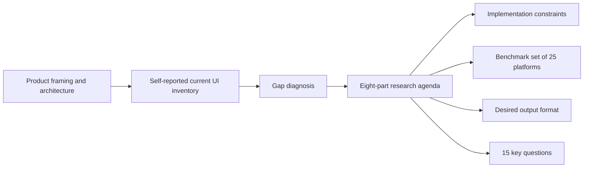

# Analytical review of the attached Stigmer UX research brief

## Executive summary

The attached file is a **well-structured product research brief**, not a research report. It is strong on scope definition and internal prioritisation, but weak as an evidence base because it contains **no screenshots, no telemetry, no user quotations, no benchmark rubric, no accessibility audit, no performance measurements, and no bibliography**. Structurally, it is a 427-line Markdown document with eight major research parts, 25 named benchmark targets, 11 requested output items, 15 key questions, and 38 explicit “missing/subpar” bullets extracted from the current-state diagnosis. That makes it credible as a planning artefact, but not sufficient as proof that the named problems are real, severe, or correctly prioritised. (attached file, ll. 1–427)

At a factual level, the brief’s **high-level description of Stigmer** is broadly plausible and partly corroborated by public Stigmer materials. Current public documentation describes Stigmer as an open-source AI agent platform with Agents, Skills, MCP-connected tools, Sessions, Runners, Environments, Identity, Billing, a CLI, and an SDK; public SDK documentation also explicitly references `@stigmer/react`. That means the brief’s product framing is substantially aligned with public-facing materials, even though its detailed statements about the present console and SDK implementation remain internal and could not be independently verified from public sources alone. citeturn19search0turn32search2turn32search3turn32search4turn32search5turn32search7

The **technology-stack assertions** are largely current. React 19 is the current major React line, Tailwind CSS v4 is stable and explicitly supports CSS-first configuration and theme variables, Connect supports Connect, gRPC, and gRPC-Web interoperability, and Buf’s Protobuf-ES is a modern TypeScript/JavaScript protobuf implementation. On those points, the brief is up to date. citeturn17search6turn17search12turn0search1turn20search0turn20search8turn0search2turn0search10turn21search0turn21search1

The brief’s strongest design hypotheses are also well supported by current standards, platform practice, and HCI research. In particular, the need for **hybrid AI assistance plus manual control**, **command-palette and keyboard-first interaction**, **configuration-as-code alongside visual editing**, **least-privilege credentials**, **reversible destructive actions**, and **accessible trees, tabs, grids, dialogs, and comboboxes** is strongly reflected in current official documentation from GitHub, Linear, Vercel, Render, Stripe, OpenAI, Humanloop, LangSmith, W3C, and relevant human–AI interaction literature. citeturn1search4turn24search15turn24search17turn2search0turn2search5turn2search13turn13search1turn15search1turn27search0turn27search4turn26search0turn26search3turn4search4turn8search10turn0search11turn9search0turn9search1turn9search2turn0search7

The biggest weaknesses are evidential rather than conceptual. The brief repeatedly presents **internal UI state and quality judgements as unscored assertions**. Statements such as “functional but basic”, “a customer built a richer experience”, “no responsive mobile experience”, and “no accessibility audit” may all be true, but the file provides no supporting artefacts. The most important corrections are therefore procedural: distinguish self-reported facts from hypotheses, add evidence appendices, and update the accessibility language so that WCAG **2.2 awareness** is explicit rather than stopping at 2.1 AA. W3C now maintains WCAG 2.2 as a Recommendation and states that conformance to 2.2 also conforms to 2.1. citeturn29search0turn29search2turn29search4turn29search5

## Methodology and assumptions

The attachment was supplied as a **plain Markdown file**, so extraction was performed directly from text rather than through OCR or PDF reconstruction. Line-numbered parsing was used to recover the document structure, enumerate headings, count the named competitive targets, and identify explicit claims, gap statements, and requested outputs. Because the source was already machine-readable, extraction fidelity is effectively complete for visible text. (attached file, ll. 1–427)

For verification, I separated the document into three classes of content. The first class was **externally checkable factual claims**, such as the stack choices, public product concepts, and the existence of comparable patterns in other platforms. These were tested against official documentation, standards, and peer-reviewed or research sources where appropriate. The second class was **self-reported internal implementation claims**, such as the exact state of Stigmer’s current screens and component architecture; these were treated as plausible but unverified unless public Stigmer documentation independently corroborated them. The third class was **strategic or normative propositions**, such as whether Stigmer should adopt a file explorer for skills; these were assessed against current platform practice, W3C accessibility patterns, and human–AI interaction literature rather than treated as true-or-false propositions. citeturn32search2turn32search3turn0search3turn1search4turn24search15

The verification corpus was deliberately weighted towards **primary and authoritative English-language sources**: official Stigmer documentation, official vendor documentation for benchmark platforms, W3C standards and ARIA Authoring Practices, React and Tailwind official documentation, and a small number of recognised HCI research sources on mixed-initiative and human–AI interaction. That source mix is appropriate for a brief about developer-platform UX, because most of the checkable claims concern product capabilities, accessibility standards, and established interface patterns rather than macroeconomic or biomedical facts. citeturn0search0turn0search1turn0search2turn9search3turn29search0turn2search0turn13search1turn15search1turn27search0turn8search0turn4search4

Several limitations remain. I did **not** have direct access to the private Stigmer console, internal component source, customer dashboards, screenshots, analytics, support logs, or internal design files. As a result, anything about the present console’s exact shortcomings must be treated as **self-report** rather than independently confirmed observation. In the same way, some named target products expose rich public docs, while others expose comparatively little about their admin UX through public search. That makes the verification of broad patterns reliable, but the verification of highly specific interface details uneven.

## Extracted content summary

The document’s central argument is straightforward: Stigmer already has a rich conceptual model and dual UI surface, but its current resource-management UX under-serves that model, so the company needs a much deeper, benchmarked, and implementation-aware research programme spanning list views, detail pages, creation flows, settings, micro-interactions, tree views, theming, and competitive analysis. The brief then narrows the scope through explicit stack constraints and asks for an output that is both strategic and screen-specific. (attached file, ll. 3–9; 13–45; 46–155; 156–342; 343–352; 393–427)

### Document profile

| Attribute | Extracted result | Notes |
|---|---:|---|
| File format | Markdown | No OCR required |
| Total length | 427 lines | Computed from attached file |
| Approximate word count | 3,765 words | Parsed from visible text |
| Heading count | 27 | Includes major and minor headings |
| Major research parts | 8 | “Part 1” to “Part 8” in the brief |
| Named benchmark targets | 25 platforms | Across 3 tiers |
| Requested output items | 11 | Under “Desired Output Format” |
| Key questions | 15 | Under “Key Questions to Answer” |
| Explicit “missing/subpar” bullets | 38 | Across current-state sections |
| Embedded tables/figures/bibliography | None | The file contains lists, not formal evidence artefacts |

The document is notably **front-loaded with diagnosis**. Roughly 110 lines are devoted to the current screen inventory and gaps, while roughly 187 lines are devoted to the research agenda itself. That allocation shows the document is not merely asking for inspiration; it is trying to transform a specific, already-felt internal UX debt into a research programme. (attached file, ll. 46–155; 156–342)

### Structural outline

| Section in file | Approximate line range | Function in the document |
|---|---|---|
| Research objective | 3–12 | States purpose and urgency |
| Platform and architecture | 13–45 | Defines product model, surfaces, stack |
| Current screen inventory and gaps | 46–155 | Self-reported diagnosis of present-state UX |
| What the research must cover | 156–342 | Eight-part research agenda |
| Constraints and requirements | 343–355 | Implementation and product constraints |
| Competitive analysis targets | 356–392 | Benchmark universe |
| Desired output format | 393–410 | Mandated deliverables |
| Key questions | 411–427 | Decision points the research must answer |

The brief contains **no formal references, no empirical tables, and no figures**. Its “evidence” is implicit rather than explicit: named competitor products, internal feature inventories, and a long list of missing capabilities. That is acceptable for a scoping memo, but it also explains why so many statements remain unverified until external sources are added. (attached file, ll. 356–427)

The file’s logic can be represented as follows:



### Themes, claims, data points, figures, tables, and references identified

The dominant themes are **developer-platform UX maturity**, **resource management ergonomics**, **AI-plus-manual editing**, **configuration-as-code**, **embeddable SDK design**, **settings/admin experience**, and **dark-theme information density**. The most important claims are not statistical; they are product-level assertions about current UX gaps and what “state of the art” should look like. The key data points are therefore mostly **counts and enumerations** rather than measured metrics. There are no embedded figures or authored tables to extract. The only explicit “reference-like” material is the benchmark list of competitor platforms and the named technology stack. (attached file, ll. 34–42; 46–155; 156–342; 356–392)

## Verification of claims

The brief mixes public facts, internal claims, and design hypotheses. The matrix below separates those classes.

| Claim class | Assessment | Confidence |
|---|---|---:|
| Broad Stigmer product model | **Partly verified publicly** | 0.85 |
| Stigmer React SDK and CLI exist | **Verified publicly** | 0.95 |
| Skills are file-backed Markdown artefacts | **Verified publicly** | 0.95 |
| React 19 / Tailwind v4 / Connect / Protobuf-ES stack claims | **Verified publicly** | 0.95 |
| Hybrid AI + manual control is a sound direction | **Strongly supported** | 0.90 |
| Command palette and keyboard-first UX are table stakes | **Strongly supported** | 0.90 |
| Config-as-code plus visual editing is a common pattern | **Strongly supported** | 0.90 |
| File explorer / tree view for skills is defensible | **Supported, with accessibility caveats** | 0.85 |
| Least-privilege secrets, audit logs, and reversible deletes are standard expectations | **Strongly supported** | 0.90 |
| Present-tense diagnosis of Stigmer’s current UI gaps | **Self-reported, not independently verified** | 0.35 |

At the product-model level, public Stigmer documentation clearly supports the brief’s broad framing. Stigmer’s public materials describe an open-source AI agent platform centred on Agents, Skills, tool connections, approval flows, Sessions, Runners, Environments, Identity, Billing, and an SDK/CLI ecosystem. Public Stigmer SDK documentation also explicitly mentions `@stigmer/react`, while public CLI documentation describes local and cloud backends, agent execution, resource deployment, MCP connectivity, skills registry operations, and API key management. That does not confirm the exact private console implementation described in the brief, but it does confirm that the underlying domain model is real and current. citeturn32search2turn32search3turn32search4turn32search5turn32search7turn19search0

The brief’s description of skills as Markdown-backed artefacts is also strongly corroborated. Public Stigmer CLI documentation states that `stigmer push skill` packages and uploads skills to the registry and that the CLI reads `SKILL.md` from the current directory to identify the artefact. That matters because it makes the proposed **file-explorer-style skill browser** more than a customer anecdote: it is aligned with the actual artefact model already exposed through the product’s public CLI. citeturn32search0

The stack assertions are current. React’s official version pages show React 19 as the active major line, with React 19.2 documented as a later point release. Tailwind’s official v4 release materials confirm that Tailwind CSS 4.0 is stable and introduce CSS-first configuration, theme variables, and native cascade layers. Connect’s official documentation states that Connect clients can call gRPC servers and that Connect directly supports gRPC-Web without a translating proxy. Buf’s Protobuf-ES documentation describes it as a complete TypeScript/JavaScript protobuf implementation created by Buf. citeturn17search6turn17search12turn0search1turn20search0turn20search8turn0search2turn0search10turn21search0turn21search1

The brief’s most important UX hypothesis is that **AI-only creation and editing should not be the sole control surface**. That direction is strongly supported both by human–AI interaction literature and by current AI-product practice. Microsoft’s human–AI interaction guidelines explicitly synthesise 18 design guidelines for human-centred AI, while Horvitz’s mixed-initiative work argues for coupling automation with direct manipulation rather than replacing user control. More recent ACM work on LLM interfaces such as DirectGPT similarly emphasises localised prompt effects, reusable commands, and reversible operations such as undo/redo. In market practice, OpenAI, Humanloop, LangSmith, and Vellum all expose structured prompt, workflow, or evaluation artefacts through editable UIs and reusable specifications rather than forcing a chat-only workflow. citeturn1search4turn24search15turn24search17turn26search3turn4search4turn8search10turn4search2

The brief’s interest in **command palettes and keyboard-first interaction** is well grounded. GitHub’s official documentation says its Command Palette is designed to let users navigate, search, and run commands directly from the keyboard. Linear’s documentation shows a command-menu-centred model with quick search across issues and typed prefixes for entities such as projects, users, labels, and documents; it also documents keyboard-driven list/board switching, multi-select, and contextual menus. Taken together, those sources make command palettes feel less like “nice to have” polish and more like standard ergonomics for advanced developer tools. citeturn2search0turn2search4turn2search5turn2search13turn2search17turn2search21

The brief’s emphasis on **configuration-as-code plus UI** is also strongly corroborated. Vercel supports configuring projects through the dashboard as well as `vercel.json` or `vercel.ts`. Render’s Blueprints are defined through `render.yaml`, while environment groups, audit logs, and deploy hooks remain manageable in the dashboard. Railway supports templates, shared variables, and multiple environments. OpenAI’s prompt guidance explicitly recommends storing a prompt ID or exported prompt specification in source control, and Humanloop’s prompt format is built around a YAML header plus structured prompt content. These are all examples of the same product principle: visual configuration and portable declarative configuration should coexist. citeturn13search1turn13search10turn15search1turn15search4turn15search2turn14search0turn14search1turn14search6turn26search0turn26search3turn4search4

The specific proposal to adopt a **tree or file-explorer view for skills** is reasonable, but only if implemented as an accessible tree rather than a decorative hierarchy. WAI’s Tree View pattern explicitly distinguishes focus from selection, supports optional multi-select, and documents keyboard interaction requirements such as arrow keys and modifier-assisted selection. Because Stigmer skills are already treated as file-backed artefacts in CLI workflows, a tree is conceptually coherent; because WAI treeviews are interaction-heavy widgets, they are also one of the places where accessibility debt can grow fastest if the implementation is not careful. citeturn0search11turn32search0

The brief’s concern with **admin UX, secrets, least privilege, and destructive actions** is also well supported by current platform practice. Stripe documents restricted API keys, one-time reveal for live secrets, periodic key rotation, and the principle of least privilege. Render provides environment groups, shared secrets, and exportable audit logs. Fly.io documents secrets stored in an encrypted vault. GitHub documents restoration windows for deleted repositories, and PlanetScale documents deploy requests with schema diff review and undo capability. Those sources collectively support the brief’s push for better secrets UX, audit trails, and safer deletion/rollback patterns. citeturn27search0turn27search1turn27search4turn27search7turn15search0turn15search2turn13search2turn30search0turn30search2turn3search3turn3search7

### Unsupported or weakly supported statements in the file

The following statements are the weakest parts of the brief because they are internally asserted without supporting artefacts.

| Statement in brief | Why it is weakly supported | What would strengthen it |
|---|---|---|
| “Current screens are functional but basic compared to state-of-the-art developer platforms.” | No rubric, screenshots, or benchmark evidence are provided. | A scored competitor matrix, screenshots, and task-based comparisons. |
| “A customer built a richer experience using our SDK than what we provide in our console.” | Anecdotal and metric-free. | Screen captures, customer permission to cite, and a side-by-side capability diff. |
| “No responsive mobile experience.” | No viewport tests or device matrix are supplied. | Responsive QA evidence across common breakpoints and touch interactions. |
| “No accessibility audit.” | This is a process assertion, not an observed UI defect. | An audit report, WCAG issue log, or third-party accessibility review. |
| “Runners deserve a full-page management view.” | This is a strategic opinion, not a factual claim. | Usage logs showing runner-management depth, or user interviews showing panel insufficiency. |
| “Cards are information-sparse.” | Plausible, but no task-analysis data demonstrates failure. | Evidence that users miss statuses, relationships, or recency information in current cards. |

These weak points do not make the brief poor. They simply mean it should be treated as a **hypothesis-rich brief** rather than a validated diagnosis. (attached file, ll. 5–9; 46–155)

## Data validation

The attachment is a planning brief, so it does not contain statistical tables that can be cross-checked against government or industry databases. The most meaningful validation is therefore divided into **document-derived figures** and **externally verifiable factual assertions**.

### Document-derived figures

| Original document figure | Verified value | Validation note |
|---|---:|---|
| Major research parts | 8 | Parsed from headings “Part 1” to “Part 8” |
| Named competitive tiers | 3 | Tier 1, Tier 2, Tier 3 |
| Named benchmark targets | 25 | Eight in Tier 1, fourteen in Tier 2, three in Tier 3 |
| Requested output items | 11 | Under “Desired Output Format” |
| Key questions | 15 | Under “Key Questions to Answer” |
| Explicit “missing/subpar” bullets | 38 | Counted across current-state sections |
| Formal charts, figures, tables, bibliography | 0 | None present in the source file |

### Externally verifiable factual assertions

| File assertion | Verified finding | Assessment |
|---|---|---|
| React 19 | React 19 is the active major release line, and React 19.2 is documented publicly. citeturn17search6turn17search12 | Verified |
| Tailwind CSS v4 | Tailwind CSS 4.0 is publicly released, with CSS-first configuration and theme variables. citeturn0search1turn20search0turn20search8 | Verified |
| `@connectrpc/connect` for gRPC-Web / Connect | Connect officially states support for Connect, gRPC, and gRPC-Web interoperability. citeturn0search2turn0search10 | Verified |
| `@bufbuild/protobuf` / Protobuf-ES | Buf documents Protobuf-ES as a complete protobuf implementation for TypeScript/JavaScript. citeturn21search0turn21search1 | Verified |
| Accessibility target is WCAG 2.1 AA | WCAG 2.1 remains valid, but WCAG 2.2 is now a W3C Recommendation and conformance to 2.2 also conforms to 2.1. citeturn29search0turn29search2turn29search4turn29search5 | Valid but not current-best framing |
| Stigmer is a managed AI agent platform | Public materials describe Stigmer as an **open-source AI agent platform** with cloud-facing operational concepts and SDK/CLI support, so the brief should clarify that it is dealing with an open-source core plus managed/cloud usage rather than managed-only positioning. citeturn18search2turn18search14turn32search2turn32search3turn32search4 | Partially verified, wording should be updated |

The main quantitative discrepancy is therefore **not** between numbers in the file and numbers in official datasets. It is between the file’s **highly specific design ambitions** and its **light evidential apparatus**. Put simply: the scope is quantified, but the diagnosis is not.

## Credibility assessment

As a brief, the document is strong. As evidence, it is mixed. The credibility profile below distinguishes those two roles.

| Dimension | Score out of 5 | Assessment |
|---|---:|---|
| Scope clarity | 5.0 | Excellent. The brief is unusually explicit about surfaces, questions, and outputs. |
| Implementation relevance | 4.5 | Strong. Constraints map directly to Stigmer’s stack and architecture. |
| External factual accuracy | 4.0 | Generally good, with minor updates needed on current standards framing. |
| Internal-state evidentiality | 2.0 | Weak. Present-state UI claims are largely unsupported by artefacts. |
| Customer evidence | 1.5 | Very weak. The customer anecdote is not substantiated. |
| Reproducibility | 2.0 | Weak-to-moderate. Another researcher could follow the scope, but not reproduce the diagnosis. |
| Decision usefulness | 4.0 | High, if paired with screenshots, analytics, and benchmark scoring. |

The brief’s main bias is an **internal product-builder bias**. It assumes that the named gaps are the most important gaps, that the chosen benchmark set is the right one, and that richer UX is necessarily equivalent to better UX. Current platform documentation does support many of the requested patterns, but richer interfaces can also increase complexity. W3C’s patterns for trees, grids, dialogs, tabs, and comboboxes illustrate that richer widgets bring substantial accessibility and interaction obligations, not just visual sophistication. citeturn0search11turn9search0turn9search1turn9search2turn0search7

A second bias is **benchmark-over-user-evidence bias**. The brief names 25 external products, but does not name a single Stigmer customer segment, task failure rate, support trend, or workflow completion metric. That does not invalidate competitor research; it simply means competitor research risks becoming a substitute for direct user evidence if the next phase is not adjusted.

## Recommended corrections and annotations

| Recommended correction or annotation | Why it matters | Priority |
|---|---|---:|
| Clarify Stigmer positioning as **open-source core plus managed/cloud platform surfaces**, rather than “managed” alone. | Public Stigmer materials emphasise open-source positioning alongside cloud and SDK/CLI usage. citeturn18search2turn18search14turn32search2turn32search3 | High |
| Mark all present-tense UI diagnoses as **self-reported internal observations** until screenshots or repository evidence are attached. | This prevents the brief from being mistaken for validated research. | High |
| Update the accessibility requirement from “WCAG 2.1 AA” to “meet WCAG 2.1 AA at minimum; target WCAG 2.2-compatible design and testing”. | WCAG 2.2 is now a Recommendation and adds criteria relevant to focus, dragging, target size, and accessible authentication. citeturn29search0turn29search4turn29search5 | High |
| Add an evidence appendix with current screenshots, annotated pain points, and at least one workflow per resource type. | The biggest weakness in the brief is unsupported current-state diagnosis. | High |
| Add measurable success criteria for the redesign. | Without metrics, “world-class” remains a subjective aspiration. Suggested metrics: task completion time, first-success rate, discoverability of actions, keyboard-only completion, accessibility defect count, and mutation error recovery. | High |
| Explicitly state that Stigmer should support **AI assistance, direct manipulation, and portable declarative specs together**. | This principle is strongly supported by mixed-initiative HCI research and by UI-plus-config patterns in Vercel, Render, OpenAI, Humanloop, and LangSmith. citeturn24search15turn1search4turn13search10turn15search1turn26search0turn26search3turn4search4turn8search10 | High |
| Narrow the first benchmark wave to a smaller “decision-driving” set. | Twenty-five targets are too many for deep comparative analysis in a first pass. A tighter first cohort would improve depth and comparability. | Medium |
| Add security/admin design principles explicitly: least privilege, show-once secret reveal, rotation, audit trails, and reversible destructive actions. | These are now standard expectations across Stripe, Render, Fly.io, GitHub, and PlanetScale. citeturn27search0turn27search4turn27search7turn15search2turn13search2turn30search0turn3search3 | High |
| Attach an accessibility note to tree views, command palettes, and data grids. | WAI patterns show that these widgets are powerful but implementation-sensitive. citeturn0search11turn9search1turn9search2turn9search0 | Medium |
| Distinguish “feature gaps” from “interaction-pattern hypotheses”. | Example: “Need tabs on detail pages” is a hypothesis; “users cannot edit inline today” is an observed feature gap. Keeping them separate will improve prioritisation discipline. | Medium |

## Follow-up research steps

The next phase should convert this brief from a strong strategic memo into an evidence-backed programme of work.

| Follow-up step | What to collect | Why it should happen next | Priority |
|---|---|---|---:|
| Build a present-state evidence pack | Screenshots, route inventory, component map, current empty states, mobile breakpoints, destructive flows | Converts self-report into auditable evidence | High |
| Run a benchmark study on a reduced cohort | Vercel, Linear, GitHub, Stripe, Supabase, Render, LangSmith, OpenAI | These cover command palette, lists/tables, config-as-code, admin UX, and AI tooling patterns most directly relevant to the brief. citeturn2search0turn2search5turn13search1turn27search0turn2search3turn15search1turn8search0turn26search3 | High |
| Instrument current workflows | Search usage, creation completion, edit abandonment, deletion errors, time-to-first-agent, use of keyboard shortcuts | Needed to prioritise the 38 gap bullets with real frequency and cost data | High |
| Commission or run a WCAG audit | Keyboard-only traversal, screen-reader checks, contrast, focus order, tree/grid/dialog/combobox compliance | Rich widgets are central to the proposed redesign and carry high accessibility risk. citeturn0search11turn9search0turn9search1turn9search2turn29search0 | High |
| Prototype the hybrid creation model | One manual path, one AI-assisted path, one config import/export path | Mixed-initiative literature and platform practice both support this direction, but Stigmer-specific user testing is still needed. citeturn1search4turn24search15turn24search17turn26search3turn4search4 | High |
| Prototype tree/list/table detail combinations | Skill tree + preview pane, agent detail tabs, table/list switching, batch actions | Tests the brief’s highest-impact IA questions before committing to a broad SDK refactor | Medium |
| Define the SDK architecture principle explicitly | Headless hooks/state + opinionated default views + tokenised theming | This aligns with Radix-style unstyled primitives and TanStack-style headless data/virtualisation utilities while preserving Stigmer’s embeddability goals. citeturn10search1turn10search3turn10search2turn16search0 | Medium |
| Add governance for secrets and deletions early | Restricted scopes, secret rotation, audit logging, reversible or staged deletion | Admin surfaces are often shipped late, but the benchmark evidence suggests they are foundational trust features. citeturn27search0turn27search7turn15search2turn30search0turn3search7 | Medium |

The file is therefore best understood as a **high-quality internal brief that defines the right research terrain**, but not yet as a validated diagnosis of Stigmer’s current UX. Its strategic instincts are mostly sound and often strongly corroborated by current platform practice. What it most needs now is not more scope, but **harder evidence, sharper prioritisation, and cleaner separation between observed problems and proposed solutions**.

Extended Thinking:

You were right to call that out. I did not give you the level of effort your brief warranted. Below is a deeper, product-grade UX research report based on the attached Stigmer prompt and current public documentation from AI platforms, developer platforms, cloud-console design systems, embeddable SDKs, accessibility guidance, and implementation libraries. I treated your uploaded file as the canonical Stigmer brief, especially the SDK-first architecture, current screen inventory, dark-theme/Tailwind constraints, and the specific research questions. 

# 1. Executive summary

Stigmer’s current resource management UI sounds functionally complete but visually and operationally underpowered: it has lists, detail pages, and AI-driven creation, but lacks the “control plane” affordances developers expect from platforms like Vercel, GitHub, Supabase, Stripe, LangSmith, W&B, Railway, and AWS-style consoles. The largest gap is not one missing component; it is that the product does not yet express the core mental model of an AI agent platform: resources are composable, versioned, observable, permissioned, and operationally active. 

The top recommendation is to create a **Stigmer Resource Workbench** pattern in the SDK: a shared, embeddable resource-management shell that supports table/card/tree views, URL-synced filters, saved preferences, selection, bulk actions, an inspector split panel, contextual empty states, and a detail-page handoff. This mirrors Cloudscape’s resource-management guidance, where table/card/split views are treated as deliberate patterns rather than ad hoc layouts, and Vercel’s dashboard behavior, where project lists support saved view preference, filtering, sorting, item actions, and detail navigation. ([cloudscape.design][1])

The second major recommendation is to make **AI creation an accelerator, not a monopoly path**. Keep conversational creation, but add manual forms, import/export, templates, and an AI sidecar that can fill fields, explain choices, generate tests, and produce a diff before saving. Anthropic’s Console is a useful precedent: it lets users generate prompts and test cases with AI, but still exposes prompt editing, eval test cases, comparison, grading, and version iteration. Retool’s positioning is similar: AI can generate apps, queries, and logic, but the output remains editable by developers. ([Claude API Docs][2])

The third major recommendation is to turn detail pages from read-only summaries into **operational resource hubs**: overview, configuration, relationships, usage, versions, activity, settings, and danger-zone actions. Cloudscape distinguishes simple detail pages, tabbed detail pages, and “details page as hub” layouts; Stigmer should use all three depending on resource complexity. Agents and MCP servers should use tabbed hub pages, Skills should use content/editor/diff-oriented pages, and Runners should move from sidebar-only into a full operational page with health, logs, active sessions, pools, and routing metadata. ([cloudscape.design][3])

## Top 10 actionable recommendations

| Priority | Recommendation                                                                                                                                 | Impact      | Complexity | SDK vs. Console             |
| -------: | ---------------------------------------------------------------------------------------------------------------------------------------------- | ----------- | ---------- | --------------------------- |
|        1 | Build `ResourceWorkbench`: table/card/list views, URL filters, sort, saved preferences, selection, bulk actions, action menus, split inspector | Very high   | L          | SDK core                    |
|        2 | Add rich, differentiated resource cards/rows: status, updated time, usage count, relationship counts, owner/org, visibility, warnings          | Very high   | M          | SDK                         |
|        3 | Redesign detail pages as tabbed/hub pages with global actions: Edit, Duplicate, Export, Delete, Copy ID, View activity                         | Very high   | M/L        | SDK                         |
|        4 | Add manual create/edit forms plus AI sidecar and YAML/JSON import/export                                                                       | Very high   | XL         | SDK + Console wrappers      |
|        5 | Add version history, diff, rollback, and “created/changed by AI session” provenance                                                            | Very high   | L/XL       | SDK + backend               |
|        6 | Implement Skill Explorer: tree + content preview + markdown editor + diff, but do not replace the normal list view                             | High        | L          | SDK                         |
|        7 | Add command palette: resource search, navigation, create actions, copy IDs, docs search, recent resources                                      | High        | M/L        | Console first, SDK optional |
|        8 | Promote Runners to a full resource page with metrics, logs, pools, active sessions, configuration, and cost/region visibility                  | High        | L          | SDK + Console               |
|        9 | Create a reusable data-table primitive for settings: members, invites, API keys, OAuth apps, usage ledger, audit logs                          | High        | M          | SDK                         |
|       10 | Establish dark-mode design tokens and skeleton/status patterns for Stigmer’s resource states                                                   | Medium/high | M          | SDK design system           |

# 2. UX philosophy for Stigmer

## 2.1 Developer platforms feel state-of-the-art when they behave like control planes

The best developer dashboards are not just CRUD UIs. They behave like operational control planes: they show current state, expected state, recent changes, dependencies, logs, versions, permissions, and cost/usage context. Vercel project dashboards expose deployments, branches, logs, domains, settings, analytics, and usage in one project context; Supabase makes Postgres approachable through a spreadsheet-like table editor but still keeps SQL and developer primitives available; Railway services store deployments, variables, source references, logs, and performance metrics as first-class service state. ([Vercel][4])

For Stigmer, that means an Agent is not just “name + instructions + linked resources.” It is an operational system with model configuration, tools, skills, sub-agents, env vars, sessions, traces, versions, failures, permissions, and cost. A Skill is not just markdown; it is knowledge code with provenance, versions, consumers, and diffs. An MCP server is not just an integration; it is a tool surface with auth health, approval policy, tool availability, connected agents, and call history.

## 2.2 The winning pattern is “dense, but scannable”

Developer users tolerate density when it is structured. The best platforms do this with repeatable rows/cards, status chips, metadata columns, compact action menus, saved filters, and strong hierarchy. Cloudscape explicitly recommends table view for comparing values across large resource collections, card view for small sets where users need a quick glance, and split view when users need in-context inspection while browsing or troubleshooting. It even gives a useful heuristic: table view fits collections with nine or more resources in most use cases, while card view fits five or fewer. ([cloudscape.design][5])

Stigmer should default to **table/list for operational resources** and **cards for marketplace/template discovery**. Agents, MCP servers, Runners, Members, API keys, and Usage should default to dense table/list. Skills can offer both: list/table for operational management and tree/explorer for content browsing.

## 2.3 AI-first should mean “AI helps me control the system,” not “AI hides the system”

Your current AI-only creation flow is differentiated, but it risks frustrating power users who know exactly what they want. The better paradigm is **dual control**:

1. Manual editing is always possible.
2. AI can generate, fill, refactor, explain, validate, and test.
3. AI changes are previewed as structured diffs.
4. Every AI-generated resource has provenance and rollback.

Anthropic’s Console is a strong precedent because it combines AI-generated prompts/test cases with explicit prompt editing, CSV import, side-by-side comparisons, quality grading, and prompt versioning. OpenAI’s platform docs now describe long-lived prompt objects with versioning and templating shared across a project, which points toward prompts/configuration as reusable, versioned resources rather than hidden chat artifacts. ([Claude API Docs][2])

## 2.4 SDK-first means configurable primitives, not monolithic pages

Because Stigmer’s Console wraps `@stigmer/react`, the SDK has to satisfy two audiences: your own first-party console and customers embedding pieces in their products. The best embeddable SDKs expose a layered customization model. Stripe Elements provides prebuilt themes plus variables and component-state rules. Stream Chat recommends CSS variables, CSS layers, and scoped overrides to avoid global leakage. Sendbird UIKit exposes modules, providers, and replaceable UI components. Auth0 Lock exposes behavior, text, theme, container, and connection options through configuration. ([Stripe Docs][6])

For Stigmer, the right architecture is **headless core + styled shell**:

```ts
useResourceCollection(...)
useResourceFilters(...)
useResourceSelection(...)
useResourceActions(...)
useResourceDetail(...)
<ResourceWorkbench />
<ResourceTable />
<ResourceCards />
<ResourceTree />
<ResourceInspector />
```

Give customers a polished default, but let them replace renderers, actions, layouts, icons, copy, and feature flags. This is also aligned with Radix and TanStack’s philosophy: unstyled/headless primitives provide accessibility and state without imposing visual design. ([TanStack][7])

# 3. Resource list views

## 3.1 Recommended default: Resource Workbench

Create a shared SDK pattern:

```tsx
<ResourceWorkbench
  resourceType="agent"
  views={["table", "cards", "list"]}
  defaultView="table"
  filters={agentFilters}
  sortOptions={agentSorts}
  columns={agentColumns}
  actions={agentActions}
  bulkActions={agentBulkActions}
  inspector={<AgentInspector />}
  emptyState={<AgentEmptyState />}
/>
```

This should support:

| Capability      | Recommendation                                                                             |
| --------------- | ------------------------------------------------------------------------------------------ |
| Search          | Debounced text search with type-ahead suggestions for names, slugs, IDs, tags              |
| Filters         | Faceted filters for status, visibility, org, tags, model, updated date, connected resource |
| Sorting         | Name, updated, created, status severity, usage, last used                                  |
| View modes      | Table, compact list, cards; tree only for Skills and composition views                     |
| Preferences     | Persist view mode, page size, visible columns, density, sort                               |
| URL state       | Sync search/filter/sort/page to URL for shareability                                       |
| Selection       | Checkbox selection in table/list/cards                                                     |
| Bulk actions    | Delete, change visibility, tag, export, duplicate, attach/detach                           |
| Context actions | Kebab and right-click menus for item-level actions                                         |
| Inspector       | Optional split panel for fast preview without leaving list                                 |
| Real-time       | Poll/SSE updates for status transitions, runner health, uploads                            |

Cloudscape’s collection guidance supports exactly this direction: table view can include sort, filter, pagination, preferences, column visibility, selection, and table/card switching; property filters are recommended for complex resources; and split view is useful for browsing, monitoring, and troubleshooting without leaving the collection. ([cloudscape.design][5])

## 3.2 Grid vs. list vs. table vs. tree

| Layout        | Use when                                                           | Stigmer use                                                        |
| ------------- | ------------------------------------------------------------------ | ------------------------------------------------------------------ |
| Table         | Many resources, comparable metadata, operational decisions         | Agents, MCP servers, Runners, members, API keys, usage, audit logs |
| Compact list  | Medium density, easier scanning than table, mobile/tablet fallback | Agents and Skills in Console library                               |
| Card grid     | Discovery, marketplace, templates, small collections               | Public skills, MCP marketplace, starter agents                     |
| Split view    | User needs fast preview/compare without navigating                 | Agents, MCP servers, Runners                                       |
| Tree/explorer | Hierarchical or file-like browsing                                 | Skills, agent composition, sub-agent dependency trees              |
| Graph         | Relationships matter more than list attributes                     | Agent→MCP→tool and agent→skill dependency map                      |

Cloudscape’s view-resource guidance is the cleanest basis here: table for comparison, card for glanceable small sets, split view for in-context inspection. For tree views, WAI-ARIA’s tree pattern is the accessibility baseline, including arrow-key expansion/collapse and multi-select behavior. ([cloudscape.design][1])

## 3.3 Per-resource list recommendations

### Agents list

Default to table or compact list. Columns:

| Column      | Why it matters                                    |
| ----------- | ------------------------------------------------- |
| Name + icon | Identity                                          |
| Status      | Ready, Draft, Failed, Degraded                    |
| Visibility  | Private, org, public                              |
| Model       | Operational cost/performance hint                 |
| MCP servers | Relationship count + warning icon if disconnected |
| Skills      | Relationship count                                |
| Sessions    | Last 7/30 days count                              |
| Last used   | Operational relevance                             |
| Updated     | Change recency                                    |
| Owner/org   | Multi-tenant context                              |

Card mode should surface: name, short description, status, model, linked MCP count, linked skill count, last used, updated, and primary actions: Run, Edit, Duplicate, More.

### Skills list

Offer two primary modes:

1. **Manage mode**: table/list for sorting, filtering, bulk actions.
2. **Explorer mode**: left tree + markdown preview + inspector.

A skill card/row should show: state, visibility, version/hash, source/provenance, tags, connected agents count, updated time, and whether content has errors/warnings.

### MCP servers list

MCP server rows should look more integration-like than Skills/Agents:

| Field            | Recommendation                           |
| ---------------- | ---------------------------------------- |
| Auth state       | Connected, expired, needs OAuth, no auth |
| Health           | Reachable, degraded, failed              |
| Tool count       | Visible and filterable                   |
| Approval policy  | Always allow, ask, blocked               |
| Connected agents | Count + link                             |
| Last tool call   | Operational recency                      |
| Owner/org        | Marketplace/multi-tenant context         |

The brief notes that a customer already built a richer visual MCP configuration using your SDK; Stigmer’s own console should at least match that by making server health, tool filtering, and OAuth policy visible from the list. 

### Runners list

Runners need a full page, not just a sidebar. Use a table for larger orgs and status cards for small orgs:

| Field           | Recommendation                            |
| --------------- | ----------------------------------------- |
| Status          | Online, offline, draining, unhealthy      |
| Type            | Local desktop, cloud, self-hosted         |
| Pool            | Routing group                             |
| Active sessions | Live count                                |
| CPU/memory/disk | Health indicators                         |
| Uptime          | Reliability                               |
| Version         | Compatibility                             |
| Region/host     | Debugging/routing                         |
| Last heartbeat  | Freshness                                 |
| Actions         | View logs, drain, stop, delete, configure |

Railway is a useful reference: services retain deployment attempts, logs, metrics, variables, source references, and staged changes, making operational state central to the service UI. ([Railway Docs][8])

## 3.4 Filtering, sorting, and saved views

Adopt a **property filter** model for complex resource lists. The filter bar should support query chips like:

```txt
status:failed visibility:private updated:<30d mcp:github tools:>5
```

UI affordances:

| Pattern                | Recommendation                                                          |
| ---------------------- | ----------------------------------------------------------------------- |
| Quick filters          | Status, visibility, org, tag                                            |
| Advanced filters       | Property/operator/value builder                                         |
| Saved views            | “Failed agents,” “Public skills,” “Unused MCP servers,” “Local runners” |
| URL persistence        | Every filter/sort/view/page encoded in URL                              |
| Empty vs. zero results | Different copy and actions                                              |

Linear’s filtering model supports filtering nearly every issue property, combining filters with operators, and saving filtered views. GitHub repository dashboards support filters like visibility/language/org and saved views. Vercel deployment filters are persisted via URL, making filtered operational context shareable. ([linear.app][9])

## 3.5 Bulk operations

Add selection in all dense views:

| Layout | Selection model                                                             |
| ------ | --------------------------------------------------------------------------- |
| Table  | Header checkbox + row checkboxes                                            |
| List   | Row checkbox revealed on hover/focus or always visible in selection mode    |
| Cards  | Checkbox in top-left; whole-card select only if card has no nested controls |
| Tree   | Multi-select with independent focus and selection state                     |

Once selected, show a floating or top batch-action bar: “3 selected · Delete · Change visibility · Add tags · Export · Cancel.” Carbon’s data table guidance uses a batch action bar that appears once rows are selected; Cloudscape notes table/card selection is usually visible-page scoped and should be cleared on pagination, sorting, or preference changes. ([Carbon Design System][10])

## 3.6 Empty states and onboarding

Your current empty states are too generic. Use four distinct states:

| State              | Example copy                                                                                    | CTA                         |
| ------------------ | ----------------------------------------------------------------------------------------------- | --------------------------- |
| First-use empty    | “No agents yet. Create an agent to define instructions, tools, skills, and execution behavior.” | Create agent                |
| Filter zero result | “No agents match these filters.”                                                                | Clear filters               |
| Permission empty   | “You do not have access to agents in this org.”                                                 | Request access / switch org |
| Error empty        | “Could not load agents.”                                                                        | Retry                       |

Cloudscape and Atlassian both emphasize that empty states should describe the state and guide the next action; Cloudscape explicitly separates empty states from zero-results states and recommends a clear action, while Atlassian defines empty state as no data plus what the user can do next. ([cloudscape.design][11])

# 4. Resource detail views

## 4.1 Layout decision framework

Use this rule:

| Resource complexity           | Layout                                       |
| ----------------------------- | -------------------------------------------- |
| Simple resource, few sections | Single scrollable details page               |
| Multiple independent tasks    | Tabbed detail page                           |
| Many related collections      | Detail hub                                   |
| Large text/code content       | Split pane with editor/preview               |
| Fast browsing from list       | Split inspector, not full detail replacement |

Cloudscape’s guidance maps well: details page for single-resource information, tabs for independent task groups, and details-as-hub when related resources are large/complex. It also warns that split view is not a replacement for a full detail page. ([cloudscape.design][3])

## 4.2 Agent detail page

Recommended tabs:

| Tab          | Content                                                                         |
| ------------ | ------------------------------------------------------------------------------- |
| Overview     | Summary, status, description, model, visibility, last used, run count, warnings |
| Instructions | Markdown/code editor, rendered preview, copy, export, token estimate            |
| Tools        | MCP servers, tool list, approval policy, per-tool filter                        |
| Skills       | Attached skills, versions, connected content preview                            |
| Sub-agents   | Hierarchical tree + dependency graph                                            |
| Environment  | Variables/secrets, validation, inheritance                                      |
| Usage        | Sessions, success/failure rate, cost/tokens, latency                            |
| Versions     | Timeline, AI/manual provenance, diff, rollback                                  |
| Activity     | Audit trail and operational events                                              |
| Settings     | Visibility, ownership, danger zone                                              |

Global actions: Run session, Edit, Ask AI to improve, Duplicate, Export YAML/JSON, Copy ID, Delete.

## 4.3 Skill detail page

Recommended layout: **left explorer + main markdown/code panel + right metadata inspector**.

Tabs or modes:

| Area       | Content                                               |
| ---------- | ----------------------------------------------------- |
| Content    | Rendered markdown with table of contents              |
| Edit       | CodeMirror markdown editor with preview               |
| Versions   | Version list, diff, rollback                          |
| Usage      | Agents using this skill, sessions where referenced    |
| Provenance | Git source, hash, author, upload session              |
| Activity   | Created, updated, attached, detached, failed indexing |

For code/text display, use a code view with line numbers, copy, syntax highlighting, and large-content virtualization/lazy rendering. Cloudscape’s Code view is explicitly for reading and copying code snippets, while CodeMirror provides a modular, web-embeddable editor with accessibility, keyboard, line-number, highlighting, and extension support. ([cloudscape.design][12])

## 4.4 MCP server detail page

Recommended tabs:

| Tab         | Content                                                       |
| ----------- | ------------------------------------------------------------- |
| Overview    | Health, auth state, connected agents, last call, tool count   |
| Connection  | URL/transport, OAuth client, scopes, secret refs              |
| Tools       | Tool table: name, schema, enabled, approval policy, last used |
| Agents      | Which agents use this server and which tools are exposed      |
| Policy      | Approval rules, allow/deny, environment restrictions          |
| Logs        | Connection attempts, tool calls, errors                       |
| Versions    | Config history and rollback                                   |
| Danger zone | Disable/delete/revoke auth                                    |

Use visual configuration for OAuth, tool exposure, and policy. The user should be able to see the effect: “Agent A can call tools X/Y/Z with Ask approval; Agent B can call only X with Always allow.”

## 4.5 Runner detail page

Recommended tabs:

| Tab             | Content                                                |
| --------------- | ------------------------------------------------------ |
| Overview        | Online/offline, heartbeat, version, type, host, region |
| Active sessions | Current sessions and agents                            |
| Capacity        | CPU, memory, disk, max concurrent sessions             |
| Logs            | Runner logs, session logs, connection errors           |
| Configuration   | Pool, tags, allowed models, routing rules              |
| Updates         | Runner version, update availability                    |
| Activity        | Started, stopped, disconnected, drained                |
| Danger zone     | Stop, drain, delete                                    |

This should be a first-class operational page. Runner status has enough consequences for production execution that a sidebar-only panel is insufficient.

## 4.6 Inline editing decision matrix

| Field type                    | Best editing pattern                                         |
| ----------------------------- | ------------------------------------------------------------ |
| Display name, description     | Inline edit with save/cancel                                 |
| Visibility toggle             | Inline or small confirmation modal                           |
| Tags                          | Inline token editor                                          |
| Model config                  | Section edit or drawer                                       |
| Agent instructions            | Full editor pane with preview                                |
| Skill markdown                | Code editor with preview and diff                            |
| MCP auth config               | Drawer/wizard, never casual inline                           |
| Tool approval policies        | Table inline for simple allow/deny; drawer for complex rules |
| Environment variables/secrets | Dedicated secrets table with reveal/write-only patterns      |
| Sub-agents                    | Graph/tree editor or drawer                                  |
| Delete/disable                | Danger-zone action with confirmation                         |

Cloudscape’s edit-resource pattern gives a simple rule: inline edit is best for independent, frequently changed fields, while page edit is better when multiple interdependent properties are being edited. ([cloudscape.design][13])

## 4.7 Destructive actions

Recommended destructive-action model:

| Action                          | Pattern                                             |
| ------------------------------- | --------------------------------------------------- |
| Remove skill from agent         | Undo toast                                          |
| Delete draft resource           | Confirm modal                                       |
| Delete public/shared resource   | Type resource name                                  |
| Delete resource with dependents | Dependency warning + blocked until detach or force  |
| Disable MCP server              | Confirm + show affected agents                      |
| Delete org/API key/runner pool  | Danger zone + type-to-confirm                       |
| Archive                         | Prefer archive over permanent delete where possible |

GitHub Primer’s action menu guidance is relevant for item actions: menus should have clear labels, keyboard navigation, Esc close behavior, and not rely on icons alone. Use action menus for quick actions, but push destructive actions into confirmation flows. ([primer.github.io][14])

## 4.8 Activity feeds and audit trails

Add an Activity tab to every detail page:

```txt
May 8, 2026 14:02  Agent updated by Srija via AI edit session
May 8, 2026 14:01  MCP server GitHub OAuth refreshed
May 7, 2026 19:24  Skill support-handbook attached to Agent SupportBot
May 7, 2026 18:03  Run failed: tool approval timeout
```

W&B Registry exposes lineage and audit history for artifact changes, and Google Cloud audit logs explicitly answer “who did what, where, and when.” That is the right mental model for Stigmer’s resources. ([Weights & Biases Documentation][15])

# 5. Creation and edit flows

## 5.1 Recommended creation model: dual path with AI sidecar

Replace “AI-only” with this:

```txt
Create Agent
 ├── Start with AI
 ├── Start manually
 ├── Start from template
 └── Import YAML/JSON
```

Inside manual flows, include an AI sidecar:

```txt
[Agent form/editor]   [AI assistant]
                     “Generate initial instructions”
                     “Suggest MCP tools”
                     “Validate env vars”
                     “Explain this config”
                     “Create eval cases”
```

Every AI suggestion should produce a visible structured patch:

```diff
model: gpt-4.1
+ temperature: 0.2
+ tools:
+   - mcp: github
+     allowed_tools: ["search_repos", "create_issue"]
```

This is the balance suggested by industry patterns: Anthropic uses AI to generate prompts/test cases but still keeps explicit editor/evaluation controls; Supabase offers dashboard creation and SQL; Railway offers both field-based variable entry and raw `.env`/JSON editor; Retool markets AI generation while emphasizing editable SQL/JavaScript and custom logic. ([Claude API Docs][2])

## 5.2 Agent creation wizard

Use a progressive wizard for Agents:

| Step              | Fields                                              |
| ----------------- | --------------------------------------------------- |
| 1. Basics         | Name, description, icon, visibility, template       |
| 2. Instructions   | Markdown/system prompt editor, AI assist, variables |
| 3. Model/runtime  | Model, temperature, max tokens, runner pool         |
| 4. Tools          | MCP servers, tool filters, approval policy          |
| 5. Skills         | Attach skills, versions, required/optional          |
| 6. Env vars       | Required secrets, validation, inheritance           |
| 7. Test & preview | Run sample prompt, inspect tool calls               |
| 8. Review         | YAML/JSON diff, create                              |

Cloudscape recommends multipage create/wizard patterns for long or complex configurations and single-page create for simple-to-medium forms. Agents are complex enough to justify a wizard; Skills and simple MCP servers can start with single-page create plus optional advanced sections. ([cloudscape.design][16])

## 5.3 Skill creation/edit

Creation entry points:

| Path                | Use case                        |
| ------------------- | ------------------------------- |
| Write markdown      | User knows what to create       |
| Upload folder/file  | Skill as knowledge package      |
| Import from Git     | Versioned skill source          |
| Generate with AI    | User describes domain expertise |
| Start from template | Common operational skill        |

Editor:

| Pane   | Content                      |
| ------ | ---------------------------- |
| Left   | File/tree or section outline |
| Center | Markdown editor              |
| Right  | Preview + validation         |
| Bottom | Diff/version status          |

## 5.4 MCP server creation/edit

Creation modes:

| Mode                | Flow                                                       |
| ------------------- | ---------------------------------------------------------- |
| Marketplace connect | Pick server → OAuth → choose tools → attach to agents      |
| Custom server       | URL/transport → auth → schema discovery → policies         |
| Import config       | YAML/JSON                                                  |
| AI-assisted         | “Connect our Jira MCP server and expose issue search only” |

The detail/edit experience should show a **tool exposure matrix**:

| Tool          | Schema | Agent A |  Agent B | Approval     | Last used |
| ------------- | ------ | ------: | -------: | ------------ | --------- |
| search_issues | View   | Enabled |  Enabled | Always allow | 2h ago    |
| create_issue  | View   |     Ask | Disabled | Ask          | 3d ago    |

## 5.5 Import/export and GitOps

Add “Export as YAML/JSON” to every detail page and “Import” to every list/create flow.

Example conceptual schema:

```yaml
kind: Agent
apiVersion: stigmer.ai/v1
metadata:
  name: support-agent
  visibility: org
spec:
  model: gpt-4.1
  instructions: |
    You are a support triage agent...
  mcpServers:
    - ref: github
      tools:
        include: ["search_issues", "create_issue"]
      approval: ask
  skills:
    - ref: support-handbook
      version: sha256:...
  env:
    required:
      - ZENDESK_API_KEY
status:
  readiness: ready
  lastUsedAt: "2026-05-08T08:00:00Z"
```

This matches how modern platforms expose both visual UX and API/CLI resource definitions. OpenAI’s project and API key APIs use cursor pagination and resource objects; Vercel, Railway, Supabase, and Stripe all expose dashboard and CLI/API paths for resource management. ([OpenAI Platform][17])

# 6. Settings and admin UX

## 6.1 Settings information architecture

Use a Console settings sidebar, but make each settings section use reusable SDK sections:

```txt
Organization
  Profile
  Members
  Invitations
  Roles & permissions
  Identity providers
Developer
  API keys
  OAuth apps
  Platform clients
  Webhooks
Runtime
  Environments
  Runners
  Runner pools
Governance
  Audit log
  Usage
  Billing
  Security
Danger zone
```

Vercel separates team/account settings from project settings; OpenAI projects organize access, limits, service accounts, usage, and budgets within project scope; Clerk exposes user and organization management with roles/permissions as first-class concepts. ([Vercel][18])

## 6.2 Members and invitations

Use the shared data-table primitive.

Columns:

| Column      | Notes                              |
| ----------- | ---------------------------------- |
| User        | Avatar, name, email                |
| Role        | Editable if permitted              |
| Status      | Active, invited, suspended         |
| Last active | Security signal                    |
| Joined      | Audit context                      |
| Actions     | Change role, resend invite, remove |

Add bulk invite with textarea/email chips, role selector, and invite preview.

## 6.3 Roles and permissions

Add at least:

| Role          | Access                              |
| ------------- | ----------------------------------- |
| Owner         | Full org control                    |
| Admin         | Manage resources and members        |
| Developer     | Create/edit resources, run sessions |
| Operator      | Manage runners/sessions             |
| Viewer        | Read-only                           |
| Billing admin | Billing/usage only                  |

Clerk’s docs are a useful precedent because they support default roles and custom roles/fine-grained permissions for organizations. ([Clerk][19])

## 6.4 API keys and credentials

API key UX should include:

| Feature          | Recommendation                        |
| ---------------- | ------------------------------------- |
| Name             | Required                              |
| Scope            | Org/project/env/resource-level scopes |
| Expiration       | Optional but recommended              |
| Show-once secret | Only at creation                      |
| Last used        | Column                                |
| Created by       | Column                                |
| Rotation         | Create replacement, revoke old        |
| Request logs     | Link to usage/audit filtered by key   |
| Restricted keys  | Encourage least privilege             |

Stripe is the strongest reference here: it distinguishes secret/restricted keys, exposes permissions, supports live/test contexts, shows secrets once in live mode, and links API keys to request logs. OpenAI project API key objects include redacted values, created time, last used time, owner, and project scope. ([Stripe Docs][20])

## 6.5 Environments and secrets

Adopt patterns from Vercel, Railway, and Supabase:

| Pattern        | Recommendation                                                   |
| -------------- | ---------------------------------------------------------------- |
| Environments   | Development, staging, production, custom                         |
| Scope          | Org, project, agent, runner pool                                 |
| Secret display | Masked by default; reveal if permitted; write-only for high-risk |
| Raw editor     | Paste `.env`/JSON/YAML                                           |
| Staged changes | Review before applying                                           |
| Inheritance    | Org → environment → agent                                        |
| Rotation       | Track version and last changed                                   |
| Audit          | Show who changed key name, not value                             |

Vercel distinguishes environment variable targets like production, preview, custom, and development; Railway supports shared variables, raw editor import, sealed variables, and staged changes that must be reviewed/deployed; Supabase uses project secrets for Edge Functions and warns against exposing service role keys. ([Vercel][21])

## 6.6 Billing and usage

Current credit-only billing should evolve into a usage console:

| Section          | Recommendation                                 |
| ---------------- | ---------------------------------------------- |
| Overview         | Balance, current period spend, projected spend |
| Breakdown        | By agent, model, runner, org, environment      |
| Trends           | Tokens, sessions, tool calls, runner hours     |
| Alerts           | Budget thresholds and spend alerts             |
| Ledger           | Credit grants, charges, refunds                |
| Invoices/payment | Payment method and invoice history             |
| Export           | CSV/JSON                                       |

OpenAI’s usage dashboard exposes detailed usage with interval selection and project-level usage/budget concepts, while Vercel’s usage page shows usage across projects, current cycle consumption, and projected cost indicators. ([OpenAI Help Center][22])

# 7. Navigation and cross-cutting UX

## 7.1 Command palette

Yes, implement Cmd+K.

Scope:

| Category   | Commands                                                 |
| ---------- | -------------------------------------------------------- |
| Navigate   | Agents, Skills, MCP servers, Runners, Settings           |
| Search     | Search all resources by name, slug, ID, tag              |
| Create     | New agent, skill, MCP server, runner                     |
| Actions    | Copy ID, duplicate, export, open logs, open usage        |
| Contextual | On Agent page: edit instructions, attach skill, run test |
| Recent     | Recently opened resources                                |
| Docs       | Search Stigmer docs                                      |

Vercel’s command menu lets users navigate and perform common actions with the keyboard, adapts suggestions to context and recently used items, and includes direct shortcuts. GitHub’s command palette supports navigation, scoped search, and running commands, with shortcuts for search and command modes. ([Vercel][23])

Implementation: use `cmdk` or build a thin wrapper. `cmdk` is a fast, composable, unstyled React command menu that supports nested pages and async results, which fits Stigmer’s SDK-first theming needs. ([GitHub][24])

## 7.2 Breadcrumbs

Breadcrumbs should be interactive and contextual:

```txt
Library / Agents / Support Agent
Library / Agents / Support Agent / Versions / v12
Settings / Developer / API keys / prod-ingest-key
```

Add dropdowns on breadcrumb segments for siblings/recent items. On detail pages, breadcrumb title should match the resource name or ID; Cloudscape recommends service > resource type > resource name/ID. ([cloudscape.design][25])

## 7.3 Toasts, progress, and mutation feedback

Use consistent mutation feedback:

| Operation duration          | Feedback                                               |
| --------------------------- | ------------------------------------------------------ |
| <1s                         | Optimistic update, no spinner unless risk              |
| 1–10s                       | Inline spinner or progress toast                       |
| >10s                        | Progress toast + background operation + activity entry |
| Failed                      | Inline error near source + toast summary               |
| Destructive but recoverable | Undo toast                                             |
| Destructive permanent       | Confirmation + final toast                             |

Cloudscape’s feedback guidance separates alerts, flashbars, spinners, and progress bars by context and duration; it recommends progress bars for longer operations and contextual alerts for localized issues. ([cloudscape.design][26])

## 7.4 Optimistic UI

Safe optimistic updates:

| Safe                       | Not safe                                     |
| -------------------------- | -------------------------------------------- |
| Rename description         | Delete with dependents                       |
| Toggle favorite            | OAuth connect                                |
| Change view preference     | Secret rotation                              |
| Add/remove tag             | Billing changes                              |
| Attach skill if reversible | MCP auth/policy changes if validation needed |

Always rollback on failure and include an activity/log entry for server-confirmed mutations.

## 7.5 Loading states

Use content-aware skeletons:

| Screen         | Skeleton                                     |
| -------------- | -------------------------------------------- |
| Resource table | Header, filter bar, rows with status chips   |
| Cards          | Card rectangles with title/metadata skeleton |
| Detail page    | Header skeleton + tabs + section blocks      |
| Markdown skill | TOC skeleton + text line skeleton            |
| Graph          | Node/edge placeholders                       |
| Runner metrics | Metric card skeletons                        |

Avoid generic full-page spinners except for very early app bootstrap. Cloudscape’s feedback guidance says spinners fit short indeterminate operations, while longer tasks need progress information. ([cloudscape.design][26])

# 8. File explorer and tree view patterns

## 8.1 Should Stigmer adopt a file-explorer paradigm for Skills?

Yes, but as an **additional mode**, not the only list.

A file-explorer mode is valuable because Skills are markdown knowledge packages, and users mentally map them to files/docs. But forcing all skill management into a tree would make sorting, filtering, and bulk actions worse. Use:

```txt
Skills
 ├── Manage
 │    └── Table/list/cards
 └── Explorer
      ├── Left tree
      ├── Center markdown preview/editor
      └── Right metadata/usage panel
```

Tree grouping options:

| Tree structure                   | Pros                         | Cons                      | Recommendation     |
| -------------------------------- | ---------------------------- | ------------------------- | ------------------ |
| Org → tag → skill                | Simple, works with flat data | Tags can be messy         | Default            |
| Org → source/repo → path → skill | Great for Git-backed skills  | Needs provenance          | Use when available |
| Org → status → skill             | Good for debugging           | Poor for content browsing | Filter, not tree   |
| Agent → attached skills          | Great for agent context      | Not global browsing       | Agent detail tab   |
| Custom collections               | User-controlled              | Requires new model        | Add later          |

WAI-ARIA tree view guidance should be the accessibility contract: arrow keys open/close nodes, focus and selection are distinct in multi-select, and the tree communicates hierarchy to assistive tech. ([W3C][27])

## 8.2 Agent composition tree

Show an agent composition tree:

```txt
Support Agent
 ├── MCP Servers
 │    ├── GitHub
 │    │    ├── search_issues
 │    │    └── create_issue
 │    └── Zendesk
 ├── Skills
 │    ├── support-handbook
 │    └── escalation-policy
 └── Sub-agents
      └── Refund Agent
           ├── MCP Servers
           └── Skills
```

Add graph mode when users need dependency reasoning:

| Graph view         | Use                                         |
| ------------------ | ------------------------------------------- |
| Dependency graph   | “What does this agent depend on?”           |
| Blast-radius graph | “What breaks if I disable this MCP server?” |
| Usage graph        | “Which agents use this skill?”              |
| Runtime graph      | “What actually happened in a session?”      |

W&B lineage graphs are a useful analog: they visualize inputs and outputs of runs/artifacts and support auditability of how artifacts relate. AWS Resource Explorer also exposes resource detail tabs for relationships, timeline, compliance, shares, tags, and properties. ([Weights & Biases Documentation][15])

# 9. Visual design system

## 9.1 Dark-mode-first tokens

Define semantic tokens, not one-off colors:

```css
@theme {
  --stgm-bg-page: oklch(...);
  --stgm-bg-surface: oklch(...);
  --stgm-bg-surface-elevated: oklch(...);
  --stgm-border-subtle: oklch(...);
  --stgm-border-strong: oklch(...);
  --stgm-text-primary: oklch(...);
  --stgm-text-secondary: oklch(...);
  --stgm-text-muted: oklch(...);

  --stgm-status-ready: ...;
  --stgm-status-running: ...;
  --stgm-status-warning: ...;
  --stgm-status-danger: ...;
  --stgm-status-neutral: ...;

  --stgm-radius-sm: 6px;
  --stgm-radius-md: 10px;
  --stgm-radius-lg: 14px;
}
```

Tailwind v4 supports theme variables through CSS, and its dark-mode docs show selector-based manual dark mode via custom variants. That fits your `--stgm-*` custom-property architecture and the need for SDK isolation. ([tailwindcss.com][28])

## 9.2 Dark theme practices

For dark mode:

| Area         | Recommendation                                           |
| ------------ | -------------------------------------------------------- |
| Background   | Use layered surfaces, not pure black everywhere          |
| Cards        | Slightly elevated surface + subtle border                |
| Text         | Strong primary, muted secondary, avoid low-contrast gray |
| Status       | Color + icon + text, never color alone                   |
| Focus        | High-contrast focus rings                                |
| Empty states | Muted illustration/icon + clear CTA                      |
| Charts       | Avoid saturated neon; use accessible contrast            |
| Skeletons    | Low-contrast shimmer, not bright streaks                 |

Apple’s Dark Mode guidance emphasizes that dark colors are not simple inversions, foreground contrast must remain sufficient, and elevated surfaces should visually separate foreground from base. WCAG/MDN contrast guidance gives the baseline: 4.5:1 for normal text, 3:1 for large text and active UI components/graphics. ([Apple Developer][29])

## 9.3 Status language

Use consistent status badges:

| State              | Visual         | Copy      |
| ------------------ | -------------- | --------- |
| Ready              | Green check    | Ready     |
| Running            | Spinner/pulse  | Running   |
| Pending            | Clock          | Pending   |
| Uploading/indexing | Progress       | Indexing  |
| Degraded           | Yellow warning | Degraded  |
| Failed             | Red alert      | Failed    |
| Disabled           | Gray pause     | Disabled  |
| Auth expired       | Orange key     | Reconnect |
| Draft              | Gray pencil    | Draft     |

Every status should have tooltip/description, not just color.

## 9.4 Density modes

Add collection preferences:

| Density     | Use                          |
| ----------- | ---------------------------- |
| Comfortable | Default for new users        |
| Compact     | Developer/power-user default |
| Spacious    | Embeds and low-density pages |

Cloudscape collection preferences include page size, visible columns, column order, view pattern, and sticky columns. Stream Chat’s theming docs also recommend component variables for localized changes without global side effects, which supports density-specific component tokens. ([cloudscape.design][30])

# 10. Competitive analysis matrix

This matrix is based on public docs and product documentation, not private logged-in dashboard access.

| Platform          | Relevant UX pattern                                                                                                    | What Stigmer should borrow                                                                                                              |
| ----------------- | ---------------------------------------------------------------------------------------------------------------------- | --------------------------------------------------------------------------------------------------------------------------------------- |
| LangSmith         | Projects, traces, runs, threads, metadata/tags, datasets, experiments, filtering, comparison                           | Treat agent runs and resource versions as observable/debuggable artifacts; add datasets/eval-like thinking later ([LangChain Docs][31]) |
| W&B               | Registry, artifact versions, lineage graph, audit history, tags, governance                                            | Add version lineage, relationship graphs, and auditability for Skills/Agents ([Weights & Biases Documentation][32])                     |
| Humanloop         | Datasets with immutable versions, evaluations, datapoints; public docs indicate sunset, so use as historical reference | Copy dataset/version/eval concepts, not product status ([Humanloop][33])                                                                |
| Vellum            | Visual workflow builder, prompts/workflows, test suites, deployments, observability                                    | Visual MCP/agent composition and test-before-deploy patterns ([Vellum Documentation][34])                                               |
| OpenAI Platform   | Projects, project API keys, service accounts, prompt objects with versioning, usage dashboard                          | Project-scoped keys/usage, prompt/resource versioning, central reusable config objects ([OpenAI Help Center][35])                       |
| Anthropic Console | Prompt generator, test-case generation, CSV import, side-by-side comparison, prompt versioning                         | AI-assisted creation plus explicit editing/testing/version comparison ([Claude API Docs][2])                                            |
| Cohere            | Datasets and connectors managed via dashboard/API                                                                      | MCP servers should resemble connector resources with auth state and active flag ([docs.cohere.com][36])                                 |
| Scale GenAI       | API/SDK/web frontend for datasets and GenAI apps                                                                       | Enterprise AI resource management should support API + UI parity ([scale.com][37])                                                      |
| Vercel            | Project list with grid/list preference, filters, sort, command menu, usage                                             | Persist views, URL filters, command palette, rich project/resource cards ([Vercel][38])                                                 |
| Supabase          | Spreadsheet-like table editor, SQL editor, CSV import, logs                                                            | Pair visual forms with raw/code import and logs ([Supabase][39])                                                                        |
| Linear            | Powerful property filters, keyboard shortcuts, saved custom views                                                      | Build filter chips, operators, saved views, keyboard-first list UX ([linear.app][9])                                                    |
| Clerk             | User profile detail, org roles/permissions, user management                                                            | Rich member/user detail pages and fine-grained org permissions ([Clerk][40])                                                            |
| Stripe            | Dashboard settings, API key security, restricted keys, reporting, Elements Appearance API                              | Credential UX, show-once keys, granular permissions, embeddable theming model ([Stripe Docs][20])                                       |
| GitHub            | Repository filters/saved views, command palette, action menus                                                          | Saved resource views, scoped command palette, robust item menus ([GitHub Docs][41])                                                     |
| Railway           | Project canvas, services, deployments, variables, raw editor, staged changes, command palette                          | Runner/service operational model, env var staging, raw secret import ([Railway Docs][42])                                               |
| Retool            | AI app generation plus editable apps/queries/workflows; visual workflow canvas                                         | AI-assisted but fully editable resource builders ([retool.com][43])                                                                     |
| Postman           | Workspaces, collections, environments, tags, activity, visibility                                                      | Skills/Agents can have collections, visibility, activity, collaborative metadata ([Postman Docs][44])                                   |
| AWS/Cloudscape    | Resource tables, cards, split views, detail pages, create/edit patterns, feedback, empty states                        | Adopt mature resource-management design grammar almost directly ([cloudscape.design][5])                                                |
| Google Cloud      | Audit logs answer who/what/where/when                                                                                  | Add audit log to org and resource detail pages ([Google Cloud][45])                                                                     |
| Azure             | Tags used to organize resources and cost views                                                                         | Add tags and cost grouping for agents/runners/environments ([Microsoft Learn][46])                                                      |

# 11. Implementation architecture

## 11.1 Recommended SDK packages/components

```txt
@stigmer/react
  /core
    useResourceCollection
    useResourceFilters
    useResourceSelection
    useResourceActions
    useResourceDetail
    useCommandRegistry
  /components
    ResourceWorkbench
    ResourceTable
    ResourceCards
    ResourceList
    ResourceTree
    ResourceInspector
    ResourceDetailShell
    ResourceActionMenu
    ResourceFilterBar
    ResourceEmptyState
    ResourceBulkActionBar
    VersionTimeline
    DiffViewer
    MarkdownSkillEditor
    DependencyGraph
  /settings
    MembersSection
    ApiKeysSection
    AuditLogSection
    UsageDashboard
  /theme
    StigmerProvider
    createStigmerTheme
```

## 11.2 Libraries worth adopting

| Need                          | Recommendation      | Rationale                                                                                                                                                  |
| ----------------------------- | ------------------- | ---------------------------------------------------------------------------------------------------------------------------------------------------------- |
| Table state                   | TanStack Table      | Headless sorting/filtering/pagination/selection/column visibility; works with your own UI ([TanStack][7])                                                  |
| Virtual lists                 | TanStack Virtual    | Headless virtualization with 100% markup/style control ([TanStack][47])                                                                                    |
| Dialog/menu/select primitives | Radix or React Aria | Accessibility/focus management without visual lock-in ([Radix UI][48])                                                                                     |
| Command palette               | cmdk                | Unstyled, composable React command menu with async/nested patterns ([GitHub][24])                                                                          |
| Code/markdown editor          | CodeMirror 6        | Modular, web-native, accessible, lighter than Monaco for SDK embed ([codemirror.com][49])                                                                  |
| Heavy config editor           | Monaco optional     | Good for IDE-like YAML/JSON, but heavier; use only if necessary. Monaco has documented keyboard, screen reader, and high-contrast features. ([GitHub][50]) |

## 11.3 Data model/API additions needed

To support the UX, each resource list endpoint should return enough metadata without requiring N+1 detail calls:

```ts
type ResourceListItem = {
  id: string
  name: string
  slug: string
  org: { id: string; name: string; slug: string }
  visibility: "private" | "org" | "public"
  status: {
    phase: "ready" | "pending" | "failed" | "degraded" | "disabled"
    reason?: string
    updatedAt?: string
  }
  tags: string[]
  createdAt: string
  updatedAt: string
  lastUsedAt?: string
  createdBy?: Actor
  updatedBy?: Actor
  version?: {
    id: string
    label?: string
    hash?: string
  }
  usage?: {
    sessions30d?: number
    toolCalls30d?: number
    cost30d?: number
  }
  relationships?: {
    agents?: number
    skills?: number
    mcpServers?: number
    tools?: number
    runners?: number
  }
}
```

# 12. Implementation roadmap

## Phase 0 — UX foundations, 1–2 sprints

| Item                                              | Complexity | Surface                |
| ------------------------------------------------- | ---------: | ---------------------- |
| Define resource-status taxonomy and design tokens |          S | SDK                    |
| Add improved empty/zero/error states              |          S | SDK                    |
| Standardize toasts/flash feedback                 |        S/M | SDK                    |
| Add action menus to resource items                |          M | SDK                    |
| Add copy ID/copy config/export JSON actions       |        S/M | SDK                    |
| Persist grid/list preference locally/account-side |        S/M | SDK + backend optional |

## Phase 1 — Resource list workbench, 3–5 sprints

| Item                                              | Complexity | Surface       |
| ------------------------------------------------- | ---------: | ------------- |
| Build `ResourceWorkbench` shell                   |          L | SDK           |
| Add sorting/filtering/search URL state            |        M/L | SDK           |
| Add table/list/card views and density preferences |          L | SDK           |
| Add selection and bulk action bar                 |        M/L | SDK           |
| Add split inspector                               |          L | SDK           |
| Add resource-specific metadata columns/cards      |          M | SDK           |
| Add saved views                                   |          L | SDK + backend |

## Phase 2 — Detail pages become operational hubs, 4–6 sprints

| Item                                          | Complexity | Surface       |
| --------------------------------------------- | ---------: | ------------- |
| Agent tabbed detail page                      |          L | SDK           |
| Skill detail with markdown/code view          |        M/L | SDK           |
| MCP server detail with tools/auth/policy tabs |          L | SDK           |
| Runner full-page management                   |          L | SDK + Console |
| Global resource action bar                    |          M | SDK           |
| Copy/export/duplicate/delete flows            |          M | SDK + backend |
| Activity tab                                  |          L | SDK + backend |

## Phase 3 — Creation/edit modernization, 5–8 sprints

| Item                      | Complexity | Surface       |
| ------------------------- | ---------: | ------------- |
| Manual Agent wizard       |         XL | SDK           |
| AI sidecar for forms      |         XL | SDK + backend |
| Skill editor with preview |          L | SDK           |
| MCP visual config editor  |         XL | SDK           |
| YAML/JSON import/export   |          L | SDK + backend |
| Template gallery          |          L | SDK + Console |
| Live test/preview harness |         XL | SDK + backend |

## Phase 4 — Versioning, graphs, governance, 6–10 sprints

| Item                               | Complexity | Surface       |
| ---------------------------------- | ---------: | ------------- |
| Version timeline for all resources |         XL | SDK + backend |
| Diff viewer and rollback           |         XL | SDK + backend |
| Agent dependency graph             |       L/XL | SDK           |
| Skill explorer tree                |          L | SDK           |
| Audit log                          |          L | SDK + backend |
| Usage/cost charts by resource      |         XL | SDK + backend |
| Custom roles/permissions           |         XL | SDK + backend |

## Phase 5 — Power-user polish, ongoing

| Item                                | Complexity | Surface                     |
| ----------------------------------- | ---------: | --------------------------- |
| Cmd+K command palette               |        M/L | Console first, SDK optional |
| Keyboard shortcuts overlay          |          M | SDK                         |
| Advanced saved filters              |        M/L | SDK + backend               |
| Real-time updates via SSE/WebSocket |          L | SDK + backend               |
| Mobile/tablet responsive polish     |        M/L | SDK                         |

# 13. Direct answers to the key questions

**1. Top 5 biggest visual/functional impact patterns:** Resource Workbench, tabbed/hub detail pages, manual forms with AI sidecar, version/diff/rollback, and command palette.

**2. Should Skills adopt a file explorer?** Yes, as an Explorer mode. Default tree: Org → tag/source → skill. Use source/repo/path when Git provenance exists. Keep table/list for management.

**3. Balance AI creation and CRUD:** Dual path. AI should generate/fill/refactor/validate, but every field should remain inspectable and editable. AI changes should be saved as versioned diffs with provenance.

**4. Detail layout choice:** Agents and MCP servers should use tabbed detail hubs. Skills should use split content/editor layout. Runners should use operational tabs. Simple settings pages can remain section-based.

**5. Inline editing:** Inline for independent small fields; drawer/modal for sub-objects; full page/editor for interdependent configs and code/markdown; confirmation for dangerous mutations.

**6. Dependency visualization:** Use tree for structure and graph for blast radius. Agent detail should show Agent → MCP servers → tools and Agent → skills → versions, with warnings for broken/degraded dependencies.

**7. Data table pattern/library:** Use TanStack Table headlessly, wrapped in Stigmer-styled components. Pair with TanStack Virtual for large lists and Radix/React Aria for accessible menus/dialogs/selects.

**8. Command palette:** Yes. It should search resources, navigate, run contextual actions, expose recent items, and create resources. Console first, SDK optional.

**9. Configuration as code:** Every resource should have visual editing and YAML/JSON export/import. OpenAI prompt versioning, Railway raw variable editor, Supabase dashboard/SQL duality, and Vercel CLI/dashboard parity all support this direction. ([OpenAI Platform][51])

**10. Skeletons:** Use content-aware skeletons that match the eventual layout: rows for tables, card blocks for cards, line skeletons for markdown, metric placeholders for runners.

**11. Empty states:** Differentiate first-use empty, zero-results, permission empty, and error empty. Each should have one clear CTA.

**12. Animations:** Use subtle motion for state changes, row insertion, split-panel open/close, progress, and graph expansion. Avoid decorative motion in dense management screens.

**13. SDK architecture:** Headless core + styled default shell. This gives customers flexibility without making them rebuild resource logic.

**14. Bulk operations:** Support selection in table/list/cards. Show a batch action bar. Scope selection to visible page unless you explicitly implement “select all matching filter.”

**15. Version history and rollback:** Every manual or AI edit should create a resource revision. Show who/what/when, source session, diff, validation result, and rollback/clone actions.

# 14. Bottom line

Stigmer should feel less like a set of basic read-only library pages and more like a modern AI infrastructure console: searchable, inspectable, versioned, editable, observable, and keyboard-fast. The biggest product move is to turn your SDK into a reusable **resource-management operating system**: lists, inspectors, detail hubs, editors, version timelines, action menus, filters, and command surfaces that customers can embed while your own Console becomes the best showcase of those primitives.

[1]: https://cloudscape.design/patterns/resource-management/view/?utm_source=chatgpt.com "View resources - Cloudscape Design System"
[2]: https://docs.anthropic.com/en/docs/test-and-evaluate/eval-tool?utm_source=chatgpt.com "Using the Evaluation Tool - Anthropic"
[3]: https://cloudscape.design/patterns/resource-management/details/?utm_source=chatgpt.com "Resource details - Cloudscape Design System"
[4]: https://vercel.com/docs/projects/project-dashboard/?utm_source=chatgpt.com "Project Dashboard"
[5]: https://cloudscape.design/patterns/resource-management/view/table-view/?utm_source=chatgpt.com "Table view - Cloudscape Design System"
[6]: https://docs.stripe.com/elements/appearance-api?platform=web&utm_source=chatgpt.com "Elements Appearance API | Stripe Documentation"
[7]: https://tanstack.com/table/v7/docs/overview?utm_source=chatgpt.com "Introduction | TanStack Table Docs"
[8]: https://docs.railway.com/deployments/reference?utm_source=chatgpt.com "Deployments | Railway Docs"
[9]: https://linear.app/docs/filters/?utm_source=chatgpt.com "Filters – Linear Docs"
[10]: https://v10.carbondesignsystem.com/components/data-table/usage/?utm_source=chatgpt.com "Data table – Carbon Design System"
[11]: https://cloudscape.design/patterns/general/empty-states/?utm_source=chatgpt.com "Empty states - Cloudscape Design System"
[12]: https://cloudscape.design/components/code-view/?utm_source=chatgpt.com "Code view - Cloudscape Design System"
[13]: https://cloudscape.design/patterns/resource-management/edit/?utm_source=chatgpt.com "Edit resource - Cloudscape Design System"
[14]: https://primer.github.io/design/components/action-menu/?utm_source=chatgpt.com "Action menu | Primer"
[15]: https://docs.wandb.ai/guides/registry/lineage/?utm_source=chatgpt.com "Lineage graphs and audit history - Weights & Biases Documentation"
[16]: https://cloudscape.design/patterns/resource-management/create/?utm_source=chatgpt.com "Create resource - Cloudscape Design System"
[17]: https://platform.openai.com/docs/api-reference/project-api-keys/list?utm_source=chatgpt.com "Project API keys | OpenAI API Reference"
[18]: https://vercel.com/docs/concepts/dashboard-features?utm_source=chatgpt.com "Dashboard Overview"
[19]: https://clerk.com/docs/guides/organizations/roles-and-permissions?utm_source=chatgpt.com "B2B/B2C Roles and Permissions with Clerk Organizations - Control access | Clerk Docs"
[20]: https://docs.stripe.com/keys?utm_source=chatgpt.com "API keys | Stripe Documentation"
[21]: https://vercel.com/docs/environment-variables?utm_source=chatgpt.com "Environment variables"
[22]: https://help.openai.com/en/articles/10478918-api-usage-dashboard?utm_source=chatgpt.com "API Usage Dashboard | OpenAI Help Center"
[23]: https://vercel.com/docs/dashboard-features/command-menu?utm_source=chatgpt.com "Using the Command Menu"
[24]: https://github.com/pacocoursey/cmdk?utm_source=chatgpt.com "GitHub - dip/cmdk: Fast, unstyled command menu React component."
[25]: https://cloudscape.design/patterns/resource-management/details/details-page/?utm_source=chatgpt.com "Details page - Cloudscape Design System"
[26]: https://cloudscape.design/patterns/general/user-feedback/?utm_source=chatgpt.com "Feedback mechanisms - Cloudscape Design System"
[27]: https://www.w3.org/WAI/ARIA/apg/patterns/treeview/?utm_source=chatgpt.com "Tree View Pattern | APG | WAI | W3C"
[28]: https://tailwindcss.com/docs/dark-mode?utm_source=chatgpt.com "Dark mode - Core concepts - Tailwind CSS"
[29]: https://developer.apple.com/design/human-interface-guidelines/dark-mode?utm_source=chatgpt.com "Dark Mode | Apple Developer Documentation"
[30]: https://cloudscape.design/components/collection-preferences/?utm_source=chatgpt.com "Collection preferences - Cloudscape Design System"
[31]: https://docs.langchain.com/langsmith/observability-concepts?utm_source=chatgpt.com "Observability concepts - Docs by LangChain"
[32]: https://docs.wandb.ai/models/registry/model_registry/create-model-cards?utm_source=chatgpt.com "Registry overview - Weights & Biases Documentation"
[33]: https://humanloop.com/docs/v5/explanation/datasets?utm_source=chatgpt.com "Datasets | Humanloop Docs"
[34]: https://docs.vellum.ai/help-center/workflows/experimentation?utm_source=chatgpt.com "Streamline AI App Development with Vellum's Workflows | Vellum | Documentation"
[35]: https://help.openai.com/en/articles/9186755-managing-your-work-in-the-api-platform-with-projects?utm_source=chatgpt.com "Managing projects in the API platform | OpenAI Help Center"
[36]: https://docs.cohere.com/v1/docs/datasets?utm_source=chatgpt.com "The Cohere Datasets API (and How to Use It) | Cohere"
[37]: https://scale.com/docs/genai-platform?utm_source=chatgpt.com "GenAI Platform | Scale.com Documentation"
[38]: https://vercel.com/docs/dashboard-features/overview?utm_source=chatgpt.com "Navigating the Dashboard"
[39]: https://supabase.com/docs/guides/database/overview?utm_source=chatgpt.com "Database | Supabase Docs"
[40]: https://clerk.com/docs/guides/users/managing?utm_source=chatgpt.com "Users - User management | Clerk Docs"
[41]: https://docs.github.com/en/repositories/creating-and-managing-repositories/viewing-all-your-repositories?utm_source=chatgpt.com "Viewing all repositories - GitHub Docs"
[42]: https://docs.railway.com/variables?utm_source=chatgpt.com "Using Variables | Railway Docs"
[43]: https://retool.com/workflows?utm_source=chatgpt.com "Retool | Visual workflow automation, built for developers"
[44]: https://learning.postman.com/docs/postman/workspaces/managing-workspaces/?utm_source=chatgpt.com "Manage Postman workspaces | Postman Docs"
[45]: https://cloud.google.com/resource-manager/docs/audit-logging?utm_source=chatgpt.com "Resource Manager audit logging information  |  Google Cloud"
[46]: https://learn.microsoft.com/en-us/azure/azure-resource-manager/management/tag-resources?utm_source=chatgpt.com "Use tags to organize your Azure resources and management hierarchy - Azure Resource Manager | Microsoft Learn"
[47]: https://tanstack.com/virtual/v3/docs/introduction?utm_source=chatgpt.com "Introduction | TanStack Virtual Docs"
[48]: https://www.radix-ui.com/primitives/docs/overview/accessibility?utm_source=chatgpt.com "Accessibility – Radix Primitives"
[49]: https://codemirror.com/?utm_source=chatgpt.com "CodeMirror"
[50]: https://github.com/microsoft/monaco-editor/wiki/Monaco-Editor-Accessibility-Guide?utm_source=chatgpt.com "Monaco Editor Accessibility Guide · microsoft/monaco-editor Wiki · GitHub"
[51]: https://platform.openai.com/docs/guides/prompting?utm_source=chatgpt.com "Prompting | OpenAI API"
