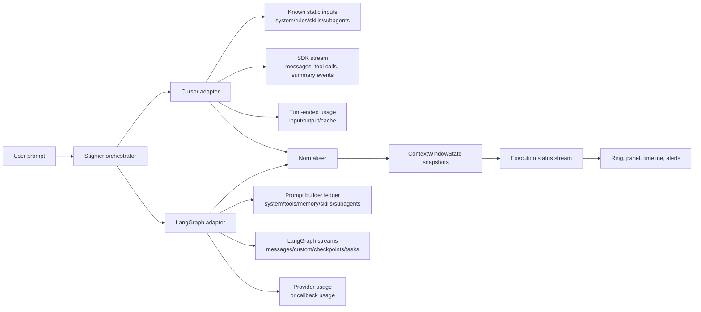

# Context Window Visibility for AI Agent Orchestration Platforms

## Executive assessment

The short answer is that **exact Cursor IDE parity is not currently achievable from the public `@cursor/sdk` alone**, while **a very strong first-party implementation is achievable for LangGraph** because LangGraph exposes the pieces needed to compute and stream your own context telemetry. Cursor’s public SDK gives you run streaming, structured conversation turns, summary events, tool lifecycle events, and per-turn usage totals, but it does **not** expose an IDE-style “context usage breakdown” API or a model `max_input_tokens` field. By contrast, LangGraph and Deep Agents expose structured prompt components, `max_input_tokens` via model profiles, node-level streaming metadata, checkpoints, and custom stream events, which is enough to build a unified `ContextWindowState` model in Stigmer. citeturn9view0turn9view3turn8view0turn7view1turn35view0turn28view2turn41view2turn36view0

The highest-confidence recommendation is a **hybrid design**. For the Cursor harness, show an **estimated live breakdown** plus a **turn-end reconciliation** against Cursor’s authoritative `TurnEndedUpdate.usage.inputTokens`. For the LangGraph harness, compute and stream a **first-class context snapshot** after each node, tool, checkpoint, or summarisation event. In other words: **approximate for Cursor, exact-or-near-exact for LangGraph**. citeturn9view0turn9view1turn41view2turn36view0turn35view1

| Harness | Live total fill | Category breakdown | Max context window | Recommended confidence label |
|---|---|---|---|---|
| **Cursor SDK** | **Medium confidence**: reliable at turn end from `turn-ended.usage`, estimated in-flight from local accounting only. citeturn9view0turn9view1 | **Medium-to-low confidence**: system/rules/skills/subagents can be estimated if Stigmer knows what was loaded; MCP and Cursor-managed dynamic context remain partly opaque. citeturn38view0turn40view0turn33view1turn8view0 | **Not exposed publicly** in `Cursor.models.list()`; keep a Stigmer model registry. citeturn8view0 | “Estimated” |
| **LangGraph** | **High confidence** if Stigmer owns prompt assembly and token counting; stream updates via `messages`, `custom`, `checkpoints`, and `tasks`. citeturn41view2turn41view3turn36view0 | **High confidence** for your own agents because prompt parts, tools, memory, skills, and subagent prompts are defined by your code. citeturn35view0turn20view1turn20view0 | **Available** through model profiles as `max_input_tokens`. citeturn28view2 | “Exact” or “Provider-counted” |

## What the Cursor SDK can and cannot tell you

Cursor’s public TypeScript SDK is unusually rich for orchestration, but it stops short of exposing the same telemetry the IDE now shows. The SDK documents `SDKMessage` events for `system`, `user`, `assistant`, `thinking`, `tool_call`, `status`, `task`, and `request`; raw `InteractionUpdate` variants such as `text-delta`, `thinking-delta`, `tool-call-started`, `tool-call-completed`, `token-delta`, `step-started`, `step-completed`, `turn-ended`, and summary events; `run.conversation()` for structured turns; and `turn-ended.usage` with `inputTokens`, `outputTokens`, `cacheReadTokens`, and `cacheWriteTokens`. I did **not** find a public SDK method or documented API surface that returns the IDE’s bucketed context telemetry. That conclusion is an inference from the published SDK surface and the context-usage changelog entry, not from a Cursor staff statement. citeturn9view0turn9view1turn9view2turn9view3turn7view1

That matters because Cursor’s IDE telemetry appears to be based on **internal harness knowledge**, not just raw token totals. Cursor’s own product and research material shows that context is not static: rules are injected as prompt-level instructions; skills are discovered progressively; MCP tool descriptions are loaded dynamically from files; long tool results are converted to files; terminal sessions are synced as files; and long chats are summarised when the context window fills. Those harness behaviours are exactly why a simple “sum all chat messages” approach will diverge from what Cursor shows natively. citeturn38view0turn40view0turn33view1turn33view3turn7view4turn34view4

The public SDK also leaves a few important gaps. `Cursor.models.list()` returns `id`, `displayName`, `description`, parameters, and variants, but no context-window size. The `system` message exposes tool names but not rules, skills, MCP descriptions, or subagent prompt material. `run.conversation()` gives you user messages, assistant messages, thinking messages, tool calls, shell commands, and shell output, but not the prompt-assembly ledger that would tell you how many tokens each bucket contributed to the active prompt. citeturn8view0turn9view3turn9view5

For Stigmer, that means the Cursor harness should be designed around **normalised estimation**. Compute relative bucket sizes from the prompt components Stigmer does know about, then reconcile those estimates against Cursor’s authoritative `inputTokens` at each `turn-ended` event. This works especially well for **system prompt**, **rules**, **skills metadata**, **known subagent definitions**, and **observable conversation history**. It is much weaker for **Cursor-managed MCP loading** and any **ambient configuration** you do not explicitly control. Cursor’s rules docs show that rules may arrive from Project Rules, User Rules, Team Rules, and `AGENTS.md`, and the SDK docs show that local agents can load project, user, team, MDM, and plugin settings, while cloud agents always load project, team, and plugins. If Stigmer wants telemetry that users trust, it should prefer a **deterministic context envelope** over reliance on ambient state. citeturn38view0turn8view0

That leads to a concrete feasibility judgement for Cursor: **real-time total-fill telemetry is feasible; exact bucket parity is not**. Show a live ring that updates from local estimates, mark it as “estimated”, then snap it to the official turn total at `turn-ended`. When summarisation begins or completes, the SDK already emits `summary-started` and `summary-completed`, so you can show a visible context-compaction event in the timeline. Cursor itself introduced “view context usage in chat” in mid-2025 and later added bucketed “context usage breakdown” in May 2026, but the public SDK still exposes only the lower-level primitives. citeturn9view0turn25view0turn7view1

## What LangGraph gives you that Cursor does not

LangGraph is the opposite of Cursor from a telemetry standpoint: it does **not** come with a built-in Cursor-style gauge, but it gives you enough control to build one properly. LangGraph’s Python streaming docs describe `messages` mode for token-by-token LLM output plus invocation metadata, `custom` mode for arbitrary app-defined events via `get_stream_writer`, `checkpoints` mode for checkpoint snapshots, `tasks` mode for step lifecycle, and `debug` mode for full execution detail. With `version="v2"`, all of these arrive in a unified `StreamPart` format. That is exactly the substrate you need for a Stigmer-native `ContextWindowState` stream. citeturn41view2turn41view3turn42view0

Deep Agents goes further by documenting the **assembled system prompt**. The official docs say the system message can include custom system prompt text, a base agent prompt, to-do list instructions, memory prompt content from `AGENTS.md`, skills prompt content, virtual filesystem prompt content, subagent prompt content, user-provided middleware prompts, and human-in-the-loop prompts. The same docs also explain that runtime context is **not** automatically injected into the prompt unless your middleware or tools add it. This is a very strong foundation for a category model because it lets Stigmer compute categories from **prompt construction**, not from guesswork. citeturn35view0turn35view2

LangGraph also has a straightforward answer to the denominator problem. LangChain chat models can expose a `profile` with `max_input_tokens`, and the Deep Agents tooling uses those model profiles for context-limit display and auto-summarisation thresholds. If profile data are stale or missing, the docs explicitly support overriding them. In other words, for LangGraph you do not need a hidden IDE-only signal to know the ceiling; you can treat the model profile as the default source of truth and let Stigmer override it when needed. citeturn28view2turn28view3

Checkpointing fills the remaining gap. LangGraph’s persistence layer saves a `StateSnapshot` at every step, and `graph.get_state()` / `graph.get_state_history()` let you retrieve the latest or historical checkpoints, including state `values`, `next` node names, and step metadata. If you stream `checkpoints`, your UI can update a context timeline after every durable state transition; if you need to reconstruct or debug context drift later, you can replay those snapshots. citeturn7view6turn36view0turn36view3

The main caveat is token accounting during streaming. LangChain documents `stream_usage=True` for `ChatOpenAI` and `AzureChatOpenAI` when you want usage metadata during streaming, and `UsageMetadataCallbackHandler` aggregates `AIMessage.usage_metadata` in `on_llm_end`. But official repo issues show that streaming plus callback usage accounting has had rough edges: adding callbacks could interfere with message streaming, and some `stream_mode=["updates","messages"]` or `ainvoke(..., stream=True)` paths have historically lost `usage_metadata`. Those issues are fixable at the app layer, but they mean Stigmer should not rely on a single callback path as its only source of truth. citeturn16view0turn17view0turn18view0turn18view1turn18view2turn18view3

The practical result is that **LangGraph real-time context telemetry is highly feasible**. Count prompt buckets before each model invocation, emit a `custom` context snapshot immediately after counting, stream token output separately via `messages`, and reconcile actual provider-reported usage when the call completes. Deep Agents already emits enough metadata to detect and label summarisation, including `lc_source == "summarization"` and documented summarisation thresholds based on `max_input_tokens`. Deep Agents also documents subagents as a tool for “context quarantine”, which maps cleanly to a Stigmer “Subagents” bucket. citeturn35view1turn20view1

## Recommended architecture and data flow

The architecture that best matches the evidence is a **shared telemetry pipeline with harness-specific adapters**. Cursor and LangGraph should not try to expose the same raw signals; they should emit the same **normalised snapshot** into Stigmer’s execution-status stream. Cursor will contribute a mixture of authoritative turn totals plus bucket estimates. LangGraph will contribute provider-counted or tokenizer-counted bucket totals plus explicit summary/checkpoint metadata. The UI should consume one protobuf shape regardless of harness. This is the only way to give users a consistent mental model while respecting the very different observability profiles of the two runtimes. citeturn9view0turn9view3turn41view2turn36view0turn35view0



For the **Cursor adapter**, the critical design move is a **shadow prompt ledger**. Every time Stigmer creates or resumes a Cursor agent, store the static components that Stigmer itself chose or can reproduce: model selection, system prompt fragments, any explicit rules or `AGENTS.md` content you mounted, explicit MCP server definitions, inline subagent definitions, and anything else your platform injected. During the run, add observable conversation items from `run.stream()` and `run.conversation()`, listen for summary events, and mark tool-call arguments/results that clearly entered the conversation. At `turn-ended`, scale the shadow-ledger bucket totals to Cursor’s official `inputTokens`. That produces a bucketed estimate whose denominator is exact even if the tokenizer or internal overhead is not. citeturn8view0turn9view0turn9view3turn9view5

For the **LangGraph adapter**, use a **pre-invocation calculator plus streamed snapshots**. Before every model call, count each category from the prompt builder itself: system prompt blocks, memory, skills metadata or loaded skill text, visible tool schemas and tool prompts, conversation history from state, subagent prompts, and any retrieved or offloaded material that will be added to messages. Emit that snapshot with `get_stream_writer()` in `custom` mode, then attach actual provider usage after the call completes. Stream `checkpoints` and `tasks` as a timeline source, and use `messages` mode for token-flow UX. Because LangGraph already exposes node metadata such as `langgraph_node`, you can attach token generation and context growth to specific nodes in the UI. citeturn41view2turn41view3turn42view0turn36view0

A small but important architecture decision is where to get token counts. For **Anthropic** and **Gemini**, official APIs support preflight token counting; Anthropic’s Count Tokens endpoint can count a Message including tools, images, and documents without generating a response, and Gemini exposes `models.countTokens`. For **OpenAI-family** models, provider responses expose `usage` with `input_tokens`, `output_tokens`, cached-token details, and reasoning-token details after inference, while `tiktoken` is the canonical fast local tokenizer for OpenAI models. In practice, Stigmer should prefer **provider-native preflight counting when it has direct provider access**, and fall back to a model-specific local tokenizer otherwise. Cursor is the exception because the provider is abstracted behind Cursor; there, turn-end normalisation is the right compromise. citeturn5search0turn29view1turn30view0turn29view2

External observability platforms are useful here, but only as **adjuncts**. LangSmith is designed for traces and can aggregate token-based costs from counts already present in invocations. Langfuse, Langtrace, and Phoenix likewise focus on traces, usage, cost, latency, and debugging. They are valuable for audits, replay, and cost analytics, but none of their official docs describe them as a drop-in source of “current active context window by category” inside your product. Inference: treat them as **backfill and validation**, not as the primary live context gauge. citeturn7view9turn21search0turn21search3turn21search10turn21search2turn21search5

## Unified proto and harness implementation patterns

A good unified message should represent a **snapshot**, not just a final total. The right granularity is therefore **per recalculation** — normally per turn-end for Cursor, and per node/tool/checkpoint for LangGraph — with execution, turn, and step identifiers so the UI can render both “current state” and a timeline. The shape below is intentionally broader than Cursor’s current buckets, because LangGraph and future harnesses will need categories like memory, file context, retrieved context, and summaries even if the first Stigmer UI collapses them into Cursor-like labels. The fields for `confidence`, `count_method`, and `exact` are essential because the Cursor path is estimated while the LangGraph path can often be exact. Cursor’s own usage data includes input, output, cache-read, and cache-write totals; OpenAI-family APIs can also expose cached and reasoning-token detail; Deep Agents and LangGraph can expose summarisation and checkpoint events. citeturn9view1turn30view0turn35view1turn36view0

```proto
syntax = "proto3";

package stigmer.execution.v1;

message ContextWindowState {
  string execution_id = 1;
  string harness = 2;              // "cursor_sdk" | "langgraph"
  string run_id = 3;
  string thread_id = 4;
  int32 turn_index = 5;
  int32 step_index = 6;

  string model_id = 7;
  uint64 max_input_tokens = 8;     // denominator shown in UI
  uint64 input_tokens_current = 9; // current active prompt estimate or exact count
  uint64 output_tokens_current = 10;
  uint64 cache_read_tokens = 11;
  uint64 cache_write_tokens = 12;
  uint64 reasoning_tokens = 13;

  double fill_ratio = 14;          // 0.0 - 1.0
  bool exact = 15;                 // exact snapshot vs estimated
  string count_method = 16;        // "provider_count", "provider_usage", "tokenizer", "normalised_estimate"
  string confidence = 17;          // "high" | "medium" | "low"

  repeated ContextCategory categories = 18;

  uint32 summarisation_count = 19;
  bool summarisation_in_progress = 20;
  bool just_summarised = 21;

  string updated_at = 22;          // RFC3339
  string note = 23;                // e.g. "Cursor-managed MCP load not fully observable"
}

message ContextCategory {
  string key = 1;                  // system_prompt, tools, rules, skills, mcp, subagents, conversation, memory, retrieved, summary, other
  string label = 2;
  uint64 tokens = 3;
  bool exact = 4;
  string confidence = 5;
  repeated string sources = 6;     // file paths, tool names, node names, rule ids
}
```

For the **Cursor SDK implementation**, the most useful code pattern is an **estimator plus reconciler**. The estimator counts what Stigmer can see; the reconciler rescales to Cursor’s official input total at turn end.

```ts
type Bucket =
  | "system_prompt"
  | "rules"
  | "skills"
  | "mcp"
  | "subagents"
  | "conversation"
  | "tools"
  | "summary"
  | "other";

interface BucketState {
  estimated: number;
  exact: boolean;
  confidence: "high" | "medium" | "low";
  sources: string[];
}

async function streamCursorContext(run: Run, staticInputs: {
  modelId: string;
  maxInputTokens: number; // from Stigmer registry, not Cursor SDK
  systemPromptText: string;
  ruleTexts: Array<{id: string; text: string}>;
  skillTexts: Array<{id: string; text: string}>;
  subagentPrompts: Array<{name: string; text: string}>;
}) {
  const buckets: Record<Bucket, BucketState> = {
    system_prompt: { estimated: count(staticInputs.systemPromptText), exact: false, confidence: "medium", sources: ["system"] },
    rules: { estimated: sum(staticInputs.ruleTexts.map(r => count(r.text))), exact: false, confidence: "medium", sources: staticInputs.ruleTexts.map(r => r.id) },
    skills: { estimated: sum(staticInputs.skillTexts.map(s => count(s.text))), exact: false, confidence: "medium", sources: staticInputs.skillTexts.map(s => s.id) },
    subagents: { estimated: sum(staticInputs.subagentPrompts.map(a => count(a.text))), exact: false, confidence: "medium", sources: staticInputs.subagentPrompts.map(a => a.name) },
    mcp: { estimated: 0, exact: false, confidence: "low", sources: [] },
    conversation: { estimated: 0, exact: false, confidence: "medium", sources: [] },
    tools: { estimated: 0, exact: false, confidence: "low", sources: [] },
    summary: { estimated: 0, exact: false, confidence: "medium", sources: [] },
    other: { estimated: 0, exact: false, confidence: "low", sources: [] },
  };

  for await (const ev of run.stream()) {
    if (ev.type === "user") {
      buckets.conversation.estimated += countTextBlocks(ev.message.content);
    } else if (ev.type === "assistant") {
      buckets.conversation.estimated += countAssistantBlocks(ev.message.content);
    } else if (ev.type === "thinking") {
      buckets.conversation.estimated += count(ev.text);
    } else if (ev.type === "tool_call") {
      // Cursor warns args/result are unstable; parse defensively.
      buckets.tools.estimated += countJsonSafely(ev.args) + countJsonSafely(ev.result);
    }

    // Emit a live estimated snapshot if desired.
  }
}

function reconcileToTurnEnded(
  buckets: Record<Bucket, BucketState>,
  inputTokens: number,
  usage: { outputTokens?: number; cacheReadTokens?: number; cacheWriteTokens?: number }
) {
  const estimatedTotal = Object.values(buckets).reduce((n, b) => n + b.estimated, 0) || 1;
  const categories = Object.entries(buckets).map(([key, b]) => ({
    key,
    tokens: Math.round((b.estimated / estimatedTotal) * inputTokens),
    exact: false,
    confidence: b.confidence,
    sources: b.sources,
  }));

  return {
    inputTokensCurrent: inputTokens,
    outputTokensCurrent: usage.outputTokens ?? 0,
    cacheReadTokens: usage.cacheReadTokens ?? 0,
    cacheWriteTokens: usage.cacheWriteTokens ?? 0,
    categories,
    exact: false,
    countMethod: "normalised_estimate",
  };
}
```

That pattern fits the Cursor evidence well because the SDK explicitly guarantees `turn-ended.usage`, `run.conversation()`, tool lifecycle events, and summary events, while also warning that tool call payloads are unstable and documentation does not spell out a full context-breakdown API. citeturn9view0turn9view3turn9view5

For the **LangGraph implementation**, the most robust pattern is a **prompt-ledger calculator** that emits `custom` telemetry, plus provider usage reconciliation.

```python
from typing import TypedDict, Any
from langgraph.config import get_stream_writer
from langgraph.graph import StateGraph, START
from langchain_core.callbacks import UsageMetadataCallbackHandler
from langchain.chat_models import init_chat_model

class State(TypedDict):
    messages: list
    context_window_state: dict[str, Any]

def count_tokens_for_model(model, messages) -> int:
    # Prefer provider-native token counting where you have it.
    # Fall back to local tokenizer / model-specific counter.
    return my_count(messages, model)

def build_context_snapshot(state: State, model, prompt_parts: dict[str, Any]) -> dict[str, Any]:
    categories = {
        "system_prompt": count_tokens_for_model(model, prompt_parts["system_messages"]),
        "tools": count_tokens_for_model(model, prompt_parts["tool_schemas_and_prompts"]),
        "rules": count_tokens_for_model(model, prompt_parts.get("rules", [])),
        "skills": count_tokens_for_model(model, prompt_parts.get("skills", [])),
        "subagents": count_tokens_for_model(model, prompt_parts.get("subagent_prompts", [])),
        "conversation": count_tokens_for_model(model, state["messages"]),
    }
    current = sum(categories.values())
    max_input = model.profile.get("max_input_tokens", 0)

    return {
        "model_id": getattr(model, "model_name", None) or str(model),
        "max_input_tokens": max_input,
        "input_tokens_current": current,
        "fill_ratio": (current / max_input) if max_input else None,
        "categories": categories,
        "exact": True,
        "count_method": "provider_count_or_tokenizer",
        "confidence": "high",
    }

cb = UsageMetadataCallbackHandler()
model = init_chat_model("openai:gpt-5.4-mini", stream_usage=True)

def llm_node(state: State):
    writer = get_stream_writer()

    prompt_parts = assemble_prompt_parts_for_stigmer(state)
    snapshot = build_context_snapshot(state, model, prompt_parts)
    writer({"type": "context_window_state", "data": snapshot})

    response = model.invoke(
        prompt_parts["system_messages"] + state["messages"],
        config={"callbacks": [cb]},
    )

    return {
        "messages": [response],
        "context_window_state": snapshot,
    }

graph = (
    StateGraph(State)
    .add_node("llm_node", llm_node)
    .add_edge(START, "llm_node")
    .compile()
)
```

That approach aligns with official LangGraph streaming semantics, custom-event support, model-profile metadata, and checkpoint retrieval. If you run Deep Agents rather than a raw `StateGraph`, you can map the documented prompt parts directly into categories rather than reconstructing them from scratch. citeturn41view2turn41view3turn35view0turn28view2turn36view0

## UI patterns, product recommendations, and cross-platform comparison

The best web UX is a **three-layer design**. First, put a small **ring or pill** beside the composer input showing the current fill percentage and token count, because that is the fastest “should I worry?” signal. Secondly, open a **details drawer** on click with a stacked bar / table of categories. Thirdly, add a **timeline strip** above the transcript showing turns, summaries, and large step changes. Cursor’s own history supports the ring-plus-breakdown mental model, while LangGraph’s streaming and checkpoint model makes the timeline especially useful. citeturn25view0turn7view1turn41view2turn36view0

The most important UI copy decision is to make the epistemic status visible. For Cursor-backed runs, label the panel **“Estimated breakdown, reconciled to Cursor turn totals”**. For LangGraph-backed runs, use **“Exact”**, **“Provider-counted”**, or **“Tokenizer-estimated”**. Users do not need perfect parity; they need **trustworthy diagnostics**. Hiding uncertainty would be much more damaging than surfacing it. That is especially true for MCP and dynamic context-discovery cases, where Cursor itself intentionally avoids loading everything up front. citeturn33view1turn40view0

Summarisation needs its own visible treatment. For Cursor, expose a marker when `summary-started` / `summary-completed` occur, and show “conversation compacted” with a before/after delta. For LangGraph Deep Agents, show a similar marker when tokens from `lc_source == "summarization"` appear or when a checkpoint records the summarised state. This gives users a concrete explanation for the classic “why did the agent suddenly forget part of the thread?” complaint. Cursor’s changelog and research posts, and Deep Agents’ context-engineering docs, all point to summarisation as a normal operating-mode transition rather than an exceptional error. citeturn9view0turn7view4turn34view4turn35view1

Accessibility should not be an afterthought. If you render a gauge, expose it as a `progressbar` with an accessible name and updated `aria-valuenow`, `aria-valuemin`, and `aria-valuemax` as appropriate. Do not rely on colour alone to show category differences, and make the ring segments, stacked bars, or legends meet non-text contrast expectations of at least 3:1 where they convey meaning. In practice, the safest design is colour **plus** labels, patterns, and precise token counts. citeturn22search0turn22search1turn22search2turn22search4

A useful market comparison is that **Cursor is unusually explicit**. Cursor publicly documents in-chat context usage and now a context-usage breakdown by category. Sourcegraph Cody publicly documents token limits by context source, including separate limits for `@`-mention context and conversation context. Windsurf’s public docs emphasise quotas, token-based billing, model selection, and context-aware retrieval features such as Fast Context rather than a Cursor-like in-chat bucket ledger. OpenAI’s public documentation focuses on model limits and usage dashboards/API usage rather than an IDE-style per-category context ring in the help material. That means Stigmer does not need to mimic every platform; it only needs to meet the stronger diagnostic standard that Cursor has now set for orchestration-heavy coding agents. citeturn25view0turn7view1turn23search2turn23search10turn23search13turn23search3turn23search0

| Approach | Cursor SDK harness | LangGraph harness | External observability |
|---|---|---|---|
| **Best source for live fill** | `turn-ended.usage.inputTokens` plus local estimate in-flight. citeturn9view1 | Pre-invocation bucket count against `max_input_tokens`, streamed via `custom`. citeturn28view2turn41view3 | Not ideal for live UX; better for traces and audits. citeturn7view9turn21search0turn21search2 |
| **Best source for categories** | Shadow prompt ledger from Stigmer + observed conversation, normalised to Cursor totals. | Prompt builder itself; categories computed before each model call. | Usually invocation-level token/cost tracing, not active-context buckets. citeturn21search3turn21search10 |
| **Summary visibility** | Native SDK summary events. citeturn9view0 | `lc_source == "summarization"` plus checkpoints. citeturn35view1turn36view0 |
| **User-facing label** | “Estimated” | “Exact” / “Provider-counted” | “Trace details” |

## Open questions and limitations

The main unresolved question is whether Cursor will expose its internal context telemetry through a public SDK or API in the future. As of **13 May 2026**, I found the public context-breakdown product announcement and the public SDK surface, but I did **not** find a documented Cursor SDK or Cloud Agents API endpoint that returns IDE-style bucket totals directly. If Cursor adds such an API, it would materially simplify the Cursor half of this design. citeturn7view1turn8view0turn9view0

A second limitation is that Cursor’s SDK documentation does not explain the accounting semantics of `token-delta.tokens`, and the SDK does not expose the model context ceiling in `Cursor.models.list()`. That makes the safest Cursor implementation one that treats `turn-ended.usage` as authoritative, stores its own model-window registry, and makes bucket uncertainty explicit in the UI. citeturn9view0turn8view0

On the LangGraph side, the remaining limitation is not conceptual but operational: streaming usage metadata has had version- and mode-specific bugs in official issue trackers, especially when mixing `messages` mode with callback-based accounting. Stigmer should therefore implement **dual-path accounting** — prompt-ledger counting as the primary method, provider usage metadata as reconciliation, and checkpoints/custom events as the transport. citeturn16view0turn17view0turn18view0turn18view1turn18view2turn18view3

The resulting product recommendation is clear: **ship a unified `ContextWindowState` now**, position Cursor-backed numbers as estimated-but-reconciled, position LangGraph-backed numbers as exact when possible, and make summarisation and confidence visible first-class concepts in the UI. That would meet your early adopters’ request for recurrent context visibility without pretending that the two harnesses have identical observability. citeturn7view1turn35view0turn41view2

Extended Thinking:

According to a document from **2026-05-13**, Stigmer’s current gap is not simply “token usage is missing.” It is specifically that the React SDK shows some per-message token information, `cursor-runner` processes Cursor SDK stream events but does not expose aggregate context-window state, `agent-runner` does not track context state, and existing `TokenUsage` protos are not populated for Cursor harness runs. A separate 2026-05-13 Stigmer usage note says `cursor-runner` already sees `TurnEndedUpdate.usage`, but does not persist per-turn counts, aggregate them, or forward them into metering; LangGraph usage works today because the runner intercepts direct provider response metadata.

The practical conclusion: **Stigmer can ship useful context-window visibility now, but not a byte-for-byte clone of Cursor IDE’s internal gauge for Cursor SDK runs.** For Cursor SDK, you can build a **hybrid observed + estimated + reconciled** model. For LangGraph, you can build a much more exact model because Stigmer controls prompt construction, graph state, tool schemas, memory, retrieval, and provider invocation.

---

# 1. Executive feasibility assessment

| Question                                                              |                                                                                                                                                                                                                                           Cursor SDK harness |                                                                                                                                      LangGraph harness |
| --------------------------------------------------------------------- | -----------------------------------------------------------------------------------------------------------------------------------------------------------------------------------------------------------------------------------------------------------: | -----------------------------------------------------------------------------------------------------------------------------------------------------: |
| Can we get exact Cursor IDE-style context breakdown from public APIs? |                **No public evidence found.** Cursor publicly documents context breakdown in the IDE, but the SDK docs/blog expose run streaming, conversation, wait, cancel, MCP, skills, hooks, and subagents—not an API for the IDE’s exact context gauge. | **No built-in gauge**, but Stigmer can construct one because it controls the actual messages, tools, memory, retrieval, MCP adapters, and model calls. |
| Can we get authoritative token usage after each model turn?           |                                                                                      **Mostly yes**, via `turn-ended.usage` when present; Stigmer already sees this but does not persist/aggregate it. Treat optional/missing usage as a known failure mode. |                       **Yes**, via provider response metadata / LangChain `AIMessage.usage_metadata` / callback handlers, with some streaming caveats. |
| Can we estimate “current context window used” before/during a run?    | **Partially.** Count Stigmer-controlled inputs and observed SDK messages, then calibrate against `inputTokens`. Hidden Cursor harness context, pruning, summarization, rules, skills loading, MCP selection, and internal compression are not fully visible. |   **Yes, high confidence.** Pre-count the exact message list and tool schemas just before each LLM call. Reconcile with provider usage after the call. |
| Can we break down by Cursor-like categories?                          |                                                                                                                                           **Approximate only.** Use Stigmer-controlled categories plus an explicit `CURSOR_MANAGED_UNKNOWN` residual bucket. |                                                                          **Yes.** Require prompt assembly to emit typed `ContextContribution` records. |
| Can UI update in real time?                                           |                                                                                                                                                         **Yes, but estimated.** Update on SDK messages, tool-call events, token deltas, and post-turn usage. |                                                    **Yes.** Emit `context_state` through LangGraph custom streams and update after each node/LLM call. |
| Should Stigmer ship this?                                             |                                                                                                                                                                               **Yes.** Label confidence. Do not pretend it is Cursor’s exact internal gauge. |                                                                                                 **Yes.** This can become the canonical implementation. |

**Recommended product stance:** show the same UX pattern across both harnesses, but show confidence and provenance. For Cursor SDK runs, label the gauge as **“Estimated from SDK stream + reported usage”**. For LangGraph runs, label it as **“Measured before each model call + reconciled with provider usage.”**

---

# 2. What Cursor exposes, and what it does not

Cursor publicly announced the SDK as a way to build programmatic agents with the same runtime, harness, models, MCP servers, skills, hooks, and subagents used by Cursor’s other surfaces; the blog examples show `Agent.create`, `agent.send`, and consuming `run.stream()` events, but do not describe a context-window-state API. ([Cursor][1])

Cursor also documents IDE-level **Context Usage Breakdown** in Cursor 3.3, specifically to diagnose context issues across rules, skills, MCPs, and subagents. That is an IDE capability, not documented as a public SDK field. ([Cursor][2])

Cursor’s dynamic-context work explains why a third-party wrapper cannot trivially reconstruct the IDE’s exact gauge: Cursor may turn long tool responses into files, reference chat history during summarization, load only relevant MCP tools, support Agent Skills as discoverable files, and treat terminal sessions as file-like context. Those decisions happen inside Cursor’s context manager. ([Cursor][3])

Cursor’s context docs define context broadly as both “intent context” such as prompts/instructions and “state context” such as errors, logs, images, and code chunks; their model docs say Cursor normally uses a 200k-token context window and actively optimizes/prunes context, while Max Mode can extend to larger model-specific windows. ([Cursor Documentation][4])

I also inspected the published `@cursor/sdk` package type surface. The relevant exposed operations are `stream()`, `wait()`, `cancel()`, and `conversation()`. `RunResult` exposes run metadata such as id/status/model/duration/git result, but not a context-window-state object. `SDKMessage` exposes message/tool/status/task/request-style events, not category-level context usage. The useful SDK hooks are therefore the stream messages plus `onDelta`/`onStep`, not a native context-gauge API.

**Cursor SDK answer:** no public Cursor SDK API currently appears to expose the exact IDE context breakdown. The correct implementation is approximation plus reconciliation, not extraction.

---

# 3. What LangGraph exposes, and what it does not

LangGraph exposes streaming modes for `values`, `updates`, `messages`, `custom`, `checkpoints`, and `tasks`. That means Stigmer can emit its own context-state events while the graph runs, including custom progress/context telemetry. ([LangChain Docs][5])

LangGraph persistence stores graph state as checkpoints when compiled with a checkpointer; checkpoints are organized by thread and enable human-in-the-loop, conversational memory, time travel, and fault-tolerant execution. This is useful for restoring context telemetry snapshots, but checkpoints do **not** magically provide token accounting unless Stigmer stores context state in graph state or emits it as custom stream data. ([LangChain Docs][6])

LangChain standardizes usage metadata on AI messages with `input_tokens`, `output_tokens`, `total_tokens`, and optional details such as cache and reasoning tokens. Its `UsageMetadataCallbackHandler` can aggregate usage by model, but streaming requires careful callback placement and provider support. ([LangChain Reference Docs][7])

Community reports show that usage callbacks and streaming can conflict or silently miss usage depending on how callbacks are passed; one workaround is to pass callbacks through `graph.stream(..., config={"callbacks": [...]}, stream_mode="messages")` rather than attaching them only at model construction. ([Stack Overflow][8])

**LangGraph answer:** LangGraph does not provide a context gauge out of the box, but it gives Stigmer the right hooks to build a more accurate one than is possible with Cursor SDK.

---

# 4. Recommended architecture

Build a **Context Telemetry Layer** shared by both harnesses.

It should have three jobs:

1. **Collect contributions** before and during execution: system prompt, tools, rules, skills, MCP, subagents, conversation, memory summaries, retrieved context, tool results, unknown/residual.
2. **Estimate or count tokens** using model-appropriate counters.
3. **Reconcile estimates** with authoritative usage after each model call.

## 4.1 Data flow: Cursor SDK harness

```text
User / React SDK
   |
   | sends message
   v
stigmer-service / Temporal workflow
   |
   | ExecuteCursor activity
   v
cursor-runner
   |
   | Agent.create / Agent.resume / agent.send
   v
@cursor/sdk
   |
   | SDKMessage stream + onDelta + onStep
   v
CursorContextAdapter
   |
   | observed messages, tool calls, token-delta, turn-ended usage
   v
ContextTelemetryAggregator
   |
   | estimated snapshot + reconciled snapshot
   v
ExecutionStatus.ContextWindowState
   |
   | streamed/persisted via service
   v
React Context Gauge + Context Panel
```

For Cursor SDK, treat the current context as:

```text
current_context_estimate =
  Stigmer-known prompt components
+ observed conversation/messages/tool results
+ MCP/rules/skills metadata Stigmer supplied or configured
+ calibrated residual from Cursor-managed hidden harness
```

After each `turn-ended.usage.inputTokens`, compute:

```text
residual_tokens =
  reported_input_tokens
- estimated_visible_input_tokens
```

Then:

* If residual is positive, put it into `CURSOR_MANAGED_UNKNOWN`.
* If residual is negative, mark estimates as over-counted and rescale low-confidence categories.
* Store both the raw estimate and reconciled total.

This is the only honest way to approach Cursor SDK until Cursor exposes the same internal context compiler/gauge the IDE uses.

## 4.2 Data flow: LangGraph harness

```text
User / React SDK
   |
   v
stigmer-service / Temporal workflow
   |
   v
agent-runner
   |
   | graph.astream(..., stream_mode=["messages", "updates", "custom", "checkpoints"])
   v
LangGraph StateGraph
   |
   | before each LLM node:
   |   assemble messages + tools + retrieval + memory
   v
ContextMeter.pre_count()
   |
   | emits custom context_state event
   v
Chat model invoke / stream
   |
   | AIMessage.usage_metadata or UsageMetadataCallbackHandler
   v
ContextMeter.reconcile()
   |
   | emits reconciled context_state event
   v
ExecutionStatus.ContextWindowState
   |
   v
React Context Gauge + Context Panel
```

For LangGraph, do **not** reconstruct context after the fact from messages. Instrument the actual prompt assembly path. Every prompt builder should return both:

```typescript
{
  messages: BaseMessage[];
  tools: ToolSchema[];
  contextContributions: ContextContribution[];
}
```

That makes the UI breakdown an artifact of prompt construction, not a fragile log parser.

---

# 5. Unified proto design

Below is a concrete `ContextWindowState` schema that works for both Cursor SDK and LangGraph.

```proto
syntax = "proto3";

package stigmer.execution.v1;

import "google/protobuf/timestamp.proto";

enum HarnessKind {
  HARNESS_KIND_UNSPECIFIED = 0;
  HARNESS_KIND_CURSOR_SDK = 1;
  HARNESS_KIND_LANGGRAPH = 2;
}

enum ContextCategory {
  CONTEXT_CATEGORY_UNSPECIFIED = 0;

  CONTEXT_CATEGORY_SYSTEM_PROMPT = 1;
  CONTEXT_CATEGORY_TOOLS = 2;
  CONTEXT_CATEGORY_RULES = 3;
  CONTEXT_CATEGORY_SKILLS = 4;
  CONTEXT_CATEGORY_MCP = 5;
  CONTEXT_CATEGORY_SUBAGENTS = 6;
  CONTEXT_CATEGORY_CONVERSATION = 7;

  CONTEXT_CATEGORY_MEMORY_SUMMARY = 8;
  CONTEXT_CATEGORY_RETRIEVED_CONTEXT = 9;
  CONTEXT_CATEGORY_TOOL_RESULTS = 10;
  CONTEXT_CATEGORY_THINKING = 11;

  // Important for Cursor SDK where some context is managed internally.
  CONTEXT_CATEGORY_HARNESS_MANAGED_UNKNOWN = 90;
  CONTEXT_CATEGORY_OTHER = 99;
}

enum TokenMeasurementKind {
  TOKEN_MEASUREMENT_KIND_UNSPECIFIED = 0;

  // Provider-reported usage after an LLM call.
  TOKEN_MEASUREMENT_KIND_PROVIDER_REPORTED = 1;

  // Counted with provider API, e.g. Anthropic count_tokens.
  TOKEN_MEASUREMENT_KIND_PROVIDER_COUNTED = 2;

  // Counted with local tokenizer, e.g. tiktoken / model tokenizer.
  TOKEN_MEASUREMENT_KIND_TOKENIZER_ESTIMATED = 3;

  // Character approximation fallback.
  TOKEN_MEASUREMENT_KIND_CHARACTER_ESTIMATED = 4;

  // Hybrid estimate reconciled to observed provider/SDK usage.
  TOKEN_MEASUREMENT_KIND_RECONCILED = 5;
}

enum ContextConfidence {
  CONTEXT_CONFIDENCE_UNSPECIFIED = 0;
  CONTEXT_CONFIDENCE_EXACT = 1;
  CONTEXT_CONFIDENCE_HIGH = 2;
  CONTEXT_CONFIDENCE_MEDIUM = 3;
  CONTEXT_CONFIDENCE_LOW = 4;
}

message TokenCounts {
  int64 input_tokens = 1;
  int64 output_tokens = 2;
  int64 total_tokens = 3;

  int64 cache_read_tokens = 4;
  int64 cache_write_tokens = 5;
  int64 reasoning_tokens = 6;

  // Useful when the input side is estimated but output is observed.
  int64 estimated_input_tokens = 7;
  int64 estimated_total_tokens = 8;
}

message ContextContribution {
  string id = 1;
  ContextCategory category = 2;
  string label = 3;

  // Examples:
  // "system_prompt", "tool_schema", "mcp_tool_description",
  // "skill_manifest", "conversation_turn", "tool_result",
  // "retrieved_doc", "memory_summary", "cursor_residual".
  string contribution_type = 4;

  TokenCounts tokens = 5;
  TokenMeasurementKind measurement_kind = 6;
  ContextConfidence confidence = 7;

  // Whether this contribution is believed to be in the current model request,
  // not merely part of lifetime execution history.
  bool included_in_current_context = 8;

  // Optional pointer to source object:
  // message id, tool call id, MCP server id, skill id, rule id, checkpoint id.
  string source_ref = 9;

  // Redacted preview only; never store secrets/full tool outputs here.
  string redacted_preview = 10;

  map<string, string> attributes = 11;
}

message ContextCategoryUsage {
  ContextCategory category = 1;
  string label = 2;

  TokenCounts tokens = 3;
  double percent_of_current_context = 4;

  TokenMeasurementKind measurement_kind = 5;
  ContextConfidence confidence = 6;

  repeated ContextContribution top_contributions = 7;
}

enum ContextEventKind {
  CONTEXT_EVENT_KIND_UNSPECIFIED = 0;
  CONTEXT_EVENT_KIND_LLM_CALL_STARTED = 1;
  CONTEXT_EVENT_KIND_LLM_CALL_ENDED = 2;
  CONTEXT_EVENT_KIND_STEP_STARTED = 3;
  CONTEXT_EVENT_KIND_STEP_COMPLETED = 4;
  CONTEXT_EVENT_KIND_SUMMARIZATION_STARTED = 5;
  CONTEXT_EVENT_KIND_SUMMARIZATION_COMPLETED = 6;
  CONTEXT_EVENT_KIND_CONTEXT_PRUNED = 7;
  CONTEXT_EVENT_KIND_TOOL_RESULT_TRUNCATED = 8;
  CONTEXT_EVENT_KIND_CHECKPOINT_CREATED = 9;
  CONTEXT_EVENT_KIND_BUDGET_WARNING = 10;
}

message ContextEvent {
  string id = 1;
  ContextEventKind kind = 2;
  google.protobuf.Timestamp observed_at = 3;

  string run_id = 4;
  string step_id = 5;
  string node_name = 6;

  TokenCounts before_tokens = 7;
  TokenCounts after_tokens = 8;

  string summary = 9;
  map<string, string> attributes = 10;
}

message ContextWindowState {
  string execution_id = 1;
  string session_id = 2;
  string run_id = 3;
  string agent_id = 4;

  HarnessKind harness = 5;
  string model_id = 6;

  google.protobuf.Timestamp observed_at = 7;

  int64 max_context_tokens = 8;
  int64 max_output_tokens = 9;

  // Best current estimate of what the model sees now.
  TokenCounts current_context_tokens = 10;

  // Last model call usage, when available.
  TokenCounts last_llm_call_tokens = 11;

  double used_ratio = 12;

  TokenMeasurementKind measurement_kind = 13;
  ContextConfidence confidence = 14;

  repeated ContextCategoryUsage categories = 15;
  repeated ContextEvent recent_events = 16;

  int32 summarization_count = 17;
  int32 pruning_count = 18;

  bool context_was_compacted = 19;
  google.protobuf.Timestamp last_compaction_at = 20;

  // True if the runner could not observe the current context directly.
  bool estimated = 21;

  // Human-readable caveat, e.g.
  // "Cursor SDK does not expose internal context breakdown; residual assigned to Harness Managed."
  string caveat = 22;

  map<string, string> attributes = 23;
}

message ContextWindowStateDelta {
  string execution_id = 1;
  string session_id = 2;
  string run_id = 3;

  google.protobuf.Timestamp observed_at = 4;

  ContextWindowState snapshot = 5;
  repeated ContextCategoryUsage changed_categories = 6;
  repeated ContextEvent new_events = 7;
}
```

## Why this schema works

It separates four concepts users often conflate:

1. **Current context window**: what the model is likely seeing now.
2. **Last LLM call usage**: provider/SDK-reported input/output tokens for the most recent call.
3. **Lifetime tokens/cost**: billing/metering across the whole execution.
4. **Context history**: summarization, pruning, tool-output truncation, checkpoints.

That distinction matters. A recent OpenAI Codex CLI issue shows the confusion caused when status UI mixes current-window usage with cumulative token totals. ([GitHub][9])

---

# 6. Category model Stigmer should use

Use Cursor-compatible labels, but add the categories Stigmer needs for honesty and debugging.

| Category                  | Definition                                                                 | Cursor SDK treatment                                                                                                                                                                              | LangGraph treatment                                                 |
| ------------------------- | -------------------------------------------------------------------------- | ------------------------------------------------------------------------------------------------------------------------------------------------------------------------------------------------- | ------------------------------------------------------------------- |
| System Prompt             | Stigmer core harness instructions, agent instructions, mode instructions.  | Count what Stigmer supplies; hidden Cursor system context goes to residual.                                                                                                                       | Exact: prompt builder emits contribution.                           |
| Tools                     | Built-in tool schemas/descriptions available to the model.                 | Count known tools from SDK/system/tool metadata where observable.                                                                                                                                 | Exact: count `bind_tools` / OpenAI tools / Anthropic tools.         |
| Rules                     | `.cursor/rules`, project/org policy, user rules.                           | Count Stigmer-known rules; Cursor-internal rule loading may be hidden.                                                                                                                            | Exact if Stigmer loads/injects rules.                               |
| Skills                    | Skill manifests/instructions available to the agent.                       | Count Stigmer-configured skills; Cursor dynamic discovery may be hidden.                                                                                                                          | Exact if Stigmer passes skill content/manifests.                    |
| MCP                       | MCP server/tool descriptions plus MCP-provided context currently included. | Count configured MCP definitions; unknown Cursor MCP selection goes to residual. Cursor docs note disabled MCP tools are not loaded into context/available to Agent. ([Cursor Documentation][10]) | Exact if Stigmer owns MCP adapter/tool schema assembly.             |
| Subagents                 | Delegated agent prompts/results/summaries.                                 | Count observed subagent messages if SDK exposes them; otherwise residual.                                                                                                                         | Exact if subgraphs/subagents are instrumented.                      |
| Conversation              | User/assistant messages in current prompt.                                 | Estimate from `SDKMessage` and `run.conversation()`.                                                                                                                                              | Exact from `state.messages`.                                        |
| Tool Results              | Tool output text included in later model calls.                            | Approximate; Cursor may file-ize long outputs.                                                                                                                                                    | Exact if Stigmer decides what is included vs stored externally.     |
| Memory Summary            | Durable summaries/compactions.                                             | Count Stigmer summaries if replaying; Cursor internal summaries may be hidden.                                                                                                                    | Exact if Stigmer injects memory summaries.                          |
| Retrieved Context         | Search/RAG/code snippets.                                                  | Count only Stigmer-provided retrieval.                                                                                                                                                            | Exact from retriever node outputs.                                  |
| Harness Managed / Unknown | Residual tokens needed to reconcile observed usage.                        | Essential.                                                                                                                                                                                        | Rare; use only for provider overhead or unclassified contributions. |

---

# 7. Cursor SDK implementation approach

## 7.1 What to capture

Capture four event classes:

1. **SDK messages** from `run.stream()`:

   * user/assistant/thinking/system
   * tool_call args/results/truncation
   * task/status/request metadata

2. **Interaction deltas** from `onDelta`:

   * token deltas
   * tool-call started/completed
   * step started/completed
   * turn ended with optional usage
   * summary started/completed, if present in SDK stream types

3. **Conversation snapshots** from `run.conversation()`:

   * useful post-hoc for estimating visible conversation/tool history
   * not sufficient for hidden Cursor-managed context

4. **Admin API reconciliation**:

   * Cursor Admin API exposes team usage/spend and `filtered-usage-events` with token usage/cost fields, but not a clearly documented per-SDK-run id in the public response shape. Use it for billing reconciliation/backfill, not live context UI. ([Cursor Documentation][11])

## 7.2 Cursor runner code pattern

```ts
type ContextCategory =
  | "SYSTEM_PROMPT"
  | "TOOLS"
  | "RULES"
  | "SKILLS"
  | "MCP"
  | "SUBAGENTS"
  | "CONVERSATION"
  | "TOOL_RESULTS"
  | "THINKING"
  | "HARNESS_MANAGED_UNKNOWN";

interface TokenUsage {
  inputTokens?: number;
  outputTokens?: number;
  cacheReadTokens?: number;
  cacheWriteTokens?: number;
}

interface ContextContribution {
  id: string;
  category: ContextCategory;
  label: string;
  tokens: number;
  includedInCurrentContext: boolean;
  confidence: "exact" | "high" | "medium" | "low";
  sourceRef?: string;
}

class CursorContextTracker {
  private contributions = new Map<string, ContextContribution>();
  private lastReportedUsage?: TokenUsage;
  private outputTokensStreaming = 0;
  private stepId?: string;

  constructor(
    private readonly executionId: string,
    private readonly modelId: string,
    private readonly maxContextTokens: number,
    private readonly estimateTokens: (text: string, modelId: string) => number,
    private readonly emit: (state: unknown) => void,
  ) {}

  addContribution(c: ContextContribution) {
    this.contributions.set(c.id, c);
    this.emitSnapshot("contribution_added");
  }

  onSdkMessage(msg: any) {
    switch (msg.type) {
      case "user":
        this.addContribution({
          id: `msg:${msg.run_id}:user:${Date.now()}`,
          category: "CONVERSATION",
          label: "User message",
          tokens: this.estimateTokens(JSON.stringify(msg), this.modelId),
          includedInCurrentContext: true,
          confidence: "medium",
          sourceRef: msg.run_id,
        });
        break;

      case "assistant":
        this.addContribution({
          id: `msg:${msg.run_id}:assistant:${Date.now()}`,
          category: "CONVERSATION",
          label: "Assistant response",
          tokens: this.estimateTokens(JSON.stringify(msg.message ?? msg), this.modelId),
          includedInCurrentContext: true,
          confidence: "medium",
          sourceRef: msg.run_id,
        });
        break;

      case "thinking":
        this.addContribution({
          id: `thinking:${msg.run_id}:${Date.now()}`,
          category: "THINKING",
          label: "Thinking block",
          tokens: this.estimateTokens(msg.text ?? JSON.stringify(msg), this.modelId),
          includedInCurrentContext: true,
          confidence: "low",
          sourceRef: msg.run_id,
        });
        break;

      case "tool_call": {
        const argsTokens = this.estimateTokens(JSON.stringify(msg.args ?? {}), this.modelId);
        const resultTokens = this.estimateTokens(JSON.stringify(msg.result ?? {}), this.modelId);

        this.addContribution({
          id: `tool:${msg.call_id}:args`,
          category: "TOOLS",
          label: `${msg.name} arguments`,
          tokens: argsTokens,
          includedInCurrentContext: true,
          confidence: "medium",
          sourceRef: msg.call_id,
        });

        if (msg.result !== undefined) {
          this.addContribution({
            id: `tool:${msg.call_id}:result`,
            category: "TOOL_RESULTS",
            label: `${msg.name} result${msg.truncated ? " (truncated)" : ""}`,
            tokens: resultTokens,
            includedInCurrentContext: true,
            confidence: msg.truncated ? "low" : "medium",
            sourceRef: msg.call_id,
          });
        }
        break;
      }

      case "system":
        this.addContribution({
          id: `system:${msg.run_id}:${Date.now()}`,
          category: "SYSTEM_PROMPT",
          label: "SDK system message",
          tokens: this.estimateTokens(JSON.stringify(msg), this.modelId),
          includedInCurrentContext: true,
          confidence: "low",
          sourceRef: msg.run_id,
        });
        break;
    }

    this.emitSnapshot("sdk_message");
  }

  onDelta(update: any) {
    switch (update.type) {
      case "token-delta":
        // Cursor's TokenDeltaUpdate is useful for streaming output progress,
        // not for exact input context breakdown.
        this.outputTokensStreaming = update.tokens ?? this.outputTokensStreaming;
        this.emitSnapshot("token_delta");
        break;

      case "step-started":
        this.stepId = update.stepId ?? update.id;
        this.emitEvent("STEP_STARTED", update);
        break;

      case "step-completed":
        this.emitEvent("STEP_COMPLETED", update);
        this.stepId = undefined;
        break;

      case "turn-ended":
        if (update.usage) {
          this.reconcileWithReportedUsage(update.usage);
        }
        this.emitSnapshot("turn_ended");
        break;

      case "summary-started":
        this.emitEvent("SUMMARIZATION_STARTED", update);
        break;

      case "summary-completed":
        this.emitEvent("SUMMARIZATION_COMPLETED", update);
        break;
    }
  }

  private reconcileWithReportedUsage(usage: TokenUsage) {
    this.lastReportedUsage = usage;

    const estimatedInput = [...this.contributions.values()]
      .filter((c) => c.includedInCurrentContext)
      .reduce((sum, c) => sum + c.tokens, 0);

    const reportedInput = usage.inputTokens ?? estimatedInput;
    const residual = reportedInput - estimatedInput;

    if (Math.abs(residual) > Math.max(500, reportedInput * 0.05)) {
      this.contributions.set("cursor:managed:unknown", {
        id: "cursor:managed:unknown",
        category: "HARNESS_MANAGED_UNKNOWN",
        label: "Cursor-managed hidden context / tokenizer overhead",
        tokens: Math.max(0, residual),
        includedInCurrentContext: true,
        confidence: "low",
      });
    }
  }

  private snapshot(reason: string) {
    const included = [...this.contributions.values()]
      .filter((c) => c.includedInCurrentContext);

    const estimatedInput = included.reduce((sum, c) => sum + c.tokens, 0);
    const currentInput = this.lastReportedUsage?.inputTokens ?? estimatedInput;
    const currentOutput = this.lastReportedUsage?.outputTokens ?? this.outputTokensStreaming;
    const total = currentInput + currentOutput;

    return {
      executionId: this.executionId,
      modelId: this.modelId,
      reason,
      maxContextTokens: this.maxContextTokens,
      currentContextTokens: {
        inputTokens: currentInput,
        outputTokens: currentOutput,
        totalTokens: total,
        cacheReadTokens: this.lastReportedUsage?.cacheReadTokens ?? 0,
        cacheWriteTokens: this.lastReportedUsage?.cacheWriteTokens ?? 0,
      },
      usedRatio: total / this.maxContextTokens,
      measurementKind: this.lastReportedUsage ? "RECONCILED" : "TOKENIZER_ESTIMATED",
      confidence: "medium",
      estimated: true,
      caveat:
        "Cursor SDK does not expose the IDE's exact internal context breakdown; residual tokens are assigned to Cursor-managed context.",
      categories: this.groupByCategory(included),
    };
  }

  private emitSnapshot(reason: string) {
    this.emit(this.snapshot(reason));
  }

  private emitEvent(kind: string, update: any) {
    this.emit({
      executionId: this.executionId,
      event: {
        kind,
        stepId: this.stepId,
        observedAt: new Date().toISOString(),
        attributes: update,
      },
    });
  }

  private groupByCategory(contributions: ContextContribution[]) {
    const byCategory = new Map<ContextCategory, number>();
    for (const c of contributions) {
      byCategory.set(c.category, (byCategory.get(c.category) ?? 0) + c.tokens);
    }
    return [...byCategory.entries()].map(([category, tokens]) => ({
      category,
      tokens,
    }));
  }
}
```

Usage around Cursor SDK:

```ts
const tracker = new CursorContextTracker(
  executionId,
  model,
  maxContextTokensFor(model),
  estimateTokens,
  emitContextWindowState,
);

// Add Stigmer-known static context before sending.
tracker.addContribution({
  id: "stigmer:system-prompt",
  category: "SYSTEM_PROMPT",
  label: "Stigmer agent system prompt",
  tokens: estimateTokens(renderedSystemPrompt, model),
  includedInCurrentContext: true,
  confidence: "high",
});

for (const skill of enabledSkills) {
  tracker.addContribution({
    id: `skill:${skill.id}`,
    category: "SKILLS",
    label: skill.name,
    tokens: estimateTokens(skill.manifestOrPrompt, model),
    includedInCurrentContext: true,
    confidence: "medium",
    sourceRef: skill.id,
  });
}

for (const server of mcpServers) {
  tracker.addContribution({
    id: `mcp:${server.name}`,
    category: "MCP",
    label: server.name,
    tokens: estimateTokens(JSON.stringify(server), model),
    includedInCurrentContext: true,
    confidence: "medium",
    sourceRef: server.name,
  });
}

const run = await agent.send(userMessage, {
  model,
  mcpServers,
  onDelta: ({ update }) => tracker.onDelta(update),
  onStep: ({ step }) => {
    emitContextEvent({
      kind: "STEP_COMPLETED",
      step,
    });
  },
});

for await (const msg of run.stream()) {
  tracker.onSdkMessage(msg);
  forwardSdkMessageToClient(msg);
}

const result = await run.wait();
emitRunCompleted(result);
```

## 7.3 Cursor-specific caveats

1. **Do not accumulate `inputTokens` across turns to represent current context.** That gives lifetime input usage, not current context-window occupancy. Current context is the prompt assembled for the latest model call after pruning/summarization.

2. **Do not treat `TokenDeltaUpdate.tokens` as input context size.** It is useful for streaming progress/output token tracking, not for category-level current input breakdown.

3. **Use `run.conversation()` as a post-hoc source, not the source of truth.** It can estimate visible conversation, but not hidden prompt scaffolding, tool schema overhead, internal summaries, dynamic MCP loading, or pruned/file-ized context.

4. **Use Cursor Admin API for billing reconciliation, not live context UI.** It exposes usage events with token/cost fields, but public docs show team/event-level fields, not a guaranteed Stigmer execution id. ([Cursor Documentation][11])

5. **Expect SDK rough edges.** Community reports around SDK streaming/status behavior and conversation context retention are a signal that Stigmer should build robust fallbacks and store its own telemetry snapshots. ([Cursor - Community Forum][12])

---

# 8. LangGraph implementation approach

## 8.1 Instrument prompt assembly, not only provider responses

The correct LangGraph pattern is:

```python
@dataclass
class ContextContribution:
    id: str
    category: str
    label: str
    text: str | None = None
    token_count: int = 0
    included_in_current_context: bool = True
    confidence: str = "high"
    source_ref: str | None = None


@dataclass
class PromptBundle:
    messages: list
    tools: list
    contributions: list[ContextContribution]
```

Every node that prepares an LLM call should produce a `PromptBundle`.

```python
def build_agent_prompt(state) -> PromptBundle:
    contributions: list[ContextContribution] = []

    system_text = render_system_prompt(state)
    contributions.append(ContextContribution(
        id="system:agent",
        category="SYSTEM_PROMPT",
        label="Agent system prompt",
        text=system_text,
    ))

    memory_summary = state.get("memory_summary")
    if memory_summary:
        contributions.append(ContextContribution(
            id="memory:summary",
            category="MEMORY_SUMMARY",
            label="Session memory summary",
            text=memory_summary,
        ))

    messages = [
        SystemMessage(content=system_text),
        *state["messages"],
    ]

    tools = build_tool_schemas(state)
    for tool in tools:
        contributions.append(ContextContribution(
            id=f"tool:{tool['name']}",
            category="TOOLS",
            label=f"Tool schema: {tool['name']}",
            text=json.dumps(tool, ensure_ascii=False),
        ))

    return PromptBundle(
        messages=messages,
        tools=tools,
        contributions=contributions,
    )
```

## 8.2 Pre-count before each LLM call

Use the best available counter:

* Anthropic: use the Messages token-counting API when exactness matters, especially with tools/images/documents. ([Claude API Docs][13])
* OpenAI-compatible models: use `tiktoken` with `encoding_for_model`, but treat chat/tool counts as estimates because message formatting and tool schemas add overhead that can change. ([OpenAI Help Center][14])
* Fallback: character approximation, roughly 1 token per 4 characters, only when tokenizer/provider counter is unavailable. ([OpenAI Help Center][14])

```python
class ContextMeter:
    def __init__(self, model_id: str, max_context_tokens: int, token_counter):
        self.model_id = model_id
        self.max_context_tokens = max_context_tokens
        self.token_counter = token_counter
        self.last_state = None

    def count_contributions(self, contributions: list[ContextContribution]):
        counted = []
        for c in contributions:
            if c.text:
                c.token_count = self.token_counter.count_text(c.text, self.model_id)
            counted.append(c)
        return counted

    def snapshot(self, *, execution_id: str, node_name: str, contributions: list[ContextContribution], usage=None):
        current_input = sum(c.token_count for c in contributions if c.included_in_current_context)
        output_tokens = 0

        if usage:
            current_input = usage.get("input_tokens", current_input)
            output_tokens = usage.get("output_tokens", 0)

        total = current_input + output_tokens

        return {
            "type": "context_state",
            "execution_id": execution_id,
            "harness": "LANGGRAPH",
            "node_name": node_name,
            "model_id": self.model_id,
            "max_context_tokens": self.max_context_tokens,
            "current_context_tokens": {
                "input_tokens": current_input,
                "output_tokens": output_tokens,
                "total_tokens": total,
            },
            "used_ratio": total / self.max_context_tokens,
            "measurement_kind": "PROVIDER_REPORTED" if usage else "TOKENIZER_ESTIMATED",
            "confidence": "HIGH" if usage else "MEDIUM",
            "categories": self._group(contributions, current_input),
        }

    def _group(self, contributions, total):
        grouped = {}
        for c in contributions:
            grouped[c.category] = grouped.get(c.category, 0) + c.token_count
        return [
            {
                "category": k,
                "tokens": v,
                "percent_of_current_context": 0 if total == 0 else v / total,
            }
            for k, v in grouped.items()
        ]
```

## 8.3 Emit through LangGraph custom stream

LangGraph supports custom stream data via `get_stream_writer`, which is exactly what Stigmer should use for live context telemetry. ([LangChain Reference Docs][15])

```python
from langgraph.config import get_stream_writer

async def agent_node(state, config):
    writer = get_stream_writer()

    bundle = build_agent_prompt(state)
    contributions = meter.count_contributions(bundle.contributions)

    writer(meter.snapshot(
        execution_id=config["configurable"]["execution_id"],
        node_name="agent",
        contributions=contributions,
    ))

    response = await model.bind_tools(bundle.tools).ainvoke(
        bundle.messages,
        config={
            "callbacks": config.get("callbacks", []),
        },
    )

    usage = {}
    if getattr(response, "usage_metadata", None):
        usage = {
            "input_tokens": response.usage_metadata.get("input_tokens", 0),
            "output_tokens": response.usage_metadata.get("output_tokens", 0),
            "total_tokens": response.usage_metadata.get("total_tokens", 0),
        }

    writer(meter.snapshot(
        execution_id=config["configurable"]["execution_id"],
        node_name="agent",
        contributions=contributions,
        usage=usage,
    ))

    return {"messages": [response]}
```

Then stream:

```python
from langchain_core.callbacks import UsageMetadataCallbackHandler

usage_handler = UsageMetadataCallbackHandler()

async for mode, chunk in graph.astream(
    input_state,
    config={
        "configurable": {
            "thread_id": session_id,
            "execution_id": execution_id,
        },
        "callbacks": [usage_handler],
    },
    stream_mode=["messages", "updates", "custom", "checkpoints"],
):
    if mode == "custom" and chunk.get("type") == "context_state":
        await emit_context_window_state(chunk)

    elif mode == "messages":
        await emit_llm_token(chunk)

    elif mode == "updates":
        await emit_graph_update(chunk)

    elif mode == "checkpoints":
        await persist_checkpoint_ref(chunk)
```

## 8.4 Store context in graph state/checkpoints

Because LangGraph checkpoints can be retrieved with `get_state()` and historical checkpoints with `get_state_history()`, Stigmer should store the latest `ContextWindowState` in graph state as well as stream it live. ([LangChain Docs][6])

```python
class AgentState(TypedDict):
    messages: Annotated[list[AnyMessage], add_messages]
    memory_summary: str | None
    context_window_state: dict | None
    context_window_history: list[dict]
```

On every LLM node, return:

```python
return {
    "messages": [response],
    "context_window_state": reconciled_state,
    "context_window_history": [compact_event(reconciled_state)],
}
```

This enables a lazy UI panel: when the user opens “Context,” fetch the latest checkpoint if live stream data is missing.

---

# 9. Token counting strategy

Use a layered strategy.

| Layer                       | Cursor SDK                               | LangGraph                                          | Use for                                         |
| --------------------------- | ---------------------------------------- | -------------------------------------------------- | ----------------------------------------------- |
| Provider/SDK reported usage | `TurnEndedUpdate.usage`                  | `AIMessage.usage_metadata`, provider callbacks     | Post-turn reconciliation, billing-quality usage |
| Provider count API          | Usually unavailable through Cursor SDK   | Anthropic count-tokens, provider-specific counters | Pre-call exact/near-exact gauge                 |
| Local tokenizer             | Estimate visible SDK messages/components | Count assembled messages/tools                     | Real-time UI and preflight warnings             |
| Character fallback          | Last resort                              | Last resort                                        | Better than blank UI                            |

OpenAI’s tokenizer docs explicitly warn that chat token-counting estimates can change by model and that tool/function inputs consume extra tokens, so the UI should display confidence, not fake precision. ([OpenAI Cookbook][16])

For display, round aggressively:

* `<1K`
* `12.4K`
* `104.7K / 200K`
* `52% full`

For internal storage, keep integer counts.

---

# 10. Real-time vs post-hoc vs lazy calculation

## Recommendation

Use all three, but for different UX needs.

| Mode                         | What to compute                                                | When                                                       | Why                                                |
| ---------------------------- | -------------------------------------------------------------- | ---------------------------------------------------------- | -------------------------------------------------- |
| Real-time estimate           | Current gauge, category totals, output deltas                  | During stream; throttle 250–500 ms                         | Gives users confidence and early warnings.         |
| Post-turn reconciliation     | Replace estimate with reported usage                           | On `turn-ended` / model response complete                  | Improves accuracy and billing consistency.         |
| Lazy detail computation      | Top contributors, full category drilldown, historical timeline | When context panel opens                                   | Avoid expensive tokenization and huge UI payloads. |
| Offline/admin reconciliation | Usage/cost backfill                                            | Background job from Cursor Admin API / observability store | Billing, audit, anomaly detection.                 |

Do **not** wait until the panel opens to compute the top-level gauge. The user’s request is specifically recurrent context visibility, and a blank/late gauge defeats the purpose.

Do compute expensive details lazily. For example, tokenize the largest tool outputs and historical messages only when the user opens the panel or when the conversation crosses 60% of the model window.

---

# 11. UI/UX recommendations

## 11.1 Top-level context gauge

Place a compact gauge near the composer, similar to Cursor, but add Stigmer-specific honesty:

```text
╭──────────────────────────────────────────────╮
│  ◔  42% Full                                  │
│     83.4K / 200K tokens                       │
│     Estimated from Cursor SDK + reported usage│
╰──────────────────────────────────────────────╯
```

For LangGraph:

```text
╭──────────────────────────────────────────────╮
│  ◕  68% Full                                  │
│     136.2K / 200K tokens                      │
│     Measured before last model call           │
╰──────────────────────────────────────────────╯
```

## 11.2 Context panel layout

When clicked:

```text
Context Window
Model: claude-sonnet-4.5 | Max: 200K | Current: 104.7K | 52%

[ stacked horizontal bar by category ]

Breakdown
- Conversation              78.4K   74.9%
- Tools                     16.3K   15.6%
- System Prompt              3.3K    3.2%
- MCP                        2.8K    2.7%
- Rules                      1.8K    1.7%
- Skills                     1.2K    1.1%
- Subagents                  731     0.7%
- Cursor Managed / Unknown   2.1K    estimated

Largest contributors
1. Tool result: grep search over repo              18.2K
2. Conversation turns 31–47                        16.5K
3. MCP tool descriptions: github, linear           7.4K
4. Skill: release-engineering.md                   3.2K
5. System prompt                                   3.3K

Timeline
10:14  User message                       +1.2K
10:15  Tool result included               +18.2K
10:16  Summary created                    -61.0K → +4.8K
10:18  MCP github tools loaded            +3.4K
```

## 11.3 Separate “current context” from “lifetime usage”

The panel should have two tabs:

1. **Current Context**

   * What the model likely sees now.
   * Used for hallucination/forgetting diagnosis.

2. **Usage & Cost**

   * Lifetime input/output/cache/reasoning tokens for the execution/session.
   * Used for billing/cost diagnosis.

This separation is critical because lifetime tokens can grow far beyond the context window and should not make the gauge look “over 100% full.”

## 11.4 Summarization / compaction indicator

When Stigmer detects or performs summarization:

```text
Context compacted
Turn 38 · 10:16 AM
Before: 142.8K tokens
After: 18.6K tokens
Summary retained: 4.8K tokens
Original transcript remains searchable.
[View summary] [View omitted turns]
```

For Cursor SDK, if the SDK emits summary started/completed deltas, show them. If not, infer cautiously from a sudden drop in reported input tokens and label as:

```text
Possible Cursor-managed compaction detected
Input tokens dropped from 143K to 22K after this turn.
```

Do not claim exact summarization unless Stigmer performed it or the SDK explicitly reported it.

## 11.5 Warnings and actions

At thresholds:

* **60%**: “Context is growing. Large tool outputs are the main contributor.”
* **80%**: “Consider summarizing or starting a new thread.”
* **90%**: “High risk of pruning/forgetting. Summarize now.”

Recommended actions:

```text
[Summarize conversation]
[Move long tool outputs to files]
[Disable unused MCP tools]
[Collapse old terminal output]
[Start fresh session with summary]
[Inspect largest contributors]
```

## 11.6 Accessibility

Use native `<progress>` where possible, or `role="progressbar"` with `aria-valuemin`, `aria-valuemax`, `aria-valuenow`, and `aria-valuetext`. If the value is approximate, `aria-valuetext` should say “approximately 52 percent full.” ([MDN Web Docs][17])

Do not rely only on color. Category charts and warning states need labels, patterns, or text, and visual boundaries/charts should meet non-text contrast requirements. ([WCAG][18])

---

# 12. Comparison with other AI platforms

| Platform                                   | What users see                                                                                                                                  | Lessons for Stigmer                                                                                        |
| ------------------------------------------ | ----------------------------------------------------------------------------------------------------------------------------------------------- | ---------------------------------------------------------------------------------------------------------- |
| Cursor IDE                                 | Context usage breakdown by rules, skills, MCPs, subagents, etc.                                                                                 | This is the UX bar, but Cursor has internal prompt/compiler visibility that SDK users do not.              |
| Claude                                     | Docs describe context-window mechanics, rolling FIFO behavior in chat, automatic summarization, and model context awareness/token budget hints. | Stigmer should expose both current budget and compaction/summarization events. ([Claude API Docs][19])     |
| ChatGPT / OpenAI API                       | Model context windows vary by product/model; API models can have much larger windows than ChatGPT UI.                                           | Do not hard-code 200K. Store model capability metadata. ([OpenAI Help Center][20])                         |
| Sourcegraph Cody                           | Emphasizes explicit context sources, @-mentions, context picker, and admin-configured context-window tradeoffs.                                 | Users need to know **which sources** are consuming context, not only total tokens. ([Sourcegraph][21])     |
| LangSmith / Langfuse / Phoenix / LangWatch | Observability tools track traces, usage, cost, spans, and model calls.                                                                          | Useful for backend observability, but not a replacement for in-product current-window UX. ([Langfuse][22]) |

Langfuse is especially relevant if Stigmer wants a parallel observability sink: it supports usage/cost tracking on generation observations, accepts ingested usage details, can infer costs from model definitions, and provides metrics APIs. ([Langfuse][22])

Phoenix is useful if Stigmer wants OpenTelemetry-style traces around LangGraph/LangChain calls; its docs note that OpenAI streaming token counts require provider support such as `stream_options={"include_usage": True}`. ([Arize AI][23])

---

# 13. Cross-harness comparison table

| Approach                            | Harness          |                Real-time? | Current-context accurate? | Category breakdown accurate? |        Cost | Main caveat                                          |
| ----------------------------------- | ---------------- | ------------------------: | ------------------------: | ---------------------------: | ----------: | ---------------------------------------------------- |
| Raw `TurnEndedUpdate.usage`         | Cursor SDK       |            Post-turn only |                    Medium |                           No |         Low | Usage total, not breakdown; optional field.          |
| SDK stream message estimation       | Cursor SDK       |                       Yes |                Low–Medium |                       Medium |         Low | Misses hidden Cursor-managed context.                |
| SDK estimate + usage reconciliation | Cursor SDK       |           Yes + post-turn |                    Medium |                       Medium |      Medium | Requires residual/unknown bucket.                    |
| Cursor Admin API reconciliation     | Cursor SDK       |                        No |       No for live context |                           No |      Medium | Good for billing/backfill, not live UI.              |
| Pre-invoke prompt counting          | LangGraph        |                       Yes |                      High |                         High |      Medium | Requires disciplined prompt builder instrumentation. |
| Provider usage callbacks            | LangGraph        | Post-call / streaming-end |        High for last call |                 No by itself |         Low | Streaming callback caveats.                          |
| LangGraph custom context stream     | LangGraph        |                       Yes |                      High |                         High |      Medium | Requires code changes in graph nodes.                |
| LangSmith/Langfuse/Phoenix          | LangGraph / both |    Usually near-real-time |                    Medium |     Span-level, not UX-level | Medium–High | Observability ≠ user-facing context gauge.           |

---

# 14. Specific answers to your investigation questions

## 14.1 Is there an undocumented/planned Cursor SDK context API?

I found **no public documented API** that exposes Cursor IDE’s exact context-window state or category breakdown through `@cursor/sdk`. Cursor documents IDE context breakdown and SDK streaming separately, but not a bridge between them. ([Cursor][2])

For “planned API,” I would treat it as unknown. The architecture should not depend on it.

## 14.2 Can Stigmer reconstruct Cursor context from `TurnEndedUpdate.inputTokens`?

Only the **total input token count for that turn**, not the breakdown. It is useful as a reconciliation anchor:

```text
reported input = estimated visible context + Cursor-managed residual
```

Do not accumulate `inputTokens` across turns to represent current window size.

## 14.3 Does `run.conversation()` return enough data?

Enough for a post-hoc estimate of visible conversation/tool history. Not enough for exact current context because Cursor may summarize, prune, file-ize, dynamically discover, or include hidden harness/system/tool context.

## 14.4 Can `StepStarted` / `StepCompleted` track context per step?

They are useful for a **timeline** and for correlating tool calls, node-like phases, or summarization events. They are not sufficient for token accounting unless they include the actual text/tool schema being added or removed.

## 14.5 Can Stigmer query the underlying Cursor agent for context state?

No public evidence found. Cursor Cloud Agent API updates include lifecycle controls and streaming/reconnect improvements, not a context-state query. ([Cursor][24])

## 14.6 How does Cursor calculate the IDE breakdown?

Likely from its internal context compiler/manager, because Cursor owns rules, skills, MCP selection, subagents, summaries, tool-output fileization, and model prompt construction. Public docs confirm those concepts exist, but not the internal calculation algorithm. ([Cursor][3])

## 14.7 Can LangGraph expose context state?

Yes. Use:

* prompt builder contributions,
* pre-invoke token counting,
* LangGraph custom streams,
* provider usage metadata,
* checkpointed state for lazy reloads.

LangGraph gives the right primitives even though it does not ship a context gauge. ([LangChain Docs][5])

---

# 15. Rollout plan

## Phase 0 — fix token usage plumbing

For Cursor harness:

* Persist `TurnEndedUpdate.usage`.
* Aggregate per execution.
* Add execution status fields for:

  * `last_llm_call_tokens`
  * `execution_total_tokens`
  * `context_window_state`

This directly addresses the known Stigmer gap where `cursor-runner` sees usage but does not persist/aggregate/forward it.

## Phase 1 — ship estimated gauge

Implement:

* top-level context gauge,
* category breakdown,
* Cursor residual bucket,
* LangGraph pre-call meter,
* confidence labels.

Target accuracy:

* LangGraph: within 5–10% of provider usage for common models.
* Cursor SDK: within 15–30% initially, with residual explaining the gap.

## Phase 2 — add context events

Add timeline events:

* summarization started/completed,
* compaction detected,
* tool result truncated,
* MCP tools loaded/unloaded,
* checkpoint created,
* budget warning.

## Phase 3 — add actions

Add context-management actions:

* summarize now,
* move old tool outputs to artifacts/files,
* exclude large tool outputs,
* disable unused MCP tools,
* start new session with summary,
* open largest contributor.

## Phase 4 — observability/reconciliation

Send context snapshots to a backend analytics table or observability tool. Add nightly reconciliation against Cursor Admin API for SDK runs and provider usage for LangGraph.

Track:

```text
estimate_error_pct
cursor_residual_tokens
missing_turn_ended_usage_count
context_over_80pct_count
summarization_count
tool_result_truncation_count
mcp_schema_tokens
tokens_by_category
```

---

# 16. Recommended engineering decisions

## Decision 1: Build a shared `ContextTelemetryAggregator`

Do not implement separate UI-specific logic in React. Put the state model in runners and service protos.

## Decision 2: Require typed context contributions

Every Stigmer prompt builder should emit:

```typescript
{
  id,
  category,
  label,
  textOrTokenCount,
  sourceRef,
  includedInCurrentContext,
  confidence
}
```

This makes future context debugging, billing, and summarization much easier.

## Decision 3: Use explicit confidence

For Cursor SDK:

```text
Estimated · reconciled with SDK usage · Cursor-managed residual present
```

For LangGraph:

```text
Measured before model call · reconciled with provider usage
```

## Decision 4: Add `HARNESS_MANAGED_UNKNOWN`

Without this bucket, Cursor SDK numbers will either be wrong or misleading. With it, Stigmer can be transparent and still useful.

## Decision 5: Keep current context separate from lifetime usage

Current context belongs in the agent UI. Lifetime usage belongs in billing/usage dashboards.

## Decision 6: Do not hard-code 200K

Use a model capability registry:

```typescript
interface ModelContextSpec {
  modelId: string;
  provider: "cursor" | "openai" | "anthropic" | "google" | "mistral";
  defaultContextTokens: number;
  maxContextTokens?: number;
  maxOutputTokens?: number;
  supportsPromptCache?: boolean;
  supportsReasoningTokens?: boolean;
  tokenizer: "tiktoken" | "anthropic_count_api" | "mistral_common" | "chars_per_token";
}
```

Cursor commonly uses 200k-token windows, but Max Mode and provider-specific models vary; OpenAI’s newer API models and Claude product plans also have different limits. ([Cursor Documentation][25])

---

# 17. Final recommendation

Build **Context Window Telemetry v1** as a productized Stigmer feature, not as a Cursor clone.

For **Cursor SDK**, ship:

```text
Estimated Context Gauge
= observed SDK stream
+ Stigmer-known rules/tools/skills/MCP
+ token estimates
+ turn-ended usage reconciliation
+ Cursor-managed residual bucket
```

For **LangGraph**, ship:

```text
Measured Context Gauge
= typed prompt contributions
+ pre-call tokenizer/provider count
+ custom LangGraph stream event
+ provider usage reconciliation
+ checkpointed context snapshots
```

UI copy should be transparent:

* Cursor SDK: **“Estimated from Cursor SDK stream and reported usage. Cursor-managed internal context may be grouped as Unknown.”**
* LangGraph: **“Measured from the prompt assembled before the last model call.”**

This gives early adopters what they actually need: recurring visibility into whether the agent is approaching the context limit, which categories are causing bloat, whether summarization/compaction happened, and why quality might degrade during long sessions.

[1]: https://cursor.com/blog/typescript-sdk?utm_source=chatgpt.com "Build programmatic agents with the Cursor SDK · Cursor"
[2]: https://cursor.com/changelog/05-06-26?utm_source=chatgpt.com "Context Usage Breakdown · Cursor"
[3]: https://cursor.com/blog/dynamic-context-discovery?utm_source=chatgpt.com "Dynamic context discovery · Cursor"
[4]: https://docs.cursor.com/en/guides/working-with-context?utm_source=chatgpt.com "Cursor – Working with Context"
[5]: https://docs.langchain.com/oss/python/langgraph/streaming?utm_source=chatgpt.com "Streaming - Docs by LangChain"
[6]: https://docs.langchain.com/oss/python/langgraph/persistence?utm_source=chatgpt.com "Persistence - Docs by LangChain"
[7]: https://reference.langchain.com/python/langchain-core/messages/ai/UsageMetadata?utm_source=chatgpt.com "UsageMetadata | langchain_core | LangChain Reference"
[8]: https://stackoverflow.com/q/79809419?utm_source=chatgpt.com "langchain - Langgraph streaming conflicts with additional callbacks - Stack Overflow"
[9]: https://github.com/openai/codex/issues/21799?utm_source=chatgpt.com "Status UI mixes current context-window usage with cumulative token totals · Issue #21799 · openai/codex · GitHub"
[10]: https://docs.cursor.com/en/context/mcp?utm_source=chatgpt.com "Cursor – Model Context Protocol (MCP)"
[11]: https://docs.cursor.com/account/teams/admin-api?utm_source=chatgpt.com "Cursor – Admin API"
[12]: https://forum.cursor.com/t/cursor-sdk-run-stream-messages-do-not-receive-error-status-messages-for-tool-calls/159816?utm_source=chatgpt.com "Cursor SDK run.stream messages do not receive 'error' status messages for tool_calls - Bug Reports - Cursor - Community Forum"
[13]: https://docs.anthropic.com/en/api/messages-count-tokens?utm_source=chatgpt.com "Count Message tokens - Anthropic"
[14]: https://help.openai.com/en/articles/4936856-what-are-tokens-and-how-to-count-them%3F.midi?utm_source=chatgpt.com "What are tokens and how to count them? | OpenAI Help Center"
[15]: https://reference.langchain.com/python/langgraph/config/get_stream_writer?utm_source=chatgpt.com "get_stream_writer | langgraph | LangChain Reference"
[16]: https://cookbook.openai.com/examples/how_to_count_tokens_with_tiktoken?source=post_page-----31a7b06203c0--------------------------------&utm_source=chatgpt.com "How to count tokens with Tiktoken"
[17]: https://developer.mozilla.org/en-US/docs/Web/Accessibility/ARIA/Reference/Roles/progressbar_role?utm_source=chatgpt.com "ARIA: progressbar role - ARIA | MDN"
[18]: https://www.wcag.com/designers/1-4-11-non-text-contrast/?utm_source=chatgpt.com "1.4.11 Non-text Contrast (Level AA)"
[19]: https://docs.claude.com/en/docs/build-with-claude/context-windows?utm_source=chatgpt.com "Context windows - Claude Docs"
[20]: https://help.openai.com/en/articles/11909943//?utm_source=chatgpt.com "GPT-5.5 in ChatGPT | OpenAI Help Center"
[21]: https://sourcegraph.com/docs/cody/core-concepts/context?utm_source=chatgpt.com "Cody Context - Sourcegraph docs"
[22]: https://langfuse.com/docs/model-usage-and-cost/?utm_source=chatgpt.com "Token & Cost Tracking - Langfuse"
[23]: https://arize.com/docs/phoenix/learn/tracing/faqs-tracing?utm_source=chatgpt.com "FAQs: Tracing | Arize Phoenix"
[24]: https://cursor.com/changelog/sdk-release?utm_source=chatgpt.com "Build programmatic agents with the Cursor SDK · Cursor"
[25]: https://docs.cursor.com/models?utm_source=chatgpt.com "Cursor – Models & Pricing"
