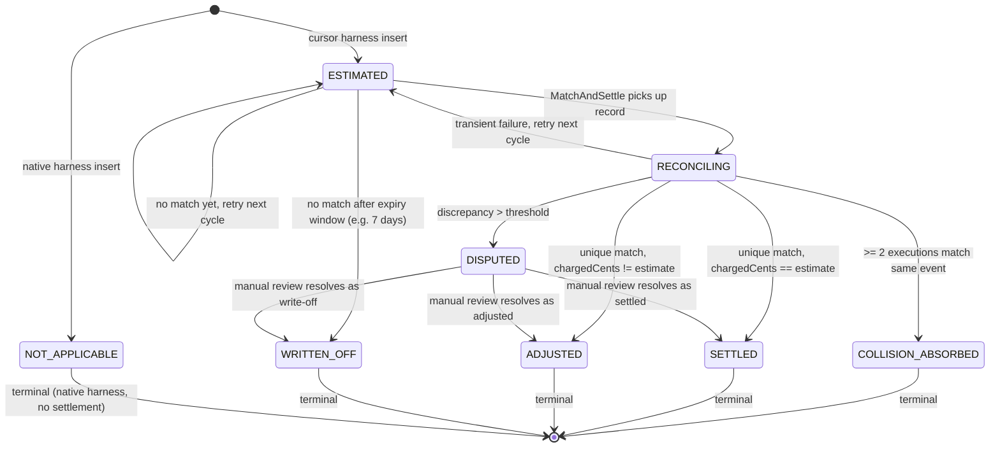

# Trust Ladder & Settlement-State Contract

**Created:** 2026-05-29
**Status:** Decision record — Phase 2 implements against this document.
**Scope:** Cloud-only (Java/Mongo/Temporal in stigmer-cloud). Proto contract shared via OSS `apis/`.
**Prerequisite:** Phase 1 (Cursor Admin API polling + global event ledger) is DONE.

---

## 1. Context

### 1.1 The problem

Cursor harness billing is fundamentally runner-reported. The runner's `UsageAccumulator`
captures `onDelta` token counts during streaming, the Temporal workflow calls
`BillingActivitiesImpl.recordCursorUsage` after execution completes, and the
handler inserts a single `LlmCallUsageRecord` with `sequence = 1`. That record is
priced from Stigmer's model-pricing registry and debited from the customer's credits
immediately.

The dollar amount shown to the user is an estimate based on Stigmer's rate card
applied to runner-reported token counts. It does NOT include Cursor's Token Fee
(~$0.25/M) and may differ from what Cursor actually charges Stigmer. The runner
is open-source and runs on user-controlled machines, so the token counts it reports
are not independently verifiable.

Phase 1 introduced a Cursor Admin API polling workflow that ingests authoritative
`chargedCents` + token buckets into `cursor_usage_event`. But these events have no
link to executions yet, and the existing billing path does not consult them.

### 1.2 The billing-correctness surprise

The proto's own documentation establishes clear semantics for each trust tier:

- `USAGE_TRUST_LEVEL_BILLING_AUTHORITY` (value 1): "safe to debit credits from"
  (`usage.proto` line 38)
- `USAGE_TRUST_LEVEL_SERVER_OBSERVED` (value 2): "Server-observed but not billing"
  (`usage.proto` line 41)
- `USAGE_TRUST_LEVEL_DISPLAY_ONLY` (value 3): "runner-reported, never used for billing"
  (`usage.proto` line 44)

The `StreamingUsageSummary` message comment explicitly states: "Trust level:
DISPLAY_ONLY. This data is reported by the execution worker (which may run on
untrusted user machines) and is NOT billing-authoritative." (`usage.proto` lines 439-443)

**Current code violates these semantics.** `RecordLlmCallUsageHandler` stamps Cursor
records as `SERVER_OBSERVED` and, when `providerCostMicros > 0`, sets `is_billable = true`
and immediately debits credits through `ExecutionBillingService.reportLlmCallUsage`.

Specifically:

- `RecordLlmCallUsageHandler.ComputeAndInsertStep` (stigmer-cloud
  `RecordLlmCallUsageHandler.java` lines 170-264): when `harness == "cursor"`, sets
  `metering_source = RUNNER_PROVIDER_REPORTED_OSS` and
  `trust_level = SERVER_OBSERVED`, then marks `is_billable = true` if
  `providerCostMicros > 0`.

- `RecordLlmCallUsageHandler.DebitBillingStep` (lines 324-341): calls
  `executionBillingService.reportLlmCallUsage`, which performs an irreversible
  credit debit through grant-burn-order consumption. There is no "uncapture" or
  reversal path in the current billing pipeline.

- `BillingActivitiesImpl.recordCursorUsage` (stigmer-cloud
  `BillingActivitiesImpl.java` lines 72-124): collapses the entire execution into
  one aggregate record (`sequence = 1`) from `StreamingUsageSummary` and sends it
  through the same `recordLlmCallUsage` handler used by the native proxy.

**Result:** Customers are billed from unverified, runner-reported token counts.
Later settlement to a different `chargedCents` would require an explicit adjustment
entry that does not exist today.

### 1.3 Current vs. target behavior

| Aspect | Current (broken) | Target (this design) |
|--------|-----------------|---------------------|
| Cursor trust level | `SERVER_OBSERVED` | `DISPLAY_ONLY` (pre-settlement) |
| Billing at estimate time | Immediate irreversible debit | **Hold only** — reservation holds credits, no capture |
| `customer_billable_amount_micros` | Set after immediate debit | **0** until settlement |
| Settlement trigger | None | `MatchAndSettle` activity reconciles against `cursor_usage_event` |
| Post-settlement cost | N/A | `chargedCents` from Cursor Admin API, rated through billing policy |
| `isEstimated` derivation | Token-count heuristic (streaming > billing) | Driven by `settlement_status` on `LlmCallUsageRecord` |

### 1.4 Why this must be decided before Phase 2

Phase 2 writes the settlement state onto `LlmCallUsageRecord`. The `MatchAndSettle`
activity will update `metering_source`, `trust_level`, `settlement_status`, `cost`,
and `billing.debit_status`. Changing these semantics after records are written
requires a data migration. Locking the enum vocabulary and state-machine transitions
now prevents a proto rewrite and re-migration later.

---

## 2. Trust ladder

Five tiers, ordered from highest to lowest trust. Each tier defines what the record
can be used for and what billing action is permitted.

| Tier | `UsageTrustLevel` value | Meaning | Example | Billing rule |
|------|------------------------|---------|---------|-------------|
| 1 | `BILLING_AUTHORITY` | Stigmer controls the metering chokepoint or has a cryptographically verifiable provider receipt. | Native harness: proxy observes SSE stream and extracts final usage. | Immediate capture. Debit credits on insert. |
| 2 | `PROVIDER_SETTLED` **(new)** | Trusted provider back-office feed, reconciled after delay. Provider is the cost authority; Stigmer verified the match. | Cursor Admin API `chargedCents` matched to execution with high confidence. | Capture at settlement. Debit credits when settlement writes the record. |
| 3 | `SERVER_OBSERVED` | Server observed correlated metadata (timing, routing, model selection) but did NOT observe token counts. Useful for observability and anomaly detection, not for billing. | Proxy timing data, auth/session/model metadata sidecars. | No capture. Informational only. |
| 4 | `ATTESTED_RUNNER` **(reserved, not implemented)** | Runner executing in a Stigmer-controlled, remotely attested environment (confidential VM, TEE-backed Daytona sandbox). Attestation proves code identity to the server. | Future: Daytona confidential VM with attestation sidecar. | Capture permitted (strength depends on attestation model). Policy TBD. |
| 5 | `DISPLAY_ONLY` | Runner-reported. No independent verification. Cannot be trusted for billing because the runner is open-source and user-controlled. | Cursor SDK `onDelta` turn-ended usage reported by the runner. | **No capture.** Hold only. Show as "Estimated" in UI. |

### 2.1 The Cursor harness lifecycle across tiers

```
Runner executes
    │
    ├─ streaming_usage → DISPLAY_ONLY (hold, no debit)
    │   Shows "Estimated $X.XX" in UI immediately
    │
    ├─ Phase 1 ingests Cursor Admin API → cursor_usage_event
    │
    ├─ Phase 2 MatchAndSettle matches with confidence
    │   │
    │   ├─ High confidence → PROVIDER_SETTLED (capture, real debit)
    │   │   Shows "$X.XX" (settled, no badge)
    │   │
    │   ├─ Collision → COLLISION_ABSORBED (no debit, platform cost)
    │   │   Shows "Estimated $X.XX" (original estimate preserved)
    │   │
    │   └─ No match yet → stays DISPLAY_ONLY (retry next cycle)
    │
    └─ Future: Cursor signed receipt → BILLING_AUTHORITY
```

### 2.2 Native harness (unchanged)

The native harness is already correct. The proxy controls the metering chokepoint,
observes SSE stream completion, and writes records with
`trust_level = BILLING_AUTHORITY` and `metering_source = PROXY_PROVIDER_REPORTED`.
Credits are debited immediately. No changes needed.

---

## 3. Dimensional model

`LlmCallUsageRecord` carries five orthogonal classification dimensions. This section
defines how they compose and establishes precedence rules to eliminate redundancy.

### 3.1 The five dimensions

| Dimension | Enum | Role | Owned by |
|-----------|------|------|----------|
| **Who wrote it** | `UsageMeteringSource` | Provenance: proxy, runner, admin API, manual | Set at insert time; upgraded at settlement |
| **What it can be used for** | `UsageTrustLevel` | Authorization: what actions are permitted on this record | Set at insert time; upgraded at settlement |
| **Token extraction status** | `UsageCompletionStatus` | Extraction completeness of provider-reported token data | Set at insert time; may be upgraded at settlement |
| **Settlement lifecycle** | `UsageSettlementStatus` **(new)** | Where the record is in the settlement state machine | New field; drives UX labels and billing gate |
| **Billing debit lifecycle** | `BillingDebitStatus` | Whether credits have been captured | Existing field on `BillingLink`; transitions driven by settlement |
| **Cost provenance** | `CostCalculationStatus` | How `provider_cost_micros` / `customer_billable_amount_micros` were computed | Existing field on `CostStamp`; upgraded at settlement |

### 3.2 Precedence rules

**Rule 1: `UsageSettlementStatus` is the single source of truth for "is this settled?"**

The existing `USAGE_COMPLETION_STATUS_RECONCILED` and
`COST_CALCULATION_STATUS_RECONCILED` values remain valid but are secondary signals.
Settlement status is read from `settlement_status`, not inferred from completion or
cost status.

- When `settlement_status` transitions to `SETTLED`, the handler also sets
  `usage_status = RECONCILED` and `cost.calculation_status = RECONCILED` for
  backward compatibility.
- Readers (aggregation, reports, UX) check `settlement_status` first. If the field
  is unset/`UNSPECIFIED` (pre-migration records), fall back to checking
  `cost.calculation_status == RECONCILED` for backward compatibility.

**Rule 2: `trust_level` gates billing, `settlement_status` gates capture timing.**

- `trust_level >= PROVIDER_SETTLED` is necessary for capture.
- `settlement_status == SETTLED || ADJUSTED` is the trigger for capture.
- Both must be true. A `PROVIDER_SETTLED` record that is still `RECONCILING` has
  not yet been captured.

**Rule 3: `metering_source` is upgraded, never replaced.**

When a `DISPLAY_ONLY` / `RUNNER_PROVIDER_REPORTED_OSS` record is settled against a
Cursor Admin API event, its `metering_source` is upgraded to
`PROVIDER_ADMIN_RECONCILED`. The original source is preserved in the
`settlement_link.original_metering_source` field for audit.

**Rule 4: `billing.debit_status` follows settlement, not insert.**

For Cursor harness records:
- At insert time: `debit_status = NOT_APPLICABLE` (hold only, no debit).
- At settlement: `debit_status` transitions `NOT_APPLICABLE → PENDING → DEBITED`.
- For collision/write-off: `debit_status` stays `NOT_APPLICABLE`.

For native harness records (unchanged):
- At insert time: `debit_status = PENDING → DEBITED` (immediate capture).

### 3.3 Valid dimension combinations

| Harness | Phase | `metering_source` | `trust_level` | `settlement_status` | `debit_status` | `cost.calculation_status` |
|---------|-------|--------------------|---------------|---------------------|----------------|--------------------------|
| native | insert | `PROXY_PROVIDER_REPORTED` | `BILLING_AUTHORITY` | `NOT_APPLICABLE` | `PENDING` → `DEBITED` | `COMPUTED` |
| cursor | insert (estimate) | `RUNNER_PROVIDER_REPORTED_OSS` | `DISPLAY_ONLY` | `ESTIMATED` | `NOT_APPLICABLE` | `COMPUTED` or `ESTIMATED` |
| cursor | reconciling | `RUNNER_PROVIDER_REPORTED_OSS` | `DISPLAY_ONLY` | `RECONCILING` | `NOT_APPLICABLE` | `COMPUTED` or `ESTIMATED` |
| cursor | settled (per-run) | `PROVIDER_ADMIN_RECONCILED` | `PROVIDER_SETTLED` | `SETTLED` | `PENDING` → `DEBITED` | `RECONCILED` |
| cursor | settled (adjusted) | `PROVIDER_ADMIN_RECONCILED` | `PROVIDER_SETTLED` | `ADJUSTED` | `PENDING` → `DEBITED` | `RECONCILED` |
| cursor | collision | `RUNNER_PROVIDER_REPORTED_OSS` | `DISPLAY_ONLY` | `COLLISION_ABSORBED` | `NOT_APPLICABLE` | unchanged |
| cursor | disputed | `RUNNER_PROVIDER_REPORTED_OSS` | `DISPLAY_ONLY` | `DISPUTED` | `NOT_APPLICABLE` | unchanged |
| cursor | written off | any | any | `WRITTEN_OFF` | `NOT_APPLICABLE` | unchanged |

---

## 4. Settlement state machine

### 4.1 States

```protobuf
enum UsageSettlementStatus {
  USAGE_SETTLEMENT_STATUS_UNSPECIFIED = 0;

  // Native harness or other billing-authority records that bypass settlement.
  USAGE_SETTLEMENT_STATUS_NOT_APPLICABLE = 1;

  // Runner estimate written. Hold active, no debit. Shows "Estimated" in UI.
  USAGE_SETTLEMENT_STATUS_ESTIMATED = 2;

  // MatchAndSettle activity is processing this record. Transient state.
  USAGE_SETTLEMENT_STATUS_RECONCILING = 3;

  // Matched to a cursor_usage_event with high confidence. chargedCents applied.
  // Credits captured. Shows settled cost in UI (no badge).
  USAGE_SETTLEMENT_STATUS_SETTLED = 4;

  // Matched, but chargedCents differs from estimate. Credits captured at
  // chargedCents amount. Shows settled cost in UI.
  USAGE_SETTLEMENT_STATUS_ADJUSTED = 5;

  // Multiple executions matched the same Admin API event. Platform absorbs
  // the cost. No debit to any customer. "Be gracious" rule.
  USAGE_SETTLEMENT_STATUS_COLLISION_ABSORBED = 6;

  // Settlement discrepancy exceeds threshold. Requires manual review.
  USAGE_SETTLEMENT_STATUS_DISPUTED = 7;

  // Terminal: record will not be settled. Estimate preserved for display.
  // Applied when no Admin API match after expiry window, or after manual review.
  USAGE_SETTLEMENT_STATUS_WRITTEN_OFF = 8;
}
```

### 4.2 State transitions



### 4.3 Transition rules

| From | To | Trigger | Side effects |
|------|----|---------|-------------|
| `ESTIMATED` | `RECONCILING` | `MatchAndSettle` activity loads pending records | None. Transient marker. |
| `RECONCILING` | `SETTLED` | Unique match, confidence >= 0.90, `abs(chargedCents - estimate) <= tolerance` | Upgrade `metering_source`, `trust_level`, `cost`; capture debit. |
| `RECONCILING` | `ADJUSTED` | Unique match, confidence >= 0.90, `abs(chargedCents - estimate) > tolerance` | Same as SETTLED but with the `chargedCents` amount, not the estimate. |
| `RECONCILING` | `COLLISION_ABSORBED` | >= 2 executions match the same `cursor_usage_event` | No debit. Platform absorbs. Log for review. |
| `RECONCILING` | `DISPUTED` | Match confidence < threshold but nonzero, or delta > dispute threshold | No debit. Flag for manual review. |
| `RECONCILING` | `ESTIMATED` | Transient failure (DB error, timeout) | Retry next cycle. No state corruption. |
| `ESTIMATED` | `ESTIMATED` | No candidate match found | No change. Will be re-evaluated next cycle. |
| `ESTIMATED` | `WRITTEN_OFF` | Record age > expiry window (default 7 days) with no match | No debit. Estimate preserved for display only. |
| `DISPUTED` | `SETTLED` / `ADJUSTED` / `WRITTEN_OFF` | Manual operator action | Depends on resolution. |

### 4.4 "Be gracious" rule

Ambiguous cases always resolve in the customer's favor:

- **Collision:** two or more executions match the same Admin API event. Neither
  customer is debited. Stigmer absorbs the cost as platform overhead.
- **Over-estimation:** estimate > `chargedCents`. Customer pays the lower settled
  amount (state: `ADJUSTED`).
- **Under-estimation:** estimate < `chargedCents`. Customer pays the higher settled
  amount. Stigmer was already paying Cursor the real cost; the customer's bill
  increases to reflect reality (state: `ADJUSTED`). This is fair, not gracious —
  but necessary for sustainability.
- **No match (write-off):** no Admin API event corresponds to the execution. No
  debit. Classified as platform overhead.

### 4.5 Workspace/day aggregate fallback

When per-run matching is ambiguous (confidence 0.40-0.70), the `MatchAndSettle`
activity falls back to workspace/day aggregate settlement:

1. Sum `chargedCents` from all `cursor_usage_event` records for the workspace/day.
2. Sum `provider_cost_micros` from all `ESTIMATED` `LlmCallUsageRecord` records for
   the same workspace/day scope.
3. If aggregate delta is within tolerance: settle all records in the scope
   proportionally (distribute `chargedCents` by each record's share of total
   estimated cost).
4. If aggregate delta exceeds threshold: mark all as `DISPUTED`.

This fallback exists because the current architecture uses a single Cursor API key
for all orgs, making per-execution matching inherently fuzzy. Per-org service
accounts (Phase 4 future) eliminate the need for this fallback.

---

## 5. Hold-only billing model

### 5.1 What changes

| Step | Current (immediate debit) | Target (hold-only) |
|------|--------------------------|-------------------|
| `authorizeExecution` | Hold credits (available → reserved) | **Unchanged.** Hold credits as before. |
| `recordCursorUsage` | Insert record + immediate debit via `reportLlmCallUsage` | Insert record with `is_billable = false`, `debit_status = NOT_APPLICABLE`, `settlement_status = ESTIMATED`. **No debit.** |
| `finalizeExecution` | Release unused reservation | **Unchanged.** Release entire reservation (nothing consumed). |
| Settlement | N/A | `MatchAndSettle` activity: match, upgrade record, debit `chargedCents` amount. |

### 5.2 Reservation lifecycle for Cursor

```
authorizeExecution  →  reservation_active (hold $X from available)
    │
    ├─ recordCursorUsage  →  LlmCallUsageRecord inserted (ESTIMATED, no debit)
    │                        reservation.consumed_micros stays 0
    │
    ├─ finalizeExecution  →  reservation_finalized (release full hold back to available)
    │
    │   ... hours later ...
    │
    └─ MatchAndSettle     →  settlement debit (new operation, not tied to reservation)
                             Debits chargedCents from available credits directly
                             Updates record: SETTLED, debit_status = DEBITED
```

### 5.3 Settlement debit (new path)

Settlement happens outside the original execution lifecycle. The reservation has
already been released. The `MatchAndSettle` activity debits credits directly using
a new settlement-specific billing method:

- **Idempotency key:** `settlement_{usage_record_id}` (ensures no double capture).
- **Amount:** `chargedCents` from `cursor_usage_event`, converted to micro-USD and
  rated through the billing policy (same `UsageRatingService.rate` as the original
  path).
- **Debit source:** Available credits (not reservation headroom — the reservation
  is already finalized).
- **Ledger entry type:** `settlement_debit` (new type, distinguishable from
  `usage_debit` in the credit ledger for audit).
- **Failure handling:** If insufficient credits at settlement time, mark
  `debit_status = FAILED_RETRYABLE` and retry on next cycle. Settlement should not
  be blocked by transient balance shortfalls.

### 5.4 No-settlement fallback

What happens if an execution's `ESTIMATED` record never gets settled?

- After the expiry window (default 7 days), `MatchAndSettle` transitions the record
  to `WRITTEN_OFF`.
- No credits are ever captured. The cost is absorbed as platform overhead.
- The UI continues to show the original estimate with an "Estimated" label.
- Micrometer counter `stigmer.cursor.settlement.written_off` is incremented for
  operational visibility.

This is the correct conservative behavior: the customer is never billed from
unverified data. If write-off rates become material, the operational response is to
improve matching (per-org service accounts, better attribution) — not to fall back
to billing from estimates.

### 5.5 Idempotency and "no double capture"

- The insert-time `idempotency_key` (`{execution_id}_{sequence}_{metering_source}`)
  prevents duplicate record creation.
- The settlement `idempotency_key` (`settlement_{usage_record_id}`) prevents
  double capture.
- `MatchAndSettle` checks `settlement_status != ESTIMATED` before processing.
  Records already settled/written-off are skipped.
- The `cursor_usage_event` is also marked with the matched `usage_record_id` to
  prevent the same Admin API event from settling multiple records (collision guard).

### 5.6 Impact on existing immediate-debit path

The immediate-debit path in `RecordLlmCallUsageHandler.DebitBillingStep` remains
unchanged for native harness records (`trust_level == BILLING_AUTHORITY`). The
change is scoped:

- **When `harness == "cursor"`:** `recordCursorUsage` sets `is_billable = false`
  and `debit_status = NOT_APPLICABLE`. The `DebitBillingStep` short-circuits
  (existing check: `if (!record.getIsBillable()) return success`).
- **When `harness != "cursor"`:** Unchanged. Immediate debit as before.

---

## 6. Proposed proto shape

These are **proposed additions** to `usage.proto`. Not applied in this sketch.

### 6.1 New enum

```protobuf
// Settlement lifecycle for usage records that require reconciliation.
// Native harness records (BILLING_AUTHORITY) use NOT_APPLICABLE.
// Cursor harness records transition through this state machine.
enum UsageSettlementStatus {
  USAGE_SETTLEMENT_STATUS_UNSPECIFIED = 0;
  USAGE_SETTLEMENT_STATUS_NOT_APPLICABLE = 1;
  USAGE_SETTLEMENT_STATUS_ESTIMATED = 2;
  USAGE_SETTLEMENT_STATUS_RECONCILING = 3;
  USAGE_SETTLEMENT_STATUS_SETTLED = 4;
  USAGE_SETTLEMENT_STATUS_ADJUSTED = 5;
  USAGE_SETTLEMENT_STATUS_COLLISION_ABSORBED = 6;
  USAGE_SETTLEMENT_STATUS_DISPUTED = 7;
  USAGE_SETTLEMENT_STATUS_WRITTEN_OFF = 8;
}
```

### 6.2 New trust level values (additions to existing enum)

```protobuf
enum UsageTrustLevel {
  // ... existing values 0-3 unchanged ...

  // Trusted provider back-office settlement feed, reconciled after delay.
  USAGE_TRUST_LEVEL_PROVIDER_SETTLED = 4;

  // Reserved: runner in Stigmer-controlled attested runtime (future).
  USAGE_TRUST_LEVEL_ATTESTED_RUNNER = 5;
}
```

### 6.3 New fields on `LlmCallUsageRecord`

```protobuf
message LlmCallUsageRecord {
  // ... existing fields unchanged ...

  // ─── Settlement ───────────────────────────────────────────────────────────
  // Settlement lifecycle state. Drives UX labels and billing gate.
  UsageSettlementStatus settlement_status = 100;

  // Link to the provider-side event that settled this record.
  SettlementLink settlement_link = 101;
}

// Links a settled usage record to the provider-side event used for settlement.
message SettlementLink {
  // ID of the cursor_usage_event document that this record was settled against.
  string cursor_usage_event_id = 1;

  // SHA-256 content hash of the cursor_usage_event (for integrity).
  string cursor_usage_event_hash = 2;

  // Authoritative cost from the provider, in cents (as reported by Admin API).
  double settled_charged_cents = 3;

  // Authoritative cost converted to micro-USD after billing policy rating.
  int64 settled_billable_amount_micros = 4;

  // Confidence score of the match (0.0 - 1.0).
  double match_confidence = 5;

  // What type of match produced this settlement.
  string match_type = 6;  // "per_run", "aggregate_proportional"

  // When settlement occurred.
  google.protobuf.Timestamp settled_at = 7;

  // Original metering source before upgrade (for audit).
  UsageMeteringSource original_metering_source = 8;

  // Original trust level before upgrade (for audit).
  UsageTrustLevel original_trust_level = 9;
}
```

### 6.4 Additions to `cursor_usage_event` (BSON, not proto)

The Phase 1 `cursor_usage_event` collection gains settlement-tracking fields:

```
// Added by MatchAndSettle activity:
match_state:          String   // "unmatched", "matched", "collision", "disputed"
matched_usage_record_id: String   // FK to llm_call_usage_record.usage_record_id
matched_execution_id:    String   // denormalized for queries
matched_at:              ISODate
match_confidence:        Double
```

These fields + indexes on `(match_state, observed_at)` and
`(matched_usage_record_id)` enable the MatchAndSettle activity to:
- Load unmatched events efficiently.
- Prevent the same event from settling multiple records (collision guard).
- Support reverse lookups from usage record to provider event.

---

## 7. Phase 2 write contract

### 7.1 At estimate time: `recordCursorUsage` (changed)

`BillingActivitiesImpl.recordCursorUsage` builds `RecordLlmCallUsageInput` as today,
but with adjusted parameters:

| Field | Current value | New value |
|-------|--------------|-----------|
| `trust_level` | `SERVER_OBSERVED` | `DISPLAY_ONLY` |
| `is_billable` | `true` (if cost > 0) | **`false`** |
| `billing.debit_status` | `PENDING` | `NOT_APPLICABLE` |
| `settlement_status` | (does not exist) | `ESTIMATED` |
| `cost.customer_billable_amount_micros` | 0 (set to real amount after debit) | **0** (stays 0 until settlement) |

Everything else (tokens, model, provider, sequence=1) stays the same.

The `DebitBillingStep` in `RecordLlmCallUsageHandler` short-circuits because
`is_billable == false`. No credit debit occurs. The reservation hold continues to
protect the customer's credit balance during execution, and `finalizeExecution`
releases it entirely afterward.

### 7.2 At settlement time: `MatchAndSettle` activity (new)

The `MatchAndSettle` Temporal activity runs after `PollCursorUsageEvents` in the
`CursorUsageIngestionWorkflow`. For each unmatched `cursor_usage_event`:

1. **Find candidates:** Query `LlmCallUsageRecord` by `harness = "cursor"`,
   `settlement_status = ESTIMATED`, token shape similarity, model match, and
   time window overlap.

2. **Score candidates:** Confidence-scored matching (see research report section 6.3
   for the scoring formula).

3. **Apply settlement based on match quality:**

   - **Unique match, confidence >= 0.90:**
     - Update `LlmCallUsageRecord`:
       - `metering_source` → `PROVIDER_ADMIN_RECONCILED`
       - `trust_level` → `PROVIDER_SETTLED`
       - `settlement_status` → `SETTLED` or `ADJUSTED`
       - `is_billable` → `true`
       - `cost.customer_billable_amount_micros` → rated `chargedCents`
       - `cost.calculation_status` → `RECONCILED`
       - `usage_status` → `RECONCILED`
       - `settlement_link` → populated with event ID, hash, confidence, etc.
       - `billing.debit_status` → `PENDING`
     - Execute settlement debit (idempotency key: `settlement_{usage_record_id}`).
     - Update `billing.debit_status` → `DEBITED`.
     - Update `cursor_usage_event`: `match_state = "matched"`,
       `matched_usage_record_id`, `matched_execution_id`.

   - **>= 2 candidates match:**
     - Update all candidate `LlmCallUsageRecord` records:
       `settlement_status` → `COLLISION_ABSORBED`. No debit.
     - Update `cursor_usage_event`: `match_state = "collision"`.

   - **0 candidates, event age > expiry:**
     - Update `cursor_usage_event`: `match_state = "unmatched"`.
     - (No `LlmCallUsageRecord` to update — this is platform overhead.)

   - **0 candidates, event age <= expiry:**
     - Keep as unmatched. Retry next cycle.

4. **Expiry sweep:** For `LlmCallUsageRecord` records with
   `settlement_status = ESTIMATED` and `created_at` older than the expiry window,
   transition to `WRITTEN_OFF`.

---

## 8. Read / UX contract

### 8.1 `settlement_status` drives `isEstimated`

The `useSessionUsage` hook (and server-side `AgentExecutionGetSessionUsageReportHandler`)
derive display state from `settlement_status`, replacing the current token-count
heuristic.

| `settlement_status` | `isEstimated` | UI label | Badge |
|---------------------|--------------|----------|-------|
| `NOT_APPLICABLE` | `false` | (none — native harness, already authoritative) | None |
| `ESTIMATED` | `true` | "Estimated" | Muted badge |
| `RECONCILING` | `true` | "Estimated" | Muted badge (same as estimated for user) |
| `SETTLED` | `false` | (none — settled, authoritative) | None |
| `ADJUSTED` | `false` | (none — settled at different amount) | None |
| `COLLISION_ABSORBED` | `true` | "Estimated" | Muted badge (original estimate displayed) |
| `DISPUTED` | `true` | "Under review" | Warning badge |
| `WRITTEN_OFF` | `true` | "Estimated" | Muted badge (original estimate preserved) |

### 8.2 Cost display logic

```
if settlement_status in (SETTLED, ADJUSTED):
    display cost.customer_billable_amount_micros  (settled amount)
    isEstimated = false
elif settlement_status in (ESTIMATED, RECONCILING, COLLISION_ABSORBED, WRITTEN_OFF):
    display streaming_usage.estimated_cost_usd  (runner estimate)
    isEstimated = true
elif settlement_status == DISPUTED:
    display streaming_usage.estimated_cost_usd  (runner estimate)
    isEstimated = true
    show "Under review" badge
elif settlement_status == NOT_APPLICABLE:
    display cost.customer_billable_amount_micros  (native, immediate)
    isEstimated = false
```

### 8.3 Server-side: session usage report

`UsageAggregationService.aggregateRecords` currently sums
`cost.customer_billable_amount_micros` for all records without filtering. This works
correctly under the new model because:

- Unsettled Cursor records have `customer_billable_amount_micros = 0` (no
  contribution to the billable total).
- Settled Cursor records have `customer_billable_amount_micros` set to the rated
  `chargedCents` (contributes correctly).
- Native records are unchanged.

The `isEstimated` flag on the report response should be derived from whether ANY
record in the scope has `settlement_status` in the estimated set. This replaces
the current token-count heuristic.

### 8.4 Client-side: `useSessionUsage` changes

The hook in `sdk/react/src/session/useSessionUsage.ts` currently derives
`isEstimated` by comparing `streamingFallback.totalTokens > billingReport.totalTokens`
(lines 230-238). Under the new model:

- The server-side report includes a per-session `isEstimated` flag derived from
  `settlement_status` (see 8.3).
- The streaming fallback remains for in-flight executions whose records have not yet
  been written (billing report returns no data). In this case, `isEstimated = true`
  from the streaming data.
- Once the billing report has data, its `isEstimated` flag (from settlement status)
  takes precedence over the token-count heuristic.

### 8.5 SDK-first placement

All settlement-status interpretation logic lives in:
- **Server:** `UsageAggregationService` / report handler (computes `isEstimated`
  from `settlement_status`).
- **`@stigmer/react`:** `useSessionUsage` hook consumes the server-reported
  `isEstimated` flag.
- **`client-apps/web` and `client-apps/desktop`:** Zero settlement logic. They
  consume `useSessionUsage` and render based on `isEstimated` + `totalCostUsd`.

No settlement-status interpretation in client apps. Consistent across web, desktop,
and future embeddable components.

### 8.6 Accessibility

Settlement state must not be conveyed by color alone. The "Estimated" / "Under
review" labels serve as the primary text-based indicator. Badges use both color and
text. Screen readers announce the label text alongside the cost value.

---

## 9. Edition classification

| Concern | stigmer (OSS) | stigmer-cloud (Cloud) |
|---------|--------------|----------------------|
| Proto changes (`usage.proto`) | **Yes** — new enum + fields added to shared proto | Stubs regenerated via `make protos` |
| Settlement workflow | **No-op** — no Cursor Admin API, no settlement logic | **Full implementation** in `billing/temporal/cursorusage/` |
| `recordCursorUsage` change | Not applicable (OSS uses native harness only) | **Changed** to hold-only |
| `UsageAggregationService` | Unchanged (no Cursor records in OSS) | **Minor** — derive `isEstimated` from `settlement_status` |
| `useSessionUsage` (React SDK) | **Shared** — same hook, same behavior | Same |
| `MatchAndSettle` activity | Not applicable | **New** Temporal activity |
| Settlement debit | Not applicable | **New** method in `ExecutionBillingService` |
| Mongock migration | Not applicable | **New** — add `settlement_status` + `settlement_link` fields, indexes |

The OSS Go server in `stigmer-server` is a documented no-op for this feature. The
proto contract is shared (both editions see the new fields), but the Go implementation
does not need to handle Cursor harness billing because the OSS edition uses the
native LangGraph harness with proxy-observed billing.

---

## 10. Test obligations

### 10.1 Unit tests

| Test | What it proves | Where |
|------|---------------|-------|
| Settlement state-machine transitions | Every valid transition in section 4.3 succeeds; every invalid transition is rejected. | `*Test.java` alongside the state-machine utility class |
| Precedence resolver | `settlement_status` takes precedence over `cost.calculation_status` for determining "settled." Backward compatibility for pre-migration records. | Same package |
| Confidence scoring | Known input vectors produce expected scores. Boundary conditions around 0.90 / 0.70 / 0.40 thresholds. | `MatchAndSettleActivitiesImplTest.java` |
| Settlement debit idempotency | Calling settlement debit twice with the same `usage_record_id` produces one ledger entry. | `ExecutionBillingServiceTest.java` |
| Cost rating at settlement | `chargedCents` converted to micro-USD and rated through `UsageRatingService` produces correct `customer_billable_amount_micros`. | Same package |

### 10.2 Integration tests (Temporal)

| Test | What it proves | Where |
|------|---------------|-------|
| Hold-then-capture | A Cursor execution creates an `ESTIMATED` record with `is_billable = false`. Reservation hold is created. No credit debit occurs. After `MatchAndSettle` runs, the record transitions to `SETTLED` and credits are debited at the `chargedCents` amount. | `CursorUsageSettlementWorkflowTest.java` |
| Collision absorbed | Two executions with identical token fingerprints. `MatchAndSettle` detects collision, marks both `COLLISION_ABSORBED`, debits neither. | Same file |
| Write-off | An `ESTIMATED` record with no matching `cursor_usage_event` past the expiry window transitions to `WRITTEN_OFF`. No debit. | Same file |
| Aggregate fallback | Multiple ambiguous records are settled proportionally at workspace/day level. | Same file |

### 10.3 Aggregation tests

| Test | What it proves | Where |
|------|---------------|-------|
| Settled wins over estimate | Session with both `ESTIMATED` (billable=0) and `SETTLED` (billable=rated chargedCents) records. Aggregation returns the settled amount. `isEstimated = false` when all records are settled. | `UsageAggregationServiceTest.java` |
| Mixed settlement | Session with one `SETTLED` and one `ESTIMATED` record. `isEstimated = true`. Billable total includes only the settled record's amount. | Same file |
| Backward compatibility | Pre-migration record with no `settlement_status` field. Falls back to `cost.calculation_status` check. | Same file |

---

## 11. Open questions (deferred to Phase 2)

1. **Adjustment entry mechanics:** If a future code path (e.g., a bug or race
   condition) ever debits from a Cursor estimate before settlement, how do we issue
   a corrective adjustment? This should not happen under the new model, but a
   defensive adjustment-entry mechanism may be warranted.

2. **Per-org service-account attribution timing:** When should Stigmer provision
   dedicated Cursor service accounts per org/workspace? This significantly improves
   matching confidence but requires Cursor Enterprise plan and operational
   provisioning flow. Deferred to Phase 4 proper implementation.

3. **Aggregate fallback granularity:** The workspace/day fallback is defined at a
   high level. Phase 2 implementation must decide the exact scope key
   (`org_id + date` vs. `workspace + date` vs. `cursor_api_key + date`) and
   proportional distribution formula.

4. **Settlement latency SLA:** What is the maximum acceptable time between execution
   completion and settlement? This drives the expiry window (currently proposed at
   7 days) and alerting thresholds.

5. **Auto-recharge interaction:** If settlement debit triggers a low-balance state,
   should `autoRechargeService.evaluateAndTrigger` be called from the settlement
   path? Likely yes, but needs confirmation.

6. **`RECONCILING` state durability:** Is `RECONCILING` written to the database, or
   is it a transient in-memory state within the `MatchAndSettle` activity? If
   written, it creates a recovery concern (activity crash leaves records stuck in
   `RECONCILING`). If transient, the state diagram is simpler but the UI cannot
   distinguish "being processed" from "waiting for next cycle."

---

## References

- Proto: `apis/ai/stigmer/agentic/agentexecution/v1/usage.proto`
- Cloud billing handler: `stigmer-cloud .../billing/request/handler/RecordLlmCallUsageHandler.java`
- Cloud billing activities: `stigmer-cloud .../billing/temporal/BillingActivitiesImpl.java`
- Cloud execution billing: `stigmer-cloud .../billing/service/ExecutionBillingService.java`
- Cloud aggregation: `stigmer-cloud .../agentic/agentexecution/UsageAggregationService.java`
- SDK display hook: `sdk/react/src/session/useSessionUsage.ts`
- Phase 1 ledger: `stigmer-cloud .../billing/repo/CursorUsageEventRepo.java`
- Design doc: `_cursor/cursor-billing-reconciliation-workflow.md`
- Tamper-resistance research: `_projects/2026-05/20260513.01.cursor-experience-parity/research.runner-usage-tamper-resistance/04.report.gpt.md`
