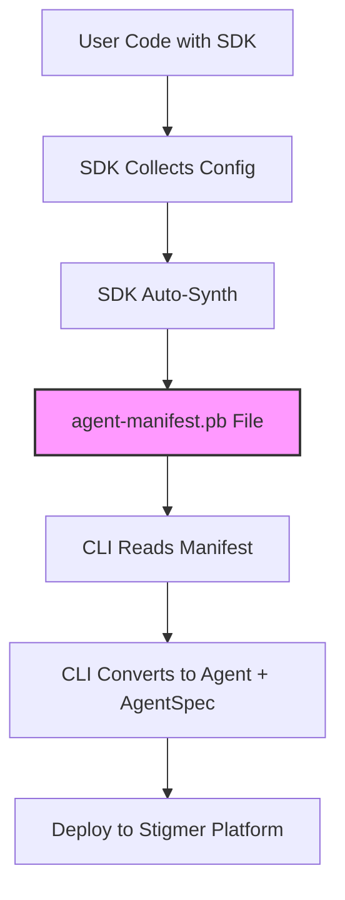

# Agent Manifest - SDK-CLI Contract

The `manifest.proto` defines the SDK-CLI contract for agent blueprints.

## Why in the Agent Domain?

Following Stigmer's proto organization standards, the manifest proto lives in the **agent domain** (`apis/ai/stigmer/agentic/agent/v1/`) rather than a separate "manifest" package.

**Rationale:**
- ✅ **Domain-specific**: The manifest is agent-specific (not a cross-cutting concern)
- ✅ **Follows Stigmer patterns**: All protos are organized by domain (agent, workflow, environment, etc.)
- ✅ **Single source of truth**: Agent-related protos stay together
- ✅ **Clear ownership**: Agent domain owns both the API and the SDK contract

**Future**: When we add workflow manifests, they'll go in `apis/ai/stigmer/agentic/workflow/v1/manifest.proto` (workflow domain), not a shared manifest package.

---

## Purpose

The manifest serves as the **serialization format** for agent blueprints defined in user code. It's the bridge that allows:
- **SDKs** (Go, Python, TypeScript) to be proto-agnostic and language-idiomatic
- **CLI** to be SDK-agnostic and handle deployment logic centrally

---

## Architecture



### Synthesis Model

This is a **"Synthesis Model"** architecture where:

1. **SDK = Config Generator**
   - SDK collects user intent (agent config, skills, MCP servers, etc.)
   - SDK is proto-agnostic for platform APIs
   - SDK only knows about `manifest.proto`

2. **SDK Auto-Synth**
   - On program exit, SDK automatically serializes to `agent-manifest.pb`
   - Uses `defer synth.AutoSynth()` pattern (Go) or `atexit` (Python)
   - Controlled by `STIGMER_OUT_DIR` environment variable

3. **CLI = Deployment Orchestrator**
   - CLI reads `agent-manifest.pb`
   - CLI converts `AgentManifest` → `Agent` (api.proto) + `AgentSpec` (spec.proto)
   - CLI handles gRPC communication with Stigmer platform

---

## Flow

### Development Mode (Dry-Run)

User runs their code directly without `STIGMER_OUT_DIR`:

```bash
# User's agent repository
go run main.go

# Output:
# [Stigmer SDK] Dry-run complete. Run 'stigmer up' to deploy.
```

SDK detects no `STIGMER_OUT_DIR` and skips synthesis.

### Deployment Mode (Synthesis)

User runs `stigmer up`, which:

```bash
stigmer up

# CLI internally does:
# 1. Create temp dir
# 2. Set STIGMER_OUT_DIR=/tmp/stigmer-xyz
# 3. Execute: go run main.go
# 4. SDK writes: /tmp/stigmer-xyz/agent-manifest.pb
# 5. CLI reads agent-manifest.pb
# 6. CLI converts and deploys
```

---

## Proto Structure

### Top-Level: AgentManifest

```protobuf
message AgentManifest {
  SdkMetadata sdk_metadata = 1;  // Which SDK generated this
  AgentBlueprint agent = 2;       // The agent configuration
}
```

### Key Messages

| Message | Purpose |
|---------|---------|
| `SdkMetadata` | Tracks SDK language, version, timestamp |
| `AgentBlueprint` | Complete agent configuration |
| `ManifestSkill` | Skill reference (platform, org, inline) |
| `ManifestMcpServer` | MCP server configuration (stdio, http, docker) |
| `ManifestSubAgent` | Sub-agent configuration (inline or referenced) |
| `ManifestEnvironmentVariable` | Environment variable requirements |

**Note**: All manifest messages are prefixed with `Manifest*` to distinguish them from platform messages (`AgentSpec`, `McpServerDefinition`, etc.).

---

## CLI Conversion

The CLI converts manifest messages to platform messages:

| Manifest Message | Platform Message | Location |
|-----------------|------------------|----------|
| `AgentBlueprint` | `AgentSpec` | `spec.proto` |
| `ManifestSkill` (platform/org) | `ApiResourceReference` | `spec.proto` (skill_refs) |
| `ManifestSkill` (inline) | Creates `Skill` resource | `skill/v1/api.proto` |
| `ManifestMcpServer` | `McpServerDefinition` | `spec.proto` |
| `ManifestSubAgent` (inline) | `InlineSubAgentSpec` | `spec.proto` |
| `ManifestSubAgent` (reference) | `ApiResourceReference` | `spec.proto` (sub_agents) |
| `ManifestEnvironmentVariable` | `EnvironmentSpec` | `environment/v1/spec.proto` |

---

## Why Separate from AgentSpec?

### Before: Proto-Coupled SDK

```go
// Old approach (proto-coupled)
agent, _ := agent.New(...)
agentSpec := agent.ToProto()  // SDK converts to AgentSpec
// CLI would read AgentSpec directly
```

**Problems:**
- SDK tied to platform proto schema
- Breaking changes in AgentSpec broke SDK
- SDK had to know about platform-specific details
- Hard to evolve platform independently

### After: Proto-Agnostic SDK with Manifest

```go
// New approach (proto-agnostic)
agent, _ := agent.New(...)
defer synth.AutoSynth()  // SDK writes agent-manifest.pb
// CLI reads manifest, does conversion
```

**Benefits:**
- ✅ SDK decoupled from platform proto changes
- ✅ SDK can be language-idiomatic
- ✅ CLI handles all platform-specific logic
- ✅ Easy to add new SDK languages
- ✅ Backward compatibility easier to maintain

---

## SDK Integration

### For Go SDK

**Import:**
```go
import manifestpb "github.com/leftbin/stigmer-cloud/apis/stubs/go/ai/stigmer/agentic/agent/v1"
```

**Usage:**
```go
// Convert SDK agent to manifest
func ToManifest(a *agent.Agent) (*manifestpb.AgentManifest, error) {
    manifest := &manifestpb.AgentManifest{
        SdkMetadata: &manifestpb.SdkMetadata{
            Language: "go",
            Version:  "0.1.0",
        },
        Agent: &manifestpb.AgentBlueprint{
            Name:         a.Name,
            Instructions: a.Instructions,
            // ... convert all fields
        },
    }
    return manifest, nil
}
```

### For Python SDK

**Import:**
```python
from stigmer.apis.stubs.python.ai.stigmer.agentic.agent.v1 import manifest_pb2
```

**Usage:**
```python
# Convert SDK agent to manifest
def to_manifest(agent: Agent) -> manifest_pb2.AgentManifest:
    manifest = manifest_pb2.AgentManifest(
        sdk_metadata=manifest_pb2.SdkMetadata(
            language="python",
            version="0.1.0",
        ),
        agent=manifest_pb2.AgentBlueprint(
            name=agent.name,
            instructions=agent.instructions,
            # ... convert all fields
        ),
    )
    return manifest
```

---

## Skill Sources

### Platform Skill
```go
skill.Platform("coding-standards")
```

Converts to:
```protobuf
ManifestSkill {
  platform: { name: "coding-standards" }
}
```

CLI converts to:
```protobuf
ApiResourceReference {
  kind: 43  // skill
  name: "coding-standards"
  scope: platform_scope {}
}
```

### Organization Skill
```go
skill.Org("security-guidelines", "acme-corp")
```

Converts to:
```protobuf
ManifestSkill {
  org: { name: "security-guidelines", org: "acme-corp" }
}
```

CLI converts to:
```protobuf
ApiResourceReference {
  kind: 43  // skill
  name: "security-guidelines"
  scope: org_scope { org_id: "acme-corp" }
}
```

### Inline Skill
```go
skill.Inline("custom-reviewer", "Reviews PRs", "# Review Guide\n...")
```

Converts to:
```protobuf
ManifestSkill {
  inline: {
    name: "custom-reviewer"
    description: "Reviews PRs"
    markdown_content: "# Review Guide\n..."
  }
}
```

CLI:
1. Creates `Skill` resource
2. Converts to `ApiResourceReference`

---

## MCP Server Types

### Stdio Server
```go
mcpserver.Stdio("github", 
    mcpserver.WithCommand("npx"),
    mcpserver.WithArgs("-y", "@modelcontextprotocol/server-github"),
    mcpserver.WithEnvPlaceholder("GITHUB_TOKEN", "${GITHUB_TOKEN}"),
)
```

Converts to:
```protobuf
ManifestMcpServer {
  name: "github"
  stdio: {
    command: "npx"
    args: ["-y", "@modelcontextprotocol/server-github"]
    env_placeholders: {"GITHUB_TOKEN": "${GITHUB_TOKEN}"}
  }
}
```

CLI converts to `McpServerDefinition` in `AgentSpec`.

---

## Testing

To test SDK synthesis:

```bash
# Set output directory
export STIGMER_OUT_DIR=/tmp/stigmer-test

# Run your agent code
go run main.go

# Verify manifest was created
ls -l /tmp/stigmer-test/agent-manifest.pb

# Inspect manifest (requires protoc)
protoc --decode=ai.stigmer.agentic.agent.v1.AgentManifest \
  --proto_path=/path/to/stigmer/apis \
  ai/stigmer/agentic/agent/v1/manifest.proto \
  < /tmp/stigmer-test/agent-manifest.pb
```

---

## Examples

### Minimal Agent

```go
package main

import (
    "github.com/leftbin/stigmer-sdk/go/agent"
    "github.com/leftbin/stigmer-sdk/go/stigmer"
)

func main() {
    defer stigmer.Complete()
    
    agent.New(
        agent.WithName("simple-agent"),
        agent.WithInstructions("You are a helpful assistant."),
    )
}
```

### Full-Featured Agent

```go
package main

import (
    "github.com/leftbin/stigmer-sdk/go/agent"
    "github.com/leftbin/stigmer-sdk/go/skill"
    "github.com/leftbin/stigmer-sdk/go/mcpserver"
    "github.com/leftbin/stigmer-sdk/go/subagent"
    "github.com/leftbin/stigmer-sdk/go/environment"
    "github.com/leftbin/stigmer-sdk/go/stigmer"
)

func main() {
    defer stigmer.Complete()
    
    a, _ := agent.New(
        agent.WithName("full-agent"),
        agent.WithInstructionsFromFile("instructions.md"),
        agent.WithDescription("A comprehensive agent example"),
    )
    
    // Skills
    a.AddSkill(skill.Platform("coding-standards"))
    a.AddSkill(skill.Inline("reviewer", "Code reviewer", "# Review checklist..."))
    
    // MCP Servers
    a.AddMCPServer(mcpserver.Stdio("github",
        mcpserver.WithCommand("npx"),
        mcpserver.WithArgs("-y", "@modelcontextprotocol/server-github"),
        mcpserver.WithEnvPlaceholder("GITHUB_TOKEN", "${GITHUB_TOKEN}"),
    ))
    
    // Sub-agents
    a.AddSubAgent(subagent.Inline("security-checker",
        subagent.WithInstructions("Check for security issues"),
        subagent.WithMCPServer("github"),
    ))
    
    // Environment Variables
    a.AddEnvironmentVariable(environment.New("GITHUB_TOKEN",
        environment.WithDescription("GitHub API token"),
        environment.WithSecret(true),
        environment.WithRequired(true),
    ))
}
```

---

## Related Files

**In this directory:**
- `api.proto` - Agent resource definition
- `spec.proto` - AgentSpec (platform configuration)
- `manifest.proto` - AgentManifest (SDK-CLI contract) **← You are here**
- `command.proto` - Command service (create, update, delete)
- `query.proto` - Query service (get, list, search)
- `io.proto` - Request/response messages

**SDK Integration:**
- [Go SDK](https://github.com/leftbin/stigmer-sdk/tree/main/go)
- [Python SDK](https://github.com/leftbin/stigmer-sdk/tree/main/python)

**Buf Repository:**
- `buf.build/leftbin/stigmer-cloud`

---

## Version

**Version**: v1  
**Last Updated**: 2026-01-13  
**Buf Commit**: dc24f2c10c2d426e92f7019750decf2a  
**Package**: `ai.stigmer.agentic.agent.v1`

---

**Maintainer**: Stigmer Team
