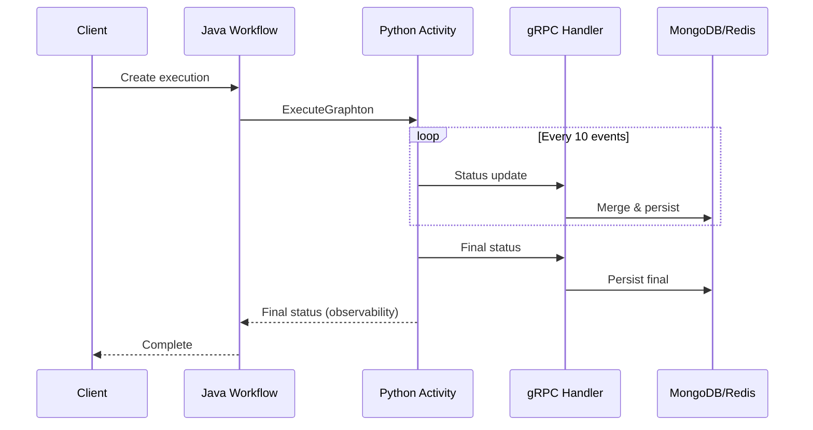

# Current Implementation: Agent Execution with Progressive Status Updates

**Last Updated**: 2026-01-15  
**Status**: ✅ Active Implementation

---

## Overview

Agent execution uses a **hybrid architecture** combining:
- **Temporal workflows** for orchestration
- **Python activities** for agent execution
- **gRPC calls** for real-time status updates

This provides both reliable orchestration (Temporal) and real-time progress visibility (gRPC).

---

## Architecture Summary



---

## Key Components

### 1. Temporal Workflow (Java)

**File**: `stigmer-service/.../temporal/workflow/InvokeAgentExecutionWorkflowImpl.java`

**Purpose**: Orchestrate execution flow

```java
public void run(AgentExecution execution) {
    // 1. Ensure thread
    String threadId = ensureThreadActivity.ensureThread(sessionId, agentId);
    
    // 2. Execute agent (sends progressive updates via gRPC)
    AgentExecutionStatus finalStatus = executeGraphtonActivity.executeGraphton(execution, threadId);
}
```

**Task Queue**: `execution`

### 2. Python Activities (agent-runner)

#### ExecuteGraphton

**File**: `agent-runner/worker/activities/execute_graphton.py`

**Purpose**: Execute agent + send progressive status updates

```python
@activity.defn(name="ExecuteGraphton")
async def execute_graphton(execution: AgentExecution, thread_id: str) -> AgentExecutionStatus:
    execution_client = AgentExecutionClient(token_manager)
    
    # Execute and stream events
    async for event in agent_graph.astream_events(...):
        await status_builder.process_event(event)
        
        # Progressive update every 10 events
        if events_processed % 10 == 0:
            await execution_client.update(execution_id, status_builder.current_status)
    
    # Final update
    await execution_client.update(execution_id, status_builder.current_status)
    return status_builder.current_status
```

#### EnsureThread

**File**: `agent-runner/worker/activities/ensure_thread.py`

**Purpose**: Create/retrieve thread ID for LangGraph state

```python
@activity.defn(name="EnsureThread")
async def ensure_thread(session_id: str, agent_id: str) -> str:
    return f"thread-{session_id}" if session_id else f"ephemeral-{agent_id}-{uuid4()}"
```

### 3. gRPC Status Update Handler (Java)

**File**: `stigmer-service/.../request/handler/AgentExecutionUpdateHandler.java`

**Purpose**: Receive and merge status updates from agent-runner

**Custom Component**: `BuildNewStateWithStatusStep`

```java
// Standard pipeline: clears status (spec-only updates)
// Custom step: merges status (supports progressive updates)

if (request.hasStatus()) {
    // Merge messages, tool_calls, todos, phase, etc.
    statusBuilder.clearMessages().addAllMessages(requestStatus.getMessagesList());
    statusBuilder.clearToolCalls().addAllToolCalls(requestStatus.getToolCallsList());
    // ... persist to MongoDB + Redis
}
```

### 4. gRPC Client (Python)

**File**: `agent-runner/grpc_client/agent_execution_client.py`

**Purpose**: Send status updates from Python to stigmer-service

```python
class AgentExecutionClient:
    async def update_status(self, execution_id: str, status: AgentExecutionStatus):
        execution_update = AgentExecution(
            api_version="agentic.stigmer.ai/v1",
            kind="AgentExecution",
            metadata=ApiResourceMetadata(id=execution_id),
            status=status
        )
        return await self.command_stub.updateStatus(execution_update)
```

---

## Update Strategy

### Frequency

**Default**: Every **10 events**

**Configurable**: Change `update_interval` in `execute_graphton.py`

**Events include**:
- Tool call start/end
- AI message chunks
- State transitions
- System messages

### What Gets Updated

Each update contains:
- **messages**: All conversation messages (cumulative)
- **tool_calls**: All tool calls made (cumulative)
- **phase**: Current execution phase
- **todos**: Current todo list
- **timestamps**: Started/completed times

### Error Handling

**Best-effort delivery**:
```python
try:
    await execution_client.update(...)
except Exception as e:
    activity_logger.warning(f"Status update failed: {e}")
    # Continue execution - don't fail
```

**Why**: Status updates shouldn't break agent execution.

---

## File Structure

### stigmer-service

```
domain/agentic/agentexecution/
├── temporal/
│   ├── workflow/
│   │   ├── InvokeAgentExecutionWorkflow.java (interface)
│   │   ├── InvokeAgentExecutionWorkflowImpl.java (implementation)
│   │   └── InvokeAgentExecutionWorkflowCreator.java (workflow starter)
│   ├── activity/
│   │   ├── EnsureThreadActivity.java (interface - Python impl)
│   │   └── ExecuteGraphtonActivity.java (interface - Python impl)
│   ├── AgentExecutionTemporalWorkerConfig.java (worker registration)
│   └── AgentExecutionTemporalWorkflowTypes.java (constants)
└── request/handler/
    └── AgentExecutionUpdateHandler.java (gRPC handler with custom status merge)
```

### agent-runner

```
worker/
├── activities/
│   ├── execute_graphton.py (main execution logic + gRPC updates)
│   ├── ensure_thread.py (thread management)
│   └── graphton/
│       └── status_builder.py (builds status from events)
├── worker.py (Temporal worker setup)
└── grpc_client/
    └── agent_execution_client.py (gRPC client for status updates)
```

---

## Configuration

### Environment Variables

#### stigmer-service

```yaml
TEMPORAL_AGENT_EXECUTION_TASK_QUEUE: execution
```

#### agent-runner

```yaml
TEMPORAL_AGENT_EXECUTION_TASK_QUEUE: execution
STIGMER_BACKEND_ENDPOINT: localhost:8080  # For gRPC updates
```

### Update Frequency

**File**: `execute_graphton.py`

```python
update_interval = 10  # Change this value

# Options:
# - 5: More real-time (more overhead)
# - 10: Balanced (recommended)
# - 20: Less frequent (less overhead)
```

---

## Key Design Decisions

### Why gRPC Instead of Temporal Activities?

**Temporal Limitation**: Activities cannot call other activities

**Options considered**:
1. ❌ Temporal child workflows (high overhead, complex)
2. ❌ Temporal heartbeats (not designed for data transfer)
3. ✅ **gRPC calls** (simple, direct, low overhead)

**Why gRPC works**:
- Direct communication
- Low overhead
- Best-effort delivery
- Already have gRPC infrastructure
- Simple implementation

### Why Custom Build Step?

**Standard pipeline**: `buildNewState` → `clearStatusField` → status updates ignored

**Custom step**: `buildNewStateWithStatusStep` → **merges status** → progressive updates work

**Why needed**: Standard update pipeline is designed for spec-only updates. Status updates require custom merge logic.

### Why Return Status to Workflow?

Even though status is persisted via gRPC, we still return it to the workflow:

**Benefits**:
- ✅ Temporal UI shows final state
- ✅ Workflow execution is observable
- ✅ Can debug issues in Temporal UI
- ✅ Maintains Temporal best practices

---

## Testing

### Run Locally

```bash
# Terminal 1: stigmer-service
cd backend/services/stigmer-service
./gradlew bootRun

# Terminal 2: agent-runner
cd backend/services/agent-runner
poetry run python main.py

# Terminal 3: Create execution
grpcurl -d '{"spec":{"session_id":"ses_test","agent_id":"agt_test","message":"Hello!"}}' \
  localhost:8080 ai.stigmer.agentic.agentexecution.v1.AgentExecutionCommandController/create
```

### Verify Progressive Updates

**Watch logs**:

**agent-runner**:
```
📤 Sending status update #10: messages=1, tool_calls=0
✅ Status update sent successfully
📤 Sending status update #20: messages=2, tool_calls=1
✅ Status update sent successfully
```

**stigmer-service**:
```
Merged status updates: messages=2, tool_calls=1, phase=EXECUTION_IN_PROGRESS
Saved execution to MongoDB
Published to Redis stream
```

### Verify in Database

```javascript
db.agent_executions.findOne({_id: "aex_xxx"})
// Should show progressive updates:
// - messages: [...] (grows during execution)
// - phase: EXECUTION_IN_PROGRESS (during), EXECUTION_COMPLETED (after)
```

---

## Performance Characteristics

### Latency

**Typical execution**:
```
1. EnsureThread:        ~50ms
2. ExecuteGraphton:     ~10-60s
   └─ Status updates:   ~20-50ms each (10-15 updates)
Total: ~10-60s (dominated by agent execution)
```

### Overhead

**Per execution**:
- 10-15 gRPC status updates (depends on execution length)
- Each update: ~20-50ms (DB write + Redis publish)
- Total overhead: ~200-750ms (negligible vs execution time)

### Scalability

**Horizontal scaling**:
- Python workers scale independently (CPU-bound agent execution)
- Java service scales independently (I/O-bound persistence)

---

## Related Documentation

- [Architecture: Agent Execution Workflow](architecture/agent-execution-workflow.md)
- [Guide: Working with Agent Execution](guides/working-with-agent-execution.md)
- [Fix: Progressive Status Updates](fixes/2026-01-15-implement-progressive-status-updates-via-grpc.md)
- [Architecture: Data Model](architecture/data-model.md)

---

## Troubleshooting

### Status Not Updating

**Check**:
1. Agent-runner logs show: `📤 Sending status update`
2. Stigmer-service logs show: `Merged status updates`
3. gRPC endpoint accessible: `curl http://localhost:8080`
4. Authentication working (check for token errors)

**Fix**: Restart both services

### Updates Too Frequent/Infrequent

**Adjust interval**:
```python
update_interval = 20  # Increase for less frequent updates
update_interval = 5   # Decrease for more frequent updates
```

### Workflow Not Starting

**Check**:
1. Temporal UI: http://localhost:8233
2. Task queue matches: both use `execution`
3. Worker logs show: `Worker ready, polling for tasks...`

---

## Summary

**Current implementation**:
- ✅ Single `execution` task queue (Java workflow + Python activities)
- ✅ Progressive status updates via gRPC (real-time)
- ✅ Custom status merge logic (preserves + adds new)
- ✅ Best-effort delivery (execution continues on failure)
- ✅ Final status returned to workflow (Temporal observability)

**Key insight**: Combine Temporal (orchestration) + gRPC (status updates) for best of both worlds.
