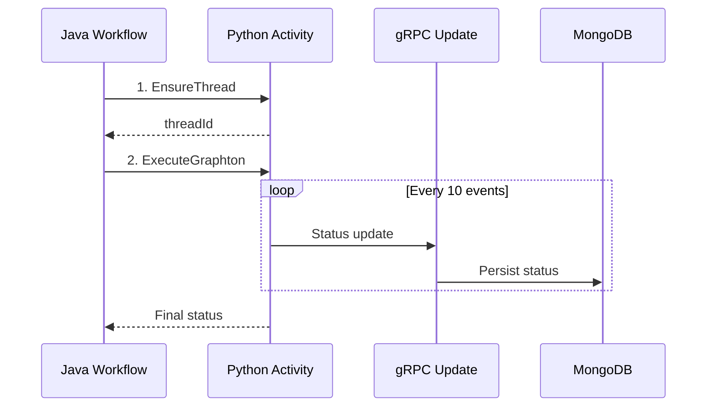

# Agent Runner Documentation

Complete documentation for the Agent Runner service - a Python Temporal worker that executes Graphton agents for Stigmer.

---

## Quick Links

- **[✅ CURRENT IMPLEMENTATION](CURRENT_IMPLEMENTATION.md)** - **START HERE** - Complete overview of the current implementation
- **[📋 MIGRATION SUMMARY](MIGRATION_SUMMARY.md)** - What changed from Temporal activities to gRPC updates
- **[Architecture: Agent Execution Workflow](architecture/agent-execution-workflow.md)** - How agent execution works with Temporal + gRPC
- **[Architecture: Skill Architecture](architecture/skill-architecture.md)** - Complete skill system: push, versioning, extraction, and injection
- **[Guide: Working with Agent Execution](guides/working-with-agent-execution.md)** - Developer guide for implementation and debugging
- **[Architecture: Data Model](architecture/data-model.md)** - Resource hierarchy and relationships
- **[Fix: Progressive Status Updates](fixes/2026-01-15-implement-progressive-status-updates-via-grpc.md)** - How real-time status updates were implemented

---

## Implementation Status

**[✅ Current Implementation](CURRENT_IMPLEMENTATION.md)** - **START HERE**  
Complete overview of the active implementation with architecture summary, key components, configuration, and testing guide. Essential for understanding how the system works right now.

**[📋 Migration Summary](MIGRATION_SUMMARY.md)**  
What changed from the Temporal activity approach to gRPC status updates. Includes before/after comparison, files changed, configuration changes, and testing checklist.

---

## Architecture

### Core Concepts

**[Agent Execution Workflow](architecture/agent-execution-workflow.md)**  
How agent execution combines Temporal workflows (orchestration) with gRPC calls (status updates) to provide real-time progress visibility. Explains the polyglot pattern, progressive status updates, and the separation between orchestration and persistence.

**[Skill Architecture](architecture/skill-architecture.md)**  
Complete skill system architecture from push to runtime execution. Covers versioning, content-addressable storage, artifact extraction, prompt injection, and graceful degradation. Includes MongoDB indexes, security considerations, and performance characteristics.

**[Data Model](architecture/data-model.md)**  
Understanding the resource hierarchy: Agent → AgentInstance → Session → Execution, and how skills and environments are resolved via ApiResourceReference.

---

## Guides

**[Working with Agent Execution](guides/working-with-agent-execution.md)**  
Practical guide for developers implementing or debugging agent execution. Covers:
- Running locally
- Adjusting update frequency
- Adding custom status fields
- Troubleshooting common issues
- Best practices and patterns

---

## Fixes & Implementation

### Recent Changes

**[Progressive Status Updates](fixes/2026-01-15-implement-progressive-status-updates-via-grpc.md)** (2026-01-15)  
Complete documentation of how real-time status updates were implemented using gRPC calls from Python activity to stigmer-service. Includes architecture, data flow, benefits, and testing guide.

**Key Changes**:
- Created `AgentExecutionClient` for gRPC updates
- Added progressive update calls in `ExecuteGraphton` activity
- Created custom `BuildNewStateWithStatusStep` for status merging
- Removed `UpdateExecutionStatusActivity` and `execution-persistence` queue
- Simplified Temporal workflow to 2 activities

---

## Getting Started

See the [root README](../README.md) for:
- Quick start guide
- Environment configuration
- Local development setup
- Deployment instructions

### Build System

**[Bazel + Poetry Integration](learning-log.md#build-system--bazel-configuration)**  
How agent-runner integrates Bazel (build system) with Poetry (dependency management). Essential for understanding:
- Why `BUILD_WORKSPACE_DIRECTORY` is needed
- Proper `py_library` + `py_binary` + `sh_binary` structure
- How to run via `bazel run` while preserving Poetry dependencies
- Common mistakes and solutions

---

## Service Overview

Agent Runner is a Python Temporal worker service that:

1. **Executes Graphton agents** - Creates agents at runtime and invokes them with user messages
2. **Sends progressive status updates** - Real-time updates to stigmer-service via gRPC every N events
3. **Manages Daytona sandboxes** - Session-based sandbox lifecycle for file persistence
4. **Handles skills** - Downloads artifacts, extracts to `/bin/skills/{hash}/`, and injects SKILL.md into prompts. See [Skill Architecture](architecture/skill-architecture.md) for complete details.
5. **Merges environments** - Layers multiple environment configurations with proper overrides

---

## Key Patterns

### Agent Execution Flow



**Key Design**: 
- Temporal workflow orchestrates (EnsureThread → ExecuteGraphton)
- Python activity sends progressive updates via gRPC during execution
- Final status returned to workflow for Temporal observability

See [Architecture: Agent Execution Workflow](architecture/agent-execution-workflow.md) for details.

### Resource Resolution Chain

```
AgentExecution
    → Session (agent_instance_id, thread_id, sandbox_id)
        → AgentInstance (agent_id, environment_refs)
            → Agent (instructions, skill_refs, mcp_servers)
                → Skills (via ApiResourceReference)
```

### Environment Merging

Environments are layered with explicit override semantics:

```
Base (agent.env_spec)
    ← Environment[0] (first ref)
    ← Environment[1] (overrides first)
    ← Environment[n] (overrides all previous)
    ← runtime_env (highest priority)
```

---

## Update Strategy

**Progressive status updates** sent via gRPC:

- **Trigger**: Every 10 events (configurable)
- **Contains**: Messages, tool calls, phase, todos, timestamps
- **Delivery**: Best-effort (execution continues even if update fails)
- **Final update**: Always sent when agent completes

**Benefits**:
- ✅ Real-time progress visibility
- ✅ Users see messages/tool calls as they happen
- ✅ Frontend can show live progress
- ✅ Simple implementation (direct gRPC calls)

---

## Contributing

When adding new documentation:

1. **Choose the right category**:
   - System design/how it works → `architecture/`
   - What was built/changes → `fixes/` or `implementation/`
   - How to do something/tutorials → `guides/`

2. **Use lowercase hyphenated names**: `feature-name.md`

3. **Update this index** with a brief description and link

4. **Cross-reference related docs** - help readers navigate

5. **Follow writing guidelines** from workspace rule: `@general-writing-guidelines.mdc`

---

## Related Services

- **stigmer-service** - Java orchestration service with gRPC APIs and Temporal workflows
- **workflow-runner** - Go Temporal workflow execution service (if applicable)

---

## External Dependencies

- **Graphton** - Python framework for building LLM agents
- **Temporal** - Workflow orchestration platform
- **Daytona** - Development sandbox platform
- **gRPC** - Communication between agent-runner and stigmer-service
