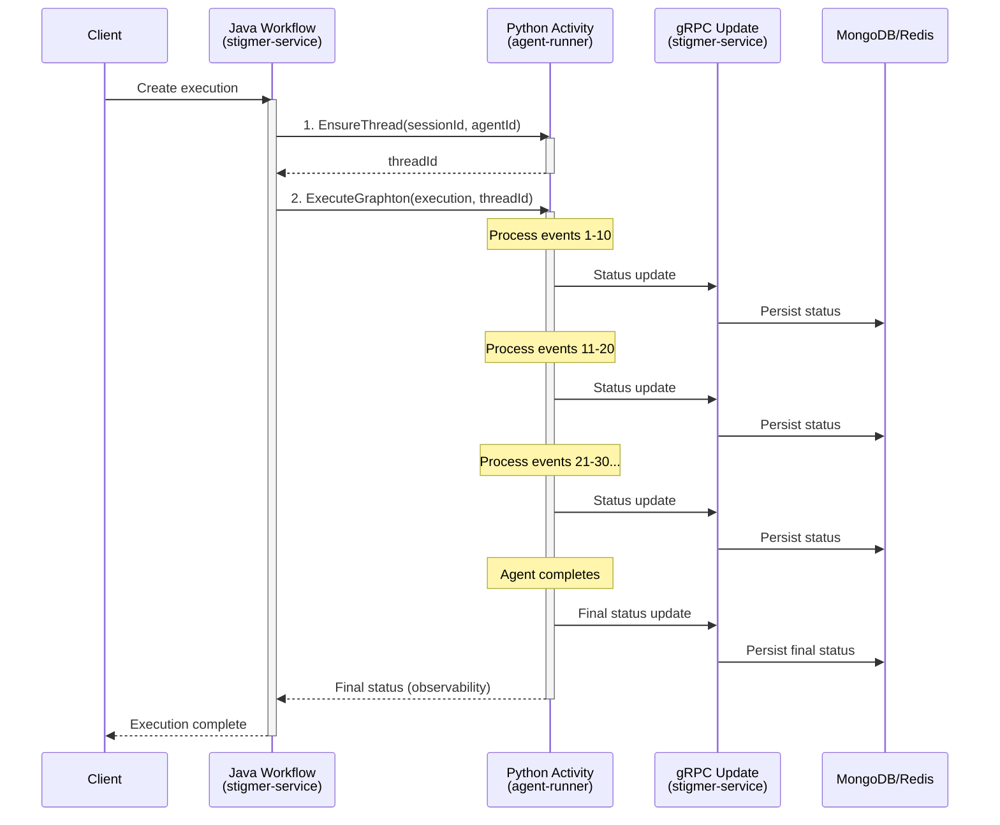

# Agent Execution Workflow Architecture

**Purpose**: Explains how agent execution works with Temporal workflows and gRPC status updates.

---

## Overview

Agent execution uses a **polyglot Temporal workflow** combined with **gRPC status updates**:

- **Java workflow** (stigmer-service) orchestrates execution
- **Python activities** (agent-runner) execute the agent  
- **gRPC calls** (agent-runner → stigmer-service) provide real-time status updates



---

## Why This Design?

### Problem
Agent execution takes time (seconds to minutes). Users need to see progress in real-time, not just final results.

### Solution
**Progressive status updates via gRPC** from Python activity to stigmer-service:
- ✅ Real-time progress (messages, tool calls, phase)
- ✅ Simple implementation (direct gRPC calls)
- ✅ Low overhead
- ✅ Clean separation of concerns

---

## Components

### 1. Java Workflow (Orchestrator)

**Location**: `stigmer-service/.../temporal/workflow/InvokeAgentExecutionWorkflowImpl.java`

**Responsibility**: Orchestrate the execution flow

```java
@Override
public void run(AgentExecution execution) {
    // Step 1: Ensure thread exists
    String threadId = ensureThreadActivity.ensureThread(sessionId, agentId);
    
    // Step 2: Execute agent (sends progressive updates via gRPC)
    AgentExecutionStatus finalStatus = executeGraphtonActivity.executeGraphton(execution, threadId);
    
    // Done! Status was updated progressively during execution
}
```

**Task Queue**: `execution`

### 2. Python Activities (Execution)

**Location**: `agent-runner/worker/activities/`

#### Activity: EnsureThread

**File**: `ensure_thread.py`

**Responsibility**: Create or retrieve thread ID for LangGraph state

```python
@activity.defn(name="EnsureThread")
async def ensure_thread(session_id: str, agent_id: str) -> str:
    if session_id:
        return f"thread-{session_id}"
    else:
        return f"ephemeral-{agent_id}-{uuid.uuid4().hex[:8]}"
```

#### Activity: ExecuteGraphton

**File**: `execute_graphton.py`

**Responsibility**: Execute agent and send progressive status updates

```python
@activity.defn(name="ExecuteGraphton")
async def execute_graphton(execution: AgentExecution, thread_id: str) -> AgentExecutionStatus:
    # Initialize gRPC client for status updates
    execution_client = AgentExecutionClient(token_manager)
    
    # Execute agent and process events
    events_processed = 0
    async for event in agent_graph.astream_events(...):
        await status_builder.process_event(event)
        events_processed += 1
        
        # Send status update every 10 events
        if events_processed % 10 == 0:
            await execution_client.update(
                execution_id=execution_id,
                status=status_builder.current_status
            )
    
    # Send final status update
    await execution_client.update(
        execution_id=execution_id,
        status=status_builder.current_status
    )
    
    # Return to workflow for observability
    return status_builder.current_status
```

**Key Design Point**: Activity sends status updates via gRPC during execution, not after completion.

### 3. gRPC Status Update Handler (Persistence)

**Location**: `stigmer-service/.../request/handler/AgentExecutionUpdateHandler.java`

**Responsibility**: Merge status updates and persist to DB

```java
@Component
static class BuildNewStateWithStatusStep implements RequestPipelineStepV2<UpdateContextV2<AgentExecution>> {
    
    @Override
    public RequestPipelineStepResultV2 execute(UpdateContextV2<AgentExecution> context) {
        AgentExecution request = context.getRequest();
        AgentExecution existing = context.getExistingState();
        
        // Start with existing execution as base
        AgentExecution.Builder builder = existing.toBuilder();
        
        // MERGE status from request (not replace)
        if (request.hasStatus()) {
            var statusBuilder = builder.getStatusBuilder();
            var requestStatus = request.getStatus();
            
            // Merge messages, tool_calls, todos, phase, etc.
            if (requestStatus.getMessagesCount() > 0) {
                statusBuilder.clearMessages()
                        .addAllMessages(requestStatus.getMessagesList());
            }
            // ... other fields
        }
        
        // Persist to MongoDB + Redis
        context.setNewState(builder.build());
        return RequestPipelineStepResultV2.success(getName());
    }
}
```

**Key Design Point**: Custom build step **merges** status updates instead of clearing them (standard behavior).

---

## Data Flow

### Workflow Initiation

```
gRPC Create Request 
→ AgentExecutionCreateHandler
→ Save to MongoDB
→ Start Temporal Workflow
→ InvokeAgentExecutionWorkflow
```

### Status Updates During Execution

```
Graphton Agent Streams Events
→ StatusBuilder.process_event (Python)
→ Every 10 events: gRPC update to stigmer-service
→ AgentExecutionUpdateHandler
→ BuildNewStateWithStatusStep (merge status)
→ Save to MongoDB + Redis
→ Published to subscribers
```

### Final Status

```
Agent completes
→ Final gRPC update (EXECUTION_COMPLETED)
→ Return status to workflow (Temporal observability)
→ Workflow completes
```

---

## Update Strategy

### When Updates Are Sent

**Trigger**: Every **10 events** processed by agent

**Events include**:
- Tool calls (start/end)
- AI messages (streaming chunks)
- State transitions
- System messages

**Configuration**:
```python
update_interval = 10  # Configurable in execute_graphton.py
```

### What Gets Updated

Each status update includes:
- **Messages**: All messages in conversation (cumulative)
- **Tool calls**: All tool calls made (cumulative)  
- **Phase**: Current execution phase (PENDING → IN_PROGRESS → COMPLETED)
- **Todos**: Current todo list from agent
- **Timestamps**: Started/completed times

### Error Handling

Updates are **best-effort**:
```python
try:
    await execution_client.update(...)
except Exception as e:
    # Log but don't fail - keep processing
    activity_logger.warning(f"Status update failed: {e}")
```

**Why**: Agent execution should continue even if status updates fail.

---

## Key Design Principles

### 1. Real-Time Over Batch

**Old way**: Build status locally, persist once at end  
**New way**: Send updates progressively during execution

**Benefit**: Users see progress in real-time

### 2. gRPC Over Temporal Activities

**Why not Temporal activities?**
- Activities can't call other activities (Temporal limitation)
- Would need complex child workflows
- Higher overhead

**Why gRPC?**
- Direct communication
- Low overhead
- Simple pattern
- Already have gRPC infrastructure

### 3. Merge Over Replace

**Standard update pipeline**: Clears status field (designed for spec updates)  
**Custom build step**: Merges status updates (preserves existing + adds new)

**Why**: Supports incremental status updates from agent-runner

### 4. Workflow for Observability

**Workflow still used for**:
- Orchestration (EnsureThread → ExecuteGraphton)
- Temporal UI visibility
- Automatic retries (on failure)
- Event history

**Not used for**:
- Status persistence (done via gRPC)
- Progressive updates (done via gRPC)

---

## Configuration

### Task Queue

**Queue name**: `execution`

**Workers**:
- Java worker (stigmer-service): Workflow only
- Python worker (agent-runner): Activities only

**Config**:
```yaml
# stigmer-service
temporal.agent-execution.task-queue: execution

# agent-runner  
TEMPORAL_AGENT_EXECUTION_TASK_QUEUE: execution
```

### Update Frequency

**Default**: Every 10 events

**Tuning**:
- Lower (5): More real-time, more overhead
- Higher (20): Less overhead, less real-time
- Recommended: 10 (good balance)

---

## Observability

### Temporal UI

View workflow execution at http://localhost:8233:

```
InvokeAgentExecutionWorkflow (execution-id)
  ├─ EnsureThread [Completed] → "thread-session-123"
  └─ ExecuteGraphton [Completed] → AgentExecutionStatus
```

**What you see**:
- Activity execution order
- Input/output for each activity
- Execution timeline
- Error stack traces (if failures)

**What you DON'T see**:
- Progressive status updates (happen via gRPC, not Temporal)

### Logs

**Python activity** (agent-runner):
```
ExecuteGraphton started for execution: aex_xxx
📤 Sending status update #10: messages=1, tool_calls=0
✅ Status update sent successfully
📤 Sending status update #20: messages=2, tool_calls=1
✅ Status update sent successfully
📤 Sending FINAL status update
✅ Final status update sent successfully
```

**Java handler** (stigmer-service):
```
Merged status updates: messages=2, tool_calls=1, phase=EXECUTION_IN_PROGRESS
Saved execution aex_xxx to MongoDB
Published execution aex_xxx to Redis stream
```

---

## Testing

### Create Execution

```bash
grpcurl -d '{
  "spec": {
    "session_id": "ses_test",
    "agent_id": "agt_test",
    "message": "Test progressive updates"
  }
}' localhost:8080 ai.stigmer.agentic.agentexecution.v1.AgentExecutionCommandController/create
```

### Watch Real-Time Updates

```bash
grpcurl -d '{"id":"aex_xxx"}' localhost:8080 \
  ai.stigmer.agentic.agentexecution.v1.AgentExecutionQueryController/subscribe
```

**Expected**: Stream of updates showing progressive status changes

### Verify in Database

```javascript
// MongoDB
db.agent_executions.findOne({_id: "aex_xxx"})

// Check for progressive updates:
// - messages: [...] (grows during execution)
// - phase: EXECUTION_IN_PROGRESS (during), EXECUTION_COMPLETED (after)
```

---

## Related Documentation

- [Progressive Status Updates Fix](../fixes/2026-01-15-implement-progressive-status-updates-via-grpc.md)
- [AgentExecution gRPC API](../../stigmer-service/docs/api/agent-execution.md)
- [Status Builder](../implementation/status-builder.md)

---

## Summary

**Agent execution workflow**:
1. ✅ Uses Temporal for orchestration (Java workflow)
2. ✅ Executes agents in Python (polyglot activities)
3. ✅ Sends progressive status updates via gRPC (real-time)
4. ✅ Merges status in custom build step (incremental updates)
5. ✅ Publishes to MongoDB + Redis (persistence + real-time)

**Key insight**: Combine Temporal (orchestration) + gRPC (status updates) for best of both worlds.
