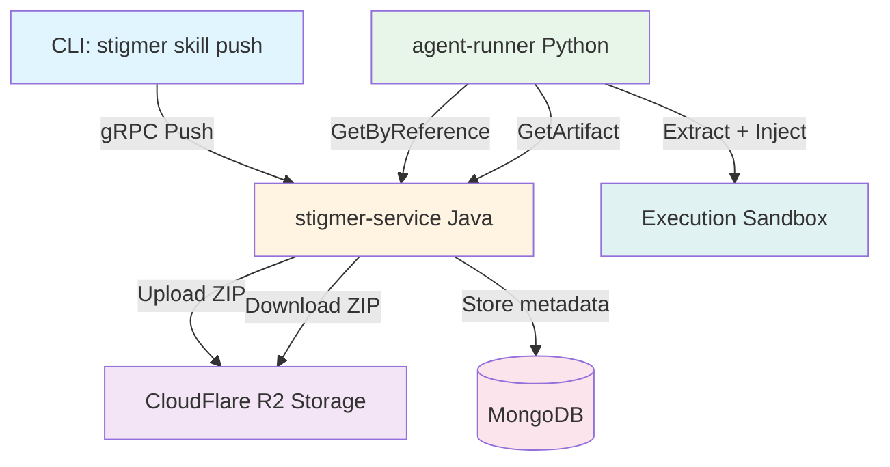
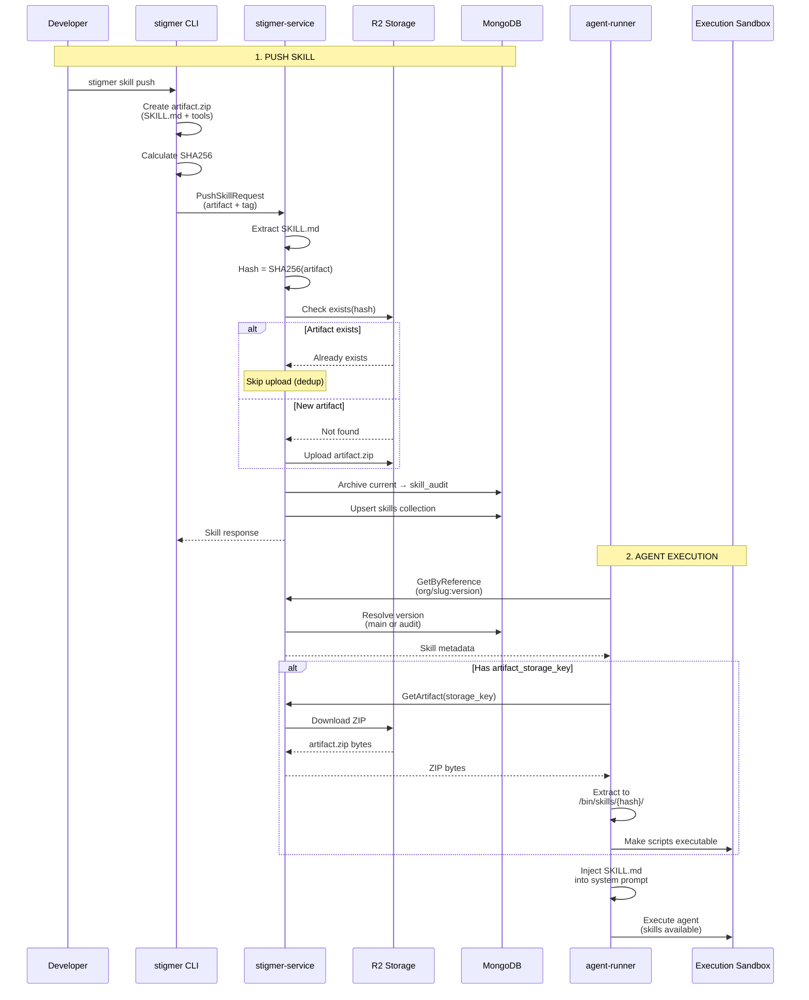
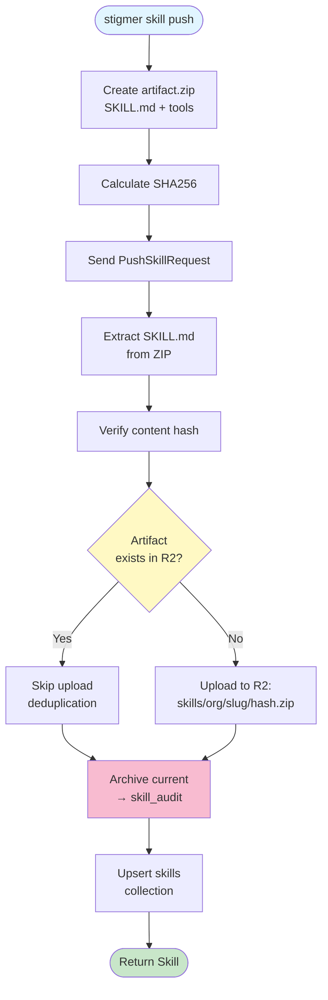
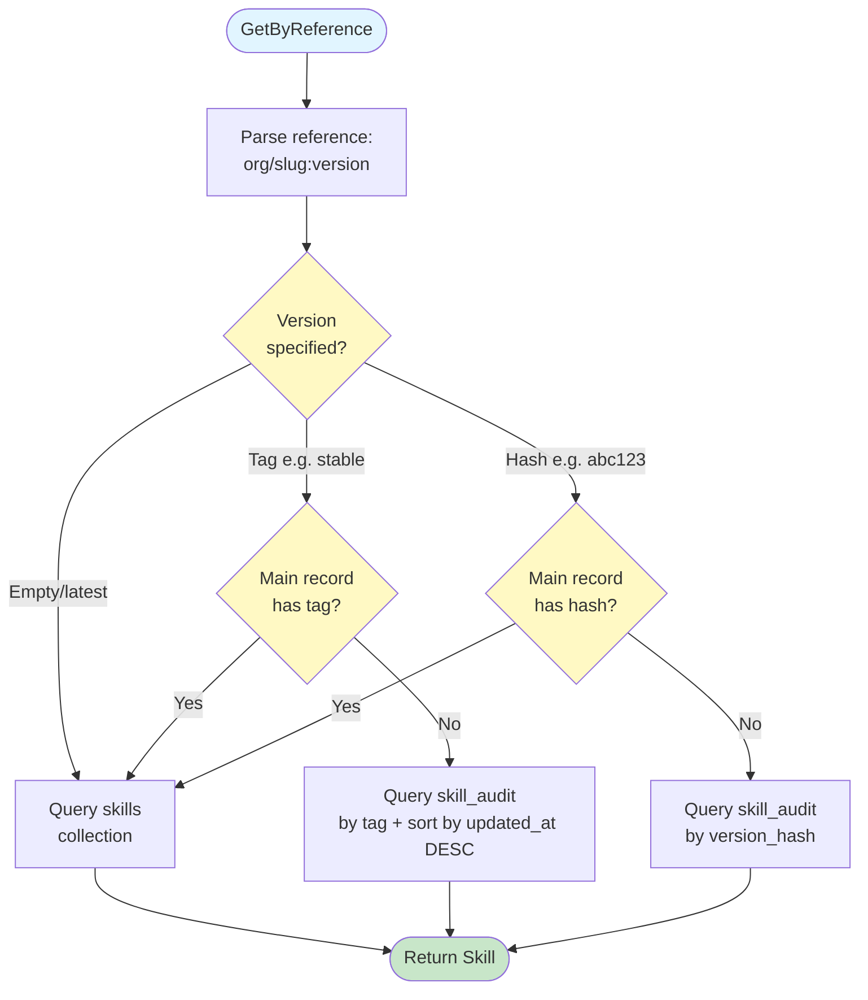
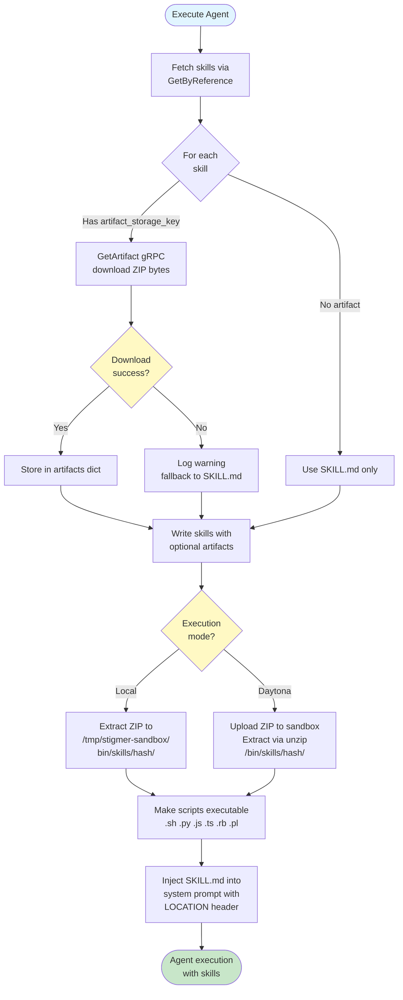
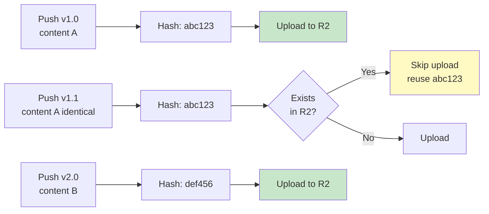
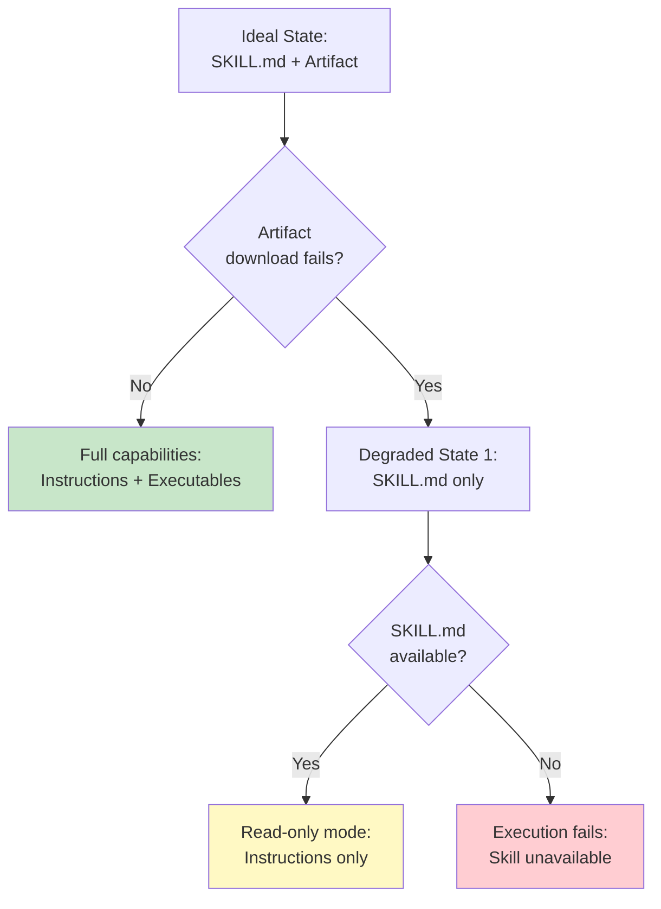

# Skill Architecture

Complete architecture for Stigmer's skill system, from pushing skills to runtime execution. Skills provide reusable capabilities (instructions + executable tools) that agents can use during execution.

---

## Overview

The skill system enables developers to package and share reusable agent capabilities. Each skill contains:

- **SKILL.md**: Interface definition with instructions for agents (always required)
- **Artifact ZIP**: Optional executable implementations (scripts, binaries, libraries)

Skills are versioned using **content-addressable storage** (SHA256 hashes) with optional **mutable tags** for convenience.

**Key Design Principles**:
1. **Immutable versions**: Content hash ensures versions never change
2. **Content deduplication**: Same content = same hash = single storage
3. **Graceful degradation**: Works with SKILL.md only if artifacts unavailable
4. **Dual-mode support**: Local filesystem and cloud (Daytona) sandboxes

---

## System Components



**Components**:
- **CLI** (`stigmer skill push`): Packages and uploads skills
- **stigmer-service** (Java): Manages storage, versioning, and retrieval
- **R2 Storage**: CloudFlare object storage for artifact ZIPs
- **MongoDB**: Metadata and version history (skills + skill_audit collections)
- **agent-runner** (Python): Downloads and injects skills during agent execution
- **Sandbox**: Execution environment (local filesystem or Daytona)

---

## Data Model

### Proto Structure

Following Kubernetes patterns, skills separate user intent (Spec) from system state (Status):

```protobuf
message Skill {
  ai.stigmer.commons.apiresource.ApiResourceMetadata metadata = 1;
  SkillSpec spec = 2;
  SkillStatus status = 3;
}

message SkillSpec {
  string skill_md = 1;  // SKILL.md content (user-provided)
  string tag = 2;       // Optional mutable tag (e.g., "stable", "v1.0")
}

message SkillStatus {
  string version_hash = 1;        // SHA256 content fingerprint (system-generated)
  string artifact_storage_key = 2; // R2 storage path (system-generated)
  SkillState state = 3;            // UPLOADING/READY/FAILED
  ApiResourceAudit audit = 99;     // Created/updated timestamps
}
```

**Key Fields**:
- `spec.skill_md`: Complete SKILL.md content describing the skill interface
- `spec.tag`: Optional human-readable version label (e.g., "stable", "v2.0")
- `status.version_hash`: SHA256 hash of artifact content (immutable)
- `status.artifact_storage_key`: R2 path where ZIP is stored

### MongoDB Collections

**Two-collection strategy** for current state + complete history:

```javascript
// Collection: skills (current state only)
{
  "_id": "uuid",
  "metadata": {
    "id": "uuid",
    "org": "acme",
    "slug": "calculator",
    "name": "acme/calculator"
  },
  "spec": {
    "skill_md": "# Calculator Skill\n...",
    "tag": "stable"
  },
  "status": {
    "version_hash": "abc123def456...",
    "artifact_storage_key": "skills/acme/calculator/abc123def456.zip",
    "state": "READY",
    "audit": {
      "spec_audit": {
        "created_at": "2026-01-25T10:00:00Z",
        "updated_at": "2026-01-25T12:00:00Z"
      }
    }
  }
}

// Collection: skill_audit (complete version history)
[
  {
    "_id": "uuid_v1",
    "skill_id": "uuid",
    "archived_at": "2026-01-25T11:00:00Z",
    "metadata": { /* snapshot */ },
    "spec": { "tag": "stable", /* v1 */ },
    "status": { "version_hash": "old123...", /* v1 */ }
  },
  {
    "_id": "uuid_v2",
    "skill_id": "uuid", 
    "archived_at": "2026-01-25T12:00:00Z",
    "metadata": { /* snapshot */ },
    "spec": { "tag": "stable", /* v2 */ },
    "status": { "version_hash": "abc123...", /* v2 */ }
  }
]
```

**Collection Responsibilities**:
- **skills**: Fast lookups for current/latest version (one record per skill)
- **skill_audit**: Time travel and historical queries (immutable snapshots)

**Archival Trigger**: Every update to `skills` collection archives the current state to `skill_audit` before applying changes.

---

## Complete Skill Lifecycle



---

## Core Workflows

### 1. Push Skill

Developer uploads a skill with optional tag:



**Key Operations**:
1. **Extract SKILL.md**: Validate that SKILL.md exists in ZIP
2. **Calculate hash**: SHA256 of artifact bytes (content-addressable)
3. **Deduplication**: Skip upload if hash already exists in R2
4. **Archival**: Save current version to `skill_audit` before update
5. **Upsert**: Update main `skills` collection (one record per skill)

**Storage Key Format**: `skills/{org}/{slug}/{version_hash}.zip`

### 2. Version Resolution

Agents reference skills using `ApiResourceReference` with optional version:



**Resolution Logic**:

| Reference | Resolution Strategy | Example |
|-----------|-------------------|---------|
| `acme/calculator` | Return main table (always latest) | Latest version |
| `acme/calculator:latest` | Return main table | Explicit latest |
| `acme/calculator:stable` | Check main, then audit by tag (most recent) | Tagged version |
| `acme/calculator:abc123...` | Check main, then audit by hash | Immutable pinned version |

**MongoDB Queries**:

```javascript
// Latest (no version)
db.skills.findOne({ "metadata.org": "acme", "metadata.slug": "calculator" })

// Tag (e.g., "stable")
// Try main first
db.skills.findOne({ "metadata.org": "acme", "metadata.slug": "calculator", "spec.tag": "stable" })
// If not found, search audit
db.skill_audit.findOne(
  { skill_id: "uuid", "spec.tag": "stable" },
  { sort: { "status.audit.spec_audit.updated_at": -1 } }
)

// Exact hash
// Try main first
db.skills.findOne({ "metadata.org": "acme", "metadata.slug": "calculator", "status.version_hash": "abc123..." })
// If not found, search audit
db.skill_audit.findOne({ skill_id: "uuid", "status.version_hash": "abc123..." })
```

### 3. Artifact Download & Extraction

During agent execution, agent-runner downloads and extracts skill artifacts:



**Extraction Details**:

**Local Mode** (filesystem):
```python
def _extract_artifact_local(self, artifact_bytes: bytes, target_dir: str):
    """Extract skill artifact ZIP to local filesystem."""
    with zipfile.ZipFile(io.BytesIO(artifact_bytes)) as zf:
        zf.extractall(target_dir)
    
    # Make scripts executable
    for root, dirs, files in os.walk(target_dir):
        for file in files:
            if file.endswith(('.sh', '.py', '.js', '.ts', '.rb', '.pl')):
                path = os.path.join(root, file)
                os.chmod(path, 0o755)
```

**Daytona Mode** (sandbox):
```python
def _extract_artifact_daytona(self, skill_dir: str):
    """Extract skill artifact ZIP in Daytona sandbox."""
    # Upload ZIP to sandbox
    zip_path = f"{skill_dir}/artifact.zip"
    self.daytona.upload_file(zip_path, artifact_bytes)
    
    # Extract using unzip command
    self.daytona.execute_command(f"cd {skill_dir} && unzip -q artifact.zip")
    
    # Make scripts executable
    self.daytona.execute_command(f"find {skill_dir} -type f \\( -name '*.sh' -o -name '*.py' -o -name '*.js' \\) -exec chmod +x {{}} \\;")
    
    # Cleanup
    self.daytona.execute_command(f"rm {zip_path}")
```

**Executable Permissions**: Auto-detect and chmod known script extensions (`.sh`, `.py`, `.js`, `.ts`, `.rb`, `.pl`) to `0o755`.

---

## Skill Injection into Agent Prompt

The agent-runner injects complete SKILL.md content into the system prompt with LOCATION headers:

### Prompt Format

```markdown
## Available Skills

The following skills provide specialized capabilities.
Each skill includes instructions and executable tools.

### SKILL: calculator
LOCATION: /bin/skills/abc123def456.../

# Calculator Skill

Provides basic arithmetic operations via command-line tool.

## Usage

Run calculations using the `calc` command:

```bash
$ /bin/skills/abc123def456.../calc "2 + 2"
4
```

## Operations

- Addition: `calc "5 + 3"`
- Subtraction: `calc "10 - 4"`
- Multiplication: `calc "6 * 7"`
- Division: `calc "20 / 4"`

### SKILL: web-search
LOCATION: /bin/skills/789xyz.../

# Web Search Skill

Searches the web using the provided query...
```

### Injection Logic

```python
def _generate_prompt_section(self, skills: list[Skill], skill_paths: dict[str, str]) -> str:
    """Generate system prompt section for skills."""
    if not skills:
        return ""
    
    lines = [
        "## Available Skills",
        "",
        "The following skills provide specialized capabilities.",
        "Each skill includes instructions and executable tools.",
        ""
    ]
    
    for skill in skills:
        skill_name = skill.metadata.slug
        location = skill_paths.get(skill.metadata.id, "unknown")
        
        lines.extend([
            f"### SKILL: {skill_name}",
            f"LOCATION: {location}",
            "",
            skill.spec.skill_md,  # Full SKILL.md content
            ""
        ])
    
    return "\n".join(lines)
```

**Key Points**:
- **Full content injection**: Complete SKILL.md is included (not just metadata)
- **LOCATION header**: Tells agents where executable tools are located
- **Split-brain architecture**: Instructions in prompt + executables in filesystem

---

## File System Layout

Skills are extracted to a standardized directory structure:

```
/bin/skills/{version_hash}/
├── SKILL.md              # Interface definition (always present)
├── calc                  # Example executable (optional)
├── lib/                  # Supporting libraries (optional)
│   └── calculator.py
└── tests/                # Tests (optional)
    └── test_calculator.py
```

**Path Components**:
- **Base**: `/bin/skills/` (standard location)
- **Version hash**: SHA256 of artifact content (immutable)
- **SKILL.md**: Always written (even if no artifact)
- **Other files**: From artifact ZIP (if present)

**Local Mode Path**: `{local_root}/bin/skills/{version_hash}/`
- Example: `/tmp/stigmer-sandbox/bin/skills/abc123.../`

**Daytona Mode Path**: `/bin/skills/{version_hash}/`
- Absolute path inside sandbox

---

## Content-Addressable Storage

Skills use SHA256 hashing for content-addressable storage with automatic deduplication:

### Deduplication Flow



**Benefits**:
1. **Storage efficiency**: Identical content stored once
2. **Bandwidth savings**: No re-upload of existing content
3. **Cache-friendly**: Hash-based paths enable immutable caching
4. **Integrity verification**: Hash proves content hasn't been corrupted

**Implementation**:

```java
public Skill push(PushSkillRequest request) {
    byte[] artifactBytes = request.getArtifact().toByteArray();
    String hash = DigestUtils.sha256Hex(artifactBytes);
    
    // Check if artifact already exists
    if (artifactStorage.exists(hash)) {
        logger.info("Artifact {} already exists, skipping upload", hash);
        // Just update metadata/tags, don't re-upload
    } else {
        String storageKey = String.format("skills/%s/%s/%s.zip", 
            org, slug, hash);
        artifactStorage.upload(storageKey, artifactBytes);
    }
    
    // Archive and upsert regardless of upload
    archiveCurrentVersion();
    return upsertMainCollection(hash, storageKey);
}
```

---

## MongoDB Indexes

The skill system uses compound indexes following MongoDB's ESR (Equality-Sort-Range) rule:

### skills Collection

```javascript
// Primary lookup by org/slug
db.skills.createIndex({ "metadata.org": 1, "metadata.slug": 1 })

// Tag-based queries
db.skills.createIndex({ "metadata.org": 1, "metadata.slug": 1, "spec.tag": 1 })

// Hash-based queries
db.skills.createIndex({ "metadata.org": 1, "metadata.slug": 1, "status.version_hash": 1 })
```

### skill_audit Collection

```javascript
// Version history for a skill
db.skill_audit.createIndex({ "skill_id": 1, "archived_at": -1 })

// Lookup by hash
db.skill_audit.createIndex({ "skill_id": 1, "status.version_hash": 1 })

// Tag resolution with ordering
db.skill_audit.createIndex({ "skill_id": 1, "spec.tag": 1, "archived_at": -1 })

// Org/slug + hash lookup
db.skill_audit.createIndex({ "metadata.org": 1, "metadata.slug": 1, "status.version_hash": 1 })

// Org/slug + tag resolution
db.skill_audit.createIndex({ "metadata.org": 1, "metadata.slug": 1, "spec.tag": 1, "archived_at": -1 })
```

**Index Design**:
- **Equality first**: Fields in equality predicates (skill_id, org, slug)
- **Sort second**: Fields used for sorting (archived_at DESC)
- **Range last**: Fields with range queries (if any)

---

## Error Handling & Graceful Degradation

The skill system is designed to degrade gracefully when artifacts are unavailable:

### Degradation Hierarchy



**Degradation Scenarios**:

1. **Full capabilities** (ideal):
   - SKILL.md injected into prompt
   - Artifact extracted to `/bin/skills/{hash}/`
   - Agents can use instructions AND executables

2. **Read-only mode** (degraded):
   - SKILL.md injected into prompt
   - No artifact (download failed or not present)
   - Agents have instructions but no executables
   - Useful for skills that are primarily instructional

3. **Skill unavailable** (failure):
   - Neither SKILL.md nor artifact available
   - Execution continues without the skill
   - May impact agent capabilities

**Implementation**:

```python
# Download artifacts with error handling
artifacts = {}
for skill in skills:
    if skill.status.artifact_storage_key:
        try:
            artifact_bytes = await skill_client.get_artifact(
                skill.status.artifact_storage_key
            )
            artifacts[skill.metadata.id] = artifact_bytes
        except Exception as e:
            logger.warning(
                f"Failed to download artifact for {skill.metadata.name}: {e}. "
                f"Falling back to SKILL.md only."
            )
            # Continue execution without artifact

# Write skills (with or without artifacts)
skill_paths = skill_writer.write_skills(skills, artifacts=artifacts)
```

**Best Practices**:
- Log warnings when degradation occurs
- Continue execution unless critical
- Provide clear error messages to users
- Monitor degradation rates in production

---

## Security Considerations

### 1. Artifact Storage Key as Capability Token

**Design**: No authorization check on `getArtifact` RPC

**Rationale**:
- Storage key itself acts as a capability token
- Only obtained through authorized `getByReference` calls
- Obscure storage paths provide defense-in-depth
- Simplifies implementation (no double authorization)

**Security Layers**:
1. Authorization check on `getByReference` (who can fetch skill metadata)
2. Storage key only in authorized responses
3. Storage key format: `skills/{org}/{slug}/{hash}.zip` (not guessable)

### 2. ZIP Extraction Safety

**Threats**:
- Path traversal (e.g., `../../etc/passwd`)
- ZIP bombs (compression bombs)
- Symbolic link attacks
- Filename injection

**Mitigations**:
```python
def _safe_extract(self, zip_file: zipfile.ZipFile, target_dir: str):
    """Safely extract ZIP with security checks."""
    for member in zip_file.namelist():
        # Prevent path traversal
        member_path = os.path.normpath(os.path.join(target_dir, member))
        if not member_path.startswith(target_dir):
            raise ValueError(f"Invalid path in ZIP: {member}")
        
        # Check file size (prevent ZIP bombs)
        info = zip_file.getinfo(member)
        if info.file_size > MAX_FILE_SIZE:  # e.g., 100MB
            raise ValueError(f"File too large: {member}")
    
    # Extract if all checks pass
    zip_file.extractall(target_dir)
```

**Additional Safeguards**:
- Extract to isolated directories (`/bin/skills/{hash}/`)
- Sandboxed execution environment (Daytona)
- File size limits on upload
- Malware scanning (future enhancement)

### 3. Executable Permissions

**Approach**: Auto-detect and chmod known script extensions

**Security Implications**:
- Only affects files in skill directory (isolated)
- Sandboxed execution reduces risk
- No system-wide permission changes
- Users cannot escalate privileges

---

## Testing Strategy

Comprehensive test coverage across multiple layers:

### Unit Tests

**Python (agent-runner)**:
- `test_skill_client.py` (7 tests): SkillClient.get_artifact() method
- `test_skill_writer.py` (22 tests): Extraction and prompt generation
  - Local extraction
  - Daytona extraction
  - Executable permissions
  - Prompt format validation

**Java (stigmer-service)**:
- `SkillGetArtifactHandlerTest.java` (11 tests): LoadArtifact step
  - Success cases
  - Not found scenarios
  - Validation errors

**Go (stigmer-server)**:
- `artifact_storage_test.go` (11 tests): LocalFileStorage CRUD
- `zip_extractor_test.go` (18 tests): Security validation
  - ZIP bomb detection
  - Path traversal prevention
  - Size limit enforcement
- `get_artifact_test.go` (5 tests): GetArtifact handler
- `push_test.go` (20 tests): Push handler with deduplication

### Integration Tests

**Python (agent-runner)**:
- `test_integration_skill_pipeline.py` (21 tests)
  - Full pipeline: Download → Extract → Inject
  - LOCATION header format
  - Permissions and paths
  - Error recovery

**Java (stigmer-service)**:
- `SkillVersionResolutionIntegrationTest.java` (18 tests)
  - Version resolution (latest/tag/hash)
  - Platform-scoped skills
  - Load → Authorize pipeline

**Go (stigmer-server)**:
- `integration_test.go` (11 tests)
  - End-to-end: Push → Get → GetByReference → GetArtifact
  - Concurrent operations

**Total Test Coverage**: 144 tests across all languages

---

## CLI Commands

### Push Skill

```bash
# Push from current directory
stigmer skill push

# Push from specific directory
stigmer skill push ./my-skill/

# Push with tag
stigmer skill push --tag v1.0
stigmer skill push --tag stable

# Push to specific organization
stigmer skill push --org acme

# Validate without pushing (dry-run)
stigmer skill push --dry-run

# Examples
stigmer skill push                    # Push current dir as latest
stigmer skill push --tag stable       # Update stable tag
stigmer skill push --tag v2.0         # Create new tagged version
```

**Expected Directory Structure**:
```
my-skill/
├── SKILL.md          # Required: Interface definition
├── tool              # Optional: Executable
└── lib/              # Optional: Libraries
    └── helper.py
```

**Push Process**:
1. Validate SKILL.md exists
2. Create artifact.zip from directory
3. Calculate SHA256 hash
4. Upload via gRPC (with deduplication)
5. Display result (version hash + storage key)

---

## Performance Characteristics

### Storage Efficiency

**Deduplication Savings**:
- Multiple versions with identical content: 1x storage
- Tags point to same hash: No additional storage
- Typical savings: 30-50% for iterative development

**Example**:
```
v1.0: Content A → Hash abc123 → 10MB storage
v1.1: Content A → Hash abc123 → 0MB (deduplicated)
v2.0: Content B → Hash def456 → 12MB storage
Total: 22MB (vs 32MB without dedup = 31% savings)
```

### Query Performance

**Fast Lookups** (indexed):
- Latest version: O(1) - main table lookup
- Tag resolution: O(log n) - indexed audit query
- Hash resolution: O(log n) - indexed audit query

**Slow Operations** (avoid):
- Full audit scan without skill_id filter
- Unindexed field queries
- Large projection without field filters

### Network Performance

**Artifact Download**:
- Typical skill size: 1-10MB
- Transfer time: ~1-10 seconds (depending on network)
- Parallelization: Multiple skills downloaded concurrently
- Caching: Hash-based paths enable CDN caching (future)

**Optimization Opportunities**:
- Compress artifacts before upload
- Implement artifact caching in agent-runner
- Use CDN for public skills
- Stream large artifacts (not implemented)

---

## Future Enhancements

### 1. Public Skill Registry

**Vision**: Community-driven skill marketplace

**Features**:
- Public vs private skills
- Skill discovery and search
- Ratings and reviews
- Usage analytics
- Verified publishers

### 2. Skill Dependencies

**Vision**: Skills can depend on other skills

**Example**:
```yaml
# SKILL.yaml (future)
name: advanced-calculator
dependencies:
  - acme/calculator:v1.0
  - acme/math-lib:stable
```

### 3. Runtime Caching

**Vision**: Cache downloaded artifacts locally

**Benefits**:
- Faster agent startup
- Reduced bandwidth
- Offline capability
- Deduplication across agents

**Implementation**:
```python
class SkillCache:
    def get(self, version_hash: str) -> bytes | None:
        cache_path = f"{cache_dir}/{version_hash}.zip"
        if os.path.exists(cache_path):
            return open(cache_path, 'rb').read()
        return None
    
    def put(self, version_hash: str, artifact: bytes):
        cache_path = f"{cache_dir}/{version_hash}.zip"
        with open(cache_path, 'wb') as f:
            f.write(artifact)
```

### 4. Skill Versioning Policies

**Vision**: Advanced version management

**Features**:
- Semantic versioning support
- Version constraints (e.g., `^1.0.0`)
- Deprecation warnings
- Automatic updates (opt-in)
- Version pinning policies

### 5. Skill Analytics

**Vision**: Track skill usage and performance

**Metrics**:
- Download counts
- Execution success rates
- Performance benchmarks
- Error rates
- Agent adoption

---

## Related Documentation

- **[Agent Execution Workflow](agent-execution-workflow.md)**: How agents execute with skills
- **[Data Model](data-model.md)**: Resource hierarchy and relationships
- **[Working with Agent Execution](../guides/working-with-agent-execution.md)**: Developer guide

---

## Implementation References

### Proto Definitions
- `apis/ai/stigmer/agentic/skill/v1/spec.proto`: Skill resource definition
- `apis/ai/stigmer/agentic/skill/v1/io.proto`: Request/response messages
- `apis/ai/stigmer/agentic/skill/v1/query.proto`: Query RPCs
- `apis/ai/stigmer/agentic/skill/v1/command.proto`: Command RPCs

### Backend Implementation (stigmer-cloud)
- `SkillPushHandler.java`: Push workflow
- `SkillGetByReferenceHandler.java`: Version resolution
- `SkillGetArtifactHandler.java`: Artifact download
- `SkillArtifactR2Store.java`: R2 storage operations
- `SkillAuditRepo.java`: Audit collection repository

### Agent-Runner Implementation (stigmer OSS)
- `grpc_client/skill_client.py`: gRPC client for skill operations
- `worker/activities/execute_graphton.py`: Skill download orchestration
- `worker/activities/graphton/skill_writer.py`: Extraction and injection

### CLI Implementation (stigmer OSS)
- `client-apps/cli/cmd/stigmer/root/skill.go`: Skill command group
- `client-apps/cli/internal/cli/artifact/skill.go`: Push implementation

---

**Last Updated**: 2026-01-25  
**Status**: Production-ready  
**Test Coverage**: 144 tests (Python: 50, Java: 29, Go: 65)
