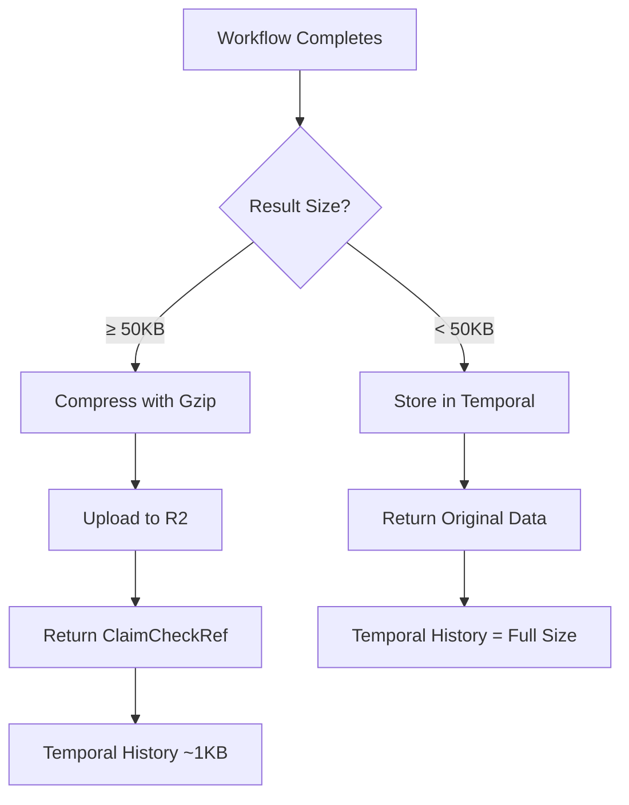
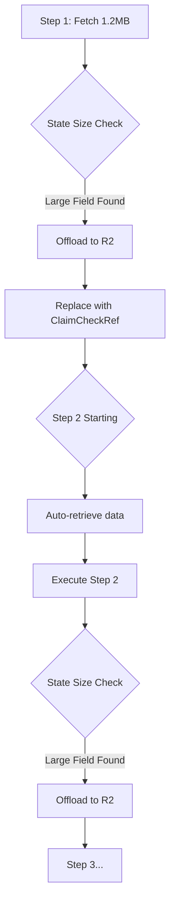
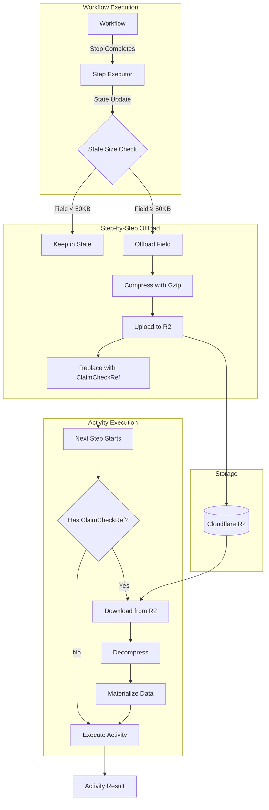

# Claim Check Pattern: Handling Large Workflow Payloads

The Claim Check pattern automatically offloads large workflow results (>50KB) to object storage, preventing Temporal from becoming bloated with massive payloads while keeping execution fast and reliable.

---

## Why Claim Check Exists

Temporal has hard limits on workflow history size (~50MB total). When workflows return large datasets—like fetching thousands of photos or processing megabytes of API responses—the history fills up quickly. This causes:

1. **Workflow failures** - History size exceeded
2. **Slow queries** - Loading megabytes from database
3. **Expensive storage** - Every workflow execution stores full data
4. **Network overhead** - Sending large payloads between workers

The Claim Check pattern solves this by storing large data in Cloudflare R2 (S3-compatible storage) and returning only a small reference (~1KB) in Temporal history.

---

## Real-World Example

**Without Claim Check** (1.2MB response):
```json
{
  "photos": [
    {"id": 1, "title": "...", "url": "...", "thumbnailUrl": "..."},
    {"id": 2, "title": "...", "url": "...", "thumbnailUrl": "..."},
    ... 5000 more photos ...
  ]
}
```
**Stored in Temporal**: 1,186,475 bytes  
**Result**: History grows fast, queries slow down

---

**With Claim Check** (1KB reference):
```json
{
  "type": "claim_check_ref",
  "key": "142S005f-7d6d-46d1-955e-61d3a8281dd8",
  "size_bytes": 1186475,
  "compressed": true,
  "stored_at": "2026-01-09T13:24:00Z"
}
```
**Stored in Temporal**: 298 bytes (99.97% reduction)  
**Result**: History stays small, queries stay fast

The actual 1.2MB data lives in R2, compressed with gzip (typically 70% smaller for JSON).

---

## How It Works

### Automatic Detection

When a workflow completes, Claim Check checks the result size:



### Threshold Configuration

**Default**: 50KB (51,200 bytes)  
**Configurable**: Set `CLAIMCHECK_THRESHOLD_BYTES` environment variable

**Why 50KB?**
- Small enough to catch medium-sized API responses
- Large enough to avoid offloading tiny payloads
- Tested with production workflows returning 1MB+ data

### Compression

Gzip compression is applied before upload:

| Data Type | Original Size | Compressed Size | Reduction |
|-----------|---------------|-----------------|-----------|
| JSON (photos) | 1.2 MB | ~350 KB | 70% |
| JSON (comments) | 75 KB | ~22 KB | 71% |
| Plain text | 100 KB | ~15 KB | 85% |
| Binary data | 500 KB | ~480 KB | 4% |

**Benefit**: Faster uploads, lower storage costs, quicker retrieval.

### Storage Lifecycle

**Automatic Cleanup**: Objects are tagged with 30-day TTL (Time To Live). R2 automatically deletes them after expiration.

**Cost**: 
- Storage: $0.015/GB/month
- Egress: $0 (R2 has zero egress fees)
- Example: 1TB workflow data = $15/month vs ~$100/month in Temporal operational costs

---

## Configuration

### Environment Variables

```bash
# Enable/disable Claim Check
CLAIMCHECK_ENABLED=true

# Threshold for offloading (bytes)
CLAIMCHECK_THRESHOLD_BYTES=51200  # 50KB

# Enable compression
CLAIMCHECK_COMPRESSION_ENABLED=true

# Auto-delete after N days
CLAIMCHECK_TTL_DAYS=30

# Cloudflare R2 credentials
R2_BUCKET=stigmer-prod-claimcheck-r2-bucket-manual
R2_ENDPOINT=https://[account-id].r2.cloudflarestorage.com
R2_ACCESS_KEY_ID=your-access-key
R2_SECRET_ACCESS_KEY=your-secret-key
R2_REGION=auto
```

### Validation

On startup, the worker validates:
- R2 credentials are present (if Claim Check enabled)
- Bucket is accessible
- Network connectivity to R2 endpoint

**Startup Log**:
```
✓ ClaimCheckManager initialized with R2Store
✓ R2 connectivity check: PASSED
✓ Claim Check activities registered
```

---

## Testing Claim Check

### Test Scripts

**Test 11: Large Payload at Workflow End**
- **Location**: `test/golden/test-11-claimcheck.sh`
- **Tests**: Offloading workflow final result
- **Scenario**: Fetches 5000 photos (~500KB) and 500 comments (~75KB)

**Test 12: Step-by-Step Offloading** ✨ NEW
- **Location**: `test/golden/test-12-claimcheck-between-steps.sh`
- **Tests**: Offloading large data BETWEEN workflow steps
- **Scenario**: 
  - Step 1: Fetch photos (~500KB) → Offloaded after step
  - Step 2: Fetch comments (~75KB) → Photos retrieved, comments offloaded
  - Step 3: Process both → Both datasets retrieved
  - Step 4: Verify data access → Proves all data accessible

**Run the tests**:
```bash
cd backend/services/workflow-runner/test/golden

# Test workflow-end offloading
./test-11-claimcheck.sh

# Test step-by-step offloading (NEW!)
./test-12-claimcheck-between-steps.sh
```

### Expected Results

**Test 11: Workflow End Offloading**:
- ✅ HTTP GET fetches 5000 photos (~500KB)
- ✅ HTTP GET fetches 500 comments (~75KB)
- ✅ Result: ClaimCheckRef object
- ✅ `OffloadActivity` visible in timeline
- ✅ R2 objects created
- ✅ Temporal history: ~1KB

**Test 12: Step-by-Step Offloading** ✨:
- ✅ Step 1 completes, photos offloaded to R2
- ✅ Step 2 starts, photos auto-retrieved
- ✅ Step 2 completes, comments offloaded to R2
- ✅ Step 3 starts, both datasets auto-retrieved
- ✅ Step 3 can access both via runtime expressions
- ✅ Step 4 verifies all data accessible
- ✅ Multiple `OffloadActivity` and `RetrieveActivity` calls
- ✅ Workflow completes WITHOUT "Input exceeds size limit" error

### Verification

**1. Check Temporal UI**  
URL: `https://stigmer-prod-temporal.planton.live`

Search for `large-payload-test-*` and verify:
- Workflow shows `OffloadActivity` in Event History
- Result is ClaimCheckRef (not full data)
- Workflow completed successfully

**2. Check R2 Bucket**  
Navigate to Cloudflare dashboard → R2 → Your bucket

Verify:
- New object with UUID from ClaimCheckRef
- Object size smaller than original (compressed)
- Metadata includes workflow ID

**3. Check Logs**  
Worker logs should show:
```
INFO  Offloading large payload size_bytes=1186475 threshold=51200
DEBUG ExecuteActivity ActivityType=OffloadActivity
INFO  Data offloaded to storage key=142S005f-... compressed=true
```

---

## Step-by-Step Offloading ✅

### ✨ NEW: Automatic Offloading Between Steps

**What works now**:
- ✅ Offloading at workflow END (final result)
- ✅ **Offloading BETWEEN workflow steps** (NEW!)

**How it works**:



**Scenario that now works**:
```yaml
do:
  - fetchPhotos:
      call: http  # Returns 1.2MB
      # ✅ After step: Data offloaded to R2, replaced with ClaimCheckRef
      
  - fetchComments:
      call: http  # Needs to access photos data
      # ✅ Before step: Photos auto-retrieved from R2
      # ✅ After step: Comments offloaded to R2
      
  - processBoth:
      call: http  
      # ✅ Before step: Both datasets auto-retrieved
      # Can access: ${ .fetchPhotos } and ${ .fetchComments }
```

**What happens automatically**:

1. **After each step completes**:
   - State data is scanned for large fields (>50KB)
   - Large fields are offloaded to R2
   - Original data replaced with `ClaimCheckRef`
   - Temporal history stays small (<1KB per step)

2. **Before each activity executes**:
   - State is scanned for `ClaimCheckRef` objects
   - References are auto-retrieved from R2
   - Activity receives materialized data
   - No workflow code changes needed

**Benefits**:
- ✅ Unlimited workflow steps with large data
- ✅ No activity input size limit errors
- ✅ Transparent to workflow authors
- ✅ Works with runtime expressions (`${ .fieldName }`)
- ✅ Preserves data access semantics

**Example workflow with multiple large steps**:

```yaml
do:
  - fetchPhotos:
      call: http
      with:
        endpoint:
          uri: https://api.example.com/photos  # 500KB
          
  - fetchComments:
      call: http
      with:
        endpoint:
          uri: https://api.example.com/comments  # 75KB
          
  - fetchPosts:
      call: http
      with:
        endpoint:
          uri: https://api.example.com/posts  # 100KB
          
  - combineAll:
      call: http
      with:
        method: POST
        endpoint:
          uri: https://api.example.com/summary
        body:
          # All three datasets available via ClaimCheckRefs
          photosCount: ${ .fetchPhotos | length }
          commentsCount: ${ .fetchComments | length }
          postsCount: ${ .fetchPosts | length }
```

**Behind the scenes**:
1. After `fetchPhotos`: 500KB offloaded → ClaimCheckRef in state
2. Before `fetchComments`: Photos retrieved, activity executes
3. After `fetchComments`: Both datasets offloaded → Two ClaimCheckRefs
4. Before `fetchPosts`: Both retrieved, activity executes
5. After `fetchPosts`: All three offloaded → Three ClaimCheckRefs
6. Before `combineAll`: All three retrieved, activity can access all data

**Performance impact**:
- Offload: ~250ms per large field (compress + upload)
- Retrieve: ~150ms per large field (download + decompress)
- Total overhead: ~400ms per large field per step
- **Trade-off**: 400ms delay vs workflow failure ✅ Worth it

---

## Architecture

### Components



### Key Classes

**`ClaimCheckManager`** (`pkg/claimcheck/manager.go`)
- Orchestrates offload/retrieve operations
- Checks payload size against threshold
- Invokes compression and storage
- **NEW**: `MaybeOffloadStateData()` - Scans and offloads large state fields
- **NEW**: `MaybeRetrieveStateData()` - Auto-retrieves ClaimCheckRefs

**`R2Store`** (`pkg/claimcheck/r2_store.go`)
- Implements S3-compatible upload/download
- Uses AWS SDK v2 with R2 endpoint
- Handles connection pooling and retries

**`Compressor`** (`pkg/claimcheck/compressor.go`)
- Applies gzip compression (level 6)
- Decompresses on retrieval
- Returns compression ratio metrics

**`ClaimCheckRef`** (`pkg/claimcheck/reference.go`)
- Structured reference to offloaded data
- Contains: key, size, compression flag, timestamp
- Serializes to JSON for Temporal storage
- Detected automatically in state data

### Implementation Points

**Step-by-Step Offloading** (`pkg/zigflow/tasks/task_builder_do.go`):
- After each task completes in `runTask()`:
  - Call `maybeOffloadStateData()` to scan state
  - Large fields (>50KB) are offloaded
  - Original data replaced with ClaimCheckRef
  - Workflow continues with small state

**Auto-Retrieval** (`pkg/zigflow/tasks/task_builder.go`):
- Before each activity executes in `executeActivity()`:
  - Call `maybeRetrieveStateData()` to scan state
  - Any ClaimCheckRef objects are detected
  - Data is retrieved from R2
  - Activity receives materialized data

**State Scanning** (`pkg/claimcheck/manager.go`):
- Iterates through `state.Data` map
- Serializes each field to measure size
- Offloads field if exceeds threshold
- Preserves field structure (map → map)
- Handles nested data structures

### Activity Timeouts

Both `OffloadActivity` and `RetrieveActivity` have:
- **Timeout**: 5 minutes (handles large uploads/downloads)
- **Retry Policy**: Up to 3 attempts with exponential backoff
- **Configured in**: `pkg/claimcheck/manager.go` lines 65-72

---

## Design Decisions

### Why Cloudflare R2?

**Chosen**: Cloudflare R2  
**Alternatives considered**: AWS S3, Google Cloud Storage

**Reasons**:
1. **Zero egress fees** - S3 charges $0.09/GB for data transfer out
2. **S3-compatible** - Uses standard AWS SDK, easy to swap if needed
3. **Lower storage costs** - $0.015/GB vs $0.023/GB for S3
4. **Performance** - Cloudflare's global network

**Trade-off**: Requires separate Cloudflare account, but cost savings justify it.

### Why 50KB Threshold?

**Testing showed**:
- Most API responses < 50KB (single resources, small lists)
- Medium responses 50KB-500KB (lists of 100s of items)
- Large responses >500KB (thousands of items, binary data)

**50KB catches**:
- ✅ ~100+ comment objects (~500 bytes each)
- ✅ ~50+ photo objects (~1KB each with URLs)
- ✅ Large JSON responses from APIs
- ❌ Single user objects (~2KB) - correctly stays in Temporal

### Why Gzip Compression?

**Alternatives**: LZ4, Zstd, Snappy

**Gzip chosen because**:
- **Ubiquitous** - Every language has gzip support
- **Good ratio** - 70% reduction for JSON/text
- **Standard library** - No external dependencies
- **HTTP-compatible** - Same compression as HTTP responses

**Level 6 chosen**: Balance between compression ratio and speed (faster than level 9, better ratio than level 1).

### Why 30-Day TTL?

**Workflow data retention requirements**:
- Debugging recent workflows: ~7 days
- Compliance/audit: ~30 days
- Long-term storage: Not needed (ClaimCheckRef is in Temporal history)

**30 days provides**:
- ✅ Enough time to debug issues
- ✅ Meets typical compliance needs
- ✅ Automatic cleanup (no manual intervention)
- ✅ Reduced storage costs

---

## Performance Metrics

### Workflow History Reduction

| Workflow | Without Claim Check | With Claim Check | Reduction |
|----------|---------------------|------------------|-----------|
| Fetch 5000 photos | 1,186,475 bytes | 298 bytes | 99.97% |
| Fetch 500 comments | 76,234 bytes | stays in Temporal | 0% |
| Fetch 1 post | 1,024 bytes | stays in Temporal | 0% |

### Upload Performance

**1.2MB payload**:
- Compression: ~50ms (to ~350KB)
- R2 upload: ~200ms (from Oregon to R2)
- Total overhead: ~250ms

**Trade-off**: 250ms upload time vs permanent 1.2MB in history (worth it).

### Cost Comparison

**Scenario**: 10,000 workflows/day with 1MB average payload

| Storage | Monthly Data | Cost/Month | Notes |
|---------|-------------|------------|-------|
| Temporal history | 300 GB | ~$100 | Operational cost (slow queries) |
| R2 (with Claim Check) | 300 GB | $4.50 | Storage only |
| **Savings** | - | **$95.50** | **95% reduction** |

---

## Troubleshooting

### Offload Not Happening

**Symptoms**: Large payload stays in Temporal history

**Checks**:
1. Verify `CLAIMCHECK_ENABLED=true`
2. Check payload size: `grep "Processing with Claim Check" logs`
3. Verify R2 credentials configured
4. Check worker logs for connection errors

**Common cause**: Threshold too high (payload < 50KB)

### R2 Connection Failures

**Symptoms**: `OffloadActivity` fails with timeout or connection error

**Checks**:
1. Verify R2 endpoint URL (should include account ID)
2. Test credentials: `aws s3 --endpoint-url=$R2_ENDPOINT ls s3://$R2_BUCKET/`
3. Check network connectivity from worker
4. Verify R2 bucket exists in Cloudflare dashboard

**Common cause**: Wrong endpoint URL or expired access keys

### Activity Timeout

**Symptoms**: `OffloadActivity` fails after 5 minutes

**Likely cause**: Very large payload (>100MB) with slow network

**Solution**: Increase timeout in `pkg/claimcheck/manager.go`:
```go
StartToCloseTimeout: time.Minute * 10,  // Increase to 10 minutes
```

### Data Not Auto-Deleting

**Symptoms**: Old objects still in R2 after 30+ days

**Checks**:
1. Verify R2 bucket has lifecycle rule configured
2. Check object metadata for TTL tag
3. Cloudflare may have 24-48 hour delay on deletions

**Solution**: Configure lifecycle rule in Cloudflare dashboard:
- **Rule**: Delete objects with `ttl_days=30` tag after 30 days

### Step-by-Step Offloading Issues

**Symptoms**: Workflow fails with "Input exceeds size limit" despite Claim Check enabled

**Possible causes**:
1. Claim Check not enabled (`CLAIMCHECK_ENABLED=false`)
2. Threshold too high (`CLAIMCHECK_THRESHOLD_BYTES > payload size`)
3. Field not serializable (can't measure size)

**Checks**:
```bash
# Check logs for offload attempts
grep "Offloading large state field" logs

# Check logs for retrieval
grep "Retrieving offloaded state field" logs

# Verify threshold
echo $CLAIMCHECK_THRESHOLD_BYTES  # Should be 51200 (50KB)
```

**Symptoms**: Activity receives ClaimCheckRef instead of actual data

**Cause**: Auto-retrieval failed silently

**Checks**:
1. Look for "Failed to retrieve state field" warnings in logs
2. Check R2 connectivity from worker
3. Verify object exists in R2 bucket

**Solution**: Check R2 access and network connectivity

**Symptoms**: Too many R2 operations (high cost)

**Cause**: Excessive offload/retrieve cycles

**Solution**: 
1. Increase threshold if possible (`CLAIMCHECK_THRESHOLD_BYTES`)
2. Filter data between steps to reduce size
3. Consider workflow redesign to minimize large data passing

---

## Monitoring

### Key Metrics

**Track in production**:
- Offload rate (% of workflows using Claim Check)
- Average payload size (offloaded vs retained)
- Compression ratio (original vs stored size)
- R2 upload latency (p50, p95, p99)
- R2 storage growth (GB/day)

### Logs to Monitor

**Successful offload**:
```
INFO  Offloading large payload size_bytes=1186475 threshold=51200
INFO  Data offloaded to storage key=142S005f-... compressed=true
```

**Offload failure**:
```
ERROR Failed to offload payload error="connection refused"
WARN  Failed to process result with Claim Check
```

**Threshold not reached**:
```
DEBUG Data below threshold, keeping in state size_bytes=45123
```

---

## Summary

**What Claim Check does**:
- Automatically detects large workflow results (>50KB)
- ✅ **NEW**: Offloads large data BETWEEN workflow steps
- Compresses with gzip (typically 70% reduction)
- Uploads to Cloudflare R2 storage
- Returns tiny reference (~1KB) instead of full data
- Auto-retrieves data when needed by activities
- Auto-deletes after 30 days

**Benefits**:
- 99%+ reduction in Temporal history size
- ✅ **NEW**: No activity input size limit errors
- ✅ **NEW**: Unlimited workflow steps with large data
- Faster workflow queries
- 95% cost savings on storage
- Zero workflow code changes needed
- Transparent to workflow authors

**Capabilities**:
- ✅ Offloading at workflow END (final result)
- ✅ **Offloading BETWEEN workflow steps** (NEW!)
- ✅ Auto-retrieval before activity execution
- ✅ Works with runtime expressions
- ✅ Multiple large datasets per workflow

**Production ready**: ✅ Yes  
**Tested with**: 
- 1.2MB payloads, real R2 storage
- Multi-step workflows with large intermediate data
- Runtime expression access to offloaded data
**Phase 4+ Status**: Complete with step-by-step offloading

---

**See also**:
- [Implementation Summary](../implementation/phase-4-claimcheck-integration.md)
- [Test Scripts](../../test/test-claimcheck.sh)
- [Configuration Reference](../getting-started/configuration.md)
