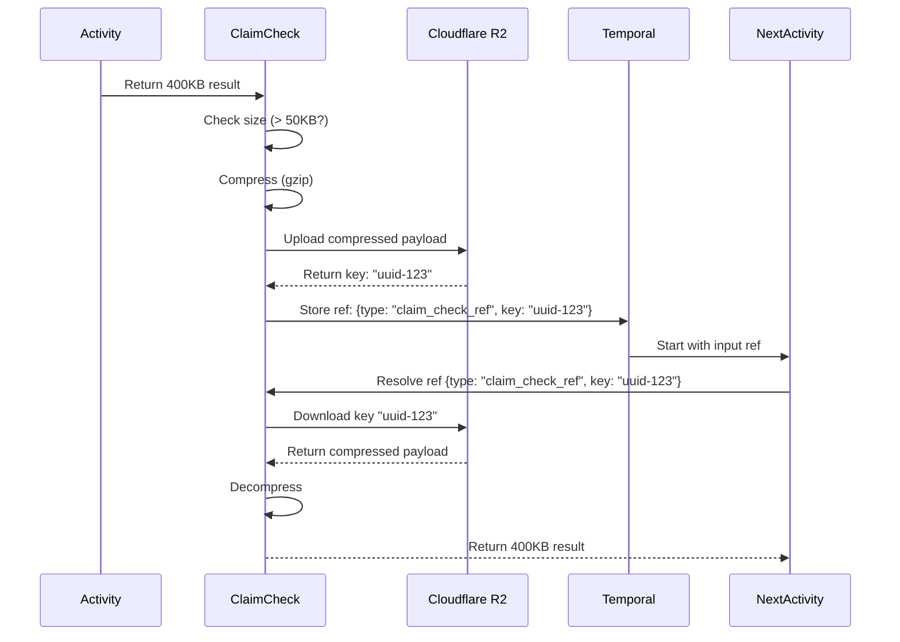

# Claim Check Architecture

## Overview

The Claim Check Pattern prevents Temporal payload overflow errors by storing large payloads externally and replacing them with lightweight references in workflow state.

## The Problem

AI workflows generate massive text payloads that exceed Temporal limits:

- **LLM Contexts**: 100K tokens = ~400KB of text
- **Temporal Limits**: 2MB per payload, 50MB workflow history total
- **Risk**: `BlobSizeExceeded` errors block AI workflows entirely

## The Solution

**Claim Check Pattern**: Store large data externally, pass around references



## Architecture

### Components

```
┌─────────────────────────────────────────────────────────────┐
│                    Zigflow Workflow                         │
│                                                             │
│  ┌──────────────┐      ┌──────────────┐      ┌──────────┐ │
│  │   Activity   │──────▶│  Activity   │──────▶│Activity  │ │
│  │      1       │      │      2       │      │    3     │ │
│  └──────┬───────┘      └──────▲───────┘      └──────────┘ │
│         │                     │                            │
│         │ Large Result        │ Retrieve                   │
│         ▼                     │                            │
│  ┌──────────────────────────────────────────────────────┐ │
│  │         ClaimCheckManager                            │ │
│  │  ┌─────────────┐  ┌─────────────┐  ┌─────────────┐  │ │
│  │  │  MaybeOffload│  │MaybeRetrieve│  │  Metrics    │  │ │
│  │  └─────────────┘  └─────────────┘  └─────────────┘  │ │
│  └──────────────────────────────────────────────────────┘ │
│         │                     ▲                            │
│         │ Put                 │ Get                        │
│         ▼                     │                            │
│  ┌──────────────────────────────────────────────────────┐ │
│  │         Compressor (gzip)                            │ │
│  └──────────────────────────────────────────────────────┘ │
│         │                     ▲                            │
│         ▼                     │                            │
│  ┌──────────────────────────────────────────────────────┐ │
│  │         R2Store (S3-compatible)                      │ │
│  └──────────────────────────────────────────────────────┘ │
│         │                     ▲                            │
└─────────┼─────────────────────┼────────────────────────────┘
          │                     │
          ▼                     │
┌─────────────────────────────────────────────────────────────┐
│             Cloudflare R2 (Object Storage)                  │
│                                                             │
│  ┌──────────────┐  ┌──────────────┐  ┌──────────────┐     │
│  │  uuid-123    │  │  uuid-456    │  │  uuid-789    │     │
│  │  [400KB]     │  │  [1MB]       │  │  [2MB]       │     │
│  └──────────────┘  └──────────────┘  └──────────────┘     │
└─────────────────────────────────────────────────────────────┘
```

### Data Flow

**1. Activity Execution (Offload)**

```
Activity completes → Returns 400KB result
                          ↓
ClaimCheckManager.MaybeOffload() checks size
                          ↓
                 Size > 50KB? ─No─→ Pass through unchanged
                          │
                         Yes
                          ↓
                  Compress with gzip
                          ↓
                  Upload to R2 storage
                          ↓
            Create ClaimCheckRef{key, size, compressed}
                          ↓
          Store ref in Temporal state (only ~200 bytes)
```

**2. Next Activity Execution (Retrieve)**

```
Next activity starts → Receives input from state
                          ↓
ClaimCheckManager.MaybeRetrieve() checks input
                          ↓
              Is ClaimCheckRef? ─No─→ Pass through unchanged
                          │
                         Yes
                          ↓
          Download payload from R2 using key
                          ↓
              Decompress if compressed
                          ↓
          Return 400KB payload to activity
```

## ClaimCheckRef Structure

References stored in Temporal state are JSON objects:

```json
{
  "_type": "claim_check_ref",
  "key": "uuid-123-456-789",
  "size_bytes": 400000,
  "compressed": true,
  "stored_at": "2026-01-08T10:00:00Z"
}
```

**Benefits**:
- **Small**: ~200 bytes vs 400KB original
- **Self-describing**: Contains metadata for retrieval
- **Debuggable**: Human-readable, easy to inspect

## Storage Backend: Cloudflare R2

**Why R2?**

- **Zero egress fees** (AWS S3 charges for downloads)
- **S3-compatible API** (use AWS SDK)
- **Globally distributed** (low latency worldwide)
- **Cost-effective** (cheaper than S3 for large-scale use)

**R2 Configuration**:

```go
R2Store{
    Bucket:   "stigmer-claimcheck",
    Endpoint: "https://abc123.r2.cloudflarestorage.com",
    Region:   "auto",  // R2 uses "auto" for region
}
```

**Object Key Format**: UUID v4 (`uuid.New().String()`)

**Example**: `3f4a5b6c-7d8e-9f0a-1b2c-3d4e5f6a7b8c`

## Compression

**Algorithm**: gzip (stdlib `compress/gzip`)

**Compression Level**: `gzip.DefaultCompression` (balanced speed/ratio)

**Performance**:
- **Text payloads**: 70%+ compression (400KB → ~120KB)
- **Binary payloads**: Skip compression (no benefit)
- **Latency**: <100ms for 1MB text

**Compression Decision**:

```go
if CompressionEnabled {
    compressed := gzip.Compress(payload)
    if len(compressed) < len(payload) {
        // Use compressed version
        return compressed, true
    }
}
// Use original
return payload, false
```

## Configuration

**Tunable Parameters**:

| Parameter | Default | Description |
|-----------|---------|-------------|
| `CLAIMCHECK_ENABLED` | `true` | Enable Claim Check |
| `CLAIMCHECK_THRESHOLD_BYTES` | `51200` | Offload if > 50KB |
| `CLAIMCHECK_TTL_DAYS` | `30` | Auto-delete after 30 days |
| `CLAIMCHECK_COMPRESSION_ENABLED` | `true` | Enable gzip compression |
| `R2_BUCKET` | (required) | R2 bucket name |
| `R2_ENDPOINT` | (required) | R2 endpoint URL |
| `R2_ACCESS_KEY_ID` | (required) | R2 access key |
| `R2_SECRET_ACCESS_KEY` | (required) | R2 secret key |
| `R2_REGION` | `auto` | R2 region (usually "auto") |

## Performance Characteristics

**Latency Budget**:

| Operation | Target | Typical |
|-----------|--------|---------|
| Upload 1MB | <500ms | ~300ms |
| Download 1MB | <200ms | ~150ms |
| Compress 1MB | <100ms | ~50ms |
| **Total Overhead** | **<1s** | **~500ms** |

**Acceptable Trade-off**: 500ms latency vs. workflow failures

## Integration Points

### 1. Workflow Executor Hook

```go
// After activity execution
result, err := workflow.ExecuteActivity(ctx, activity, input).Get(ctx, &rawResult)

// Claim Check offload hook
stored, err := claimCheckManager.MaybeOffload(ctx, rawResult)

// Store in workflow state
state["activity_output"] = stored
```

### 2. Activity Input Hook

```go
// Before next activity execution
rawInput := state["previous_activity_output"]

// Claim Check retrieval hook
payload, err := claimCheckManager.MaybeRetrieve(ctx, rawInput)

// Pass to activity
err = workflow.ExecuteActivity(ctx, nextActivity, payload)
```

## Error Handling

**Storage Unavailable**:
```
Error: r2 health check failed
Action: Worker fails fast, workflows retry
```

**Payload Corrupted**:
```
Error: gzip decompression failed
Action: Return error, workflow transitions to error state
```

**Missing Key**:
```
Error: r2 get failed: NoSuchKey
Action: Return error, workflow retries or fails
```

## Metrics

Tracked metrics:

```go
type MetricsSnapshot struct {
    OffloadCount         int64  // How many payloads offloaded
    RetrievalCount       int64  // How many payloads retrieved
    TotalBytesStored     int64  // Total storage used
    AvgUploadLatencyMS   int64  // Upload performance
    AvgDownloadLatencyMS int64  // Download performance
}
```

**Prometheus Metrics** (future):
```
claimcheck_offload_total
claimcheck_retrieval_total
claimcheck_upload_latency_seconds
claimcheck_download_latency_seconds
claimcheck_storage_bytes_total
claimcheck_errors_total
```

## Observability

**Log Events**:

```
INFO  Offloading large payload size_bytes=400000 threshold=51200
INFO  Retrieving payload from storage key=uuid-123 size_bytes=400000
```

**Health Check**:

```bash
# Check R2 connectivity
curl http://localhost:3000/health

# Response includes Claim Check status
{
  "status": "healthy",
  "claimcheck": {
    "enabled": true,
    "storage": "r2",
    "healthy": true
  }
}
```

## Security Considerations

**Data at Rest**:
- R2 encrypts data at rest by default
- No additional encryption needed

**Data in Transit**:
- All R2 connections use HTTPS (TLS 1.2+)
- AWS SDK handles certificate validation

**Access Control**:
- R2 credentials stored in Kubernetes secrets
- Not logged or exposed in metrics

**Data Retention**:
- TTL automatically deletes old payloads (30 days default)
- Prevents unbounded storage growth

## Limitations

**Maximum Payload Size**:
- R2 supports objects up to 5TB
- Practical limit: 10MB (workflow execution time)

**Latency**:
- Adds 500ms overhead per large payload
- Not suitable for ultra-low-latency workflows (<1s)

**Cost**:
- R2 storage: $0.015/GB/month
- Example: 1000 workflows/day × 1MB avg × 30 days = ~$0.45/month

## Future Enhancements (Phase 5)

**Caching Layer**:
```
Redis cache for frequently accessed payloads
Hit rate target: >80%
Cache TTL: 1 hour
```

**Pre-fetching**:
```
Predictable workflows can pre-fetch payloads
Eliminates retrieval latency
```

**Smart Compression**:
```
Detect binary vs text payloads
Skip compression for images, videos, etc.
```

**Multi-region Replication**:
```
Replicate to multiple R2 regions
Reduce latency for global workflows
```

## Related Documentation

- [Claim Check Testing](./CLAIMCHECK-TESTING.md)
- [Phase 2 Execution Plan](../../_projects/2026-01-08-workflow-orchestration-engine/phase-2-execution-plan.md)
- [Package README](../pkg/claimcheck/README.md)

## References

- [Enterprise Integration Patterns: Claim Check](https://www.enterpriseintegrationpatterns.com/patterns/messaging/StoreInLibrary.html)
- [Temporal Best Practices: Large Payloads](https://docs.temporal.io/dev-guide/best-practices#large-payloads)
- [Cloudflare R2 Documentation](https://developers.cloudflare.com/r2/)
- [AWS SDK for Go v2](https://aws.github.io/aws-sdk-go-v2/)
