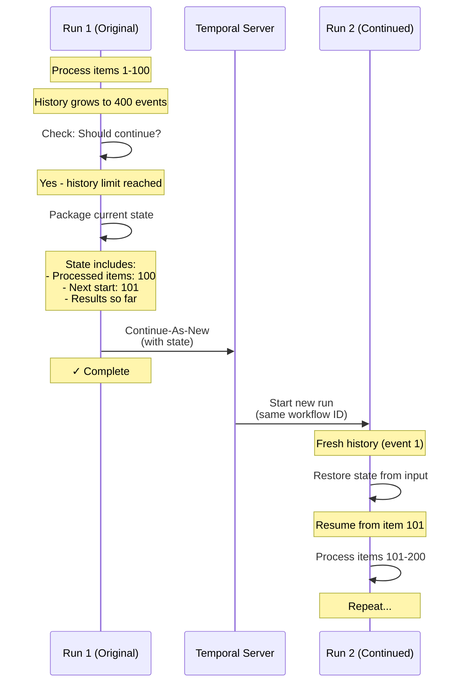
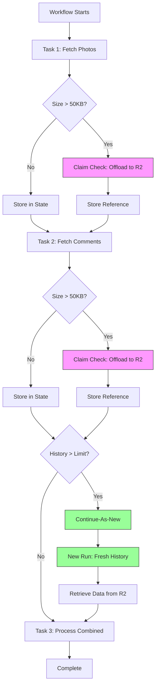

# Continue-As-New Pattern in Temporal Workflows

Temporal's continue-as-new pattern enables long-running workflows to complete without hitting history size limits.

## What is Continue-As-New?

**Continue-as-new is Temporal's solution for unbounded workflows.** It allows a workflow to complete and immediately start a new execution with fresh history, while preserving state and maintaining the same workflow ID.

Think of it like chapter breaks in a book:
- Each chapter (workflow run) tells part of the story
- You finish one chapter and immediately start the next
- The story continues seamlessly
- The book (workflow ID) stays the same
- But each chapter (run) has its own pages (history)

**Key characteristics:**
- Same workflow ID across all continuations
- New Run ID for each continuation
- Fresh event history (starts at event 1)
- State carried forward through input parameters
- No interruption from user's perspective

## Why Does Continue-As-New Start?

Temporal workflows accumulate **event history** as they execute. Every activity, timer, signal, and decision adds events to the history. This history is:
- Stored in the database
- Replayed to reconstruct workflow state
- Loaded into memory during execution

**Problems with unbounded history:**

1. **Memory limits** - Large histories consume worker memory during replay
2. **Database bloat** - Millions of events per workflow strain storage
3. **Performance degradation** - Replaying 10,000+ events takes seconds
4. **Query timeouts** - Workflow queries fail with large histories

**When Temporal triggers continue-as-new:**

Temporal provides a **suggestion** when history reaches ~10,000 events:

```go
info := workflow.GetInfo(ctx)
if info.GetContinueAsNewSuggested() {
    // Temporal is suggesting: "Your history is getting large"
    // Time to continue-as-new
}
```

**Our workflow-runner implementation:**

```go
func (t *DoTaskBuilder) shouldContinueAsNew(ctx workflow.Context) bool {
    info := workflow.GetInfo(ctx)
    currentHistoryLength := info.GetCurrentHistoryLength()
    isSuggested := info.GetContinueAsNewSuggested()
    
    // Temporal suggests continue-as-new (~10K events)
    if isSuggested {
        return true
    }
    
    // Override for testing (force continue-as-new at specific length)
    if t.opts.MaxHistoryLength > 0 && currentHistoryLength > t.opts.MaxHistoryLength {
        return true
    }
    
    return false
}
```

**In practice:**
- Our test workflows use `MaxHistoryLength: 50` to force continuation quickly
- Production workflows rely on Temporal's suggestion (~10,000 events)
- Each HTTP call adds ~4-6 events
- Each claim check offload adds ~2-4 events

## What Problem Does It Solve?

### The Unbounded Workflow Problem

Imagine a workflow that:
1. Fetches 5,000 records from an API (1 record per activity)
2. Processes each record with business logic
3. Stores results to a database

**Without continue-as-new:**
- 5,000 activities = 20,000+ events (start, schedule, complete, record result)
- Event history: 5+ MB
- Replay time: 10+ seconds
- Eventually: OutOfMemory errors, database timeouts, workflow stuck

**With continue-as-new:**
- Process 100 records per continuation (400 events)
- Continue-as-new after each batch
- 50 continuations total
- Each continuation: Small history, fast replay, bounded memory

### The State Preservation Challenge

**Critical requirement:** State must survive across continuations.

**How it works:**



## Continue-As-New + Claim Check: The Power Combination

**The synergy:** Continue-as-new solves **history size**, claim check solves **payload size**.

### The Combined Problem

A workflow that fetches large datasets faces **two limits**:

1. **History limit** - Too many events (continue-as-new)
2. **Payload limit** - Each event too large (claim check)

**Real example from our tests:**

```yaml
# Workflow: claimcheck-between-steps
tasks:
  - name: fetchPhotos
    call: http
    with:
      method: GET
      url: https://jsonplaceholder.typicode.com/photos
    # Returns 1.18 MB of data → claim check offloads to R2
    
  - name: fetchComments  
    call: http
    with:
      method: GET
      url: https://jsonplaceholder.typicode.com/comments
    # Returns 170 KB of data → claim check offloads to R2
    
  - name: processCombined
    # Needs both datasets → claim check retrieves from R2
```

**Without claim check:**
- Each activity result stored in workflow history
- 1.18 MB + 170 KB = 1.35 MB in history
- Exceeds Temporal's 2 MB history limit per workflow
- Workflow fails with "history too large"

**Without continue-as-new:**
- After processing 100 items: 10,000+ events
- After 1,000 items: 100,000+ events
- Replay takes minutes
- Worker runs out of memory

**With both patterns:**



### How They Work Together

**Phase 1: During workflow execution**

```go
// After each task, check payload size
func (t *DoTaskBuilder) maybeOffloadStateData(ctx, state) {
    for field, value := range state.Data {
        size := calculateSize(value)
        if size > 50KB {
            // Offload to R2, store reference
            ref := claimCheckManager.Offload(ctx, value)
            state.Data[field] = ref
        }
    }
}

// After offloading, check history size
func (t *DoTaskBuilder) iterateTasks(...) {
    for _, task := range tasks {
        executeTask(task)
        maybeOffloadStateData(state)
        
        // Check if we should continue-as-new
        if shouldContinueAsNew(ctx) {
            return continueAsNew(ctx, state)
        }
    }
}
```

**Phase 2: During continue-as-new**

```go
func continueAsNew(ctx, state) {
    // Store resume marker in state.Data
    state.Data["__continue_as_new_from__"] = currentTaskID
    
    // Create input for continued run
    // Includes claim check references AND resume marker
    continuedInput := &TemporalWorkflowInput{
        InitialData: state.Data  // Contains claim check refs
    }
    
    return workflow.NewContinueAsNewError(ctx, wfn, continuedInput)
}
```

**Phase 3: Continued run resumes**

```go
func workflowExecutor(ctx, input, state) {
    // Restore resume marker
    if canFrom := state.Data["__continue_as_new_from__"]; canFrom != nil {
        state.CANStartFrom = &canFrom
    }
    
    // Iterate tasks (will skip already-completed ones)
    for _, task := range tasks {
        if shouldSkip(task, state) {
            continue  // Skip completed tasks
        }
        
        // Before executing, retrieve claim check data if needed
        retrieveClaimCheckData(state)
        executeTask(task)
    }
}
```

### Benefits of the Combination

**Independently:**
- **Claim check alone** - Handles large payloads but history still grows unbounded
- **Continue-as-new alone** - Bounds history but fails on large payloads

**Together:**
- ✅ **Unbounded data** - Process gigabytes across thousands of tasks
- ✅ **Bounded history** - Each run stays under 10,000 events
- ✅ **Bounded payloads** - Each event stays under 2 MB
- ✅ **Fast replay** - Small history + references (not full data)
- ✅ **Low memory** - Large data in R2, not workflow memory
- ✅ **Resumable** - Can continue from any point without re-downloading

## Implementation Details

### Storing the Resume Marker

**Problem:** The `CANStartFrom` field in State struct is not part of `state.Data`, so it's lost during continue-as-new.

**Solution:** Store it as a special field in `state.Data`:

```go
func continueAsNew(ctx, workflowType, taskID, input, state) {
    // Set both State field and Data field
    state.CANStartFrom = &taskID
    state.Data["__continue_as_new_from__"] = taskID  // Survives continuation
    
    continuedInput := &TemporalWorkflowInput{
        InitialData: state.Data  // Includes the marker
    }
    
    return workflow.NewContinueAsNewError(ctx, workflowType, continuedInput)
}
```

### Restoring State After Continuation

```go
func workflowExecutor(ctx, input, state) {
    if state == nil {
        state = NewState()
        state.Input = input
    }
    
    // Restore the resume marker from data
    if canFrom, ok := state.Data["__continue_as_new_from__"].(string); ok {
        state.CANStartFrom = &canFrom
        delete(state.Data, "__continue_as_new_from__")  // Clean up marker
    }
    
    // Now iterate tasks - shouldSkip() will work correctly
    for _, task := range tasks {
        if shouldSkip(task.ID, state) {
            continue  // Skip already-completed tasks
        }
        executeTask(task)
    }
}
```

### Task Skipping Logic

```go
func shouldSkip(taskID string, state *State) bool {
    if state.CANStartFrom == nil {
        return false  // First run, skip nothing
    }
    
    // Skip until we reach the task we stopped on
    shouldSkip := *state.CANStartFrom != taskID
    
    if !shouldSkip {
        // Found the resume point - stop skipping
        state.CANStartFrom = nil
    }
    
    return shouldSkip
}
```

**Example flow:**

```
Original run:
  ✅ Task 1: fetchPhotos (completed)
  ✅ Task 2: fetchComments (completed)
  ⏸️  Continue-as-new (marker: "processCombined-2")

Continued run:
  ⏭️  Task 1: fetchPhotos (skip - already done)
  ⏭️  Task 2: fetchComments (skip - already done)
  ▶️  Task 3: processCombined (resume here)
  ▶️  Task 4: verifyDataAccess (continue normally)
```

## Testing Continue-As-New

### Forcing Early Continuation

Production workflows naturally trigger continue-as-new at ~10,000 events. For testing, we force it earlier:

```go
taskBuilder, _ := tasks.NewDoTaskBuilder(
    worker,
    doTask,
    workflowName,
    workflowDef,
    tasks.DoTaskOpts{
        MaxHistoryLength: 50,  // Force continue-as-new at 50 events
    },
)
```

### Test Workflow

```yaml
# File: test/golden/12-claimcheck-between-steps.yaml
name: claimcheck-between-steps-test
version: 1.0.0
do:
  # Task 1: Fetch large dataset
  - name: fetchPhotos
    call: http
    with:
      method: GET
      url: https://jsonplaceholder.typicode.com/photos
    # Result: 1.18 MB → offloaded to R2
    
  # Task 2: Fetch another dataset  
  - name: fetchComments
    call: http
    with:
      method: GET
      url: https://jsonplaceholder.typicode.com/comments
    # Result: 170 KB → offloaded to R2
    # Total events: ~44 → triggers continue-as-new (limit: 50)
    
  # Task 3: Process combined data
  - name: processCombined
    # Resumed after continue-as-new
    # Data retrieved from R2 automatically
    
  # Task 4: Verify data access
  - name: verifyDataAccess
    # Continues normally
```

### Expected Behavior

**Temporal UI shows:**
- **Workflow ID**: `claimcheck-between-steps-1234567890` (stays same)
- **Run 1**: Status "Continued as New" (events 1-47)
- **Run 2**: Status "Completed" (events 1-15)

**Logs show:**

```
Run 1:
  ✅ Task: fetchPhotos → Offloaded 1.18 MB to R2
  ✅ Task: fetchComments → Offloaded 170 KB to R2
  📊 History length: 44 events → Continue-as-new triggered
  🔄 Continuing as new from taskId: processCombined-2

Run 2:  
  ⏭️  Skipping: fetchPhotos (already complete)
  ⏭️  Skipping: fetchComments (already complete)
  ✅ Task: processCombined → Retrieved data from R2
  ✅ Task: verifyDataAccess → Success
  🎉 Workflow completed
```

## Common Pitfalls and Solutions

### Pitfall 1: Infinite Loop

**Problem:** Continued workflow reruns everything, triggers continue-as-new again → infinite loop.

**Cause:** Resume marker (`CANStartFrom`) lost during continuation.

**Solution:** Store marker in `state.Data` so it survives:

```go
// ❌ Wrong: Field not preserved
state.CANStartFrom = &taskID
continueAsNew(input: map[string]any{"data": state.Data})

// ✅ Right: Store in Data
state.Data["__continue_as_new_from__"] = taskID
continueAsNew(input: TemporalWorkflowInput{InitialData: state.Data})
```

### Pitfall 2: Lost Claim Check References

**Problem:** Continued workflow can't find data that was offloaded in previous run.

**Cause:** Claim check references not included in `InitialData`.

**Solution:** Claim check stores references in `state.Data` automatically:

```go
// Claim check manager replaces large data with references
state.Data["photos"] = ClaimCheckRef{
    Key: "uuid-1234",
    SizeBytes: 1186475,
}

// References preserved across continue-as-new
continuedInput.InitialData = state.Data  // Includes references
```

### Pitfall 3: Nil Pointer on Metadata

**Problem:** Crash accessing `input.Metadata.Name` when metadata is nil.

**Cause:** Metadata is optional but code assumed it exists.

**Solution:** Safe access with nil check:

```go
// ❌ Wrong: Assumes Metadata exists
logger.Info("Workflow", "name", input.Metadata.Name)

// ✅ Right: Check for nil
workflowName := ""
if input.Metadata != nil {
    workflowName = input.Metadata.Name
}
logger.Info("Workflow", "name", workflowName)
```

### Pitfall 4: Wrong Parameter Type

**Problem:** Continue-as-new crashes with "invalid memory address" error.

**Cause:** Passing wrong type to `NewContinueAsNewError`.

**Solution:** Match outer workflow signature exactly:

```go
// Outer workflow expects:
func ExecuteServerlessWorkflow(ctx, input *types.TemporalWorkflowInput) (...)

// ❌ Wrong: Two separate parameters
workflow.NewContinueAsNewError(ctx, wfn, inputMap, stateObj)

// ✅ Right: Single TemporalWorkflowInput
continuedInput := &types.TemporalWorkflowInput{
    InitialData: state.Data,
    // ... other fields
}
workflow.NewContinueAsNewError(ctx, wfn, continuedInput)
```

## Design Decisions

### Why Store Marker in state.Data?

**Alternative considered:** Use dedicated field in `TemporalWorkflowInput`:

```go
type TemporalWorkflowInput struct {
    InitialData  map[string]any
    CANStartFrom *string  // Dedicated field
}
```

**Why we chose state.Data:**
- ✅ **Simpler** - No new field in TemporalWorkflowInput
- ✅ **Flexible** - Can store additional metadata if needed
- ✅ **Transparent** - Works with existing data flow
- ✅ **Testable** - Easy to verify marker presence

**Trade-off:** Special field name `__continue_as_new_from__` (double underscore indicates internal use).

### Why Delete Marker After Restoration?

```go
if canFrom, ok := state.Data["__continue_as_new_from__"].(string); ok {
    state.CANStartFrom = &canFrom
    delete(state.Data, "__continue_as_new_from__")  // Why delete?
}
```

**Reasons:**
1. **Clean state** - Marker only needed once (at continuation start)
2. **Avoid confusion** - Prevents thinking it affects later logic
3. **Debug clarity** - If seen later, indicates a bug
4. **Idempotency** - Multiple restorations won't corrupt state

### Why Not Store Full State Object?

**Alternative:** Serialize entire State object:

```go
stateBytes := serializeState(state)
continuedInput.StateSnapshot = stateBytes
```

**Why we chose partial state:**
- ✅ **Smaller payloads** - Only Data field needed
- ✅ **Clearer semantics** - Explicit about what carries over
- ✅ **Less coupling** - State struct can change without breaking continuations
- ✅ **Better debugging** - Can inspect Data as JSON easily

## Metrics and Observability

### Key Metrics to Track

```go
// Continue-as-new frequency
temporal.counter("workflow.continue_as_new.triggered").Inc()

// History length at continuation
temporal.histogram("workflow.history_length.at_continue").Observe(historyLength)

// Continuation depth (how many times continued)
temporal.gauge("workflow.continuation_depth").Set(depth)

// Time spent in continued runs
temporal.histogram("workflow.continued_run.duration").Observe(duration)
```

### Logging Best Practices

```go
// Before continue-as-new
logger.Info("Continuing as new",
    "taskId", taskID,
    "execution_id", executionID,
    "workflow_name", workflowName,
    "history_length", historyLength,
    "state_size_bytes", stateSize)

// After resumption
logger.Info("Resuming from continue-as-new",
    "taskId", restoredTaskID,
    "execution_id", executionID,
    "previous_run_id", previousRunID,
    "continuation_depth", depth)
```

### Temporal UI Indicators

**What to look for:**
- **Status "Continued as New"** - Expected for long workflows
- **Multiple runs, same workflow ID** - Normal with continue-as-new
- **Increasing run numbers** - Shows progression
- **Final run "Completed"** - Workflow finished successfully

**Red flags:**
- **20+ continuations** - Possible infinite loop
- **Same task over and over** - Resume marker not working
- **Growing history in each run** - Not skipping tasks properly

## Further Reading

**Related Patterns:**
- [Claim Check Pattern](./claim-check-pattern.md) - Handling large payloads
- [Workflow Execution Architecture](./workflow-execution-architecture.md) - Overall flow

**Temporal Documentation:**
- [Continue-As-New Official Docs](https://docs.temporal.io/workflows#continue-as-new)
- [Event History Best Practices](https://docs.temporal.io/kb/event-history-size)

**Implementation:**
- [`task_builder_do.go`](../../pkg/zigflow/tasks/task_builder_do.go) - Continue-as-new logic
- [`temporal_workflow.go`](../../pkg/executor/temporal_workflow.go) - Workflow entry point

---

**Summary:** Continue-as-new enables unbounded workflows by periodically starting fresh runs with carried-over state. Combined with claim check for large payloads, it enables workflows to process unlimited data without hitting Temporal's limits. The key challenge is preserving progress markers across continuations to avoid infinite loops.
