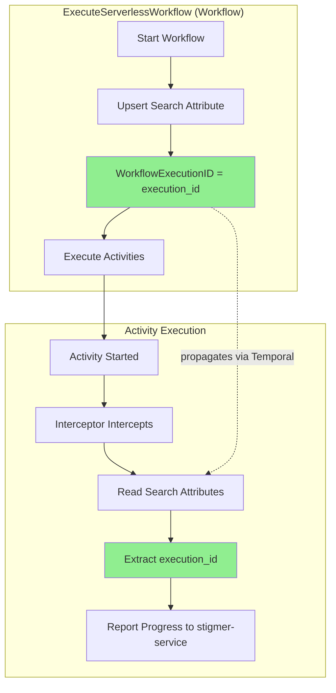

# Temporal Search Attributes Setup

**Time:** 1-2 minutes  
**When:** After Temporal server is deployed and namespace is created  
**Why:** Search attributes enable workflow features like execution ID propagation for progress reporting

## What This Does

Sets up custom search attributes in Temporal that are required by workflow-runner:

- **WorkflowExecutionID**: Stores WorkflowExecutionID for progress reporting
  - Used by ExecuteServerlessWorkflow to propagate execution ID to activities
  - Enables activity interceptor to report progress back to stigmer-service
  - Without this, progress reporting will fail silently

**Think of it like**: Database schema migrations - you need the right columns before inserting data.

## Prerequisites

- [ ] Temporal server deployed and running
- [ ] Temporal namespace created (see [`../planton/infra-hub/temporal-namespace-setup.md`](../planton/infra-hub/temporal-namespace-setup.md))
- [ ] Temporal CLI installed (`brew install temporal` on macOS)
- [ ] Network access to Temporal frontend service

## Automatic Setup (Recommended)

### Option 1: On Worker Startup (Like DB Migrations)

The workflow-runner **automatically** checks and creates missing search attributes on startup.

**How it works:**
1. Worker starts up
2. Connects to Temporal
3. Checks if required search attributes exist
4. Creates any missing attributes
5. Proceeds with normal operation

**Configuration:**
```bash
# Set in .env_export or environment
export TEMPORAL_NAMESPACE=default
export TEMPORAL_SERVICE_ADDRESS=localhost:7233

# Start worker - attributes created automatically
bazel run //backend/services/workflow-runner:workflow_runner
```

**Logs to watch for:**
```
INFO  Checking Temporal search attributes namespace=default required_attributes=1
INFO  Search attribute missing - will create attribute=WorkflowExecutionID type=Text
INFO  Creating search attribute attribute=WorkflowExecutionID
INFO  Successfully created search attribute attribute=WorkflowExecutionID
INFO  All required search attributes are now available
```

**When to use:** 
- ✅ Development environments (local, dev)
- ✅ Staging environments
- ✅ Production (first deployment)

**Idempotent:** Safe to run multiple times - won't recreate existing attributes.

### Option 2: Standalone Script

Run the setup script independently before starting the worker:

```bash
cd backend/services/workflow-runner

# Local development
./scripts/setup-temporal-search-attributes.sh default localhost:7233

# Production
./scripts/setup-temporal-search-attributes.sh \
  stigmer \
  stigmer-prod-temporal-frontend.planton.live:7233
```

**When to use:**
- ✅ Pre-deployment setup
- ✅ CI/CD pipelines
- ✅ Manual verification after Temporal upgrade

**Output:**
```
========================================
Temporal Search Attributes Setup
========================================

Namespace: default
Address:   localhost:7233

Checking existing search attributes...
  ! WorkflowExecutionID (Text) - missing

Creating missing search attributes...
Creating: WorkflowExecutionID (Text)
  Purpose: Stores WorkflowExecutionID for progress reporting
  ✓ Created successfully

========================================
✓ Setup Complete
========================================

Summary:
  Existing:  0
  Created:   1
  Total:     1

All required search attributes are now available!
```

## Manual Setup (If Automatic Fails)

If automatic setup doesn't work (restricted permissions, air-gapped environment), create manually:

### Step 1: Verify Temporal Connection

```bash
temporal operator search-attribute list \
  --namespace default \
  --address localhost:7233
```

**Expected:** List of existing search attributes displays.

**If fails:**
- Check Temporal server is running
- Verify namespace exists
- Check network connectivity

### Step 2: Create Search Attribute

```bash
temporal operator search-attribute create \
  --namespace default \
  --address localhost:7233 \
  --name WorkflowExecutionID \
  --type Text
```

**Expected output:**
```
Search attribute WorkflowExecutionID created.
```

### Step 3: Verify Creation

```bash
temporal operator search-attribute list \
  --namespace default \
  --address localhost:7233 | grep WorkflowExecutionID
```

**Expected:**
```
  WorkflowExecutionID    Text
```

## Environment-Specific Setup

### Local Development

```bash
# Using automatic setup
export TEMPORAL_NAMESPACE=default
export TEMPORAL_SERVICE_ADDRESS=localhost:7233
bazel run //backend/services/workflow-runner:workflow_runner

# Or using script
./scripts/setup-temporal-search-attributes.sh
```

**Note:** Local Temporal (v1.20+) automatically includes WorkflowExecutionID - setup should succeed immediately.

### Production (Planton Live)

```bash
# Using script (recommended for first-time setup)
./scripts/setup-temporal-search-attributes.sh \
  stigmer \
  stigmer-prod-temporal-frontend.planton.live:7233

# Or let worker do it automatically on first startup
kubectl rollout restart deployment/workflow-runner -n stigmer-prod
kubectl logs -f deployment/workflow-runner -n stigmer-prod | grep "search attribute"
```

**Important:** Production Temporal may require admin permissions to create search attributes. Verify access before deploying.

## Verification

### Verify Attributes Exist

```bash
# List all search attributes
temporal operator search-attribute list \
  --namespace default \
  --address localhost:7233

# Check for our specific attribute
temporal operator search-attribute list \
  --namespace default \
  --address localhost:7233 | grep WorkflowExecutionID
```

### Test in Workflow

After setup, test that workflows can use the attribute:

```bash
# Start a test workflow
bazel run //backend/services/workflow-runner:workflow_runner -- \
  --file test/golden/01-operation-basic.yaml

# Check workflow details
temporal workflow describe \
  --workflow-id <workflow-id> \
  --namespace default \
  --address localhost:7233
```

**Look for:** Search attributes section showing `WorkflowExecutionID: <execution-id>`

### Check Worker Logs

Worker startup logs should show:

```
INFO  Checking Temporal search attributes namespace=default required_attributes=1
INFO  Search attribute exists attribute=WorkflowExecutionID type=Text
INFO  All required search attributes exist
```

## Troubleshooting

### "Failed to list search attributes"

**Cause:** Can't connect to Temporal or namespace doesn't exist

**Solutions:**
1. Check Temporal server is running:
   ```bash
   nc -zv localhost 7233
   ```

2. Verify namespace exists:
   ```bash
   temporal operator namespace list --address localhost:7233
   ```

3. Create namespace if missing:
   ```bash
   temporal operator namespace create default --address localhost:7233
   ```

### "Permission denied" when creating attribute

**Cause:** Temporal may require admin/operator permissions for search attribute creation

**Solutions:**

1. **For local dev:** No authentication typically required

2. **For production:** Use operator credentials:
   ```bash
   # With mTLS
   temporal operator search-attribute create \
     --namespace stigmer \
     --address stigmer-prod-temporal-frontend.planton.live:7233 \
     --tls-cert-path /path/to/cert.pem \
     --tls-key-path /path/to/key.key \
     --name WorkflowExecutionID \
     --type Text
   ```

3. **Alternative:** Have Temporal admin create attributes, then use worker validation mode only

### "Attribute already exists" error

**Cause:** Attribute was created by another process or previous run

**Solution:** This is normal! The error is expected and ignored by the setup code. Verify it exists:
```bash
temporal operator search-attribute list \
  --namespace default \
  --address localhost:7233 | grep WorkflowExecutionID
```

If it's there, you're all set.

### Worker starts but progress reporting doesn't work

**Symptoms:**
- Workflows execute successfully
- No progress updates appear in stigmer-service
- No search attribute errors in logs

**Debug:**
1. Check if attribute exists:
   ```bash
   temporal operator search-attribute list \
     --namespace default \
     --address localhost:7233 | grep WorkflowExecutionID
   ```

2. Check workflow actually sets the attribute:
   ```bash
   temporal workflow describe --workflow-id <id> | grep WorkflowExecutionID
   ```

3. Check interceptor logs:
   ```bash
   kubectl logs deployment/workflow-runner | grep "progress report"
   ```

### Type mismatch error

**Cause:** Attribute exists but with wrong type (e.g., Keyword instead of Text)

**Solution:** Delete and recreate (requires admin access):
```bash
# ⚠️ WARNING: This will affect existing workflows using the attribute
temporal operator search-attribute remove \
  --namespace default \
  --address localhost:7233 \
  --name WorkflowExecutionID

# Recreate with correct type
temporal operator search-attribute create \
  --namespace default \
  --address localhost:7233 \
  --name WorkflowExecutionID \
  --type Text
```

**Better alternative:** Use a different attribute name if you can't modify existing one.

## Architecture: How Search Attributes Enable Progress Reporting



**Flow:**
1. Workflow sets search attribute: `WorkflowExecutionID = workflow_execution_id`
2. Temporal stores this in workflow metadata
3. Activity interceptor reads from activity's workflow metadata
4. Interceptor extracts execution ID
5. Progress reports include execution ID for backend correlation

**Why search attributes?**
- ✅ No activity signature changes needed
- ✅ Available to all activities automatically
- ✅ Survives workflow restarts and continues-as-new
- ✅ Queryable for debugging

## Integration with CI/CD

### Kubernetes Deployment

Add as init container or pre-deployment hook:

```yaml
apiVersion: batch/v1
kind: Job
metadata:
  name: temporal-search-attr-setup
  namespace: stigmer-prod
spec:
  template:
    spec:
      containers:
      - name: setup
        image: workflow-runner:latest
        command:
          - /app/scripts/setup-temporal-search-attributes.sh
          - stigmer
          - stigmer-prod-temporal-frontend.planton.live:7233
        env:
          - name: TEMPORAL_NAMESPACE
            value: "stigmer"
          - name: TEMPORAL_SERVICE_ADDRESS
            value: "stigmer-prod-temporal-frontend.planton.live:7233"
      restartPolicy: OnFailure
```

### Terraform/IaC

Include in Temporal setup automation:

```hcl
resource "null_resource" "temporal_search_attributes" {
  depends_on = [
    temporal_namespace.stigmer
  ]

  provisioner "local-exec" {
    command = <<-EOT
      ${path.module}/../../backend/services/workflow-runner/scripts/setup-temporal-search-attributes.sh \
        ${var.temporal_namespace} \
        ${var.temporal_frontend_address}
    EOT
  }
}
```

## Related Resources

- **Temporal Namespace Setup:** [`../planton/infra-hub/temporal-namespace-setup.md`](../planton/infra-hub/temporal-namespace-setup.md)
- **Worker Configuration:** `backend/services/workflow-runner/worker/config/config.go`
- **Progress Interceptor:** `backend/services/workflow-runner/pkg/interceptors/progress_interceptor.go`
- **Workflow Implementation:** `backend/services/workflow-runner/pkg/executor/temporal_workflow.go`
- **Implementation Status:** `backend/services/workflow-runner/IMPLEMENTATION_STATUS.md`

## Reference: Required Search Attributes

| Name | Type | Purpose | Used By |
|------|------|---------|---------|
| WorkflowExecutionID | Text | Stores WorkflowExecutionID for execution ID propagation | ExecuteServerlessWorkflow → ProgressReportingInterceptor |

**Future additions:** As more features are added, additional search attributes may be required. This document will be updated accordingly.

## Quick Reference

**Local setup (automatic):**
```bash
bazel run //backend/services/workflow-runner:workflow_runner
```

**Local setup (script):**
```bash
./scripts/setup-temporal-search-attributes.sh
```

**Production setup (script):**
```bash
./scripts/setup-temporal-search-attributes.sh \
  stigmer \
  stigmer-prod-temporal-frontend.planton.live:7233
```

**Verify:**
```bash
temporal operator search-attribute list \
  --namespace default \
  --address localhost:7233 | grep WorkflowExecutionID
```

---

**Questions?** This is a one-time setup per Temporal namespace. Once created, search attributes persist and don't need recreation.
