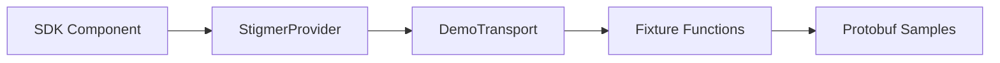
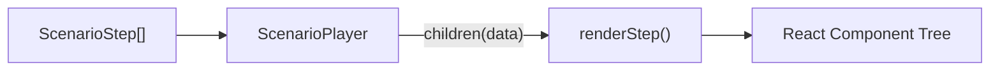
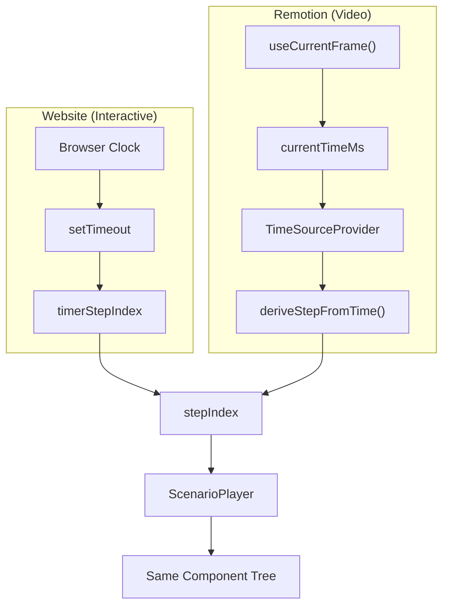
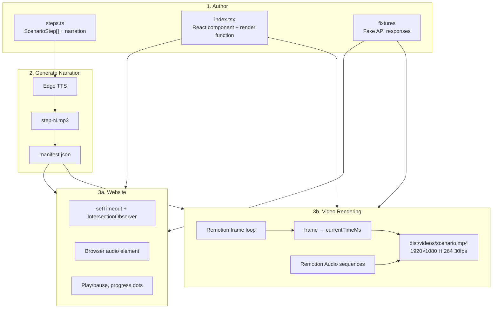

Our documentation site has a rule: if you're describing something the user can see in the web console, show a live demo built from the real React components. No screenshots. No mockups. No separate recording pipeline.

We also need polished MP4 videos — for the landing page, for social media, for onboarding flows. That creates an obvious problem: maintaining interactive demos _and_ a separate video export system means every UI change needs to be updated in two places.

We solved this by building a pipeline where the same React component tree renders in three contexts — as an interactive demo on the website, with optional audio narration, and as a pixel-perfect rendered video — differentiated only by **who controls time**.

This post explains the four layers of that system and the single abstraction that holds it all together.

## Layer 1: Real components, fake data

Every demo on our site renders the exact same React components that the production web console uses. Session composers, message threads, agent detail views, resource lists — they all come from `@stigmer/react`, our SDK's React package.

The trick: the SDK ships a `demo` subpath with a fake API transport.

```tsx
import { StigmerProvider } from "@stigmer/react";
import { createDemoClient, buildScenario, fixtures } from "@stigmer/react/demo";

const client = createDemoClient(
  buildScenario(
    fixtures.session.get,
    fixtures.agent.list,
    fixtures.agentExecution.getArtifactContent(/* ... */),
  ),
);

// Any component wrapped in this provider works —
// it doesn't know the data is fake.
<StigmerProvider client={client}>
  <SessionComposer />
</StigmerProvider>
```

`DemoTransport` intercepts every RPC call and routes it to a matching fixture function instead of making a network request. The components render realistic content with zero backend.



This gives us two properties we care about:

1. **Demos never go stale.** If we change a component in the SDK, the demo automatically reflects it.
2. **Demos look real.** The components are rendering actual protobuf data structures, not simplified mock-ups.

## Layer 2: The step engine

A demo is a timed sequence of UI states. We model this as an array of generic steps:

```typescript
interface ScenarioStep<T> {
  delayMs: number;
  data: T;
  narration?: string;
}
```

`T` is whatever data shape the scenario needs. For an agent creation tour, it's a union type like `{ view: "agents-list" } | { view: "conversation"; execution: AgentExecution } | { view: "artifact-preview"; ... }`. For a tool-calls playback, it's a different shape entirely.

`ScenarioPlayer` manages timing and calls a render function with the current step's data:

```tsx
<ScenarioPlayer steps={agentCreationTourSteps}>
  {(step) => renderStep(step)}
</ScenarioPlayer>
```

The engine knows nothing about what's being displayed. It handles:

- **Timing** — `setTimeout`-based step progression
- **Auto-play** — `IntersectionObserver` starts playback when the demo scrolls into view
- **Controls** — play/pause, prev/next, clickable progress dots
- **Accessibility** — skips to the final step when `prefers-reduced-motion` is set

Each scenario provides its own `renderStep` function — typically a switch statement mapping the step's `data.view` field to the right combination of shell, content, and sidebar components.



This separation means adding a new demo scenario requires zero changes to the engine. You write a `steps.ts` (the timeline) and an `index.tsx` (the visual mapping), and the engine handles the rest.

## Layer 3: Audio narration

Each step has an optional `narration` field — a spoken script. A build-time process converts these to audio:

```bash
make generate-narration
```

This runs a TypeScript script that:

1. Scans every scenario folder for `steps.ts`
2. Extracts the `narration` text from each step
3. Calls Microsoft Edge TTS to generate an MP3 per step
4. Writes a `manifest.json` with file paths and durations
5. Skips steps where the narration text hasn't changed (hash-based caching)

The manifest looks like this:

```json
{
  "steps": [
    { "src": "/demos/agent-creation-tour/step-0.mp3", "durationMs": 4200 },
    null,
    { "src": "/demos/agent-creation-tour/step-2.mp3", "durationMs": 3800 }
  ]
}
```

Steps with no narration get `null`. Not every step needs audio — navigation clicks and cursor animations benefit from silence.

When narration is playing, `ScenarioPlayer` waits for `max(delayMs, narrationDuration)` before advancing. This way the narration always finishes before the next step appears, but the demo never feels slower than the authored timing.

## The key insight: who controls time?

Everything described so far works in a browser. `setTimeout` drives step progression, the browser clock is the source of truth, and `<audio>` elements play narration clips.

Now we need to render these exact same demos as 1920×1080 H.264 video files.

The problem: Remotion (our video renderer) renders one frame at a time. It opens a headless browser, screenshots frame 1, advances to frame 2, screenshots again, and so on. `setTimeout` never fires. The browser clock is frozen at "the current frame." If our ScenarioPlayer is waiting on `setTimeout` to advance to the next step, nothing ever happens.

The solution is a 55-line file called `TimeSource.tsx`:

```tsx
interface TimeSourceValue {
  currentTimeMs: number;
  stepStartTimesMs: readonly number[];
}

const TimeSourceContext = createContext<TimeSourceValue | null>(null);

export function TimeSourceProvider({
  currentTimeMs,
  stepStartTimesMs,
  children,
}: TimeSourceProviderProps) {
  return (
    <TimeSourceContext.Provider value={{ currentTimeMs, stepStartTimesMs }}>
      {children}
    </TimeSourceContext.Provider>
  );
}

export function useTimeSource(): TimeSourceValue | null {
  return useContext(TimeSourceContext);
}
```

The context provides two things: the current time in milliseconds, and a pre-computed array of when each step starts. `ScenarioPlayer` checks for this context with a single branch:

```typescript
const timeSource = useTimeSource();

const stepIndex = timeSource
  ? deriveStepFromTime(timeSource.currentTimeMs, timeSource.stepStartTimesMs, lastIndex)
  : timerStepIndex;
```

That's it. Three lines. If `TimeSourceProvider` is present, the step index is derived from the provided time. If not, the timer-based index is used. The rest of the component — the render prop, the content — is identical in both paths.



This is the architectural pivot of the entire system. Every other decision follows from it. The same component tree renders in both contexts because the only thing that changes is **who provides the current time**.

## Layer 4: Remotion video rendering

With `TimeSource` in place, the Remotion layer is straightforward. A `DemoVideo` composition wraps each scenario component in two providers:

```tsx
export const DemoVideo: React.FC<DemoVideoProps> = ({ scenarioId, timeline }) => {
  const frame = useCurrentFrame();
  const { fps, width, height } = useVideoConfig();
  const currentTimeMs = (frame / fps) * 1000;
  const zoom = Math.min(width / VIRTUAL_WIDTH, height / VIRTUAL_HEIGHT);

  const Component = SCENARIO_REGISTRY[scenarioId];

  return (
    <AbsoluteFill className="dark bg-neutral-950">
      <div style={{ width: 960, height: 540, zoom }}>
        <TimeSourceProvider
          currentTimeMs={currentTimeMs}
          stepStartTimesMs={timeline.stepStartTimesMs}
        >
          <VideoExportProvider>
            <Component />
          </VideoExportProvider>
        </TimeSourceProvider>
      </div>

      {timeline.audioClips.map((clip) => (
        <Sequence key={clip.stepIndex} from={clip.startFrame} durationInFrames={clip.durationFrames}>
          <Audio src={staticFile(clip.src)} />
        </Sequence>
      ))}
    </AbsoluteFill>
  );
};
```

A few details worth calling out:

**Virtual viewport.** Demo components are designed for ~960×540. CSS `zoom: 2x` scales them to fill the 1920×1080 composition. This gives pixel-perfect output without redesigning any components for video.

**Timeline computation.** Before rendering, `computeTimeline(steps, manifest, fps)` pre-computes when each step starts (in ms and frames) and where each audio clip goes. The timing rule matches the interactive player: `max(delayMs, narrationDuration)` between steps, plus a 3-second dwell on the final step.

```typescript
for (let i = 1; i < steps.length; i++) {
  const prevStart = stepStartTimesMs[i - 1];
  const baseDelay = steps[i].delayMs;
  const narrationMs = manifest?.steps[i - 1]?.durationMs ?? 0;
  stepStartTimesMs.push(prevStart + Math.max(baseDelay, narrationMs));
}
```

**Audio.** Narration is rendered through Remotion's `<Audio>` component at exact frame offsets — not through the browser's `<audio>` element. `ScenarioPlayer` skips its narration hook entirely when a `TimeSource` is present.

**Composition discovery.** `Root.tsx` imports all scenario step arrays and narration manifests, computes timelines, and registers a Remotion `Composition` per scenario. The render script discovers compositions from the bundle — no hardcoded list to maintain.

## What we tried first

The first version of the video pipeline used Playwright to screen-record the demos and FFmpeg to composite the audio. It worked end-to-end, but Playwright's `recordVideo` uses the VP8 codec internally, which visibly degraded text quality. For product demos where readability is everything, the artifacts were unacceptable.

Remotion solved this by rendering each frame as a lossless screenshot and encoding them to H.264. The output is pixel-perfect — every character is crisp, every border is clean.

The migration took a few sessions, but it was straightforward because the component layer didn't change at all. We replaced the recording backend, not the rendering frontend.

## The full picture



## By the numbers

| | |
|---|---|
| Scenarios | 10 |
| ScenarioPlayer | ~250 lines |
| TimeSource | 55 lines |
| Timeline computation | ~90 lines |
| Full render (all 10 videos) | ~2 minutes |
| Output | 1920×1080 H.264, 30fps |

The point isn't that any individual piece is clever. `TimeSource` is a React context with two fields. `ScenarioPlayer` is a generic step engine with a render prop. `computeTimeline` is a loop with a `Math.max` call.

The point is that these small, focused abstractions compose into a system where you write a scenario once — define the steps, write the narration, build the render function — and get an interactive website demo, an audio-narrated walkthrough, and a production-quality video, all from the same source code, all staying in sync automatically.
