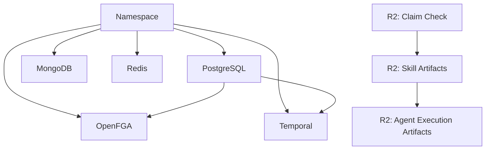

Stigmer's production infrastructure runs nine components across two cloud providers. There is a PostgreSQL cluster hosting three databases, a MongoDB replica set, a Redis instance, a Temporal server for durable workflow execution, an OpenFGA deployment for fine-grained authorization, and three Cloudflare R2 object storage buckets. All of it runs on a GKE cluster in Mumbai, except the R2 buckets, which provision directly through Cloudflare's API.

The entire definition — every component, every dependency, every resource limit — lives in a single directory. Each component is a YAML file between 10 and 45 lines long. Environment-specific configuration is a separate file of parameter overrides. Deploying the full stack is two commands.

This post walks through how we structured that directory, what the templates look like, how deployment ordering works, and what it means in practice to manage production infrastructure from files this short.

## What we run

Before looking at YAML, here is what the stack contains and why each piece exists:

- **Kubernetes namespace** — isolation boundary for all cluster resources
- **PostgreSQL** — relational database hosting three schemas: one for OpenFGA's authorization data, one for Temporal's workflow state, and one for Temporal's visibility queries
- **MongoDB** — document store for Stigmer's application data (agents, sessions, skills, executions)
- **Redis** — caching layer and pub/sub backbone
- **Temporal** — durable execution engine that runs Agent and Workflow tasks reliably, surviving crashes and restarts
- **OpenFGA** — fine-grained authorization service that evaluates access policies for every API call
- **Cloudflare R2 bucket (Claim Check)** — stores large workflow payloads that would otherwise exceed Temporal's event history size limit
- **Cloudflare R2 bucket (Skill Artifacts)** — stores skill packages uploaded via `stigmer push`
- **Cloudflare R2 bucket (Agent Execution Artifacts)** — stores files produced during agent runs (code outputs, logs, attachments)

Nine components. Two cloud providers. One directory.

## The layout: charts and projects

We use [Planton](https://planton.ai), an infrastructure-as-code platform, to define and deploy this stack. The infrastructure definition lives in a directory called `infra-hub` with two subdirectories:

```
infra-hub/
├── infra-charts/stigmer-infrastructure-stack/
│   ├── Chart.yaml
│   ├── values.yaml
│   └── templates/
│       ├── namespace.yaml
│       ├── postgres.yaml
│       ├── mongo.yaml
│       ├── redis.yaml
│       ├── temporal.yaml
│       ├── openfga.yaml
│       ├── r2-bucket.yaml
│       ├── r2-bucket-skill-artifacts.yaml
│       └── r2-bucket-agent-execution-artifacts.yaml
└── infra-project/
    └── prod.yaml
```

**Infra charts** define the shape of the infrastructure — what gets deployed, how components reference each other, which parameters are tunable. The templates use `{{ values.X }}` placeholders for anything that varies between environments.

**Infra projects** set the dials — how much memory, how many replicas, which bucket names, which region. Each environment gets one file.

Adding a staging environment means creating `infra-project/staging.yaml` with the right parameter values. The templates stay identical.

## What a template looks like

The simplest template is the namespace. This is the entire file:

```yaml
apiVersion: kubernetes.openmcf.org/v1
kind: KubernetesNamespace
metadata:
  name: {{ values.org }}-{{ values.env }}-namespace
  slug: {{ values.org }}-{{ values.env }}-namespace
  env: {{ values.env }}
  org: {{ values.org }}
spec:
  name: {{ values.org }}-{{ values.env }}
```

Ten lines. It creates a Kubernetes namespace named `stigmer-prod` (or `stigmer-staging`, `stigmer-dev` — whatever `env` resolves to).

PostgreSQL is more interesting. This template creates a cluster with three databases, a dedicated application user, resource limits, disk allocation, and an ingress endpoint — all parameterized:

```yaml
apiVersion: kubernetes.openmcf.org/v1
kind: KubernetesPostgres
metadata:
  name: {{ values.org }}-{{ values.env }}-postgres
  slug: {{ values.org }}-{{ values.env }}-postgres
  org: {{ values.org }}
  env: {{ values.env }}
spec:
  ingress:
    enabled: true
    hostname: {{ values.org }}-{{ values.env }}-postgres.planton.live
  namespace:
    value_from:
      kind: KubernetesNamespace
      env: {{ values.env }}
      name: {{ values.org }}-{{ values.env }}-namespace
      field_path: spec.name
  container:
    replicas: {{ values.postgres_replicas }}
    resources:
      limits:
        cpu: {{ values.postgres_cpu_limit }}
        memory: {{ values.postgres_memory_limit }}
      requests:
        cpu: {{ values.postgres_cpu_request }}
        memory: {{ values.postgres_memory_request }}
    disk_size: {{ values.postgres_disk_size }}
  users:
    - name: app_user
      flags:
        - CREATEDB
  databases:
    - name: openfga
      ownerRole: app_user
    - name: temporal
      ownerRole: app_user
    - name: temporal_visibility
      ownerRole: app_user
```

Three patterns are at work here:

**Parameterization.** Every resource limit, replica count, and disk size comes from `{{ values.X }}`. The template defines _what_ PostgreSQL needs; the project file decides _how much_.

**Automatic dependencies.** The `namespace` field uses `value_from` to reference the namespace resource by kind and name. This creates an edge in the deployment graph — PostgreSQL will not be created until the namespace exists.

**Database provisioning.** The `users` and `databases` sections declare three databases owned by a single application user. OpenFGA, Temporal, and Temporal Visibility each get their own database on the same PostgreSQL cluster.

## Multi-cloud in one model

The R2 bucket template shows that non-Kubernetes resources use the same structure:

```yaml
apiVersion: cloudflare.openmcf.org/v1
kind: CloudflareR2Bucket
metadata:
  name: {{ values.org }}-{{ values.env }}-claimcheck-r2-bucket
  slug: {{ values.org }}-{{ values.env }}-claimcheck-r2-bucket
  org: {{ values.org }}
  env: {{ values.env }}
  labels:
    project-planton.org/provisioner: pulumi
    pulumi.project-planton.org/organization: {{ values.pulumi_organization }}
    pulumi.project-planton.org/project: {{ values.pulumi_project }}
    pulumi.project-planton.org/stack.name: {{ values.env }}.CloudflareR2Bucket.{{ values.org }}-{{ values.env }}-claimcheck-r2-bucket
spec:
  bucketName: {{ values.r2_bucket_name }}
  accountId: {{ values.cloudflare_account_id }}
  location: {{ values.r2_location }}
  publicAccess: false
```

Different `apiVersion` (`cloudflare.openmcf.org/v1` instead of `kubernetes.openmcf.org/v1`). Different `kind`. Same metadata conventions, same parameterization, same dependency system. This bucket provisions through Cloudflare's API via Pulumi — it has no Kubernetes dependency at all.

The result: we define Kubernetes resources and Cloudflare resources in the same directory, with the same tooling, and deploy them through the same pipeline. There is no context switch between "the Kubernetes tool" and "the Cloudflare tool."

## The dependency graph

Not every component can deploy at the same time. OpenFGA uses PostgreSQL as its datastore. Temporal uses PostgreSQL for workflow state and visibility. The backend service needs MongoDB, Redis, OpenFGA, and Temporal to be running before it can start.

Planton models these dependencies as a directed acyclic graph (DAG). Some edges are created automatically. Others require explicit declaration.

**Automatic edges** come from `value_from` references. When PostgreSQL's template references the namespace via `value_from`, the deployment pipeline knows to create the namespace first.

**Explicit edges** handle cases where the dependency exists but is expressed as a plain string rather than a `value_from` reference. Temporal references PostgreSQL through a `secretRef` for its password — that is just a string, invisible to the dependency resolver. So the template declares the relationship explicitly:

```yaml
metadata:
  relationships:
    - kind: KubernetesPostgres
      name: {{ values.org }}-{{ values.env }}-postgres
      type: depends_on
```

The full dependency graph looks like this:



The pipeline reads this graph and deploys in phases:

**Phase 1:** Namespace and the first R2 bucket deploy in parallel. Neither has dependencies.

**Phase 2:** PostgreSQL, MongoDB, and Redis deploy in parallel (all depend on the namespace). The second R2 bucket deploys after the first.

**Phase 3:** OpenFGA and Temporal deploy in parallel (both depend on PostgreSQL and the namespace). The third R2 bucket deploys after the second.

Independent resources run in parallel. Dependent resources wait. The pipeline fails fast if it detects a cycle.

### Why the R2 buckets are serialized

The three R2 buckets are logically independent — they store different data and don't reference each other. But they are chained with `depends_on` relationships to force sequential deployment.

The reason is practical: all three buckets provision via Pulumi against the same Cloudflare state backend. When deployed in parallel, concurrent `pulumi up` operations compete for the same backend lock, causing "stack is currently locked" failures. Serializing them eliminates the contention without affecting correctness.

## Tuning from one file

Every parameterized value in the templates resolves from a single project file per environment. Here is an excerpt from `prod.yaml`:

```yaml
params:
  # ─── PostgreSQL Configuration ───────────────────────────────────────
  - name: postgres_replicas
    description: Number of PostgreSQL replicas
    type: number
    value: 1

  - name: postgres_disk_size
    description: Disk size for PostgreSQL instance
    value: 16Gi

  - name: postgres_memory_limit
    description: Memory limit for PostgreSQL pods
    value: 1Gi

  # ─── MongoDB Configuration ─────────────────────────────────────────
  - name: mongo_replicas
    description: Number of MongoDB replicas
    type: number
    value: 1

  - name: mongo_disk_size
    description: Disk size for MongoDB instance
    value: 50Gi

  - name: mongo_memory_limit
    description: Memory limit for MongoDB pods
    value: 4Gi

  # ─── Redis Configuration ───────────────────────────────────────────
  - name: redis_memory_limit
    description: Memory limit for Redis pods
    value: 6Gi

  # ─── Cloudflare R2 Bucket Configuration ─────────────────────────────
  - name: r2_bucket_name
    description: R2 bucket name for workflow payloads (Claim Check pattern)
    value: stigmer-workflow-payloads-prod

  - name: r2_location
    description: R2 bucket location (WNAM, ENAM, WEUR, EEUR, APAC, OC)
    value: APAC
```

Want to increase MongoDB's memory limit from 4Gi to 8Gi? Change one line. Want to add a PostgreSQL replica? Change one number. The templates never change. The diff in your pull request shows exactly what changed and nothing else.

## The deployment workflow

Deploying the full stack is two commands. The first publishes the chart (a one-time step when templates change):

```bash
planton chart publish
```

The second installs the chart into an environment, resolving all parameters from the project file:

```bash
planton chart install stigmer-prod-infrastructure \
  infra-charts/stigmer-infrastructure-stack \
  --env prod \
  --values infra-project/prod.yaml
```

The pipeline reads the dependency DAG, deploys independent resources in parallel, waits for dependencies before starting dependents, and fails fast on circular references. Nine components, correctly ordered, from a single command.

## What this gets us

The infrastructure definition is the documentation. There is no separate wiki page describing what PostgreSQL databases exist, no runbook explaining which services depend on which databases, no out-of-date architecture diagram. The YAML files are the source of truth, and they are short enough that anyone can read them.

Changes are a git diff. Rollbacks are a git revert. Every modification — a memory increase, a new R2 bucket, an additional database — goes through the same pull request process as application code.

The dependency graph means we do not think about deployment ordering. The correct sequence is derived from the templates themselves. Adding a new component means writing one template file, adding its parameters to the project file, and declaring its dependencies. The pipeline handles the rest.
