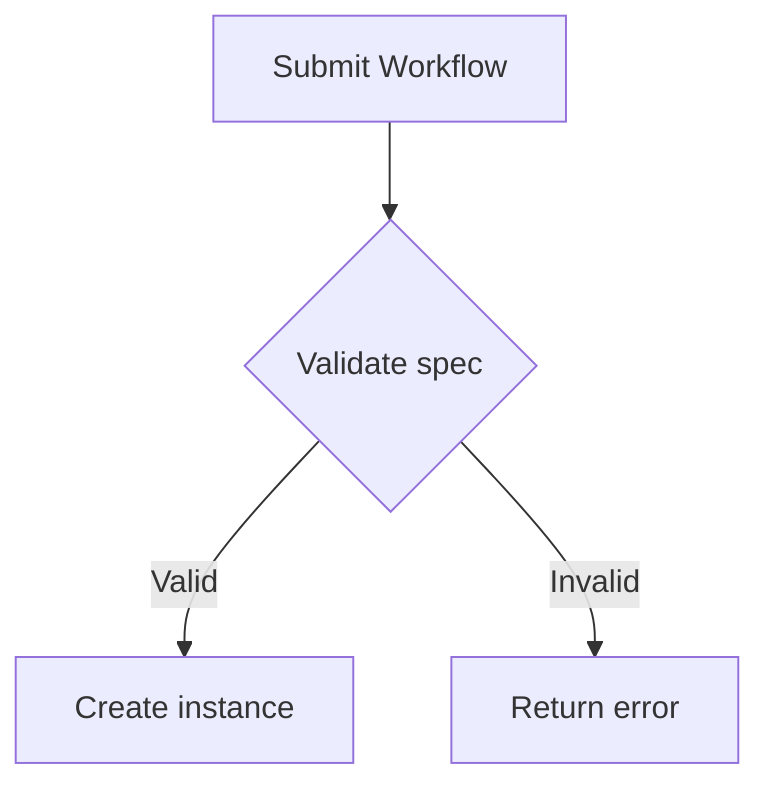

# Stigmer documentation style guide

This guide defines the writing conventions for all Stigmer documentation.
Automated enforcement is handled by Vale (`.vale.ini`) and Prettier
(`.prettierrc`). Pre-commit hooks run both tools on every commit.

## Audience

Stigmer documentation is written for **platform builders**---engineers who
integrate Stigmer into their own products. Every page should answer: _"Does a
platform builder need this to understand or integrate Stigmer?"_

Do not write for casual end users. Assume readers are comfortable with APIs,
CLIs, and infrastructure concepts.

## Domain terminology

Capitalize Stigmer domain terms when they refer to the platform concept. Vale
enforces these automatically via `vale/styles/Stigmer/terms.yml`.

Always capitalize these terms---Agent, Workflow, Skill, Session, Organization,
Environment, Project, Workspace, Seedpack, Durable Execution, Stigmer Server,
Agent Runner, Workflow Runner, MCP Server, Sub-Agent.

Always use the canonical form---gRPC, ID, IDs.

When the term is used generically (not as a Stigmer concept), lowercase is
acceptable---for example, "the Agent's OS env vars" versus "the Agent's
Environment configuration."

## Headings

- Use **sentence casing**: capitalize only the first word and proper nouns.
  - _How to create an Agent_ (correct)
  - _How To Create An Agent_ (incorrect)
- Use **infinitive verb forms** for how-to titles.
  - _How to deploy a Workflow_ (correct)
  - _Deploying a Workflow_ (incorrect)
- Do not end headings with punctuation.

## Code blocks

- Always specify a language hint: ` ```go `, ` ```typescript `, ` ```yaml `,
  ` ```bash `, etc.
- Use `bash` (not `shell` or `sh`) for terminal commands.
- Prefix commands with `$` only when showing both the command and its output.
  Omit `$` for copy-pasteable command blocks.
- Keep blocks short. If a block exceeds 30 lines, break it into smaller pieces
  with explanatory prose between them.

## MDX components

Custom components are available in all `.mdx` files without imports. Use them to
improve readability and structure.

### Callouts

Highlight important information with a colored sidebar and icon.

```mdx
<Callout type="info">General information the reader should know.</Callout>
<Callout type="warn">Something the reader should be cautious about.</Callout>
<Callout type="error">A critical warning or breaking change.</Callout>
```

### Tabs

Show alternative content (install methods, platform-specific instructions).

```mdx
<Tabs items={["npm", "yarn", "pnpm"]}>
  <Tab value="npm">npm install @stigmer/sdk</Tab>
  <Tab value="yarn">yarn add @stigmer/sdk</Tab>
  <Tab value="pnpm">pnpm add @stigmer/sdk</Tab>
</Tabs>
```

### SDK language tabs

Use `<SDKTabs>` for multi-language SDK code examples. The selected language
persists across pages.

```mdx
<SDKTabs>
  <Tab value="Go">Go code here</Tab>
  <Tab value="TypeScript">TypeScript code here</Tab>
  <Tab value="Python">Python code here</Tab>
  <Tab value="Java">Java code here</Tab>
</SDKTabs>
```

### Steps

Numbered step-by-step instructions for tutorials and how-to guides.

```mdx
<Steps>
  <Step>### Install the CLI
  Download and install the Stigmer CLI.</Step>
  <Step>### Create an Agent
  Define your first Agent.</Step>
</Steps>
```

### Term tooltips

Wrap a Stigmer domain term in `<Term>` to show its definition on hover.
Definitions come from the glossary at `site/src/components/docs/glossary.ts`.

```mdx
When you create a <Term>Workflow</Term>, you define each step.
```

### File trees

Visualize directory structures with interactive expand/collapse.

```mdx
<Files>
  <Folder name="docs" defaultOpen>
    <File name="index.mdx" />
    <Folder name="concepts">
      <File name="agents.mdx" />
    </Folder>
  </Folder>
</Files>
```

### Accordions

Collapsible sections for FAQ-style content or optional detail.

```mdx
<Accordions>
  <Accordion title="What is an Agent?">
  A reusable definition of what an AI assistant knows and can do.
  </Accordion>
</Accordions>
```

### TypeTable

Structured property tables for API reference documentation.

```mdx
<TypeTable
  type={{
    name: { type: "string", description: "Agent name.", required: true },
    model: { type: "string", description: "LLM model.", default: "gpt-4o" },
  }}
/>
```

### ImageZoom

Click-to-zoom for screenshots and diagrams.

```mdx
<ImageZoom src="/docs/screenshot.png" alt="Dashboard overview" />
```

## Prose

- Write in **second person** ("you") when addressing the reader.
- Use **active voice**. Vale enforces this via the Google style.
- Use **contractions** (you'll, it's, don't). They make prose more approachable.
- Keep sentences short. If a sentence spans more than two lines in an
  80-character-wide editor, split it.
- Use inclusive language. Vale enforces this via the `alex` package.
- Use em dashes without surrounding spaces---like this.

## File conventions

- **Extension**: `.mdx` for all rendered documentation files.
- **Naming**: lowercase with hyphens (`agent-lifecycle.mdx`, not
  `AgentLifecycle.mdx`).
- **Front matter**: every file must have `title` and `description`.

```yaml
---
title: How to create an Agent
description: Step-by-step guide to defining and running your first Agent.
---
```

## Formatting

- Prettier autoformats on commit. Configuration is in `.prettierrc`:
  - 80-character line width
  - 2-space indentation
  - Prose wrapping at word boundaries (`proseWrap: always`)
- Use **bold** for UI elements and key concepts on first mention.
- Use `code` formatting for CLI commands, file paths, config keys, and API
  fields.
- Use tables to compare options or list parameters.
- Use Mermaid diagrams for architecture, data flows, and state machines.

## Diagrams

Include Mermaid diagrams wherever they add clarity. Prefer diagrams over lengthy
textual descriptions of architecture or data flow.

````markdown

````

## Links

- Use relative paths for internal links: `[Agents](../concepts/agents.mdx)`.
- Use descriptive link text. Avoid "click here" or bare URLs.
- The `check-links` Make target validates all links before CI.

## What not to do

- Do not add comments that narrate what the code does ("Import the module").
- Do not duplicate content. Link to the authoritative page instead.
- Do not write speculative documentation. Every statement must be grounded in
  the current implementation.
- Do not use emoji in headings or as bullet markers.
