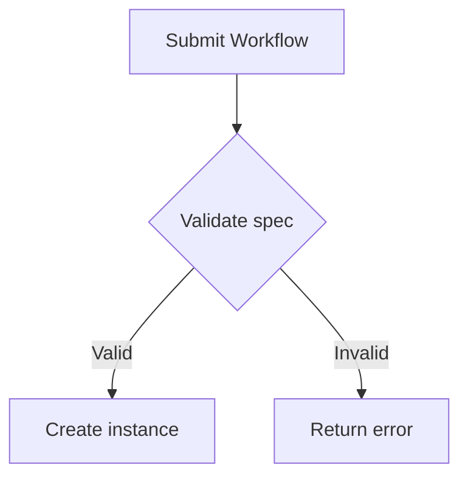

# Stigmer documentation style guide

This guide defines the writing conventions for all Stigmer documentation.
Automated enforcement is handled by Vale (`.vale.ini`) and Prettier
(`.prettierrc`). Pre-commit hooks run both tools on every commit.

## Audience

Stigmer documentation is written for **platform builders**---engineers who
integrate Stigmer into their own products. Every page should answer: _"Does a
platform builder need this to understand or integrate Stigmer?"_

Do not write for casual end users. Assume readers are comfortable with APIs,
CLIs, and infrastructure concepts.

## Domain terminology

All Stigmer term definitions, capitalization rules, and context-specific usage
guidance live in [`docs/vocabulary.md`](vocabulary.md). That file is the single
source of truth.

**Short version**: capitalize Stigmer domain terms (Agent, Skill, Workflow,
Session, etc.) when they refer to the platform concept. Lowercase when used
generically. Use the canonical forms (gRPC, ID, IDs). Vale enforces these
automatically via `vale/styles/Stigmer/terms.yml`.

See the vocabulary guide for the full term list, user-facing alternatives per
writing context, and good/bad examples.

## Headings

- Use **sentence casing**: capitalize only the first word and proper nouns.
  - _How to create an Agent_ (correct)
  - _How To Create An Agent_ (incorrect)
- Use **infinitive verb forms** for how-to titles.
  - _How to deploy a Workflow_ (correct)
  - _Deploying a Workflow_ (incorrect)
- Do not end headings with punctuation.

## Code blocks

- Always specify a language hint: ` ```go `, ` ```typescript `, ` ```yaml `,
  ` ```bash `, etc.
- Use `bash` (not `shell` or `sh`) for terminal commands.
- Prefix commands with `$` only when showing both the command and its output.
  Omit `$` for copy-pasteable command blocks.
- Keep blocks short. If a block exceeds 30 lines, break it into smaller pieces
  with explanatory prose between them.

### YAML blocks are contract-validated

Every ` ```yaml ` block in `docs/` is checked against the real proto contracts
by `make check-docs-yaml` (CI-enforced). A block must be one of:

1. **A resource manifest** — starts with `apiVersion:`/`kind:`. Validated
   automatically; no annotation needed.
2. **An authoring-form task list** — a list of `- name:`/`kind:`/`task_config:`
   entries. Validated automatically, including nested tasks and every
   `task_config` against its typed schema.
3. **An anchored fragment** — a snippet of a larger resource. Tell the gate what
   it is a fragment of via the fence info string:
   - ` ```yaml validate-as="Agent" ` — body holds top-level resource fields
     (`spec:`, `status:`, ...)
   - ` ```yaml validate-as="Workflow.spec" ` — body holds spec-level fields
     (`tasks:`, `budget:`, `env:`, ...)
   - ` ```yaml validate-as="task" ` — body holds task-level fields (`export:`,
     `flow:`, ...)
   - ` ```yaml validate-as="task-config:llm_call" ` — body holds fields of one
     task kind's config

   Absent fields are fine; unknown or misshapen fields fail the build.

4. **Explicitly skipped** — ` ```yaml no-validate="reason" `, only for blocks
   that are not resource YAML at all (e.g. frontmatter examples like the one
   below). The reason is mandatory.

Anything else fails the build. Consequences for authors: use full proto enum
names (`TRANSFORM_ENGINE_JQ`, not `jq`), never invent fields, and never use the
internal DSL form (`- task_name: { call: ... }`) — always the authoring form.
Content that is markdown-with-frontmatter (like a `SKILL.md` listing) belongs in
a ` ```md ` fence, not ` ```yaml `.

Manifests and task lists are additionally held to **platform-parity
protovalidate rules** (stigmer/stigmer#305): the rules the platform itself
evaluates when the resource is applied — required fields, value lists, name
patterns — on the manifest and on each task entry's outer fields. Rules _inside_
`task_config` are not enforced (the platform does not evaluate them either; a
doc example must never be held stricter than the platform), and anchored
fragments are never rule-checked — partial-by-intent is their point. Run
`make report-docs-yaml-rules` for the full-depth picture, including the latent
findings enforcement deliberately skips.

## Classify every page

Every hand-authored page has an entry in `docs/_inventory/classification.yaml`,
checked in CI by `make check-docs-inventory`. The entry records three decisions:
**fate** (does the page survive the docs revamp, and how), **diataxis**
(tutorial, how-to, explanation, reference, or landing — one type per page, never
mixed), and **medium**.

Prose and code are the substrate of every page, not a medium. `medium` names the
page's demonstration centerpiece, if it has one. Pick it with this rule, first
"yes" wins:

1. Is it structure rather than a screen? → `diagram`
2. Must the reader manipulate it to learn? → `interactive`
3. Does nothing change across frames? → `still`
4. Does the reader act in sequence at their own pace? → `screenshot-journey`
5. Is the timing or sequence itself the lesson? → `animated-tour`
6. Otherwise → `none`

Reserve `animated-tour` for genuine demonstrations — a capability that must be
seen working. Getting-started journeys and console procedures are
`screenshot-journey`: the reader compares their own screen against the depicted
one and sets the pace. `still` and `screenshot-journey` are rendered from real
components by Scenar, never hand-captured — a screenshot taken by hand goes
stale with no signal, so do not add one as a placeholder.

Generated pages (the `cli/commands/`, `guides/workflows/task-types/`,
`sdk/react/`, `sdk/resources/`, `sdk/ink/`, and `sdk/theme/` reference sets) are
covered by cohort rules in the same file and need no per-page entry.

When you add a page, add its entry. When you delete or move a page, update its
entry (remove it, or re-key it) in the same commit. When you add or remove an
embed, update the page's `embeds` map. CI fails on any mismatch and names the
page.

## MDX components

Custom components are available in all `.mdx` files without imports. Use them to
improve readability and structure.

### Callouts

Highlight important information with a colored sidebar and icon. Supported
types: `info`, `warn` (or `warning`), `error`, `success`.

```mdx
<Callout type="info">General information the reader should know.</Callout>
<Callout type="warn">Something the reader should be cautious about.</Callout>
<Callout type="error">A critical warning or breaking change.</Callout>
<Callout type="success">A positive outcome or confirmation.</Callout>
```

### Cards

Link card grids for navigation hubs and landing pages.

```mdx
<Cards>
  <Card href="/docs/concepts" title="Core Concepts">
    Understand Agents, Workflows, Skills, and how they fit together.
  </Card>
  <Card href="/docs/getting-started" title="Getting Started">
    Install Stigmer and run your first Agent in under five minutes.
  </Card>
</Cards>
```

### Tabs

Show alternative content (install methods, platform-specific instructions).

```mdx
<Tabs items={["npm", "yarn", "pnpm"]}>
  <Tab value="npm">npm install @stigmer/sdk</Tab>
  <Tab value="yarn">yarn add @stigmer/sdk</Tab>
  <Tab value="pnpm">pnpm add @stigmer/sdk</Tab>
</Tabs>
```

### SDK language tabs

Use `<SDKTabs>` for multi-language SDK code examples. The selected language
persists across pages.

```mdx
<SDKTabs>
  <Tab value="Go">Go code here</Tab>
  <Tab value="TypeScript">TypeScript code here</Tab>
  <Tab value="Python">Python code here</Tab>
  <Tab value="Java">Java code here</Tab>
</SDKTabs>
```

### Steps

Numbered step-by-step instructions for tutorials and how-to guides.

```mdx
<Steps>
  <Step>### Install the CLI Download and install the Stigmer CLI.</Step>
  <Step>### Create an Agent Define your first Agent.</Step>
</Steps>
```

### Term tooltips

Wrap a Stigmer domain term in `<Term>` to show its definition on hover.
Definitions come from the glossary at `site/src/components/docs/glossary.ts`.

```mdx
When you create a <Term>Workflow</Term>, you define each step.
```

### File trees

Visualize directory structures with interactive expand/collapse.

```mdx
<Files>
  <Folder name="docs" defaultOpen>
    <File name="index.mdx" />
    <Folder name="concepts">
      <File name="agents.mdx" />
    </Folder>
  </Folder>
</Files>
```

### Accordions

Collapsible sections for FAQ-style content or optional detail.

```mdx
<Accordions>
  <Accordion title="What is an Agent?">
    A reusable definition of what an AI assistant knows and can do.
  </Accordion>
</Accordions>
```

### TypeTable

Structured property tables for API reference documentation.

```mdx
<TypeTable
  type={{
    name: { type: "string", description: "Agent name.", required: true },
    model: { type: "string", description: "LLM model.", default: "gpt-4o" },
  }}
/>
```

### ImageZoom

Click-to-zoom for screenshots and diagrams.

```mdx
<ImageZoom src="/docs/screenshot.png" alt="Dashboard overview" />
```

### Scenario embeds

`<ScenarEmbed>` renders a hosted product walkthrough from
`stigmer.ai/demos/<id>/`. The `id` must match a tour directory under
`demos/tours/` — CI rejects a typo (`scripts/verify-scenar-tours.mjs`).

```mdx
<ScenarEmbed id="quickstart-tour" title="Quickstart walkthrough" />
```

Two rules when adding or removing an embed:

1. Declare it in the page's entry in `docs/_inventory/classification.yaml` (see
   "Classify every page" below). CI fails when a page's embeds and its
   declaration disagree.
2. Give it a prose lead-in that says what the reader is about to watch. An
   animated-tour embed contributes nothing to the markdown exports (`llms.txt`,
   the Copy-as-Markdown button), so the surrounding prose must carry the
   information on its own. (Stills carry a stronger rule of their own — see "A
   still completes a story" below.)

The legacy `<Demo* />` components (for example `<DemoToolCallsPlayback />`) are
the pre-Scenar embed system and are being retired page by page during the docs
revamp. Do not add new ones.

### Stills

`<Still>` places one Scenar-rendered screenshot in the prose — the `still`
medium, and the frames of a `screenshot-journey` (several stills interleaved
with the page's steps). Never hand-capture a screenshot, not even as a
placeholder: a hand-captured image rots with no signal, while a still is
re-rendered from the tour source on every release and served beside the tour
bundles at `stigmer.ai/demos/<scenario>/stills/`.

```mdx
<Still
  id="agent-detail-tour/agent-detail"
  alt="The Agent detail page in the Stigmer console: the support-agent
definition with its description and instructions."
/>
```

- **A still completes a story.** Never drop a screenshot in "for visual
  interest" — a reader who senses a screenshot is decorative learns to skip all
  of them. Every still is the middle of a three-beat sequence the prose builds
  around it:
  1. **Setup** — the sentence before the still names the reader's action or the
     claim being demonstrated ("Run `stigmer agent deploy`", "the gate renders
     the payload as a diff").
  2. **Payoff** — the still shows the outcome of exactly that action or claim,
     nothing else. If the frame doesn't answer "and here is what you see", it is
     the wrong frame (or the wrong shot — re-declare it).
  3. **Anchor** — the prose after the still (or the next step in a journey)
     points at something concrete on the frame the reader should find or verify
     before moving on. A still nothing refers back to is decoration.
- **`id` is `<scenario>/<shot>`** — a tour directory under `demos/tours/` and a
  `shot` name declared on one of its steps (`demos/README.md` covers declaring
  shots). CI resolves both halves and fails on a typo, a missing shot, or a
  missing tour (`scripts/verify-scenar-tours.mjs`, invariant 8).
- **`alt` is required and CI-enforced.** Unlike an animated embed, a still
  survives into the markdown exports as a real image — `cleanContent` rewrites
  the tag to `` — so the alt text is what an LLM or a markdown reader
  gets. Describe the screen ("The Agent detail page showing…"), don't repeat the
  narration: narration is written for audio, alt text for a reader who cannot
  see the image. Write the tag self-closing; CI rejects a paired form.
- **Stills render light-on-dark.** The docs site is dark-only and media is
  deliberately light: a bright frame reads as content against the dark page, and
  the markdown exports have always linked the light variant, so the two channels
  stay consistent. `scenar shoot` still captures both themes; only the light
  capture is rendered, so eyeball the light variant when reviewing.
  Click-to-zoom shows the full 2560x1600 capture.
- **A still keeps its source tour alive.** When a still replaces a page's last
  `<ScenarEmbed>`, the tour under `demos/tours/` must stay — it is what the
  still is rendered from. The classification `embeds` map tracks iframe embeds
  only; a `<Still>` needs no entry there.

To see an unreleased still on its real docs page, use the same local loop as
embeds (`demos/README.md`, "Authoring loop"): serve `.bundles/` and point
`NEXT_PUBLIC_SCENAR_EMBED_BASE` at it. To eyeball one frame without capturing,
open the packed bundle with `?shot=<name>`.

## Prose

- Write in **second person** ("you") when addressing the reader.
- Use **active voice**. Vale enforces this via the Google style.
- Use **contractions** (you'll, it's, don't). They make prose more approachable.
- Keep sentences short. If a sentence spans more than two lines in an
  80-character-wide editor, split it.
- Use inclusive language. Vale enforces this via the `alex` package.
- Use em dashes without surrounding spaces---like this.

## File conventions

- **Extension**: `.mdx` for all rendered documentation files.
- **Naming**: lowercase with hyphens (`agent-lifecycle.mdx`, not
  `AgentLifecycle.mdx`).
- **Front matter**: every file must have `title` and `description`.

```yaml no-validate="docs-page frontmatter example, not resource YAML"
---
title: How to create an Agent
description: Step-by-step guide to defining and running your first Agent.
---
```

## Formatting

- Prettier autoformats on commit. Configuration is in `.prettierrc`:
  - 80-character line width
  - 2-space indentation
  - Prose wrapping at word boundaries (`proseWrap: always`)
- Use **bold** for UI elements and key concepts on first mention.
- Use `code` formatting for CLI commands, file paths, config keys, and API
  fields.
- Use tables to compare options or list parameters.
- Use Mermaid diagrams for architecture, data flows, and state machines.

## Diagrams

Fenced ` ```mermaid ` code blocks render as interactive diagrams (client-side
via Mermaid.js) in the site's dark theme. Prefer diagrams over lengthy textual
descriptions of architecture or data flow.

````mdx

````

Supported diagram types include `flowchart`, `sequenceDiagram`,
`stateDiagram-v2`, `classDiagram`, `erDiagram`, and `gantt`. See the
[Mermaid documentation](https://mermaid.js.org/) for full syntax.

## Links

- Use relative paths for internal links: `[Agents](../concepts/agents.mdx)`.
- Use descriptive link text. Avoid "click here" or bare URLs.
- The `check-links` Make target validates all links before CI.

## LLM-friendly output

The build pipeline generates files that let LLM agents and AI tools consume
Stigmer documentation as plain text, following the
[llms.txt standard](https://llmstxt.org).

### Generated files

| File                | Address                     | Purpose                                           |
| ------------------- | --------------------------- | ------------------------------------------------- |
| `out/llms.txt`      | `stigmer.ai/llms.txt`       | Curated index with section links and descriptions |
| `out/llms-full.txt` | `stigmer.ai/llms-full.txt`  | All documentation concatenated into one file      |
| `out/docs/**/*.md`  | `stigmer.ai/docs/{path}.md` | Per-page markdown variant of each doc page        |

### How it works

The script `site/scripts/generate-llms-txt.ts` runs automatically after
`next build`. It reads all `.mdx` files from `docs/`, strips frontmatter and
import statements, and writes cleaned markdown to `out/`. Page ordering follows
the `meta.json` files. Individual CLI command pages and the contributing section
are placed in an "Optional" section in `llms.txt`.

### Commands

- `make docs-build` --- runs the full build including LLM output
- `make gen-llms` --- regenerates LLM output from an existing `out/` directory
- `cd site && yarn generate-llms` --- same as above from the site directory

### Copy as Markdown button

Every docs page includes a "Copy as Markdown" button next to the title. It
fetches the `.md` variant of the current page and copies the content to the
clipboard so users can share documentation context with AI tools.

## What not to do

- Do not add comments that narrate what the code does ("Import the module").
- Do not duplicate content. Link to the authoritative page instead.
- Do not write speculative documentation. Every statement must be grounded in
  the current implementation.
- Do not use emoji in headings or as bullet markers.
