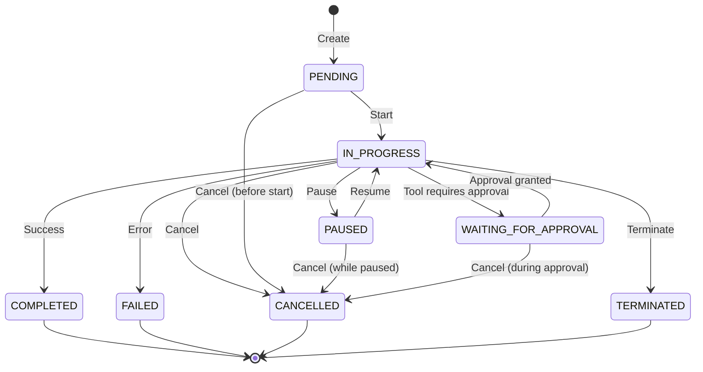
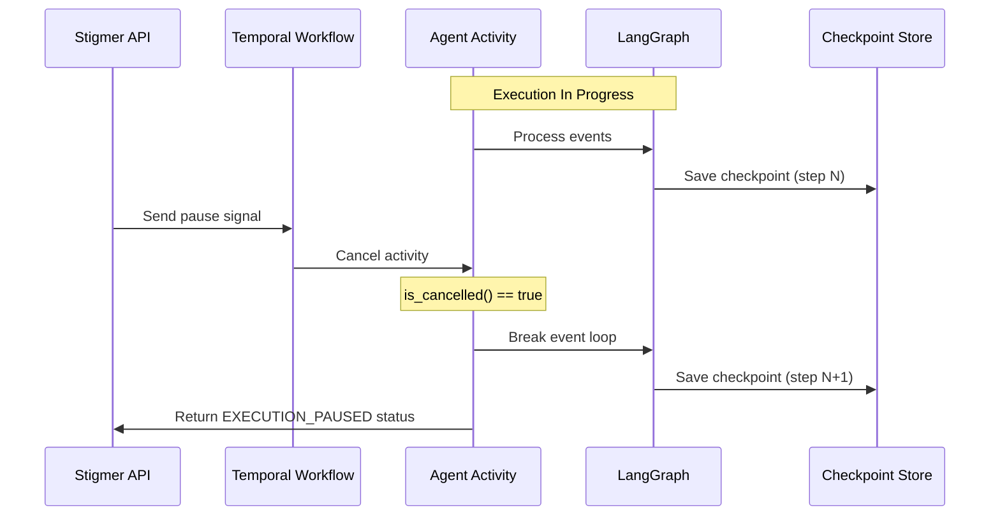
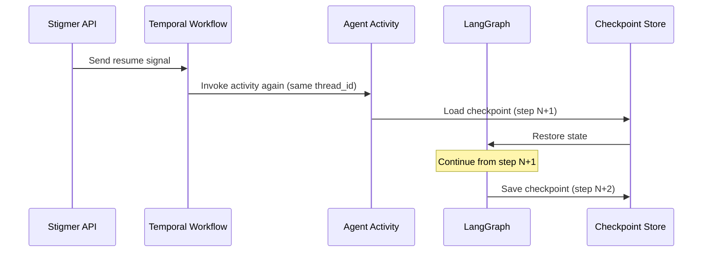

# Agent Execution Lifecycle

Agent executions in Stigmer follow a well-defined lifecycle with multiple phases and lifecycle operations. This document explains how agent executions transition between phases, what each lifecycle operation does, and how pause/resume enables temporary agent suspension with full checkpoint preservation.

## Purpose

Understanding the agent execution lifecycle is essential for:
- **Users**: Knowing when to pause vs cancel vs terminate agents
- **Operators**: Monitoring agent health and troubleshooting issues
- **Developers**: Building features that interact with agent execution state

## Execution Phases

Agent executions progress through the following phases:



### Phase Descriptions

#### PENDING
- **Description**: Agent execution created but not yet started by Temporal
- **Duration**: Typically milliseconds to seconds
- **Can transition to**: IN_PROGRESS, CANCELLED
- **Characteristics**: Initial state, no compute resources consumed yet

#### IN_PROGRESS
- **Description**: Agent is actively executing tasks and invoking tools
- **Duration**: Variable (seconds to hours/days)
- **Can transition to**: WAITING_FOR_APPROVAL, PAUSED, COMPLETED, FAILED, CANCELLED, TERMINATED
- **Characteristics**: Active execution, consuming compute resources, LangGraph checkpoints being saved

#### WAITING_FOR_APPROVAL
- **Description**: Agent paused at a checkpoint waiting for human approval to proceed with a tool call
- **Duration**: Variable (user-controlled, typically minutes to hours)
- **Can transition to**: IN_PROGRESS (approval granted), CANCELLED
- **Characteristics**: Checkpoint preserved, agent state persisted, waiting for approval decision

#### PAUSED
- **Description**: Agent execution temporarily suspended by user, can be resumed
- **Duration**: Variable (user-controlled, unlimited)
- **Can transition to**: IN_PROGRESS (resume), CANCELLED
- **Characteristics**: Non-terminal phase, checkpoint preserved, resumable

#### COMPLETED
- **Description**: Agent successfully completed the task
- **Duration**: Terminal (permanent)
- **Can transition to**: None (terminal)
- **Characteristics**: Final status available, checkpoint preserved for audit

#### FAILED
- **Description**: Agent encountered an error and could not complete the task
- **Duration**: Terminal (permanent)
- **Can transition to**: None (terminal, but can be recovered via recover operation)
- **Characteristics**: Error message captured, checkpoint preserved at failure point

#### CANCELLED
- **Description**: Execution was explicitly cancelled by user
- **Duration**: Terminal (permanent)
- **Can transition to**: None (terminal)
- **Characteristics**: Graceful shutdown, checkpoint preserved at cancellation point

#### TERMINATED
- **Description**: Execution was forcefully terminated (emergency stop)
- **Duration**: Terminal (permanent)
- **Can transition to**: None (terminal)
- **Characteristics**: Immediate termination, cleanup may be incomplete

### Terminal vs Non-Terminal Phases

**Terminal Phases** (execution finished, cannot resume):
- `COMPLETED`
- `FAILED`
- `CANCELLED`
- `TERMINATED`

**Non-Terminal Phases** (execution can continue):
- `PENDING`
- `IN_PROGRESS`
- `WAITING_FOR_APPROVAL`
- `PAUSED`

## Lifecycle Operations

Agent executions support five lifecycle operations for controlling execution:

| Operation | Purpose | Valid Phases | Terminal? |
|-----------|---------|--------------|-----------|
| **Cancel** | Gracefully stop execution | PENDING, IN_PROGRESS, PAUSED, WAITING_FOR_APPROVAL | Yes |
| **Terminate** | Forcefully stop execution | PENDING, IN_PROGRESS, PAUSED, WAITING_FOR_APPROVAL | Yes |
| **Recover** | Retry failed execution | FAILED | No |
| **Pause** | Temporarily suspend execution | PENDING, IN_PROGRESS | No |
| **Resume** | Continue paused execution | PAUSED | No |

### 1. Cancel

Gracefully stops the agent execution, allowing it to save its checkpoint and clean up resources.

**Use Cases:**
- User realizes the agent is working on the wrong task
- Cost control (stop expensive long-running operation)
- Testing/development (cancel test executions)

**Pipeline Steps:**
1. `LoadExecutionById` - Load execution from database
2. `ValidateCancellable` - Check phase is PENDING or IN_PROGRESS (or already CANCELLED for idempotency)
3. `CancelTemporalWorkflow` - Send cancellation signal to Temporal
4. `UpdateExecutionPhase` - Set phase to CANCELLED, set completed_at
5. `PersistExecution` - Save to database
6. `BroadcastExecutionUpdate` - Publish to StreamBroker for real-time subscribers

**Idempotency:** Calling cancel on an already cancelled execution succeeds as a no-op.

**Example:**

```bash
stigmer agent exec cancel --id exec-123 --reason "Task no longer needed"
```

**gRPC API:**

```protobuf
message CancelAgentExecutionInput {
  string id = 1;        // Execution ID
  string reason = 2;    // Optional cancellation reason
}
```

### 2. Terminate

Forcefully stops the agent execution immediately without graceful shutdown. Use only when cancel doesn't work or in emergency situations.

**Use Cases:**
- Emergency stop (runaway agent consuming resources)
- Cancel failed or hung execution
- Force stop when graceful cancel doesn't respond

**Differences from Cancel:**
- **Cancel**: Graceful, allows cleanup, agent-friendly
- **Terminate**: Immediate, forced, may leave incomplete cleanup

**Pipeline Steps:**
1. `LoadExecutionById` - Load execution from database
2. `ValidateTerminable` - Check phase is not already terminal
3. `TerminateTemporalWorkflow` - Send terminate command to Temporal
4. `UpdateExecutionPhase` - Set phase to TERMINATED, set completed_at
5. `PersistExecution` - Save to database
6. `BroadcastExecutionUpdate` - Publish to StreamBroker

**Example:**

```bash
stigmer agent exec terminate --id exec-123 --reason "Emergency stop"
```

**gRPC API:**

```protobuf
message TerminateAgentExecutionInput {
  string id = 1;        // Execution ID
  string reason = 2;    // Optional termination reason
}
```

### 3. Recover

Retries a failed agent execution from its last checkpoint, allowing it to continue from where it failed.

**Use Cases:**
- Transient failures (network issues, temporary API outages)
- Fixed underlying issues (API credentials updated, service restored)
- Manual retry after investigating failure cause

**Pipeline Steps:**
1. `LoadExecutionById` - Load execution from database
2. `ValidateRecoverable` - Check phase is FAILED
3. `ResetTemporalWorkflow` - Reset Temporal workflow to last checkpoint
4. `UpdateExecutionPhase` - Set phase to PENDING (will transition to IN_PROGRESS when restarted)
5. `PersistExecution` - Save to database
6. `BroadcastExecutionUpdate` - Publish to StreamBroker

**Example:**

```bash
stigmer agent exec recover --id exec-123
```

**gRPC API:**

```protobuf
message RecoverAgentExecutionInput {
  string id = 1;        // Execution ID
}
```

**Note:** Recover uses Temporal's Reset API to restart the workflow from the last checkpoint. The agent resumes with the same thread_id, so LangGraph loads the checkpoint and continues.

### 4. Pause

Temporarily suspends the agent execution at its current checkpoint. The execution can be resumed later from the exact same point.

**Use Cases:**
- Cost control (pause expensive operation overnight)
- Waiting for external dependencies
- Testing/debugging (pause to inspect state)
- Resource management (pause low-priority agents)

**Pipeline Steps:**
1. `LoadExecutionById` - Load execution from database
2. `ValidatePausable` - Check phase is PENDING or IN_PROGRESS (or already PAUSED for idempotency)
3. `SignalPauseToTemporal` - Send pause signal to workflow
4. `UpdateExecutionPhase` - Set phase to PAUSED (don't set completed_at - execution is not finished)
5. `PersistExecution` - Save to database
6. `BroadcastExecutionUpdate` - Publish to StreamBroker

**How Pause Works:**



**Idempotency:** Calling pause on an already paused execution succeeds as a no-op.

**Example:**

```bash
stigmer agent exec pause --id exec-123 --reason "Pausing overnight"
```

**gRPC API:**

```protobuf
message PauseAgentExecutionInput {
  string id = 1;        // Execution ID
  string reason = 2;    // Optional pause reason
}
```

### 5. Resume

Continues a paused agent execution from its checkpoint.

**Use Cases:**
- Resume after planned pause
- Continue after resolving blocking issue
- Resume after cost-control pause

**Pipeline Steps:**
1. `LoadExecutionById` - Load execution from database
2. `ValidateResumable` - Check phase is PAUSED
3. `SignalResumeToTemporal` - Send resume signal to workflow
4. `UpdateExecutionPhase` - Set phase to IN_PROGRESS
5. `PersistExecution` - Save to database
6. `BroadcastExecutionUpdate` - Publish to StreamBroker

**How Resume Works:**



**Example:**

```bash
stigmer agent exec resume --id exec-123
```

**gRPC API:**

```protobuf
message ResumeAgentExecutionInput {
  string id = 1;        // Execution ID
}
```

## Lifecycle Implementation

### Go Backend (stigmer-server)

The Go backend implements lifecycle operations using a pipeline pattern:

```go
// From cancel.go
func (c *AgentExecutionController) Cancel(
    ctx context.Context,
    input *agentexecutionv1.CancelAgentExecutionInput,
) (*agentexecutionv1.AgentExecution, error) {
    // Build and execute pipeline
    p := c.buildCancelPipeline()
    return p.Execute(ctx, input)
}

func (c *AgentExecutionController) buildCancelPipeline() *pipeline.Pipeline {
    return pipeline.NewPipeline("agentexecution-cancel").
        AddStep(NewLoadExecutionByIdStep(c.store)).
        AddStep(NewValidateCancellableStep()).
        AddStep(NewCancelTemporalWorkflowStep(c.temporalClient)).
        AddStep(NewUpdateExecutionPhaseStep(EXECUTION_CANCELLED)).
        AddStep(NewLifecyclePersistStep(c.store)).
        AddStep(NewLifecycleBroadcastStep(c.streamBroker)).
        Build()
}
```

**Reusable Pipeline Steps:**

| Step | Purpose | Used By |
|------|---------|---------|
| `LoadExecutionByIdStep` | Load from database | All operations |
| `ValidateCancellableStep` | Check cancellable phase | Cancel |
| `ValidatePausableStep` | Check pausable phase | Pause |
| `ValidateResumableStep` | Check resumable phase | Resume |
| `CancelTemporalWorkflowStep` | Send cancel to Temporal | Cancel |
| `SignalPauseToTemporalStep` | Send pause signal | Pause |
| `SignalResumeToTemporalStep` | Send resume signal | Resume |
| `UpdateExecutionPhaseStep` | Update phase field | All operations |
| `LifecyclePersistStep` | Save to database | All operations |
| `LifecycleBroadcastStep` | Publish to StreamBroker | All operations |

### Java Workflow (stigmer-cloud)

The Java Temporal workflow handles pause/resume signals:

```java
// From InvokeAgentExecutionWorkflowImpl.java
public class InvokeAgentExecutionWorkflowImpl implements InvokeAgentExecutionWorkflow {
    
    private boolean pauseRequested = false;
    private boolean resumeRequested = false;
    
    @Override
    public void pause() {
        this.pauseRequested = true;
        logger.info("Pause signal received for execution {}", executionId);
    }
    
    @Override
    public void resume() {
        this.resumeRequested = true;
        logger.info("Resume signal received for execution {}", executionId);
    }
    
    @Override
    public AgentExecutionStatus invoke(AgentExecution execution, String threadId) {
        // Pause/resume loop wraps agent execution
        while (true) {
            if (pauseRequested) {
                logger.info("Pausing agent execution {}", executionId);
                
                // Wait for resume signal (or cancellation)
                Workflow.await(() -> resumeRequested || Workflow.isCancellationRequested());
                
                if (Workflow.isCancellationRequested()) {
                    // Cancelled during pause
                    return buildCancelledStatus();
                }
                
                // Resume requested - continue execution
                pauseRequested = false;
                resumeRequested = false;
                logger.info("Resuming agent execution {}", executionId);
            }
            
            // Execute agent activity (with cancellation scope for graceful pause)
            try {
                return Workflow.newCancellationScope(() -> {
                    return activities.executeGraphton(execution, threadId);
                }).run();
            } catch (ActivityCancelledException e) {
                // Activity cancelled due to pause - loop will handle it
                logger.info("Agent activity cancelled (paused)");
                pauseRequested = true;
            }
        }
    }
}
```

**Key Features:**
- Pause/resume loop wraps agent activity execution
- `CancellationScope` allows graceful activity cancellation
- Pause signal causes activity cancellation, not workflow termination
- Resume signal continues from checkpoint (same thread_id)

### Python Activity (agent-runner)

The Python activity handles graceful pause via cancellation:

```python
# From execute_graphton.py
async for event in agent_graph.astream_events(graph_input, config=config):
    # Check for pause (activity cancellation) between events
    if activity.is_cancelled():
        activity_logger.info(
            f"⏸️ PAUSE: Activity cancelled for execution {execution_id}, "
            f"saving checkpoint (thread_id={thread_id})"
        )
        # LangGraph automatically saves checkpoint on iteration
        # Raise CancelledError to exit the loop gracefully
        raise asyncio.CancelledError("Paused by user")
    
    # Process event...
```

**On Resume:**
```python
# Workflow re-invokes activity with same thread_id
# LangGraph automatically loads checkpoint
agent_graph = create_deep_agent(checkpointer=checkpointer)

# Same thread_id causes checkpoint load
async for event in agent_graph.astream_events(
    graph_input,
    config={"configurable": {"thread_id": thread_id}},
):
    # Agent continues from checkpoint
```

## Pause/Resume vs HITL Approval

Stigmer has two types of "pausing":

### 1. User-Initiated Pause (EXECUTION_PAUSED)

- **Triggered by**: User calling `pause()` RPC
- **Phase**: `EXECUTION_PAUSED`
- **Resumption**: User calls `resume()` RPC
- **Use Case**: User wants to pause agent for operational reasons

### 2. HITL Approval (EXECUTION_WAITING_FOR_APPROVAL)

- **Triggered by**: Agent encountering a tool that requires approval
- **Phase**: `EXECUTION_WAITING_FOR_APPROVAL`
- **Resumption**: User calls `submitApproval()` with decision (approve/skip/reject)
- **Use Case**: Agent needs human input to proceed

**Nested Pause/Resume:**

User-initiated pause can occur during HITL approval:

```
IN_PROGRESS → WAITING_FOR_APPROVAL → PAUSED → WAITING_FOR_APPROVAL → IN_PROGRESS
                     ↑                    ↑
                     Tool needs approval  User pauses during approval
```

Implementation uses nested `CancellationScope`:

```java
// Outer loop: Pause/resume
while (true) {
    if (pauseRequested) {
        Workflow.await(() => resumeRequested);
    }
    
    // Inner scope: HITL approval loop
    return Workflow.newCancellationScope(() -> {
        while (needsApproval) {
            // Wait for approval...
        }
        return executeAgent();
    }).run();
}
```

## Error Handling and Edge Cases

### Invalid Phase Transitions

Lifecycle operations validate the current phase before proceeding:

```go
// From lifecycle_steps.go
func (s *ValidateCancellableStep) Execute(ctx *RequestContext) error {
    execution := ctx.Get(LoadedExecutionKey).(*AgentExecution)
    phase := execution.Status.Phase
    
    switch phase {
    case EXECUTION_PENDING, EXECUTION_IN_PROGRESS, EXECUTION_PAUSED:
        // Valid cancellable phases
        return nil
    case EXECUTION_CANCELLED:
        // Idempotent - already cancelled
        return nil
    case EXECUTION_COMPLETED, EXECUTION_FAILED, EXECUTION_TERMINATED:
        // Invalid - terminal phases cannot be cancelled
        return grpclib.FailedPrecondition(
            "Cannot cancel execution in terminal phase %s", phase)
    }
}
```

### Idempotent Operations

All lifecycle operations are idempotent:

- `cancel` on CANCELLED → success (no-op)
- `pause` on PAUSED → success (no-op)
- `resume` on IN_PROGRESS → success (no-op)

### Temporal Client Injection

The Go controller requires a Temporal client for lifecycle operations:

```go
// From temporal_manager.go
func (m *TemporalManager) Start() error {
    // Create Temporal client
    client, err := temporal.NewClient(...)
    
    // Inject into agent execution controller
    m.agentExecutionController.SetTemporalClient(client)
    
    return nil
}
```

## Monitoring and Observability

### Lifecycle Metrics

Track these metrics for agent execution lifecycle:

| Metric | Description | Alert Threshold |
|--------|-------------|-----------------|
| `agent_executions_by_phase` | Executions per phase | - |
| `agent_execution_phase_duration` | Time spent in each phase | - |
| `agent_execution_pause_count` | Total pauses | - |
| `agent_execution_resume_count` | Total resumes | - |
| `agent_execution_cancel_count` | Total cancellations | - |
| `agent_execution_fail_rate` | Failed / Total | > 10% |

### Phase Transition Logging

All phase transitions are logged:

```
INFO  - Agent execution exec-123 transitioning: IN_PROGRESS → PAUSED
INFO  - Agent execution exec-123 transitioning: PAUSED → IN_PROGRESS
INFO  - Agent execution exec-123 transitioning: IN_PROGRESS → COMPLETED
```

### StreamBroker Broadcasting

Phase changes are broadcast to StreamBroker for real-time updates:

```go
// From lifecycle_steps.go
func (s *LifecycleBroadcastStep) Execute(ctx *RequestContext) error {
    execution := ctx.Get(LoadedExecutionKey).(*AgentExecution)
    
    // Publish to StreamBroker (for WebSocket subscribers)
    s.streamBroker.Publish(execution.Metadata.Org, execution)
    
    return nil
}
```

Clients can subscribe for real-time phase updates:

```javascript
// WebSocket client
stigmerClient.subscribeToExecution("exec-123", (execution) => {
  console.log(`Phase changed: ${execution.status.phase}`);
});
```

## CLI Usage

### Cancel Execution

```bash
stigmer agent exec cancel --id exec-123 --reason "No longer needed"
```

### Terminate Execution

```bash
stigmer agent exec terminate --id exec-123 --reason "Emergency stop"
```

### Recover Failed Execution

```bash
stigmer agent exec recover --id exec-123
```

### Pause Execution

```bash
stigmer agent exec pause --id exec-123 --reason "Pausing overnight"
```

### Resume Execution

```bash
stigmer agent exec resume --id exec-123
```

### Check Execution Status

```bash
stigmer agent exec status --id exec-123
# Output: Phase: PAUSED, Messages: 5, Tool Calls: 3
```

## Best Practices

### 1. Use Cancel for Graceful Shutdown

```bash
# Good: Graceful cancellation
stigmer agent exec cancel --id exec-123

# Avoid: Forceful termination (unless necessary)
stigmer agent exec terminate --id exec-123
```

### 2. Pause for Cost Control

```bash
# Pause expensive long-running agent overnight
stigmer agent exec pause --id exec-123 --reason "Cost control - resume in morning"
```

### 3. Monitor Phase Transitions

```bash
# Watch execution progress in real-time
stigmer agent exec stream --id exec-123
```

### 4. Recover Transient Failures

```bash
# Check failure reason
stigmer agent exec status --id exec-123

# Recover if transient (e.g., network error)
stigmer agent exec recover --id exec-123
```

### 5. Use Reason Field for Audit Trail

```bash
# Document why you're pausing/cancelling
stigmer agent exec pause --id exec-123 --reason "Waiting for API credentials update"
```

## Related Documentation

- [Durable Execution](../guides/durable-execution.md) - Crash recovery and checkpoint preservation
- [Workflow Execution Lifecycle](workflow-execution-lifecycle.md) - Workflow lifecycle (similar pattern)
- [Temporal Integration](temporal-integration.md) - Temporal workflow architecture

## References

- **Temporal Lifecycle**: [Temporal Docs](https://docs.temporal.io/workflows#lifecycle)
- **LangGraph Checkpointing**: [LangGraph Persistence](https://langchain-ai.github.io/langgraph/concepts/persistence/)
- **Temporal Signals**: [Temporal Signals Docs](https://docs.temporal.io/workflows#signals)
