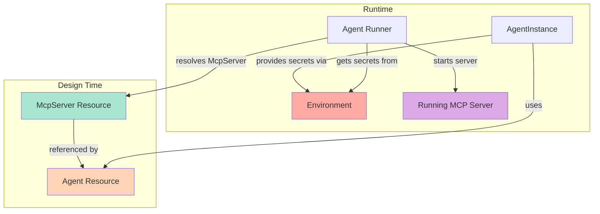
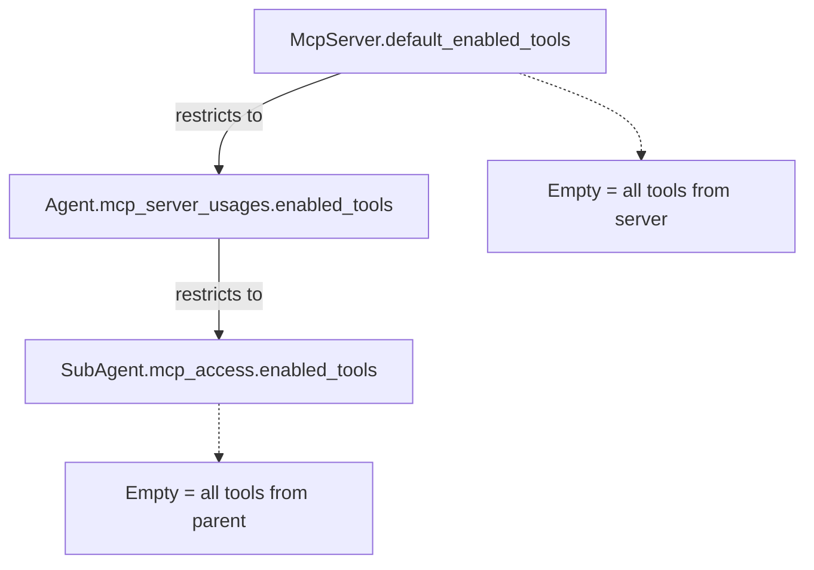
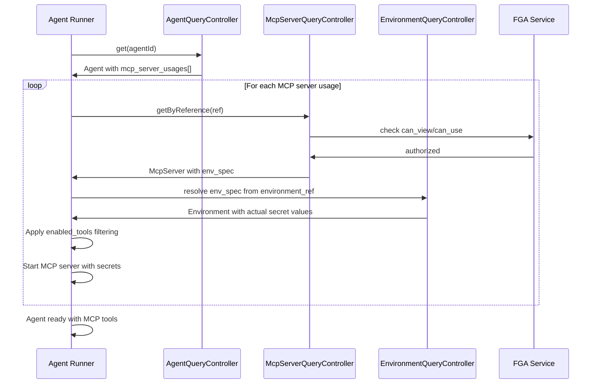
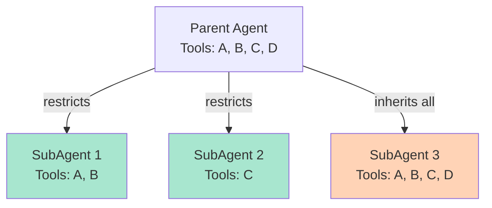

# McpServer API Resource Architecture

Stigmer's McpServer resource provides a reusable, authorized, and discoverable way to configure MCP (Model Context Protocol) servers for AI agents.

## Design Philosophy

**Core Principle**: MCP server configurations should be first-class resources that can be shared, secured, and discovered across the platform.

This replaces the previous inline `McpServerDefinition` pattern in `AgentSpec` with a reference-based model that enables:
- **Reusability**: One McpServer used by multiple agents
- **Authorization**: FGA-controlled access at platform/org/personal levels
- **Discoverability**: Marketplace catalog of pre-built MCP servers
- **Separation of Concerns**: Server config separate from agent logic

## What is MCP?

Model Context Protocol (MCP) is a standardized protocol for AI agents to access external tools and capabilities. MCP servers provide:
- Tool definitions (what the agent can do)
- Tool implementations (how to execute actions)
- Context providers (data sources for the agent)

Examples: GitHub operations, filesystem access, Slack integration, database queries, AWS APIs.

## Architecture Overview



## Tri-Scope Support

McpServer is the first Stigmer resource to support all three ownership scopes:

| Scope | Owner | Visibility | Use Cases |
|-------|-------|------------|-----------|
| **Platform** | Platform operators | Public (all users) | Generic servers (GitHub, Slack), marketplace catalog, reference examples |
| **Organization** | Org admins | Org members only | Internal APIs, proprietary tools, private integrations |
| **Identity Account** | Individual user | Owner only | Personal dev tools, localhost services, experimental configs |

### Why Tri-Scope?

Unlike Skills (platform/org only) or AgentInstances (org only), MCP servers have unique characteristics:
- **Shareable Configuration**: Like Skills, MCP configs can be reused
- **Personal Credentials**: Like Environments, MCP servers need personal secrets
- **Local Development**: Developers need personal MCP server configs for localhost

The tri-scope model balances shareability with privacy and flexibility.

## Resource Structure

```yaml
apiVersion: agentic.stigmer.ai/v1
kind: McpServer
metadata:
  name: GitHub MCP Server
  slug: github
  owner_scope: platform  # or organization, identity_account
spec:
  description: "GitHub operations: repos, PRs, code search"
  icon_url: "https://github.githubassets.com/favicons/favicon.svg"
  tags: ["git", "vcs", "code-review"]
  
  # Server type (stdio, http, or docker)
  stdio:
    command: npx
    args: ["-y", "@modelcontextprotocol/server-github"]
  
  # Tool filtering
  default_enabled_tools: ["search_code", "create_pr", "get_file"]
  
  # Environment schema (values provided at runtime)
  env_spec:
    data:
      GITHUB_TOKEN:
        is_secret: true
        description: "GitHub personal access token"
status:
  validation_state: VALID
```

## Server Types

McpServer supports three transport mechanisms:

### 1. Stdio (Subprocess)

Most common type. Runs MCP server as a subprocess with stdin/stdout communication.

```yaml
spec:
  stdio:
    command: npx
    args: ["-y", "@modelcontextprotocol/server-github"]
    working_dir: /path/to/workspace
```

**Use Cases**: Node.js servers, Python servers, Go binaries, CLI-based tools

**Runtime**: Agent runner spawns process, communicates via JSON-RPC over stdio

### 2. HTTP (Remote Service)

MCP server accessible via HTTP + Server-Sent Events.

```yaml
spec:
  http:
    url: https://mcp.example.com/v1
    headers:
      Authorization: "Bearer ${API_TOKEN}"
      X-Tenant-ID: "${TENANT_ID}"
    timeout_seconds: 60
```

**Use Cases**: Managed MCP services, shared servers, cloud-hosted tools

**Runtime**: Agent runner sends HTTP POST requests, receives SSE responses

**Note**: Header/param values support `${VAR_NAME}` placeholder resolution from Environment.

### 3. Docker (Containerized)

MCP server running in a Docker container.

```yaml
spec:
  docker:
    image: ghcr.io/org/mcp-server:v1.2.3
    volumes:
      - host_path: /data
        container_path: /mcp/data
        read_only: false
    ports:
      - host_port: 8080
        container_port: 8080
        protocol: tcp
    network: bridge
```

**Use Cases**: Complex dependencies, isolated environments, reproducible setups

**Runtime**: Agent runner starts container, communicates via stdio or HTTP (based on port mappings)

## Reference-Based Usage Model

Agents reference McpServer resources instead of defining servers inline.

### Agent Configuration

```yaml
apiVersion: agentic.stigmer.ai/v1
kind: Agent
spec:
  mcp_server_usages:
    - mcp_server_ref:
        scope: platform
        slug: github
      enabled_tools: [search_code, create_pr]
    
    - mcp_server_ref:
        scope: organization
        org: acme-corp
        slug: internal-tools
```

### Single Slug Identifier

Design principle: Users already named their McpServer with a slug. We use that slug everywhere:
- **McpServer resource**: `metadata.slug = "github"`
- **Agent reference**: `mcp_server_ref.slug = "github"`
- **SubAgent access**: `mcp_access.mcp_server = "github"`

No extra naming. The slug flows through the entire system.

### Tool Filtering Hierarchy

Tool access follows a restrictive hierarchy:



**Rules**:
1. **McpServer**: Declares default tools (empty = all tools available)
2. **Agent**: Can restrict to subset of McpServer's defaults (empty = use McpServer defaults)
3. **SubAgent**: Can restrict to subset of Agent's tools (empty = use all Agent tools)

**SubAgents cannot expand access** - they can only restrict what the parent Agent has.

## FGA Authorization Model

McpServer uses a sophisticated FGA model for tri-scope authorization.

### Relations

```fga
type mcp_server
  relations
    define platform: [platform]
    define organization: [organization]
    define identity_account: [identity_account]
    
    define operator: operator from platform or 
                     operator from organization or 
                     operator from identity_account
    
    define owner: [identity_account] or 
                  admin from organization or 
                  operator
    
    define viewer: owner or 
                   member from organization
```

### Permissions

```fga
define can_view: viewer or platform
define can_use: viewer or platform
define can_edit: owner
define can_delete: owner
define can_clone: viewer
define can_grant_access: owner
define can_view_access: owner
```

### Authorization Patterns

| Scope | Create | Read | Update | Delete |
|-------|--------|------|--------|--------|
| **Platform** | Platform operator | All users | Platform operator | Platform operator |
| **Organization** | Org admin/member | Org members | Owner + org admins | Owner + org admins |
| **Identity Account** | Auto-allow | Owner only | Owner only | Owner only |

### Marketplace Visibility

Platform-scoped McpServers are public via the `or platform` clause in `can_view`:

```fga
define can_view: viewer or platform
```

This means:
- Platform McpServers appear in marketplace for all users
- Users can discover and learn from platform configurations
- `can_clone` permission enables copying to personal/org scope

## Runtime Resolution Flow

When an agent executes, the runtime resolves MCP servers and secrets:



### Key Steps

1. **Agent Retrieval**: Get Agent resource with `mcp_server_usages[]`
2. **Server Resolution**: For each usage, call `getByReference(ref)` with FGA authorization
3. **Secret Resolution**: Get Environment resource providing actual secret values
4. **Tool Filtering**: Apply `enabled_tools` restrictions from usage
5. **Server Startup**: Launch MCP server (stdio/http/docker) with environment variables
6. **Tool Discovery**: MCP server reports available tools via `tools/list`
7. **Tool Filtering**: Filter tools to only those in `enabled_tools`

## SubAgent Access Control

SubAgents inherit parent's MCP servers but can restrict access:

```yaml
spec:
  # Parent Agent
  mcp_server_usages:
    - mcp_server_ref:
        scope: platform
        slug: github
      enabled_tools: [search_code, get_file, create_pr]
  
  # SubAgent
  sub_agents:
    - name: code-reviewer
      mcp_access:
        - mcp_server: github  # References parent's slug
          enabled_tools: [search_code, get_file]  # Subset of parent
```

### Permission Model



**Rules**:
- SubAgent can only access servers in parent's `mcp_server_usages`
- SubAgent tools must be subset of parent's `enabled_tools`
- Empty `enabled_tools` = inherit all from parent (no restriction)

This ensures hierarchical security: SubAgents can never gain access the parent doesn't have.

## Environment Separation

McpServerSpec defines the **schema** of required environment variables, not the values.

### Design Pattern

```yaml
# McpServer (template/schema)
spec:
  env_spec:
    data:
      GITHUB_TOKEN:
        is_secret: true
        description: "GitHub personal access token with repo scope"
      GITHUB_OWNER:
        is_secret: false
        description: "Default GitHub organization"
```

```yaml
# Environment (actual values at runtime)
apiVersion: agentic.stigmer.ai/v1
kind: Environment
spec:
  data:
    GITHUB_TOKEN:
      value: "ghp_xxxxxxxxxxxxxxxxxxxx"
      is_secret: true
    GITHUB_OWNER:
      value: "acme-corp"
```

```yaml
# AgentInstance (runtime binding)
spec:
  environment_ref:
    scope: organization
    org: acme-corp
    slug: prod-env
```

### Why This Separation?

1. **Shareability**: McpServer configs can be shared without exposing secrets
2. **Reusability**: Same McpServer used with different credentials per user/environment
3. **Security**: Secrets never stored in McpServer resource
4. **Documentation**: env_spec serves as documentation for required environment variables

## Comparison with Inline Pattern

### Before (Inline in AgentSpec)

```yaml
spec:
  mcp_servers:
    - name: github
      stdio:
        command: npx
        args: ["-y", "@modelcontextprotocol/server-github"]
      env:
        GITHUB_TOKEN:
          value: "${GITHUB_TOKEN}"
```

**Issues**:
- Config duplicated across agents
- No authorization/ownership model
- Not discoverable in marketplace
- Hard to share/reuse configurations
- Secrets mixed with config

### After (Reference-Based)

```yaml
spec:
  mcp_server_usages:
    - mcp_server_ref:
        scope: platform
        slug: github
      enabled_tools: [search_code]
```

**Benefits**:
- One McpServer config, many agents
- FGA-controlled access
- Discoverable in marketplace
- Clear ownership model
- Secrets separated into Environment

## Implementation Details

### Proto Definitions

Six proto files define the complete McpServer API:

| File | Purpose |
|------|---------|
| `api.proto` | McpServer resource, McpServerList |
| `spec.proto` | McpServerSpec, server configs (stdio/http/docker) |
| `status.proto` | McpServerStatus with validation state |
| `io.proto` | McpServerId wrapper |
| `query.proto` | Query operations (get, getByReference) |
| `command.proto` | Command operations (apply, create, update, delete) |

### Backend Implementation

**stigmer-cloud (Java)**:
- Repository with tri-scope queries
- FGA tuple creation/cleanup
- Server config validation
- CRUD handlers with authorization

**stigmer (Go)**:
- Local controller for development
- Pipeline-based operations
- SQLite persistence
- Comprehensive tests

### CLI Commands

```bash
stigmer mcpserver apply [file]     # Create/update from YAML
stigmer mcpserver get <name>       # Get by slug or ID
stigmer mcpserver delete <name>    # Delete server
stigmer mcpserver list             # List servers

stigmer mcp ...                    # Short alias
```

## Related Documentation

- [Using MCP Servers Guide](../guides/using-mcp-servers.md) - How-to guide for developers
- [Implementation Report](../implementation/mcp-server-api-resource-completion.md) - What was built
- [Environment Architecture](environment-architecture.md) - How secrets are managed
- [FGA Authorization](fga-authorization.md) - Fine-grained access control patterns

## Future Enhancements

The current implementation provides foundation-quality infrastructure. Future projects will add:

1. **Environment Resolution** (separate project)
   - Resolve `env_spec` from AgentInstance's `environment_ref`
   - Placeholder resolution in HTTP headers/params (`${VAR_NAME}`)
   - Secret injection for MCP servers

2. **Lifecycle Management** (separate project)
   - Stdio subprocess management
   - HTTP client configuration
   - Docker container orchestration
   - Health monitoring and cleanup

3. **Marketplace Features**
   - Clone/fork platform servers to personal scope
   - Rating and review system
   - Usage analytics and recommendations
   - Community contributions

---

**Remember**: McpServer resources are templates that declare configuration and requirements. Actual secrets and runtime instances are managed separately through Environment and AgentInstance resources.
