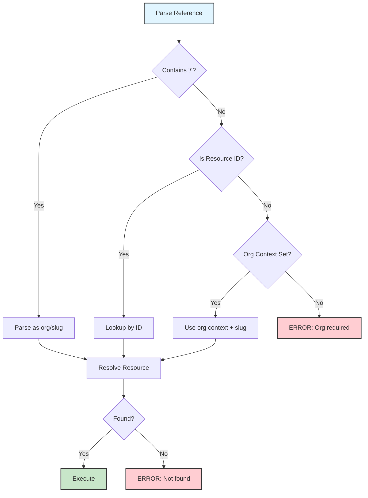

# Running Agents and Workflows

The `stigmer run` command executes agents and workflows with intelligent code synchronization and interactive discovery.

## Quick Start

**Run from your project directory:**

```bash
# Auto-discover and run (prompts if multiple resources)
stigmer run

# Run specific agent or workflow
stigmer run my-agent
stigmer run my-workflow

# Run with custom message
stigmer run my-agent --message "Process this data"
```

**The daemon starts automatically** - No need to run `stigmer server start` first!

## Two Operating Modes

### 1. Auto-Discovery Mode

**Command**: `stigmer run` (no arguments)

```bash
cd my-stigmer-project
stigmer run
```

**What happens:**
1. Checks for `Stigmer.yaml` in current directory
2. Auto-deploys agents and workflows from your code
3. Shows deployed resources
4. If multiple resources: prompts you to select
5. If single resource: auto-selects and runs
6. Streams execution logs in real-time

**Example output:**

```
✓ Loaded Stigmer.yaml
✓ Manifest loaded: 2 resource(s) discovered
✓ Deployed: 2 agent(s)

Select resource to run:
  [Agent] data-processor - Processes customer data
  [Agent] email-sender - Sends notification emails

> [Selected: data-processor]

✓ Agent execution started: data-processor

▶️  Execution started
🤖 Agent: Processing data...
🔧 Tool: query_database [Running]
✓ Done!
```

**Use cases:**
- Quick local development
- Testing changes immediately
- First-time setup with generated projects

### 2. Reference Mode

**Command**: `stigmer run <name-or-id>`

```bash
stigmer run data-processor
stigmer run wf_01xyz789
```

**What happens:**

**In project directory:**
1. Detects `Stigmer.yaml`
2. **Auto-applies latest code first** (ensures sync)
3. Resolves agent/workflow by name or ID
4. Creates execution and streams logs

**Outside project directory:**
1. Resolves agent/workflow directly (no apply)
2. Creates execution and streams logs

**Example output (in project):**

```
📁 Detected Stigmer project - applying latest code
✓ Deployed 2 resource(s)

✓ Agent execution started: data-processor

💬 You: Process recent orders
🤖 Agent: I'll fetch the recent orders from the database...
🔧 Tool: query_database [Running]
✓ Tool: query_database [Completed]
🤖 Agent: I found 23 recent orders...
✅ Execution completed

Duration: 8s
Total messages: 4
Tool calls: 1
```

**Use cases:**
- Run specific agent/workflow
- Iterative development (edit → run → test)
- Outside-project execution

## Smart Code Synchronization

**The Key Innovation:** When in a project directory, `stigmer run` always applies latest code before running.

### Why This Matters

**Before** (without smart sync):
```bash
# Edit your code
vim main.go

# Forget to apply
stigmer agent execute my-agent  # ❌ Runs old version!

# Confusion: "I changed it but it's not working"
```

**After** (with smart sync):
```bash
# Edit your code
vim main.go

# Run immediately
stigmer run my-agent  # ✅ Auto-applies, then runs latest version!
```

### Mental Model

```
Inside project directory = Development mode → Auto-apply
Outside project directory = Execution mode → No auto-apply
```

This matches natural user intent:
- **In my project** → I'm iterating on code, keep it in sync
- **Elsewhere** → I just want to run what's deployed

## Command Options

### Basic Usage

```bash
stigmer run [agent-or-workflow-name-or-id] [flags]
```

### Available Flags

| Flag | Type | Default | Description |
|------|------|---------|-------------|
| `--message` | string | `"execute"` | Initial prompt/message for execution |
| `--env` | strings | `[]` | Environment variables (repeatable, format: `KEY=VALUE`) |
| `--secret` | strings | `[]` | Secret variables (repeatable, encrypted at rest) |
| `--env-file` | strings | `[]` | Load environment variables from file (repeatable) |
| `--secret-file` | strings | `[]` | Load secrets from file (repeatable) |
| `--follow` | bool | `true` | Stream execution logs in real-time |
| `--org` | string | from config | Override organization ID |

### Examples by Flag

#### Custom Messages

Provide initial prompts for agents:

```bash
stigmer run code-reviewer --message "Review for security issues"
stigmer run data-processor --message "Process last 100 orders"
```

#### Environment Variables and Secrets

Pass configuration and secrets to your executions using inline flags or files.

**Inline environment variables:**

```bash
# Single variable
stigmer run deployer --env "REGION=us-east-1"

# Multiple variables
stigmer run deployer \
  --env "REGION=us-east-1" \
  --env "ENVIRONMENT=production"
```

**Inline secrets** (encrypted at rest):

```bash
# Single secret
stigmer run my-agent --secret "API_KEY=sk_prod_abc123"

# Multiple secrets
stigmer run deployer \
  --secret "DB_PASSWORD=supersecret" \
  --secret "API_KEY=sk_prod_abc123"
```

**Load from files:**

```bash
# Load environment variables from .env file
stigmer run my-agent --env-file .env

# Load secrets from .env.secret file
stigmer run my-agent --secret-file .env.secret

# Combine all sources
stigmer run my-agent \
  --env-file .env \
  --secret-file .env.secret \
  --env "REGION=us-west-2" \
  --secret "API_KEY=override_key"
```

**Precedence rules** (highest to lowest):

1. `--secret` flags (inline secrets)
2. `--env` flags (inline env vars)
3. `--secret-file` files (secret files)
4. `--env-file` files (env files)

Later flags override earlier ones:

```bash
# REGION will be "us-west-2" (inline flag wins)
stigmer run my-agent \
  --env-file .env \
  --env "REGION=us-west-2"
```

See [Environment Variables Guide](../guides/environment-variables.md) for complete documentation.

#### Log Streaming Control

**Stream logs** (default):

```bash
stigmer run my-agent
# Streams logs in real-time until completion
```

**No streaming** (background execution):

```bash
stigmer run my-agent --no-follow
# Returns immediately with execution ID
# View logs: stigmer run my-agent --follow
```

#### Organization Override

Use specific organization:

```bash
stigmer run my-agent --org org-abc123
```

## Advanced Usage

### Run by ID

Use resource IDs for precise targeting:

```bash
# Agent by ID
stigmer run agt_01abc123xyz

# Workflow by ID
stigmer run wf_01xyz789def
```

### Run Workflows

Works identically for workflows:

```bash
stigmer run customer-onboarding
stigmer run customer-onboarding --message "New customer: john@example.com"
```

Workflows are checked **first**, then agents. This means if you have both a workflow and an agent with the same name, the workflow takes precedence.

### Workflow Execution Output

```bash
stigmer run customer-onboarding --message "New customer: john@example.com"

# Output:
▶️  Execution started
⚙️ Task: validate_email [Running]
✓ Task: validate_email [Completed]
⚙️ Task: create_account [Running]
✓ Task: create_account [Completed]
⚙️ Task: send_welcome_email [Running]
✓ Task: send_welcome_email [Completed]
✅ Execution completed

Duration: 3s
Total tasks: 3
Completed: 3
```

## Resource References

Stigmer supports multiple ways to reference agents and workflows using the `org/slug` model.

### Explicit org/slug Format

The most portable and clear way to reference resources:

```bash
# Agent from stigmer org
stigmer run stigmer/code-reviewer

# Agent from custom org
stigmer run acme-corp/deploy-agent

# Workflow with org
stigmer run my-team/ci-pipeline
```

**Benefits:**
- ✅ Works across all environments (local, cloud, self-hosted)
- ✅ Clear ownership (shows which org owns the resource)
- ✅ No ambiguity

### Slug-Only (Context-Based)

When you have an organization context set, you can use slug-only references:

```bash
# Uses current org from context
stigmer run code-reviewer

# Equivalent to: stigmer run <current-org>/code-reviewer
```

**When to use:**
- Inside a project with configured org
- Quick local development
- Current org is obvious from context

**Limitations:**
- Requires organization context
- Less portable (depends on current config)

### Resource IDs

Use resource IDs for precise, immutable references:

```bash
# Agent by ID
stigmer run agt_01abc123xyz

# Workflow by ID
stigmer run wf_01xyz789def

# Execution by ID (to view logs)
stigmer run agtexec_01def456ghi --follow
```

**ID prefixes:**
- `agt_` - Agent
- `wf_` - Workflow
- `agtexec_` - Agent Execution
- `wfexec_` - Workflow Execution
- `skill_` - Skill
- `mcp-` - MCP Server (or UUID format)

**When to use:**
- Scripts and automation (immutable references)
- Cross-org references
- Debugging specific executions

### Reference Resolution Order

When you run `stigmer run <reference>`:



### Examples by Reference Type

**Platform resources (stigmer org):**
```bash
# Explicit org/slug
stigmer run stigmer/code-reviewer

# Slug-only (if org context is 'stigmer')
stigmer run code-reviewer
```

**Organization resources:**
```bash
# Explicit org/slug (recommended)
stigmer run acme-corp/deploy-pipeline

# Slug-only (if current org is 'acme-corp')
stigmer run deploy-pipeline
```

**Cross-organization references:**
```bash
# Reference resources from different orgs
stigmer run stigmer/base-agent
stigmer run acme-corp/custom-agent
stigmer run partner-org/integration-workflow
```

### Best Practices

**1. Use explicit org/slug in shared/production code:**
```bash
# ✅ Good - portable
stigmer run stigmer/code-reviewer

# ⚠️ Avoid - depends on context
stigmer run code-reviewer
```

**2. Use IDs for automation:**
```bash
#!/bin/bash
# ✅ Good - immutable reference
AGENT_ID="agt_01abc123xyz"
stigmer run $AGENT_ID
```

**3. Set org context for local development:**
```bash
# Set default org
stigmer config context set --org acme-corp

# Now slug-only works
stigmer run deploy-pipeline  # → acme-corp/deploy-pipeline
```

## Error Handling

### Not in Project Directory

```bash
$ stigmer run

Error: No Stigmer.yaml found in current directory

Either:
  • Run from a Stigmer project directory
  • Or specify agent/workflow: stigmer run <name-or-id>
```

**Solution**: Navigate to your project directory or specify resource name.

### Resource Not Found

```bash
$ stigmer run nonexistent-agent

Error: Agent or Workflow not found: nonexistent-agent

Checked for:
  • Workflow with ID/name: nonexistent-agent
  • Agent with ID/name: nonexistent-agent

Possible reasons:
  • Resource doesn't exist in organization
  • Resource hasn't been deployed yet (run: stigmer apply)
  • Wrong organization context
```

**Solutions:**
- Check resource name spelling
- Run `stigmer apply` to deploy resources
- Verify organization context: `stigmer config context show`

### Invalid Runtime Environment

```bash
$ stigmer run my-agent --runtime-env "INVALID"

Error: Invalid runtime environment format: INVALID (expected key=value)
```

**Solution**: Use `key=value` format or `secret:key=value` for secrets.

## Development Workflow

### Typical Iteration Loop

```bash
# Create project
stigmer new my-agent
cd my-agent

# Edit your code
vim main.go

# Run (auto-deploys and executes)
stigmer run

# Edit again
vim main.go

# Run again (auto-deploys updates)
stigmer run

# Repeat!
```

**No manual `stigmer apply` needed** - The run command handles it automatically when in project directory.

### When to Use `stigmer apply` vs `stigmer run`

**Use `stigmer apply`:**
- Deploy without executing
- Validate with `--dry-run`
- Update multiple resources
- CI/CD pipelines

**Use `stigmer run`:**
- Quick local testing
- Iterative development
- Immediate execution
- Interactive debugging

## Comparison with Other Commands

### vs `stigmer apply`

| Command | Purpose | Execution |
|---------|---------|-----------|
| `stigmer apply` | Deploy resources | No execution |
| `stigmer run` | Deploy + Execute | Creates execution |

**When to use:**
- `apply`: CI/CD, batch deployments, validation
- `run`: Local development, testing, debugging

### vs Legacy Execution

**Before** (multiple steps):
```bash
stigmer apply                          # Step 1: Deploy
stigmer agent execute my-agent "msg"  # Step 2: Execute
```

**After** (single step):
```bash
stigmer run my-agent --message "msg"  # Combined!
```

## Log Streaming

### Real-Time Output

The `--follow` flag (default: true) streams execution logs:

**Agent logs:**
- Phase changes (PENDING → IN_PROGRESS → COMPLETED)
- User and AI messages
- Tool invocations with status
- Execution summary

**Workflow logs:**
- Phase changes
- Task progress (PENDING → IN_PROGRESS → COMPLETED)
- Task results and errors
- Execution summary

### Example: Agent Execution

```
▶️  Execution started

💬 You: Analyze sales data
🤖 Agent: I'll analyze the sales data from the database...
🔧 Tool: query_database [Running]
✓ Tool: query_database [Completed]
🤖 Agent: Based on the data, I found:
  - Total sales: $125,000
  - Top product: Widget Pro ($45,000)
  - Growth rate: +15% vs last month
✅ Execution completed

Duration: 12s
Total messages: 4
Tool calls: 1
```

### Example: Workflow Execution

```
▶️  Execution started

⚙️ Task: validate_email [Running]
✓ Task: validate_email [Completed]

⚙️ Task: create_account [Running]
✓ Task: create_account [Completed]

⚙️ Task: send_welcome_email [Running]
✓ Task: send_welcome_email [Completed]

✅ Execution completed

Duration: 3s
Total tasks: 3
Completed: 3
```

## Troubleshooting

### Daemon Not Running

**Symptom:**
```
Error: Failed to connect to backend
```

**Solution:** The daemon should auto-start, but if issues persist:

```bash
stigmer server start
```

### Stale Code Running

**Symptom:** Changes not reflected in execution

**Cause:** Running outside project directory

**Solution:** Run from project directory:

```bash
cd /path/to/my-project
stigmer run my-agent
```

### Wrong Organization

**Symptom:** Resources not found

**Solution:** Check organization context:

```bash
stigmer config context show
stigmer config context set --org <org-id>

# Or override per-command
stigmer run my-agent --org <org-id>
```

## Tips and Best Practices

### 1. Use Auto-Discovery for Local Development

```bash
cd my-project
stigmer run  # Let it discover and prompt
```

Fastest way to test changes.

### 2. Name Resources by Purpose

```bash
# Good - clear purpose
stigmer run pr-reviewer
stigmer run customer-onboarding

# Less clear
stigmer run agent-1
stigmer run workflow-2
```

### 3. Use Runtime Environment for Configuration

```bash
# Don't hardcode configuration in code
stigmer run deployer --runtime-env "REGION=us-west-2"

# Agent can reference: ${env.REGION}
```

### 4. Stream Logs for Debugging

```bash
# Always stream during development
stigmer run my-agent

# Only use --no-follow for fire-and-forget
stigmer run background-job --no-follow
```

### 5. Use Messages for Context

```bash
# Good - provides context
stigmer run pr-reviewer --message "Review PR #123 for security issues"

# Less helpful
stigmer run pr-reviewer
```

## Next Steps

- [Deploying with Apply](../guides/deploying-with-apply.md) - Complete apply command documentation
- [Local Mode](../getting-started/local-mode.md) - Getting started with Stigmer
- [Backend Modes](../architecture/backend-modes.md) - Understanding local vs cloud backends
- [CLI Configuration](configuration.md) - CLI configuration and context management

---

**Remember**: In your project directory, `stigmer run` keeps your code and deployed resources in sync automatically. It's the fastest way to iterate on agents and workflows locally.
