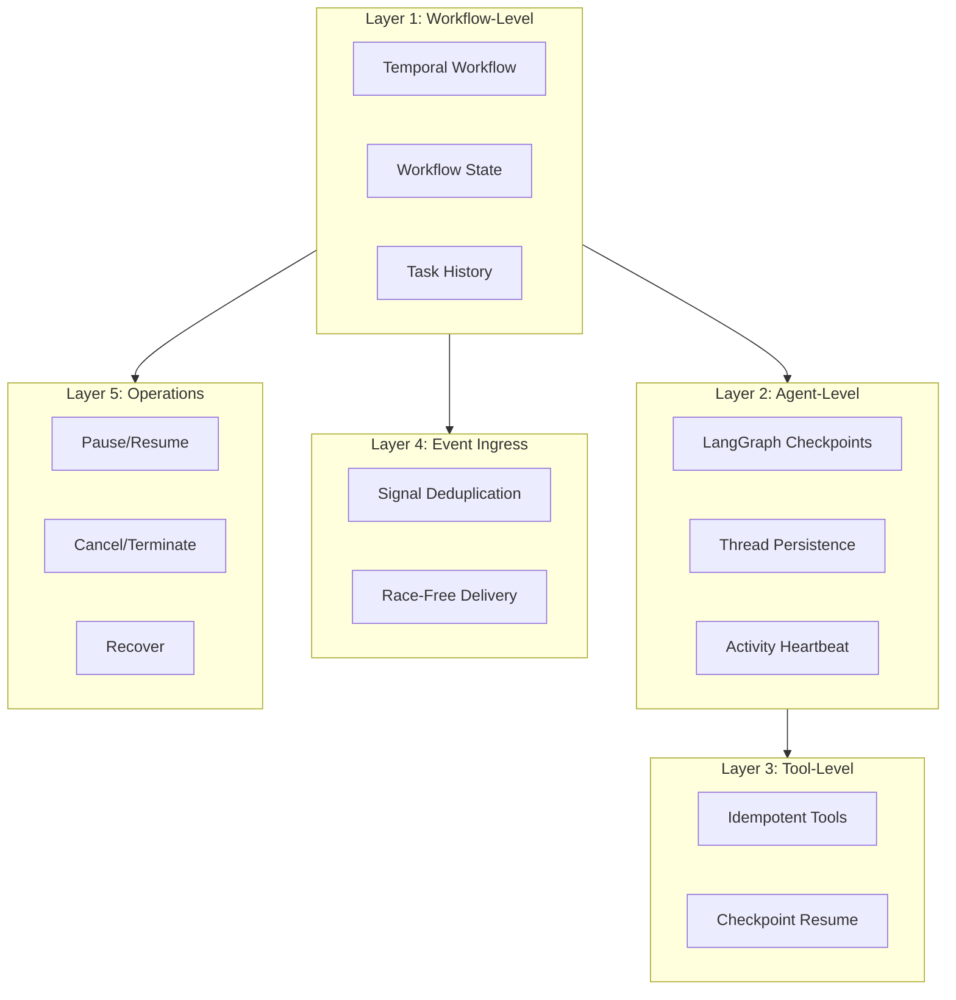
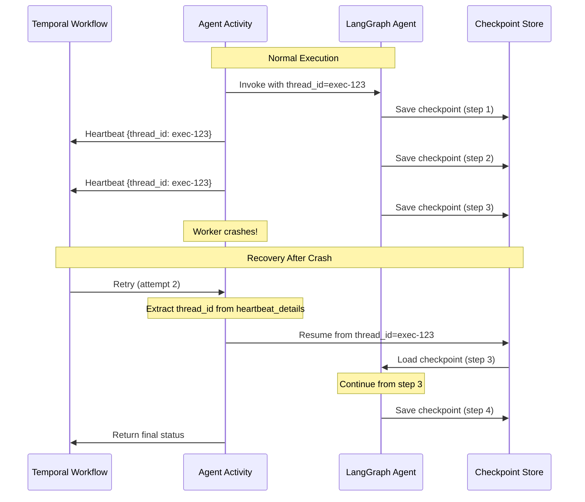
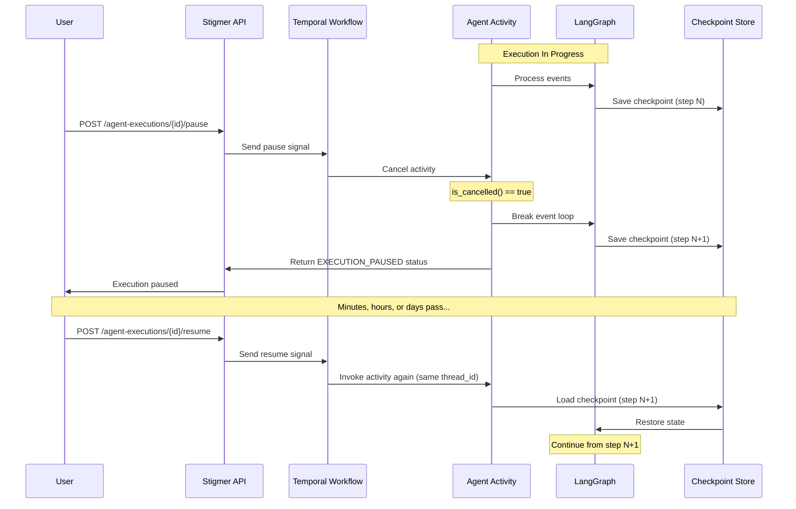

# Durable Execution

## Overview

Stigmer provides comprehensive durability guarantees for agentic workflows, ensuring that agent tasks can survive crashes, network failures, worker restarts, and long pauses. When you start an agentic workflow in Stigmer, you can walk away for weeks and it will resume exactly where it left off—even after crashes or deploys.

This guide explains how Stigmer's durability layers work together to provide reliable, long-running agent execution.

## The Five Durability Layers

Stigmer implements durability at five distinct layers:



### Layer 1: Workflow-Level Durability

**Temporal Workflow Orchestration** provides the foundation:
- Workflow state persisted to durable storage (PostgreSQL/MongoDB)
- Task history preserved across worker restarts
- Automatic retries for failed activities
- Timeline tracking for observability

### Layer 2: Agent-Level Durability

**LangGraph Checkpointing** enables crash recovery for AI agents:
- Automatic state snapshots after each agent step
- Thread-based checkpoint identification
- Resume from last checkpoint on retry
- Conversation history preservation

### Layer 3: Tool-Level Durability

**Idempotent Tool Execution** prevents duplicate side effects:
- Tools designed with idempotency in mind
- Checkpoint-based recovery avoids re-execution
- LangGraph tracks tool invocations in checkpoint

### Layer 4: Event Ingress Durability

**Signal Deduplication** prevents duplicate event processing:
- 24-hour idempotency window
- Per-organization key scoping
- Race-free event delivery via signal-with-start

### Layer 5: Operations-Level Durability

**Lifecycle Operations** enable user control:
- Pause/resume with checkpoint preservation
- Cancel/terminate for cleanup
- Recover for retry after failure

## How Crash Recovery Works

When an agent execution crashes (worker crash, OOM, network failure), Stigmer automatically recovers using a combination of Temporal retries and LangGraph checkpoints.

### The Recovery Flow



### Key Mechanisms

#### 1. Activity Heartbeat with Thread ID

The Python activity sends heartbeats every 2 seconds containing the LangGraph thread ID:

```python
# From execute_graphton.py (lines 1152-1160)
activity.heartbeat({
    "thread_id": thread_id,  # For checkpoint resume on retry
    "paused": activity.is_cancelled(),
    "events_processed": events_processed,
    "messages": len(status_builder.current_status.messages),
    "tool_calls": len(status_builder.current_status.tool_calls),
    "phase": status_builder.current_status.phase,
})
```

#### 2. Retry Detection and Resume

On retry (attempt > 1), the activity extracts the thread ID from the last heartbeat:

```python
# From execute_graphton.py (lines 225-243)
attempt = activity.info().attempt
heartbeat_details = activity.info().heartbeat_details
is_retry = attempt > 1 and heartbeat_details is not None

if is_retry:
    # Extract thread_id from last heartbeat for checkpoint resume
    last_heartbeat = heartbeat_details[0] if isinstance(heartbeat_details, (list, tuple)) else heartbeat_details
    
    if isinstance(last_heartbeat, dict) and "thread_id" in last_heartbeat:
        resume_thread_id = last_heartbeat["thread_id"]
        activity_logger.info(
            f"🔄 RETRY DETECTED: attempt={attempt}, "
            f"resuming from checkpoint with thread_id={resume_thread_id}"
        )
        # Override thread_id with the one from heartbeat for checkpoint resume
        thread_id = resume_thread_id
```

#### 3. LangGraph Automatic Checkpoint Loading

When invoked with the same `thread_id`, LangGraph automatically loads the checkpoint:

```python
# From execute_graphton.py (lines 988-994)
config = {
    "configurable": {
        "thread_id": thread_id,  # LangGraph loads checkpoint via this thread_id
        "org": execution.metadata.org,
    }
}
```

LangGraph's checkpoint system:
- Saves state after every agent step
- Persists to MongoDB (cloud mode) or SQLite (local mode)
- Includes messages, tool calls, and agent internal state
- No data loss between checkpoints

#### 4. Temporal Activity Retries

The Temporal workflow is configured to retry activities on failure:

```java
// From InvokeAgentExecutionWorkflowImpl.java
ActivityOptions activityOptions = ActivityOptions.newBuilder()
    .setScheduleToCloseTimeout(Duration.ofHours(24))
    .setStartToCloseTimeout(Duration.ofHours(24))
    .setHeartbeatTimeout(Duration.ofSeconds(30))
    .setRetryOptions(RetryOptions.newBuilder()
        .setMaximumAttempts(3)  // Up to 3 attempts
        .setInitialInterval(Duration.ofSeconds(10))
        .setBackoffCoefficient(2.0)
        .setMaximumInterval(Duration.ofMinutes(1))
        .build())
    .build();
```

**Retry behavior:**
- **Attempt 1**: Initial execution
- **Attempt 2**: After 10 seconds (on crash/failure)
- **Attempt 3**: After 20 seconds (on second crash/failure)

## Pause and Resume

Stigmer supports graceful pause and resume of agent executions with full checkpoint preservation.

### How Pause Works



### Checkpoint Preservation

LangGraph automatically saves checkpoints when the activity is cancelled:

```python
# From execute_graphton.py (lines 1126-1134)
if activity.is_cancelled():
    activity_logger.info(
        f"⏸️ PAUSE: Activity cancelled for execution {execution_id}, "
        f"saving checkpoint (thread_id={thread_id})"
    )
    # LangGraph automatically saves checkpoint on iteration
    # Raise CancelledError to exit the loop gracefully
    raise asyncio.CancelledError("Paused by user")
```

The checkpoint includes:
- All messages (user, assistant, tool responses)
- Tool call history
- Agent internal state
- Subagent execution state

### Resume Behavior

On resume:
1. Workflow receives resume signal
2. Workflow re-invokes the activity with the same `thread_id`
3. Activity loads checkpoint via `thread_id`
4. LangGraph restores full state
5. Agent continues from the exact point where it was paused

**Important**: No work is lost. The agent resumes mid-conversation, mid-tool-call, or mid-reasoning.

## Comparison with Traditional Approaches

### Without Durability

```python
# Traditional approach: No crash recovery
def run_agent(prompt):
    response = llm.invoke(prompt)  # If this crashes, start over
    result = tool.execute(response)  # If this crashes, start over
    return result
```

**Problems:**
- Crashes lose all progress
- Tool side effects may duplicate
- Long-running tasks risk timeout
- No pause/resume capability

### With Stigmer Durability

```python
# Stigmer approach: Fully durable
def run_agent(prompt, thread_id):
    # Checkpoint loaded automatically if thread_id exists
    agent = create_agent(checkpointer=checkpointer)
    
    for event in agent.stream(prompt, thread_id=thread_id):
        # Checkpoint saved after every step
        process_event(event)
        
        # Heartbeat sent to Temporal
        activity.heartbeat({"thread_id": thread_id})
```

**Benefits:**
- Crashes resume from last checkpoint
- Tools run once (idempotent via checkpoint)
- Can run for days/weeks
- Pause/resume anytime

## Configuration

### Checkpoint Storage

Stigmer uses different checkpoint storage backends based on deployment mode:

| Mode | Storage | Persistence | Multi-Worker Safe |
|------|---------|-------------|-------------------|
| Local | SQLite | Persistent | No (single worker) |
| Cloud | MongoDB | Persistent | Yes (distributed) |
| Dev | MemorySaver | Ephemeral | No (in-memory) |

**Configured via:**

```bash
# worker/config.py
CHECKPOINTER_TYPE=mongodb  # or sqlite, or memory
CHECKPOINTER_MONGODB_URL=mongodb://...  # if mongodb
CHECKPOINTER_SQLITE_PATH=/data/checkpoints.db  # if sqlite
```

### Retry Configuration

Temporal activity retries are configured in the Java workflow:

```java
.setRetryOptions(RetryOptions.newBuilder()
    .setMaximumAttempts(3)  // Total attempts
    .setInitialInterval(Duration.ofSeconds(10))  // First retry after 10s
    .setBackoffCoefficient(2.0)  // Exponential backoff
    .setMaximumInterval(Duration.ofMinutes(1))  // Cap at 1 minute
    .build())
```

## Best Practices

### 1. Design Tools for Idempotency

While LangGraph checkpoints prevent most duplicate execution, design tools to be idempotent:

```python
# Good: Idempotent file write
def write_file(path, content):
    with open(path, 'w') as f:
        f.write(content)  # Safe to call multiple times

# Good: Idempotent API call with idempotency key
def create_resource(data, idempotency_key):
    return api.create(data, headers={"Idempotency-Key": idempotency_key})
```

### 2. Use Heartbeats for Long-Running Operations

Send heartbeats during long-running tool calls to prevent Temporal timeouts:

```python
# In a custom tool
def long_running_tool():
    for i in range(100):
        do_work(i)
        if i % 10 == 0:
            activity.heartbeat({"progress": i})
```

### 3. Monitor Checkpoint Storage

Monitor checkpoint storage size, especially with long conversations:

```bash
# MongoDB (cloud mode)
db.checkpoints.stats()

# SQLite (local mode)
du -h /data/checkpoints.db
```

### 4. Test Crash Recovery

Simulate crashes to verify recovery behavior:

```bash
# Start an agent execution
stigmer agent exec "Long running task..."

# Kill the worker mid-execution
docker kill agent-runner

# Restart worker
docker start agent-runner

# Verify execution resumes from checkpoint
stigmer agent exec status <execution-id>
```

## Limitations and Edge Cases

### 1. Gap Between Checkpoints

There is a small window between checkpoint saves where progress could be lost:

```
[Step N] → [Checkpoint Save] → [Step N+1] → [CRASH before checkpoint]
                                   ↑
                                   Lost
```

**Mitigation**: LangGraph saves checkpoints frequently (after every agent step). The risk window is typically < 1 second.

### 2. Non-Idempotent External Systems

If a tool calls a non-idempotent external API and crashes before the checkpoint is saved, the call may duplicate on retry:

```
[Tool Call] → [API Request] → [CRASH before checkpoint save]
                 ↑
                 May duplicate on retry
```

**Mitigation**: Use idempotency keys when calling external APIs.

### 3. Checkpoint Storage Limits

Very long conversations can accumulate large checkpoints:

- MongoDB document limit: 16 MB
- SQLite row limit: 1 GB (practical limit much lower)

**Mitigation**: Use Stigmer's automatic context summarization to keep checkpoint size manageable.

## Related Documentation

- [Workflow Execution Lifecycle](../architecture/workflow-execution-lifecycle.md) - Phases and state transitions
- [Temporal Integration](../architecture/temporal-integration.md) - Temporal workflow architecture
- [Agent Execution Lifecycle](../architecture/agent-execution-lifecycle.md) - Agent-specific lifecycle operations
- [Event Deduplication](event-deduplication.md) - Idempotent signal delivery

## References

- **LangGraph Checkpointing**: [LangGraph Persistence Docs](https://langchain-ai.github.io/langgraph/concepts/persistence/)
- **Temporal Activity Retries**: [Temporal Retry Policies](https://docs.temporal.io/activities#retries)
- **Idempotency Patterns**: [Stripe API Idempotency](https://stripe.com/docs/api/idempotent_requests)
