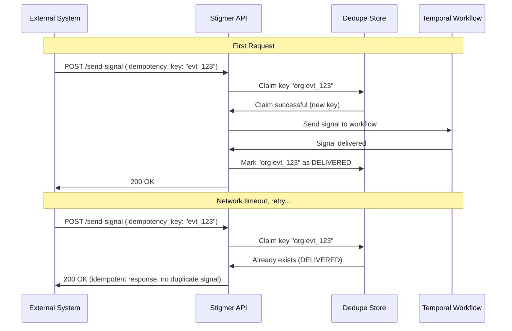

# Event Deduplication

## Overview

Event deduplication prevents duplicate signal delivery when external events (webhooks, API callbacks) are retried. When you send a signal to a workflow execution with an idempotency key, Stigmer guarantees the signal will be delivered exactly once, even if the request is retried multiple times.

This guide explains how event deduplication works, how to use idempotency keys, and best practices for integrating with external systems.

## The Problem: Duplicate Event Delivery

External systems often retry requests on network failures or timeouts:

```
External System → Stigmer API
    └─ Send signal "payment.completed"
    └─ Network timeout (no response received)
    └─ Retry: Send signal "payment.completed" again
    └─ Result: Workflow receives the SAME event twice
```

**Without deduplication:**
- Workflows process the same event multiple times
- Side effects duplicate (charge customer twice, send email twice)
- Data corruption from duplicate processing
- Manual cleanup required

**With deduplication:**
- First request is processed normally
- Retry is detected and returns success immediately
- Workflow receives the event exactly once
- No duplicate side effects

## How It Works

Stigmer uses a 24-hour idempotency window with per-organization key scoping:



### Key Mechanisms

#### 1. Idempotency Key Claim

Before sending the signal, Stigmer claims the idempotency key:

```java
// From WorkflowExecutionSendSignalHandler.java (DedupeClaimStep)
SignalDedupeRecord record = SignalDedupeRecord.builder()
    .id(SignalDedupeRecord.buildId(org, idempotencyKey))
    .org(org)
    .idempotencyKey(idempotencyKey)
    .executionId(executionId)
    .signalName(signalName)
    .status(SignalDedupeStatus.CLAIMED)
    .createdAt(now)
    .expiresAt(now.plus(24, ChronoUnit.HOURS))  // 24-hour TTL
    .build();

// Try to insert (fails if key already exists)
boolean claimed = dedupeStore.tryClaim(record);
```

#### 2. Signal Delivery

If the claim succeeds, the signal is sent to the Temporal workflow:

```java
// Send signal using Temporal's SignalWithStart API
workflowCreator.signalWithStart(
    executionId,
    signalName,
    payload,
    workflowDefinitionId
);
```

#### 3. Delivery Confirmation

After successful delivery, mark the key as DELIVERED:

```java
dedupeStore.markDelivered(
    org,
    idempotencyKey,
    Instant.now()
);
```

#### 4. Automatic Cleanup

MongoDB's TTL index automatically removes expired records after 24 hours:

```java
@Indexed(expireAfterSeconds = 0)
private Instant expiresAt;  // TTL index ensures automatic cleanup
```

## Using Idempotency Keys

### API Usage

When sending a signal to a workflow execution, include an `idempotency_key`:

```protobuf
message SendSignalInput {
  string execution_id = 1;      // Target workflow execution
  string signal_name = 2;       // Signal name (e.g., "approval.granted")
  string payload = 3;           // Optional JSON payload
  string idempotency_key = 4;   // Optional idempotency key for deduplication
}
```

**Example gRPC request:**

```go
// Go SDK usage
_, err := client.SendSignal(ctx, &workflowexecution.SendSignalInput{
    ExecutionId:    "wf-exec-123",
    SignalName:     "payment.completed",
    Payload:        `{"amount": 100, "currency": "USD"}`,
    IdempotencyKey: "stripe_evt_1abc234",  // Stripe event ID
})
```

### CLI Usage

```bash
stigmer workflow signal send \
  --execution-id wf-exec-123 \
  --signal-name payment.completed \
  --payload '{"amount": 100}' \
  --idempotency-key stripe_evt_1abc234
```

### Idempotency Key Format Recommendations

#### 1. External Event IDs

Use the event ID from the external system:

```
stripe_evt_1abc234
github_webhook_456789
salesforce_cdc_xyz123
```

**Benefits:**
- Natural uniqueness (external system guarantees)
- Easy to correlate with source system
- Simple debugging and audit trails

#### 2. Composite Keys

Combine multiple identifiers for uniqueness:

```
{source}:{event_type}:{event_id}
webhook:payment.completed:evt_123
api:approval:req_456
```

**Benefits:**
- Clear provenance (which system, which event type)
- Namespace isolation (different sources won't collide)
- Self-documenting keys

#### 3. Client-Generated UUIDs

Generate a UUID on the client side:

```
550e8400-e29b-41d4-a716-446655440000
```

**Benefits:**
- Guaranteed uniqueness across all sources
- No coordination required
- Standard format (UUID v4)

## Key Scoping and TTL

### Per-Organization Scoping

Idempotency keys are scoped per organization to prevent cross-org collisions:

```java
// Composite ID: "{org}:{idempotency_key}"
String id = SignalDedupeRecord.buildId(org, idempotencyKey);
// Example: "acme-corp:stripe_evt_123"
```

**Why per-org scoping?**
- Different organizations can use the same external event IDs
- Prevents accidental cross-org deduplication
- Aligns with multi-tenant architecture

### 24-Hour TTL Window

Dedupe records expire after 24 hours:

```java
.expiresAt(now.plus(24, ChronoUnit.HOURS))  // 24-hour TTL
```

**Why 24 hours?**
- Industry standard (Stripe, GitHub, Twilio use 24 hours)
- Balances safety vs storage cost
- Handles realistic retry windows
- After 24 hours, same key can be reused for new events

**Storage implications:**
- High-volume systems: Monitor MongoDB collection size
- Automatic cleanup via TTL index (no manual intervention)
- Expired records removed within ~60 seconds of expiration

## Integration Patterns

### Pattern 1: Webhook Integration

External system sends webhooks, use webhook event ID as idempotency key:

```go
// Webhook handler
func handleStripeWebhook(w http.ResponseWriter, r *http.Request) {
    event := parseStripeEvent(r.Body)
    
    // Use Stripe event ID as idempotency key
    _, err := stigmerClient.SendSignal(ctx, &workflowexecution.SendSignalInput{
        ExecutionId:    getWorkflowExecutionId(event.CustomerId),
        SignalName:     "payment.completed",
        Payload:        event.ToJSON(),
        IdempotencyKey: event.Id,  // "evt_1abc234"
    })
    
    if err != nil {
        // Log error, but don't fail the webhook
        // Stripe will retry, and deduplication will prevent duplicates
        log.Error("Failed to send signal: %v", err)
        w.WriteHeader(500)
        return
    }
    
    w.WriteHeader(200)
}
```

### Pattern 2: API Callback Integration

External API calls back with a correlation ID:

```go
// Callback handler
func handleApiCallback(w http.ResponseWriter, r *http.Request) {
    var callback Callback
    json.NewDecoder(r.Body).Decode(&callback)
    
    // Use correlation ID + timestamp for idempotency
    idempotencyKey := fmt.Sprintf("%s:%s", callback.CorrelationId, callback.Timestamp)
    
    _, err := stigmerClient.SendSignal(ctx, &workflowexecution.SendSignalInput{
        ExecutionId:    callback.WorkflowExecutionId,
        SignalName:     "external.approval.granted",
        Payload:        callback.ToJSON(),
        IdempotencyKey: idempotencyKey,
    })
    
    w.WriteHeader(200)
}
```

### Pattern 3: Client-Side Retry Logic

Client generates UUID and retries with same key:

```go
func sendSignalWithRetry(client *StigmerClient, signal *Signal) error {
    // Generate UUID once for all retries
    idempotencyKey := uuid.New().String()
    
    // Retry with exponential backoff
    for attempt := 1; attempt <= 3; attempt++ {
        _, err := client.SendSignal(ctx, &workflowexecution.SendSignalInput{
            ExecutionId:    signal.ExecutionId,
            SignalName:     signal.Name,
            Payload:        signal.Payload,
            IdempotencyKey: idempotencyKey,  // Same key for all retries
        })
        
        if err == nil {
            return nil  // Success
        }
        
        // Backoff: 1s, 2s, 4s
        time.Sleep(time.Duration(1<<uint(attempt-1)) * time.Second)
    }
    
    return errors.New("all retries exhausted")
}
```

## Error Handling

### Duplicate Detection Response

When a duplicate is detected, Stigmer returns success (not an error):

```
Request 1: POST /send-signal (key: evt_123) → 200 OK (signal delivered)
Request 2: POST /send-signal (key: evt_123) → 200 OK (duplicate, idempotent)
```

**Why return success?**
- Idempotent behavior: From caller's perspective, the desired state is achieved
- Simplifies client logic: No need to handle "already processed" errors
- Matches industry standards (Stripe, GitHub, AWS)

### Optional Idempotency Keys

Idempotency keys are optional:

```go
// Without idempotency key (no deduplication)
_, err := client.SendSignal(ctx, &workflowexecution.SendSignalInput{
    ExecutionId: "wf-exec-123",
    SignalName:  "manual.trigger",
    // No IdempotencyKey - signal will be delivered every time
})
```

**When to omit:**
- Signals triggered by internal workflows (already idempotent)
- One-time manual operations
- Systems where deduplication is handled elsewhere

### Graceful Degradation

Deduplication failures don't block signal delivery:

```java
// If dedupe store is unavailable, log warning and continue
if (!claimed && dedupeStore.isAvailable()) {
    log.warn("Duplicate signal detected: key={}", idempotencyKey);
    return alreadyDeliveredResponse();
}

// If dedupe store is down, continue without deduplication
log.warn("Dedupe store unavailable, proceeding without deduplication");
// Continue to SendSignalToTemporalWorkflowStep...
```

## Storage Backend

### MongoDB (Cloud Mode)

```java
@Document(collection = "signal_dedupe")
public class SignalDedupeRecord {
    @Id
    private String id;  // Composite: "{org}:{idempotency_key}"
    
    @Indexed
    private String org;
    
    private String idempotencyKey;
    private String executionId;
    private String signalName;
    private SignalDedupeStatus status;
    private Instant createdAt;
    private Instant deliveredAt;
    
    @Indexed(expireAfterSeconds = 0)
    private Instant expiresAt;  // TTL index for automatic cleanup
}
```

**Configuration:**

```yaml
# application.yaml
spring:
  data:
    mongodb:
      uri: mongodb://localhost:27017/stigmer
      database: stigmer
```

### SQLite (Local Mode)

```go
// Go implementation for local development
type SignalDedupeStore struct {
    db *sql.DB
}

func (s *SignalDedupeStore) TryClaim(record *SignalDedupeRecord) (bool, error) {
    query := `
        INSERT INTO signal_dedupe (id, org, idempotency_key, execution_id, signal_name, status, created_at, expires_at)
        VALUES (?, ?, ?, ?, ?, ?, ?, ?)
        ON CONFLICT(id) DO NOTHING
    `
    result, err := s.db.Exec(query, record.ID, record.Org, ...)
    
    rowsAffected, _ := result.RowsAffected()
    return rowsAffected > 0, nil  // true if new record inserted
}
```

## Monitoring and Observability

### Key Metrics

Track these metrics for deduplication health:

| Metric | Description | Alert Threshold |
|--------|-------------|-----------------|
| `dedupe_claims_total` | Total claim attempts | - |
| `dedupe_duplicates_total` | Duplicate signals detected | - |
| `dedupe_duplicate_rate` | Duplicates / Total claims | > 50% |
| `dedupe_store_errors_total` | Dedupe store failures | > 1% |
| `dedupe_records_count` | Current dedupe records | > 100k |

### Logging

Dedupe operations are logged at different levels:

```
INFO  - New signal claim: key=stripe_evt_123, execution=wf-123
WARN  - Duplicate signal detected: key=stripe_evt_123, status=DELIVERED
ERROR - Dedupe store unavailable, proceeding without deduplication
```

### MongoDB Queries

**Check for duplicates:**

```javascript
db.signal_dedupe.find({
  org: "acme-corp",
  status: "DELIVERED"
}).sort({createdAt: -1}).limit(10)
```

**Count by status:**

```javascript
db.signal_dedupe.aggregate([
  { $group: { _id: "$status", count: { $sum: 1 } } }
])
```

**Find expired records (should auto-cleanup):**

```javascript
db.signal_dedupe.find({
  expiresAt: { $lt: new Date() }
})
```

## Best Practices

### 1. Always Use Idempotency Keys for External Events

```go
// Good: Webhook with idempotency key
stigmerClient.SendSignal(ctx, &workflowexecution.SendSignalInput{
    ExecutionId:    "wf-123",
    SignalName:     "payment.completed",
    IdempotencyKey: event.Id,  // ✅ Protected from duplicates
})

// Bad: Webhook without idempotency key
stigmerClient.SendSignal(ctx, &workflowexecution.SendSignalInput{
    ExecutionId: "wf-123",
    SignalName:  "payment.completed",
    // ❌ No protection - webhook retries will duplicate
})
```

### 2. Use External Event IDs When Available

```go
// Good: Use Stripe event ID
IdempotencyKey: stripeEvent.Id  // "evt_1abc234"

// Avoid: Client-generated UUIDs when external ID exists
IdempotencyKey: uuid.New().String()  // Loses correlation with source
```

### 3. Handle Deduplication Gracefully

```go
// Signal sending is idempotent - retry safely
err := sendSignal(client, signal)
if err != nil {
    // Safe to retry with same idempotency key
    time.Sleep(1 * time.Second)
    err = sendSignal(client, signal)
}
```

### 4. Monitor Duplicate Rates

```
High duplicate rate (> 50%) may indicate:
- External system is retrying aggressively
- Network instability
- Client-side retry bugs
- Misconfigured timeouts
```

### 5. Test Duplicate Scenarios

```go
// Test: Verify duplicate detection
func TestSignalDeduplication(t *testing.T) {
    idempotencyKey := "test_evt_123"
    
    // First request - should succeed
    err := client.SendSignal(ctx, &workflowexecution.SendSignalInput{
        ExecutionId:    "wf-123",
        SignalName:     "test.signal",
        IdempotencyKey: idempotencyKey,
    })
    require.NoError(t, err)
    
    // Second request with same key - should succeed (idempotent)
    err = client.SendSignal(ctx, &workflowexecution.SendSignalInput{
        ExecutionId:    "wf-123",
        SignalName:     "test.signal",
        IdempotencyKey: idempotencyKey,
    })
    require.NoError(t, err)
    
    // Verify workflow received signal only once
    assertSignalCount(t, "wf-123", "test.signal", 1)
}
```

## Comparison with Industry Standards

| Platform | TTL Window | Scoping | Storage |
|----------|------------|---------|---------|
| **Stigmer** | 24 hours | Per-organization | MongoDB/SQLite |
| **Stripe** | 24 hours | Per-account | Internal |
| **GitHub** | 24 hours | Global | Internal |
| **Twilio** | 24 hours | Per-account | Internal |
| **AWS EventBridge** | 24 hours | Per-region | Internal |

Stigmer follows industry standards while adding per-organization scoping for multi-tenant safety.

## Related Documentation

- [Durable Execution](durable-execution.md) - Crash recovery and checkpoint preservation
- [Workflow Execution Lifecycle](../architecture/workflow-execution-lifecycle.md) - Workflow phases and state transitions
- [Temporal Integration](../architecture/temporal-integration.md) - Temporal workflow architecture

## References

- **Stripe API Idempotency**: [Stripe Docs](https://stripe.com/docs/api/idempotent_requests)
- **GitHub Webhook Deduplication**: [GitHub Docs](https://docs.github.com/en/webhooks/using-webhooks/best-practices-for-using-webhooks)
- **MongoDB TTL Indexes**: [MongoDB Docs](https://www.mongodb.com/docs/manual/core/index-ttl/)
- **RFC 4122 (UUID)**: [IETF RFC](https://www.rfc-editor.org/rfc/rfc4122)
