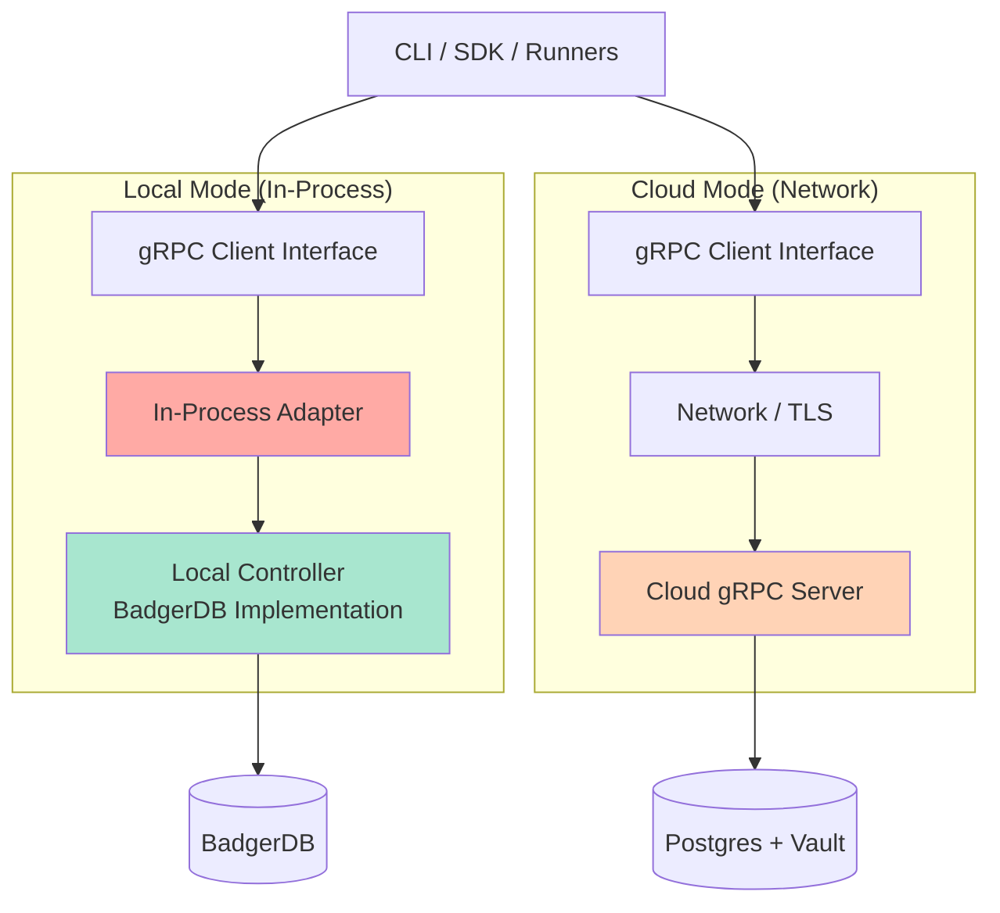

# gRPC Service Architecture

Stigmer's architecture ensures feature parity between local (BadgerDB) and cloud modes by using gRPC service interfaces as the single source of truth.

## Design Philosophy

**Core Principle**: The same CLI commands, SDK code, and workflow definitions must work identically in both local and cloud modes.

This is achieved through a strict Protobuf contract where both local and cloud implementations provide the same gRPC services.

## Architecture



**Key Insight**: Both modes use the exact same gRPC client interface. The difference is:
- **Local Mode**: gRPC client connects to local daemon on `localhost:50051` (daemon holds BadgerDB file lock)
- **Cloud Mode**: gRPC client connects over network to cloud servers

**Why a Daemon for Local Mode?**

BadgerDB (like BoltDB) allows only one process to hold the database file lock at a time. Since both the CLI and the Agent Runner (Python) need database access, we use a lightweight daemon:

1. **Daemon (`stigmer local start`)**: Opens BadgerDB, listens on `localhost:50051`
2. **CLI**: Connects to `localhost:50051` for all database operations
3. **Agent Runner (Python)**: Connects to `localhost:50051` via gRPC

This ensures safe concurrent access without file lock conflicts.

## gRPC Service Contracts

Each API resource defines its own gRPC services in the `apis/` directory:

### Example: Agent Services

```protobuf
// apis/ai/stigmer/agentic/agent/v1/command.proto
service AgentCommandController {
  rpc apply(Agent) returns (Agent);
  rpc create(Agent) returns (Agent);
  rpc update(Agent) returns (Agent);
  rpc delete(AgentId) returns (Agent);
}

// apis/ai/stigmer/agentic/agent/v1/query.proto
service AgentQueryController {
  rpc get(AgentId) returns (Agent);
  rpc getByReference(ApiResourceReference) returns (Agent);
}
```

### Why This Pattern?

1. **Single Contract**: Protobuf is the only source of truth - no parallel Go/Python interfaces
2. **Type Safety**: Compile-time validation of request/response structures
3. **Language Agnostic**: Go and Python SDKs use the same definitions
4. **No Drift**: Interface changes force updates to both local and cloud implementations

## Implementation Patterns

### Local Mode: In-Process Adapter

**The "Trick"**: Implement the gRPC *server* interface, but call it directly without a network.

```go
// Local controller implements the gRPC server interface
type LocalAgentController struct {
    db *badger.DB
    agentpb.UnimplementedAgentCommandControllerServer
}

func (s *LocalAgentController) Create(ctx context.Context, req *agentpb.Agent) (*agentpb.Agent, error) {
    // Direct BadgerDB operations
    id := generateID("agt")
    specJSON, _ := json.Marshal(req.Spec)
    
    _, err := s.db.ExecContext(ctx, `
        INSERT INTO agents (id, name, spec, created_at)
        VALUES (?, ?, ?, datetime('now'))
    `, id, req.Metadata.Name, specJSON)
    
    if err != nil {
        return nil, fmt.Errorf("failed to create agent: %w", err)
    }
    
    req.Metadata.Id = id
    return req, nil
}
```

**The Adapter**: Satisfies the gRPC client interface but calls the server directly.

```go
type AgentClientAdapter struct {
    server agentpb.AgentCommandControllerServer
}

func (a *AgentClientAdapter) Create(ctx context.Context, in *agentpb.Agent, opts ...grpc.CallOption) (*agentpb.Agent, error) {
    // Direct function call - no network!
    return a.server.Create(ctx, in)
}
```

### Cloud Mode: Network gRPC

**Implementation**: Standard gRPC client connecting to remote server.

```go
// Cloud mode uses standard gRPC over network
conn, err := grpc.Dial("api.stigmer.io:443", 
    grpc.WithTransportCredentials(credentials.NewTLS(&tls.Config{})),
    grpc.WithPerRPCCredentials(oauth.NewOauthAccess(token)),
)

client := agentpb.NewAgentCommandControllerClient(conn)
agent, err := client.Create(ctx, &agentpb.Agent{...})
```

The cloud service handles multi-tenancy, IAM, and distributed storage.

## Client Factory Pattern

The CLI and runners use a factory to create the appropriate client:

```go
// Factory returns the same client interface for both modes
func NewAgentClient(cfg *Config) (agentpb.AgentCommandControllerClient, error) {
    switch cfg.Backend.Type {
    case "local":
        // In-process: No network, direct calls
        db, err := badger.Open(badger.DefaultOptions(cfg.Backend.Local.DBPath))
        if err != nil {
            return nil, err
        }
        
        controller := &local.LocalAgentController{db: db}
        return &adapter.AgentClientAdapter{server: controller}, nil
        
    case "cloud":
        // Network: Standard gRPC
        conn, err := grpc.Dial(cfg.Backend.Cloud.Endpoint,
            grpc.WithTransportCredentials(credentials.NewTLS(&tls.Config{})),
        )
        if err != nil {
            return nil, err
        }
        
        return agentpb.NewAgentCommandControllerClient(conn), nil
        
    default:
        return nil, fmt.Errorf("unknown backend type: %s", cfg.Backend.Type)
    }
}
```

**Usage** (identical for both modes):

```go
// Load configuration
cfg := loadConfig() // Reads ~/.stigmer/config.yaml

// Create client (local or cloud)
client, err := NewAgentClient(cfg)
if err != nil {
    log.Fatalf("Failed to create client: %v", err)
}

// Use client (same code for both modes!)
agent, err := client.Create(ctx, &agentpb.Agent{
    Metadata: &apipb.ApiResourceMetadata{
        Name: "support-bot",
    },
    Spec: &agentpb.AgentSpec{
        Instructions: "You are a helpful assistant",
    },
})
```

## Configuration

Backend selection is determined by `~/.stigmer/config.yaml`:

### Local Mode

```yaml
backend:
  type: local
  local:
    db_path: ~/.stigmer/local.db
```

### Cloud Mode

```yaml
backend:
  type: cloud
  cloud:
    endpoint: api.stigmer.io:443
    token: stg_xxxxxxxxxxxxxxxxxxxxxxxx
    organization: my-org
```

## Feature Parity Guarantees

### ✅ Guaranteed Parity

These features work identically in both modes because they use the same gRPC interface:

- Agent CRUD operations (create, get, update, delete)
- Workflow CRUD operations
- Execution lifecycle management
- Resource queries and listing
- MCP server integration

### ⚠️ Local Mode Simplifications

Local mode **ignores** these Proto annotations (single-user trusted mode):

- `(rpcauthorization.config)` - No IAM checks
- Organization scoping - Implicit single organization
- Multi-tenancy fields - Single user context

### ❌ Cloud-Only Features

These features require cloud infrastructure:

- Web console access
- Multi-user collaboration
- Distributed IAM policies
- Distributed execution across regions
- Enterprise support and SLAs

## API Resource Services

Each API resource type has its own pair of gRPC services:

| Resource | Command Service | Query Service |
|----------|----------------|---------------|
| Agent | `AgentCommandController` | `AgentQueryController` |
| Workflow | `WorkflowCommandController` | `WorkflowQueryController` |
| AgentExecution | `AgentExecutionCommandController` | `AgentExecutionQueryController` |
| WorkflowExecution | `WorkflowExecutionCommandController` | `WorkflowExecutionQueryController` |
| Environment | `EnvironmentCommandController` | `EnvironmentQueryController` |
| Session | `SessionCommandController` | `SessionQueryController` |
| Skill | `SkillCommandController` | `SkillQueryController` |

**Pattern**: Each resource has:
- `command.proto` - Write operations (create, update, delete, apply)
- `query.proto` - Read operations (get, list, search)
- `api.proto` - Resource definition (message types)
- `spec.proto` - Resource specification
- `status.proto` - Resource status (where applicable)

## Testing Strategy

Both implementations pass the same test suite:

```go
func TestAgentOperations(t *testing.T) {
    clients := []struct {
        name   string
        client agentpb.AgentCommandControllerClient
    }{
        {"Local", setupLocalClient(t)},
        {"Cloud", setupCloudClient(t)},
    }
    
    for _, tc := range clients {
        t.Run(tc.name, func(t *testing.T) {
            // Test Create
            agent, err := tc.client.Create(ctx, &agentpb.Agent{
                Metadata: &apipb.ApiResourceMetadata{Name: "test-agent"},
                Spec:     &agentpb.AgentSpec{Instructions: "test"},
            })
            assert.NoError(t, err)
            assert.NotEmpty(t, agent.Metadata.Id)
            
            // Test Get
            retrieved, err := queryClient.Get(ctx, &agentpb.AgentId{
                Value: agent.Metadata.Id,
            })
            assert.NoError(t, err)
            assert.Equal(t, agent.Metadata.Id, retrieved.Metadata.Id)
        })
    }
}
```

If a test passes for one implementation, it must pass for the other.

## Adding New Operations

To add a new operation to an existing resource:

1. **Update the proto** (e.g., `apis/ai/stigmer/agentic/agent/v1/command.proto`):
   ```protobuf
   rpc archive(AgentId) returns (Agent);
   ```

2. **Regenerate code**:
   ```bash
   make protos
   ```

3. **Implement in local backend**:
   ```go
   func (s *LocalAgentController) Archive(ctx context.Context, req *agentpb.AgentId) (*agentpb.Agent, error) {
       // BadgerDB implementation
   }
   ```

4. **Implement in cloud backend** (in private cloud repo)

5. **Update adapter** (automatically satisfies interface):
   ```go
   func (a *AgentClientAdapter) Archive(ctx context.Context, in *agentpb.AgentId, opts ...grpc.CallOption) (*agentpb.Agent, error) {
       return a.server.Archive(ctx, in)
   }
   ```

6. **Write tests** for both implementations

## Benefits of This Architecture

### ✅ No Network Stack in Local Mode

- **No port binding**: No "Allow incoming connections?" firewall prompts
- **No port conflicts**: No "Port 8080 already in use" errors
- **Instant startup**: No server initialization delay
- **Lower resource usage**: No network threads or buffers

### ✅ Single Source of Truth

- **Protobuf defines everything**: One contract for both modes
- **Compiler enforces parity**: Changes to proto force updates everywhere
- **No interface drift**: Impossible for local and cloud to diverge

### ✅ Natural Testing

- **Local as mock**: The local implementation doubles as a perfect integration test mock
- **Same test suite**: Both implementations run identical tests
- **Contract testing**: Proto validation ensures compatibility

## Trade-offs

### Binary Size

**Impact**: CLI binary includes BadgerDB and all local controller logic.

**Mitigation**: 
- Acceptable for modern systems (5-10 MB is reasonable)
- Can build cloud-only binary without local dependencies if needed

### Streaming Complexity

**Impact**: gRPC streaming (e.g., `stream AgentExecution`) requires channels/pipes in adapter.

**Mitigation**:
- Use Go channels to simulate streaming
- Most operations are request/response, not streaming
- Streaming is valuable enough to justify the complexity

---

This architecture is the foundation of Stigmer's Open Core model. It allows developers to start local with BadgerDB and scale to cloud with gRPC without changing a single line of application code.
