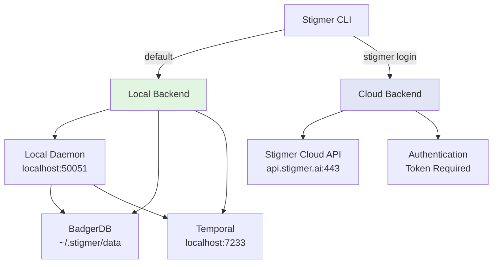

# Backend Modes: Local vs Cloud

Stigmer CLI supports two backend modes for managing resources: **local** (default) and **cloud** (opt-in). This architecture is inspired by Pulumi's approach while adding automatic daemon management.

## Overview



## Quick Comparison

| Aspect | Local Backend (Default) | Cloud Backend (Opt-in) |
|--------|------------------------|------------------------|
| **Configuration** | Zero config | Requires `stigmer login` |
| **Organization** | Constant `"local"` | User-provided org ID |
| **Authentication** | None | Token-based |
| **Daemon** | Auto-started | Not used (remote API) |
| **Storage** | BadgerDB (`~/.stigmer/data`) | Stigmer Cloud |
| **Network** | localhost:50051 | api.stigmer.ai:443 |
| **TLS** | Insecure (localhost) | TLS + auth token |
| **Collaboration** | Single user | Teams, RBAC |
| **Best For** | Development, learning | Production, teams |

## Local Backend (Default)

### Architecture

**Components:**
- **Stigmer CLI** - User interface
- **Local Daemon** (stigmer-server) - gRPC server on localhost:50051
- **BadgerDB** - Embedded key-value store
- **Temporal** - Workflow orchestrator (auto-managed)
- **Agent Runner** - Python subprocess for agent execution

**Data Flow:**
```
┌─────────────┐
│ stigmer apply│
└──────┬──────┘
       │
       ↓ gRPC (insecure)
┌──────────────────┐
│ stigmer-server   │
│ localhost:50051  │
└───────┬──────────┘
        │
        ├─→ [BadgerDB]     ~/.stigmer/data/stigmer.db
        ├─→ [Temporal]     localhost:7233
        └─→ [Agent Runner] Python subprocess
```

### Zero Configuration

**Users just run**:
```bash
$ stigmer apply
```

**CLI automatically:**
1. ✅ Detects local backend mode (default)
2. ✅ Uses organization "local" (no config needed)
3. ✅ Checks if daemon is running
4. ✅ Auto-starts daemon if needed
5. ✅ Connects to localhost:50051
6. ✅ Deploys resources

### Auto-Start Daemon

**The magic that makes it "just work":**

```go
// EnsureRunning() in daemon/daemon.go
func EnsureRunning(dataDir string) error {
    // Already running? Fast path!
    if IsRunning(dataDir) {
        return nil
    }

    // Not running - start with progress display
    cliprint.PrintInfo("🚀 Starting local backend daemon...")
    progress := cliprint.NewProgressDisplay()
    progress.Start()
    defer progress.Stop()

    if err := StartWithOptions(dataDir, StartOptions{Progress: progress}); err != nil {
        return errors.Wrap(err, "failed to start daemon")
    }

    cliprint.PrintSuccess("✓ Daemon started successfully")
    return nil
}
```

**Called automatically before any backend operation:**

```go
// In apply.go
if cfg.Backend.Type == config.BackendTypeLocal {
    if err := daemon.EnsureRunning(dataDir); err != nil {
        return nil, nil, err
    }
}
```

### Organization Handling

**Local mode uses a constant organization:**

```go
case config.BackendTypeLocal:
    orgID = "local"
    cliprint.PrintInfo("Using local backend (organization: %s)", orgID)
```

**Why constant "local"?**
- ✅ Zero configuration for single-user development
- ✅ Clear distinction from cloud mode
- ✅ Follows Pulumi's local backend pattern
- ✅ No organization concept needed for local work

### Configuration

**Default config** (created automatically):

```yaml
backend:
  type: local
  local:
    endpoint: localhost:50051
    data_dir: ~/.stigmer/data
    llm:
      provider: ollama
      model: qwen2.5-coder:7b
      base_url: http://localhost:11434
    temporal:
      managed: true
      version: 1.5.1
      port: 7233
```

**User doesn't create this** - it's the default. They just run commands.

### First Run Experience

```bash
$ stigmer apply

ℹ Loading project configuration...
✓ Loaded Stigmer.yaml
ℹ   Project:  my-agent
ℹ   Runtime:  go
ℹ   Main:     main.go

ℹ Executing entry point to discover resources...
✓ Manifest loaded: 1 resource(s) discovered (1 agent(s), 0 workflow(s))

ℹ Using local backend (organization: local)
ℹ 🚀 Starting local backend daemon...
ℹ    This may take a moment on first run

✓ Using Ollama (no API key required)
⚙️  Initializing database...
🔧 Starting Temporal...
✓ Daemon started successfully

ℹ Connecting to backend...
✓ Connected to backend

ℹ Deploying agent 1/1: my-agent
✓ Deployed successfully!
```

**Startup time:**
- First run: 5-15 seconds (downloads Temporal, initializes database)
- Subsequent runs: < 1 second (daemon already running)

### Subsequent Runs

**If daemon is running:**

```bash
$ stigmer apply

ℹ Loading project configuration...
✓ Loaded Stigmer.yaml
ℹ Using local backend (organization: local)
ℹ Connecting to backend...         # ← Immediate, no startup
✓ Connected to backend

ℹ Deploying agent 1/1: my-agent
✓ Deployed successfully!
```

**Fast path** - Skips daemon startup entirely.

### When to Use Local Mode

✅ **Perfect for:**
- Development and testing
- Learning Stigmer
- Personal projects
- Rapid iteration
- Working offline
- Single-user scenarios

❌ **Not ideal for:**
- Team collaboration
- Production deployments
- Cross-machine access
- Centralized control

## Cloud Backend (Opt-In)

### Architecture

**Components:**
- **Stigmer CLI** - User interface
- **Stigmer Cloud API** - Remote gRPC API (api.stigmer.ai:443)
- **Authentication** - Token-based auth
- **Cloud Storage** - Centralized resource management

**Data Flow:**
```
┌─────────────┐
│ stigmer apply│
└──────┬──────┘
       │
       ↓ gRPC + TLS + Auth Token
┌──────────────────────┐
│ Stigmer Cloud API    │
│ api.stigmer.ai:443   │
└───────┬──────────────┘
        │
        ├─→ [PostgreSQL]  Cloud database
        ├─→ [Temporal Cloud] Managed workflow engine
        └─→ [Agent Cluster] Distributed agent execution
```

### Explicit Opt-In

**Users must authenticate:**

```bash
$ stigmer login
Enter your credentials:
  Email: user@company.com
  Password: ********

✓ Authenticated successfully
✓ Switched to cloud backend
```

**Then configure organization:**

```bash
$ stigmer context set --org acme-corp
✓ Organization set: acme-corp

$ stigmer apply  # Now uses cloud backend
```

### Organization Required

**Cloud mode requires explicit organization:**

```go
case config.BackendTypeCloud:
    if opts.OrgOverride != "" {
        orgID = opts.OrgOverride           // Flag has highest priority
    } else if stigmerConfig.Organization != "" {
        orgID = stigmerConfig.Organization // Stigmer.yaml
    } else if cfg.Backend.Cloud.OrgID != "" {
        orgID = cfg.Backend.Cloud.OrgID    // Context config
    } else {
        return fmt.Errorf("organization not set for cloud mode")
    }
```

**Why required?**
- ✅ Cloud mode is for teams - organization is meaningful
- ✅ Resources belong to organizations
- ✅ Access control (RBAC) based on organization
- ✅ Prevents accidental resource leakage

### Configuration

**After `stigmer login`:**

```yaml
backend:
  type: cloud
  cloud:
    endpoint: api.stigmer.ai:443
    token: stk_xxxxxxxxxxxxxxxxxxxx
    org_id: org-abc123
    env_id: env-prod
```

### When to Use Cloud Mode

✅ **Perfect for:**
- Team collaboration
- Production workloads
- Centralized resource management
- Access control and RBAC
- Audit trails
- Cross-machine access

❌ **Not ideal for:**
- Quick experimentation
- Offline work
- Learning Stigmer

## Switching Between Modes

### Local → Cloud

**Migrate to cloud when ready for collaboration:**

```bash
# 1. Log in to Stigmer Cloud
$ stigmer login

# 2. Set organization
$ stigmer context set --org acme-corp

# 3. Deploy (now uses cloud backend)
$ stigmer apply
```

**Your code doesn't change** - Only the backend changes.

### Cloud → Local

**Switch back to local for development:**

```bash
# 1. Logout from cloud
$ stigmer logout

# 2. Apply uses local backend automatically
$ stigmer apply
```

**Default is always local** - No explicit configuration needed.

### Explicit Mode Selection

**Force specific backend mode:**

```bash
# Use local backend even if logged in
$ stigmer backend set local

# Use cloud backend
$ stigmer backend set cloud
```

**Check current backend:**

```bash
$ stigmer backend status

Current backend: local
Database: ~/.stigmer/data/stigmer.db
Endpoint: localhost:50051
```

## Design Decisions

### Why Local by Default?

**Inspired by Pulumi's philosophy:**

Pulumi defaults to local backend (`file://~/.pulumi/`) because:
- ✅ Zero onboarding friction
- ✅ No account/auth required
- ✅ Works offline
- ✅ Fast iteration
- ✅ Cloud is opt-in when needed

**Stigmer follows the same pattern:**
- Default: `~/.stigmer/` local backend
- Upgrade path: `stigmer login` for cloud mode
- Clear separation: Local for development, cloud for teams

### Why Auto-Start Daemon?

**Industry patterns justify auto-start:**

**Docker Desktop:**
- `docker run` auto-starts Docker daemon
- Users accept startup delay for runtime services
- 🎯 Stigmer is also a runtime (workflows need Temporal)

**Minikube/Kind:**
- `minikube start` starts entire Kubernetes cluster
- Takes 30-60 seconds first time
- 🎯 Stigmer is a workflow orchestrator (similar complexity)

**Podman Machine (macOS):**
- Auto-starts VM when you run `podman` commands
- "Starting machine..." with progress bar
- 🎯 Stigmer shows similar progress UI

**Why NOT auto-start?**
- ❌ **Pulumi doesn't** - But Pulumi is just state management (no runtime)
- ❌ **Might surprise users** - But Docker/Minikube do it successfully

**Decision:** Auto-start (like Docker) because Stigmer is a workflow runtime, not just state management.

### Why Constant "local" Organization?

**Alternatives considered:**

1. **User-provided organization** (old broken behavior):
   - ❌ Friction for local development
   - ❌ Doesn't match Pulumi pattern
   - ✅ Explicit configuration

2. **Derived from directory** (like Pulumi stacks):
   - ❌ Inconsistent across projects
   - ❌ Doesn't map to Stigmer's organization concept
   - ✅ Project-specific

3. **Constant "local"** (chosen):
   - ✅ Zero configuration
   - ✅ Clear local vs cloud distinction
   - ✅ Matches Pulumi's local backend pattern
   - ❌ Not customizable (but doesn't need to be)

**Rationale:**
- Local mode is single-user development
- Organization concept only matters in cloud mode (team collaboration)
- Constant value clearly distinguishes local mode resources
- Users can't accidentally mix local and cloud resources

## Code Integration

### Backend Mode Detection

```go
// In apply.go
cfg, err := config.Load()
if err != nil {
    return nil, nil, err
}

switch cfg.Backend.Type {
case config.BackendTypeLocal:
    // Local mode: auto-start daemon, use "local" org
    orgID = "local"
    if err := daemon.EnsureRunning(dataDir); err != nil {
        return nil, nil, err
    }

case config.BackendTypeCloud:
    // Cloud mode: require organization, no daemon
    if orgID == "" {
        return nil, nil, fmt.Errorf("organization not set for cloud mode")
    }

default:
    return nil, nil, fmt.Errorf("unknown backend type: %s", cfg.Backend.Type)
}
```

### Connection Handling

```go
// In backend/client.go
func NewClient(cfg *config.Config) (*Client, error) {
    var endpoint string
    var isCloud bool
    var token string

    switch cfg.Backend.Type {
    case config.BackendTypeLocal:
        endpoint = cfg.Backend.Local.Endpoint
        if endpoint == "" {
            endpoint = "localhost:50051"
        }
        isCloud = false

    case config.BackendTypeCloud:
        endpoint = cfg.Backend.Cloud.Endpoint
        if endpoint == "" {
            endpoint = "api.stigmer.ai:443"
        }
        token = cfg.Backend.Cloud.Token
        isCloud = true
    }

    return &Client{
        endpoint: endpoint,
        isCloud:  isCloud,
        token:    token,
    }, nil
}
```

### Transport Security

```go
// In backend/client.go Connect()
if c.isCloud {
    // Cloud mode: Use TLS
    creds := credentials.NewClientTLSFromCert(nil, "")
    opts = append(opts, grpc.WithTransportCredentials(creds))

    // Add auth token interceptor
    if c.token != "" {
        opts = append(opts, grpc.WithUnaryInterceptor(c.authInterceptor))
    }
} else {
    // Local mode: Insecure (localhost)
    opts = append(opts, grpc.WithTransportCredentials(insecure.NewCredentials()))
}
```

## Future Enhancements

### Planned Improvements

1. **Auto-start for other commands**
   - `stigmer run` (workflow execution)
   - `stigmer agent list` (agent queries)
   - Any command requiring backend connection

2. **Daemon health monitoring**
   - Periodic health checks
   - Auto-restart on crash
   - Better readiness detection

3. **Startup optimization**
   - Cache Temporal runtime
   - Parallel initialization
   - Reduce first-run time from 15s → 5s

4. **Migration tools**
   - `stigmer migrate local-to-cloud`
   - Export local resources
   - Import to cloud backend

5. **Hybrid mode**
   - Local daemon with cloud sync
   - Offline-capable cloud backend
   - Best of both worlds

## Summary

### Local Backend
- ✅ Default mode
- ✅ Zero configuration
- ✅ Auto-start daemon
- ✅ Organization = "local"
- ✅ Perfect for development

### Cloud Backend
- ✅ Explicit opt-in via `stigmer login`
- ✅ Organization required
- ✅ Team collaboration
- ✅ No daemon (remote API)
- ✅ Perfect for production

### Key Principles
1. **Local-first** - Default to local backend (like Pulumi)
2. **Auto-start** - Just works (like Docker)
3. **Progressive disclosure** - Simple start, powerful later
4. **Clear separation** - Local vs cloud is explicit
5. **Zero friction** - No manual daemon management

---

**Remember:** Stigmer makes local development effortless while providing a clear path to cloud collaboration when needed.
