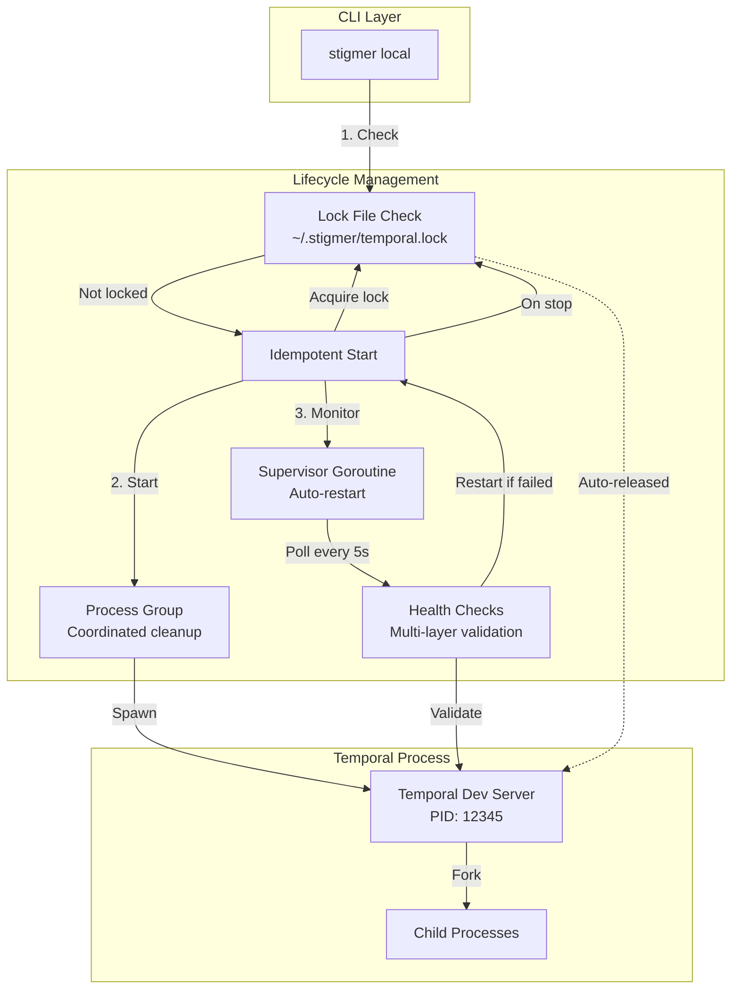
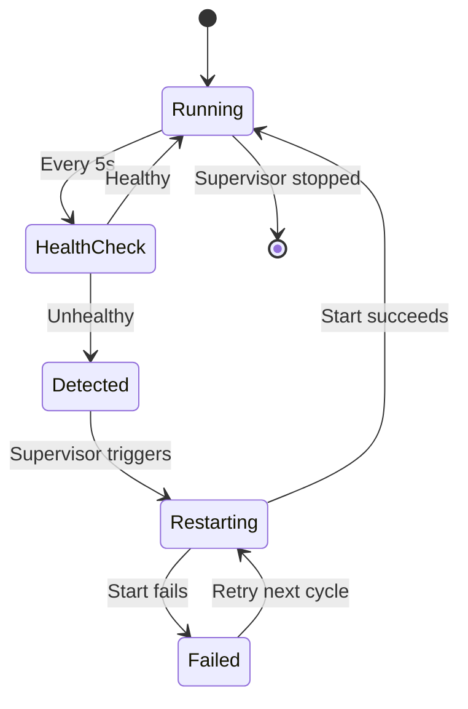

# CLI Subprocess Lifecycle Management

## Overview

The Stigmer CLI manages long-running background processes (notably Temporal dev server) with production-grade lifecycle management patterns: process groups, health checks, lock files, supervisor patterns, and idempotent operations.

This document explains the architectural decisions and implementation patterns that make `stigmer local` reliable and crash-resistant.

## Problem Statement

**Challenge**: Managing subprocess lifecycles is complex with many failure modes:

1. **Stale state detection** - How do we know if a background process is actually running?
2. **Crash recovery** - What happens when a subprocess dies unexpectedly?
3. **Concurrent access** - How do we prevent multiple instances from starting?
4. **Orphaned processes** - How do we clean up child processes when parent dies?
5. **PID reuse** - How do we handle OS reusing PIDs after process death?

**Traditional approaches fall short:**
- Simple PID files become stale after crashes
- No automatic crash recovery
- Race conditions during concurrent starts
- Orphaned child processes survive parent death
- Manual cleanup required after failures

## Architecture Overview

The solution combines five production-grade patterns:



## Pattern 1: Lock File-Based Concurrency Control

### Implementation

**Lock file with OS-level guarantees:**

```go
// ~/.stigmer/temporal.lock
func (m *Manager) acquireLock() error {
    fd, err := os.OpenFile(lockFile, os.O_CREATE|os.O_RDWR, 0644)
    if err != nil {
        return err
    }
    
    // Try to acquire exclusive non-blocking lock
    err = syscall.Flock(fd.Fd(), syscall.LOCK_EX | syscall.LOCK_NB)
    if err != nil {
        fd.Close()
        if err == syscall.EWOULDBLOCK {
            return errors.New("Temporal is already running")
        }
        return err
    }
    
    m.lockFd = fd  // Hold lock until process dies
    return nil
}
```

### Why Lock Files Over PID Files?

| Aspect | PID File | Lock File (flock) |
|--------|----------|-------------------|
| **Stale files** | Remain after crash | Auto-released by OS |
| **Atomicity** | Check-and-write is racy | Kernel-enforced atomic |
| **PID reuse** | Vulnerable to false positives | Lock tied to process, not PID |
| **Detection speed** | O(n) - must inspect process | O(1) - instant lock check |
| **Concurrency** | Race conditions possible | Kernel guarantees exclusivity |
| **Crash recovery** | Requires cleanup logic | Automatic, no intervention |

### Key Properties

1. **Atomic acquisition** - Kernel enforces exclusivity, no race conditions
2. **Auto-release on death** - OS releases lock when process dies (no stale locks)
3. **Instant detection** - O(1) check via `flock` attempt, no process inspection
4. **PID-independent** - Lock tied to process, not PID number (no reuse issues)

### Usage Pattern

```go
// Start flow
func (m *Manager) Start() error {
    // Fast path: Check lock first (source of truth)
    if m.isLocked() {
        return nil  // Already running, idempotent
    }
    
    // Acquire lock before starting
    if err := m.acquireLock(); err != nil {
        return err  // Lock held by another process
    }
    defer func() {
        if err != nil {
            m.releaseLock()  // Release on failure
        }
    }()
    
    // Start process...
    // Lock held until Stop() or process death
}
```

## Pattern 2: Multi-Layer Health Validation

### Implementation

Five layers of validation ensure accurate "is running" detection:

```go
func (m *Manager) IsRunning() bool {
    // Layer 1: Lock file (most reliable, fastest)
    if !m.isLocked() {
        return false
    }
    
    // Layer 2: PID file exists and readable
    pid, err := m.getPID()
    if err != nil {
        return false
    }
    
    // Layer 3: Process exists and is alive
    err = syscall.Kill(pid, 0)  // Signal 0 = check existence
    if err != nil {
        return false
    }
    
    // Layer 4: Process is actually Temporal (not PID reuse)
    if !m.isActuallyTemporal(pid) {
        return false
    }
    
    // Layer 5: Temporal port is listening
    if !m.isPortInUse() {
        return false
    }
    
    return true  // All checks passed
}
```

### Layer Details

**Layer 1: Lock File** (Source of Truth)
- Fastest check (O(1))
- OS-level guarantee
- No PID reuse issues

**Layer 2: PID File**
- Read PID, command name, timestamp
- Enhanced format for debugging

**Layer 3: Process Existence**
- `syscall.Kill(pid, 0)` to verify process alive
- Platform-independent check

**Layer 4: Process Verification**
- Inspect process command via `ps`
- Prevent false positives from PID reuse
- Verify executable path matches

**Layer 5: Port Health**
- TCP probe to Temporal port (7233)
- Confirms process is functional, not just alive

### Defense in Depth

- **Lock alone** could fail if lock file corrupted
- **PID alone** vulnerable to PID reuse
- **Process check alone** doesn't verify functionality
- **Port alone** doesn't identify process

**Together**: Robust detection with no false positives.

## Pattern 3: Process Group Management

### Implementation

```go
func (m *Manager) Start() error {
    cmd := exec.Command(temporalBinary, args...)
    
    // Set up process group
    cmd.SysProcAttr = &syscall.SysProcAttr{
        Setpgid: true,  // Create new process group
    }
    
    cmd.Start()
    // PID == PGID (process group leader)
}
```

### Why Process Groups?

**Problem**: Temporal forks child processes (database, UI). Killing parent doesn't kill children → orphaned processes.

**Solution**: Process groups allow killing entire subtree:

```go
func (m *Manager) Stop() error {
    // Negative PID = send to entire process group
    syscall.Kill(-pid, syscall.SIGTERM)  // Graceful
    
    // If needed:
    syscall.Kill(-pid, syscall.SIGKILL)  // Force
}
```

### Benefits

1. **Coordinated cleanup** - One signal kills all children
2. **No orphans** - All subprocesses cleaned up
3. **Graceful shutdown** - SIGTERM allows cleanup
4. **Force kill fallback** - SIGKILL ensures termination

## Pattern 4: Idempotent Start

### Implementation

```go
func (m *Manager) Start() error {
    // Check lock file first (fastest path)
    if m.isLocked() {
        log.Info("Already running - reusing")
        return nil  // Success, not error
    }
    
    // Cleanup stale processes if any
    m.cleanupStaleProcesses()
    
    // Verify actually running (multi-layer)
    if m.IsRunning() {
        log.Info("Already running - verified healthy")
        return nil
    }
    
    // Start new instance
    // ...
}
```

### Why Idempotency?

**User expectation**: Running `stigmer local` multiple times should "just work"

**Implementation**:
1. **Fast path**: Lock check (instant, no process inspection)
2. **Cleanup**: Remove stale PID files, kill orphaned processes
3. **Deep check**: Multi-layer validation
4. **Start**: Only if not running

**Result**: No "already running" errors, automatic recovery from stale state.

## Pattern 5: Supervisor Auto-Restart

### Implementation

```go
type Supervisor struct {
    manager *Manager
    ctx     context.Context
    cancel  context.CancelFunc
    ticker  *time.Ticker
}

func (s *Supervisor) Start() {
    s.ticker = time.NewTicker(5 * time.Second)
    
    go func() {
        for {
            select {
            case <-s.ticker.C:
                // Health check
                if !s.manager.IsRunning() {
                    log.Warn("Temporal unhealthy - restarting")
                    s.manager.Start()  // Idempotent restart
                }
            case <-s.ctx.Done():
                return  // Clean shutdown
            }
        }
    }()
}
```

### Auto-Restart Flow



### Graceful Degradation

- **On restart failure**: Log error, retry next health check
- **On supervisor shutdown**: Stop health checks before killing process
- **No restart during shutdown**: Prevents restart during `stigmer local stop`

## Integration Example

**Complete lifecycle with all patterns:**

```bash
# User runs stigmer local
stigmer local
```

**What happens:**

1. **Lock Check** (Pattern 1)
   - Try acquire `~/.stigmer/temporal.lock`
   - If locked → return success (already running)

2. **Cleanup** (Pattern 2)
   - Check PID file
   - If stale → remove
   - If process exists but unhealthy → kill

3. **Start** (Pattern 3, 4)
   - Acquire lock (atomic)
   - Start Temporal in process group
   - Write PID file (for debugging)
   - Wait for health (port listening)

4. **Monitor** (Pattern 5)
   - Start supervisor goroutine
   - Poll health every 5s
   - Auto-restart if unhealthy

**User runs `kill -9 <temporal-pid>`:**

1. **Lock released** (OS guarantee - Pattern 1)
2. **Supervisor detects** (next health check - Pattern 5)
3. **Automatic restart** (Pattern 4 - idempotent)
4. **Lock reacquired** (Pattern 1)
5. **Process group started** (Pattern 3)

**User runs `stigmer local stop`:**

1. **Stop supervisor** (no restart during shutdown)
2. **Send SIGTERM** to process group (graceful)
3. **Wait up to 10s** for clean exit
4. **Send SIGKILL** if needed (force)
5. **Release lock** (explicit cleanup)
6. **Remove PID file** (optional, for debugging)

## Benefits Summary

**For Users:**
- ✅ Reliable: No "already running" errors from stale state
- ✅ Self-healing: Automatic restart on crash
- ✅ Fast: Lock-based detection (1-2ms vs 10-20ms)
- ✅ Safe: Concurrent starts handled gracefully
- ✅ Clean: No manual cleanup required

**For System:**
- ✅ Atomic: Lock acquisition prevents race conditions
- ✅ Robust: Multi-layer validation catches all failure modes
- ✅ Clean: Process groups prevent orphans
- ✅ Resilient: Supervisor ensures uptime

**For Maintenance:**
- ✅ Simple: Leverage OS primitives (flock, process groups)
- ✅ Debuggable: PID file shows what holds lock
- ✅ Testable: Each pattern independently testable
- ✅ Production-ready: Patterns used in large-scale systems

## Design Trade-offs

### Why Keep PID File?

**Despite lock file being source of truth:**

- **Debugging**: Shows which process (PID) holds lock
- **Monitoring**: External tools can inspect process
- **Compatibility**: No breaking changes for existing tooling
- **Cost**: Minimal overhead to maintain both

### Why 5-Second Health Check?

**Alternatives considered:**

| Interval | Pros | Cons | Decision |
|----------|------|------|----------|
| 1s | Faster detection | Higher CPU | Too aggressive |
| 5s ✅ | Good balance | Slight delay | **Selected** |
| 30s | Low overhead | Slow recovery | Too slow |

**Rationale**: 5s balances responsiveness (users notice crash quickly) with efficiency (minimal CPU overhead).

### Why Not Use systemd/launchd?

**Platform-specific daemon managers are powerful but:**

- ❌ Not cross-platform (Linux vs macOS vs Windows)
- ❌ Requires external configuration
- ❌ Adds installation complexity
- ❌ Users must learn daemon manager

**Our approach:**

- ✅ Pure Go, cross-platform
- ✅ No external dependencies
- ✅ Self-contained in CLI binary
- ✅ Familiar command: `stigmer local`

## Testing Strategies

**Unit Tests:**
- Lock acquisition/release
- Health check layers individually
- Process group cleanup
- Idempotent start logic

**Integration Tests:**
- Full start/stop cycle
- Crash recovery (kill -9)
- Concurrent start attempts
- Stale state cleanup

**Manual Validation:**

```bash
# Test 1: Normal lifecycle
stigmer local
stigmer local stop
stigmer local

# Test 2: Crash recovery
stigmer local
kill -9 <temporal-pid>
# Wait 5s - should auto-restart

# Test 3: Concurrent start
stigmer local &
stigmer local &
# Both should succeed (idempotent)

# Test 4: Lock auto-release
stigmer local
kill -9 <temporal-pid>
lsof ~/.stigmer/temporal.lock  # Should be empty
stigmer local  # Should start without cleanup
```

See `_projects/.../task5-testing-guide.md` for comprehensive test scenarios.

## Future Enhancements

### Planned

1. **Multiple process management**
   - Extend pattern to agent-runner
   - Unified supervisor for all subprocesses
   - Coordinated health checks

2. **Metrics and observability**
   - Health check timing metrics
   - Restart count tracking
   - Crash pattern analysis

3. **Configurable health intervals**
   - User-configurable via env var
   - Adaptive intervals based on load

### Under Consideration

1. **Process resource limits**
   - CPU/memory limits for Temporal
   - Cgroup integration on Linux

2. **Graceful degradation modes**
   - Continue running if Temporal crashes
   - Queue operations for replay

3. **Advanced supervisor patterns**
   - Exponential backoff on repeated failures
   - Circuit breakers for persistent issues

## Related Documentation

- [Local Mode Getting Started](../getting-started/local-mode.md) - User-facing guide
- [Daemon Architecture ADR](../adr/20260118-190513-stigmer-local-deamon.md) - Architectural decisions
- [Temporal Integration](temporal-integration.md) - Workflow integration

## References

- Code: `client-apps/cli/internal/cli/temporal/manager.go`
- Code: `client-apps/cli/internal/cli/temporal/supervisor.go`
- Code: `client-apps/cli/internal/cli/daemon/daemon.go`
- Project: `_projects/2026-01/20260119.07.production-grade-temporal-lifecycle/`
- BSD flock(2): https://man.freebsd.org/cgi/man.cgi?flock(2)
- Process Groups: https://en.wikipedia.org/wiki/Process_group

---

**Remember**: Production-grade subprocess management requires combining multiple patterns. No single pattern solves all failure modes - defense in depth is essential.
