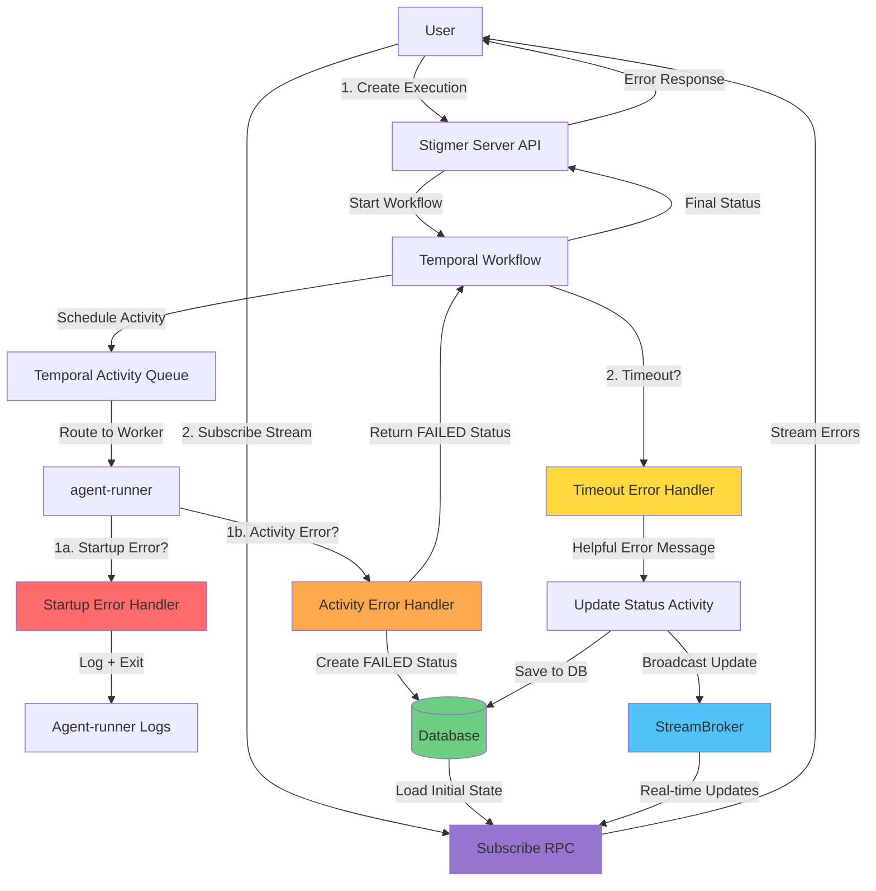
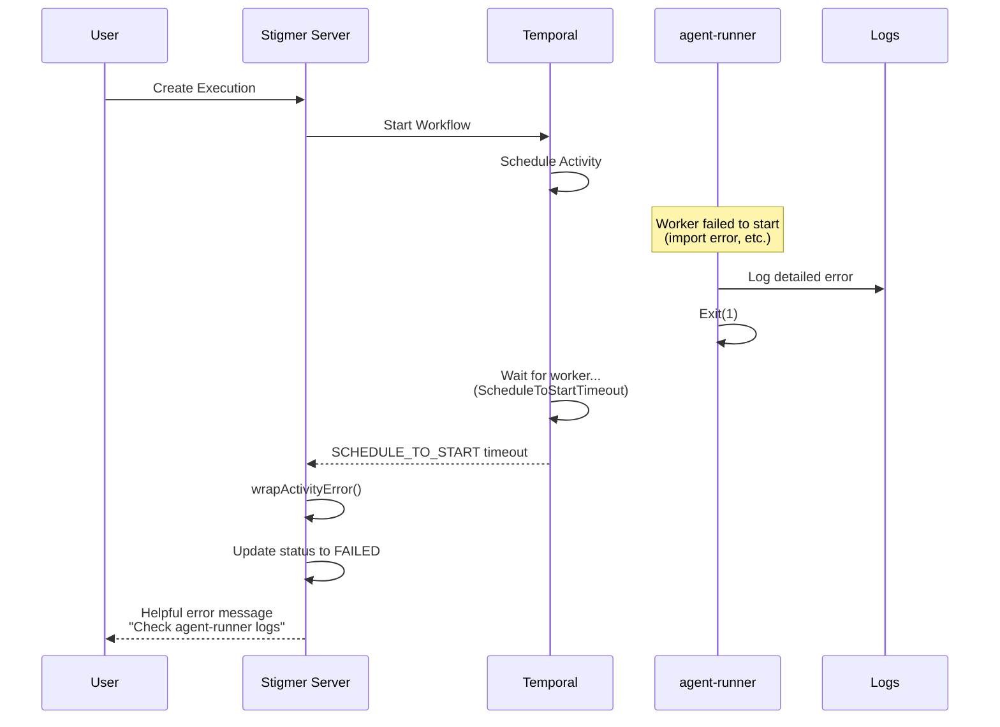
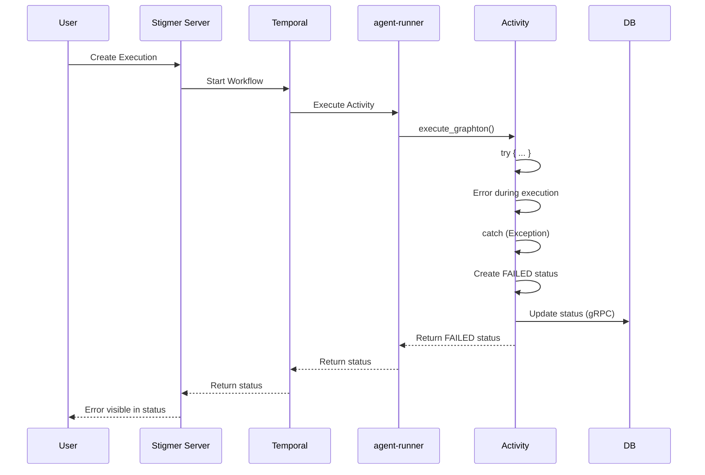
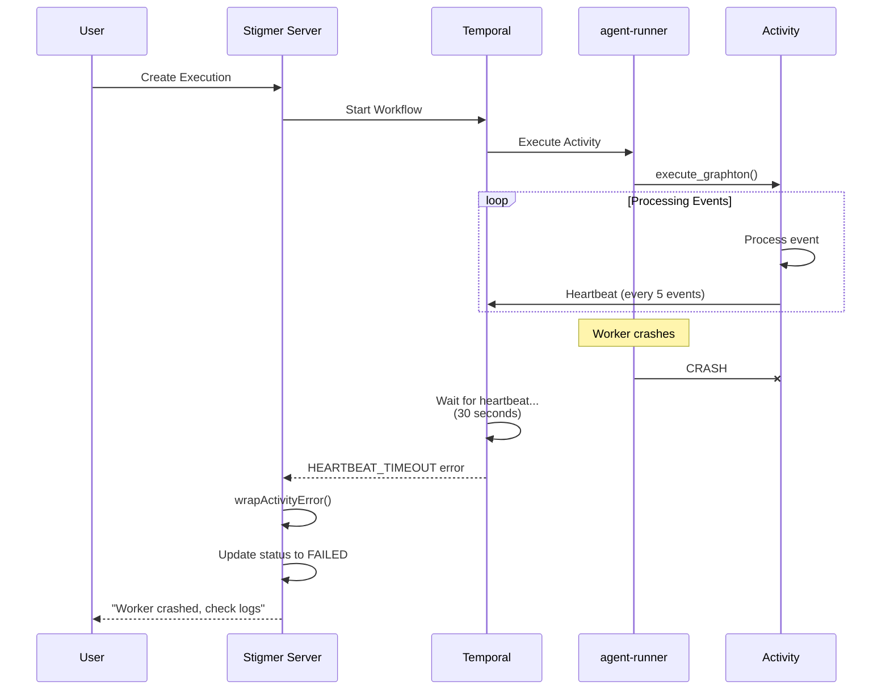
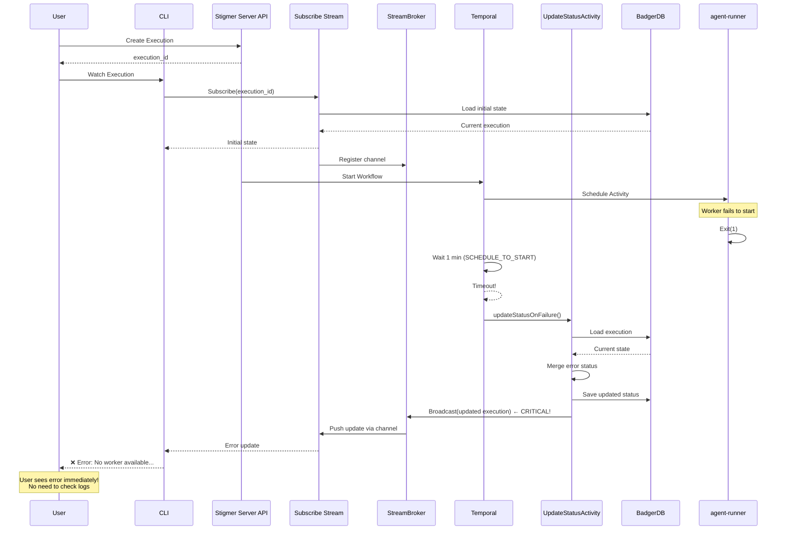

# Error Propagation Strategy

**Last Updated:** 2026-01-21 (StreamBroker broadcast added)

## Overview

This document describes how errors are propagated from execution runners (agent-runner/workflow-runner in Python/Go) to users through Temporal workflows and Stigmer server real-time streaming.

The error propagation strategy ensures that **all errors—whether they occur during worker startup, activity initialization, or execution—are visible to users in real-time through streaming subscriptions**, not just in logs or database.

## Error Categories

Errors can occur at different stages of the execution lifecycle:

### 1. Worker Startup Failures

**When:** agent-runner service fails to start before connecting to Temporal

**Examples:**
- Missing Python dependencies (e.g., `ImportError: cannot import name 'MultipartSegment'`)
- Redis connection failure (in cloud mode)
- Invalid configuration
- Temporal connection failure

**Propagation:**
- ✅ Error logged with detailed context in agent-runner logs
- ✅ Worker never registers with Temporal
- ✅ Workflow times out with `SCHEDULE_TO_START` timeout
- ✅ Workflow detects timeout and provides helpful error message to user
- ✅ Execution status updated to FAILED with error details

**User Experience:**
```
Failed to execute agent: No worker available to execute activity. 
This usually means:
1. agent-runner service is not running
2. agent-runner failed to start (check agent-runner logs for startup errors like import failures)
3. agent-runner is not connected to Temporal
```

### 2. Activity Initialization Errors

**When:** Python activity starts but fails during initialization (before main execution)

**Examples:**
- Failed to fetch agent configuration from gRPC
- Invalid API key
- Failed to initialize sandbox manager
- Missing environment variables

**Propagation:**
- ✅ Top-level error handler in `execute_graphton.py` catches error (lines 51-93)
- ✅ Creates FAILED status with system error messages
- ✅ Updates database via gRPC
- ✅ Returns failed status to workflow
- ✅ Workflow propagates to user

**User Experience:**
```
System error: Failed to connect to Stigmer backend
Internal system error occurred. Please contact support if this issue persists.
Error details: [actual error message]
```

### 3. Agent Execution Errors

**When:** Agent execution fails during runtime

**Examples:**
- Graphton agent crashes
- LLM API failure
- Sandbox operation failure
- Tool execution error

**Propagation:**
- ✅ Execution-level error handler in `execute_graphton.py` catches error (lines 508-554)
- ✅ Adds error message to status
- ✅ Sets phase to EXECUTION_FAILED
- ✅ Updates database via gRPC
- ✅ Returns failed status to workflow
- ✅ Workflow propagates to user

**User Experience:**
```
❌ Error: Execution failed: [actual error message]
```

### 4. Worker Crash During Execution

**When:** agent-runner crashes or stops sending heartbeats mid-execution

**Examples:**
- Out of memory
- Segmentation fault
- Network partition
- Process killed

**Propagation:**
- ✅ Activity sends heartbeats every 5 events (see execute_graphton.py lines 425-433)
- ✅ Temporal detects missing heartbeat after 30 seconds
- ✅ Workflow receives HEARTBEAT_TIMEOUT error
- ✅ Workflow provides helpful error message
- ✅ Execution status updated to FAILED

**User Experience:**
```
Activity 'ExecuteGraphton' failed: Activity stopped sending heartbeat (worker may have crashed).
Check agent-runner logs for errors.
```

## Architecture



## Implementation Details

### 1. Enhanced Startup Error Logging

**File:** `backend/services/agent-runner/main.py`

```python
except Exception as e:
    logger.error(f"❌ Fatal error in worker: {e}", exc_info=True)
    logger.error("=" * 80)
    logger.error("STARTUP FAILURE: Activity Registration Error")
    logger.error("=" * 80)
    logger.error(f"Error: {e}")
    logger.error("Common causes:")
    logger.error("  - Missing Python dependencies (import errors)")
    logger.error("  - Temporal connection failure")
    logger.error("  - Activity implementation errors")
    logger.error("This error will prevent the worker from processing any activities.")
    logger.error("Check the stack trace above for the exact import or initialization error.")
    logger.error("=" * 80)
    sys.exit(1)
```

**Benefits:**
- Clear, structured error messages
- Hints about common causes
- Makes it obvious this is a blocking error
- Easy to find in logs with `STARTUP FAILURE` keyword

### 2. Activity Heartbeats

**File:** `backend/services/agent-runner/worker/activities/execute_graphton.py`

```python
# Send activity heartbeat every 5 events
if events_processed - last_heartbeat_sent >= heartbeat_interval:
    try:
        activity.heartbeat({
            "events_processed": events_processed,
            "messages": len(status_builder.current_status.messages),
            "tool_calls": len(status_builder.current_status.tool_calls),
            "phase": status_builder.current_status.phase,
        })
        last_heartbeat_sent = events_processed
    except Exception as e:
        activity_logger.debug(f"Heartbeat failed (event {events_processed}): {e}")
```

**Benefits:**
- Temporal knows the activity is alive and making progress
- If worker crashes, Temporal detects it within 30 seconds
- Heartbeat payload includes progress information for debugging

### 3. Activity Timeout Configuration

**File:** `backend/services/stigmer-server/pkg/domain/agentexecution/temporal/activities/execute_graphton.go`

```go
options := workflow.ActivityOptions{
    TaskQueue:              taskQueue,
    StartToCloseTimeout:    10 * time.Minute, // Max execution time
    ScheduleToStartTimeout: 1 * time.Minute,  // Max wait for worker
    HeartbeatTimeout:       30 * time.Second,  // Activity must send heartbeat every 30s
    RetryPolicy: &temporal.RetryPolicy{
        MaximumAttempts:    1, // No retries (not idempotent)
        InitialInterval:    10 * time.Second,
        BackoffCoefficient: 2.0,
    },
}
```

**Benefits:**
- `ScheduleToStartTimeout`: Detects when worker is not available
- `HeartbeatTimeout`: Detects when worker crashes mid-execution
- `StartToCloseTimeout`: Prevents runaway executions
- `MaximumAttempts: 1`: Prevents duplicate agent executions

### 4. Workflow Error Wrapping

**File:** `backend/services/stigmer-server/pkg/domain/agentexecution/temporal/workflows/invoke_workflow_impl.go`

```go
func (w *InvokeAgentExecutionWorkflowImpl) wrapActivityError(activityName string, err error) error {
    // SCHEDULE_TO_START timeout: Worker not available
    if workflow.IsScheduleToStartTimeoutError(err) {
        return fmt.Errorf(
            "activity '%s' failed: No worker available to execute activity. "+
            "This usually means:\n"+
            "1. agent-runner service is not running\n"+
            "2. agent-runner failed to start (check agent-runner logs for startup errors)\n"+
            "3. agent-runner is not connected to Temporal\n"+
            "Original error: %w",
            activityName, err,
        )
    }
    
    // HEARTBEAT timeout: Worker died mid-execution
    if workflow.IsHeartbeatTimeoutError(err) {
        return fmt.Errorf(
            "activity '%s' failed: Activity stopped sending heartbeat (worker may have crashed). "+
            "Check agent-runner logs for errors. "+
            "Original error: %w",
            activityName, err,
        )
    }
    
    // ... other error types ...
}
```

**Benefits:**
- User-friendly error messages
- Clear troubleshooting steps
- Distinguishes between different failure types
- Directs user to agent-runner logs for details

### 5. System Error Handler (Python Activity)

**File:** `backend/services/agent-runner/worker/activities/execute_graphton.py`

```python
@activity.defn(name="ExecuteGraphton")
async def execute_graphton(execution: AgentExecution, thread_id: str) -> AgentExecutionStatus:
    try:
        return await _execute_graphton_impl(...)
    except Exception as system_error:
        # Top-level error handler for system errors
        failed_status = AgentExecutionStatus(
            phase=ExecutionPhase.EXECUTION_FAILED,
            error=f"System error: {str(system_error)}",
            messages=[
                AgentMessage(
                    type=MessageType.MESSAGE_SYSTEM,
                    content="Internal system error occurred. Please contact support if this issue persists.",
                    timestamp=datetime.utcnow().isoformat(),
                ),
                AgentMessage(
                    type=MessageType.MESSAGE_SYSTEM,
                    content=f"Error details: {str(system_error)}",
                    timestamp=datetime.utcnow().isoformat(),
                )
            ]
        )
        
        # Update database (best effort)
        try:
            await execution_client.update_status(execution_id, failed_status)
        except Exception as update_error:
            activity_logger.error(f"Failed to update status: {update_error}")
        
        return failed_status
```

**Benefits:**
- Catches errors that occur before status_builder is initialized
- Creates valid failed status even when most of the activity hasn't run
- Updates database so user sees error immediately
- Returns failed status to workflow for observability

### 6. StreamBroker Real-Time Broadcast (Critical for User Visibility)

**Context:** The bug fixed on 2026-01-21 evening

When Temporal workflows detect errors and call `UpdateExecutionStatusActivity` to save errors to the database, that's only HALF the story. The database update alone doesn't make errors visible to users watching executions via `Subscribe()` streams.

**The Missing Piece (Bug):** 

Before the fix, `UpdateExecutionStatusActivity` only saved to database:
```go
// OLD CODE - Bug! No broadcast to subscribers
func (a *UpdateExecutionStatusActivityImpl) UpdateExecutionStatus(...) error {
    // 1. Load from DB
    // 2. Merge status updates
    // 3. Save to DB
    // 4. Return
    // ❌ NO BROADCAST - Users subscribed to this execution never see the error!
}
```

**The Fix:**

`UpdateExecutionStatusActivity` now broadcasts to StreamBroker after database save:

**Files:** 
- `backend/services/stigmer-server/pkg/domain/agentexecution/temporal/activities/update_status_impl.go`
- `backend/services/stigmer-server/pkg/domain/workflowexecution/temporal/activities/update_status_impl.go`

```go
// NEW CODE - Broadcasts to subscribers!
type UpdateExecutionStatusActivityImpl struct {
    store        *badger.Store
    streamBroker StreamBroker  // NEW: Injected via worker config
}

func (a *UpdateExecutionStatusActivityImpl) UpdateExecutionStatus(...) error {
    // 1. Load execution from BadgerDB
    existing := &agentexecutionv1.AgentExecution{}
    _ = a.store.GetResource(ctx, kind, executionID, existing)
    
    // 2. Merge status updates (phase, error, messages, etc.)
    status := existing.Status
    status.Phase = statusUpdates.Phase
    status.Error = statusUpdates.Error
    status.Messages = statusUpdates.Messages
    
    // 3. Save to BadgerDB
    _ = a.store.SaveResource(ctx, kind, executionID, existing)
    
    // 4. Broadcast to active subscribers ← NEW! Critical for user visibility
    if a.streamBroker != nil {
        a.streamBroker.Broadcast(existing)
        log.Debug().Str("execution_id", executionID).Msg("Broadcasted to subscribers")
    }
    
    return nil
}
```

**Dependency Injection (Server Startup):**

```go
// server.go - Create controllers BEFORE Temporal workers
agentExecutionController := NewAgentExecutionController(store, ...)
workflowExecutionController := NewWorkflowExecutionController(store, ...)

// Pass StreamBrokers to Temporal worker configs
agentWorkerConfig := NewWorkerConfig(
    config, 
    store, 
    agentExecutionController.GetStreamBroker(),  // ← Inject StreamBroker
)
workflowWorkerConfig := NewWorkerConfig(
    config, 
    store, 
    workflowExecutionController.GetStreamBroker(),  // ← Inject StreamBroker
)
```

**Two Code Paths (Now Both Broadcast):**

1. **Normal Execution** (runner sends progressive updates):
   ```
   runner → UpdateStatus RPC → BroadcastToStreamsStep → StreamBroker ✅
   ```

2. **Workflow Error Recovery** (workflow detects failure):
   ```
   Workflow → updateStatusOnFailure() → UpdateExecutionStatusActivity → Database + StreamBroker ✅
   ```

**Impact:**

Before fix:
- ❌ Database updated with error
- ❌ StreamBroker NOT notified
- ❌ Subscribed users never see error
- ❌ CLI hangs indefinitely
- ❌ Users must check server logs manually

After fix:
- ✅ Database updated with error
- ✅ StreamBroker broadcasts update
- ✅ All subscribers receive error immediately
- ✅ CLI displays error and exits cleanly
- ✅ Users see errors in real-time

**Affected Domains:**

Both execution domains had this bug and both are now fixed:
- ✅ Agent Execution (agent-runner failures)
- ✅ Workflow Execution (workflow-runner or workflow failures)

**Architecture Implication:**

Any code path that updates execution status MUST broadcast to StreamBroker:
- UpdateStatus RPC: ✅ Has BroadcastToStreamsStep
- UpdateExecutionStatusActivity (local activity): ✅ Now broadcasts (fixed)
- Future status update paths: ⚠️ Must broadcast or users won't see updates

**Benefits:**
- Users see ALL errors in real-time (not just in database/logs)
- Consistent error visibility across normal execution and error recovery
- Terminal states immediately end subscriptions
- No more hanging CLIs during failures
- Complete error propagation: detection → database → broadcast → user

## Error Flow Diagrams

### Startup Failure Flow



### Activity Execution Error Flow



### Heartbeat Timeout Flow



### Complete Error Propagation with Streaming (NEW)

This diagram shows the complete flow including the StreamBroker broadcast that makes errors visible to subscribed users:



**Key Points:**

1. **User subscribes BEFORE error occurs** - CLI calls Subscribe() immediately after creating execution
2. **StreamBroker manages Go channels** - In-memory pub/sub for real-time updates
3. **Activity broadcasts after DB save** - Critical step added in the fix (was missing before)
4. **User sees error immediately** - No polling, no delay, no need to check logs
5. **Works for ALL error types** - Startup failures, activity errors, heartbeat timeouts, etc.

## Testing Error Propagation

### 1. Test Worker Startup Failure

Simulate an import error:

```python
# In agent-runner/worker/worker.py, add at top:
raise ImportError("Test import error")
```

**Expected:**
- agent-runner logs show detailed startup failure
- Workflow times out with ScheduleToStart
- User sees: "No worker available... agent-runner failed to start"
- Execution status is FAILED

### 2. Test Activity Initialization Error

Simulate a configuration error:

```python
# In execute_graphton.py, at start of _execute_graphton_impl:
raise RuntimeError("Test configuration error")
```

**Expected:**
- Top-level error handler catches error
- FAILED status created with error details
- Database updated via gRPC
- User sees: "System error: Test configuration error"

### 3. Test Activity Execution Error

Simulate an agent execution error:

```python
# In execute_graphton.py, before streaming:
raise ValueError("Test agent execution error")
```

**Expected:**
- Execution-level error handler catches error
- FAILED status created with error message
- Database updated via gRPC
- User sees: "❌ Error: Execution failed: Test agent execution error"

### 4. Test Heartbeat Timeout

Simulate a worker crash:

```python
# In execute_graphton.py, in the event loop:
if events_processed == 10:
    os.kill(os.getpid(), signal.SIGKILL)
```

**Expected:**
- Activity sends heartbeats for first 10 events
- Worker crashes at event 10
- Temporal detects missing heartbeat after 30s
- User sees: "Activity stopped sending heartbeat (worker may have crashed)"
- Execution status is FAILED

## Comparison: Agent Execution vs Workflow Execution

Both agent execution and workflow execution now have complete error propagation:

| Feature | Agent Execution | Workflow Execution |
|---------|----------------|-------------------|
| Startup error logging | ✅ Enhanced | ✅ Enhanced |
| Activity heartbeats | ✅ Yes (5 events) | ✅ Yes |
| Heartbeat timeout | ✅ 30 seconds | ✅ 30 seconds |
| Error wrapping | ✅ Detailed | ✅ Detailed |
| System error handler | ✅ Top-level catch | ✅ Top-level catch |
| Database updates | ✅ Via gRPC | ✅ Via gRPC |
| **StreamBroker broadcast** | ✅ **Yes (fixed 2026-01-21)** | ✅ **Yes (fixed 2026-01-21)** |
| Real-time visibility | ✅ All subscribers | ✅ All subscribers |
| User-visible errors | ✅ All errors | ✅ All errors |

## Best Practices

### For Developers

1. **Always use the error handlers** - Don't add new error paths that bypass the handlers
2. **Always broadcast to StreamBroker** - Any code path updating execution status MUST broadcast
3. **Log before exiting** - Always log detailed errors before `sys.exit(1)`
4. **Send heartbeats** - For long-running activities, send heartbeats regularly
5. **Test error paths** - Regularly test that errors propagate correctly (including streaming)
6. **Update this document** - When adding new error types or status update paths, document them here

### For Operations

1. **Monitor agent-runner logs** - Use structured logging and search for `STARTUP FAILURE`
2. **Set up alerts** - Alert on repeated `SCHEDULE_TO_START` timeouts
3. **Check heartbeats** - Monitor for `HEARTBEAT_TIMEOUT` errors
4. **Correlate errors** - When users report errors, check both UI and agent-runner logs
5. **Version control** - Keep agent-runner and stigmer-server in sync

## Future Improvements

### 1. Pre-flight Health Checks

Before starting a workflow, check if agent-runner is healthy:

```go
// In workflow_creator.go
func (c *InvokeAgentExecutionWorkflowCreator) Create(execution *agentexecutionv1.AgentExecution) error {
    // Check if worker is available before starting workflow
    if !c.isWorkerHealthy() {
        return fmt.Errorf("agent-runner is not available")
    }
    
    // Start workflow...
}
```

**Benefits:**
- Fail fast if worker is down
- Better user experience (immediate error vs timeout)

### 2. Structured Error Codes

Add error codes for better error categorization:

```python
class ErrorCode(Enum):
    WORKER_STARTUP_FAILED = "E001"
    ACTIVITY_INIT_FAILED = "E002"
    AGENT_EXECUTION_FAILED = "E003"
    WORKER_CRASHED = "E004"
```

**Benefits:**
- Easier to search logs
- Better error analytics
- Clearer documentation references

### 3. Error Recovery Strategies

Implement automatic recovery for certain error types:

```python
if error.code == ErrorCode.TRANSIENT_NETWORK_ERROR:
    # Retry with exponential backoff
    return RetryableError(error)
```

**Benefits:**
- Fewer manual interventions
- Better resilience
- Improved user experience

## Related Documentation

- [Temporal Integration Architecture](temporal-integration.md)
- [Agent Runner Architecture](../services/agent-runner/README.md)
- [Workflow Execution Error Handling](workflow-execution-errors.md)

---

*This document describes the comprehensive error propagation strategy implemented on 2026-01-21 to ensure all errors—from worker startup to agent execution—are visible to users.*
